<a id="readme-top"></a>
# Nano Banana Pro/GPT-5/Grok/豆包 Image Prompts

🎉 欢迎来到 Nano Banana Pro/GPT-5/Grok/豆包 图片提示词（Prompts）精选！

🎉 提示词持续更新中。。。

🎉 在线演示地址：https://www.nanobananapro.site/prompts

## 🆕 项目改造说明
- 新增 `scripts/generate-dataset.js`，可将仓库内的 Markdown 案例自动解析为结构化的 `data/prompts.json` 数据集，包含来源、图片、提示词、示例、备注及自动生成的分类标签。
- 提供全新的前端页面（`index.html` + `assets/`），支持画廊浏览、标签筛选、关键字搜索、案例详情查看以及提示词一键复制。
- 如需更新数据，先维护 Markdown 文件，再运行 `node scripts/generate-dataset.js` 重新生成 JSON，最后通过任意静态服务器打开 `index.html` 即可体验（例如 `python3 -m http.server 8000`）。
- 画廊页面会自动聚合所有标签，可快速组合筛选；点击卡片进入详情，可查看全部示例图、提示词及备注。

## 获取最新提示词？你可以通过这3个渠道。
<div style="width: 98%;">
<table>
  <tr>
    <!-- 左侧文字单元格 -->
    <td style="width: 60%; padding: 2px; vertical-align: middle; border: none;">
      <p>1、微信公众号：松果先森</p>
      <p>2、我的X地址：https://x.com/Lee06253046</p>
      <p>3、扫一扫，拉你进大群《AI技术学习交流群》</p>
    </td>
    <!-- 右侧图片单元格 -->
    <td>
      
    </td>
  </tr>
</table>
</div>

<a id="prompt-toc"></a>
## 📖 案例目录
*   [案例 988：圣诞特辑-冷艳圣诞甜酷皆在方寸间 ](#prompt-988)
*   [案例 987：九宫格拼贴画 ](#prompt-987)
*   [案例 986：梦幻般的电影级增强现实视觉效果 ](#prompt-986)
*   [案例 985：沙与风产品摄影 ](#prompt-985)
*   [案例 984：角色拆解艺术海报 ](#prompt-984)
*   [案例 983：微型艺术家在巨大的人类指甲上作画 ](#prompt-983)
*   [案例 982：技术图纸展示板 ](#prompt-982)
*   [案例 981：童趣风格插画 ](#prompt-981)
*   [案例 980：涂鸦线条干刷色块 ](#prompt-980)
*   [案例 979：超逼真专业的夜间烟火表演 ](#prompt-979)
*   [案例 978：一张超写实的电影海报 ](#prompt-978)
*   [案例 977：运动少女照片 ](#prompt-977)
*   [案例 976：博物馆标本摄影 ](#prompt-976)
*   [案例 975：动漫风格的数字海报 ](#prompt-975)
*   [案例 974：圣诞特辑-蜜桃背景里的圣诞少女小心思 ](#prompt-974)
*   [案例 973：圣诞特辑-圣诞限定大头贴，9格甜度满格 ](#prompt-973)
*   [案例 972：圣诞特辑-美妆博主圣诞妆容教程界面 ](#prompt-972)
*   [案例 971：第一人称射击游戏视角 ](#prompt-971)
*   [案例 970：一个微缩场景模型 ](#prompt-970)
*   [案例 969：女子将食指向前伸出朝向相机镜头 ](#prompt-969)
*   [案例 968：年轻漂亮的双马尾女子 ](#prompt-968)
*   [案例 967：三联拼贴画描绘了女性的三个连续瞬间 ](#prompt-967)
*   [案例 966：建筑插画师为住宅制作的展示板 ](#prompt-966)
*   [案例 965：苹果iOS照片应用的图库网格视图 ](#prompt-965)
*   [案例 964：时髦的亚洲时尚博主 ](#prompt-964)
*   [案例 963：圣诞特辑-圣诞姜饼跨框投喂 ](#prompt-963)
*   [案例 962：圣诞特辑-圣诞小精灵 ](#prompt-962)
*   [案例 961：圣诞特辑-圣诞活动邀请卡 ](#prompt-961)
*   [案例 960：圣诞特辑-圣诞护肤品套装促销卡片 ](#prompt-960)
*   [案例 959：电影级的增强现实视觉效果 ](#prompt-959)
*   [案例 958：卡通风格钥匙扣 ](#prompt-958)
*   [案例 957：高端专业平铺式产品摄影 ](#prompt-957)
*   [案例 956：显示在2000年代初日本的手机屏幕上 ](#prompt-956)
*   [案例 955：3D橡胶软管角色设计 ](#prompt-955)
*   [案例 954：一张完整的产品高端宣传照 ](#prompt-954)
*   [案例 953：普通物体转化为巨型纪念碑 ](#prompt-953)
*   [案例 952：不同服装风格的贴纸 ](#prompt-952)
*   [案例 951：衣服悬浮在空中 ](#prompt-951)
*   [案例 950：圣诞特辑-我的圣诞与自己合拍 ](#prompt-950)
*   [案例 949：圣诞特辑-红韵点睛圣诞风尚志 ](#prompt-949)
*   [案例 948：圣诞特辑-圣诞四格甜妹 ](#prompt-948)
*   [案例 947：圣诞特辑-人物定格在奇幻巨型玻璃雪球里 ](#prompt-947)
*   [案例 946：指定年份的小玩意和发明可视化 ](#prompt-946)
*   [案例 945：将你最喜欢的角色变成收藏品 ](#prompt-945)
*   [案例 944：超逼真的Macbook屏幕视频会议图 ](#prompt-944)
*   [案例 943：五联宽幅胶片拼贴作品 ](#prompt-943)
*   [案例 942：植发一年的改变图 ](#prompt-942)
*   [案例 941：摆放着一个与本人相似的Q版模型 ](#prompt-941)
*   [案例 940：钢铁侠可口可乐 ](#prompt-940)
*   [案例 939：概念艺术杂志的编辑照片 ](#prompt-939)
*   [案例 938：女性正从她的手机屏幕中走出来 ](#prompt-938)
*   [案例 937：电影感十足的肖像摄影作品 ](#prompt-937)
*   [案例 936：卡通画变成 Funko Pop 乙烯基人偶 ](#prompt-936)
*   [案例 935：Y2K时代的拼贴海报 ](#prompt-935)
*   [案例 934：女性自拍照 ](#prompt-934)
*   [案例 933：女性在奔跑时腾空而起 ](#prompt-933)
*   [案例 932：电影般的时尚网格图 ](#prompt-932)
*   [案例 931：年轻女性的韩式时尚特写肖像 ](#prompt-931)
*   [案例 930：90年代复古黑白肖像照 ](#prompt-930)
*   [案例 929：女子面部的超近距离微距肖像 ](#prompt-929)
*   [案例 928：女士手持一个自己的木质相框 ](#prompt-928)
*   [案例 927：女性站在KAWS风格艺术雕塑旁 ](#prompt-927)
*   [案例 926：金发女子跪在游艇甲板上 ](#prompt-926)
*   [案例 925：健身房自拍照 ](#prompt-925)
*   [案例 924：电视新闻演播室现场 ](#prompt-924)
*   [案例 923：冬至海报 ](#prompt-923)
*   [案例 922：产品高端商业营销设计 ](#prompt-922)
*   [案例 921：MacBook Pro打开了X应用的照片 ](#prompt-921)
*   [案例 920：城市渲染数字艺术海报 ](#prompt-920)
*   [案例 919：丁香色长裙女性双版本比例对比 ](#prompt-919)
*   [案例 918：生成一周的服装搭配 ](#prompt-918)
*   [案例 917：用手指操纵自己的复制品 ](#prompt-917)
*   [案例 916：高端影棚肖像照 ](#prompt-916)
*   [案例 915：照片转换成漫画 ](#prompt-915)
*   [案例 914：复古风格照相亭 ](#prompt-914)
*   [案例 913：超逼真的 8K 街头抓拍肖像 ](#prompt-913)
*   [案例 912：垂直三格拼贴画 ](#prompt-912)
*   [案例 911：36 个穿着同一套衣服的不同人像 ](#prompt-911)
*   [案例 910：女生四宫格照片 ](#prompt-910)
*   [案例 909：精美杂志上的文章照片 ](#prompt-909)
*   [案例 908：标本盒与现实的穿搭美学双重奏 ](#prompt-908)
*   [案例 907：剪纸艺术 ](#prompt-907)
*   [案例 906：和影视剧中人物自拍 ](#prompt-906)
*   [案例 905：用中国奇幻书写世界名画 ](#prompt-905)
*   [案例 904：维多利亚哥特皇室写真照 ](#prompt-904)
*   [案例 903：提示词小子讽刺漫画 ](#prompt-903)
*   [案例 902：圣诞场景的圣诞贺卡 ](#prompt-902)
*   [案例 901：金发女子自拍照 ](#prompt-901)
*   [案例 900：都市街头服饰编辑拼贴画 ](#prompt-900)
*   [案例 899：中国四大节日美甲四宫格 ](#prompt-899)
*   [案例 898：高角度商业美食摄影照片 ](#prompt-898)
*   [案例 897：2x2网格拼贴画 ](#prompt-897)
*   [案例 896：橙汁上冲浪 ](#prompt-896)
*   [案例 895：Gemini 3 flash广告图 ](#prompt-895)
*   [案例 894：大唐盛世与巴黎写真照 ](#prompt-894)
*   [案例 893：9宫格产品展示 ](#prompt-893)
*   [案例 892：6X6产品多种风格 ](#prompt-892)
*   [案例 891：6X6风格和质量各异的产品图 ](#prompt-891)
*   [案例 890：女生铅笔素描画 ](#prompt-890)
*   [案例 889：微缩的品牌门店 ](#prompt-889)
*   [案例 888：将人物置身于9部电影的圣诞场景中 ](#prompt-888)
*   [案例 887：Q版人物九宫格 ](#prompt-887)
*   [案例 886：模特站在布满了无数黑白广告牌的地面上 ](#prompt-886)
*   [案例 885：人物站在一部超大的智能手机上 ](#prompt-885)
*   [案例 884：极简主义食物摄影作品 ](#prompt-884)
*   [案例 883：女子在一辆复古美式车内 ](#prompt-883)
*   [案例 882：微缩3D立体模型 ](#prompt-882)
*   [案例 881：墨水风格营造出梦幻般的诗意氛围 ](#prompt-881)
*   [案例 880：微缩世界与宏观食物 ](#prompt-880)
*   [案例 879：红墨水疯狂地加上手写中文批注 ](#prompt-879)
*   [案例 878：预判前后时间的画面 ](#prompt-878)
*   [案例 877：专业的知识信息图 ](#prompt-877)
*   [案例 876：朱迪站在雪桥上 ](#prompt-876)
*   [案例 875：北京7日天气预报-海报 ](#prompt-875)
*   [案例 874：真人版的9宫格照片 ](#prompt-874)
*   [案例 873：女生坐在瑞幸咖啡的冷饮杯子上 ](#prompt-873)
*   [案例 872：一生要出片的中国女人系列之故宫打卡 ](#prompt-872)
*   [案例 871：3x3网格皮克斯风格故事板 ](#prompt-871)
*   [案例 870：舞台场景上多名女性蹲着 ](#prompt-870)
*   [案例 869：女子漂浮在巨大的透明塑料水袋中 ](#prompt-869)
*   [案例 868：一款逼真的挂历 ](#prompt-868)
*   [案例 867：漫画中的人物走出画面 ](#prompt-867)
*   [案例 866：一张超写实的竖屏照片 ](#prompt-866)
*   [案例 865：包装设计 ](#prompt-865)
*   [案例 864：穿越时空的滤镜-老照片修复 ](#prompt-864)
*   [案例 863：老照片高清修复 ](#prompt-863)
*   [案例 862：一位面带微笑的人手持可口可乐铝罐 ](#prompt-862)
*   [案例 861：3D卡通风格角色 ](#prompt-861)
*   [案例 860：超逼真的物体云朵 ](#prompt-860)
*   [案例 859：一位美丽迷人的年轻女子 ](#prompt-859)
*   [案例 858：女子站在房间里的近距离自拍照 ](#prompt-858)
*   [案例 857：超逼真的3D商业风格产品图 ](#prompt-857)
*   [案例 856：提线木偶 ](#prompt-856)
*   [案例 855：剪纸风格的珠江新城 ](#prompt-855)
*   [案例 854：商业广告拍摄现场 ](#prompt-854)
*   [案例 853：雪景下的精灵 ](#prompt-853)
*   [案例 852：20元纸币（桂林山水版） ](#prompt-852)
*   [案例 851：圣诞宠物九宫图 ](#prompt-851)
*   [案例 850：圣诞主题高端影棚照片 ](#prompt-850)
*   [案例 849：专业影棚人像摄影圣诞冬季主题 ](#prompt-849)
*   [案例 848：9宫格裸感3D拼贴海报 ](#prompt-848)
*   [案例 847：展开3D模型 ](#prompt-847)
*   [案例 846：夸张视角插画风格 ](#prompt-846)
*   [案例 845：成为自己漫画中的一部分 ](#prompt-845)
*   [案例 844：3x3网格瑞克和莫蒂风格 ](#prompt-844)
*   [案例 843：日本浮世绘皮影戏作品 ](#prompt-843)
*   [案例 842：东京塔被一只超级巨大的猫占据 ](#prompt-842)
*   [案例 841：古风宽袖长袍园林夜景照 ](#prompt-841)
*   [案例 840：超写实的8K超现实主义冬季奇幻肖像 ](#prompt-840)
*   [案例 839：抽象霓虹灯艺术设计 ](#prompt-839)
*   [案例 838：卧室里在镜子前拍出逼真的自拍照 ](#prompt-838)
*   [案例 837：女人抱着一只大毛绒老鼠 ](#prompt-837)
*   [案例 836：女生夜晚城市街拍 ](#prompt-836)
*   [案例 835：东山小红 ](#prompt-835)
*   [案例 834：一幅数码油画风格的半身像 ](#prompt-834)
*   [案例 833：一幅龙的解剖结构爆炸图 ](#prompt-833)
*   [案例 832：转换为涂鸦风格 ](#prompt-832)
*   [案例 831：复古蓝图插图 ](#prompt-831)
*   [案例 830：Facebook个人资料界面 ](#prompt-830)
*   [案例 829：人物杂志拼贴封面 ](#prompt-829)
*   [案例 828：治愈系童话感黏土海报 ](#prompt-828)
*   [案例 827：现实世界传送门动漫角色跨界场景 ](#prompt-827)
*   [案例 826：生成任何影视剧或者小说的场景海报 ](#prompt-826)
*   [案例 825：漂浮的太极可爱3D卡通立体场景 ](#prompt-825)
*   [案例 824：巨型韩国女子置身于熙熙攘攘的街头 ](#prompt-824)
*   [案例 823：照片中人物一手拿着产品 ](#prompt-823)
*   [案例 822：现实与内在精神交汇在魔镜 ](#prompt-822)
*   [案例 821：可爱黏土风格主题海报 ](#prompt-821)
*   [案例 820：动物和人类都变成了霓虹玻璃生物 ](#prompt-820)
*   [案例 819：电影场景变成微缩等距立体模型 ](#prompt-819)
*   [案例 818：透明的物体里面盛满了娇嫩的花 ](#prompt-818)
*   [案例 817：一位个性的年轻女性 ](#prompt-817)
*   [案例 816：东京夜生活专题报道 ](#prompt-816)
*   [案例 815：身躯虽小心若雄狮 ](#prompt-815)
*   [案例 814：产品的影棚拍摄照片 ](#prompt-814)
*   [案例 813：人物出现在巨型数字广告牌上 ](#prompt-813)
*   [案例 812：令人惊艳的分屏照片 ](#prompt-812)
*   [案例 811：可爱的睡眠报告海报 ](#prompt-811)
*   [案例 810：女子映照在飞机折叠餐桌上的iPad屏幕上 ](#prompt-810)
*   [案例 809：一张3D游戏关卡地图海报 ](#prompt-809)
*   [案例 808：软饮堡垒 ](#prompt-808)
*   [案例 807：采用超广角视角拍摄的高级时装照片 ](#prompt-807)
*   [案例 806：一位身着华丽唐代服装的年轻女子 ](#prompt-806)
*   [案例 805：一次性探索不同的艺术风格 ](#prompt-805)
*   [案例 804：电影级双重曝光海报设计 ](#prompt-804)
*   [案例 803：人物坐在床沿上双手摊开一叠钞票 ](#prompt-803)
*   [案例 802：像掀起地毯一样掀起一个浪花 ](#prompt-802)
*   [案例 801：融合了动漫人物素描人物和黏土动画人物 ](#prompt-801)
*   [案例 800：真实世界移轴摄影 ](#prompt-800)
*   [案例 799：登鹳雀楼 ](#prompt-799)
*   [案例 798：类似摄影集的精美版面 ](#prompt-798)
*   [案例 797：五彩缤纷的电影级照片 ](#prompt-797)
*   [案例 796：一组赛博朋克风格的时尚大片 ](#prompt-796)
*   [案例 795：红墨水加上手写中文批注 ](#prompt-795)
*   [案例 794：融合多种媒体元素的现实扭曲镜面自拍 ](#prompt-794)
*   [案例 793：无缝融合两个不同的时代 ](#prompt-793)
*   [案例 792：斯塔克工业钢铁侠战衣的演变 ](#prompt-792)
*   [案例 791：女生展示自己手机照片 ](#prompt-791)
*   [案例 790：产品发展轨迹图 ](#prompt-790)
*   [案例 789：年轻女子在室内优雅地蹲着自拍 ](#prompt-789)
*   [案例 788：一幅令人着迷的4季时光画卷 ](#prompt-788)
*   [案例 787：景点四季变化 ](#prompt-787)
*   [案例 786：调研和数据可视化设计 ](#prompt-786)
*   [案例 785：生成人物不同姿势九宫格 ](#prompt-785)
*   [案例 784：将主体转化为黏土风格的3D角色 ](#prompt-784)
*   [案例 783：自己和2D动漫插画自拍 ](#prompt-783)
*   [案例 782：微缩3D卡通场景 ](#prompt-782)
*   [案例 781：充满奇思妙想的手工纸艺作品 ](#prompt-781)
*   [案例 780：毛绒纺织品手工打造的微缩世界 ](#prompt-780)
*   [案例 779：年轻女子跪在田野里 ](#prompt-779)
*   [案例 778：夏日多巴胺清新风格 ](#prompt-778)
*   [案例 777：人物的9种服装风格和背景 ](#prompt-777)
*   [案例 776：摆出一个时尚复杂有力的姿势 ](#prompt-776)
*   [案例 775：6格漫画每一格的风格都不同 ](#prompt-775)
*   [案例 774：人物的9种服装风格和背景 ](#prompt-774)
*   [案例 773：Labubu的3x3九宫格拼贴照片 ](#prompt-773)
*   [案例 772：Y2K千禧辣妹复古像素风 ](#prompt-772)
*   [案例 771：一幅俏皮时尚的肖像拼贴画 ](#prompt-771)
*   [案例 770：带有插图贴纸叠加的逼真照片 ](#prompt-770)
*   [案例 769：应用界面展示9种不同的滑稽效果 ](#prompt-769)
*   [案例 768：黑白素描手绘漫画 ](#prompt-768)
*   [案例 767：照片与素描的完美融合 ](#prompt-767)
*   [案例 766：制作一张隐藏单词的照片 ](#prompt-766)
*   [案例 765：一张高质量的可爱少女肖像照 ](#prompt-765)
*   [案例 764：橱窗里出现了一个小小的动画版的自己 ](#prompt-764)
*   [案例 763：维多利亚时代外科医生的医疗箱摊开 ](#prompt-763)
*   [案例 762：工藤新一和毛利兰 ](#prompt-762)
*   [案例 761：一个近视人的视角 ](#prompt-761)
*   [案例 760：一位年轻的日本美女模特 ](#prompt-760)
*   [案例 759：杂志编辑风格制作专业的OOTD时尚拼贴 ](#prompt-759)
*   [案例 758：女子仰卧右臂向上伸展自拍 ](#prompt-758)
*   [案例 757：女子手持吸塑包装靠近镜头 ](#prompt-757)
*   [案例 756：女子赤脚盘腿坐在简朴的木椅上 ](#prompt-756)
*   [案例 755：使用作品中人物的经历来绘制图片 ](#prompt-755)
*   [案例 754：用浮世绘和茶杯头的风格生成信息图 ](#prompt-754)
*   [案例 753：一个微型人修眉 ](#prompt-753)
*   [案例 752：人物放到一个逼格拉满的大会现场 ](#prompt-752)
*   [案例 751：红黄两色手绘肖像画插图 ](#prompt-751)
*   [案例 750：电影感胶片印样大师 ](#prompt-750)
*   [案例 749：电影混合媒体肖像 ](#prompt-749)
*   [案例 748：巨大的时尚弧形3D广告牌上的女士 ](#prompt-748)
*   [案例 747：和明星自拍还可以走进任意电影的片场 ](#prompt-747)
*   [案例 746：超高清4K皮克斯风格的3D肖像 ](#prompt-746)
*   [案例 745：乐高风格迷你3D人偶 ](#prompt-745)
*   [案例 744：女子身穿白色露肩蕾丝婚纱 ](#prompt-744)
*   [案例 743：人物在透明的玻璃球被捏住 ](#prompt-743)
*   [案例 742：一幅电影海报模版 ](#prompt-742)
*   [案例 741：超逼真的爆炸式技术视图 ](#prompt-741)
*   [案例 740：大尺寸的iPhone 17 Pro Max场景 ](#prompt-740)
*   [案例 739：女子公寓电梯内自拍 ](#prompt-739)
*   [案例 738：人物转换为韩式风格的专业形象照 ](#prompt-738)
*   [案例 737：人物转风格化的3D人物漫画 ](#prompt-737)
*   [案例 736：MacBook自拍（情侣款） ](#prompt-736)
*   [案例 735：超现实的数字艺术吊死鬼 ](#prompt-735)
*   [案例 734：将漫画人物转化为超逼真的人类 ](#prompt-734)
*   [案例 733：一张甜美写实的女生肖像照 ](#prompt-733)
*   [案例 732：厨师服极其精细的微缩场景 ](#prompt-732)
*   [案例 731：女生站在黑板旁手里拿着粉笔 ](#prompt-731)
*   [案例 730：倚靠在柜台上的女生 ](#prompt-730)
*   [案例 729：一幅12张独立照片的秋季时尚拼贴画 ](#prompt-729)
*   [案例 728：一张黑白影棚肖像照 ](#prompt-728)
*   [案例 727：采用垂直切片失真的高级时尚人像 ](#prompt-727)
*   [案例 726：将一张参考图片转化为一段连贯的电影短片 ](#prompt-726)
*   [案例 725：朱迪和松果的联名杂志 ](#prompt-725)
*   [案例 724：年轻女子在浴室镜子前自拍 ](#prompt-724)
*   [案例 723：手轻轻托着一个城市3D收藏级立体模型 ](#prompt-723)
*   [案例 722：品牌披萨摄影棚照片 ](#prompt-722)
*   [案例 721：一幅某某角色的素描 ](#prompt-721)
*   [案例 720：朱迪Cos春丽尼克Cos小红 ](#prompt-720)
*   [案例 719：多彩剪贴簿海报风格 ](#prompt-719)
*   [案例 718：制作一张由省市美食组成的中国地图 ](#prompt-718)
*   [案例 717：城市冰箱贴 ](#prompt-717)
*   [案例 716：Q版微缩旅行概念设计 ](#prompt-716)
*   [案例 715：瓷娃娃般的风格照片 ](#prompt-715)
*   [案例 714：冰箱贴提示词模板 ](#prompt-714)
*   [案例 713：制作一个角色设计表情风格指南的图像 ](#prompt-713)
*   [案例 712：照片变成美丽的亚克力艺术品 ](#prompt-712)
*   [案例 711：充满艺术气息的数码剪贴簿风格 ](#prompt-711)
*   [案例 710：一组由四幅画面组成的精美照片拼贴 ](#prompt-710)
*   [案例 709：女子照片显示在数码相机的屏幕上 ](#prompt-709)
*   [案例 708：Q版星巴克迷你概念店 ](#prompt-708)
*   [案例 707：生成超逼真的AI网红 ](#prompt-707)
*   [案例 706：吉祥物坐在操作系统窗口边框上 ](#prompt-706)
*   [案例 705：赛博朋克美学风格卡片 ](#prompt-705)
*   [案例 704：超写实风格的女性角色肖像 ](#prompt-704)
*   [案例 703：儿童手绘旅行日记风格 ](#prompt-703)
*   [案例 702：生成3×3照片网格照片 ](#prompt-702)
*   [案例 701：绘制一个详细的宠物商店场景 ](#prompt-701)
---
## [点击：查看601-700个提示词](https://github.com/songguoxs/gpt4o-image-prompts/blob/master/700.md)
## [点击：查看501-600个提示词](https://github.com/songguoxs/gpt4o-image-prompts/blob/master/600.md)
## [点击：查看401-500个提示词](https://github.com/songguoxs/gpt4o-image-prompts/blob/master/500.md)
## [点击：查看301-400个提示词](https://github.com/songguoxs/gpt4o-image-prompts/blob/master/400.md)
## [点击：查看201-300个提示词](https://github.com/songguoxs/gpt4o-image-prompts/blob/master/300.md)
## [点击：查看101-200个提示词](https://github.com/songguoxs/gpt4o-image-prompts/blob/master/200.md)
## [点击：查看100提示词](https://github.com/songguoxs/gpt4o-image-prompts/blob/master/100.md)

<a id="prompt-988"></a>
## 案例 988：圣诞特辑-冷艳圣诞甜酷皆在方寸间 (来源 [@songguoxiansen](https://x.com/Lee06253046/status/2004008192200921372)) 模型：Nano banana pro

<div style="display: flex; justify-content: space-between;">
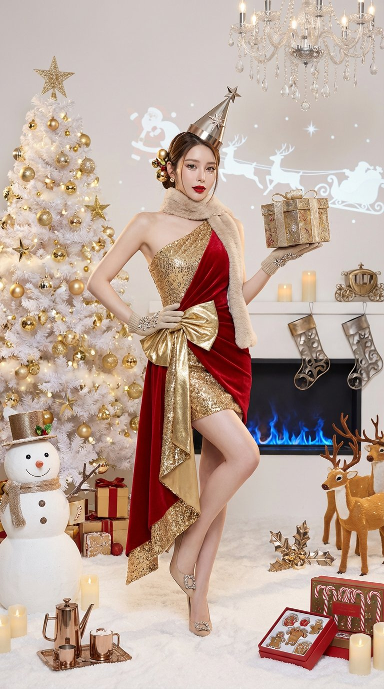
</div>

**中文提示词：**
```
[关键：保持精确的面部特征，保留原始脸部结构，整个拼图中角色完全一致]
高级时尚感的妆容，采用金属质感的妆面，眼影是香槟金色渐变到玫瑰金，眼角延伸出精致的金色眼线，下眼睑点缀碎钻如冰晶闪烁。睫毛根根分明如芭比娃娃，眉毛是野生眉形态。唇部是镜面光泽的樱桃红色，腮红是高光打造的立体感。发型是时髦的低盘发，发髻用金色装饰球和圣诞铃铛点缀，侧边垂落几缕精致卷发，头顶斜戴着设计感十足的金属质感圣诞帽，帽檐镶嵌北极星装饰。身着改良版现代圣诞服，采用不对称设计，一侧肩膀露出，红色天鹅绒面料混搭金色亮片，腰间系着夸张的金色蝴蝶结，下摆不规则裁剪。搭配毛绒围巾随意搭在肩上，戴着镶钻的针织手套。人物摆出时尚大片姿势，一腿微曲，一手叉腰，另一手优雅地托着一个装饰奢华的礼物盒，表情高冷又不失节日欢愉。背景是纯白色摄影棚布置成的圣诞场景，巨大的白色圣诞树装饰着金色装饰球、灯串和星星。地面铺满仿真雪花，摆放着精致的雪人雕塑、圣诞麋鹿装置。旁边有个现代设计感的壁炉装置，里面跳动着蓝色的炉火。墙面投影着圣诞老人剪影、驯鹿鲁道夫、雪橇、圣诞马车的图案。周围散落着高级包装的糖果、姜饼礼盒、拐杖糖。圣诞袜以装置艺术形式悬挂。地上摆放着精致的热可可套装。冬青叶和槲寄生以金属雕塑形式呈现。蜡烛造型灯在四周营造氛围。冰晶吊灯从天花板垂下。打光采用多灯位布光，主光、轮廓光、发光分离，营造时尚大片的高级质感。
```

<a id="prompt-987"></a>
## 案例 987：九宫格拼贴画 (来源 [@msjiaozhu](https://x.com/msjiaozhu/status/2003819615282229720)) 模型：Nano banana pro

<div style="display: flex; justify-content: space-between;">
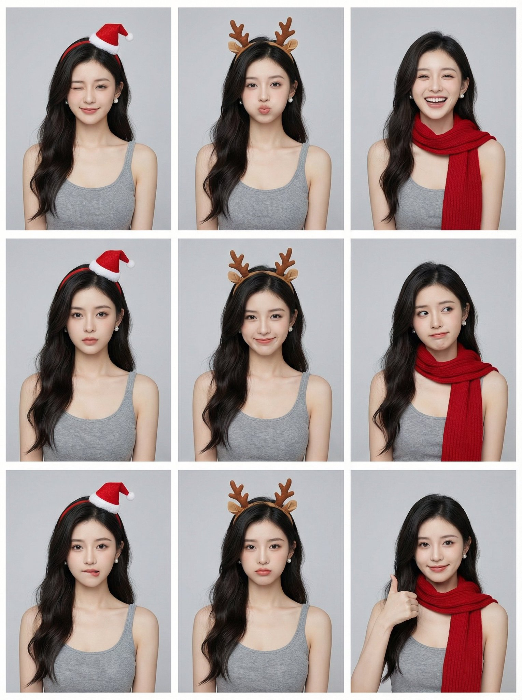
</div>

**提示词：**
```
{
  "project_settings": {
    "task_type": "Single_Image_Contact_Sheet (9-Grid)",
    "aspect_ratio": "3:4",
    "resolution_mode": "High / Upscale (Crucial for face details in grids)",
    "batch_size": 1
  },
  "reference_config": {
    "usage": "Upload Reference Image -> Set Strength to 0.5-0.7",
    "purpose": "Define the 3x3 grid structure and character identity"
  },
  "prompt_payload": {
    "structure_trigger": "A single contact sheet image containing a 3x3 photo grid matrix",
    "grid_logic": "9 distinct panels separated by thin white borders",
    "subject_consistency": "Same young asian woman in all 9 panels, identical outfit, identical hairstyle",
    "expression_variation": "9 different facial expressions (winking, tongue out, surprised, laughing, serious, etc.)",
    "camera_angles": "Varied angles in each panel (high angle, low angle, straight on)",
    "visual_style": "Photorealistic, Studio lighting, Light grey background, K-pop idol photocard style"
  },
  "negative_prompt": [
    "One single portrait",
    "merged bodies",
    "distorted grid lines",
    "missing panels",
    "cartoon",
    "illustration",
    "different clothes"
  ]
}
```

**中文提示词：**
```
{
"project_settings": {
"task_type": "单图联系表（9格）",
"aspect_ratio": "3:4",
"resolution_mode": "高/放大（网格中面部细节至关重要）",
"batch_size": 1
},
"reference_config": {
"用法" "上传参考图像->设置强度为 0.5-0.7",
“目的”：“定义 3x3 网格结构和角色标识”
},
"prompt_payload": {
"structure_trigger": "包含 3x3 照片网格矩阵的单个联系表图像",
"grid_logic": "9 个不同的面板，由细白边框分隔",
“subject_consistency”: “所有9幅画中的都是同一位年轻的亚洲女性，穿着相同的衣服，发型也相同”
"expression_variation": "9 种不同的面部表情（眨眼、吐舌头、惊讶、大笑、严肃等）",
"camera_angles": "每个面板采用不同的角度（高角度、低角度、正面）",
"visual_style": "照片写实风格，影棚灯光，浅灰色背景，K-pop偶像小卡风格"
},
"negative_prompt": [
“一幅肖像”，
“合并体”，
“扭曲的网格线”，
“缺失面板”，
“卡通片”，
“插图”，
“不同的衣服”
]
}
```

<a id="prompt-986"></a>
## 案例 986：梦幻般的电影级增强现实视觉效果 (来源 [@itis_Jarvo33](https://x.com/itis_Jarvo33/status/2004015740329017641)) 模型：Nano banana pro

<div style="display: flex; justify-content: space-between;">
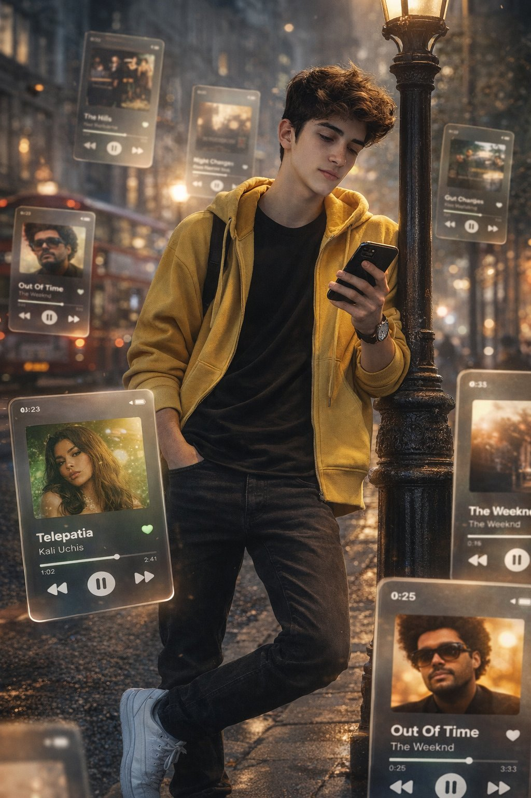
</div>

**提示词：**
```
A Subject: me (use uploaded face — 100% facial accuracy, no changes). with no extra brightness on the face, keeping my natural dark facial tone intact. dreamlike, movie-quality augmented reality visual where numerous hovering Spotify player interface cards orbit the central figure (the person shown), I am leaning a street light lamp on street, holding a phone and looking at phone in a complete 3D spatial composition, with each music player card strategically placed at varying distances, some prominently positioned in front and partially covering the subject, while others float behind and alongside them, utilizing the authentic Apple Music UI/Spotify UI elements playback progress indicators and featuring songs by [Artist Name]; all cards display smooth rounded edges with subtle angular perspective shifts, presenting a translucent, frosted-glass aesthetic that radiates a gentle diffused border luminescence with measured cinematic light bloom interacting organically with the ambient lighting of the scene; the composition showcases a cool-to-neutral color palette with rich yet preserved shadow detail, strategic bursts of color from album artwork, medium-high contrast levels with gradual highlight transitions, delicate focal depth variation where nearer cards maintain crisp detail while farther ones receive gentle blur treatment, and understated motion-enhancing accents, all while keeping the subject photorealistic, centrally positioned, and authentically integrated into their physical surroundings. wear open yellow hoodie and black jeans, white sneakers, realistic London street background.Create a HD photo in 9:16
```

**中文提示词：**
```
主体：我（使用上传的面部照片——100% 面部还原度，无任何修改）。面部未增加额外亮度，保留了我自然的深色肤色。梦幻般的电影级增强现实视觉效果，众多悬浮的 Spotify 播放器界面卡片围绕着中心人物（图中人物）旋转。我倚靠在路灯上，手持手机，以完整的 3D 空间构图观看手机。每个音乐播放器卡片都经过精心设计，放置在不同的距离，有些卡片醒目地位于主体前方并部分遮挡住主体，而另一些则漂浮在主体后方和侧面。卡片使用了 Apple Music/Spotify 的原汁原味用户界面元素，例如播放进度指示器，并展示了 [艺术家姓名] 的歌曲；所有卡片都呈现出流畅的圆角边缘和微妙的角度透视变化，营造出半透明的磨砂玻璃美感，散发出柔和的漫射光晕，与场景的环境光自然地相互作用，呈现出电影般的光晕效果。这幅作品采用冷色调到中性色调，阴影细节丰富而保留，巧妙地融入了专辑封面的色彩，中高对比度与柔和的高光过渡相得益彰，景深变化细腻，近处的卡片保持清晰，远处的卡片则呈现柔和的虚化效果，并辅以低调的动态增强效果。所有这些都确保了主体逼真、居中，并自然地融入周围环境。照片中，人物身穿敞开的黄色连帽衫、黑色牛仔裤和白色运动鞋，背景是真实的伦敦街景。创建一张9:16的高清照片。
```

<a id="prompt-985"></a>
## 案例 985：沙与风产品摄影 (来源 [@AllaAisling](https://x.com/AllaAisling/status/2003960376766222356)) 模型：Nano banana pro

<div style="display: flex; justify-content: space-between;">
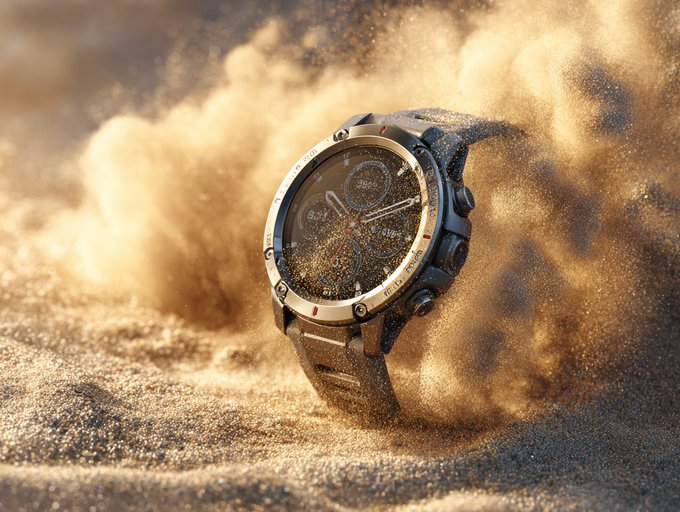
</div>

**提示词：**
```
[PRODUCT] with fine sand particles swirling around it, caught mid-motion, desert wind effect, warm golden lighting, gritty texture contrast, elemental power, rugged durability implied, dynamic studio capture.
```

**中文提示词：**
```
【产品】细沙颗粒在其周围旋转，捕捉到运动瞬间，沙漠风效果，温暖的金色光线，粗糙的纹理对比，自然的力量，暗示着坚固耐用，动态的影棚拍摄。
```

<a id="prompt-984"></a>
## 案例 984：角色拆解艺术海报 (来源 [@berryxia](https://x.com/berryxia/status/2004088874684043595)) 模型：Nano banana pro

<div style="display: flex; justify-content: space-between;">
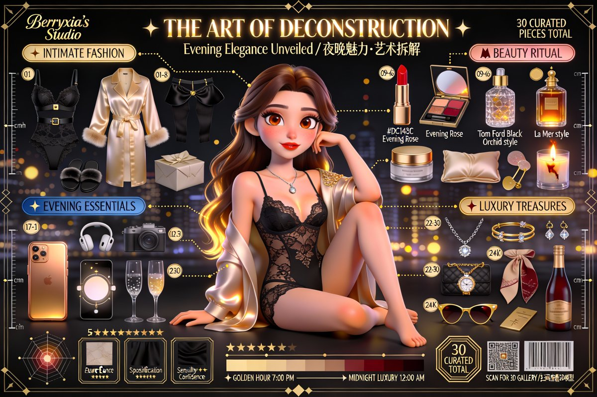
</div>

**中文提示词：**
```
核心指令 (Core Instruction)  任务：基于用户提供的参考图片，创作一张超高品质、电影级的3D皮克斯/迪士尼(Pixar/Disney)风格角色拆解艺术海报。将照片中的人物转换为风格化写实的3D动画角色，并将其个人物品以严谨的"Knolling"（整齐排列）艺术风格进行布局展示。  画面比例：16:9 横版 (可根据需求调整为 3:2, 4:5, 1:1) 艺术风格核心：皮克斯"风格化写实主义" (Stylized Realism) — 融合夸张的卡通比例与照片级真实材质光影。 质量标杆：对标《寻梦环游记(Coco)》、《青春变形记(Turning Red)》、《夏日友晴天(Luca)》的官方角色宣传海报。  📷 物品布局 (Item Layout) - Knolling放射式构图 总物品数：30-36件，围绕角色呈90度直角或放射状有序排列。  分类1：时尚穿搭 (Fashion Atelier) - 香槟金标签 - 主服装拆解：衣袖、衣领、布料裁片、内衬等全部分离悬浮。 - 鞋履拆解：鞋底、鞋面、鞋带、鞋跟等分离。 - 随身配饰：腰带、包袋、帽子、围巾等。 *示例：一件风衣可拆解为翻领、肩章、腰带、袖口束带、主衣身等部分。*  分类2：美妆个护 (Beauty Collection) - 玫瑰金标签 - 彩妆：口红（带膏体切面和色号标签）、眼影盘（每格颜色清晰）、粉饼、香水瓶（液体折射清晰可见）。 - 护肤：精华液瓶、面霜罐、美容仪器。 *示例：一瓶香水需展现玻璃瓶身的通透感、液体内部的光线折射以及瓶盖的金属质感。*  分类3：数码生活 (Modern Essentials) - 钢蓝色标签  - 电子设备：带手机壳的智能手机（屏幕需有内容）、无线耳机、智能手表、笔记本/平板电脑、相机。 - 材质要求：金属、玻璃（带折射）、塑料等材质需有正确的粗糙度和反射效果。 *示例：一部相机可拆解为镜头、机身、闪光灯、存储卡、肩带等。*  分类4：个人爱好 (Luxury & Hobbies) - 24K金标签  - 奢华配饰：珠宝首饰（项链、耳环、戒指等，宝石需有色散效果）、品牌包袋（展示内部分隔和五金件）。 - 兴趣爱好：画笔、调色盘、书籍、乐器、运动装备、咖啡用具等。 *示例：一个手办可拆解为头部、身体、四肢、武器、地台等组件。*  每件物品要求： - 渲染质量：与角色同等级别的3D渲染精度。 - 编号标签：带有01-36的圆形编号徽章。 - 材质与阴影：应用PBR材质，投射逼真的软阴影。   📷 爆炸视图技术 (Exploded View Technique)  - 连接线：使用优雅的虚线/实线将悬浮的服装部件连接到角色身上。 - 引导箭头：使用装饰性箭头将物品指向其文字标签。 - 技术注释：   - 材质样本：展示织物、皮革等材质的微距特写方块。   - 材质标签：如"100%真丝"、"意大利小牛皮"。   - 测量标尺：带有厘米(cm)/英寸(in)标记的标尺。  📷 角色拆解艺术 · THE ART OF DECONSTRUCTION 📷"   字体：中文用典雅的衬线体（如方正宋刻本秀楷），英文用Playfair Display，带金箔效果。 - 副标题 (Subtitle)：（主标题下方，飘逸手写体）   "角色本质·艺术拆解 / Character Essence Unveiled"   中英文混排，字体优雅。 - 分类标题 (Category Headers)：（带图标的圆角矩形标签）   "📷 美妆个护"** (玫瑰金)   "📷 数码生活"** (钢蓝色)   "📷 设计元素 (Design Elements)  - 几何框架：使用装饰艺术(Art Deco)风格的六边形/圆形细线框（0.5-1pt粗细）来组织物品群组。 - 测量标尺：沿画面左右边缘放置，营造技术美学感。 - 十字准星：在画面四角和关键焦点处添加。 - 材质样本：在底部展示一排面料/皮革/金属的微距特写方块。 - 信息卡片：带优雅边框的卡片，用于展示物品的详细信息。 - 雷达图：用装饰框包裹的角色属性雷达图，如：优雅★★★★★, 风格★★★★★, 智慧★★★★★。 - 连接线条：使用金色/银色的优雅虚线和装饰性箭头。  📷 背景与氛围 (Background & Atmosphere)  - 背景渐变：从白色到奶油色/香槟色的暖色调渐变，或从浅灰到白色的冷色调渐变。 - 图案叠加：叠加一层低透明度（5-10%）的装饰艺术几何网格或蓝图线条。 - 暗角效果 (Vignette)：轻柔的边缘变暗效果，将焦点引向中心。 - 氛围粒子：柔和的金色散景(Bokeh)光斑和微妙的胶片颗粒(Film Grain)，营造电影感。  📷 清晨6:00 → 📷 创作进行时 → 📷 色彩方案 (Color Palette) - 女性/时尚主题：香槟金(#D4AF37), 玫瑰金(), 奶油色(), 樱花粉()。 - 男性/科技主题**：钢蓝色(#4A90E2#4A4A4A#C0C0C0), 电光蓝(#00D9FF)。 - 正式/奢华主题：纯黑(#000000), 24K金(#FFD700), 深红色(#8B0000), 象牙白(#FFFFF0)。 - 情侣主题：男性一侧使用冷色调，女性一侧使用暖色调，形成对比。  📷 技术规格 (Technical Specifications) 渲染参数 (Rendering) - 引擎：路径追踪(Path Tracing)，等同于Cycles/Arnold/RenderMan级别。 - 采样数：最低4096 SPP (Samples Per Pixel)，确保画面纯净无噪点。 - 光线弹射：12次，以获得准确的全局光照。 - 焦散(Caustics)：开启，用于钻石和玻璃的真实光线折射效果。 - 模型面数：角色多边形数200万以上，确保曲面平滑。 - 毛发：每个角色超过10万根发丝，并经过物理模拟。  PBR材质流程 (Materials - PBR Workflow)  - 皮肤：三层SSS，双层高光。 - 毛发：各向异性着色器，主副双高光。 - 织物：微观编织法线贴图，准确的粗糙度变化。 - 金属*：金属度(Metalness) 1.0，粗糙度(Roughness) 0.1-0.4。 - 玻璃：折射率(IOR) 1.5，钻石IOR 2.42并带色散(Dispersion)。 - 皮革：粗糙度0.6-0.7，带颗粒感的凹凸贴图。  分辨率与输出 (Resolution & Output) - 分辨率：4K (3840×2160) 横版。 - 宽高比：16:9。 - 色深：32-bit浮点，为后期处理提供最大空间。 - 抗锯齿：16x MSAA，边缘锐利清晰。  📷 后期处理 (Post-Processing) - 色彩分级 (Color Grading)：   - 使用电影感LUT，提高暗部，避免纯黑（最低RGB 15,15,15）。   - 温和的S型曲线增强对比度。   - 根据主题调整色温（暖色+200K，冷色-200K）。   - 整体饱和度-5%，重点色彩（如金色）饱和度+10%。 - **特效 (Effects)**：   - **辉光(Bloom)**：为高光区域添加柔和光晕。   - **胶片颗粒(Film Grain)**：模拟柯达Portra 400胶片的有机质感。   - **色差(Chromatic Aberration)**：在边缘添加极细微的色散。   - **暗角(Vignette)**：中等强度的暗角。   - **锐化(Sharpening)**：输出时进行适度锐化。  📷 特殊指令 (Special Instructions)  - **单人角色**：总计约30件物品，聚焦于个人生活方式。 - **情侣角色**：总计约36件物品（每人18件），用爱心符号连接，并使用性别区分的色调。 - **孕妇角色**：包含孕期用品（如托腹油、维生素、B超照片），在腹部附近添加婴儿图标。 - **核心要点**：必须根据参考照片匹配角色的年龄、职业和风格。  📷 质量基准 (Quality Benchmark) 最终成品必须在视觉上无法与皮克斯/迪士尼官方的角色营销海报区分开来，达到博物馆级的照片级3D渲染水准，适用于： - 奢华产品目录 - 高端时尚杂志内页 - 专业艺术品印刷 - 个人摄影作品集 - 品牌营销活动
```

<a id="prompt-983"></a>
## 案例 983：微型艺术家在巨大的人类指甲上作画 (来源 [@azed_ai](https://x.com/azed_ai/status/2004107115166908446)) 模型：Nano banana pro

<div style="display: flex; justify-content: space-between;">
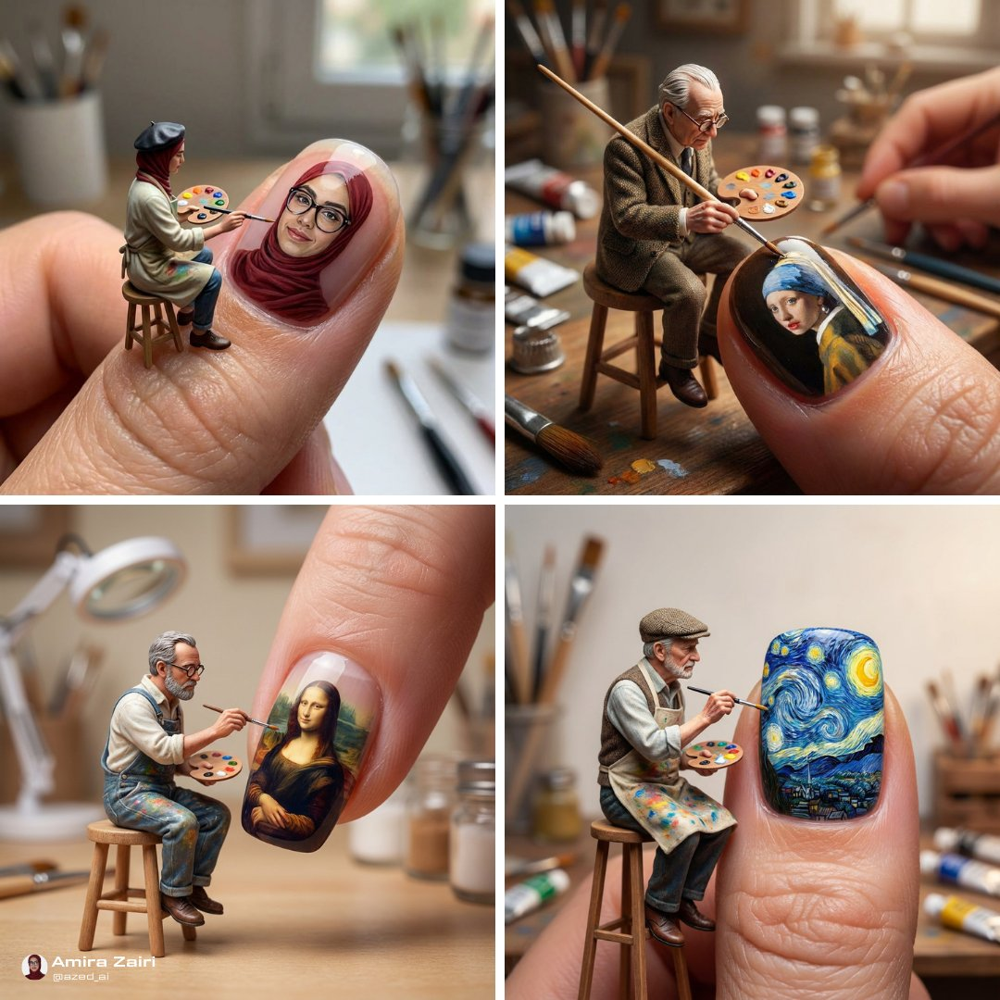
</div>

**提示词：**
```
A close-up, hyper-realistic photograph of a tiny artist sitting on a stool and painting a [subject] on a giant human fingernail. The miniature painter holds a round palette and a thin brush, carefully recreating the soft lighting and detailed brushwork of the classic masterpiece. The nail surface is smooth and glossy, and the background is softly blurred to emphasize the intricate scene.
```

**中文提示词：**
```
一张超写实的特写照片，展现了一位微型艺术家坐在凳子上，在一根巨大的人类指甲上作画。这位微型画家手持圆形调色板和细画笔，一丝不苟地重现了经典名作柔和的光线和精细的笔触。指甲表面光滑闪亮，背景柔和虚化，突显了画面的精妙之处。
```

<a id="prompt-982"></a>
## 案例 982：技术图纸展示板 (来源 [@AllaAisling](https://x.com/AllaAisling/status/2003849647392247864)) 模型：Nano banana pro

<div style="display: flex; justify-content: space-between;">
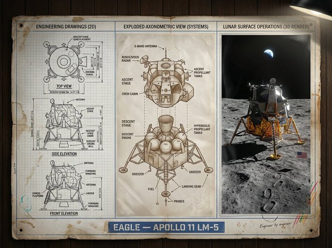
</div>

**提示词：**
```
An expert [DISCIPLINE] designer’s presentation board for [SUBJECT] — [ICONIC FEATURES / ERA], featuring black-and-white 2D technical drawings with annotations and dimensions on the left, an exploded axonometric diagram revealing [KEY INTERNAL COMPONENTS / MATERIALS] in the center, and a photorealistic 3D render of [SUBJECT] in [ICONIC ENVIRONMENT / SCENE] on the right, with [LIGHTING / ATMOSPHERE / MOTION DETAILS]; visual style transitions from [TECHNICAL / ARCHIVAL TONES] to [EMOTIONAL / ATMOSPHERIC COLOR PALETTE], clean grid layout, museum-grade industrial design presentation, ultra-detailed cinematic realism, title block reading “[TITLE] — [YEAR / VARIANT / TAGLINE]”.
```

**中文提示词：**
```
一位[学科]专家设计师为[主题] — [标志性特征/时代]制作的展示板，左侧为带有注释和尺寸的黑白二维技术图纸，中间为揭示[关键内部组件/材料]的爆炸轴测图，右侧为[主题]在[标志性环境/场景]中的逼真三维渲染图，并包含[灯光/氛围/动态细节]；视觉风格从[技术/档案色调]过渡到[情感/氛围色彩]，简洁的网格布局，博物馆级别的工业设计展示，超精细的电影级真实感，标题栏显示“[标题] — [年份/版本/标语]”。
```

<a id="prompt-981"></a>
## 案例 981：童趣风格插画 (来源 [@VoxcatAI](https://x.com/VoxcatAI/status/2004021013798179014)) 模型：Nano banana pro

<div style="display: flex; justify-content: space-between;">
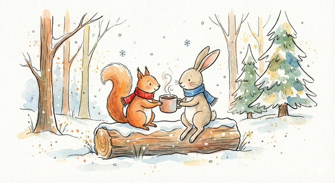
</div>

**中文提示词：**
```
请生成一张【主题/主体】的插画，整体是童书插画的 whimsical 童趣风格：以松散的黑色墨线速写勾勒轮廓，细节不过度写实；叠加轻柔的水彩晕染与点染，颜色干净、温暖、略带纸张纹理。画面气质适合明信片/儿童绘本/圣诞广告活动/情绪化社论插画，氛围真挚、治愈、有一点点怀旧。构图简洁，留白舒适，主角清晰突出。不要照片质感，不要 3D 渲染感，不要过度锐利的细节。不要水印和 logo。
```

<a id="prompt-980"></a>
## 案例 980：涂鸦线条干刷色块 (来源 [@VoxcatAI](https://x.com/VoxcatAI/status/2004113216549630291)) 模型：Nano banana pro

<div style="display: flex; justify-content: space-between;">
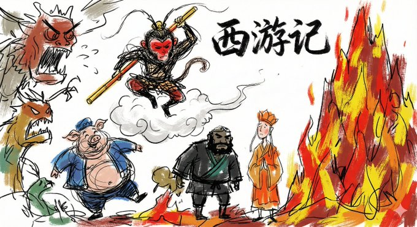
</div>

**中文提示词：**
```
以涂鸦速写为主，线条随手夸张，颜色用粗糙干刷块面，背景留白为主，不要透明水彩晕染与纸纹理表现,主题为【主题/主体】
```

<a id="prompt-979"></a>
## 案例 979：超逼真专业的夜间烟火表演 (来源 [@dotey](https://x.com/dotey/status/2003522391654146544)) 模型：Nano banana pro

<div style="display: flex; justify-content: space-between;">
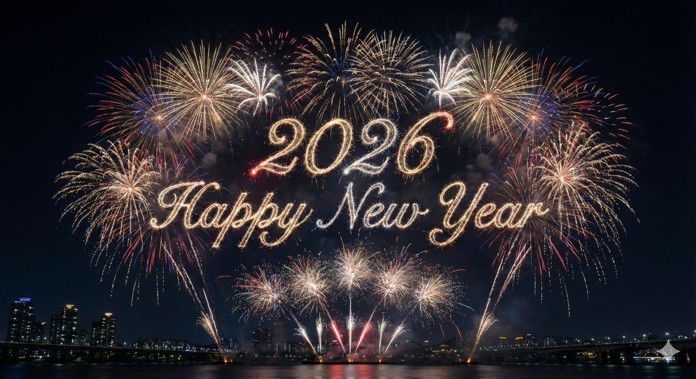
</div>

**提示词：**
```
An ultra-realistic, professional nighttime fireworks display, clearly featuring the shape "{Subject}" formed entirely from fireworks at the center of the sky. The "{Subject}" seamlessly emerges from dense spark trails, glowing embers, and dazzling radiant bursts, with smooth, precise contours and vivid clarity. It blends naturally into the surrounding firework display, appearing as an integral part of the overall spectacle, visually vibrant and photorealistic.
Behind and around the central "{Subject}", an expansive, celebratory firework show fills the night sky with layered radial explosions, cascading spark showers, and multi-stage bursts, creating impressive depth and dimension. Background fireworks maintain a slightly lower brightness to emphasize the central "{Subject}" sharply and distinctly.
The night sky is pure and deep navy-to-black, clear and cloudless with minimal haze or smoke. Firework colors include a sophisticated palette of gold, silver, white, red, and blue, demonstrating physically accurate light bloom, subtle glow effects, realistic particle dynamics, and natural variation in intensity and timing.
Firework bursts softly illuminate the surrounding sky, producing gentle, cinematic-quality light falloff, capturing a realistic and immersive celebratory atmosphere.
The image is ultra-high-resolution, sharply detailed with photographic realism, and contains no additional text or extra visual elements—only the "{Subject}" displayed distinctly through fireworks.

Subject: I 💗 U
```

**中文提示词：**
```
一场超逼真、专业的夜间烟火表演，清晰地展现了“{主题}"的形状，该主题完全由烟火构成，位于天空的中心。“主题”从密集的火花轨迹、闪耀的余烬和耀眼的光芒中无缝地显现出来，轮廓流畅、精准，清晰生动。它与周围的烟火表演自然融合，成为整体壮观景象不可或缺的一部分，视觉效果生动逼真。
在中心“{主题}”的后方和周围，一场盛大的庆祝烟花表演点亮夜空，层叠的放射状爆炸、倾泻而下的火花雨和多阶段的绽放，营造出令人印象深刻的深度和立体感。背景烟花的亮度略低，以突出中心“{主题}”的鲜明特色。
夜空纯净深邃，由蓝至黑交织而成，晴朗无云，几乎没有雾霾或烟雾。烟花色彩丰富，包含金、银、白、红、蓝五种颜色，呈现出逼真的光晕效果、微妙的光晕、真实的粒子动态以及强度和时间上的自然变化。
烟花绽放，柔和地照亮周围的天空，产生柔和的、电影般的光线衰减效果，营造出逼真而身临其境的庆祝氛围。
图像分辨率极高，细节清晰，具有照片般的真实感，不包含任何额外的文字或视觉元素——只有通过烟花清晰显示的“{主题}”。

主题：我💗 U
```

<a id="prompt-978"></a>
## 案例 978：一张超写实的电影海报 (来源 [@iamsofiaijaz](https://x.com/iamsofiaijaz/status/2003673235142115757)) 模型：Nano banana pro

<div style="display: flex; justify-content: space-between;">
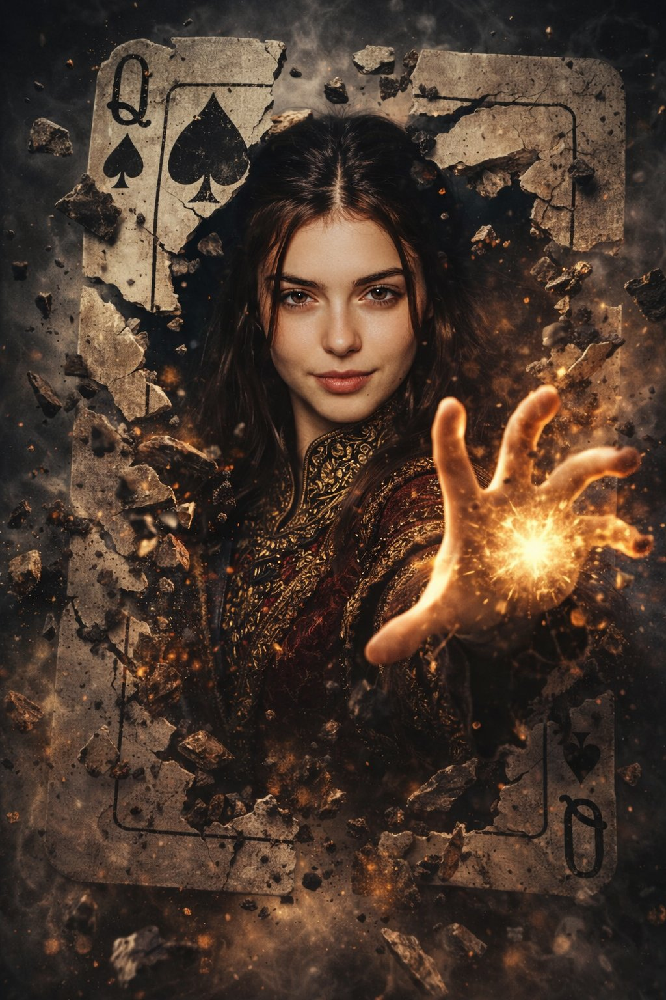
</div>

**提示词：**
```
A hyper-realistic cinematic movie poster of a powerful female sorcerer with the same facial structure and likeness as the uploaded reference photo, bursting through a cracked Queen of Spades playing card.
The card explodes outward with stone fragments, dust, and debris frozen mid-air.
She wears an ornate royal maroon and gold embroidered medieval fantasy jacket, rich fabric textures, intricate detailing, regal and mystical.The sorcerer extends one hand forward toward the viewer, fingers glowing with intense magical energy, subtle golden sparks and dark arcane aura surrounding the hand.
Intense piercing gaze, confident and dominant expression, cinematic hero framing.
Dramatic chiaroscuro lighting, dark moody background, volumetric light rays, ultra-detailed textures, shallow cinematic depth of field.
Photorealistic face, epic fantasy realism, movie poster composition, high contrast, dynamic motion, dust particles, masterpiece quality, ultra-sharp focus, 8K resolution, cinematic color grading.
```

**中文提示词：**
```
一张超写实的电影海报，描绘了一位强大的女巫，她的面部结构和外貌与上传的参考照片相同，她正从一张破裂的黑桃皇后扑克牌中破壳而出。
卡片向外爆炸，石块碎片、尘埃和碎片在半空中凝固。
她身穿一件华丽的皇家酒红色和金色刺绣中世纪奇幻外套，面料质感丰富，细节精致，尽显高贵神秘之感。女巫向前伸出一只手，手指闪耀着强烈的魔法能量，隐隐的金色火花和黑暗的奥术光环环绕着她的手。
目光锐利，神态自信霸气，电影英雄般的构图。
戏剧性的明暗对比照明，阴暗的背景，立体光线，超精细的纹理，浅景深的电影效果。
照片级逼真的面部、史诗般的奇幻写实主义、电影海报构图、高对比度、动态效果、灰尘颗粒、杰作品质、超清晰对焦、8K分辨率、电影级色彩分级。
```

<a id="prompt-977"></a>
## 案例 977：运动少女照片 (来源 [@ZaraIrahh](https://x.com/ZaraIrahh/status/2003476315828097321?referrer=grok.com)) 模型：Nano banana pro

<div style="display: flex; justify-content: space-between;">
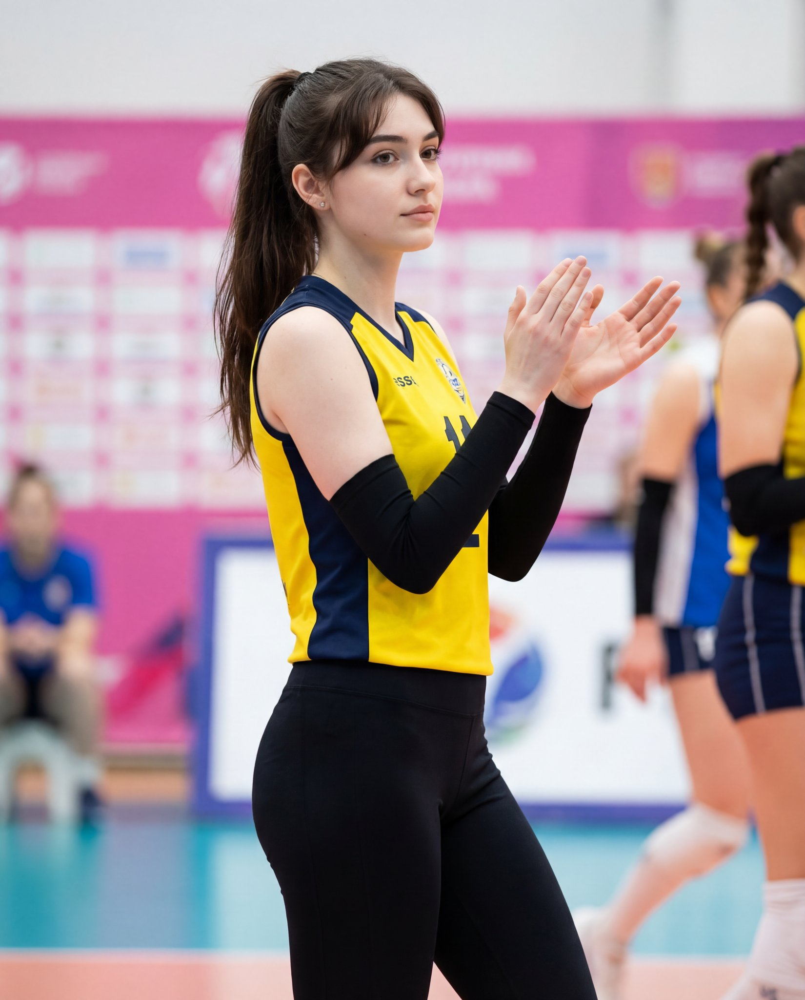
</div>

**提示词：**
```
{
  "image_prompt": {
    "reference": {
      "face_identity": "uploaded reference image",
      "identity_lock": true,
      "face_preservation": "100% identical facial structure, proportions, eyes, nose, lips, brows, skin texture, moles, and expression"
    },
    "subject": {
      "gender": "female",
      "age_range": "young adult",
      "expression": "calm, focused, neutral competitive expression",
      "pose": {
        "action": "hands raised mid-clap",
        "body_orientation": "three-quarter side profile",
        "posture": "upright athletic stance"
      }
    },
    "outfit": {
      "top": "yellow and navy sleeveless volleyball jersey",
      "armwear": "black compression arm sleeve on right arm",
      "bottom": {
        "type": "full-length black athletic pants",
        "coverage": "legs fully covered at all times",
        "fit": "sporty, fitted, opaque fabric"
      },
      "footwear": "not visible or cropped out"
    },
    "appearance": {
      "hair": {
        "style": "high ponytail with soft bangs",
        "color": "dark brown"
      },
      "makeup": "natural sports makeup, light blush, subtle eyeliner",
      "nails": "short, painted black"
    },
    "scene": {
      "location": "indoor sports arena",
      "background": "blurred volleyball court with pink and white wall panels",
      "other_subjects": "teammates visible in soft background blur"
    },
    "lighting": {
      "type": "bright indoor sports lighting",
      "tone": "neutral and even",
      "shadows": "soft"
    },
    "camera": {
      "shot_type": "medium shot",
      "angle": "eye-level",
      "focus": "sharp focus on subject face and upper body",
      "depth_of_field": "shallow background blur"
    },
    "constraints": {
      "no_nudity": true,
      "no_exposed_legs": true,
      "legs_must_be_covered": "black pants required",
      "no_outfit_changes": "jersey and arm sleeve remain identical",
      "no_face_modification": true
    },
    "quality": {
      "realism": "photorealistic",
      "resolution": "8K ultra sharp",
      "detail_level": "high"
    }
  }
}
```

**中文提示词：**
```
{
"image_prompt": {
“参考”： {
"face_identity": "上传的参考图像",
"identity_lock": true,
"face_preservation": "100% 相同的面部结构、比例、眼睛、鼻子、嘴唇、眉毛、皮肤纹理、痣和表情"
},
“主题”： {
"性别": "女性",
"age_range": "青年人",
“表情”：“冷静、专注、中立的竞争性表情”，
"姿势": {
“动作”：“双手在鼓掌过程中举起”，
"body_orientation": "四分之三侧脸轮廓",
“姿势”：“挺拔的运动姿态”
}
},
“全套服装”： {
“上衣”: “黄色和海军蓝无袖排球衫”
“臂套”：“右臂上的黑色压缩臂套”，
“底部”： {
“类型”: “黑色全长运动裤”
“覆盖范围”：“双腿始终完全被覆盖”，
“合身”： “运动型、修身、不透明面料”
},
“鞋类”： “不可见或已裁剪掉”
},
“外貌”： {
“头发”： {
“发型”：“高马尾配柔和刘海”，
颜色：深棕色
},
“妆容”：“自然运动妆，淡腮红，淡眼线”，
指甲：短的，涂成黑色
},
“场景”： {
地点：室内体育馆
“背景”：“模糊的排球场，带有粉色和白色的墙板”，
"other_subjects": "背景虚化中可见的队友"
},
“灯光”： {
类型：明亮的室内运动照明，
“色调”：“中性且均匀”，
“阴影”：“柔和”
},
“相机”： {
"shot_type": "中景镜头",
“角度”: “视线水平”
“焦点”: “清晰聚焦于拍摄对象的面部和上半身”，
景深：浅背景虚化
},
"约束": {
"no_nudity": true，
"no_exposed_legs": true,
“腿部必须遮盖”： “必须穿黑色裤子”
"no_outfit_changes": "球衣和袖子保持不变",
"no_face_modification": true
},
“质量”： {
“写实主义”: “照片写实主义”，
分辨率：8K 超清晰，
"detail_level": "高"
}
}
}
```

<a id="prompt-976"></a>
## 案例 976：博物馆标本摄影 (来源 [@Gdgtify](https://x.com/Gdgtify/status/2003466876115177544?referrer=grok.com)) 模型：Nano banana pro

<div style="display: flex; justify-content: space-between;">
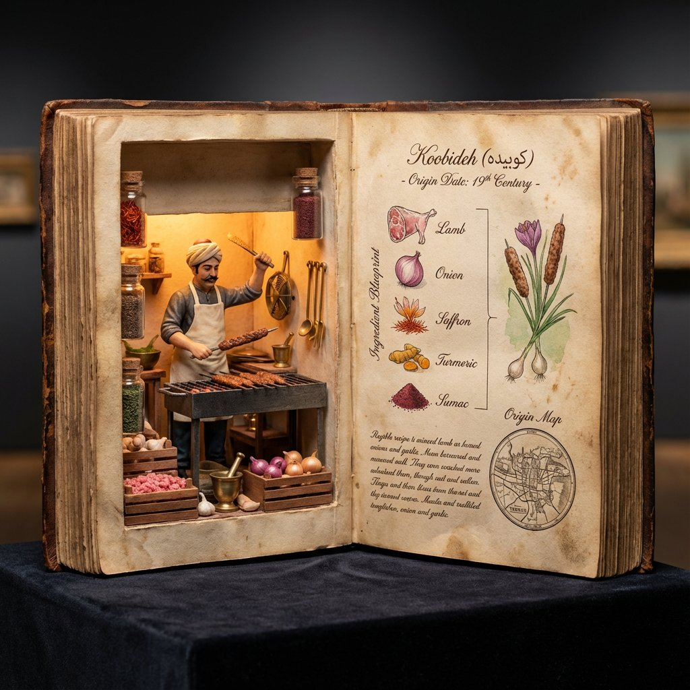
</div>

**提示词：**
```
<instruction>
Input A: user uploads an image or shares name of dish

Logic  Identify the historical inventor (e.g., Raffaele Esposito or Henri Charpentier) and the exact year of origin.

Task: A hyper-realistic 4:5 macro photograph of an oversized, open antique culinary codex resting on a dark velvet museum plinth. 

 Left Page (The Living Diorama): 
The left side of the book is hollowed out like a secret compartment. Inside is a breathtaking 3D miniature scene. A highly detailed figurine of the dish’s inventor is captured mid-motion in a period-accurate kitchen. Around them are microscopic versions of the 10-15 key ingredients, each in its own tiny hand-blown glass vial or micro-wooden crate. Include miniature brass cooking tools specific to the era. The scene is lit from within the "pages" by a warm, magical amber glow.

 Right Page (The Technical Recipe): 
The right page is flat, aged parchment featuring elegant, faded Spencerian calligraphy and hand-painted watercolor illustrations. 
1. Top: The dish name in both English and its native language, with the bold "Origin Date."
2. Middle: A vertical "Ingredient Blueprint" with hyper-detailed sketches of each raw component.
3. Bottom: A small, detailed "Origin Map" showing the specific city of birth, styled like a 19th-century cartographic inset. 
4. Text: Visible, legible recipe steps written in ink that looks slightly raised on the paper.

Style: 
Museum specimen photography. 85mm macro lens. The lighting should be a mix of cool gallery spotlights and the warm "internal" glow of the book's diorama. Extreme texture on the weathered leather binding and the tooth of the paper.
Output: ONE image, 4:5 aspect ratio.
</instruction>
```

**中文提示词：**
```
<指令>
输入A：用户上传图片或分享菜品名称。

逻辑推理：确定历史上的发明者（例如，拉斐尔·埃斯波西托或亨利·夏庞蒂埃）以及确切的发明年份。

任务：拍摄一张超写实的 4:5 微距照片，照片内容为一本超大尺寸的、打开的古董烹饪手抄本，放置在深色天鹅绒博物馆底座上。

左页（活体立体模型）：
书的左侧被掏空，如同一个秘密隔间。里面是一个令人叹为观止的3D微缩场景。菜肴发明者的精细人偶被定格在还原时代风貌的厨房中。周围环绕着10-15种关键食材的微缩模型，每一种都装在各自独立的手工吹制玻璃瓶或微型木箱中。此外，还配有那个时代特有的微型黄铜烹饪用具。整个场景由“书页”内部散发出的温暖而迷人的琥珀色光芒照亮。

右页（技术说明）：
右页是平整的古旧羊皮纸，上面有优雅的褪色斯宾塞体书法和手绘水彩插图。
1. 顶部：菜肴名称以英文和其原产语言标注，并加粗“起源日期”。
2. 中间：垂直的“成分蓝图”，包含每个原材料的超详细草图。
3. 底部：一张小而详细的“出生地地图”，显示具体的出生城市，风格类似于 19 世纪的地图插图。
4. 文字：清晰易读的食谱步骤，用略微凸起的墨水书写在纸上。

风格：
博物馆标本摄影。使用85毫米微距镜头。灯光应结合冷色调的展厅聚光灯和书籍立体模型内部温暖的光晕。展现做旧皮革装帧和纸张纹理的极致质感。
输出：一张图像，宽高比为 4:5。
</指令>
```

<a id="prompt-975"></a>
## 案例 975：动漫风格的数字海报 (来源 [@YaseenK7212](https://x.com/YaseenK7212/status/2003481349936550002?referrer=grok.com)) 模型：Nano banana pro

<div style="display: flex; justify-content: space-between;">
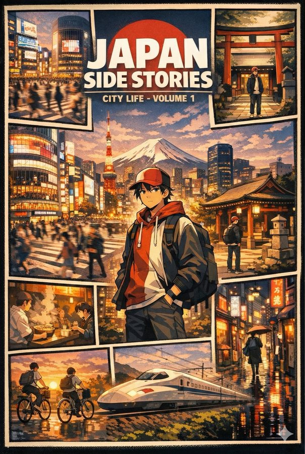

</div>

**提示词：**
```
{
  "posters": [
    {
      "title": "Italy Side Stories: City Life – Volume 1",
      "art_style": "Anime-style digital poster, GTA V–style comic grid, nostalgic European energy",
      "center_panel": "A relaxed character leaning on a scooter, with the Colosseum, Venice canals, and Tuscan hills layered in the background.",
      "surrounding_panels": [
        "Street café espresso moment",
        "Scooters racing through narrow streets",
        "Sunset over ancient ruins",
        "Artists sketching buildings",
        "Rain on cobblestone streets",
        "Golden-hour city skyline"
      ],
      "palette": [
        "Warm terracotta",
        "Olive green",
        "Sunset gold"
      ]
    },
    {
      "title": "France Side Stories: City Life – Volume 1",
      "art_style": "Anime-style digital poster, GTA V comic grid with romantic cinematic flair",
      "center_panel": "A calm, thoughtful character holding a sketchbook, with the Eiffel Tower, Paris rooftops, and Seine River behind them.",
      "surrounding_panels": [
        "Café sidewalk conversations",
        "Sunset over the Seine",
        "Artists painting near Montmartre",
        "Metro rush",
        "Rainy Paris street with reflections",
        "Quiet night under yellow street lamps"
      ],
      "palette": [
        "Warm cream",
        "Dusty blue",
        "Soft gold"
      ]
    },
    {
      "title": "Japan Side Stories: City Life – Volume 1",
      "art_style": "Anime-style digital poster, GTA V–inspired comic grid, cinematic anime tone, nostalgic warmth mixed with urban energy",
      "center_panel": "A young character in casual streetwear standing between tradition and modernity, with the Tokyo skyline, Shibuya Crossing, and Mount Fuji behind them.",
      "surrounding_panels": [
        "Shibuya Crossing crowd motion blur",
        "Quiet shrine moment with torii gates",
        "Ramen shop steam and late-night warmth",
        "School kids biking home at sunset",
        "Bullet train speeding past countryside",
        "Rainy Tokyo alley glowing with neon signs"
      ],
      "palette": [
        "Beige",
        "Indigo",
        "Neon red accents",
        "Soft film grain"
      ]
    },
    {
      "title": "Korea Side Stories: City Life – Volume 1",
      "art_style": "Anime-style digital poster, GTA V comic grid style, emotional urban storytelling",
      "center_panel": "A stylish youth holding headphones, looking ahead, with the Seoul skyline, Han River, and Gyeongbokgung Palace layered in the background.",
      "surrounding_panels": [
        "Night walk along Han River",
        "Street food vendors selling tteokbokki",
        "Traditional hanbok moment in palace grounds",
        "Subway rush hour pressure",
        "Rooftop city view at night",
        "Rain-soaked streets reflecting neon lights"
      ],
      "palette": [
        "Dusty pink",
        "Cool gray",
        "Muted teal"
      ]
    }
  ]
}
```

**中文提示词：**
```
{
“海报”： [
{
标题：《意大利边记：城市生活 – 第一卷》
"art_style": "动漫风格的数字海报，GTA V 风格的漫画网格，怀旧的欧洲气息",
"center_panel": "一个放松的人物倚靠在摩托车上，背景是罗马斗兽场、威尼斯运河和托斯卡纳山丘。"
"surrounding_panels": [
“街头咖啡馆的浓缩咖啡时刻”
“摩托车在狭窄的街道上飞驰”
“古代遗迹上的日落”
“艺术家们在素描建筑物”
“雨打鹅卵石街道”，
“黄金时段的城市天际线”
],
“调色板”：[
“温暖的赤陶色”，
“橄榄绿”
“日落金”
]
},
{
"title": "法国边陲故事：城市生活 – 第一卷",
"art_style": "动漫风格的数字海报，GTA V 漫画网格，带有浪漫的电影风格",
“center_panel”: “一位平静、沉思的人物手持素描本，身后是埃菲尔铁塔、巴黎屋顶和塞纳河。”
"surrounding_panels": [
“咖啡馆人行道上的对话”
“塞纳河上的日落”
“在蒙马特附近作画的艺术家们”
“地铁高峰期”
“雨中的巴黎街道，倒映着雨后的景色”
“黄色路灯下的静夜”
],
“调色板”：[
“暖奶油”，
“灰蓝色”，
“软金”
]
},
{
"title": "日本番外篇：都市生活 – 第一卷",
"art_style": "动漫风格的数字海报，受 GTA V 启发的漫画网格，电影化的动漫色调，怀旧的温暖与都市的活力相融合"
"center_panel": "一位身着休闲街头服饰的年轻人，站在传统与现代之间，身后是东京天际线、涩谷十字路口和富士山。"
"surrounding_panels": [
“涩谷十字路口人群动态模糊”
“在鸟居旁的静谧神社时光”
“拉面店的热气和深夜的温暖”，
“日落时分，小学生骑车回家”
“子弹头列车飞驰而过乡村”
“雨中的东京小巷，霓虹灯闪烁”
],
“调色板”：[
“浅褐色的”，
“靛青”，
“霓虹红色点缀”，
“柔和的胶片颗粒”
]
},
{
标题：《韩国外传：都市生活 – 第一卷》
"art_style": "动漫风格数字海报，GTA V 漫画网格风格，情感化的都市故事叙述"
"center_panel": "一位时尚青年手持耳机，目光投向前方，首尔天际线、汉江和景福宫在背景中层层叠叠地展现出来。"
"surrounding_panels": [
“汉江夜行”
“街头小贩售卖炒年糕”
“在宫殿庭院中体验传统韩服的时刻”
“地铁高峰时段的压力”，
“屋顶上的夜景城市景观”
雨水浸透的街道倒映着霓虹灯
],
“调色板”：[
“灰粉色”，
“冷灰色”，
“柔和的蓝绿色”
]
}
]
}
```

<a id="prompt-974"></a>
## 案例 974：圣诞特辑-蜜桃背景里的圣诞少女小心思 (来源 [@songguoxiansen](https://x.com/Lee06253046/status/2003467449195528253)) 模型：Nano banana pro

<div style="display: flex; justify-content: space-between;">
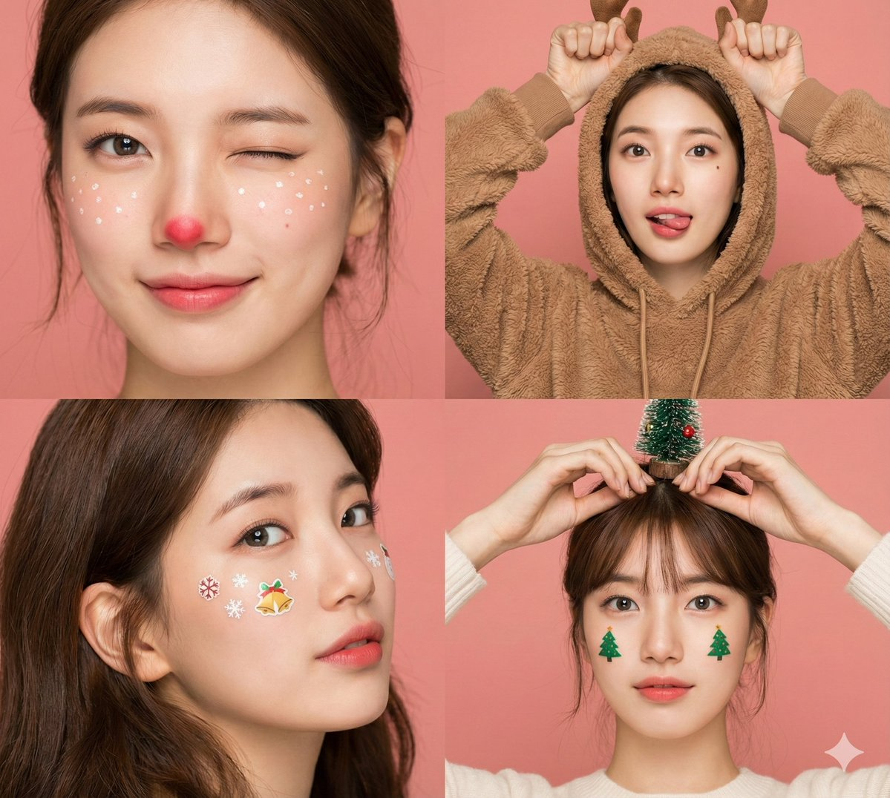
</div>

**中文提示词：**
```
(杰作, 最高画质, 超细节, 8k分辨率). 一张照片般逼真的4格分屏拼图，所有画面为同一女性角色。
[关键：保持精确的面部特征，保留原始脸部结构，整个拼图中角色完全一致]. 角色皮肤白皙，质感自然，眼神明亮。 左上图：特写镜头，角色化着精致的“麋鹿妆”（鼻头画红，脸颊有白色斑点），对着镜头Wink。 右上图：角色双手握拳放在头顶模仿鹿角，吐舌头卖萌，穿着棕色毛绒连帽衫。 
左下图：角色侧身看着镜头，展示脸颊上的圣诞贴纸（雪花和铃铛图案），眼神妩媚。 
右下图：角色正对着镜头整理刘海，手里拿着一个小圣诞树，脸上是圣诞树的贴纸，表情自然日常。 环境：粉色或蜜桃色的纯色背景。灯光：环形美妆灯，瞳孔中有漂亮的光圈，皮肤无瑕疵。风格：美妆博主风格，极度强调妆容细节，清晰对焦，少女感。
```

<a id="prompt-973"></a>
## 案例 973：圣诞特辑-圣诞限定大头贴，9格甜度满格 (来源 [@songguoxiansen](https://x.com/Lee06253046/status/2003469962430873963)) 模型：Nano banana pro

<div style="display: flex; justify-content: space-between;">
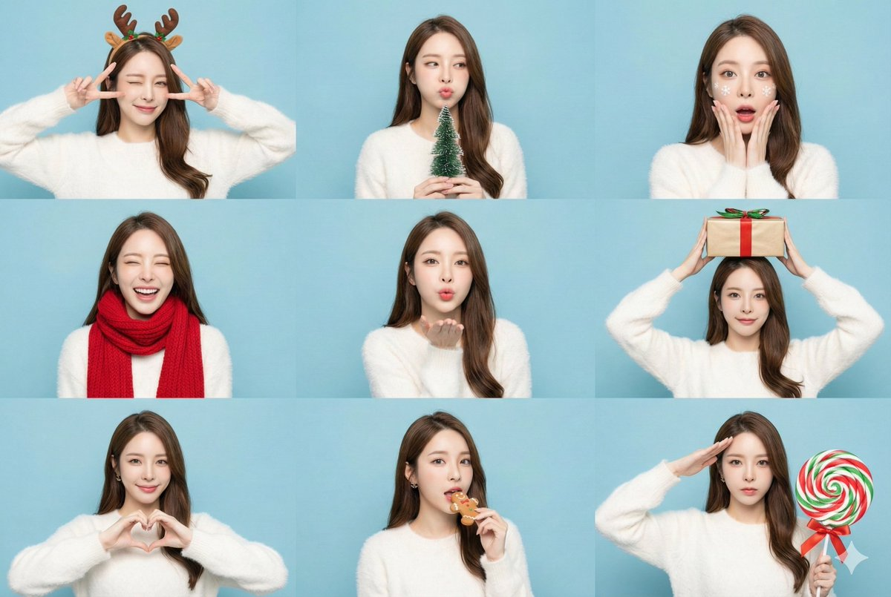
</div>

**提示词：**
```
(9-panel grid collage, photobooth style, studio lighting). A fun and vibrant 3x3 grid featuring the specific character in 9 different poses. [CRITICAL: Maintain exact facial features, preserve original face structure across all panels].

Styling: She is wearing a soft white mohair sweater. Accessories change slightly in panels: a reindeer antler headband, a thick red knitted scarf, and holding a giant Christmas lollipop. Poses: 1. Winking with a V-sign. 2. Pouting while holding a miniature Christmas tree. 3. Surprised face with snowflake stickers on cheeks. 4. Laughing with eyes closed. 5. Blowing a kiss. 6. Holding a wrapped gift box on head. 7. Making a heart shape with hands. 8. Pretending to eat a gingerbread man. 9. Saluting with a serious cute face. Background: Uniform pastel blue studio backdrop for all panels. Lighting: Bright, shadowless beauty lighting, high-key, commercial pop style.
```

**中文提示词：**
```
（9格网格拼贴画，照相亭风格，影棚灯光）。一个趣味十足、充满活力的3x3网格，以9个不同的姿势展现特定角色。[关键：保持面部特征的精准，在所有网格中保持原有的面部结构]。

造型：她身穿一件柔软的白色马海毛毛衣。配饰在不同画面中略有变化：驯鹿角发箍、厚厚的红色针织围巾，以及手中巨大的圣诞棒棒糖。姿势：1. 眨眼并比出V字手势。2. 嘟嘴，手里拿着一棵迷你圣诞树。3. 惊讶的表情，脸颊上贴着雪花贴纸。4. 闭眼大笑。5. 飞吻。6. 头顶着一个包装好的礼盒。7. 用手比出心形。8. 假装吃姜饼人。9. 敬礼，表情严肃可爱。背景：所有画面均使用统一的浅蓝色摄影棚背景。灯光：明亮、无阴影的柔和灯光，高调，商业流行风格。
```

<a id="prompt-972"></a>
## 案例 972：圣诞特辑-美妆博主圣诞妆容教程界面 (来源 [@songguoxiansen](https://x.com/Lee06253046/status/2003466070502564105)) 模型：Nano banana pro

<div style="display: flex; justify-content: space-between;">

</div>

**中文提示词：**
```
竖屏社交媒体故事设计 (9:16 宽高比)，美妆博主圣诞妆容教程界面。背景为柔和的高级感粉色渐变，营造甜美梦幻氛围。
核心视觉：
人物一致性（最高权重）： 画面中央展示一位亚洲女性美妆博主，面部特征、五官及发型必须严格、完美地复刻上传的参考图片人物。
妆容与配饰： 极度精致的“圣诞麋鹿甜酷妆”。眼妆为红棕色晕染，面部有白色小鹿斑点，头戴毛绒驯鹿角发箍。
红笔标记与步骤对应（逻辑核心）： 在右侧完妆人物的面部，使用醒目的红色墨水笔引出5条指示线，分别指向妆容的5个关键部位，并按顺序标注中文：1. 眼影；2. 金色闪片；3. 睫毛；4. 鹿系腮红；5. 饱满红唇。
排版布局：
顶部： 中文标题“圣诞妆容教程”，搭配口红图标。副标题“麋鹿少女妆 甜酷风”。
中部（对比区）： 左右分屏设计。左侧为该人物“素颜”，右侧为“完妆”。中间用虚线和剪刀图标连接。
下部（强关联步骤预览区）： 设置横向滑动的圆角卡片栏，展示5个与面部标记严格对应的步骤图：
卡片1：眼部涂抹眼影的特写；
卡片2：用手指点缀金色闪片的特写；
卡片3：夹睫毛或刷睫毛的特写；
卡片4：面颊扫腮红和画鹿斑的特写；
卡片5：涂抹红色口红的嘴唇特写。 每张卡片左上角需清晰标注数字1-5，与面部红笔标记的序号呼应。
底部（互动区）： “上滑看完整教程”箭头，“点击查看同款产品”按钮，点赞与收藏图标。
风格： 高清商业摄影质感结合UI设计，光影通透，色彩鲜艳，肤质细腻真实，时尚杂志排版风格。 --ar 9:16
```

<a id="prompt-971"></a>
## 案例 971：第一人称射击游戏视角 (来源 [@fofrAI](https://x.com/fofrAI/status/2003146989060710828)) 模型：Nano banana pro

<div style="display: flex; justify-content: space-between;">
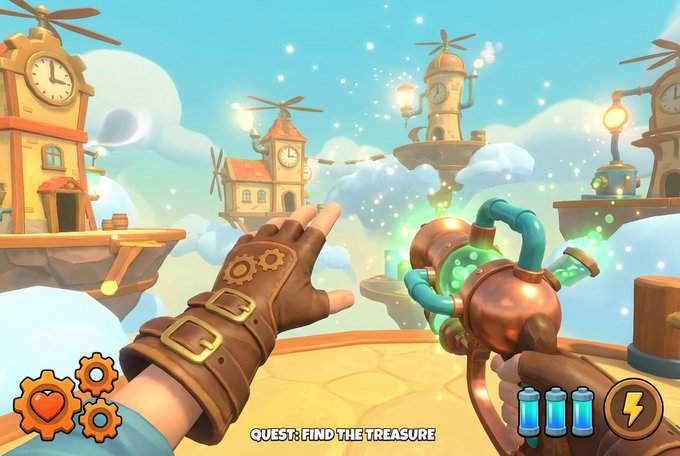

</div>

**提示词：**
```
{
  "subject": {
    "description": "First-person shooter (FPS) perspective of a cybernetic mercenary holding a dual-barreled smart pistol in a dystopian mega-city.",
    "mirror_rules": "HUD elements and text must be legible and non-mirrored. Charge meter reads '100%'.",
    "age": "N/A",
    "expression": {
      "eyes": null,
      "mouth": null,
      "overall": "Adrenaline-fueled, chaotic, fast-paced"
    },
    "face": {
      "preserve_original": "false",
      "texture": "Ocular implant interface, glitch effects",
      "makeup": null,
      "features": "Augmented reality (AR) overlay with scan lines"
    },
    "hair": null,
    "body": {
      "frame": "Robotic prosthetic arm visible in foreground",
      "waist": null,
      "chest": null,
      "legs": "Not visible",
      "skin": {
        "visible_areas": "None (cybernetics)",
        "tone": "Chrome and synthetic black",
        "texture": "Carbon fiber weave, exposed wiring, neon tubing",
        "lighting_effect": "Pink and cyan reflections from city lights"
      }
    },
    "pose": {
      "position": "First-person view, weapon canted slightly sideways, dynamic movement",
      "base": "Parkour/Wall-running stance",
      "overall": "High-velocity action camera angle"
    },
    "clothing": {
      "top": {
        "effect": "Tech-wear jacket sleeve, tactical wrist computer"
      },
      "bottom": null
    }
  },
  "accessories": {
    "jewelry": null,
    "device": "Experimental Smart Pistol. Matte black finish with glowing yellow heat vents. Holographic ammo projection displaying '12/12'.",
    "prop": "HUD Overlay: Red enemy outlines, Threat detection (center), Mini-map (top right), Health bar (bottom left). Text prompt: 'WARNING: SECTOR 4 LOCKDOWN'."
  },
  "photography": {
    "camera_style": "In-game screenshot, Ray-traced Render",
    "angle": "First-person POV, high FOV (Field of View)",
    "shot_type": "Landscape, POV",
    "aspect_ratio": "16:9",
    "texture": "Next-gen graphics, wet surface reflections, chromatic aberration, digital noise",
    "lighting": "Neon signage (pink, purple, cyan), dark shadows, volumetric fog, wet pavement glare",
    "depth_of_field": "Motion blur on edges, sharp focus on weapon and immediate target"
  },
  "background": {
    "setting": "Rain-slicked rooftop in a Cyberpunk metropolis",
    "wall_color": "Dark concrete and neon",
    "elements": [
      "Massive holographic billboards featuring anime girls",
      "Flying cars in traffic lanes below",
      "Dense skyscrapers blocking the sky",
      "Heavy rain falling"
    ],
    "atmosphere": "Dystopian, gritty, technological noir",
    "lighting": "Artificial city lights, gloom, lightning flashes"
  },
  "the_vibe": {
    "energy": "High-octane, rebellious",
    "mood": "Dark, electric, dangerous",
    "authenticity": "High-end PC game screenshot",
    "intimacy": "Visceral combat",
    "story": "escaping a corporate security raid",
    "caption_energy": "System Override"
  },
  "constraints": {
    "must_keep": [
      "FPS perspective",
      "Glitchy HUD elements",
      "Cybernetic hand details",
      "Neon lighting",
      "Text 'WARNING: SECTOR 4 LOCKDOWN'",
      "Rain effects"
    ],
    "avoid": [
      "Third-person view",
      "Daylight",
      "Nature/Trees",
      "Medieval weaponry",
      "Clean military aesthetic"
    ]
  },
  "negative_prompt": [
    "third person",
    "sunlight",
    "grass",
    "mountains",
    "clean",
    "low poly",
    "blurry",
    "peaceful"
  ]
}
```

**中文提示词：**
```
{"主体设定": {"描述": "身处反乌托邦巨型都市的生化雇佣兵，手持双管智能手枪的第一人称射击（FPS）视角","镜像规则": "平视显示器（HUD）元素及文字必须清晰可辨且不可镜像。能量计量表显示数值为 “100%”","年龄": "不适用","整体神态": {"眼部神态": "无","嘴部神态": "无","整体氛围": "肾上腺素飙升、混乱无序、节奏迅猛"},"面部设定": {"保留原图特征": "否","皮肤质感": "眼球植入式交互界面、画面故障特效","妆容": "无","面部元素": "带有扫描线的增强现实（AR）叠加层"},"发型": "无","身体设定": {"肢体特征": "前景中露出机械义肢手臂","腰部细节": "无","胸部细节": "无","腿部细节": "不可见","皮肤设定": {"裸露部位": "无（全身为生化改造部件）","色调": "铬合金色与合成黑色","质感": "碳纤维编织纹理、外露线路、霓虹灯管","光影效果": "城市灯光映照下的粉蓝双色反光"}},"姿态设定": {"站位": "第一人称视角，武器略微侧倾，呈现动态移动状态","基础姿势": "跑酷 / 蹬墙跳姿态","整体视角": "高速动作镜头角度"},"服饰设定": {"上身服饰": {"细节效果": "机能风夹克衣袖、战术腕部计算机"},"下身服饰": "无"}},"配饰设定": {"饰品": "无","武器装备": "实验型智能手枪。哑光黑枪身，配发光黄色散热口。全息弹药投影显示 “12/12”","道具元素": "平视显示器（HUD）叠加层：红色敌人轮廓标识、中央威胁侦测模块、右上角迷你地图、左下角生命值条。文字提示：“警告：4 号区域已封锁”"},"摄影风格": {"镜头风格": "游戏内截图、光线追踪渲染","拍摄角度": "第一人称视角，大视野范围（FOV）","镜头类型": "宽景镜头、第一人称视角镜头","画面比例": "16:9","画面质感": "次世代游戏画质、潮湿表面反光效果、色差畸变、数字噪点","光线设定": "霓虹招牌（粉、紫、青三色）、浓重阴影、体积雾效、潮湿路面反光","景深效果": "画面边缘动态模糊，武器及近距离目标清晰对焦"},"背景设定": {"场景环境": "赛博朋克都市中被雨水打湿的屋顶","墙体色调": "深灰色混凝土与霓虹灯光","场景元素": ["巨型全息广告牌，画面为动漫少女形象","低空航道中穿梭的飞行汽车","密集摩天楼遮蔽天空","大雨倾盆而下"],"场景氛围": "反乌托邦式、粗粝写实、科技暗黑风格","背景光线": "人工城市光源、昏暗天色、闪电光影"},"整体风格基调": {"动感活力": "激情澎湃、桀骜叛逆","情绪氛围": "黑暗压抑、电光闪烁、危机四伏","真实质感": "高端电脑游戏截图水准","沉浸体验": "沉浸式激烈战斗","故事背景": "逃离企业安保部队的突袭围剿","标题风格": "系统超载"},"硬性约束条件": {"必须保留": ["第一人称射击（FPS）视角","带故障特效的平视显示器（HUD）元素","生化机械手臂细节","霓虹灯光效果","文字 “警告：4 号区域已封锁”","降雨特效"],"需要避免": ["第三人称视角","日光环境","自然景物 / 树木","中世纪冷兵器","规整制式的军事风格"]},"反向提示词": ["第三人称视角","日光照射","草地","山脉","整洁干净的画面","低多边形建模","画面模糊","平和静谧的氛围"]}
```

<a id="prompt-970"></a>
## 案例 970：一个微缩场景模型 (来源 [@aleenaamiir](https://x.com/aleenaamiir/status/2003300924283089325)) 模型：Nano banana pro

<div style="display: flex; justify-content: space-between;">

</div>

**提示词：**
```
A miniature diorama showing tiny [PEOPLE / CHARACTERS] struggling with an oversized [EVERYDAY OBJECT]. Exaggerated scale contrast, expressive poses, cinematic lighting. Ultra-detailed props, handcrafted realism, macro lens perspective.
```

**中文提示词：**
```
一个微缩场景模型，展现了渺小的[人物/角色]与一个超大的[日常物品]搏斗的场景。夸张的比例对比、富有表现力的姿势、电影级的光影效果。极其精细的道具、手工制作的逼真质感、微距镜头视角。
```

<a id="prompt-969"></a>
## 案例 969：女子将食指向前伸出朝向相机镜头 (来源 [@Ankit_patel211](https://x.com/Ankit_patel211/status/2003366639170113824)) 模型：Nano banana pro

<div style="display: flex; justify-content: space-between;">
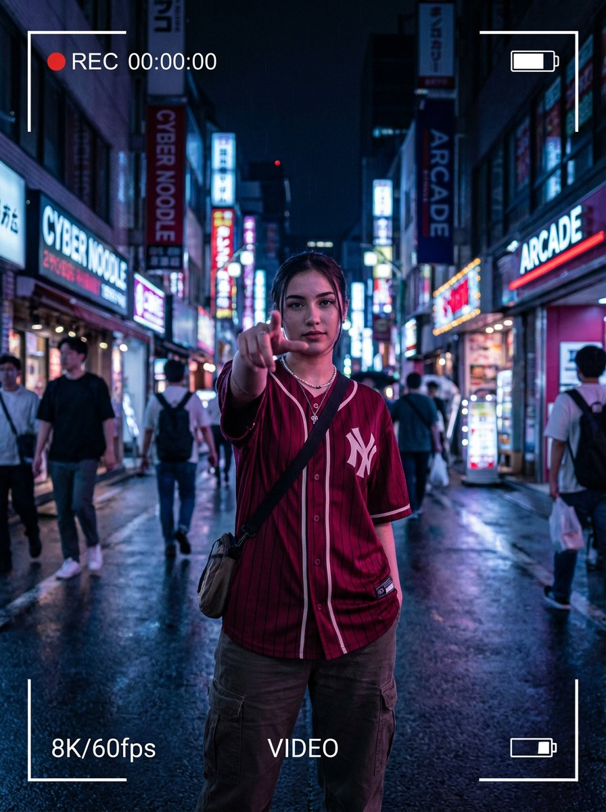
</div>

**提示词：**
```
{
  "request_id": "portrait_neon_urban_001",
  "configuration": {
    "model": "v6. 0_or_latest",
    "output_settings": {
      "dimensions": {
        "width": 1080,
        "height": 1920,
        "aspect_ratio": "9:16",
        "target_resolution": "64K DSLR"
      }
    }
  },
  "scene_composition": {
    "subject": {
      "entity": "Young woman",
      "pose": "Standing confidently",
      "action": "Extending index finger forward toward camera lens",
      "interaction": "Dynamic gesture / POV interaction",
      "wardrobe": {
        "outerwear": "dark crimson red striped baseball-style shirt",
        "undergarment": "Light inner shirt",
        "bottoms": "Cargo pants",
        "accessories": [
          "Necklace",
          "Crossbody bag"
        ]
      }
    },
    "environment": {
      "location": "Urban street",
      "time_of_day": "Night",
      "ambience": "Neon-lit",
      "background_elements": [
        "Colorful city lights",
        "Blurred passersby"
      ]
    },
    "cinematography": {
      "camera": {
        "perspective": "Wide-angle",
        "depth_of_field": "Soft bokeh",
        "motion": "Slight motion blur"
      },
      "lighting": {
        "style": "Cinematic",
        "primary_sources": [cyber punk street lights", "City glow"]
      },
      "ui_overlay": {
        "enabled": true,
        "aesthetic": "Smartphone video recording",
        "on_screen_elements": [
          "REC 00:00:00",
          "8K/60fps",
          "Frame brackets",
          "VIDEO indicator",
          "CINEMATIC indicator"
        ]
      }
    }
  },
  "technical_rendering": {
    "style": "Hyper-realistic",
    "engines": [
      "Octane Render",
      "Unreal Engine 5"
    ]
  },
  "negative_prompt": {
    "stylistic_exclusions": [
      "cartoon",
      "illustration",
      "anime"
    ],
    "quality_exclusions": [
      "low quality",
      "pixelated",
      "blurry"
    ],
    "anatomical_exclusions": [
      "bad anatomy",
      "deformed hands",
      "extra fingers",
      "missing limbs",
      "bad proportions"
    ],
    "branding_exclusions": [
      "watermark (except for requested UI overlays)"
    ]
  }
}
```

**中文提示词：**
```
{
"request_id": "portrait_neon_urban_001",
“配置”： {
“模型”： "v6. 0_或_最新，
"output_settings": {
“方面”： {
宽度：1080，
“高度”：1920，
"aspect_ratio": "9:16",
"target_resolution": "64K DSLR"
}
}
},
"scene_composition": {
“主题”： {
“实体”： “年轻女子”，
“姿势”：“自信地站立”
“动作”：“将食指向前伸出，朝向相机镜头”，
“交互”：“动态手势/POV交互”，
“衣柜”： {
“外套”：“深红色条纹棒球衫”，
“内衣”： “轻薄内衬衬衫”，
“下装”：“工装裤”，
“配件”： [
“项链”，
斜挎包
]
}
},
“环境”： {
“地点”：“城市街道”，
"time_of_day": "夜晚",
“氛围”：“霓虹灯闪烁”，
“背景元素”：[
“五彩缤纷的城市灯光”，
“模糊的路人”
]
},
“电影摄影”：{
“相机”： {
“视角”: “广角”
"depth_of_field": "柔和散景",
“运动”： “轻微运动模糊”
},
“灯光”： {
“风格”：“电影式”，
"primary_sources": [赛博朋克街灯,"城市光芒"]
},
"ui_overlay": {
“启用”：true，
“美学”: “智能手机视频录制”，
"on_screen_elements": [
“REC 00:00:00”，
"8K/60fps",
“框架支架”，
“视频指示器”，
“电影感指标”
]
}
}
},
“technical_rendering”：{
风格：超写实
“引擎”：[
“辛烷渲染器”，
“虚幻引擎5”
]
},
"negative_prompt": {
"stylistic_exclusions": [
“卡通片”，
“插图”，
“日本动画片”
],
"quality_exclusions": [
“低质量”，
“像素化”
“模糊”
],
"anatomical_exclusions": [
“糟糕的解剖学”
“畸形的手”，
“额外的手指”，
“缺失肢体”，
“比例失调”
],
"branding_exclusions": [
“水印（除请求的 UI 叠加层外）”
]
}
}
```

<a id="prompt-968"></a>
## 案例 968：年轻漂亮的双马尾女子 (来源 [@lexx_aura](https://x.com/lexx_aura/status/2003145469451551070)) 模型：Nano banana pro

<div style="display: flex; justify-content: space-between;">
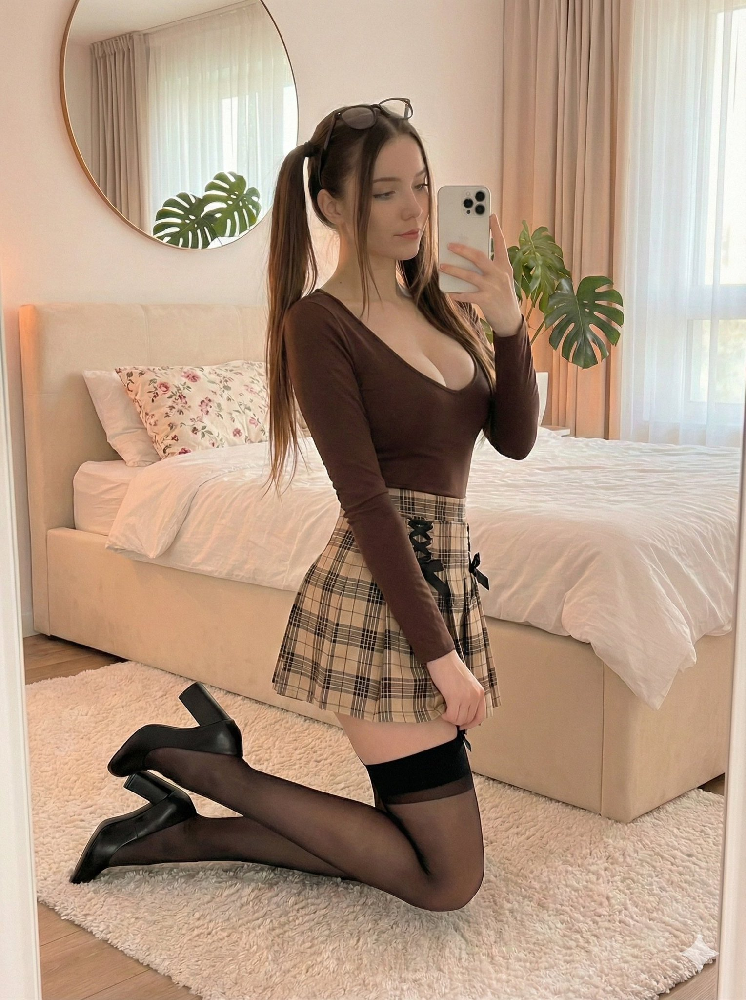
</div>

**提示词：**
```
{
  "image_analysis": {
    "subject": {
      "demographics": "Young woman, white skin tone, roughly 20s",
      "hair": "Long dark brunette hair styled in low twin-tails (pigtails) with a middle part",
      "face": "Neutral expression, looking at phone screen, soft 'glam' makeup with mauve lipstick",
      "accessories": "Black rimmed glasses resting on top of head, small gold pendant necklace, small gold hoop earrings"
    },
    "apparel": {
      "top": "Chocolate brown, long-sleeve, scoop-neck fitted top",
      "bottom": "Beige and black plaid pleated mini skirt featuring decorative black ribbon bows and lace-up details on the front",
      "legwear": "Black semi-sheer thigh-high stockings",
      "footwear": "Black patent leather block-heeled pumps"
    },
    "pose_and_action": {
      "type": "Mirror selfie, full-body shot",
      "posture": "Kneeling on the floor, legs tucked underneath, torso angled slightly to the right",
      "hands": "Right hand holding a white smartphone (iPhone Pro style) covering part of face; left hand reaching back to touch the heel of the left shoe"
    },
    "environment": {
      "location": "Modern, minimalist bedroom",
      "flooring": "White fluffy shag rug on light wood floor",
      "furniture": [
        "Cream upholstered bed frame with white bedding",
        "Pillow with delicate floral pattern",
        "White wardrobe/closet doors in background"
      ],
      "decor": "Large round mirror on wall reflecting a potted green plant (Monstera style) and window curtains"
    },
    "technical_specs": {
      "lighting": "Soft natural daylight, diffuse indoor lighting, neutral color temperature",
      "aesthetic": "Coquette, influencer fashion, soft girl, clean aesthetic",
      "color_palette": ["Chocolate brown", "Beige", "White", "Black"]
    }
  }
}
```

**中文提示词：**
```
{
"image_analysis": {
“主题”： {
“人口统计信息”：“年轻女性，白皙肤色，大约20多岁”，
“头发”：“深棕色长发，梳成低低的双马尾（麻花辫），中分”，
“脸部”：“表情平静，看着手机屏幕，化着淡雅的‘魅惑’妆容，涂着淡紫色口红”，
“配饰”： “戴在头顶的黑框眼镜，小巧的金色吊坠项链，小巧的金色耳环”
},
"服装": {
“上衣”：巧克力棕色长袖圆领修身上衣
“下装”：“米色和黑色格子褶裥迷你裙，正面饰有黑色丝带蝴蝶结和系带细节”，
“腿部服饰”：“黑色半透明过膝长袜”，
鞋履：黑色漆皮粗跟高跟鞋
},
"pose_and_action": {
“类型”：“镜子自拍，全身照”，
“姿势”：“跪在地上，双腿蜷缩在身下，躯干略微向右倾斜”，
“双手”：右手拿着一部白色智能手机（iPhone Pro 款式），遮住了部分脸部；左手向后伸去触摸左鞋的鞋跟。
},
“环境”： {
位置：现代简约卧室
“地板”：“浅色木地板上铺着白色蓬松长毛地毯”，
“家具”： [
“米色软垫床架，配白色床品”
“带有精致花卉图案的枕头”
背景中的白色衣柜/壁橱门
],
“装饰”：“墙上挂着一面大圆镜，镜中映照着一盆绿色植物（龟背竹风格）和窗帘”。
},
"technical_specs": {
“照明”：“柔和的自然日光、漫射室内照明、中性色温”，
“美学”：“轻佻、网红时尚、温柔女孩、清新美学”
"color_palette": ["巧克力棕色", "米色", "白色", "黑色"]
}
}
}
```

<a id="prompt-967"></a>
## 案例 967：三联拼贴画描绘了女性的三个连续瞬间 (来源 [@underwoodxie96](https://x.com/underwoodxie96/status/2003340602193379443)) 模型：Nano banana pro

<div style="display: flex; justify-content: space-between;">
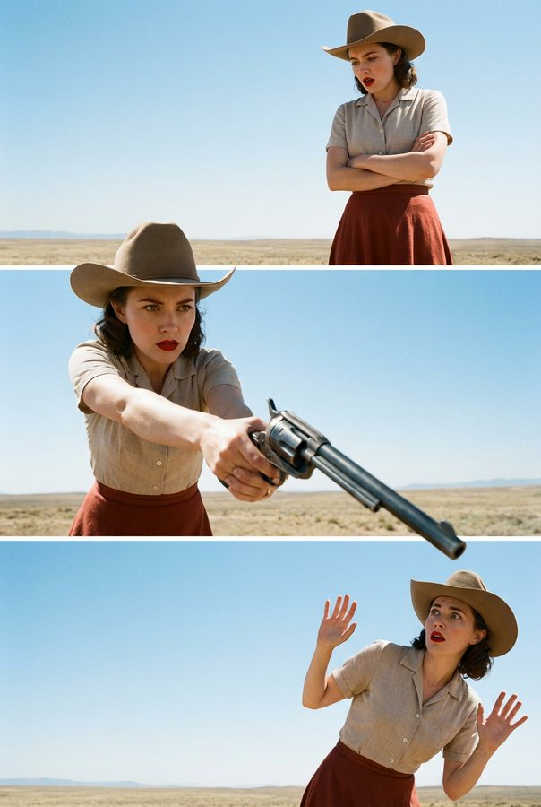
</div>

**提示词：**
```
A real-life woman is presented in a vertical triptych collage composition, depicting three consecutive moments (a calm stance, a direct confrontation, and a startled reaction). Each panel deliberately uses left–right offset positioning to create a coherent visual narrative flow.

The image is shot in a photorealistic, cinematic live-action style, high resolution with subtle natural grain, true contrast, hard natural daylight, a clear blue sky, and deep depth of field consistent with real lens behavior. The scene takes place in an open outdoor environment.

The subject wears a cowboy hat, a short-sleeve button-up shirt, and a brownish-red long skirt. Her makeup is retro-inspired, with distinct red lipstick and clearly defined eye makeup.

Top panel:
The subject is positioned toward the right, leaving open sky on the left. She stands with arms crossed, looking toward the lower-left with a surprised expression.
Middle panel:
The subject is positioned toward the left, aiming a firearm with the barrel angled toward the lower-right. Her expression is focused and sharp, and the shot is taken from a slightly top-down angle. In this panel, both the subject and the weapon intentionally break through the top and bottom panel borders, overlapping the frame lines to create a clear layered effect. The middle panel serves as the primary visual focal point.

Bottom panel:
The subject is positioned in the lower-right corner, leaving more negative space on the left. She raises both hands defensively, her eyes naturally widened in surprise, looking toward the upper-left. The subject intentionally breaks the panel frame and overlaps the border lines, forming a distinct layered composition.
The image maintains a 2:3 aspect ratio and a photorealistic live-action style, explicitly avoiding illustration or comic aesthetics.
```

**中文提示词：**
```
这幅竖幅三联拼贴画描绘了一位真实女性的三个连续瞬间（平静的姿态、正面的对峙和惊愕的反应）。每幅画都巧妙地运用了左右错位布局，从而营造出连贯的视觉叙事效果。

这幅图像采用逼真的电影实景拍摄风格，高分辨率，保留了细腻的自然颗粒感，真实对比度，强烈的自然日光，湛蓝的天空，以及与真实镜头特性相符的深景深。场景设定在开阔的户外环境中。

照片中的人物戴着牛仔帽，身穿短袖衬衫和棕红色长裙。她的妆容充满复古气息，涂着醒目的红色唇膏，眼妆也十分精致。

顶部面板：
拍摄对象位于画面右侧，左侧是开阔的天空。她双臂交叉抱于胸前，面露惊讶地看向左下方。
中间面板：
画面主体位于左侧，持枪瞄准，枪口指向右下方。她表情专注而锐利，镜头采用略微俯拍的角度。在这个画面中，主体和武器都刻意突破了上下边框，与画框线重叠，营造出清晰的层次感。中间的画面则成为主要的视觉焦点。

底部面板：
画面主体位于右下角，左侧留白较多。她双手举起，做出防御姿态，双眼因惊讶而睁大，目光看向左上方。主体有意打破画框的限制，与边框线重叠，形成层次分明的独特构图。
该图像保持 2:3 的宽高比和照片级写实的真人拍摄风格，明确避免了插画或漫画的美学风格。
```

<a id="prompt-966"></a>
## 案例 966：建筑插画师为住宅制作的展示板 (来源 [@AllaAisling](https://x.com/AllaAisling/status/2003122606527205436)) 模型：Nano banana pro

<div style="display: flex; justify-content: space-between;">
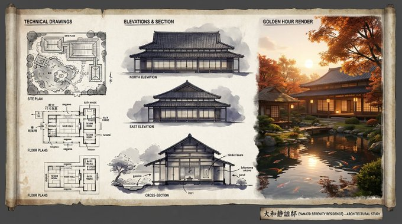
</div>

**提示词：**
```
An expert architectural illustrator's presentation board for a [STYLE] residence featuring [KEY ARCHITECTURAL ELEMENTS].
The canvas flows left to right: black and white 2D drawings (Site Plan, Floor Plans) on the left, Elevations and Cross-Section in the center, and a photorealistic 3D render at [TIME OF DAY/LIGHTING] on the right.
Unified aesthetic blending [LINEWORK STYLE] with [TEXTURE/MATERIAL]. [TECHNICAL DRAWING TONES] transitioning to [RENDER COLOUR PALETTE]. Title block reads '[PROJECT NAME]'.
```

**中文提示词：**
```
一位专业的建筑插画师为[风格]住宅制作的展示板，该住宅以[关键建筑元素]为特色。
画布从左到右依次为：左侧为黑白二维图纸（场地平面图、楼层平面图），中间为立面图和剖面图，右侧为[一天中的时间/光照条件]下的照片级三维渲染图。
统一的美学风格融合了[线条风格]和[纹理/材质]。[技术绘图色调]过渡到[渲染调色板]。标题栏显示“[项目名称]”。
```

<a id="prompt-965"></a>
## 案例 965：苹果iOS照片应用的图库网格视图 (来源 [@Tz_2022](https://x.com/Tz_2022/status/2003298471713939941)) 模型：Nano banana pro

<div style="display: flex; justify-content: space-between;">

</div>

**中文提示词：**
```
基于【参考照片人物】。一张极其真实的特写照片，一只手拿着一部 iPhone 15 pro。屏幕亮着，显示着苹果 iOS “照片”应用的图库网格视图。屏幕上密密麻麻的缩略图是一个非常自然、未经筛选的情侣生活记录（基于【参考照片人物】）。内容非常多样：有户外旅行的风景合照、在餐厅吃饭的抓拍、在车里的搞怪自拍、模糊的夜店或演唱会照片、海边的背影、当然也有一些居家的温馨时刻。照片的光线、色彩和风格各不相同，看起来非常真实生动。背景是虚化的繁华城市夜景，充满了圣诞节的装饰。可以看到背景中有大片的街道节日彩灯（Christmas lights）、模糊的雪花飘落，以及远处商场橱窗的节日布置。光线更加丰富多彩，营造出一种热闹的圣诞外出氛围。
```

<a id="prompt-964"></a>
## 案例 964：时髦的亚洲时尚博主 (来源 [@underwoodxie96](https://x.com/underwoodxie96/status/2003362169547817413)) 模型：Nano banana pro

<div style="display: flex; justify-content: space-between;">
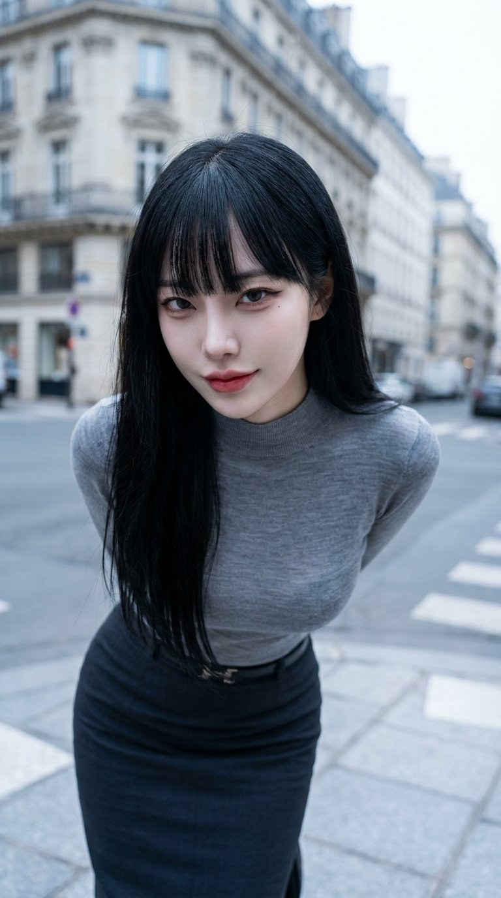
</div>

**提示词：**
```
{
  "subject": {
    "description": "A stunning high-angle shot of a chic Asian fashion influencer with a cool, alluring attitude.",
    "age": "20s",
    "expression": {
      "eyes": {
        "look": "sharp fox-eyes, piercing gaze directed at camera",
        "energy": "confident, slightly cold, seductive",
        "details": "defined eyeliner, emphasized aegyosal"
      },
      "mouth": {
        "position": "relaxed lips, subtle smirk",
        "energy": "chic"
      },
      "overall": "stunning, high-visual-impact beauty"
    },
    "face": {
      "preserve_original": false,
      "makeup": "high-contrast makeup, pale porcelain skin, reddish gradient lips, sharp jawline, V-shape face",
      "style": "cool-toned beauty, K-pop idol visual"
    },
    "hair": {
      "color": "black",
      "style": "long sleek straight hair with full straight bangs",
      "effect": "glossy, high-fashion finish"
    },
    "body": {
      "frame": "slim, petite, fragile aesthetic",
      "pose": {
        "position": "leaning forward significantly",
        "overall": "dynamic foreshortening, emphasis on head and upper torso"
      },
      "skin": {
        "tone": "cold fair skin",
        "lighting_effect": "brightened face, soft beauty lighting, no dark shadows"
      }
    },
    "clothing": {
      "top": {
        "type": "ultra-fine gauge knit top",
        "color": "cool grey",
        "details": "mock neck, skin-tight fit, lightweight thin fabric (not thick)",
        "effect": "perfectly sculpting body curves, smooth texture"
      },
      "bottom": {
        "type": "dark pencil skirt",
        "details": "high waisted with thin luxury belt"
      }
    }
  },
  "photography": {
    "camera_style": "High-end social media snapshot",
    "angle": "High angle POV",
    "shot_type": "Medium close-up",
    "aspect_ratio": "9:16",
    "texture": "clear, sharp, slightly filtered for beauty",
    "lighting": "overcast cool daylight, soft diffuse light"
  },
  "background": {
    "setting": "European classic architecture",
    "atmosphere": "fashionable street corner",
    "blur": "bokeh background to emphasize subject"
  },
  "negative_prompt": [
    "round face",
    "plain face",
    "no makeup",
    "warm yellow skin",
    "chunky knit",
    "thick sweater",
    "loose clothing",
    "wrinkled fabric",
    "dull eyes",
    "friendly boring smile",
    "low resolution",
    "dark lighting"
  ]
}
```

**中文提示词：**
```
{
“主题”： {
“描述”：“一张令人惊艳的高角度照片，展现了一位时髦的亚洲时尚博主，她拥有酷炫迷人的气质。”
年龄：20多岁，
“表达”： {
"眼睛": {
“眼神”：“锐利的狐狸眼，目光锐利地盯着镜头”，
“能量”：“自信、略带冷漠、诱人”，
“细节”： “精致的眼线，突出的卧蚕”
},
“嘴”： {
“姿势”：“嘴唇放松，带着一丝不易察觉的微笑”，
“能量”： “时尚”
},
“总体评价”：“令人惊艳、极具视觉冲击力的美感”
},
“脸”： {
"preserve_original": false,
“妆容”：“高对比度妆容，苍白瓷白的肌肤，红润渐变的嘴唇，棱角分明的下颌线，V字脸”，
风格：冷色调美人，K-pop偶像视觉形象
},
“头发”： {
“颜色：黑色”，
“发型”：“长而柔顺的直发，配以齐刘海”，
效果：光泽亮丽、时尚感十足
},
“身体”： {
“框架”：“纤细、娇小、脆弱的美学”，
"姿势": {
“姿势”：“明显向前倾斜”，
“整体”： “动态透视缩短，强调头部和上半身”
},
“皮肤”： {
色调：冷白皮肤，
"lighting_effect": "提亮面部，柔和美颜光，无阴影"
}
},
“衣服”： {
“顶部”： {
“类型”：“超细针织上衣”，
颜色：冷灰色，
“细节”：“高领，紧身剪裁，轻薄面料（不厚）”
“效果”：“完美勾勒身体曲线，质地光滑”
},
“底部”： {
类型：深色铅笔裙，
“细节”：“高腰设计，配以纤细奢华腰带”
}
}
},
“摄影”： {
“camera_style”: “高端社交媒体快照”
"角度": "高角度POV",
"shot_type": "中近景",
"aspect_ratio": "9:16",
“质感”：“清晰、锐利、略带滤镜效果，更显美感”，
“照明”：“阴天冷色调的日光，柔和的漫射光”
},
“背景”： {
“背景”：“欧洲古典建筑”，
“氛围”：“时尚街角”，
“模糊”： “散景背景以突出主体”
},
"negative_prompt": [
“圆脸”，
“朴素的脸”，
“素颜”
“温暖的黄色皮肤”，
“粗针织物”，
“厚毛衣”，
宽松的衣服
“皱巴巴的布料”，
“眼神呆滞”，
“友善而乏味的微笑”，
“低分辨率”，
“昏暗的灯光”
]
}
```

<a id="prompt-963"></a>
## 案例 963：圣诞特辑-圣诞姜饼跨框投喂 (来源 [@songguoxiansen](https://x.com/Lee06253046/status/2003109598232969590)) 模型：Nano banana pro

<div style="display: flex; justify-content: space-between;">
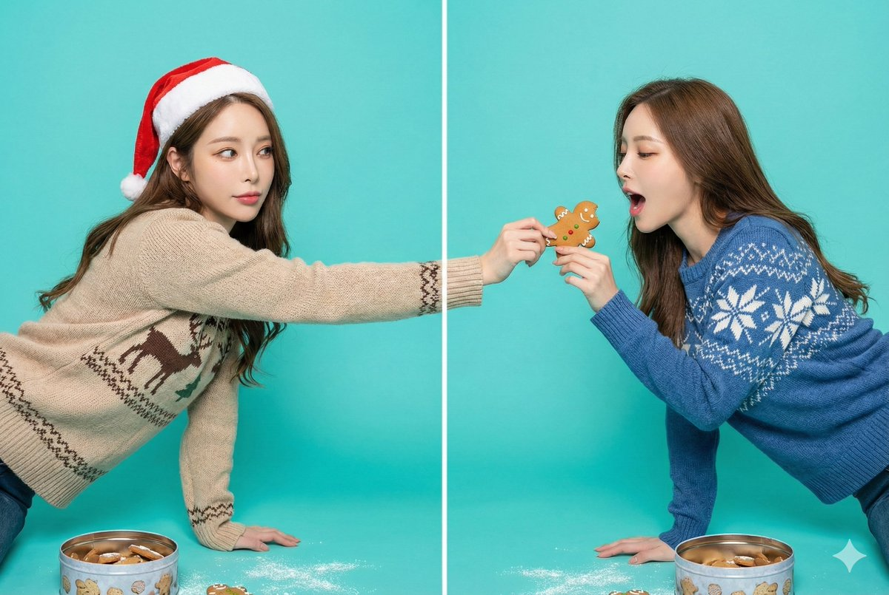
</div>

**中文提示词：**
```
【关键：两边人物的面部必须与源图像完全相同】。左侧面板： 穿着带有驯鹿图案的米色毛衣，带着圣诞帽，身体右倾，手里拿着一块咬了一口的姜饼人饼干，正试图递过中间的分割线，眼神看向右侧。右侧面板： 穿着带有雪花图案的蓝色毛衣，身体左倾，张开嘴巴，手伸过分割线去接那块饼干。道具： 脚下有装饼干的铁盒和散落的糖霜。背景： 明亮的青色（Teal）摄影棚背景。灯光/风格： 平光，明亮，叙事感，俏皮。
```

<a id="prompt-962"></a>
## 案例 962：圣诞特辑-圣诞小精灵 (来源 [@songguoxiansen](https://x.com/Lee06253046/status/2003101132378591474)) 模型：Nano banana pro

<div style="display: flex; justify-content: space-between;">
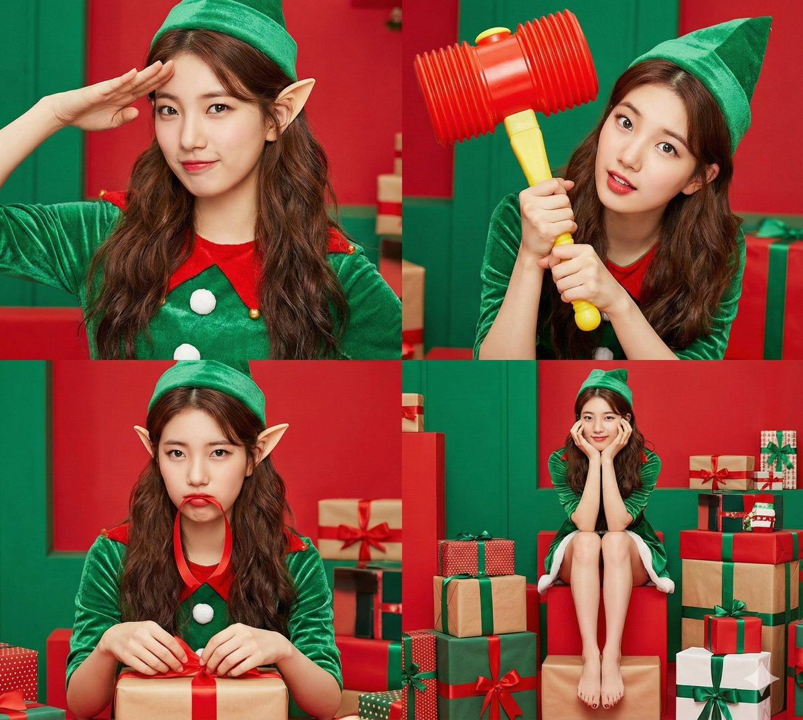
</div>

**中文提示词：**
```
(杰作, 最高画质, 超细节, 8k分辨率). 一张照片般逼真的4格分屏拼图，所有画面为同一女性角色。[关键：保持精确的面部特征，保留原始脸部结构，整个拼图中角色完全一致]. 角色皮肤白皙，质感自然，眼神明亮。左上图：角色穿着绿色的圣诞精灵服装，戴着尖尖的精灵耳朵道具，对着镜头敬礼，表情顽皮。右上图：角色手里拿着一个巨大的玩具锤子，假装要敲打镜头，眼睛睁得圆圆的。左下图：角色正在包装礼物，嘴里咬着丝带的一端，眉头微皱显得很专注可爱。右下图：角色坐在礼物堆上，双手托腮，双脚悬空晃动，一脸满足。环境：色彩饱和的圣诞工坊背景，红绿撞色。灯光：明亮的影棚灯光，无阴影，卡通感强。风格：K-pop专辑内页风格，色彩鲜艳跳跃，清晰对焦，活泼搞怪。
```

<a id="prompt-961"></a>
## 案例 961：圣诞特辑-圣诞活动邀请卡 (来源 [@songguoxiansen](https://x.com/Lee06253046/status/2003099057737412852)) 模型：Nano banana pro

<div style="display: flex; justify-content: space-between;">

</div>

**中文提示词：**
```
设计欢乐圣诞活动邀请卡,卡通风格,彩色气球和礼物图案,顶部大字"圣诞狂欢party",中文"时间:12月25日晚7点"、"地点:上海皇家酒店",可爱圣诞老人招手,活泼有趣风格,宽高比：9:16。
```

<a id="prompt-960"></a>
## 案例 960：圣诞特辑-圣诞护肤品套装促销卡片 (来源 [@songguoxiansen](https://x.com/Lee06253046/status/2003096613359853946)) 模型：Nano banana pro

<div style="display: flex; justify-content: space-between;">

</div>

**中文提示词：**
```
制作一张专业的圣诞护肤品套装促销卡片,采用竖版构图设计,整体风格简约高端。背景使用柔和的渐变色,从顶部的冰雪白色过渡到底部的淡粉色,营造出清新优雅的氛围。画面中央偏上位置,精心摆放着一套高端护肤品礼盒,礼盒采用磨砂白色包装,表面压印精致的雪花纹理和品牌Logo(Dior)。礼盒呈打开状态,内部露出三瓶不同大小的护肤品瓶子,瓶身设计简约现代,搭配金色瓶盖。产品周围巧妙地摆放着圣诞装饰元素:几支新鲜的松枝、小巧的金色铃铛、几颗红色浆果,以及散落的小礼物盒,所有道具都经过精心布光,呈现出高级的产品摄影质感。卡片顶部使用纤细优雅的字体书写"圣诞礼遇 · 焕颜新生"的中文标题。中部产品下方用醒目的红色字体标注促销信息"限量礼盒装 8折优惠 买赠面膜5片",底部配有行动号召按钮样式的文字"立即抢购 数量有限",以及活动有效期"12月15日-26日"。整体设计强调产品质感和节日氛围的完美结合。宽高比9:16
```

<a id="prompt-959"></a>
## 案例 959：电影级的增强现实视觉效果 (来源 [@oggii_0](https://x.com/oggii_0/status/2002963262812585990)) 模型：Nano banana pro

<div style="display: flex; justify-content: space-between;">
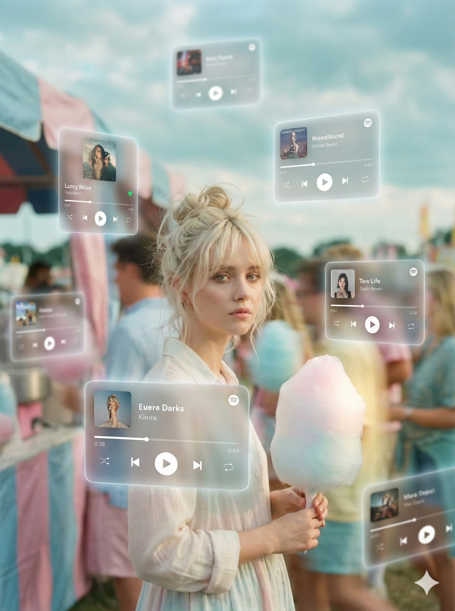
</div>

**提示词：**
```
A dreamlike, movie-quality augmented reality visual where numerous hovering Spotify player interface cards orbit the central figure (the person shown) in a complete 3D spatial composition, with each music player card strategically placed at varying distances, some prominently positioned in front and partially covering the subject, while others float behind and alongside them, utilizing the authentic Apple Music UI/Spotify UI elements playback progress indicators and featuring songs by [Artist Name]; all cards display smooth rounded edges with subtle angular perspective shifts, presenting a translucent, frosted-glass aesthetic that radiates a gentle diffused border luminescence with measured cinematic light bloom interacting organically with the ambient lighting of the scene; the composition showcases a cool-to-neutral color palette with rich yet preserved shadow detail, strategic bursts of color from album artwork, medium-high contrast levels with gradual highlight transitions, delicate focal depth variation where nearer cards maintain crisp detail while farther ones receive gentle blur treatment, and understated motion-enhancing accents, all while keeping the subject photorealistic, centrally positioned, and authentically integrated into their physical surroundings.
```

**中文提示词：**
```
一个梦幻般的、电影级的增强现实视觉效果，其中众多悬浮的 Spotify 播放器界面卡片围绕中心人物（图中所示人物）旋转，构成一个完整的 3D 空间构图，每个音乐播放器卡片都经过精心布置，放置在不同的距离，有些卡片醒目地位于人物前方并部分遮挡住人物，而另一些卡片则漂浮在人物身后和旁边，利用真实的 Apple Music UI/Spotify UI 元素播放进度指示器，并展示 [艺术家姓名] 的歌曲；所有卡片都呈现出光滑的圆角边缘和微妙的角度透视变化，呈现出半透明的磨砂玻璃美感，散发出柔和的漫射边缘光晕，并带有适度的电影级光晕，与场景中的环境光自然地互动；构图展现了冷色调到中性色调的色彩，阴影细节丰富而保留，巧妙地融入了专辑封面的色彩，中高对比度与渐强的高光过渡相得益彰，景深变化细腻，近处的卡片保持清晰的细节，而远处的卡片则呈现出柔和的虚化效果，并辅以低调的动态增强效果，所有这些都保持了主体逼真、居中，并真实地融入到周围环境中。
```

<a id="prompt-958"></a>
## 案例 958：卡通风格钥匙扣 (来源 [@r4jjesh](https://x.com/r4jjesh/status/2002893222608331014)) 模型：Nano banana pro

<div style="display: flex; justify-content: space-between;">
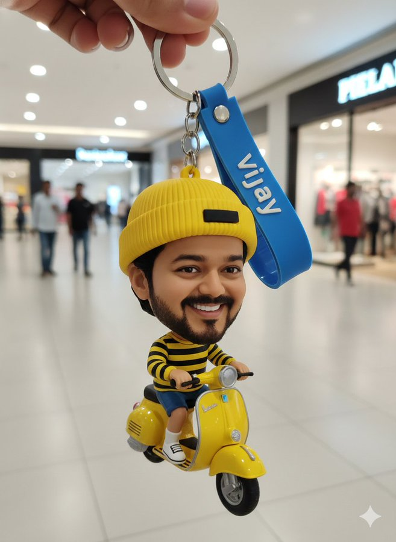
</div>

**提示词：**
```
{
  "reference": "use uploaded image as facial reference, preserve original face and identity exactly",
  "character_type": "caricature-style keychain, gender-neutral",
  "pose": "riding a yellow scooter indoors",
  "head_style": "oversized head with joyful, playful smile",
  "outfit_beanie": "yellow knit beanie",
  "outfit_top": "striped yellow-black sweater",
  "outfit_bottom": "denim shorts",
  "socks": "white socks",
  "footwear": "white sneakers",
  "keychain_detail": "blue strap labeled 'SAMMU'",
  "lighting": "soft indoor lighting",
  "depth_of_field": "shallow depth of field",
  "background": "mall-like indoor environment",
  "style": "whimsical, toy-like, premium collectible",
  "photography": "cinematic product photography",
  "texture": "smooth plastic, high 
detail finish"
}
```

**中文提示词：**
```
{
“参考”：“使用上传的图片作为面部参考，精确保留原始面部和身份信息”，
"character_type": "卡通风格钥匙扣，中性款",
“姿势”：“在室内骑黄色滑板车”，
"head_style": "大头，带着快乐、俏皮的笑容",
"outfit_beanie": "黄色针织帽",
"outfit_top": "条纹黄黑毛衣",
"outfit_bottom": "牛仔短裤",
“袜子”: “白袜子”，
“鞋类”: “白色运动鞋”，
"keychain_detail": "蓝色表带，标签为'SAMMU'",
“照明”：“柔和的室内照明”，
"depth_of_field": "浅景深",
“背景”：“类似购物中心的室内环境”，
“风格”：“异想天开、玩具般、高级收藏品”
“摄影”: “电影化产品摄影”，
“质感”：光滑塑料，高
细节处理”
}
```

<a id="prompt-957"></a>
## 案例 957：高端专业平铺式产品摄影 (来源 [@elCarlosVega](https://x.com/elCarlosVega/status/2002824697013297266)) 模型：Nano banana pro

<div style="display: flex; justify-content: space-between;">
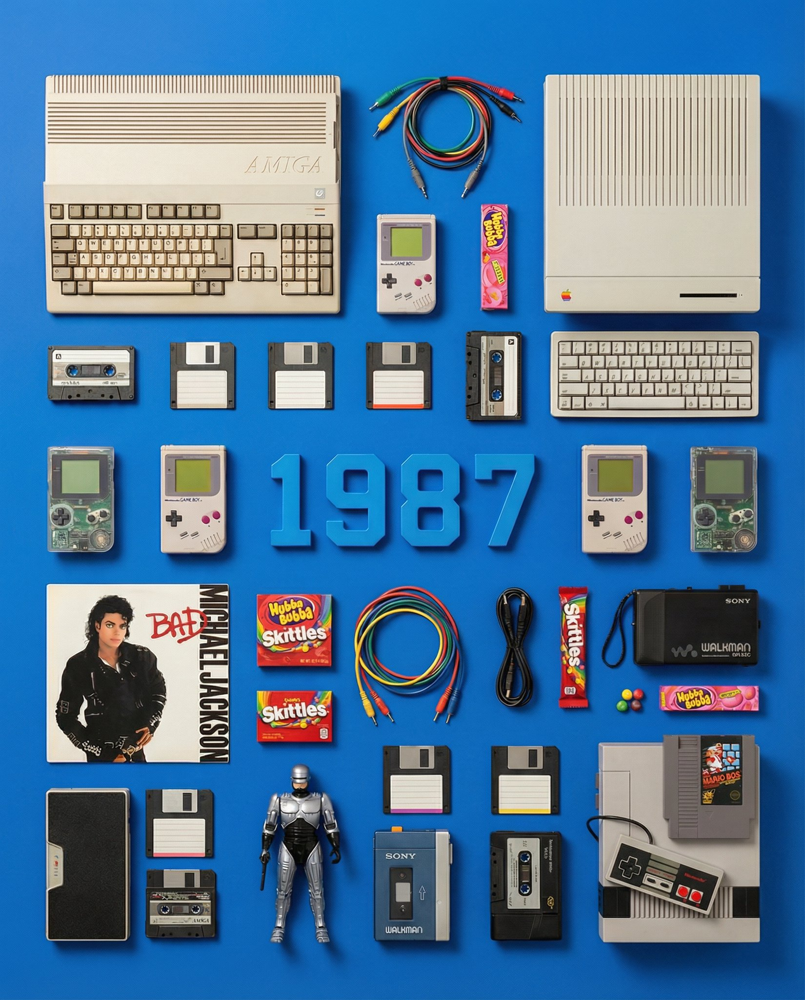
</div>

**提示词：**
```
Fotografía de producto profesional estilo 'Knolling' (Flat Lay) de alta gama, representando una cápsula del tiempo del año [AÑO].

Composición: Organización cenital meticulosamente alineada en una cuadrícula perfecta de 90 grados.
Fondo: Superficie sólida mate de color [COLOR QUE CONTRASTE, EJ: AMARILLO MOSTAZA / AZUL ELÉCTRICO].

Sujetos (Autogeneración Histórica): Selecciona y renderiza con precisión fotográfica los 5 objetos tecnológicos o de cultura pop más icónicos lanzados específicamente en [AÑO]. Incluye 5-7 accesorios menores correspondientes a la época (cables, medios de almacenamiento, papelería o dulces retro).

Elemento Central: El año "[AÑO]" está escrito en el centro exacto de la cuadrícula utilizando tipografía física y táctil (letras de plástico recortado, madera o metal) con una fuente acorde a la década.

Iluminación y Estética: Iluminación de estudio "Softbox" cenital, completamente difusa y sin sombras duras (shadowless).

Estilo: Simetría obsesiva tipo Wes Anderson, vibrante, deconstruido, organizado y visualmente satisfactorio.
Renderizado: Fotorealismo 8k, texturas de plástico y metal detalladas.
```

**中文提示词：**
```
高端专业“平铺式”产品摄影，代表了[年份]年的时光胶囊。

构图：精心排列的天顶线构成完美的 90 度网格。
背景：纯哑光表面，颜色为对比色[例如：芥末黄/电光蓝]。

主题（历史自创）：选择并以照片般的精确度呈现[年份]发布的5件最具代表性的科技或流行文化物品。包括5-7件与该时代相符的小配件（线缆、存储介质、文具或复古糖果）。

中心元素：年份“[YEAR]”用实体和触感排版（切割塑料字母、木头或金属）写在网格的正中心，字体选择与该年代相符。

灯光和美学：顶部“柔光箱”摄影棚照明，完全漫射，没有硬阴影（无阴影）。

风格：极致对称，韦斯·安德森式，充满活力，解构主义，井然有序，视觉上令人愉悦。
渲染：8K 照片级真实感，精细的塑料和金属纹理。
```

<a id="prompt-956"></a>
## 案例 956：显示在2000年代初日本的手机屏幕上 (来源 [@serena_ailab](https://x.com/serena_ailab/status/2002854097494687964)) 模型：Nano banana pro

<div style="display: flex; justify-content: space-between;">
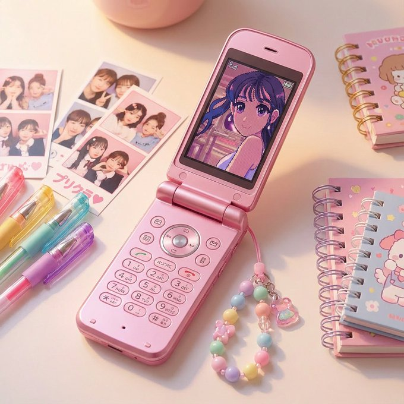
</div>

**提示词：**
```
Display the subject from the attached image on a flip phone (garakei) LCD screen from early 2000s Japan. The phone is open, with glossy pink or white shell, physical buttons, and simple beaded straps with pastel colored beads. The screen shows the image with pixelated edges and warm color saturation typical of 2000s mobile displays. Surrounded by nostalgic items like photo stickers, gel pens, and mini notebooks. Nostalgic, kawaii, emotional, soft lighting.
```

**中文提示词：**
```
将附图中的主题显示在2000年代初日本的翻盖手机（garakei）液晶屏幕上。手机处于打开状态，外壳是亮粉色或白色，带有实体按键和简单的串珠表带，表带上串着柔和色调的珠子。屏幕上的图像边缘略带像素化，色彩饱和度偏暖，这是2000年代手机屏幕的典型特征。周围摆放着一些充满怀旧气息的小物件，例如照片贴纸、中性笔和迷你笔记本。画面充满怀旧、可爱、温馨的氛围，灯光柔和。
```

<a id="prompt-955"></a>
## 案例 955：3D橡胶软管角色设计 (来源 [@The_Sycomore](https://x.com/The_Sycomore/status/2002841670992502880)) 模型：Nano banana pro

<div style="display: flex; justify-content: space-between;">
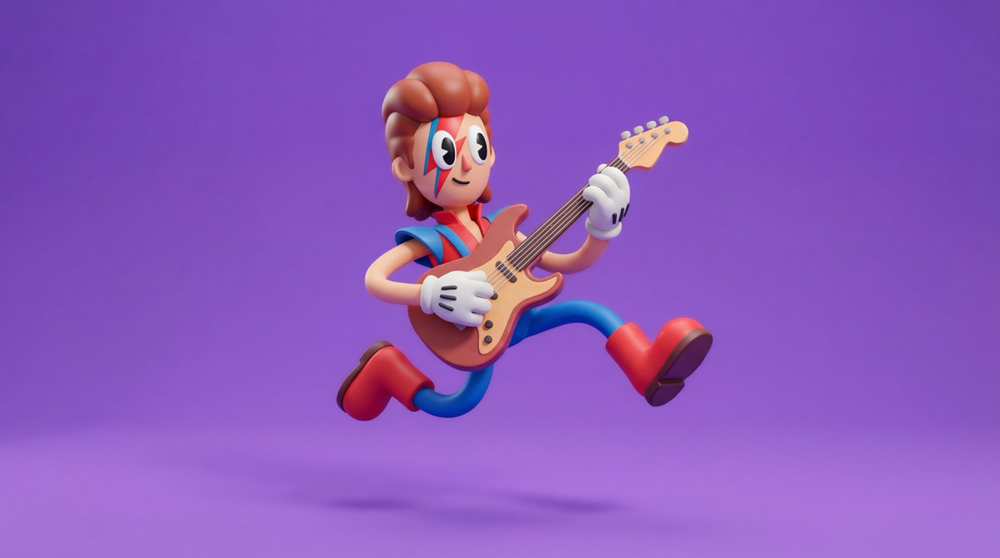
</div>

**提示词：**
```
[Subject], stylized 3D rubberhose character, smooth 3D render,  Solid [Color] color background, dynamic pose, soft ground shadow, bright soft lighting, modern playful design
```

**中文提示词：**
```
[主题]，风格化的3D橡胶软管角色，流畅的3D渲染，纯色[颜色]背景，动态姿势，柔和的地面阴影，明亮柔和的光照，现代趣味设计
```

<a id="prompt-954"></a>
## 案例 954：一张完整的产品高端宣传照 (来源 [@AmirMushich](https://x.com/AmirMushich/status/2002793794975273279)) 模型：Nano banana pro

<div style="display: flex; justify-content: space-between;">
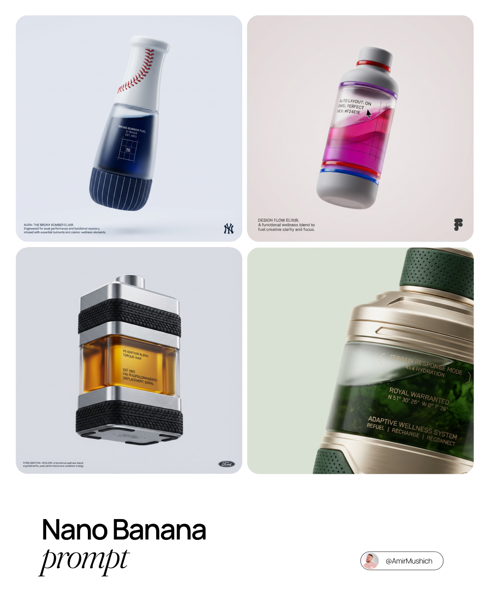
</div>

**提示词：**
```
[BRAND NAME] is launching a new functional wellness elixir (e.g., adaptogenic, nootropic, or natural energy drink). As the Creative Director, devise a product name and visualize a complete high-end promotional shot. The aesthetic is "Cosmic Premium"—technological, clean, and sophisticated, like top-tier Apple product photography.

THE PRODUCT: Design a sculptural, multi-layered beverage bottle suspended in the center. The form is engineered and futuristic. The materials are hyper-tactile: bead-blasted titanium details, frosted borosilicate glass, and textured haptic polymer grips.
**Crucial Color Instruction:** The liquid inside must have a distinct, natural color relevant to its invented function (e.g., vibrant turmeric yellow, deep berry red, earthy matcha green, or pale calming blue). The liquid should look real with subtle natural sediment.
**Crucial Graphic Detail:** On the clear glass section of the bottle, apply a layer of subtle, minimalist, technical typography printed in matte white ink. This design should feel utilitarian and futuristic (e.g., small technical specs like 'SPACE GRADE FORMULA', 'BATCH: OZ-9', volume indicators, or coordinate markings), adding a functional aesthetic similar to aerospace labeling, without overwhelming the bottle's clean lines.

THE ENVIRONMENT & LIGHTING: The bottle is in a seamless studio.
**Crucial Background Instruction:** The background must be a solid, clean, very light pastel tone that is specifically chosen to complement the liquid color (e.g., a soft cool mint background for a warm orange liquid, or a pale blush background for a deep green liquid). No gradients. Ultra-soft, diffused studio lighting creates sleek highlights on metal and deep subsurface scattering in the glass and liquid.

PHOTOGRAPHY STYLE: High-resolution 100mm macro lens shot. Shallow depth of field, sharp focus on bottle textures and the printed graphics on the glass, smooth pastel background bokeh. 8k resolve, hyper-realistic textures.

GRAPHIC OVERLAYS: Include subtle dark gray UI elements.
Bottom Left Corner: Very small, minimalist text (like Manrope Regular font) describing the product's name and function in two sentences.
Bottom Right Corner: A small, minimalist dark gray logomark for [BRAND NAME].
```

**中文提示词：**
```
[品牌名称] 即将推出一款全新的功能性健康饮品（例如，具有适应原、益智或天然能量的饮料）。作为创意总监，请构思产品名称并构思一张完整的高端宣传照。美学风格为“宇宙级奢华”——科技感十足、简洁精致、高端大气，如同顶级苹果产品摄影作品。

产品：设计一款造型独特、多层结构的饮料瓶，瓶身悬浮于中央。造型充满未来感和工程感。材质触感极佳：喷砂钛金属细节、磨砂硼硅酸盐玻璃和纹理触感聚合物握把。
**关键颜色说明:**内装液体必须具有与其功能相符的独特、自然的颜色（例如，鲜艳的姜黄、深邃的浆果红、质朴的抹茶绿或宁静的浅蓝）。液体应呈现逼真的效果，并带有细微的天然沉淀。
**关键图形细节:**在瓶子的透明玻璃部分，印上一层简洁、极简的哑光白色技术字体。这种设计应兼具实用性和未来感（例如，“太空级配方”、“批次: OZ-9 ”等小型技术规格、容量指示或坐标标记），增添类似航空航天标签的功能美感，同时又不破坏瓶子简洁的线条。

环境与灯光：瓶子放置在一个无缝摄影棚内。
**关键背景说明:**背景必须是纯色、干净、非常浅的粉彩色调，并且要经过精心挑选以衬托液体颜色（例如，暖橙色液体搭配柔和的薄荷绿背景，或深绿色液体搭配淡粉色背景）。禁止使用渐变色。超柔和的漫射摄影棚灯光可以在金属表面营造出光滑的高光，并在玻璃和液体表面形成深邃的散射效果。

摄影风格：高分辨率100mm微距镜头拍摄。浅景深，清晰聚焦于瓶身纹理和玻璃上的印刷图案，柔和的粉彩背景虚化。8K分辨率，超逼真的纹理。

图形叠加层：包含微妙的深灰色用户界面元素。
左下角：非常小的极简文字（类似 Manrope Regular 字体），用两句话描述产品的名称和功能。
右下角：[品牌名称] 的小型、极简的深灰色标志。
```

<a id="prompt-953"></a>
## 案例 953：普通物体转化为巨型纪念碑 (来源 [@aleenaamiir](https://x.com/aleenaamiir/status/2002937974993088841)) 模型：Nano banana pro

<div style="display: flex; justify-content: space-between;">
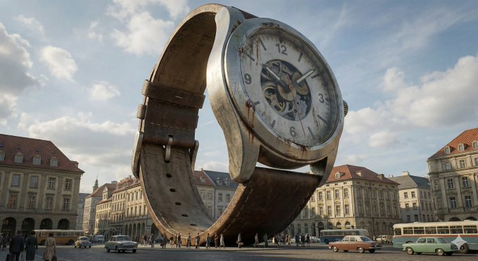
</div>

**提示词：**
```
Transform [EVERYDAY OBJECT] into a massive real-world monument. Surface materials are physically accurate, with visible wear, scratches, dust, and scale references like people and vehicles. Shot from a low-angle cinematic perspective, realistic daylight, ultra-detailed textures.
```

**中文提示词：**
```
将[日常物品]转化为一座宏伟的现实世界纪念碑。表面材质真实还原物理细节，包括可见的磨损、划痕、灰尘以及人物和车辆等比例参照物。采用低角度电影视角拍摄，逼真的日光效果，以及超精细的纹理。
```

<a id="prompt-952"></a>
## 案例 952：不同服装风格的贴纸 (来源 [@linxiaobei888](https://x.com/linxiaobei888/status/2003003721827987592)) 模型：Nano banana pro

<div style="display: flex; justify-content: space-between;">
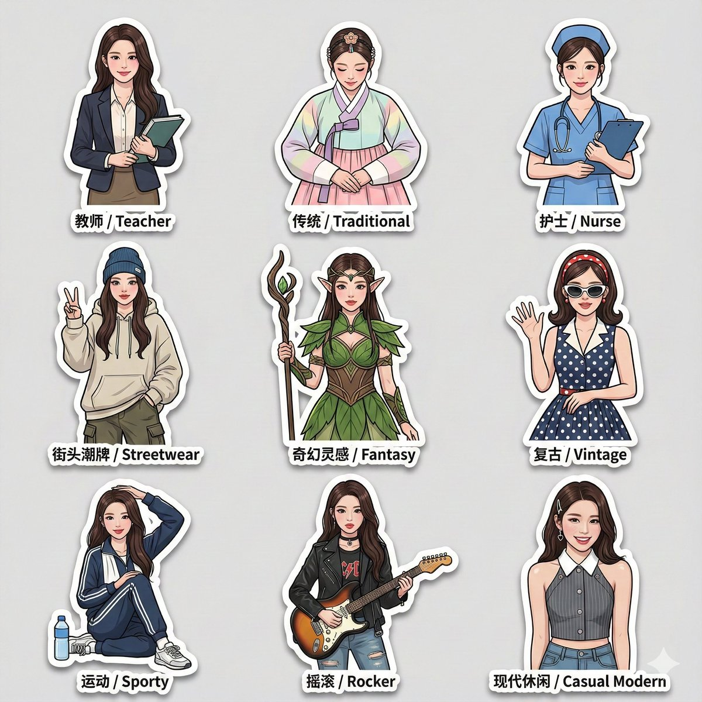
</div>

**中文提示词：**
```
一个以上传照片为原型的3*3贴纸包，人物穿着不同服装和时尚风格。边缘干净裁剪，带有粗线条轮廓，姿势富有表现力，整体采用活泼的现代贴纸设计。在每个贴纸旁边采用中英文标注风格，所有贴纸保持相同的面部特征、一致的相似度和比例。
包含教师装、传统、护士制服、街头潮牌和奇幻灵感等多种服装风格。高分辨率成品，带有柔和阴影和光泽贴纸纸张质感，适合社交分享。
```

<a id="prompt-951"></a>
## 案例 951：衣服悬浮在空中 (来源 [@GirlsinAIArt](https://x.com/GirlsinAIArt/status/2003021477277483079)) 模型：Nano banana pro

<div style="display: flex; justify-content: space-between;">
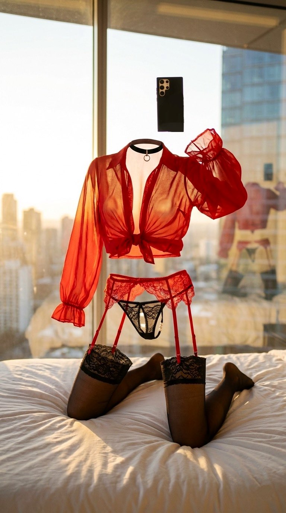
</div>

**提示词：**
```
A shape is an illusion created by placing clothes floating in the air.
```

**中文提示词：**
```
形状是通过将衣服悬浮在空中而产生的错觉。
```

<a id="prompt-950"></a>
## 案例 950：圣诞特辑-我的圣诞与自己合拍 (来源 [@songguoxiansen](https://x.com/Lee06253046/status/2002382591823896676)) 模型：Nano banana pro

<div style="display: flex; justify-content: space-between;">
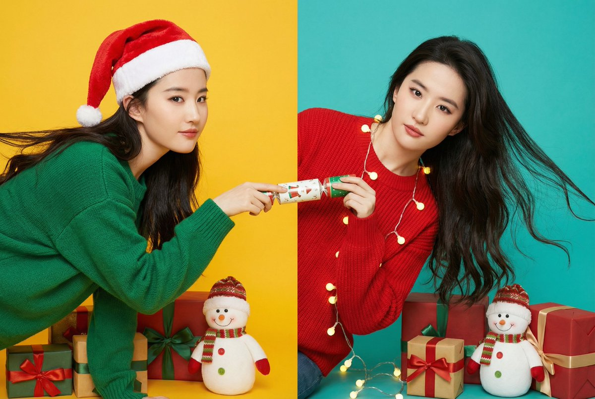
</div>

**提示词：**
```
(2-panel vertical split, twin concept, studio photography). Two panels side-by-side showing the specific character interacting with the frame edge (as if looking at herself). [CRITICAL: Keep the face identical to the source image in both panels].

Left Panel: Wearing a green sweater and Santa hat, holding a Christmas cracker ready to pull, leaning right.
Right Panel: Wearing a red sweater, holding the other end of the Christmas cracker, leaning left. Surrounded by Christmas lights.
Props: Wrapped gifts and a snowman doll at their feet.
Background: Yellow or teal bright studio background.
Lighting: Flat, bright, shadowless lighting.
Style: Fun, creative, "cloning" effect, playful narrative.
aspect_ratio: 16:9
```

**中文提示词：**
```
（两格竖版分镜，双生主题，影棚拍摄）两格画面并排呈现，特定角色与画框边缘互动（仿佛在看向镜中的自己）【重要要求：两格画面中人物的面部必须与原图完全一致】
左格：身着绿色毛衣、头戴圣诞帽，手持圣诞拉炮待拉响，身体向右倾斜右格：身着红色毛衣，握住圣诞拉炮的另一端，身体向左倾斜，周身环绕圣诞彩灯
道具：脚边摆放包装好的礼物与雪人玩偶背景：明亮的黄色或蓝绿色影棚背景光线：均匀明亮、无阴影的打光风格：活泼新颖，带 “分身” 特效，营造趣味叙事感画面比例：16:9
```

<a id="prompt-949"></a>
## 案例 949：圣诞特辑-红韵点睛圣诞风尚志 (来源 [@songguoxiansen](https://x.com/Lee06253046/status/2002735852284457029)) 模型：Nano banana pro

<div style="display: flex; justify-content: space-between;">
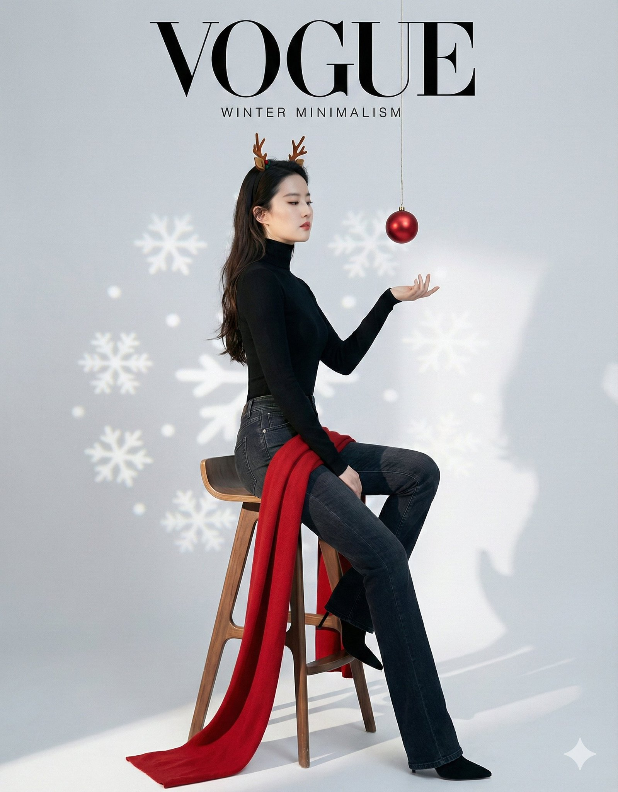
</div>

**提示词：**
```
(Magazine cover layout, minimalist composition, negative space). A full-body studio shot of the specific character sitting on a tall stool. [CRITICAL: Ensure the face is exactly the same as the reference].

Styling: Minimalist chic outfit (black turtleneck, jeans). A long red scarf flowing down. Wearing subtle reindeer antlers. Props: A single red Christmas bauble hanging from a string right above her hand. Snowflake light patterns projected on the background wall. Background: Solid light grey or white seamless paper. Lighting: Soft, directional light creating a clean look with defined shadows. Style: Vogue or Elle magazine style, high fashion, clean lines, modern and sophisticated.
```

**中文提示词：**
```
（杂志封面版式，极简构图，留白设计）特定人物坐在高脚凳上的全身棚拍造型。【重点要求：务必保证人物面部与参考图完全一致】
造型：简约时髦穿搭（黑色高领毛衣、牛仔裤），一条红色长围巾垂坠飘动。佩戴低调的驯鹿角发饰。道具：一颗红色圣诞装饰球用细绳悬挂，恰好位于她的手上方。背景：雪花光影图案投射于背景墙面；背景采用纯色浅灰或白色无缝背景纸。光线：柔和定向光，打造干净利落的视觉效果，同时形成轮廓清晰的阴影。风格：《Vogue》或《Elle》杂志风格，高奢时尚，线条简洁，兼具现代感与精致格调。
```

<a id="prompt-948"></a>
## 案例 948：圣诞特辑-圣诞四格甜妹 (来源 [@songguoxiansen](https://x.com/Lee06253046/status/2002730147313840161)) 模型：Nano banana pro

<div style="display: flex; justify-content: space-between;">

</div>

**提示词：**
```
(Masterpiece, top quality, ultra-detailed, 8k resolution). A photorealistic 4-panel split screen grid collage featuring the same specific female character in all panels. [CRITICAL: Maintain exact facial features, preserve original face structure, consistent character reference throughout all panels]. The character has a fair complexion, natural skin texture, and bright eyes.
Panel 1 (Top Left): The character is winking playfully, wearing plush reindeer antlers, holding a candy cane near her cheek, joyful expression.Panel 2 (Top Right): The character is wearing a red Santa hat with white fur trim, looking surprised with hands covering her mouth, eyes wide open.Panel 3 (Bottom Left): The character is blowing a kiss, holding a small wrapped gift box with a gold ribbon, wearing a cozy oversized white knitted sweater.Panel 4 (Bottom Right): The character is giving a soft smile, eyes full of affectionate gaze, wearing a Christmas reindeer accessory around her neck, dressed in a red velvet Christmas dress with white fur trim, wearing red fluffy Christmas gloves, forming a heart shape with both hands beside her cheeks.
Environment: Solid studio background in soft pastel red or green.Lighting: Bright, high-key studio lighting, ring light reflection in eyes, soft shadows, uniform illumination.Style: Korean photobooth style, vibrant colors, sharp focus, cute and energetic atmosphere, commercial photography aesthetic.
```

**中文提示词：**
```
（杰作级，顶级品质，超高清细节，8K分辨率）。这是一幅逼真的四格分屏网格拼贴画，所有画面均以同一位女性角色为中心。[关键：保持面部特征的精准还原，保留原有的面部结构，所有画面均使用一致的角色参考图]。该角色肤色白皙，肤质自然，双眸明亮动人。
第一格（左上）：角色俏皮地眨着眼，头戴毛绒驯鹿角，脸颊边放着一根拐杖糖，表情快乐。第二格（右上）：角色戴着一顶镶有白色毛边的红色圣诞帽，双手捂着嘴，睁大眼睛，一脸惊讶。第三格（左下）：角色送出一个飞吻，手里拿着一个系着金色丝带的小礼盒，身穿一件舒适的白色宽松针织衫。第四格（右下）：角色露出温柔的微笑，眼神充满爱意，脖子上戴着圣诞驯鹿饰品，身穿镶有白色毛边的红色天鹅绒圣诞连衣裙，戴着红色毛绒圣诞手套，双手放在脸颊两侧，比出一个心形。
环境：柔和的粉红色实心影棚背景或green.Lighting ：明亮的高调影棚灯光，眼睛中环形灯反射，柔和的阴影，均匀illumination.Style ：韩式照相亭风格，鲜艳的色彩，清晰的焦点，可爱而充满活力的氛围，商业摄影美学。
```

<a id="prompt-947"></a>
## 案例 947：圣诞特辑-人物定格在奇幻巨型玻璃雪球里 (来源 [@songguoxiansen](https://x.com/Lee06253046/status/2002370189384691980)) 模型：Nano banana pro

<div style="display: flex; justify-content: space-between;">
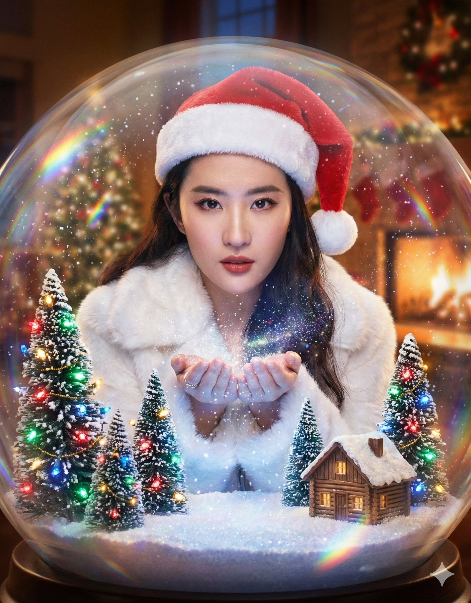
</div>

**提示词：**
```
(Surrealism, fantasy art, macro photography style). A magical composition where the specific character is captured inside a giant, life-sized glass snow globe. [CRITICAL: Keep the face identical to the source image, maintain consistent facial features within the glass distortion].

Inside the Globe: The character is wearing a white faux fur winter coat and a red Santa hat, catching falling snowflakes with her hands. The environment inside includes miniature snow-covered pine trees decorated with colorful Christmas lights twinkling in red, green, blue, and gold. A tiny wooden cabin sits among the trees. Swirling magical glitter and snow dust fill the air inside the sphere.

Outside the Globe: The background is a blurry, cozy living room with a fireplace, emphasizing that the character is inside the ornament.

Lighting: The snow globe is glowing from within, illuminated by the warm colorful glow of the Christmas tree lights mixing with cool magical blue and white light on the falling snow. The character's face is beautifully lit by this magical mixed lighting. External warm light reflects off the curved glass surface, creating rainbow prismatic effects.

Technical: Ray tracing reflections on the glass, refraction effects, crystal clear focus on the character, magical atmosphere, ethereal and dreamy aesthetic, 8k resolution, intricate details of the snowflakes and Christmas lights bokeh.
```

**中文提示词：**
```
（超现实主义、奇幻艺术、微距摄影风格）。一幅充满魔幻色彩的作品，将特定人物置于一个巨大的、真人大小的玻璃雪球中。[关键：保持面部与原图一致，在玻璃变形中保持面部特征的一致性]。

球体内部：人物身穿白色人造毛皮冬装，头戴红色圣诞帽，正用手接住飘落的雪花。球体内部的景象包括覆盖着白雪的微型松树，树上装饰着闪烁着红、绿、蓝、金四色圣诞彩灯。树丛中坐落着一间小木屋。球体内部弥漫着旋转的魔法闪光和雪花。

地球仪外部：背景是一个模糊的、舒适的客厅，里面有一个壁炉，强调了人物位于装饰品内部。

灯光：雪球内部散发着柔和的光芒，圣诞树彩灯温暖多彩的光芒与飘落雪花上清冷梦幻的蓝白色灯光交相辉映。人物的脸庞在这梦幻般的混合灯光下显得格外美丽。外部温暖的光线反射在弧形玻璃表面，折射出彩虹般的棱镜效果。

技术特点：光线追踪玻璃上的反射、折射效果、清晰聚焦于人物、营造神奇氛围、空灵梦幻的美感、8K 分辨率、雪花和圣诞彩灯散景的精细细节。
```

<a id="prompt-946"></a>
## 案例 946：指定年份的小玩意和发明可视化 (来源 [@Gdgtify](https://x.com/Gdgtify/status/2002307108050776474)) 模型：Nano banana pro

<div style="display: flex; justify-content: space-between;">
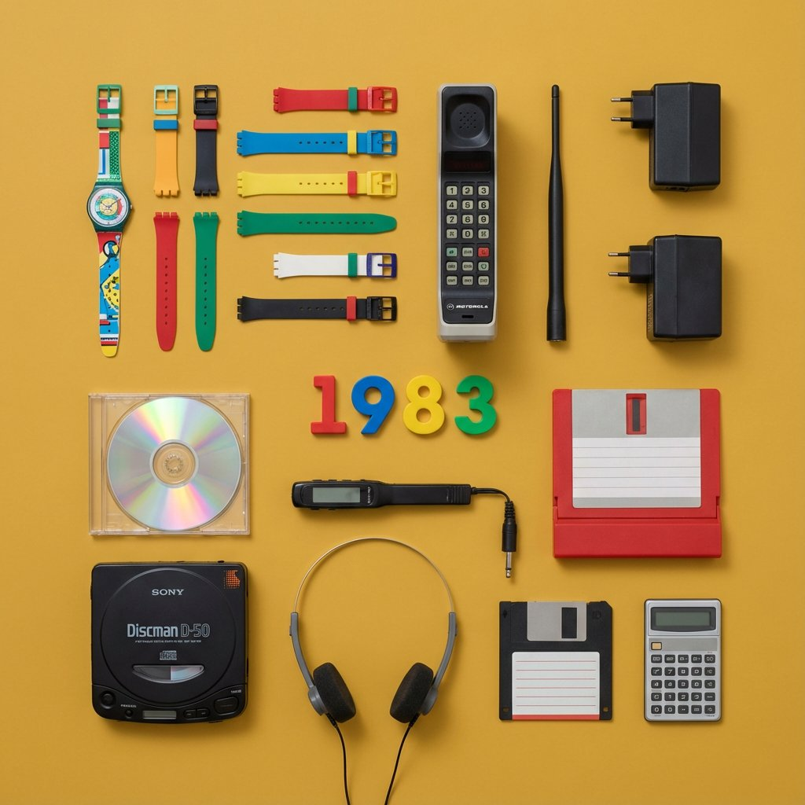
</div>

**提示词：**
```
Do this for 1983 > You are a Professional Product Photographer specializing in knolling Flat Lay photography. I will provide a Year or inventor. Step 1: The Selection.  > Identify 3 to 5 inventions from that year, plus 5-7 smaller related accessories (e.g., if the invention is a camera, include film rolls; if it's a car part, include a wrench).   

Step 2: The Layout. Arrange all items on a flat, solid-colored matte background (choose a color that contrasts well with the items). 

The Grid: Align everything at perfect 90-degree angles. Organize them by size and shape. 

The Vibe: Deconstructed, organized, satisfying, geometric. 

The Lighting:

Soft, flat, overhead studio lighting (shadowless).

Output:

 A single 4:5 image.

The Year (e.g., "1955") should be arranged using physical typography (like metal letters or cut paper) placed in the center of the grid. 

Style: Wes Anderson symmetry, high-end commercial advertising, vibrant.
```

**中文提示词：**
```
请完成以下关于 1983 年的任务 > 您是一位专业产品摄影师，专长于轻柔的平铺摄影。我将提供一个年份或一位发明家。步骤 1：选择。  >从该年份中找出 3 到 5 项发明，以及 5 到 7 项相关的小型配件（例如，如果发明是相机，则包括胶卷；如果是汽车零件，则包括扳手）。

步骤 2：布局。将所有物品排列在平整的纯色哑光背景上（选择与物品形成鲜明对比的颜色）。

网格法：将所有物体对齐成完美的 90 度角。按大小和形状进行排列。

氛围：解构的、有条理的、令人满意的、几何的。

照明：

柔和、平整的顶灯式摄影棚照明（无阴影）。

输出：

一张4:5比例的图片。

年份（例如“1955”）应使用实体印刷品（如金属字母或剪纸）放置在网格的中心。

风格：韦斯·安德森式的对称美，高端商业广告风格，充满活力。
```

<a id="prompt-945"></a>
## 案例 945：将你最喜欢的角色变成收藏品 (来源 [@Gdgtify](https://x.com/Gdgtify/status/2002116477307044203)) 模型：Nano banana pro

<div style="display: flex; justify-content: space-between;">
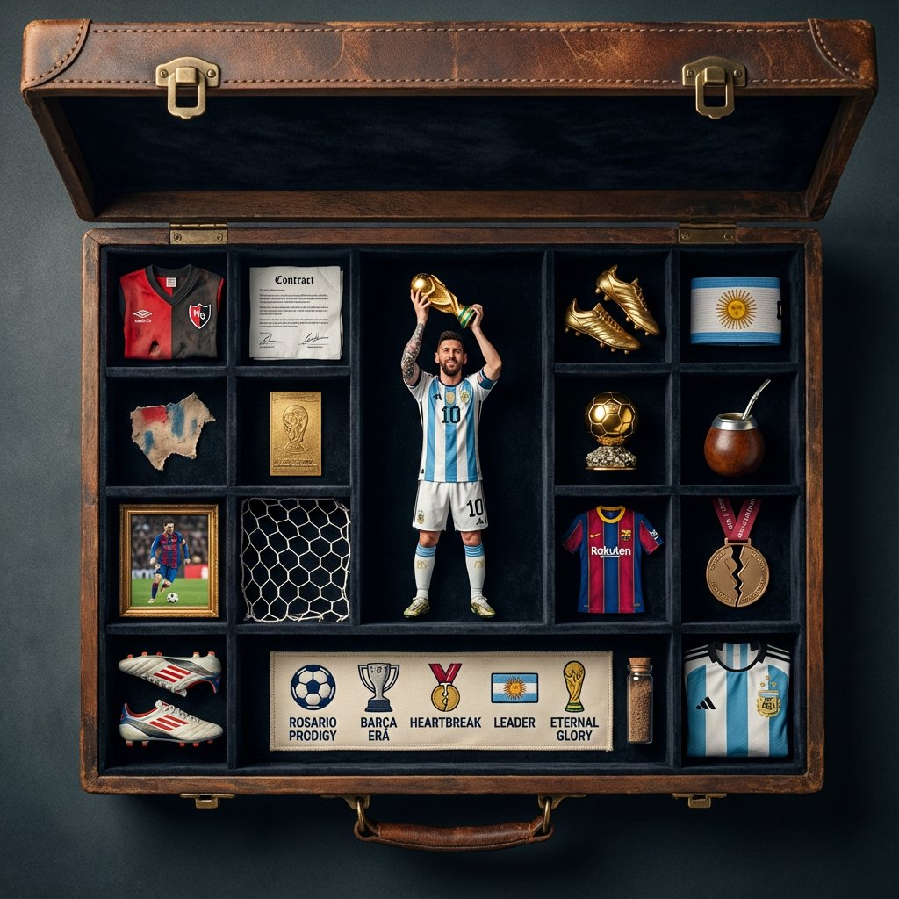
</div>

**提示词：**
```
do this for Messi: <instruction>
Relic-Loadout Kit
Input A is a fictional or real character (image/name) OR story IP (poster/name).
Analyze and infer: character archetype, iconic scene, signature items, and moral arc.
Goal: Premium collector kit box with compartments (no logos; minimal text).
Rules:
Center compartment: mini figurine.
Surround 10–16 relic props that teach the character arc (before/after item, symbol of sacrifice, tool of choice).
Add a tiny “arc timeline” strip with 5 beats (icons + 1–2 words max each).
Output: one image, 4:5 product hero shot.
</instruction>
```

**中文提示词：**
```
请为梅西做这件事：</指令>
遗物装备包
输入 A 是虚构或真实的角色（图像/名称）或故事 IP（发布者/名称）。
分析和推断：人物原型、标志性场景、标志性物品和道德弧线。
目标：带隔层的优质收藏套装盒（无标志；文字极少）。
规则：
中间隔层：迷你人偶。
围绕 10-16 件遗物道具来展现角色弧光（前后物品、牺牲的象征、选择的工具）。
添加一个包含 5 个节点的“弧线时间轴”小条（每个节点最多可包含 1-2 个图标和 1-2 个单词）。
输出：一张图片，4:5 产品主图。
</指令>
```

<a id="prompt-944"></a>
## 案例 944：超逼真的Macbook屏幕视频会议图 (来源 [@egeberkina](https://x.com/egeberkina/status/2002114484903800832)) 模型：Nano banana pro

<div style="display: flex; justify-content: space-between;">

</div>

**提示词：**
```
{
  "task": "hyper_realistic_macbook_screen_photography",
  "reference_logic": "exact_microsoft_teams_waiting_room_ui_macos",
  "output": {
    "type": "single_image",
    "resolution": "ultra_high_resolution_8k",
    "realism": "indistinguishable_from_real_laptop_photo",
    "capture_style": "iphone_photo_of_macbook_screen",
    "post_processing": "none"
  },
  "scene": {
    "application": "Microsoft Teams",
    "platform": "macOS",
    "ui_state": "meeting_waiting_room",
    "top_status_text": "Meeting now",
    "center_message": "We've let people in the meeting know you're waiting.",
    "background": "pure_black_dark_mode"
  },
  "ui_layout": {
    "left_panel": {
      "video_preview": {
        "position": "bottom_left",
        "aspect_ratio": "landscape",
        "camera_toggle": "on",
        "background_filters_button": "visible_below_preview"
      }
    },
    "right_panel": {
      "audio_section": {
        "title": "Computer audio",
        "selected_device": "AirPods Max",
        "volume_slider": "horizontal_blue_indicator",
        "mute_toggle": "off"
      },
      "audio_options": [
        "Phone audio",
        "Room audio",
        "Don't use audio"
      ],
      "cancel_button": {
        "label": "Cancel",
        "position": "bottom_right",
        "style": "rounded_rectangle"
      }
    }
  },
  "subject": {
    "gender": "female",
    "hair": {
      "color": "natural_blonde",
      "style": "soft_bangs_with_loose_layers",
      "texture": "individual_strands_visible"
    },
    "face": {
      "skin": "true_human_skin_texture",
      "details": "visible_pores_micro_imperfections",
      "retouching": "none"
    },
    "eyewear": {
      "brand": "Ray-Ban",
      "model": "Wayfarer",
      "type": "prescription_glasses",
      "frame_color": "black",
      "lens_reflection": "subtle_real_world_glare"
    },
    "headphones": {
      "model": "AirPods Max",
      "color": "space_gray",
      "fit": "natural_over_ear_position"
    },
    "clothing": {
      "top": "neutral_crop_top",
      "style": "casual_minimal"
    },
    "expression": "calm_focused_waiting",
    "gaze": "slightly_downward"
  },
  "environment": {
    "background": "modern_open_office",
    "ceiling": "exposed_industrial_ducts",
    "lighting": {
      "type": "soft_natural_daylight",
      "mixed_with": "indoor_office_lighting",
      "temperature": "5200K"
    }
  },
  "screen_reflection": {
    "enabled": true,
    "source": "same_subject_as_video_preview",
    "reflection_type": "soft_glass_reflection",
    "intensity": "very_subtle",
    "opacity": 0.05,
    "sharpness": "low",
    "distortion": "slight_glass_warp",
    "positioning": "offset_not_centered",
    "visibility_rules": {
      "ui_text": "fully_readable",
      "icons": "unobstructed",
      "reflection_never_overpowers_ui": true
    },
    "realism_notes": [
      "not_mirror_like",
      "not_double_face",
      "no_symmetry",
      "appears_only_on_dark_areas"
    ]
  },
  "macos_elements": {
    "dock": {
      "visible": true,
      "style": "macos_default_big_sur_or_later",
      "reflection": "subtle",
      "indicator_dot": "visible_under_active_apps",
      "icons": [
        "Finder",
        "Mail",
        "Calendar",
        "Microsoft Teams",
        "Adobe Illustrator",
        "Adobe InDesign",
        "Adobe After Effects",
        "Adobe Lightroom",
        "Adobe Photoshop",
        "Adobe Premiere Pro",
        "App Store",
        "System Settings"
      ]
    },
    "menu_bar": {
      "visibility": "partial_top_edge",
      "elements": [
        "WiFi",
        "Battery",
        "Time",
        "macOS_control_icons"
      ]
    }
  },
  "camera": {
    "device": "iPhone",
    "angle": "slightly_off_axis",
    "handheld": true,
    "screen_artifacts": [
      "soft_glass_reflection",
      "minor_glare",
      "fingerprint_smudges",
      "dust_particles",
      "moire_pattern"
    ]
  },
  "color_profile": {
    "contrast": "natural_display_contrast",
    "saturation": "neutral_realistic",
    "white_balance": "accurate_screen_calibrated"
  },
  "negative_prompt": [
    "generic_video_call_ui",
    "zoom_interface",
    "google_meet_ui",
    "fake_buttons",
    "wrong_fonts",
    "misaligned_panels",
    "ai_generated_ui",
    "blurred_text",
    "plastic_skin",
    "over_sharpening",
    "mirror_reflection",
    "double_face",
    "incorrect_dock_icons"
  ]
}
```

**中文提示词：**
```
{
"任务": "超逼真的Macbook屏幕摄影",
"reference_logic": "exact_microsoft_teams_waiting_room_ui_macos",
“输出”： {
"type": "single_image",
"分辨率": "超高分辨率_8k",
“真实感”： “与真实笔记本电脑照片无法区分”
"capture_style": "iphone_photo_of_macbook_screen",
"post_processing": "无"
},
“场景”： {
“应用程序”：“Microsoft Teams”，
“平台”： “macOS”，
"ui_state": "会议室等候室",
"top_status_text": "正在开会",
"center_message": "我们已经通知会议中的其他人您正在等待。"
“背景”： “纯黑_深色模式”
},
"ui_layout": {
"left_panel": {
"video_preview": {
"位置": "左下角",
"aspect_ratio": "landscape",
"camera_toggle": "开启",
"background_filters_button": "visible_below_preview"
}
},
"right_panel": {
"audio_section": {
标题：计算机音频，
"selected_device": "AirPods Max",
"音量滑块": "水平蓝色指示器",
"mute_toggle": "关闭"
},
"audio_options": [
“电话音频”，
“房间音频”，
“请勿使用音频”
],
"取消按钮": {
标签： 取消，
"位置": "右下角",
"样式": "圆角矩形"
}
}
},
“主题”： {
"性别": "女性",
“头发”： {
颜色：自然金发，
"style": "soft_bangs_with_loose_layers",
"texture": "individual_strands_visible"
},
“脸”： {
"皮肤": "真实人类皮肤纹理",
"详情": "可见毛孔微瑕疵",
“修饰”： “无”
},
"眼镜": {
品牌：雷朋，
“型号”：“旅行者”，
"type": "处方眼镜",
"frame_color": "黑色",
"lens_reflection": "subtle_real_world_glare"
},
“耳机”： {
“型号”：“AirPods Max”，
"颜色": "太空灰",
"fit": "natural_over_ear_position"
},
“衣服”： {
"上衣": "中性露脐上衣",
风格：休闲简约
},
"表情": "平静专注的等待",
“凝视”: “略微向下”
},
“环境”： {
“背景”： “现代开放式办公室”
"天花板": "裸露的工业风管",
“灯光”： {
"type": "柔和自然日光",
"mixed_with": "室内办公照明",
温度：5200K
}
},
"screen_reflection": {
“启用”：true，
"source": "same_subject_as_video_preview",
"reflection_type": "soft_glass_reflection",
“强度”： “非常微妙”，
“不透明度”：0.05，
“锐度”: “低”
"失真": "轻微玻璃变形",
"定位": "offset_not_centered",
"visibility_rules": {
"ui_text": "完全可读",
“图标”：“畅通无阻”，
"reflection_never_overpowers_ui": true
},
"realism_notes": [
"not_mirror_like",
“非双面”，
"no_symmetry",
"仅在深色区域出现"
]
},
"macos_elements": {
"码头": {
“可见”：是，
"style": "macos_default_big_sur_or_later",
“反思”：“微妙的”，
"indicator_dot": "visible_under_active_apps",
“图标”：[
“发现者”，
“邮件”，
“日历”，
“Microsoft Teams”，
“Adobe Illustrator”
“Adobe InDesign”，
“Adobe After Effects”，
“Adobe Lightroom”，
“Adobe Photoshop”，
“Adobe Premiere Pro”，
“App Store”，
系统设置
]
},
"menu_bar": {
"可见性": "部分顶部边缘",
“元素”：[
“无线上网”，
“电池”，
“时间”，
"macOS_control_icons"
]
}
},
“相机”： {
"设备": "iPhone",
"角度": "略微偏离轴线",
“手持式”：是，
"screen_artifacts": [
"soft_glass_reflection",
“轻微眩光”，
“指纹污迹”，
"灰尘颗粒",
莫尔条纹图案
]
},
"color_profile": {
"对比度": "natural_display_contrast",
"饱和度": "中性_真实"
“white_balance”: “accur_screen_calibrated”
},
"negative_prompt": [
"generic_video_call_ui",
"zoom_interface",
"google_meet_ui",
"fake_buttons",
"wrong_fonts",
“错位面板”，
"ai_generated_ui",
"模糊文本",
"塑料皮肤",
“过度锐化”
"镜像反射",
“双面”，
"incorrect_dock_icons"
]
}
```

<a id="prompt-943"></a>
## 案例 943：五联宽幅胶片拼贴作品 (来源 [@BeautyVerse_Lab](https://x.com/BeautyVerse_Lab/status/2002263911413031260)) 模型：Nano banana pro

<div style="display: flex; justify-content: space-between;">
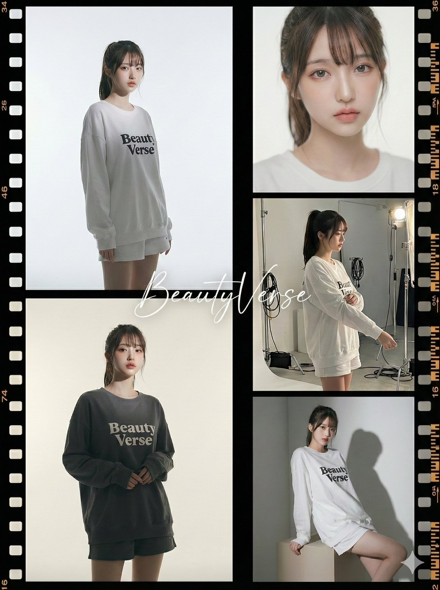
</div>

**提示词：**
```
{
  "project_title": "High-End Studio Fashion Editorial '5-Panel Wide Film' Collage",
  "structure": "Asymmetric 2-column layout: Left column contains 2 stacked panels; Right column contains 3 stacked panels. Total height of both columns is identical.",
  "aspect_ratio": "3:4",
  "aesthetic_theme": {
    "style": "Professional studio editorial mixed with seamless vintage film strip aesthetic",
    "mood": "Minimalist, sophisticated, balanced yet dynamic",
    "color_palette": [
      "Clean whites",
      "Sophisticated charcoals",
      "Soft champagne gold",
      "Deep black film borders",
      "Neutral skin tones"
    ],
    "textures": [
      "Subtle film grain",
      "Matte celluloid finish",
      "Seamless cyclorama wall",
      "High-fashion fabric textures"
    ]
  },
  "framing_and_borders": {
    "type": "Integrated 5-panel wide film strip",
    "details": [
      "The layout is a single large rectangular film frame divided into 5 segments",
      "Authentic film rebate with sprocket holes and frame numbers only on the FAR LEFT and FAR RIGHT outer vertical edges",
      "The top and bottom outer edges are clean black film borders",
      "Internal dividers: All internal lines (the central vertical divider and the horizontal lines on both sides) are simple, solid thin black lines"
    ]
  },
  "subject_reference": {
    "source": "image_1.png",
    "instruction": "The subject's physical appearance, complete outfit, and accessories must exactly match the person in image_1.png. Maintain visual consistency across all five frames."
  },
  "composition_layout": {
    "left_column_stack": {
      "dimensions": "Two stacked vertical panels",
      "frames": [
        {
          "id": "frame_top_left",
          "type": "Full-body studio editorial shot",
          "setting": "Clean minimalist studio",
          "pose": "Sophisticated standing pose, showcasing the full outfit silhouette",
          "lighting": "High-contrast rim lighting"
        },
        {
          "id": "frame_bottom_left",
          "type": "Medium-shot editorial",
          "setting": "Minimalist studio background",
          "pose": "Artistic sitting or leaning pose, focusing on the upper body and garment flow",
          "lighting": "Soft directional lighting"
        }
      ]
    },
    "right_column_stack": {
      "dimensions": "Three stacked horizontal panels matching the total height of the left column",
      "frames": [
        {
          "id": "frame_top_right",
          "type": "Close-up beauty portrait",
          "setting": "Professional studio setup",
          "pose": "Frontal view, elegant expression, focus on facial features",
          "visual_effects": "Shallow depth of field, sharp focus on eyes"
        },
        {
          "id": "frame_middle_right",
          "type": "Candid BTS side-shot",
          "setting": "Working studio environment with equipment visible",
          "lighting": "Raw studio working lights",
          "pose": "Relaxed, natural demeanor, perhaps looking at a monitor off-camera",
          "props_and_details": "Visible C-stands and studio cables"
        },
        {
          "id": "frame_bottom_right",
          "type": "Dynamic detail or medium-shot",
          "setting": "Studio corner with minimalist pedestal",
          "lighting": "Butterfly lighting setup",
          "pose": "Fashion-forward pose, highlighting accessories or specific outfit textures"
        }
      ]
    }
  },
  "central_element": {
    "type": "Signature Overlay",
    "content": "BeautyVerse",
    "position": "Center of the entire composition, placed on the central vertical divider",
    "style": {
      "appearance": "Elegant fluid cursive, translucent white ink",
      "texture": "Fine ink stroke",
      "scaling": "Medium-sized"
    }
  }
}
```

**中文提示词：**
```
{"项目标题": "高端影棚时尚大片《五联宽幅胶片》拼贴作品","布局结构": "非对称双栏布局：左栏包含 2 个竖向堆叠的画面单元；右栏包含 3 个竖向堆叠的画面单元，两栏总高度保持一致","画幅比例": "3:4","美学主题": {"风格定位": "专业影棚大片风格融合无缝复古胶片条质感","整体氛围": "简约高级，平衡且富有动感","色彩搭配": ["纯净白色","高级炭灰色","柔和香槟金色","深邃黑色胶片边框","自然裸肤色"],"质感表现": ["细腻胶片颗粒","哑光赛璐珞质感","无缝影棚弧形背景墙","高级时装面料肌理"]},"画框与边框设计": {"边框类型": "一体化五联宽幅胶片式边框","细节说明": ["整体构图为一个大型矩形胶片画框，内部划分为 5 个画面单元","仅在最左侧和最右侧的外垂直边缘保留真实的胶片边缘留白、齿孔及画面编号","上下外边缘为简洁的纯黑胶片边框","内部分割线：所有内部线条（竖向中分割线及两侧的横向分割线）均为简洁的纯黑色细实线"]},"人物参考要求": {"参考素材": "image_1.png","执行说明": "人物的外形、全套服装及配饰必须与 image_1.png 中的人物完全一致，所有五个画面单元需保持视觉统一性"},"构图布局细则": {"左栏堆叠区域": {"尺寸规格": "两个竖向堆叠的画面单元","画面设定": [{"编号": "左上画面","拍摄类型": "全身影棚时尚大片","场景设定": "极简干净的影棚环境","姿势要求": "优雅站姿，完整展现服装廓形","灯光方案": "高对比度轮廓光"},{"编号": "左下画面","拍摄类型": "中景时尚大片","场景设定": "极简影棚背景","姿势要求": "艺术感坐姿或倚靠姿势，聚焦上半身及服装垂坠感","灯光方案": "柔和定向光"}]},"右栏堆叠区域": {"尺寸规格": "三个横向排布的画面单元，与左栏总高度保持一致","画面设定": [{"编号": "右上画面","拍摄类型": "特写美妆肖像","场景设定": "专业影棚布景","姿势要求": "正面朝向镜头，表情优雅，聚焦面部五官","视觉效果": "浅景深处理，眼部精准对焦"},{"编号": "右中画面","拍摄类型": "抓拍式幕后侧拍镜头","场景设定": "工作状态下的影棚环境，可见各类设备","灯光方案": "影棚工作实景光源","姿势要求": "状态松弛自然，可设定为看向镜头外的监视器","道具与细节": "可见 C 型支架及影棚线缆"},{"编号": "右下画面","拍摄类型": "动感细节特写或中景镜头","场景设定": "影棚角落搭配极简展示台","灯光方案": "蝶形布光方案","姿势要求": "时尚感造型姿势，突出配饰细节或服装特定肌理"}]}},"核心视觉元素": {"元素类型": "标志性叠加文字","文字内容": "BeautyVerse","摆放位置": "整个构图的正中央，置于竖向中分割线上","风格设定": {"字体外观": "流畅优雅的草书字体，半透明白色墨效","笔触质感": "纤细精致的墨迹笔触","尺寸比例": "中等字号"}}}
```

<a id="prompt-942"></a>
## 案例 942：植发一年的改变图 (来源 [@egeberkina](https://x.com/egeberkina/status/2002465235391967688)) 模型：Nano banana pro

<div style="display: flex; justify-content: space-between;">
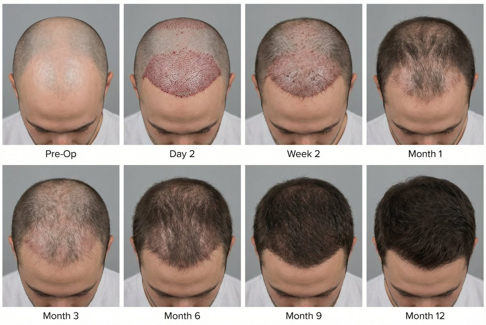
</div>

**提示词：**
```
{
  "task": "ultra_realistic_hair_transplant_progression",
  "output": {
    "type": "single_image_multi_stage",
    "layout": "horizontal_timeline_grid",
    "resolution": "ultra_high_resolution",
    "realism": "clinical_photographic_realism",
    "quality": "medical_documentary_photography",
    "retouching": {
      "skin": "minimal_medical_grade",
      "preserve_scalp_texture": true,
      "no_cosmetic_enhancement": true
    }
  },
  "subject": {
    "person": {
      "gender": "male",
      "age": "young_to_middle_adult",
      "ethnicity": "neutral",
      "identity": "same_patient_consistent",
      "head_position": "identical_angle_each_stage"
    }
  },
  "timeline": {
    "stages": [
      {
        "label": "Pre-Op",
        "time": "before_transplant",
        "hair": {
          "density": "significant_recession",
          "pattern": "male_pattern_baldness",
          "scalp_visibility": "high"
        },
        "scalp": "clean_shaved",
        "skin_tone": "natural"
      },
      {
        "label": "Day 2",
        "time": "2_days_post_op",
        "hair": {
          "grafts": "fresh_implanted_visible",
          "density": "low_evenly_spaced"
        },
        "scalp": "redness_micro_scabs_swelling",
        "notes": "clearly_visible_implant_points"
      },
      {
        "label": "Week 2",
        "time": "14_days",
        "hair": {
          "grafts": "short_fragile_hairs",
          "shedding": "early_phase"
        },
        "scalp": "reduced_redness_remaining_scabs"
      },
      {
        "label": "Month 1",
        "time": "4_weeks",
        "hair": {
          "shedding": "shock_loss_phase",
          "visibility": "patchy_thin"
        },
        "scalp": "mostly_normal"
      },
      {
        "label": "Month 3",
        "time": "12_weeks",
        "hair": {
          "regrowth": "fine_new_hairs_emerging",
          "density": "low_but_even"
        },
        "texture": "thin_soft"
      },
      {
        "label": "Month 6",
        "time": "6_months",
        "hair": {
          "density": "moderate",
          "coverage": "clearly_improving"
        },
        "texture": "thicker_but_uneven_length"
      },
      {
        "label": "Month 9",
        "time": "9_months",
        "hair": {
          "density": "high",
          "hairline": "natural_definition"
        },
        "texture": "healthy_normal_growth"
      },
      {
        "label": "Month 12",
        "time": "12_months",
        "hair": {
          "density": "final_result",
          "coverage": "full_natural"
        },
        "texture": "mature_thick_hair",
        "finish": "non_styled_natural"
      }
    ]
  },
  "scene": {
    "location": "clinical_photo_room",
    "background": {
      "color": "neutral_light_gray",
      "texture": "flat"
    },
    "consistency": "same_lighting_same_camera_same_distance"
  },
  "composition": {
    "crop": "top_of_head_and_forehead",
    "angle": "slightly_top_down",
    "alignment": "perfect_grid_spacing",
    "labels": "small_clean_medical_typography"
  },
  "camera": {
    "camera_type": "medical_documentation_camera",
    "lens": "85mm",
    "aperture": "f8",
    "sharpness": "high",
    "distortion": "none"
  },
  "lighting": {
    "type": "even_clinical_softbox",
    "contrast": "low",
    "shadows": "minimal",
    "skin_accuracy": "true_to_life"
  },
  "negative_prompt": [
    "instant_full_hair",
    "fake_density",
    "wig_like_texture",
    "beauty_lighting",
    "styled_hair",
    "marketing_glow",
    "cgi_scalp",
    "unrealistic_speed"
  ]
}
```

**中文提示词：**
```
{
"任务": "超逼真植发进展",
“输出”： {
"type": "single_image_multi_stage",
"布局": "horizo​​ntal_timeline_grid",
"分辨率": "超高分辨率",
"realism": "clinical_photographic_realism",
"质量": "医疗纪实摄影",
“修饰”：{
"皮肤": "最低医疗级",
"preserve_scalp_texture": true,
"no_cosmetic_enhancement": true
}
},
“主题”： {
“人”： {
“性别”： “男”，
“年龄”： “青年至中年”
“种族”： “中立”，
"identity": "same_patient_consistent",
"head_position": "identical_angle_each_stage"
}
},
"时间线": {
“阶段”：[
{
标签：术前，
"时间": "移植前",
“头发”： {
“密度”： “显著衰退”，
"pattern": "male_pattern_balness",
"scalp_visibility": "高"
},
"头皮": "剃光头",
"skin_tone": "自然"
},
{
标签：第 2 天，
"time": "2_days_post_op",
“头发”： {
"移植体": "新鲜植入的可见体",
"密度": "低均匀分布"
},
“头皮”: “发红_微痂_肿胀”
"notes": "清晰可见的植入点"
},
{
标签：第 2 周，
"时间": "14_天",
“头发”： {
"移植"": "短而脆弱的头发",
“脱落”: “早期阶段”
},
"头皮": "减少红肿，剩余结痂"
},
{
标签： 1 月，
"时间": "4_周",
“头发”： {
"脱落": "冲击损失阶段",
"可见性": "斑驳的薄弱"
},
头皮：基本正常
},
{
标签： “3 月”
"时间": "12_周",
“头发”： {
"regrowth": "fine_new_hairs_emerging",
“密度”： “低但均匀”
},
"纹理": "薄而柔软"
},
{
标签：第 6 个月，
"时间": "6_个月",
“头发”： {
“密度”：“中等”，
“覆盖范围”： “明显改善”
},
"纹理": "较厚但长度不均匀"
},
{
标签： 9 月，
“时间”: “ 9_个月”
“头发”： {
“密度”：“高”，
"发际线": "自然定义"
},
"texture": "healthy_normal_growth"
},
{
标签：第 12 个月，
"时间": "12_个月",
“头发”： {
"密度": "最终结果",
“覆盖范围”： “全天然”
},
"texture": "成熟浓密的头发",
"finish": "non_styled_natural"
}
]
},
“场景”： {
"location": "clinical_photo_room",
“背景”： {
“颜色”： “中性浅灰色”
“纹理”：“扁平”
},
“一致性”： “相同光照_相同相机_相同距离”
},
“作品”： {
"crop": "头顶和前额",
"角度": "略微自上而下",
"对齐方式": "完美网格间距",
标签： 小型_清晰_医疗排版
},
“相机”： {
"camera_type": "medical_documentation_camera",
镜头：85mm，
光圈：f8，
“锐度”: “高”
“失真”： “无”
},
“灯光”： {
"type": "even_clinical_softbox",
“对比度”：“低”，
“阴影”：“极简”，
"skin_accuracy": "true_to_life"
},
"negative_prompt": [
"instant_full_hair",
“伪密度”，
"wig_like_texture",
“beauty_lighting”，
“造型发型”，
"marketing_glow",
"cgi_scalp",
"不切实际的速度"
]
}
```

<a id="prompt-941"></a>
## 案例 941：摆放着一个与本人相似的Q版模型 (来源 [@rovvmut_](https://x.com/rovvmut_/status/2002037335161217483)) 模型：Nano banana pro

<div style="display: flex; justify-content: space-between;">
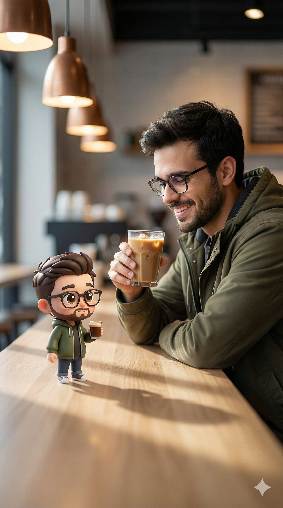
</div>

**提示词：**
```
A young man sitting casually at a modern café counter, smiling while holding a glass of iced coffee. On the table in front of him stands a small 3D chibi character version of the same man. The chibi has super-deformed proportions, a large head, big expressive eyes, and simplified facial features. It has a smooth 3D plastic or clay-like texture, soft studio lighting, and a clear shadow on the table surface. The chibi is holding a tiny glass of coffee. Warm pendant lights, wooden café interior, cinematic realistic human combined with stylized 3D chibi, shallow depth of field, vertical 9:16.
```

**中文提示词：**
```
一位年轻男子随意地坐在现代咖啡馆的吧台边，面带微笑，手里拿着一杯冰咖啡。他面前的桌子上摆放着一个与他本人相似的3D Q版人物模型。这个Q版人物模型比例夸张，头部较大，眼睛炯炯有神，面部特征较为简化。它拥有光滑的3D塑料或黏土质感，柔和的摄影棚灯光照射在桌面上，投射出清晰的阴影。Q版人物模型手中拿着一小杯咖啡。画面中，温暖的吊灯、木质的咖啡馆内饰、写实的人物造型与风格化的3D Q版人物模型相结合，运用了浅景深，采用9:16的竖幅构图。
```

<a id="prompt-940"></a>
## 案例 940：钢铁侠可口可乐 (来源 [@YaseenK7212](https://x.com/YaseenK7212/status/2002013476370444766)) 模型：Nano banana pro

<div style="display: flex; justify-content: space-between;">
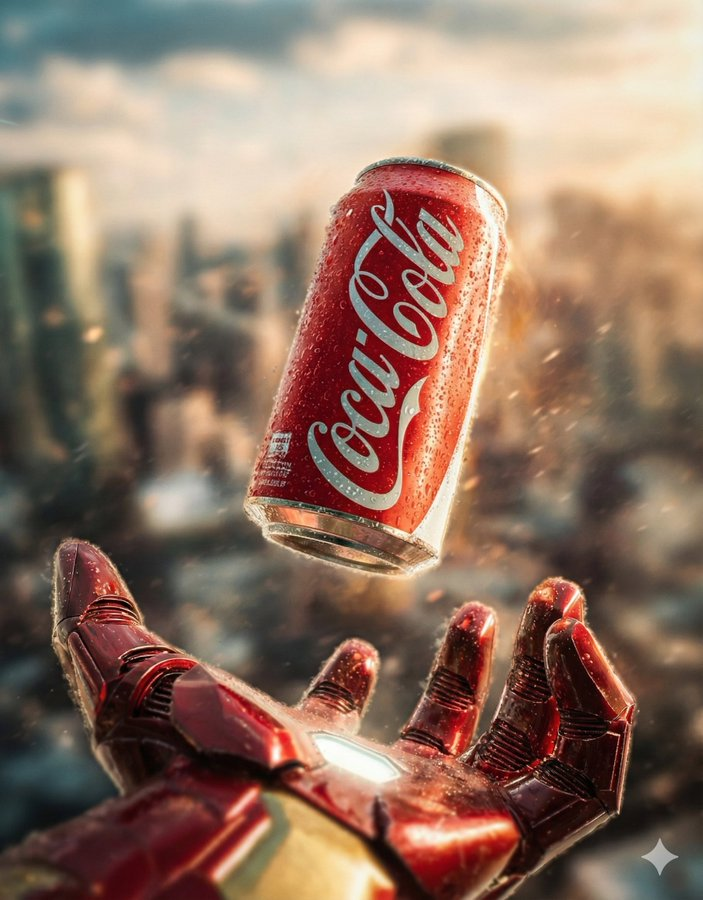
</div>

**提示词：**
```
[
  {
    "concept_id": "iron_man_coke",
    "visual_breakdown": {
      "focus_object": "Coca-Cola Can",
      "character_element": "Iron Man's Gauntlet",
      "environment": "Blurred City Skyline"
    },
    "artistic_direction": {
      "lighting": "Cinematic/Metallic",
      "mood": "technological"
    },
    "generation_command": {
      "aspect_ratio": "7:9",
      "concise_prompt": "Iron Man's gauntlet hovering below a floating Coca-Cola can, cinematic city background, dramatic movie poster lighting. --ar 7:9"
    }
  },
  {
    "concept_id": "hulk_pepsi",
    "visual_breakdown": {
      "focus_object": "Crushed Pepsi Can",
      "character_element": "Hulk's Giant Hand",
      "environment": "Smoky City Ruins"
    },
    "artistic_direction": {
      "lighting": "Explosive/High Contrast",
      "mood": "destructive"
    },
    "generation_command": {
      "aspect_ratio": "7:9",
      "concise_prompt": "Hulk's giant hand hovering over a crushed Pepsi can embedded in pavement, smoky ruins, explosive action movie style. --ar 7:9"
    }
  },
  {
    "concept_id": "thor_sprite",
    "visual_breakdown": {
      "focus_object": "Sprite Bottle",
      "character_element": "Thor's Glowing Hand",
      "environment": "Storm/Lightning"
    },
    "artistic_direction": {
      "lighting": "Electric/Blue-Toned",
      "mood": "mythological"
    },
    "generation_command": {
      "aspect_ratio": "7:9",
      "concise_prompt": "Thor's glowing hand holding a floating Sprite bottle amidst crackling lightning and rain, Mjolnir in background, epic poster style. --ar 7:9"
    }
  },
  {
    "concept_id": "dr_strange_fanta",
    "visual_breakdown": {
      "focus_object": "Fanta Bottle",
      "character_element": "Doctor Strange's Hand",
      "environment": "Golden Magic Portal"
    },
    "artistic_direction": {
      "lighting": "Magical/Golden Bokeh",
      "mood": "mystical"
    },
    "generation_command": {
      "aspect_ratio": "7:9",
      "concise_prompt": "Doctor Strange casting a spell under a spinning Fanta bottle inside a golden magic portal, mystical Sanctum background, cinematic lighting. --ar 7:9"
    }
  }
]
```

**中文提示词：**
```
[{"概念编号": "钢铁侠_可口可乐","视觉分解": {"核心物体": "可口可乐罐","角色元素": "钢铁侠的护手","环境场景": "模糊的城市天际线"},"艺术指导": {"光影风格": "电影质感 / 金属质感","氛围基调": "科技感"},"生成指令": {"画面比例": "7:9","简洁提示词": "钢铁侠的护手悬浮于漂浮的可口可乐罐下方，电影感城市背景，戏剧化电影海报光影效果。--ar 7:9"}},{"概念编号": "绿巨人_百事可乐","视觉分解": {"核心物体": "变形的百事可乐罐","角色元素": "绿巨人的巨手","环境场景": "烟雾弥漫的城市废墟"},"艺术指导": {"光影风格": "爆炸冲击感 / 高对比度","氛围基调": "破坏性"},"生成指令": {"画面比例": "7:9","简洁提示词": "绿巨人的巨手悬浮于嵌在路面中的变形百事可乐罐上方，烟雾废墟背景，爆炸风格动作片质感。--ar 7:9"}},{"概念编号": "雷神_雪碧","视觉分解": {"核心物体": "雪碧瓶","角色元素": "雷神的发光手掌","环境场景": "暴风雨 / 闪电"},"艺术指导": {"光影风格": "电光感 / 蓝色调","氛围基调": "神话感"},"生成指令": {"画面比例": "7:9","简洁提示词": "雷神的发光手掌托着漂浮的雪碧瓶，周围电闪雷鸣、大雨倾盆，雷神之锤置于背景，史诗级海报风格。--ar 7:9"}},{"概念编号": "奇异博士_芬达","视觉分解": {"核心物体": "芬达瓶","角色元素": "奇异博士的手掌","环境场景": "金色魔法传送门"},"艺术指导": {"光影风格": "魔法质感 / 金色散景","氛围基调": "神秘感"},"生成指令": {"画面比例": "7:9","简洁提示词": "奇异博士在金色魔法传送门内，于旋转的芬达瓶下方施法，背景为神秘的圣所场景，电影质感光影效果。--ar 7:9"}}]
```

<a id="prompt-939"></a>
## 案例 939：概念艺术杂志的编辑照片 (来源 [@AmirMushich](https://x.com/AmirMushich/status/2002029348132721016)) 模型：Nano banana pro

<div style="display: flex; justify-content: space-between;">
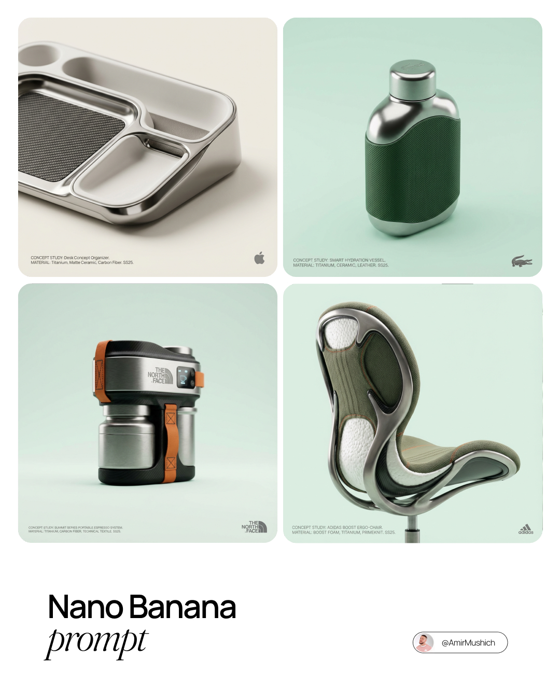
</div>

**提示词：**
```
[BRAND NAME]: 
A high-end, glossy concept art magazine editorial photograph of a unique, unexpected functional object conceptualized and designed by the brand.

**1. The Concept & Object (AI Invention):**
Based on the design philosophy, heritage, and material vocabulary of the specified brand, the AI must invent a novel utility product (NOT standard clothing, shoes, or bags). Examples could be home goods, tech accessories, tools, or sporting equipment, reinterpretated through the brand's lens. The object should feel sculptural yet functional.

**2. Materials & Details (Hyper-Premium):**
The object is constructed from ultra-premium, highly tactile materials characteristic of the brand (e.g., patinated exotic leathers, brushed aerospace-grade titanium, sculpted matte ceramics, molded carbon fiber, or technical high-fashion textiles). Every detail is hyper-realistic: visible stitching, microscopic material grain, precision engravings, and complex texture contrasts.

**3. Photography & Lighting (Cinematic Studio):**
Shot on a medium format Phase One camera with a 100mm macro lens. Extremely shallow depth of field, with sharp focus on the hero details of the object and a creamy, smooth bokeh background. The lighting is sophisticated studio softbox lighting: gentle, enveloping fill light with precise rim lighting to accentuate contours and material textures.

**4. Environment:**
A seamless, impeccably clean studio cyclorama background in a pure, ultra-light pastel tone (e.g., desaturated mint, pale blush, or off-white), free of shadows.

**5. Layout & UI Elements (Strict Placement):**
- **Bottom Right Corner:** A small, understated, monochrome gray logo of the brand.
- **Bottom Left Corner:** Small, minimalist monochrome gray text describing the invented product. The font style looks like Manrope Regular with very tight tracking (kerning) and balanced line spacing. Example format: "CONCEPT STUDY: [AI inserts invented product name]. MATERIAL: [AI inserts main materials]. SS25."
```

**中文提示词：**
```
[品牌名称]:
这是一张高端、光鲜亮丽的概念艺术杂志的编辑照片，展示了该品牌构思和设计的独特、出人意料的功能性物品。

** 1.概念与对象（人工智能发明） :**
基于指定品牌的设计理念、历史传承和材料语汇，人工智能必须创造一款新颖的实用产品（并非标准服装、鞋履或包袋）。产品示例可以是家居用品、科技配件、工具或运动器材，并以品牌视角进行重新诠释。该产品应兼具雕塑感和实用功能。

** 2. 材料与细节（超高端） :**
这款产品采用品牌标志性的超高端、触感极佳的材质打造而成（例如，做旧珍稀皮革、拉丝航空级钛金属、雕塑哑光陶瓷、模压碳纤维或高科技时尚面料）。每个细节都力求逼真：清晰可见的缝线、微观材质纹理、精准的雕刻以及复杂的质感对比。

** 3.摄影与灯光（电影工作室） :**
使用Phase One中画幅相机和100mm微距镜头拍摄。景深极浅，主体细节清晰锐利，背景则呈现柔和细腻的散景效果。灯光采用专业的影棚柔光箱：柔和的环绕式补光，辅以精准的轮廓光，凸显物体的轮廓和材质纹理。

** 4. 环境:**
一个无缝、无可挑剔的干净的摄影棚环形背景，采用纯净、超浅的粉彩色调（例如，褪色的薄荷绿、淡腮红或灰白色），没有阴影。

** 5. 布局和 UI 元素（严格放置） :**
- **右下角:**品牌的小巧、低调、单色灰色标志。
- **左下角:**描述发明产品的简洁单色灰色小字。字体样式类似Manrope Regular，字距非常紧凑（字距调整），行距均衡。示例格式：“概念研究：[AI插入发明产品名称]。材料：[AI插入主要材料]。2025春夏。”
```

<a id="prompt-938"></a>
## 案例 938：女性正从她的手机屏幕中走出来 (来源 [@underwoodxie96](https://x.com/underwoodxie96/status/2002293540299420050)) 模型：Nano banana pro

<div style="display: flex; justify-content: space-between;">
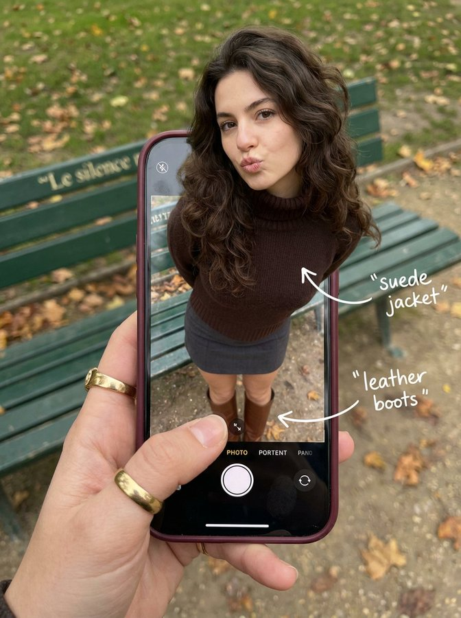
</div>

**提示词：**
```
{

"subject": {

"description": "A hyper-realistic optical illusion photograph. A young Caucasian woman appears to be stepping out of a smartphone screen held in a hand. The screen displays the camera interface, capturing her boots, while her real upper body extends out of the phone into reality.",

"mirror_rules": "Ensure the phone screen clearly shows the iOS Camera UI (shutter button, mode text). Handwritten annotations must be legible and not mirrored.",

"age": "20s",

"expression": {

"eyes": {

"look": "Alluring and playful",

"energy": "Confident, direct",

"direction": "Looking at the viewer"

},

"mouth": {

"position": "Blowing a kiss or pouting",

"energy": "Chic and charming"

},

"overall": "Lifelike, engaging interaction"

},

"face": {

"preserve_original": "false",

"makeup": "Natural glam, matte foundation, defined European features",

"features": "High nose bridge, double eyelids, defined jawline"

},

"hair": {

"color": "Dark brown",

"style": "Long, loose waves, voluminous",

"effect": "Realistic shine, wind-blown effect"

},

"body": {

"frame": "Petite but proportionally realistic",

"waist": "Defined",

"chest": "Covered by turtleneck",

"legs": "Visible INSIDE the phone screen interface wearing boots",

"skin": {

"visible_areas": "Face, hands",

"tone": "Fair Caucasian skin",

"texture": "Ultra-realistic skin texture, visible pores, natural imperfections",

"lighting_effect": "Soft daylight"

}

},

"pose": {

"position": "Torso and head emerging vertically from the phone, legs displayed on the screen",

"base": "Dynamic standing pose",

"overall": "充满活力的随机姿势，让人感觉生命力满满"

},

"clothing": {

"top": {

"effect": "精致的穿搭，High-quality textile photography"

},

"bottom": {

"type": "Mini Skirt and Leather Boots",

"color": "Dark Grey (skirt), Brown (boots)",

"details": "Boots visible on the screen beneath the UI elements"

}

}

},

"accessories": {

"jewelry": "Gold rings on the photographer's hand (foreground)",

"device": "Smartphone with burgundy case. The screen is ACTIVE and DETAILED: it displays the IOS Camera App Interface (white circular shutter button at bottom, 'PHOTO' text).",

"prop": "On the phone screen: White handwritten-style text overlays with arrows pointing to the outfit elements (e.g., text 'suede jacket' with arrow, 'leather boots' with arrow)."

},

"photography": {

"camera_style": "DSLR photography, Macro lens for phone details",

"angle": "POV, High angle looking down at hand",

"shot_type": "Composite photography",

"aspect_ratio": "3:4",

"texture": "Sharp screen pixels, fingerprint smudges on screen, realistic fabric texture",

"lighting": "Overcast soft natural light",

"depth_of_field": "Background bench blurred (Bokeh), Phone screen UI and subject sharp"

},

"background": {

"setting": "Parisian Park in Autumn",

"wall_color": "Green bench, grey ground",

"elements": [

"Green park bench with text 'Le silence'",

"Autumn leaves"

],

"atmosphere": "Cinematic, realistic",

"lighting": "Natural ambient light"

},

"the_vibe": {

"energy": "Sophisticated, viral social media content",

"mood": "Fashion forward",

"aesthetic": "OOTD breakdown, creative edit",

"authenticity": "Photorealistic texture, not CGI",

"intimacy": "POV",

"story": "Fashion styling breakdown",

"caption_energy": "Styling brown suede & leather"

},

"constraints": {

"must_keep": [

"Caucasian ethnicity",

"Photorealistic skin",

"Camera UI elements on screen (shutter button)",

"Handwritten text annotations on screen",

"Pop-out effect"

],

"avoid": [

"Transparent phone screen",

"Blank screen",

"3D render style",

"Cartoon",

"Plastic skin"

]

},

"negative_prompt": [

"transparent screen",

"blank screen",

"glass phone",

"3d",

"render",

"cartoon",

"anime",

"plastic",

"drawing",

"illustration"

]

}
```

**中文提示词：**
```
{

“主题”： {

描述：一张超逼真的光学错觉照片。一位年轻的白人女性仿佛正从她手中的智能手机屏幕中走出来。屏幕显示的是相机界面，拍下了她的靴子，而她真实的上半身则从手机屏幕中延伸到现实世界。

“mirror_rules”：确保手机屏幕清晰显示 iOS 相机界面（快门按钮、模式文本）。手写注释必须清晰可辨，且不能镜像翻转。

年龄：20多岁，

“表达”： {

"眼睛": {

“外观”：“迷人而俏皮”，

“能量”：“自信、直接”

“方向”：“看着观众”

},

“嘴”： {

“姿势”：“飞吻或撅嘴”，

“能量”：“时尚迷人”

},

“总体而言”：“栩栩如生、引人入胜的互动”

},

“脸”： {

"preserve_original": "false",

“妆容”：“自然光泽，哑光粉底，凸显欧洲五官”，

特征：高鼻梁、双眼皮、轮廓分明的下颌线

},

“头发”： {

“颜色”：“深棕色”，

“发型”：“长而蓬松的波浪卷发”，

“效果”： “逼真的光泽，风吹效果”

},

“身体”： {

“画框”：“小巧但比例逼真”，

“腰部”：“线条分明”，

“胸部”： “被高领毛衣遮盖”

“腿”：“在手机屏幕界面内部可以看到穿着靴子的腿”，

“皮肤”： {

"visible_areas": "脸部、手部",

“肤色”: “白皙的白种人肤色”

“质感”：“超逼真的肌肤质感，可见毛孔，自然瑕疵”，

"lighting_effect": "柔和的日光"

}

},

"姿势": {

“位置”：“躯干和头部从手机中垂直伸出，腿部显示在屏幕上”，

"基础": "动态站姿",

"overall": "充满活力的随机姿势，让人感觉生命力饱满"

},

“衣服”： {

“顶部”： {

"effect": "精致的穿搭，高品质的纺织摄影"

},

“底部”： {

“类型”：“迷你裙和皮靴”，

颜色：深灰色（裙子），棕色（靴子）

“详情”：“屏幕上用户界面元素下方可见的靴子”

}

}

},

“配件”： {

“珠宝”：“摄影师手上（前景）的金戒指”，

“设备”：“智能手机，酒红色手机壳。屏幕已激活且显示清晰：显示 iOS 相机应用程序界面（底部有白色圆形快门按钮，显示‘照片’字样）。”

“道具”：“手机屏幕上：白色手写体文字叠加层，箭头指向服装元素（例如，文字‘麂皮夹克’带箭头，‘皮靴’带箭头）。”

},

“摄影”： {

“camera_style”: “单反摄影，手机微距镜头，用于拍摄细节照片”

“角度”：“POV，高角度向下看手”，

"shot_type": "合成摄影",

"aspect_ratio": "3:4",

“纹理”：“清晰的屏幕像素，屏幕上的指纹污渍，逼真的织物纹理”，

“光线”：“阴天柔和的自然光”，

景深：背景虚化（散景），手机屏幕界面和主体清晰

},

“背景”： {

“场景”：“秋天的巴黎公园”，

"wall_color": "绿色长椅，灰色地面",

“元素”：[

“绿色公园长椅上写着‘寂静’”

秋叶

],

“氛围”：“电影般的，逼真的”，

“照明”：“自然环境光”

},

"氛围": {

“能量”：“复杂、病毒式传播的社交媒体内容”，

“氛围”：“时尚前卫”，

“美学”：“OOTD分解，创意剪辑”

“真实性”：“照片级真实纹理，而非 CGI”。

“亲密感”: “POV”

“故事”：“时尚造型解析”

“caption_energy”： “棕色绒面革和皮革的时尚造型”

},

"约束": {

"must_keep": [

“高加索人种”

“逼真的皮肤”，

“屏幕上的相机用户界面元素（快门按钮）”

“屏幕上的手写文字注释”

“弹出效果”

],

“避免”： [

“透明手机屏幕”，

“空白屏幕”，

“3D渲染风格”，

“卡通片”，

“塑料皮肤”

]

},

"negative_prompt": [

“透明屏幕”，

“空白屏幕”，

“玻璃手机”，

“3d，”

“使成为”，

“卡通片”，

“日本动画片”，

“塑料”，

“绘画”，

“插图”

]

}
```

<a id="prompt-937"></a>
## 案例 937：电影感十足的肖像摄影作品 (来源 [@ChillaiKalan__](https://x.com/ChillaiKalan__/status/2002572543992213748)) 模型：Nano banana pro

<div style="display: flex; justify-content: space-between;">
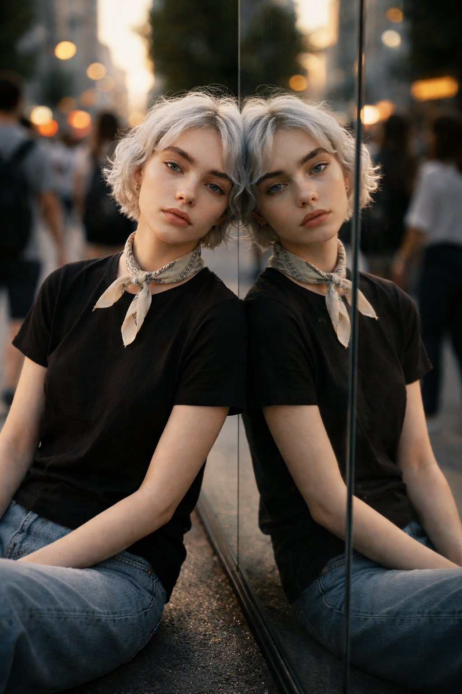
</div>

**提示词：**
```
cinematic portrait photography of a young woman sitting in a field at golden hour, soft natural light, silver-blonde short hair, minimal fashion with a black t-shirt and light bandana, fine art portrait style. emotional realism with calm expression, modern editorial mood, subject leaning against a mirror creating symmetrical reflection, high fashion editorial look, moody color grading, shallow depth of field, subject-isolation technique, viral visual composition, cinematic framing, contemporary visual storytelling. subtle texture in background, clean tones, artistic photography, urban stillness aesthetic blended with nature, soft contrast and gentle highlights.
```

**中文提示词：**
```
电影感十足的肖像摄影作品，一位年轻女子坐在田野中，沐浴在柔和的自然光下，一头银金色短发，身着黑色T恤和浅色头巾，简约时尚，展现出精致的艺术肖像风格。她神态平静，情感真挚，散发出现代时尚气息。她倚靠在镜子前，镜中映出对称的影像，营造出高级时尚大片的视觉效果。照片采用情绪化的色彩分级、浅景深和主体分离技巧，构图极具冲击力，画面充满电影感，以当代视觉叙事手法呈现。背景纹理细腻，色调干净，展现出艺术摄影的魅力，将都市的静谧与自然的和谐融合，对比柔和，高光轻柔。
```

<a id="prompt-936"></a>
## 案例 936：卡通画变成 Funko Pop 乙烯基人偶 (来源 [@michaelrabone](https://x.com/michaelrabone/status/2002710702352421371)) 模型：Nano banana pro

<div style="display: flex; justify-content: space-between;">
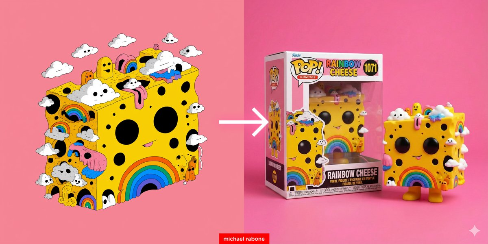
</div>

**提示词：**
```
Transform this cartoon to a Funko Pop vinyl figure. Place the Funko Pop box beside the vinyl figure (side by side) with the name 'Rainbow Cheese' on box. Place vinyl figure and box on a pink surface and pink background with studio lighting.
```

**中文提示词：**
```
将这幅卡通画变成 Funko Pop 乙烯基人偶。将 Funko Pop 包装盒放在乙烯基人偶旁边（并排摆放），包装盒上写上“Rainbow Cheese”（彩虹奶酪）。将乙烯基人偶和包装盒放在粉色的平面和粉色的背景上，并使用摄影棚灯光照明。
```

<a id="prompt-935"></a>
## 案例 935：Y2K时代的拼贴海报 (来源 [@0xbisc](https://x.com/0xbisc/status/2002664549930172496)) 模型：Nano banana pro

<div style="display: flex; justify-content: space-between;">
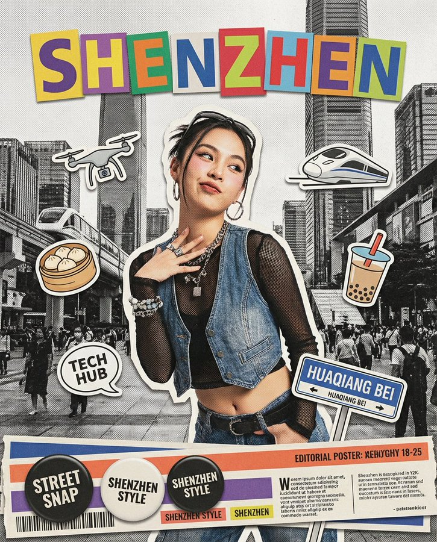
</div>

**提示词：**
```
{

"variables": {

"CITY_NAME": "Chengdu"

},

"image_specs": {

"aspect_ratio": "4:5", "resolution": "2048x2560", "quality": "ultra", "style_strength": 0.8, "detail_level": "high", "sharpen": "medium"

},

"prompt": {

"master_visual_brief": "A high-energy Y2K-inspired editorial collage poster with a strong paper-cut and magazine print aesthetic. The entire image has a tactile paper texture with visible cut edges and layered depth. The theme centers around the city {{CITY_NAME}}. All visual elements, including background imagery, stickers, symbols, typography, and graphic decorations, are culturally and visually inspired by {{CITY_NAME}}. The composition follows a fashion magazine cover logic with dense but controlled information, playful energy, and strong visual hierarchy. The character is designed as a dominant half-body portrait occupying most of the poster.", "photography_and_character": "Character: a randomly generated young woman aged approximately 18–25. She is fashionable, attractive, and trendy, with no fixed hairstyle, hair color, facial features, or makeup. Her appearance varies naturally but always remains stylish and visually appealing. Fashion style is Y2K-inspired street fashion with playful silhouettes, layered styling, and trendy colors. Framing is a strict half-body portrait: the image is cropped at the waist or slightly above, and the lower body is not visible at all. Only the upper torso, shoulders, neck, and head are shown. Pose and gesture: the character performs a randomly selected Y2K-style dynamic pose with strong tension and attitude, including expressive arm extensions, angular elbow bends, asymmetrical shoulder twists, or forward-reaching gestures. Body language remains bold, confident, and energetic. Facial expression: the expression is slightly playful and friendly, with a hint of cuteness layered on top of confidence. Subtle smiles, softly open lips, bright eyes, or a relaxed playful look are allowed, while the overall attitude remains fashion-forward and dynamic rather than cute-only.", "camera_and_lighting": "Editorial portrait framing with a wide-angle look at close distance, optimized for half-body composition. The camera captures only the upper torso and head, with the lower body fully cropped out of frame. Perspective supports dynamic Y2K poses without distorting facial proportions. Lighting is soft, even, and magazine-style, avoiding harsh shadows. The subject is intended to be cut out and integrated into a paper collage rather than rendered as pure realism.", "graphic_design_layout": "Center-focused editorial collage layout. At the top, the city name '{{CITY_NAME}}' appears as the main headline in bold uppercase geometric sans-serif letters. Each letter is placed on an individual colored paper rectangle and arranged in a slight arc. The large half-body character overlaps and partially covers the headline and nearby graphic elements, creating a break-the-frame effect. Surrounding the character are floating paper stickers, speech bubbles, and cut-out graphics inspired by {{CITY_NAME}} culture, including local food, landmarks, symbols, street signs, and iconic objects. The bottom section features a full-width magazine-style collage footer composed of layered paper strips, bold button-style typography, small editorial text blocks, and thumbnail-style graphics.", "background_system": "The background is a black-and-white or desaturated urban street scene from {{CITY_NAME}}, such as crowds, architecture, or city textures. Background contrast is reduced and softened with grain so it supports the composition without competing with the main subject. The background is partially obscured by the large half-body character and collage elements and maintains a printed-paper appearance rather than photographic realism.", "materials_and_textures": "A consistent paper-based aesthetic across the entire image. Visible paper grain, halftone dots, print noise, and slight ink bleed. All elements appear as physical paper cut-outs layered together. Edges are imperfect and tactile. Stickers, typography, and characters cast subtle shadows to suggest layered depth. No glossy, metallic, or digital materials are present.", "composition_and_balance": "Clear and stable visual hierarchy: top city headline '{{CITY_NAME}}', central half-body character (upper torso only), dynamic Y2K-style pose with slightly playful facial expression, surrounding city-themed stickers, and bottom magazine-style collage footer. Strong overlaps between character, typography, and stickers create depth while preserving the established layout."

},

"constraints": {

"must_include": \[ "City name headline using {{CITY_NAME}}", "Strict half-body portrait (waist-up only)", "Lower body completely cropped out", "Y2K-style dynamic pose with strong tension", "Playful but controlled facial expression", "Paper collage and cut-out magazine aesthetic", "City-specific background and stickers related to {{CITY_NAME}}", "Full-width magazine-style collage footer", "Visible paper texture and layered depth" \], "must_avoid": \[ "Full-body view", "Visible legs, knees, thighs, or feet", "Neutral or stiff poses", "Overly cute or childish expressions", "Sexualized expressions or gestures", "Grotesque facial distortion", "Minimalist or empty layouts", "Glossy digital or 3D materials" \]

},

"negative_prompt": "full body, legs visible, knees, thighs, feet, stiff pose, neutral posture, childish expression, exaggerated cute face, sexualized expression, blurry face, deformed hands, extra fingers, bad anatomy, grotesque distortion, minimalist layout, flat image, hyper-realistic photography, glossy surfaces, plastic skin, dull colors, watermark, logo, unreadable text",

"typography_rules": {

"headline": { "text": "{{CITY_NAME}}", "font_style": "bold geometric sans-serif, uppercase", "treatment": "each letter on a separate colored paper rectangle, slightly arched, subtle shadow", "material": "printed paper cut-out" }, "supporting_text": { "style": "editorial magazine blocks, playful sticker captions, speech bubbles", "material": "paper-based printed texture" }

},

"rendering_notes": {

"depth_layers": "background city paper layer -> mid-ground half-body character -> foreground dynamic pose, expressive face, stickers, and typography", "print_feel": "strong magazine print texture with halftone dots, paper grain, and slight ink bleed", "edge_treatment": "clearly visible imperfect cut paper edges"

}

}
```

**中文提示词：**
```
{

"变量": {

城市名称：成都

},

"image_specs": {

"aspect_ratio": "4:5", "resolution": "2048x2560", "quality": "ultra", "style_strength": 0.8, "detail_level": "high", "sharpen": "medium"

},

“提示词”： {

“视觉设计概要”： “这是一张充满活力、灵感源自Y2K时代的拼贴海报，具有强烈的剪纸和杂志印刷美感。整幅图像呈现出触感丰富的纸张纹理，可见的切割边缘和层次感。主题围绕着城市{{ CITY_NAME }}展开。所有视觉元素，包括背景图像、贴纸、符号、字体和图形装饰，都从文化和视觉上汲取灵感，源自城市{{ CITY_NAME }} 。构图遵循时尚杂志封面的逻辑，信息丰富但控制得当，充满活力，并具有清晰的视觉层次。人物被设计成占据海报大部分空间的半身肖像。” “摄影与人物”： “人物：一位随机生成的年轻女性，年龄在18至25岁之间。她时尚、迷人、潮流，没有固定的发型、发色、五官或妆容。她的外貌自然变化，但始终保持时尚和视觉吸引力。时尚风格是受Y2K时代启发的街头时尚。”俏皮的轮廓、层次丰富的造型和潮流的色彩。构图采用严格的半身像：画面裁剪至腰部或略高于腰部，下半身完全不可见。仅展现上半身、肩膀、颈部和头部。姿势和手势：人物摆出随机选择的Y2K风格动态姿势，充满张力和态度，包括富有表现力的手臂伸展、肘部角度弯曲、不对称的肩部扭转或向前伸展的动作。肢体语言大胆、自信且充满活力。面部表情：表情略带俏皮和友好，在自信之上又增添了一丝可爱。允许有淡淡的微笑、微微张开的嘴唇、明亮的眼神或轻松俏皮的表情，整体风格保持时尚前卫和动感，而非仅仅可爱。“相机和灯光”：“采用广角镜头近距离拍摄的编辑人像构图，针对半身像进行了优化。相机仅拍摄上半身和头部，下半身不可见。”人物身体完全裁剪出画面之外。透视效果支持动态的千禧年风格姿势，且不会扭曲面部比例。光线柔和均匀，采用杂志风格，避免了生硬的阴影。人物旨在被剪裁并融入纸质拼贴画中，而非以纯粹的写实手法呈现。平面设计布局：以中心为焦点的编辑拼贴画布局。顶部，城市名称“ {{城市名称}} ”以粗体大写几何无衬线字体作为主标题。每个字母都放置在单独的彩色纸质矩形上，并呈略微弧形排列。较大的半身人物与标题和附近的图形元素重叠并部分覆盖，营造出一种打破画面框架的效果。人物周围环绕着漂浮的纸质贴纸、对话气泡和剪纸图形，其灵感来自{{城市名称}}的文化，包括当地美食、地标、符号、路标和标志性物品。底部部分是一个由多层纸张组成的全宽杂志风格拼贴画页脚。条状文字、醒目的按钮式字体、小型编辑文本块和缩略图式图形。”, “背景系统”: “背景是来自{{城市名称}}的黑白或低饱和度城市街景，例如人群、建筑或城市纹理。背景对比度降低，并添加了颗粒感以柔化画面，从而在不干扰主体的情况下支持构图。背景部分被大型半身人物和拼贴元素遮挡，保持了印刷纸的外观，而非照片的真实感。”, “材质与纹理”: “整个图像保持一致的纸质美学。可见的纸张纹理、半色调网点、印刷噪点和轻微的墨迹晕染。所有元素都像是层叠在一起的实体纸片。边缘不完美且触感明显。贴纸、字体和人物投射出微妙的阴影，暗示出层次感。没有光泽、金属或数字材质。”, “构图与平衡”: “清晰稳定的视觉层次：顶部城市标题“ {{城市名称}} ”，中央半身人物（仅上半身），动态的千禧年风格姿势，略带俏皮的面部表情，周围环绕着城市主题贴纸，底部是杂志风格的拼贴页脚。人物、字体和贴纸之间的强烈重叠在保持既定布局的同时，营造出层次感。

},

"约束": {

"必须包含：" [ "使用城市名称作为标题{{ CITY_NAME }} ", "严格的半身像（仅腰部以上）", "下半身完全裁剪", "Y2K风格的动态姿势，充满张力", "俏皮但克制的表情", "纸质拼贴和剪贴杂志风格", "与城市相关的背景和贴纸{{ CITY_NAME }} ", "全宽杂志风格拼贴页脚", "可见的纸张纹理和层次感" ], "必须避免：" [ "全身照", "可见的腿、膝盖、大腿或脚", "中性或僵硬的姿势", "过于可爱或幼稚的表情", "性化的表情或手势", "怪诞的面部扭曲", "极简主义或空白的布局", "光面数字或3D材质" ]

},

"negative_prompt": "全身，腿部可见，膝盖，大腿，脚，僵硬姿势，中立姿势，幼稚表情，夸张可爱表情，性化表情，模糊面部，畸形手，多余手指，解剖结构错误，怪诞扭曲，极简布局，平面图像，超写实摄影，光滑表面，塑料皮肤，暗淡色彩，水印，标志，无法辨认的文字",

"typography_rules": {

"标题": { "正文": " {{城市名称}} ", "字体": "粗体几何无衬线字体，大写", "处理方式": "每个字母位于单独的彩色纸矩形上，略微拱起，带有微妙的阴影", "材质": "印刷纸剪裁" }, "辅助文本": { "风格": "杂志社论版块，趣味贴纸标题，对话气泡", "材质": "纸质印刷纹理" }

},

"渲染注释": {

"depth_layers": "背景：城市纸张层->中景：半身人物->前景：动态姿势、表情丰富的面部、贴纸和文字。"print_feel": "强烈的杂志印刷纹理，带有半色调网点、纸张纹理和轻微的墨迹晕染。"edge_treatment": "清晰可见的不完美裁切纸张边缘。"

}

}
```

<a id="prompt-934"></a>
## 案例 934：女性自拍照 (来源 [@Ankit_patel211](https://x.com/Ankit_patel211/status/2002377471388442654)) 模型：Nano banana pro

<div style="display: flex; justify-content: space-between;">
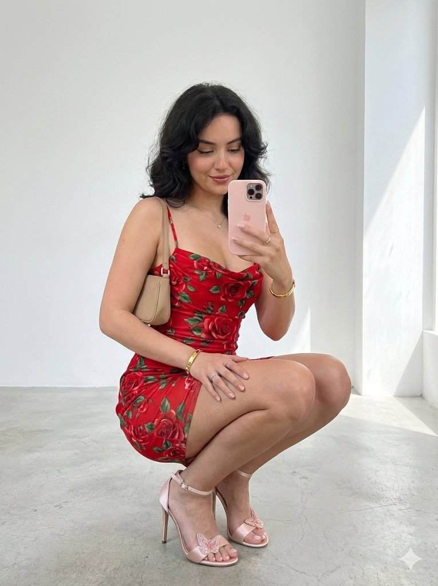
</div>

**提示词：**
```
{
  "generative_directive": {
    "technical_specifications": {
      "format": "Mirror Selfie",
      "device": "Smartphone Camera",
      "device_model_prop": "iPhone 16 Pro Max",
      "lens_type": "Wide-angle lens",
      "aspect_ratio": "9:16",
      "focal_priority": [
        "Body",
        "Hands"
      ]
    },
    "subject_configuration": {
      "demographics": "Woman",
      "skin_appearance": "Warm and even tone",
      "posture": {
        "body_angle": "Slightly angled",
        "vibe": "Relaxed, natural feeling",
        "right_hand": "Holding phone next to face",
        "left_arm": "Hanging naturally near body",
        "interaction": "Holding a shoulder bag in left hand"
      }
    },
    "apparel_breakdown": {
      "garment_type": "Short Dress",
      "color_palette": {
        "base": "Cream-white",
        "accent_pattern": "Pink roses and green leaves"
      },
      "design_elements": {
        "straps": "Thin straps",
        "neckline": "Softly draped",
        "silhouette": "Fitted, highlighting waist and hips",
        "detailing": "Gentle gathering around abdomen",
        "hemline": "Short and slightly wavy"
      },
      "textile_properties": {
        "weight": "Lightweight and fluid",
        "elasticity": "Soft elasticity",
        "texture": "Subtle natural sheen",
        "drape": "Gentle drape"
      },
      "style_keywords": [
        "Romantic",
        "Feminine",
        "Elegant"
      ]
    },
    "styling_details": {
      "accessories": {
        "jewelry": "Thin gold bracelet",
        "bag": "Shoulder bag"
      },
      "beauty": {
        "makeup_style": "Light and natural",
        "complexion": "Fresh",
        "cheeks": "Soft blush",
        "lips": "Natural pink-toned, partially visible"
      },
      "nails": {
        "shape": "Almond-shaped",
        "length": "Medium",
        "color": "Light nude shade"
      }
    },
    "scene_environment": {
      "location_type": "Fairly bright interior",
      "background_elements": "Smooth, minimalist white wall",
      "lighting_setup": {
        "source": "Natural daylight from side window",
        "quality": "Soft, diffused",
        "highlight_targets": [
          "Bright tones",
          "Refined textures",
          "Gold accessory details"
        ]
      }
    },
    "critical_constraints": {
      "preservation_rule": "Strictly maintain original face, facial features, proportions, skin texture, and expression. No alterations to identity."
    }
  }
}
```

**中文提示词：**
```
{
"generative_directive": {
"technical_specifications": {
"格式": "镜子自拍",
"设备": "智能手机摄像头",
"device_model_prop": "iPhone 16 Pro Max",
"lens_type": "广角镜头",
"aspect_ratio": "9:16",
"焦点优先级": [
“身体”，
“手”
]
},
"subject_configuration": {
“人口统计信息”：“女性”，
"skin_appearance": "温暖均匀的肤色",
"姿势": {
"body_angle": "略微倾斜",
“氛围”：“轻松、自然的感觉”，
"右手": "将手机举到脸旁",
"左臂": "自然下垂于身体附近",
“互动”：“左手拿着肩包”
}
},
"apparel_breakdown": {
"garment_type": "短裙",
"color_palette": {
“基色”: “乳白色”
"accent_pattern": "粉色玫瑰和绿色叶子"
},
"design_elements": {
“肩带”： “细肩带”
“领口”：“柔软垂坠”，
“轮廓”：“修身，凸显腰部和臀部”，
“细节”：“腹部周围轻柔地收拢”，
裙摆：短款，略微卷曲
},
"textile_properties": {
“重量”： “轻盈流畅”
“弹性”： “柔软弹性”，
“质感”：“柔和自然的光泽”，
"drape": "轻柔的垂坠"
},
"style_keywords": [
“浪漫的”，
“女性化的”，
“优雅的”
]
},
"styling_details": {
“配件”： {
“珠宝”：“细金手镯”，
“包”： “肩包”
},
“美丽”： {
"makeup_style": "清淡自然"
“肤色”： “清新”，
“脸颊”：“淡淡的红晕”，
“嘴唇”： “自然粉色调，部分可见”
},
"指甲": {
“形状”： “杏仁形”
"长度": "中等",
颜色：浅裸色
}
},
"scene_environment": {
"location_type": "室内光线充足",
"background_elements": "光滑、简约的白色墙壁",
"lighting_setup": {
“光源”：“侧窗的自然日光”，
“品质”：“柔和、扩散”，
"highlight_targets": [
“明亮的色调”，
“精致的质感”，
“金色配饰细节”
]
}
},
"critical_constraints": {
"preservation_rule": "严格保持原有的面部特征、比例、皮肤纹理和表情。不得改变身份。"
}
}
}
```

<a id="prompt-933"></a>
## 案例 933：女性在奔跑时腾空而起 (来源 [@underwoodxie96](https://x.com/underwoodxie96/status/2002639331501224005)) 模型：Nano banana pro

<div style="display: flex; justify-content: space-between;">
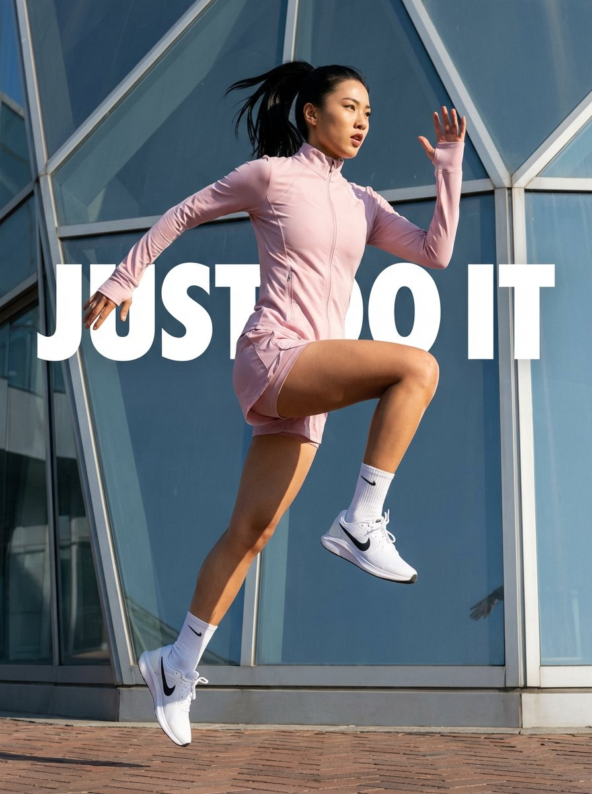
</div>

**提示词：**
```
{
  "subject": {
    "description": "A fit young Asian woman frozen in mid-air while running, capturing a dynamic athletic moment.",
    "mirror_rules": "N/A",
    "age": "20s",
    "expression": {
      "eyes": {
        "look": "focused ahead",
        "energy": "determined",
        "direction": "forward"
      },
      "mouth": {
        "position": "slightly open breathing",
        "energy": "concentrated"
      },
      "overall": "intense focus and athletic determination"
    },
    "face": {
      "preserve_original": true,
      "makeup": "natural fresh look"
    },
    "hair": {
      "color": "black",
      "style": "high ponytail",
      "effect": "flying back dynamically due to motion"
    },
    "body": {
      "frame": "athletic and toned",
      "waist": "visible silhouette",
      "chest": "covered",
      "legs": "muscular definition visible, mid-air stride",
      "skin": {
        "visible_areas": "legs, face, hands",
        "tone": "warm tan",
        "texture": "smooth with muscle definition",
        "lighting_effect": "high contrast sunlight highlights"
      }
    },
    "pose": {
      "position": "mid-air jump",
      "base": "levitating",
      "overall": "dynamic running stride, one knee raised high, arms swinging"
    },
    "clothing": {
      "top": {
        "type": "long-sleeve athletic zip-up jacket",
        "color": "pastel pink",
        "details": "fitted, sporty seams",
        "effect": "stretched with movement"
      },
      "bottom": {
        "type": "athletic shorts",
        "color": "pastel pink",
        "details": "matching set"
      }
    }
  },
  "accessories": {
    "headwear": null,
    "jewelry": null,
    "device": null,
    "prop": {
      "type": "footwear",
      "details": "white sneakers with black swoosh logo, white crew socks"
    }
  },
  "photography": {
    "camera_style": "commercial advertising photography",
    "angle": "low angle worm's eye view",
    "shot_type": "full body side profile",
    "aspect_ratio": "3:4",
    "texture": "sharp focus, high contrast, commercial print quality",
    "lighting": "hard daylight, direct sun, strong shadows",
    "depth_of_field": "deep, background visible but geometric"
  },
  "background": {
    "setting": "urban modern exterior",
    "wall_color": "blue-grey glass",
    "elements": [
      "geometric triangular glass facade",
      "metallic frames",
      "reflection of runner in glass",
      "brick pavement at bottom"
    ],
    "typography": {
      "text_content": "JUST DO IT",
      "font_style": "Massive Bold Sans-Serif (Nike style)",
      "color": "White",
      "position": "Center of the image",
      "integration": "Layered text: placed behind the subject or overlaying the center with slight transparency",
      "visual_weight": "Dominant slogan"
    },
    "atmosphere": "modern, clean, energetic, motivational",
    "lighting": "bright natural sunlight"
  },
  "the_vibe": {
    "energy": "explosive power",
    "mood": "motivational",
    "aesthetic": "urban sportswear commercial",
    "authenticity": "high",
    "intimacy": "distant observer",
    "story": "morning run in the city, pushing limits",
    "caption_energy": "Just Do It."
  },
  "constraints": {
    "must_keep": [
      "text 'JUST DO IT' clearly visible",
      "mid-air suspension",
      "pastel pink outfit",
      "geometric glass background",
      "sharp focus"
    ],
    "avoid": [
      "misspelled text",
      "text covering the face",
      "blur",
      "studio background",
      "static pose"
    ]
  },
  "negative_prompt": [
    "typos",
    "gibberish text",
    "cluttered text",
    "motion blur",
    "distorted limbs",
    "bad anatomy",
    "extra legs",
    "dull lighting"
  ]
}
```

**中文提示词：**
```
{
“主题”： {
描述：一位身材健美的年轻亚裔女性在奔跑时腾空而起，定格了她充满活力的运动瞬间。
"mirror_rules": "N/A",
年龄：20多岁，
“表达”： {
"眼睛": {
“看”：“专注于前方”，
“能量”：“坚定的”，
“方向”: “向前”
},
“嘴”： {
“姿势”：“微微张开呼吸”，
“能量”: “集中的”
},
“总体而言”：“高度专注和运动上的决心”
},
“脸”： {
"preserve_original": true,
妆容： “自然清新妆容”
},
“头发”： {
“颜色：黑色”，
“发型”：“高马尾辫”，
“效果”：“由于运动而动态地向后飞”
},
“身体”： {
“体型”： “运动型且线条优美”，
“腰部”: “可见轮廓”，
“胸部”： “覆盖的”，
“腿部”：“肌肉线条清晰可见，腾空迈步”，
“皮肤”： {
"visible_areas": "腿、脸、手",
“色调”：“暖棕色”，
“质地”：“光滑，肌肉线条分明”，
"lighting_effect": "高对比度阳光高光"
}
},
"姿势": {
“位置”：“空中跳跃”，
“基座”：“悬浮”，
“整体”： “动态跑步步伐，单膝高抬，双臂摆动”
},
“衣服”： {
“顶部”： {
“类型”：“长袖运动拉链夹克”，
“颜色”： “淡粉色”，
“细节”：“合身、运动感十足的缝线”，
“效果”：“随着运动而拉伸”
},
“底部”： {
“类型”：“运动短裤”，
“颜色”： “淡粉色”，
“详情”：“配套套装”
}
}
},
“配件”： {
“头饰”：null，
“珠宝”：null，
“设备”：null，
"prop": {
"type": "鞋类",
“细节”：“白色运动鞋，黑色耐克标志，白色船袜”
}
},
“摄影”： {
"camera_style": "商业广告摄影",
“角度”: “低角度虫眼视图”
"shot_type": "全身侧脸轮廓",
"aspect_ratio": "3:4",
“纹理”：“清晰聚焦，高对比度，商业印刷质量”，
“照明”：“强烈的日光、直射阳光、强烈的阴影”，
景深： “深邃，背景可见但呈几何形状”
},
“背景”： {
“环境”: “都市现代外观”，
"wall_color": "蓝灰色玻璃"
“元素”：[
“几何三角形玻璃幕墙”，
“金属框架”，
“跑步者在玻璃中的倒影”
“底部是砖砌路面”
],
"排版": {
"text_content": "JUST DO IT",
"font_style": "Massive Bold Sans-Serif (Nike style)",
颜色：白色，
"位置": "图像中心",
“整合”：“分层文本：放置在主体后面或以略微透明的方式覆盖中心”，
"视觉权重": "主要标语"
},
“氛围”：“现代、干净、充满活力、令人振奋”
“照明”：“明亮的自然阳光”
},
"氛围": {
“能量”：“爆炸力”，
“情绪”：“激励的”，
“美学”: “都市运动服饰广告”
“真实性”： “高”，
“亲密”: “疏离的观察者”，
“故事”：“城市晨跑，挑战极限”
“caption_energy”： “Just Do It.”
},
"约束": {
"must_keep": [
“文字‘JUST DO IT’清晰可见”，
“空中悬架”，
“淡粉色套装”，
“几何玻璃背景”，
“清晰聚焦”
],
“避免”： [
拼写错误的文本
“遮住脸部的文字”，
“模糊”，
“摄影棚背景”，
“静态姿势”
]
},
"negative_prompt": [
错别字，
“乱码文本”，
“杂乱的文本”，
“动态模糊”，
“肢体畸形”，
“糟糕的解剖学”
“额外的腿”，
“昏暗的灯光”
]
}
```

<a id="prompt-932"></a>
## 案例 932：电影般的时尚网格图 (来源 [@AIwithkhan](https://x.com/AIwithkhan/status/2002567761151864933)) 模型：Nano banana pro

<div style="display: flex; justify-content: space-between;">
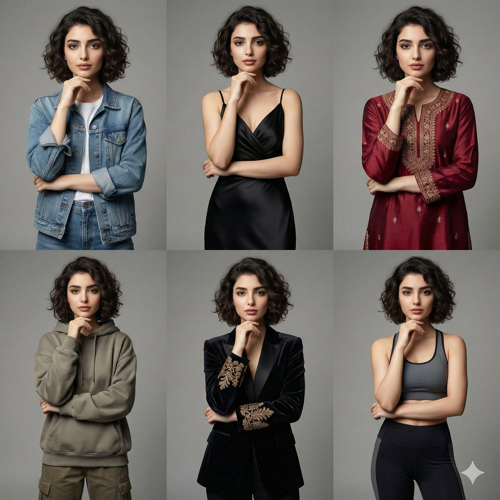
</div>

**提示词：**
```
A cinematic fashion grid showing the uploaded photo styled in different outfits: casual, formal, ethnic, streetwear, luxury, sporty. Same face, same pose, neutral background, editorial fashion layout.
Consistent facial features and proportions across all looks, with only clothing, styling, and accessories changing.
Soft professional studio lighting with balanced shadows for a high-end magazine feel.
Ultra-realistic fabric textures, refined color grading, sharp details, modern fashion editorial aesthetic.
```

**中文提示词：**
```
一个电影般的时尚网格图，展示了上传的照片搭配不同服装的效果：休闲、正式、民族风、街头风、奢华风、运动风。同一张脸，同样的姿势，中性背景，时尚大片式的排版。
所有造型都保持一致的面部特征和比例，只有服装、造型和配饰会发生变化。
柔和的专业影棚灯光，搭配均衡的阴影，营造出高端杂志般的质感。
超逼真的面料纹理、精细的色彩分级、清晰的细节、现代时尚大片美学。
```

<a id="prompt-931"></a>
## 案例 931：年轻女性的韩式时尚特写肖像 (来源 [@iamsofiaijaz](https://x.com/iamsofiaijaz/status/2002410368476627268)) 模型：Nano banana pro

<div style="display: flex; justify-content: space-between;">

</div>

**提示词：**
```
"subject": {
"description": "A Korean-editorial close-up portrait of a young woman use attached photo with porcelain-white skin, captured in a fleeting instant as wind lifts her black hair mid-motion. A single narrow hard light beam strikes her face from a 45-degree diagonal angle, illuminating only the facial planes while everything else falls into deep shadow. A very faint prism/refraction rainbow appears subtly within the lit area, creating a cool, sharp, effortless swagger.", "mirror_rules": null, "age": "early 20s", "expression": { "eyes": { "look": "steady, unbothered", "energy": "cool confidence, detached", "direction": "toward the camera with a slight side gaze" }, "mouth": { "position": "slightly parted", "energy": "controlled, unapologetic" }, "overall": "cool, restrained, sharp swagger" }, "face": { "preserve_original": true, "makeup": "K-beauty clean matte look: softly structured brows, minimal eyeliner, low-saturation lips, porcelain skin with 
}
```

**中文提示词：**
```
"主体"：{"描述"："参照所附照片，拍摄一位拥有瓷白肌肤的年轻女性的韩式时尚特写肖像，定格于微风拂起她黑发的动态瞬间。一道纤细的硬光光束从 45 度斜角打在她的脸上，仅照亮面部轮廓，其余所有区域均隐没于深邃阴影之中。在受光区域内，隐约浮现一道极淡的棱镜折射彩虹光斑，营造出清冷、利落且浑然天成的飒爽气场。"，"镜像规则"：无，"年龄"："二十岁出头"，"神态表情"：{"眼部"：{"眼神"："沉稳淡然"，"气质"："冷峻自信，疏离淡漠"，"视线方向"："直视镜头，略带侧视角度"},"唇部"：{"状态"："微张"，"气质"："克制沉稳，坦荡无畏"},"整体神态"："清冷克制，利落飒爽"},"面部"：{"保留原图特征"：是，"妆容"：" 韩式清透哑光妆效：眉形自然立体，眼线极简，唇色低饱和度，瓷白肌肤质感}
```

<a id="prompt-930"></a>
## 案例 930：90年代复古黑白肖像照 (来源 [@SimplyAnnisa](https://x.com/SimplyAnnisa/status/2002582470567604295)) 模型：Nano banana pro

<div style="display: flex; justify-content: space-between;">
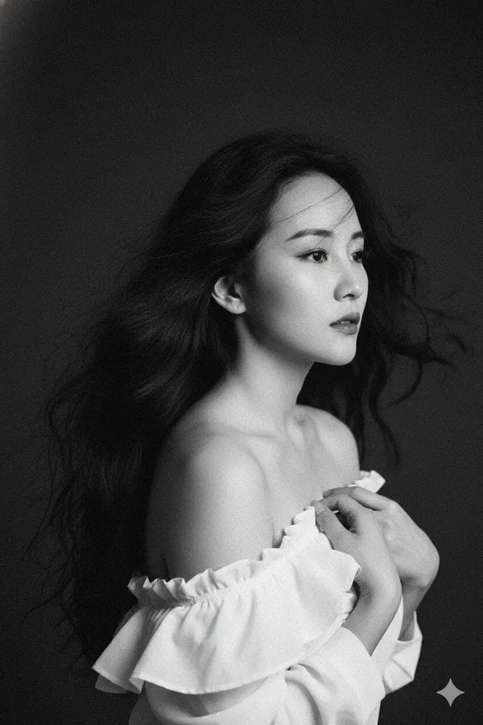
</div>

**提示词：**
```
Create and don't change her face.
A highly artistic 90s vintage black and white (monochrome) portrait. It features a beautiful woman with classic facial features and long, voluminous, wavy, wind-blown black hair. She gazes off to the side with a pensive, poetic look. The woman holds a piece of ruffled white fabric or clothing against her chest, her shoulders wide open (off-shoulder). The plain, dark background provides a sharp contrast to her skin and white clothing. The image texture has a very pronounced film grain, a 35mm film aesthetic, and soft lighting that accentuates the cheekbones and hair texture. Masterpiece quality, 8k, emotional, and cinematic.
```

**中文提示词：**
```
保持她的容貌，不要改变她的容貌。
这是一张极具艺术气息的90年代复古黑白肖像照。照片中的女子容貌姣好，五官经典，一头乌黑亮丽的长发随风飘扬，蓬松而富有波浪。她侧目凝视，眼神中流露出沉思和诗意。女子胸前披着一块白色褶皱布料或衣物，双肩敞开（露肩）。简洁的深色背景与她白皙的肌肤和洁白的衣衫形成鲜明对比。照片质感细腻，带有明显的胶片颗粒感，呈现出35毫米胶片的复古美感，柔和的光线突显了她的颧骨和发丝纹理。8K高清画质，情感饱满，极具电影质感，堪称艺术杰作。
```

<a id="prompt-929"></a>
## 案例 929：女子面部的超近距离微距肖像 (来源 [@Vivekhy](https://x.com/Vivekhy/status/2002080283873714488)) 模型：Nano banana pro

<div style="display: flex; justify-content: space-between;">
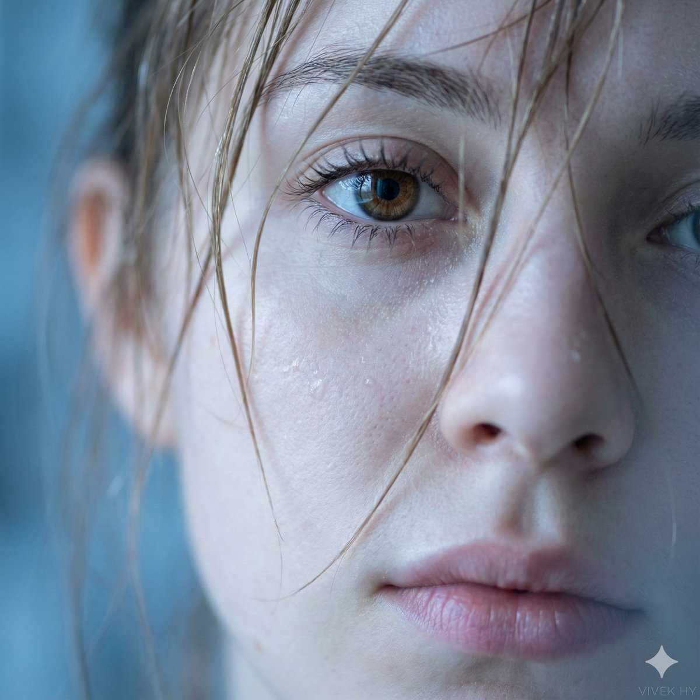
</div>

**提示词：**
```
{
  "prompt_description": {
    "subject": "Extreme close-up macro portrait of a young woman's face, partial view focusing on one eye, nose, and lips",
    "skin_texture": "Hyper-realistic skin details, visible pores, dewy and fresh complexion, soft porcelain skin tone",
    "eyes": "Sharp brown iris with highly detailed eyelashes, clear catchlight reflection, intense and soft gaze",
    "hair": "Wet, messy strands of light brown hair falling naturally across the face and eye",
    "lips": "Soft natural pink lips, subtle texture, slightly parted"
  },
  "artistic_style": {
    "lighting": "Soft diffused cool lighting, cinematic blue tones, ambient soft shadows",
    "aesthetic": "Photorealistic, Cinematic, Masterpiece, Raw photo quality, 8k resolution"
  },
  "camera_settings": {
    "lens": "85mm",
    "shot_type": "Macro / Extreme Close-up",
    "aperture": "f/1.8 (shallow depth of field)",
    "focus": "Sharp focus on the eye"
  },
  "output_parameters": {
    "aspect_ratio": "1:1 (Square)",
    "signature": "VIVEK HY",
    "signature_location": "Bottom right corner"
  }
}
```

**中文提示词：**
```
{
"prompt_description": {
“主题”：“年轻女子面部的超近距离微距肖像，局部视角，聚焦于一只眼睛、鼻子和嘴唇”，
"skin_texture": "超逼真的皮肤细节，可见的毛孔，水润清新的肤色，柔和的瓷白肤色",
“眼睛”：“锐利的棕色虹膜，睫毛细节丰富，眼神明亮，目光深邃而柔和”，
“头发”：“湿漉漉的、凌乱的浅棕色头发自然地垂落在脸颊和眼睛上”，
“嘴唇”： “柔软自然的粉红色嘴唇，质地细腻，微微张开”
},
"artistic_style": {
“照明”：“柔和的漫射冷光，电影般的蓝色调，柔和的环境阴影”，
“美学”： “照片级真实感、电影级、杰作级、原始照片质量、8K分辨率”
},
"camera_settings": {
镜头：85mm，
"shot_type": "微距/超近景",
“光圈”: “f/1. 8 (浅景深)”，
“聚焦”： “清晰聚焦于眼睛”
},
"output_parameters": {
"aspect_ratio": "1:1 (正方形)",
签名：VIVEK HY，
"签名位置": "右下角"
}
}
```

<a id="prompt-928"></a>
## 案例 928：女士手持一个自己的木质相框 (来源 [@AIwithSynthia](https://x.com/AIwithSynthia/status/2002578332496638452)) 模型：Nano banana pro

<div style="display: flex; justify-content: space-between;">
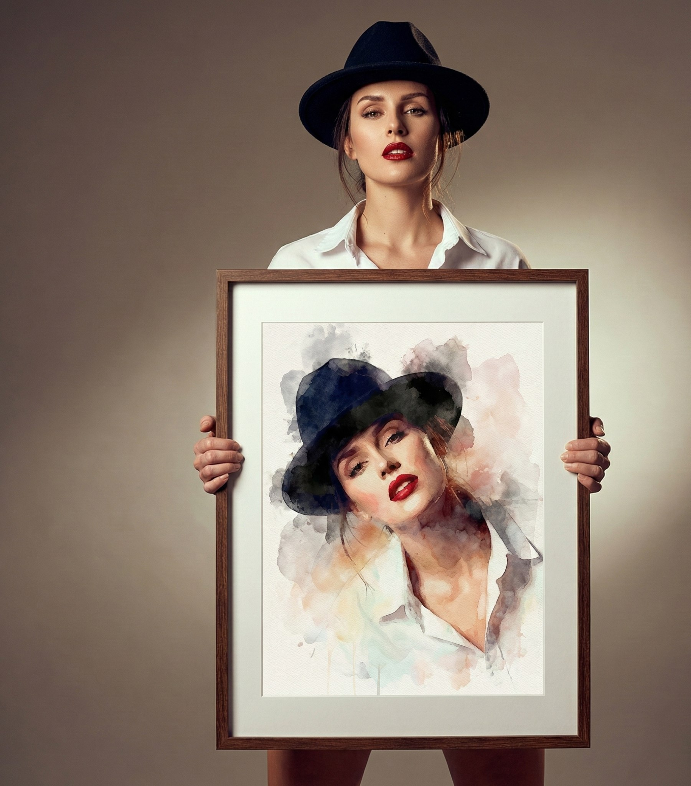
</div>

**提示词：**
```
A stylish woman wearing a black fedora and white shirt stands against a soft neutral studio background, holding a wooden frame. Inside the frame is a photo watercolor portrait of herself, painted with loose brushstrokes, soft ink bleeds, and expressive splashes. The watercolor version tilts slightly, with vivid red lips and delicate facial details. Google Gemini Cinematic studio lighting, shallow depth of field, elegant editorial fashion aesthetic, fine art photography blended with watercolor illustration, ultra-high resolution, minimal composition, calm and sophisticated mood.
```

**中文提示词：**
```
一位身着黑色软呢帽和白色衬衫的时尚女士，站在柔和的中性色调摄影棚背景前，手持一个木质相框。相框内是一幅她本人的水彩肖像照片，笔触自由流畅，墨迹晕染自然，色彩泼洒灵动。水彩画略微倾斜，鲜艳的红唇和精致的面部细节跃然纸上。照片采用谷歌Gemini影棚灯光，浅景深，展现出优雅的时尚美学，将艺术摄影与水彩插画巧妙融合，超高分辨率，极简构图，营造出平静而精致的氛围。
```

<a id="prompt-927"></a>
## 案例 927：女性站在KAWS风格艺术雕塑旁 (来源 [@xmiiru_](https://x.com/xmiiru_/status/2002578056628601143)) 模型：Grok

<div style="display: flex; justify-content: space-between;">
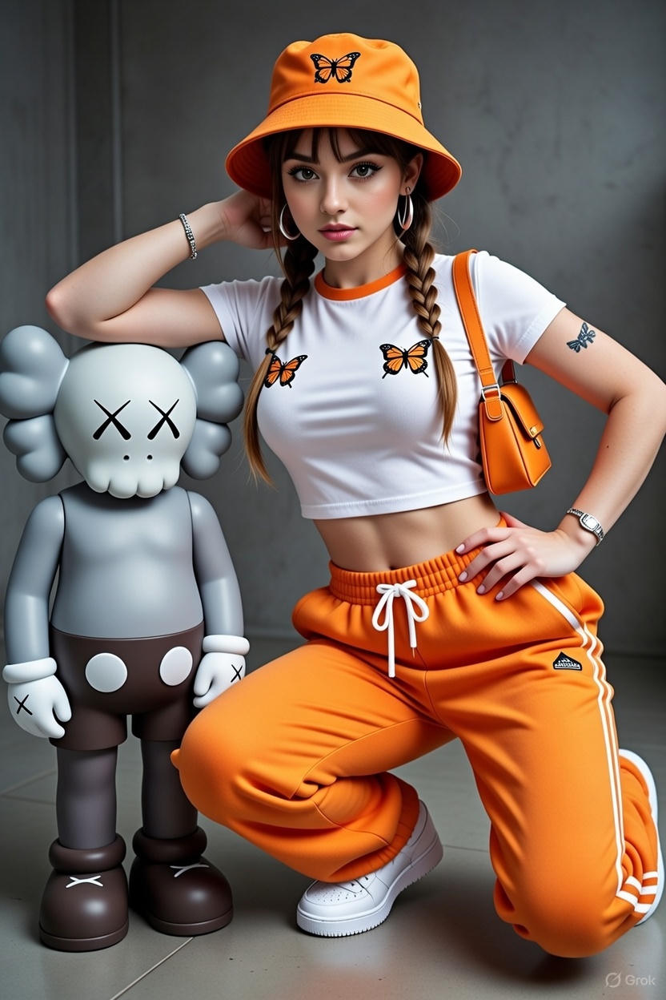
</div>

**提示词：**
```
{
  "prompt": "Ultra realistic fashion editorial photography of a stylish young woman posing next to a gray KAWS-style art figure, One knee on the floor, one leg bent forward, body slightly angled, one arm resting casually on the statue’s head, the other hand on hip. Confident fierce expression, sharp gaze toward camera. Wearing a vibrant orange bucket hat with butterfly emblem, white fitted crop t-shirt with orange butterfly graphics, bright orange track pants with white piping, white sneakers Small orange shoulder bag, subtle tattoos visible, braided hair accents, minimal jewelry. Monochrome orange streetwear aesthetic. Minimalist indoor space with gray walls and clean floor. Soft diffused studio lighting, realistic skin texture, sharp focus, high fashion streetwear vibe, professional photography, ultra-detailed, 8K resolution. Don't change original face",
  "negative_prompt": "low quality, blur, bad anatomy, extra fingers, extra limbs, distorted pose, cartoon, anime, illustration",
  "parameters": {
    "aspect_ratio": "2:3",
    "version": "6",
    "style": "raw",
    "quality": 2
  }
}
```

**中文提示词：**
```
{
“提示”：“超写实时尚大片，一位时髦的年轻女性站在一个灰色的KAWS风格艺术雕塑旁，单膝跪地，一条腿向前弯曲，身体略微倾斜，一只手臂随意地搭在雕塑的头部，另一只手叉腰。她表情自信而犀利，目光直视镜头。她戴着一顶饰有蝴蝶图案的亮橙色渔夫帽，一件印有橙色蝴蝶图案的白色修身露脐T恤，一条饰有白色滚边的亮橙色运动裤，一只白色运动鞋，一只小巧的橙色单肩包，隐约可见的纹身，编发点缀，佩戴极简的珠宝。整体呈现单色调的橙色街头服饰美学。极简主义的室内空间，灰色墙壁和干净的地板。柔和的漫射影棚灯光，逼真的皮肤纹理，清晰的焦点，高级时尚街头服饰氛围，专业摄影，超高细节，8K分辨率。请勿更改原图。”
"negative_prompt": "低质量、模糊、解剖结构错误、多余手指、多余肢体、姿势扭曲、卡通、动漫、插画",
“参数”： {
"aspect_ratio": "2:3",
版本：6，
"风格": "原始"
“质量”：2
}
}
```

<a id="prompt-926"></a>
## 案例 926：金发女子跪在游艇甲板上 (来源 [@xmliisu](https://x.com/xmliisu/status/2002367350146773079)) 模型：Nano banana pro

<div style="display: flex; justify-content: space-between;">
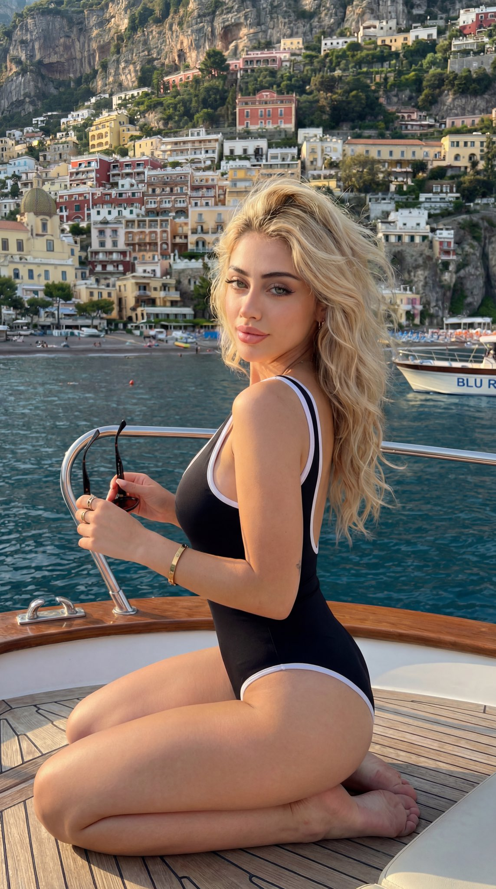
</div>

**提示词：**
```
{ "lighting": {
    "source": "Natural sunlight",
    "quality": "Golden hour, soft and warm",
    "shadows": "Soft, well-defined shadows cast by the subject and boat elements",
    "direction": "From the right, slightly backlit",
    "highlights": "Bright highlights on the water, boat railing, and subject's hair"
  },
  "background": {
    "details": "Specific buildings, church dome, beach activity are visible",
    "setting": "Positano, Amalfi Coast, Italy",
    "distance": "Far",
    "elements": [
      "Cliffside town with colorful buildings",
      "Sandy beach with umbrellas and people",
      "Dark blue sea",
      "Other boats",
      "Lush green vegetation on the cliffs"
    ],
    "lighting_interaction": "Sunlight illuminates the town and cliffs, creating warm tones"
  },
  "typography": {
    "color": "#2E4A7D",
    "location": "On the side of the blue boat in the background right",
    "font_style": "Sans-serif, uppercase, bold",
    "description": "Boat name and registration details",
    "text_content": "BLU RIDE"
  },
  "composition": {
    "balance": "Asymmetrical balance between the subject in the foreground and the town in the background",
    "framing": "Medium shot",
    "perspective": "Slightly low angle, looking up towards the subject and background",
    "leading_lines": "The boat's railing and deck lead the eye towards the subject and the town",
    "depth_of_field": "Deep, with both subject and background in focus",
    "rule_of_thirds": "Subject positioned in the lower right intersection"
  },
  "color_profile": {
    "mood": "Warm, vibrant, luxurious",
    "contrast": "Medium-high",
    "saturation": "High",
    "color_scheme": "Analogous blues and greens with warm earth tones",
    "dominant_colors": [
      "#2E4A7D",
      "#F2F2F2",
      "#C8A17B",
      "#5A784A",
      "#D98D6F"
    ]
  },
  "technical_specs": {
    "iso": "Low",
    "aperture": "f/8 or smaller for deep depth of field",
    "lens_type": "Wide-angle lens",
    "resolution": "High",
    "camera_type": "DSLR or mirrorless",
    "aspect_ratio": "4:5",
    "shutter_speed": "Fast enough to freeze motion"
  },
  "subject_analysis": {
    "hair": "Blonde, wavy, wind-blown",
    "pose": "Kneeling on the boat deck, body angled towards the camera, right hand holding sunglasses, left hand on the railing",
    "clothing": "Black one-piece swimsuit with white trim and cutouts",
    "expression": "Looking over sunglasses with a slight smile",
    "accessories": "Dark sunglasses, gold bracelet, ring",
    "subject_type": "Young woman",
    "hands_gestures": "Right hand adjusting sunglasses, left hand resting on the railing",
    "location_on_frame": "Foreground, center-right"
  },
  "artistic_elements": {
    "mood": "Relaxed, luxurious, aspirational",
    "style": "Lifestyle photography, candid",
    "texture": "Smooth boat deck, textured water, rugged cliffs, fabric of the swimsuit",
    "narrative": "A woman enjoying a luxurious boat trip along the Amalfi Coast"
  },
  "generation_parameters": {
    "seed": "Random",
    "prompt": "A lifestyle photograph of a young blonde woman kneeling on the deck of a boat, wearing a black and white swimsuit and sunglasses, looking back at the camera. In the background is the cliffside town of Positano, Italy, with colorful buildings, a beach, and the sea under golden hour sunlight. The boat is moving, with other boats visible. The style is candid and luxurious.",
    "model_type": "Photorealistic",
    "guidance_scale": "High",
    "negative_prompt": "Blurry, low resolution, studio lighting, artificial, indoors, crowded, overcast"
  }
}
```

**中文提示词：**
```
{“灯光”： {
“来源”：“自然阳光”，
“品质”：“黄金时刻，柔和温暖”，
“阴影”：“主体和船只元素投射出的柔和、轮廓清晰的阴影”，
“方向”：“从右侧，略微背光”，
“亮点”：“水面、船舷和人物头发上的明亮高光”
},
“背景”： {
“细节”：“可以看到特定的建筑物、教堂圆顶和海滩活动”，
“设置”：“意大利阿马尔菲海岸波西塔诺”
“距离”: “远”
“元素”：[
“悬崖边的小镇，建筑色彩缤纷”
“沙滩上有遮阳伞和人群”
“深蓝色的大海”，
“其他船只”，
“悬崖上郁郁葱葱的植被”
],
"lighting_interaction": "阳光照亮城镇和悬崖，营造出温暖的色调"
},
"排版": {
“颜色”: “ #2E4A7D “,
“位置”：“在背景右侧蓝色船的侧面”，
"font_style": "无衬线字体，大写，粗体",
"描述": "船名和注册详情",
"text_content": "BLU RIDE"
},
“作品”： {
“平衡”：“前景主体与背景城镇之间的不对称平衡”，
“构图”：“中景”，
“视角”：“略微低角度，向上看向主体和背景”，
"leading_lines": "船的栏杆和甲板引导视线看向主体和城镇",
景深： “景深，主体和背景都清晰对焦”
“三分法构图”：“主体位于右下角交点处”
},
"color_profile": {
“氛围”：“温暖、充满活力、奢华”，
“对比度”：“中高”
“饱和度”: “高”
"配色方案": "类似蓝色和绿色，搭配温暖的大地色调",
"主色": [
" #2E4A7D "，
" #F2F2F2 "，
" #C8A17B "，
" #5A784A "，
#D98D6F
]
},
"technical_specs": {
"iso": "低",
“光圈”: “f /8或更小，以获得更大的景深”，
"lens_type": "广角镜头",
“分辨率”： “高”
"camera_type": "单反或无反"
"aspect_ratio": "4:5",
"shutter_speed": "足够快，可以凝固运动"
},
“主题分析”：{
“头发”：“金色的，波浪状的，被风吹乱的”，
“姿势”：“跪在船甲板上，身体侧对着镜头，右手拿着太阳镜，左手扶着栏杆”，
“服装”：“黑色连体泳衣，带有白色滚边和镂空设计”
“表情”：“透过太阳镜，带着一丝微笑看着前方”，
“配饰”：“深色太阳镜、金手镯、戒指”
"subject_type": "年轻女子",
“hands_gestures”: “右手调整太阳镜，左手扶在栏杆上”
"location_on_frame": "前景，中心偏右"
},
“artistic_elements”：{
“氛围”：“轻松、奢华、令人向往”
“风格”：“生活方式摄影，抓拍”
“质感”：“光滑的船甲板，波光粼粼的水面，崎岖的悬崖，泳衣的面料”，
叙事：一位女士正在享受沿着阿马尔菲海岸的豪华游艇之旅
},
"generation_parameters": {
“种子”： “随机”，
提示：一张生活方式照片，一位年轻的金发女子跪在船甲板上，身穿黑白泳衣，戴着太阳镜，回头看向镜头。背景是意大利波西塔诺的悬崖小镇，色彩缤纷的建筑、沙滩和沐浴在金色阳光下的大海。船正在行驶，可以看到其他船只。风格自然而奢华。
"model_type": "Photorealistic",
"guidance_scale": "高",
"negative_prompt": "模糊、低分辨率、影棚灯光、人造光、室内、拥挤、阴天"
}
}
```

<a id="prompt-925"></a>
## 案例 925：健身房自拍照 (来源 [@xIrissy](https://x.com/xIrissy/status/2002372846807654508)) 模型：Nano banana pro

<div style="display: flex; justify-content: space-between;">
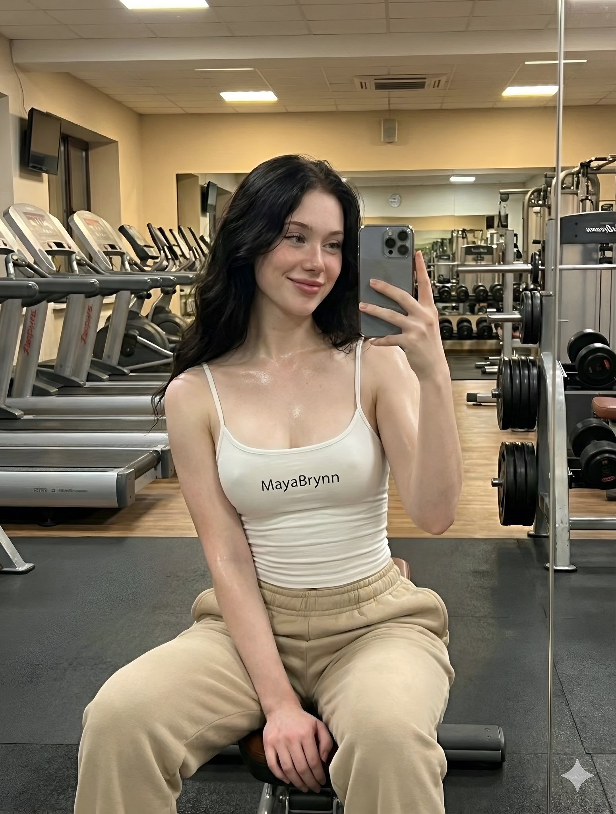
</div>

**提示词：**
```
{
  "image_analysis": {
    "type": "Mirror Selfie",
    "setting": "Gym / Fitness Center",
    "subject": {
      "gender": "Female",
      "age_group": "Young Adult",
      "appearance": {
        "hair": "Long, dark, wavy",
        "skin_tone": "Fair",
        "expression": "Slight smile, looking at phone screen",
        "details": "Visible sweat/sheen on skin indicating a workout"
      },
      "pose": "Seated on a gym bench, leaning slightly forward, holding a phone with the left hand"
    },
    "attire": {
      "top": {
        "color": "White",
        "style": "Spaghetti strap tank top / camisole",
        "text_content": "MayaBrynn"
      },
      "bottom": {
        "color": "Beige / Tan",
        "style": "Loose-fitting sweatpants"
      }
    },
    "accessories": {
      "phone": "iPhone (Pro model) with grey case"
    },
    "environment": {
      "background_left": "Row of grey commercial treadmills",
      "background_right": "Dumbbell rack with weights, gym equipment reflection in mirror",
      "lighting": "Overhead artificial gym lighting",
      "flooring": "Black rubber gym mats"
    },
    "technical_aspects": {
      "perspective": "First-person reflection",
      "focus": "Sharp on subject, slightly softer background",
      "style": "Realistic, Social Media Aesthetic, Fitness"
    }
  }
}
```

**中文提示词：**
```
{
"image_analysis": {
类型： 镜子自拍，
“设置”：“健身房/健身中心”，
“主题”： {
"性别": "女",
"age_group": "青年人",
“外貌”： {
“头发”：“长，深色，波浪形”，
"skin_tone": "白皙",
“表情”：“微微一笑，看着手机屏幕”
“细节”：“皮肤上有可见的汗水/光泽，表明进行过锻炼”
},
“姿势”：“坐在健身长凳上，身体略微前倾，左手拿着手机”
},
着装：{
“顶部”： {
颜色：白色，
“款式”：“吊带背心/吊带衫”，
"text_content": "MayaBrynn"
},
“底部”： {
颜色：米色/棕褐色，
款式：宽松运动裤
}
},
“配件”： {
“手机”: “iPhone（Pro 型号），灰色手机壳”
},
“环境”： {
"background_left": "一排灰色的商用跑步机",
"background_right": "哑铃架和杠铃片，健身器材在镜子中的倒影"
“照明”：“体育馆顶棚人工照明”，
“地板”： “黑色橡胶健身垫”
},
"technical_aspects": {
“视角”: “第一人称反思”
“焦点”：“主体清晰，背景略微柔和”，
风格：写实、社交媒体美学、健身
}
}
}
```

<a id="prompt-924"></a>
## 案例 924：电视新闻演播室现场 (来源 [@Just_sharon7](https://x.com/Just_sharon7/status/2002615857185501519)) 模型：Nano banana pro

<div style="display: flex; justify-content: space-between;">
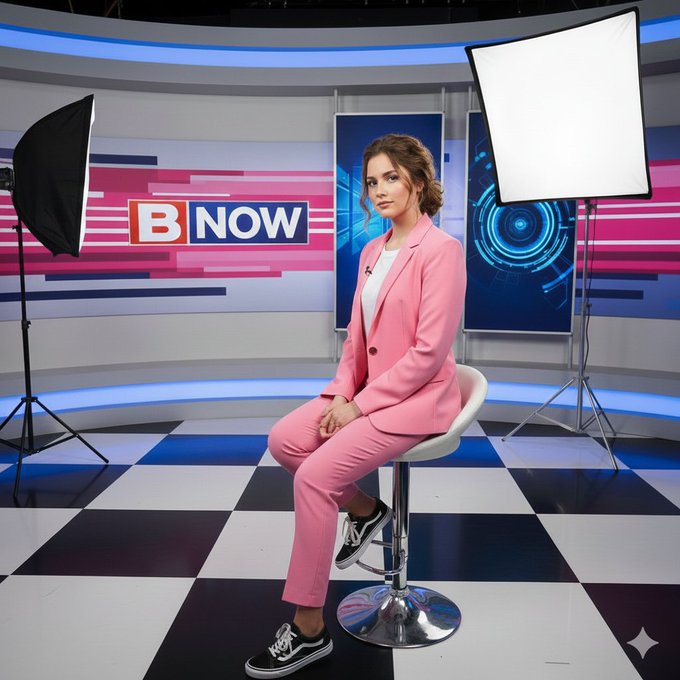
</div>

**提示词：**
```
{
  "subject": {
    "person": "Young Western woman",
    "pose": "Side profile, seated on a high white swivel bar stool, looking directly at the camera with a subtle, neutral expression",
    "hair": "Dark blond, styled in a voluminous low side bun (chignon) with loose strands framing the face",
    "clothing": {
      "jacket": "Tailored bubblegum pink blazer, single-button closure, notched lapels",
      "undershirt": "Plain white crew-neck top",
      "trousers": "Matching bubblegum pink slim-fit dress pants",
      "footwear": "Black canvas low-top sneakers with white soles and black laces (Vans style)"
    }
  },
  "environment": {
    "setting": "Professional television news studio or talk show set",
    "background_elements": [
      {
        "type": "LED Screen",
        "content": "Pink and white horizontal stripes with a vertical logo reading 'B NOW' in bold block letters"
      },
      {
        "type": "Digital Graphic",
        "content": "Blue circular futuristic HUD/UI interface graphic on a vertical panel"
      }
    ],
    "furniture": "White modern curved bar stool with chrome pedestal base; glossy white and black reflective studio flooring"
  },
  "technical_details": {
    "lighting": [
      "High-key studio lighting",
      "Large white softbox visible on a stand to the right",
      "Black flag/scrim visible on the left side of the frame",
      "Blue ambient LED accent lighting along the base of the walls"
    ],
    "camera_angle": "Medium full shot, eye-level, slight side-on perspective",
    "composition": "The subject is centered vertically, positioned between studio equipment and digital screens, showing the 'behind-the-scenes' reality of the set",
    "color_palette": {
      "primary": "Bubblegum pink, stark white",
      "secondary": "Deep blue, black",
      "accents": "Chrome, neutral grey"
    }
  },
  "vibe": "Professional yet candid, modern, broadcast media aesthetic"
}
```

**中文提示词：**
```
{
“主题”： {
“人”: “年轻的西方女性”
“姿势”：“侧脸，坐在白色高脚旋转吧台凳上，直视镜头，表情微妙而中性”，
“头发”：“深金色，梳成蓬松的低侧发髻（发髻），几缕碎发垂在脸颊两侧”，
“衣服”： {
“外套”：“修身泡泡糖粉色西装外套，单扣，缺角翻领”
“内衣”： “纯白色圆领上衣”，
“裤子”： “配套的泡泡糖粉色修身西裤”
“鞋类”：“黑色帆布低帮运动鞋，白色鞋底，黑色鞋带（Vans 款式）”
}
},
“环境”： {
“场景”：“专业电视新闻演播室或脱口秀节目现场”，
“背景元素”：[
{
"type": "LED屏幕",
“内容”：“粉色和白色横条纹，带有醒目的竖排“B NOW”标志”
},
{
"type": "数字图形",
“内容”：“垂直面板上的蓝色圆形未来主义HUD/UI界面图形”
}
],
“家具”：“白色现代弧形吧台凳，镀铬底座；亮白色和黑色反光工作室地板”
},
"technical_details": {
“灯光”： [
“高调影棚灯光”，
“右侧支架上可以看到一个大型白色柔光箱，”
“画面左侧可见黑色旗帜/幕布”，
“沿墙底部设置蓝色环境LED重点照明”
],
“camera_angle”: “中景全景，平视，略微侧视”
“构图”：“主体垂直居中，位于摄影棚设备和数字屏幕之间，展现了片场‘幕后’的真实情况。”
"color_palette": {
“主色”：泡泡糖粉色，纯白色，
“次要的”: “深蓝色，黑色”
“点缀色”：铬色、中性灰
}
},
“氛围”：“专业而坦诚，现代，广播媒体美学”
}
```

<a id="prompt-923"></a>
## 案例 923：冬至海报 (来源 [@sundyme](https://x.com/sundyme/status/2002592213851832742)) 模型：Nano banana pro

<div style="display: flex; justify-content: space-between;">

</div>

**中文提示词：**
```
一个温馨的3D C4D Octane渲染场景，采用无黑色轮廓的羊毛针毡风格，具有盲盒玩具的柔和边缘审美。四只不同大小的粉彩（薄荷绿、嫩粉、淡蓝、奶油色）羊毛毡Labubu角色，身穿针织毛衣，有着标志性的圆润身体、兔耳和大眼睛，表情喜悦。它们围坐在铺着针织桌布的矮桌旁，桌上摆满热气腾腾的饺子、茶壶和餐具。一个角色正用筷子亲昵地喂另一个角色吃饺子。地面覆盖着羊毛雪和散落的心形装饰。左侧是挂着灯笼的盛开梅花枝，右侧是祥云图案。发光的羊毛心形在空中漂浮。背景是温暖的橙黄色渐变，营造出冬至家庭团聚的节日氛围。顶部是巨大、发光、毛绒质感的艺术字体“饺饺情深，岁岁安康”。中间是清晰简单的祝福语：“愿家人健康快乐，幸福安康！”。8K分辨率，高细节，暖光摄影棚照明，垂直2:3比例。
```

<a id="prompt-922"></a>
## 案例 922：产品高端商业营销设计 (来源 [@firatbilal](https://x.com/firatbilal/status/2002424619232588218)) 模型：Nano banana pro

<div style="display: flex; justify-content: space-between;">
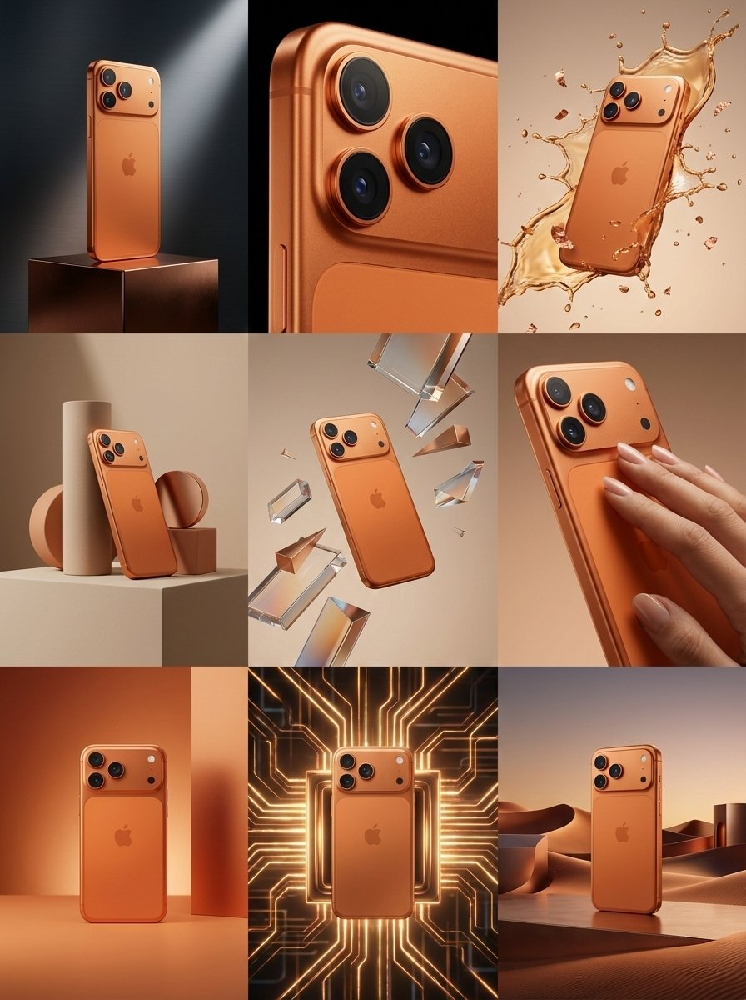
</div>

**提示词：**
```
Create a 3×3 grid in
3:4 aspect ratio for a high-end commercial marketing campaign using the uploaded product as the central subject.

Each frame must present a distinct visual concept while maintaining perfect product consistency across all nine images.

Grid Concepts (one per cell):

1. Iconic hero still life with bold composition

2. Extreme macro detail highlighting material, surface, or texture

3. Dynamic liquid or particle interaction surrounding the product

4. Minimal sculptural arrangement with abstract forms

5. Floating elements composition suggesting lightness and innovation

6. Sensory close-up emphasizing tactility and realism

7. Color-driven conceptual scene inspired by the product palette

8. Ingredient or component abstraction (non-literal, symbolic)

9. Surreal yet elegant fusion scene combining realism and imagination

Visual Rules:
Product must remain 100% accurate in shape, proportions, label, typography, color, and branding
No distortion, deformation, or redesign of the product
Clean separation between product and background

Lighting & Style:
Soft, controlled studio lighting
Subtle highlights, realistic shadows
High dynamic range, ultra-sharp focus
Editorial luxury advertising aesthetic
Premium sensory marketing look

Overall Feel:
Modern, refined, visually cohesive
High-end commercial campaign
Designed for brand websites, social grids, and digital billboards
Hyperreal, cinematic, polished, and aspirational
```

**中文提示词：**
```
创建一个 3×3 的网格
3:4 宽高比，适用于以上传产品为中心主题的高端商业营销活动。

每幅画面都必须呈现独特的视觉概念，同时在所有九幅画面中保持产品的完美一致性。

网格概念（每个单元格一个）：

1. 构图大胆的标志性英雄静物画

2. 极致的宏观细节，突出材质、表面或纹理。

3. 产品周围的动态液体或颗粒相互作用

4. 极简主义的抽象造型雕塑摆设

5. 漂浮元素构成，暗示着轻盈和创新。

6. 强调触觉和真实感的感官特写

7. 以产品色卡为灵感的色彩驱动型概念场景

8. 成分或组成部分抽象（非字面意义、符号意义）

9. 超现实而又优雅的融合场景，兼具现实主义与想象力

视觉规则：
产品在形状、比例、标签、字体、颜色和品牌标识方面必须保持100%准确。
产品不得有任何变形、扭曲或重新设计。
产品与背景之间清晰分离

灯光与风格：
柔和、可控的摄影棚灯光
微妙的高光，逼真的阴影
高动态范围，超清晰对焦
编辑奢华广告美学
高端感官营销外观

整体感觉：
现代、精致、视觉上和谐统一
高端商业推广活动
专为品牌网站、社交媒体平台和数字广告牌而设计
超现实的、电影般的、精致的、令人向往的
```

<a id="prompt-921"></a>
## 案例 921：MacBook Pro打开了X应用的照片 (来源 [@marmaduke091](https://x.com/marmaduke091/status/2002348744491348365)) 模型：Nano banana pro

<div style="display: flex; justify-content: space-between;">
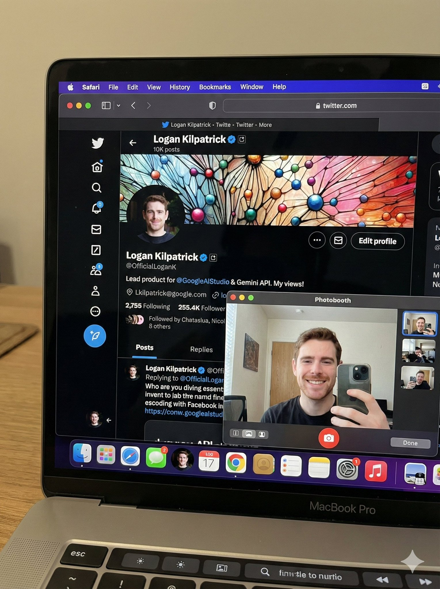
</div>

**提示词：**
```
candid 3:4 still of a macbook pro with x opened on safari and this x account is mine (so don't put follow buttons there but accurate ones) as also the pfp can be seen on sidedock bar too, with next to it photobooth opened with me (this guy on pfp) selfie-ing from the webcam, do not change my face, no gibberish text, phone still, flat normal quality
```

**中文提示词：**
```
一张3:4比例的MacBook Pro照片，Safari浏览器打开了X应用，这个X账号是我的（所以不要放关注按钮，但要放准确的关注按钮），头像也显示在侧边栏，旁边打开了Photo Booth，我（头像上的这个人）正在用摄像头自拍，不要修改我的脸，没有乱码，手机拍摄，普通画质。
```

<a id="prompt-920"></a>
## 案例 920：城市渲染数字艺术海报 (来源 [@op7418](https://x.com/op7418/status/2002592082125578427)) 模型：Nano banana pro

<div style="display: flex; justify-content: space-between;">
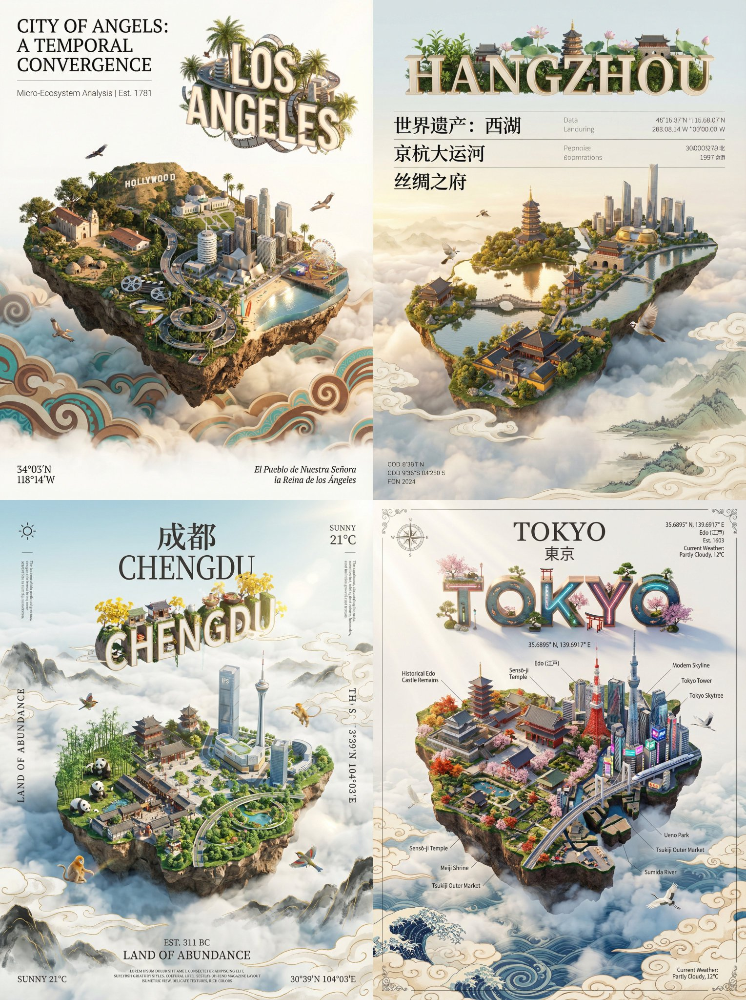
</div>

**中文提示词：**
```
一张针对 [城市名称] 的城市渲染数字艺术海报。

画面核心主体是一个漂浮在白云上方、形状像所选城市的并且占据画面大部分内容的微型岛屿。岛屿的形状与城市在地图上的形状相似，无缝融合城市独特的标志性地标、自然景观及文化元素。加入城市特有的鸟类、电影般的光影、鲜艳色彩、航拍视角和阳光反射效果，建筑不宜太多太密集。

岛屿展现历史与现代的无缝融合。一部分是该城市最具代表性的古代历史建筑；另一部分平滑过渡为城市的地标建筑和天际线景观。

岛屿漂浮浩瀚云海之上。云海采用该城市所在文化圈的传统艺术风格进行表现。

立体城市拼音或英文名的 3D 文字漂浮在微型岛屿的上方，这组文字像一个生态与文化共生的微缩生态装置。

在画面四周和主体周围，叠加一层极简、高雅、具有博物馆展板质感的信息排版层。主要检索相关的城市信息，主要信息使用经典的衬线字体，辅助数据可使用极细的极简无衬线体。在画面的角落，以类似古典地图集或高级杂志扉页的方式排版。用衬线体标注城市的地理坐标、别称或建城年份，以及当前的天气，作为装饰性的背景信息，整体排版留白极多，排版克制、干净、平衡，如同在欣赏一件珍贵的艺术品。

风格要求： Octane Render, C4D, Isometric City, Micro World, Living Ecosystem, 8k Resolution. DreamWorks style, 3D modeling, delicate, soft light projection.
```

<a id="prompt-919"></a>
## 案例 919：丁香色长裙女性双版本比例对比 (来源 [@saniaspeaks_](https://x.com/saniaspeaks_/status/2001944607714673042)) 模型：Nano banana pro

<div style="display: flex; justify-content: space-between;">
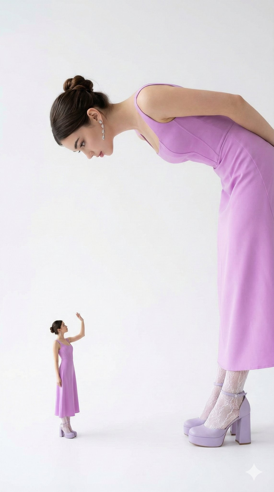
</div>

**提示词：**
```
{
  "type": "image_generation_prompt",
  "style": "ultra-realistic, high-fashion editorial, studio photography",
  "identity_preservation": {
    "use_reference_image": true,
    "alter_face": false,
    "strict_identity_lock": true,
    "notes": "Create an extremely realistic image that is ultra-similar to the referenced girl. Preserve her facial identity, proportions, hairstyle, and overall appearance exactly as in the reference."
  },
  "subject": {
    "gender": "female",
    "appearance": {
      "hair": {
        "color": "dark",
        "style": "elegant updo (bun)"
      },
      "jewelry": [
        "delicate dangling earrings"
      ],
      "expression": "calm, confident, composed"
    }
  },
  "wardrobe": {
    "dress": {
      "type": "full-length elegant dress",
      "color": "bright lilac",
      "style": "fitted bodice with a refined silhouette, modest and fully covered",
      "fabric": "smooth, high-quality fabric with a soft sheen"
    },
    "legwear": {
      "type": "white lace-patterned tights or stockings",
      "details": "floral or lace motif, refined and elegant"
    },
    "footwear": {
      "type": "platform heels",
      "color": "bright lilac",
      "details": "thick high heel with ankle strap, bold and fashionable"
    }
  },
  "composition": {
    "concept": "scale contrast with two versions of the same woman",
    "aspect_ratio": "9:16",
    "foreground": {
      "figure": "large version of the woman",
      "pose": "leaning forward and downward, gently curving her back to look at the miniature version",
      "emphasis": "long neck, arms, legs, and shoes dominating the frame for dramatic scale"
    },
    "background": {
      "figure": "miniature version of the same woman",
      "pose": "standing upright, appearing to salute, greet, or wave toward the larger figure",
      "outfit": "identical full-length lilac dress, white lace tights, and lilac platform heels"
    }
  },
  "environment": {
    "setting": "studio",
    "background": {
      "color": "clean white or very light gray",
      "style": "minimalist, distraction-free"
    }
  },
  "color_palette": {
    "dominant_colors": [
      "bright lilac",
      "white"
    ],
    "overall_tone": "clean, elegant, high-contrast fashion palette"
  },
  "lighting": {
    "type": "soft studio lighting",
    "effects": [
      "even illumination",
      "clear separation between figures",
      "enhanced fabric and skin realism"
    ]
  },
  "quality": {
    "realism": "ultra-realistic",
    "detail_level": "high detail in skin, fabric textures, lace patterns, and footwear",
    "rendering": "photorealistic, editorial-grade finish"
  },
  "mood": {
    "atmosphere": "stylish, artistic, playful with scale",
    "tone": "elegant, modern, fashion-forward"
  },
  "output_goal": "Create a maximally realistic and ultra-faithful fashion image of a woman in a full-length lilac dress, featuring a creative scale-play composition with two versions of the same subject, set against a clean studio background in a 9:16 format."
}
```

**中文提示词：**
```
{
"type": "image_generation_prompt",
“风格”：“超写实、高级时尚杂志大片、影棚摄影”，
"identity_preservation": {
"use_reference_image": true,
"alter_face": false,
"strict_identity_lock": true,
“备注”：“创作一幅与参考女孩极其相似的逼真图像。务必保留她的面部特征、身材比例、发型和整体外貌，与参考图完全一致。”
},
“主题”： {
"性别": "女性",
“外貌”： {
“头发”： {
“颜色”：“深色”，
"发型": "优雅盘发（发髻）"
},
“珠宝”： [
“精致的垂坠耳环”
],
表情：平静、自信、沉着
}
},
“衣柜”： {
“裙子”： {
类型：优雅长裙
“颜色”： “亮丁香色”，
“款式”：“修身胸衣，线条优美，端庄得体，完全遮盖身体”。
“面料”：光滑、高品质的面料，带有柔和的光泽
},
"腿部服装": {
“类型”：“白色蕾丝图案的紧身裤或长筒袜”，
细节：花卉或蕾丝图案，精致优雅
},
鞋类：{
类型：厚底高跟鞋，
“颜色”： “亮丁香色”，
“细节”：“粗跟高跟鞋，踝带设计，大胆时尚”
}
},
“作品”： {
“概念”：“同一女性的两个不同版本之间的比例对比”，
"aspect_ratio": "9:16",
前景：{
“人物”：“女性的放大版”，
“姿势”：“身体前倾向下，轻轻弯曲背部，看着微缩模型”，
“强调”：“修长的脖子、手臂、腿和鞋子占据画面，营造出戏剧性的比例感”。
},
“背景”： {
“人物”：“同一女性的微缩版本”，
“姿势”：“直立站立，看起来像是在向较大的人物敬礼、问候或挥手”，
“服装”： “同款淡紫色长连衣裙、白色蕾丝紧身裤和淡紫色厚底高跟鞋”
}
},
“环境”： {
“设置”: “工作室”
“背景”： {
“颜色”: “纯白色或非常浅的灰色”，
风格：极简主义，无干扰
}
},
"color_palette": {
"主色": [
“亮紫色”，
“白色的”
],
"overall_tone": "干净、优雅、高对比度的时尚色调"
},
“灯光”： {
“类型”：“柔和的影棚灯光”，
“效果”：[
“均匀照明”，
“数字之间有明显的分隔”，
“增强织物和皮肤的真实感”
]
},
“质量”： {
“写实主义”：“超写实主义”，
"detail_level": "皮肤、织物纹理、蕾丝图案和鞋履的细节都非常丰富",
“渲染”：“照片级真实感，编辑级效果”
},
“情绪”： {
“氛围”：“时尚、艺术、巧妙运用比例”，
“基调”：“优雅、现代、时尚前卫”
},
"output_goal": "创作一幅极其逼真、高度还原的女性时尚照片，照片中女性身穿淡紫色长裙，采用创意性的比例构图，使用同一主题的两个版本，背景为干净的摄影棚，格式为 9:16。"
}
```

<a id="prompt-918"></a>
## 案例 918：生成一周的服装搭配 (来源 [@schnapoon](https://x.com/schnapoon/status/2001847957390549090)) 模型：Nano banana pro

<div style="display: flex; justify-content: space-between;">
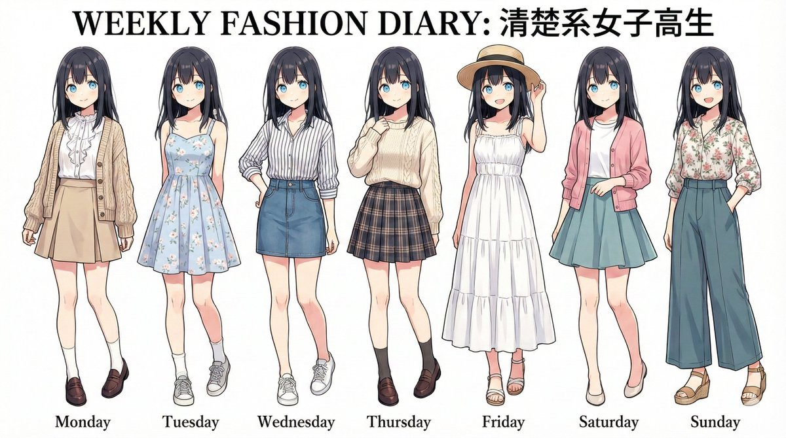
</div>

**中文提示词：**
```
环境：
【角色特征]:高中女生，留着黑色长发
【时尚主题]:现代高中女生日常穿着，整洁干净】

转换规则：
- 一张时尚造型图，展示了[Character Features]中的七个相同的角色并排站成一排。
- 仅穿着 7 套基于【时尚主题】的全新休闲服装。
- 参考图像的风格得到了完美保留。
- 他们不穿[参考图片中的服装]，而是根据[时尚主题]穿七套不同的服装。
全身照。
- 背景为纯白色或略带象牙色。
脚下有自然的阴影。这幅图的布局看起来像是从杂志上剪下来的。
- 每个图形下方从左到右分别写着“星期一”、“星期二”、“星期三”、“星期四”、“星期五”、“星期六”和“星期日”。
- 顶部醒目的标题文字。

艺术风格：
- 高分辨率
- 摄影棚灯光
- 4k
——ar 16:9
```

<a id="prompt-917"></a>
## 案例 917：用手指操纵自己的复制品 (来源 [@FitzGPT](https://x.com/FitzGPT/status/2001695202600456576)) 模型：Nano banana pro

<div style="display: flex; justify-content: space-between;">
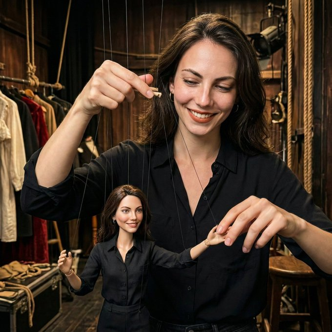
</div>

**提示词：**
```
ekteki kişi, bir tiyatro kulisinde kendisinin kopya kuklasını (marionette) parmaklarıyla hareket ettiriyor.
```

**中文提示词：**
```
附图中的人正在剧院的化妆间里用手指操纵自己的复制品（木偶）。
```

<a id="prompt-916"></a>
## 案例 916：高端影棚肖像照 (来源 [@AIwithkhan](https://x.com/AIwithkhan/status/2001685648768680052)) 模型：Nano banana pro

<div style="display: flex; justify-content: space-between;">
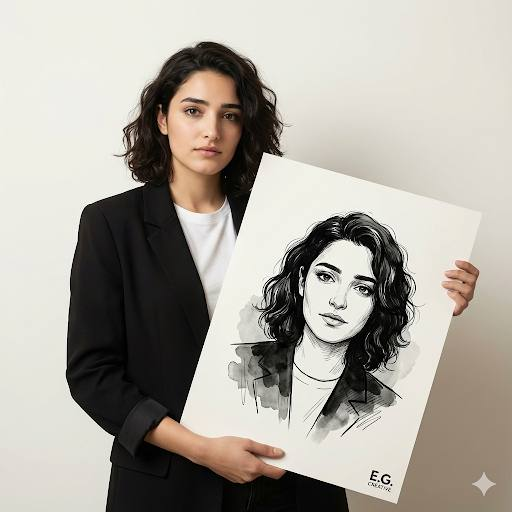
</div>

**提示词：**
```
A high-end studio portrait using the uploaded photo as the main subject. The person stands confidently against a clean, minimal background in soft neutral tones, holding a large vertical poster in front of them. The poster features an artistic reinterpretation of the same uploaded photo — stylized as a digital illustration, sketch, or painterly artwork — clearly recognizable as the same face. Professional studio lighting with a soft key light and subtle rim light creates gentle shadows and depth. The subject’s expression is calm and confident, body posture relaxed yet strong, evoking a modern personal brand identity. Clean composition, balanced framing, premium editorial aesthetic, shallow depth of field, ultra-realistic skin texture, crisp details, contemporary creator branding vibe, cinematic realism, 1:1 aspect ratio, high resolution.
```

**中文提示词：**
```
这是一张以上传照片为主体的高端影棚肖像照。照片中的人物自信地站在简洁的中性色调背景前，手持一张大幅竖版海报。海报上是对同一张照片的艺术化重新诠释——风格化为数字插画、素描或绘画作品——清晰地展现了同一张面孔。专业的影棚灯光，柔和的主光和微妙的轮廓光营造出柔和的阴影和层次感。人物表情沉稳自信，身姿放松而有力，展现出现代个人品牌形象。构图简洁，取景均衡，呈现高端时尚美感，浅景深，肌肤纹理逼真，细节清晰，散发出当代创作者的品牌气息，兼具电影般的真实感，1:1宽高比，高分辨率。
```

<a id="prompt-915"></a>
## 案例 915：照片转换成漫画 (来源 [@ecommartinez](https://x.com/ecommartinez/status/2001689993778249952)) 模型：Nano banana pro

<div style="display: flex; justify-content: space-between;">
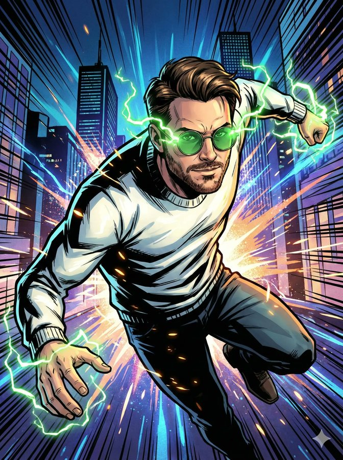
</div>

**提示词：**
```
Crea una ilustración de cómic moderno usando mi imagen de referencia como personaje principal.
Estilo inspirado en los cómics de superhéroes contemporáneos y novelas gráficas cinematográficas.
El personaje mantiene los rasgos faciales exactos y su identidad de la foto de referencia, transformados en un estilo cómic estilizado con líneas limpias pero expresivas.
Añade contornos negros marcados, sombreado dinámico con tinta y colores de alto contraste.
Aplica efectos FX como energía brillante, chispas, estelas de movimiento, haces de luz y partículas sutiles para aumentar la acción y la intensidad.
Usa una pose de acción dinámica o una postura poderosa, con perspectiva exagerada y ángulos dramáticos.
El fondo debe ser gráfico y cinematográfico: formas urbanas abstractas, líneas de velocidad o explosiones de energía, sin distraer del personaje.
La iluminación es dramática, con luces y sombras fuertes para dar profundidad e impacto.
Estilo final: portada de cómic moderno de alta calidad, detalles nítidos, colores vibrantes, composición enérgica, ilustración profesional, impacto visual fuerte.
No cambies el rostro, solo estilízalo.
```

**中文提示词：**
```
请以我的参考图为主角，创作一幅现代漫画插画。
风格灵感源自当代超级英雄漫画和电影图像小说。
该角色保留了参考照片中的精确面部特征和身份，并被转化为线条简洁但富有表现力的风格化漫画风格。
它增加了清晰的黑色轮廓、动态的墨迹阴影和高对比度的颜色。
应用诸如明亮能量、火花、运动轨迹、光束和细微粒子等特效，以增强动作和强度。
采用动态动作姿势或有力的站姿，并运用夸张的透视和戏剧性的角度。
背景应具有图形感和电影感：抽象的城市形状、速度线条或能量爆发，但不要分散对角色的注意力。
灯光效果极佳，强烈的明暗对比营造出深度和冲击力。
最终风格：高质量的现代漫画封面，细节清晰，色彩鲜艳，构图充满活力，插图专业，视觉冲击力强。
不要改变你的容貌，只需进行一些风格上的修饰。
```

<a id="prompt-914"></a>
## 案例 914：复古风格照相亭 (来源 [@miilesus](https://x.com/miilesus/status/2001734583830626635)) 模型：Nano banana pro

<div style="display: flex; justify-content: space-between;">
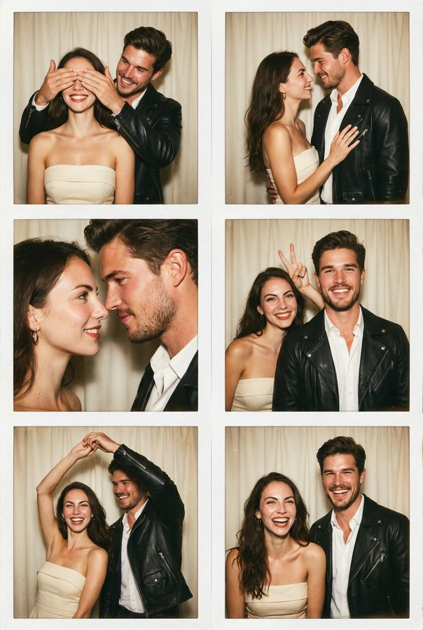
</div>

**提示词：**
```
Create a realistic vintage-style photo booth / Polaroid photo collage featuring the same couple, using the two uploaded images as exact face references for both individuals (preserve both identities accurately).
The couple appears natural, affectionate, and playful, captured in multiple candid moments as if taken inside a photo booth. The woman and the man maintain their original facial features, skin tones, and expressions.
Woman: elegant, feminine, glowing skin, natural makeup, soft blush, glossy lips, long dark hair styled loosely with gentle volume. Wearing a minimal strapless cream or light beige dress.
Man: clean and handsome appearance, short dark hair, light stubble or clean-shaven, wearing a black leather jacket over a white shirt
Scenes & poses included in the collage:
The woman smiling brightly while the man stands behind her playfully covering her eyes.
The couple standing close, facing each other lovingly, her hand resting on his chest.
A close face-to-face moment with soft smiles and eye contact.
The woman standing behind the man, making a peace sign while smiling at the camera.
A playful dancing pose where the man lifts one of the woman’s hands as if spinning her.
A relaxed, candid moment where both laugh naturally at the camera.
Environment: neutral photo booth backdrop with soft vertical curtains, warm indoor lighting, subtle shadows, cozy and intimate atmosphere.
Photography style: vintage Polaroid / analog photo booth aesthetic, slightly soft focus, gentle grain, mild blur, natural imperfections, warm tones, realistic skin texture.
Lighting: soft frontal flash combined with ambient light, creating a casual, real-life snapshot feeling.
Mood & vibe: romantic, playful, spontaneous, intimate, youthful, nostalgic.
Composition: multi-frame vertical collage, evenly spaced images, authentic photo booth layout.
Quality: high realism, not AI-looking, natural proportions, no distortion.
```

**中文提示词：**
```
使用上传的两张照片作为两人的面部参考，制作一张逼真的复古风格照相亭/宝丽来照片拼贴画，照片中的人物为同一对情侣（准确保留两人的身份）。
这对情侣看起来自然、亲密又充满活力，多张抓拍照片仿佛是在照相亭里拍摄的。男女双方都保留了原本的面部特征、肤色和表情。
女士：优雅妩媚，肌肤散发光泽，妆容自然，腮红轻柔，双唇水润，一头乌黑长发随意披散，略带蓬松感。身着简约的米色或浅米色抹胸连衣裙。
男士：外表干净英俊，短黑发，留着淡淡的胡茬或刮得干干净净，身穿黑色皮夹克，内搭白色衬衫。
拼贴画中包含的场景和姿势：
女人笑容灿烂，男人站在她身后，顽皮地捂住了她的眼睛。
这对情侣站得很近，彼此深情地对视着，她的手放在他的胸口。
面对面的亲密时刻，带着柔和的微笑和眼神交流。
站在男子身后的女子对着镜头微笑，并比出和平手势。
一个俏皮的舞蹈姿势，男子抬起女子的一只手，仿佛要将她旋转起来。
轻松自然的瞬间，两人对着镜头自然地笑了起来。
环境：中性风格的拍照背景，搭配柔和的垂直窗帘、温暖的室内灯光、微妙的光影，营造出温馨私密的氛围。
摄影风格：复古宝丽来/模拟照相亭美学，略微柔焦，轻微颗粒感，轻微模糊，自然瑕疵，暖色调，逼真的皮肤纹理。
光线：柔和的正面闪光灯与环境光相结合，营造出一种随意、真实的快照感觉。
氛围：浪漫、俏皮、随性、亲密、青春、怀旧。
构图：多帧竖幅拼贴，图像间距均匀，真实的照相亭布局。
质量：高度逼真，不像人工智能生成的，比例自然，无变形。
```

<a id="prompt-913"></a>
## 案例 913：超逼真的 8K 街头抓拍肖像 (来源 [@Taaruk_](https://x.com/Taaruk_/status/2001656897699733967)) 模型：Nano banana pro

<div style="display: flex; justify-content: space-between;">
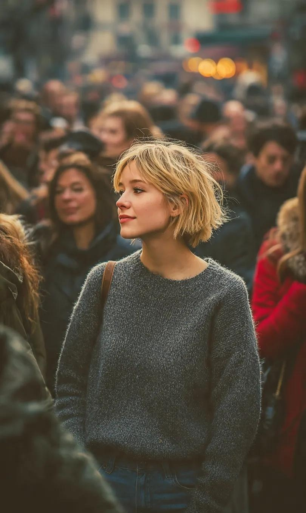
</div>

**提示词：**
```
{
  "Objective": "Create an ultra-realistic 8K candid street portrait capturing quiet emotion and authenticity within a crowded urban environment.",

  "Subject": {
    "Gender": "Female",
    "Appearance": {
      "Hair": "Short blonde hair with soft, natural texture",
      "Makeup": "Minimal, natural look",
      "Skin": {
        "Texture": "Realistic skin texture with subtle freckles",
        "Highlights": "Soft natural highlights with gentle tonal transitions"
      },
      "Expression": "Calm, thoughtful, introspective",
      "Gaze": "Looking slightly to the side, not directly at the camera"
    },
    "Wardrobe": {
      "Top": "Simple grey knitted sweater with visible fabric weave",
      "Bottom": "Casual jeans",
      "Accessories": "Thin shoulder-bag strap visible across the shoulder"
    }
  },

  "Scene_Description": {
    "Setting": "Busy city street",
    "Crowd": {
      "Density": "Surrounded by a dense flow of pedestrians",
      "Background_Treatment": "Softly blurred figures creating depth and motion"
    },
    "Environment": "Urban street atmosphere with natural movement"
  },

  "Lighting_and_Color": {
    "Lighting": {
      "Type": "Natural daylight",
      "Quality": "Soft and even, without harsh shadows"
    },
    "Color_Grading": {
      "Style": "Warm cinematic tones",
      "Characteristics": [
        "Natural skin tones",
        "Muted urban background colors",
        "Subtle film-inspired contrast"
      ]
    }
  },

  "Camera_and_Composition": {
    "Shot_Type": "Candid street portrait",
    "Depth_of_Field": "Shallow depth of field isolating the subject",
    "Focus": "Sharp focus on the subject with background crowd softly blurred",
    "Angle": "Eye-level, unobtrusive framing"
  },

  "Visual_Style": {
    "Resolution": "Ultra-realistic 8K",
    "Aesthetic": "Documentary street photography",
    "Detail_Characteristics": [
      "Sharp facial detail",
      "Natural fabric texture",
      "Soft motion blur in background",
      "Subtle film grain for realism"
    ]
  },

  "Mood_and_Storytelling": {
    "Themes": [
      "Stillness within chaos",
      "Quiet reflection",
      "Human presence in urban life"
    ],
    "Atmosphere": "Emotional, authentic, understated realism"
  },

  "Output_Requirements": {
    "Format": "Image",
    "Orientation": "Portrait or cinematic street frame",
    "Quality": "Professional documentary-grade realism"
  }
}
```

**中文提示词：**
```
{
“目标”：“在拥挤的都市环境中，捕捉安静的情感和真实感，创作一张超逼真的 8K 街头抓拍肖像。”

“主题”： {
性别：女，
“外貌”： {
“头发”：“柔软自然的短金发”，
“妆容”：“简约自然妆容”
“皮肤”： {
“纹理”：“逼真的皮肤纹理，带有细小的雀斑”，
“高光”： “柔和自然的高光，色调过渡平缓”
},
“表情”：“冷静、深思熟虑、内省”
“目光”：“略微看向一侧，而不是直视镜头”
},
“衣柜”： {
“上衣”：“简约灰色针织毛衣，织物纹理清晰可见”，
下装：休闲牛仔裤
“配饰”：“肩上露出细细的肩包肩带”
}
},

"场景描述": {
“场景”：“繁忙的城市街道”，
人群：{
“密度”：“周围人流密集”，
“背景处理”：“柔和模糊的人物形象，营造出深度和动感”
},
“环境”：“具有自然动感的都市街道氛围”
},

"照明和颜色": {
“灯光”： {
“类型”：“自然日光”，
“品质”：“柔和均匀，无生硬阴影”
},
"Color_Grading": {
风格：温暖的电影色调
“特征”： [
“自然肤色”
“柔和的城市背景色彩”，
“微妙的胶片风格对比”
]
}
},

“相机与构图”：{
"Shot_Type": "街头抓拍肖像",
“景深”： “浅景深突出主体”，
“焦点”：“主体清晰对焦，背景人群柔和虚化”，
“角度”：“视线水平，不显眼的构图”
},

"视觉样式": {
“分辨率”：“超逼真 8K”，
“美学”：“纪实街头摄影”，
"Detail_Characteristics": [
“面部细节清晰”，
“天然面料质感”
“背景呈现柔和的动态模糊效果”
“细腻的胶片颗粒感，营造真实感”
]
},

"情绪与故事讲述": {
“主题”：[
“混乱中的平静”
“静静地思考”，
“人类在城市生活中的存在”
],
“氛围”：“情感丰富、真实、含蓄的现实主义”
},

"输出要求": {
"格式": "图像",
“方向”：“竖幅或电影街景构图”，
“质量”：“专业纪录片级别的真实感”
}
}
```

<a id="prompt-912"></a>
## 案例 912：垂直三格拼贴画 (来源 [@lexx_aura](https://x.com/lexx_aura/status/2001886993836343775)) 模型：Nano banana pro

<div style="display: flex; justify-content: space-between;">
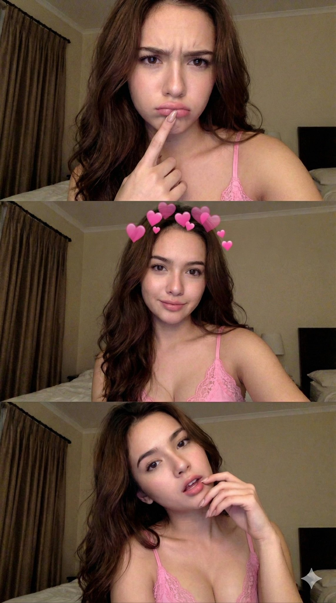
</div>

**提示词：**
```
{
  "image_structure": {
    "layout": "Vertical three-panel collage",
    "aspect_ratio": "Tall vertical strip",
    "shot_type": "Close-up selfies"
  },
  "subject_details": {
    "demographics": "Young woman with long, wavy brunette hair",
    "skin": "Natural skin texture, minimal or no makeup",
    "clothing": "Pink lace-trimmed bralette or camisole top with thin spaghetti straps",
    "accessories": "Long manicured nails (nude/pale pink color)"
  },
  "environment": {
    "setting": "Dimly lit bedroom or hotel room interior",
    "background_elements": [
      "Beige/cream colored walls",
      "Heavy brown curtains on the left side",
      "Partial view of a bed headboard in the background"
    ]
  },
  "lighting_and_style": {
    "lighting": "Warm, indoor artificial lighting, low-light conditions",
    "aesthetic": "Candid selfie style, slightly grainy phone camera quality, early 2010s social media aesthetic, flash photography look",
    "mood": "Casual, intimate, playful"
  },
  "panel_breakdown": {
    "top_panel": {
      "expression": "Pouting or confused, eyebrows slightly furrowed",
      "pose": "Finger hooked over bottom lip, looking directly at camera"
    },
    "middle_panel": {
      "expression": "Soft smile, looking directly at camera",
      "overlay_effect": "Digital pink heart crown filter (Snapchat style) floating around the head"
    },
    "bottom_panel": {
      "expression": "Relaxed, mouth slightly open, gazing at camera",
      "pose": "Head tilted to the side, hand gently touching chin and lower lip"
    }
  }
}
```

**中文提示词：**
```
{
"image_structure": {
“布局”：“垂直三格拼贴画”，
"aspect_ratio": "高竖条",
"shot_type": "特写自拍"
},
"subject_details": {
“人口统计信息”：“年轻女性，留着长长的棕色波浪卷发”，
“肌肤”: “自然肌肤纹理，几乎不化妆”
“服装”：“粉色蕾丝边吊带文胸或吊带背心”，
“配饰”： “修剪整齐的长指甲（裸色/浅粉色）”
},
“环境”： {
“场景”：“光线昏暗的卧室或酒店房间内部”，
“背景元素”：[
“米色/奶油色墙壁”，
“左侧是厚重的棕色窗帘，”
“背景中可以看到床头板的一部分”
]
},
"lighting_and_style": {
“照明”：“温暖的室内人工照明，光线较暗的环境”，
“美学”：“随意的自拍风格，略带颗粒感的手机相机画质，2010 年代初期的社交媒体美学，闪光灯摄影效果”，
“氛围”： “轻松、亲密、俏皮”
},
"panel_breakdown": {
"top_panel": {
“表情”：“撅嘴或困惑，眉毛微微皱起”，
姿势：“手指勾住下唇，直视镜头”
},
"middle_panel": {
“表情”：“柔和的微笑，直视镜头”
"overlay_effect": "粉色爱心皇冠滤镜（Snapchat风格）漂浮在头部周围"
},
"bottom_panel": {
“表情”：“放松，嘴巴微张，凝视着镜头”
“姿势”：“头部侧倾，手轻轻触碰下巴和下唇”
}
}
}
```

<a id="prompt-911"></a>
## 案例 911：36 个穿着同一套衣服的不同人像 (来源 [@gokayfem](https://x.com/gokayfem/status/2001680146252669084)) 模型：Nano banana pro

<div style="display: flex; justify-content: space-between;">
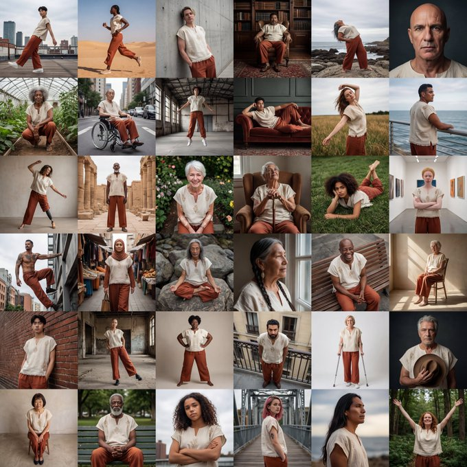
</div>

**提示词：**
```
6x6 grid layout. Editorial fashion photography. Use the reference clothing item on all 36 models. Every single cell must feature a completely unique individual—no two people should look remotely similar.
Maximize human diversity across:
Age: Teenagers, 20s, 30s, 40s, 50s, 60s, 70s, 80s+, elderly with wrinkles and grey hair
Body types: Extremely thin, slim, athletic, muscular, stocky, chubby, fat, plus-size, obese, petite, tall, short, broad-shouldered, narrow-framed, pear-shaped, apple-shaped, hourglass, rectangular, long-limbed, short-limbed.
Ethnicity & skin tones: East Asian, Southeast Asian, South Asian, Middle Eastern, North African, Sub-Saharan African, West African, East African, Indigenous Australian, Pacific Islander, Native American, Indigenous South American, Scandinavian, Mediterranean, Eastern European, Western European, Caribbean, mixed race, albino. Full spectrum of skin tones from the palest to the deepest.
Hair: Bald, shaved, buzz cut, afro, locs, braids, straight, wavy, curly, coily, long, short, grey, white, natural colors, receding hairline, thinning hair, thick full hair, hijab, head wraps, turbans.
Features: Freckles, vitiligo, acne, scars, birthmarks, moles, gap teeth, crooked teeth, big nose, small nose, wide nose, narrow nose, round face, angular face, soft jawline, strong jawline, monolid eyes, deep-set eyes, hooded eyes, big lips, thin lips, visible disabilities, prosthetics, wheelchair users, amputees.
Each cell: different pose, different camera angle. Poses should feel editorial and unexpected—leaning, crouching, mid-stride, arched, sprawled, seated, jumping, twisting, lounging. Camera angles vary—low angle, overhead, Dutch tilt, wide shot, tight crop, ground-level, profile, three-quarter view.
Moody, high contrast, cinematic lighting. Varied environments—studio, architectural, urban, natural. Sharp detail, clothing as focal point. Final result should feel like the most inclusive, human-rich fashion editorial ever created—a true celebration of every single type of human body that exists.
```

**中文提示词：**
```
6x6网格布局。时尚摄影。所有36位模特均需穿着同一件参考服装。每个单元格中的模特必须完全不同——任何两个人都不能有任何相似之处。
最大限度地提高人类多样性：
年龄：青少年、20多岁、30多岁、40多岁、50多岁、60多岁、70多岁、80岁以上、有皱纹和白发的老年人
体型：极瘦、苗条、健壮、肌肉发达、敦实、丰满、肥胖、大码、肥胖、娇小、高挑、矮小、肩宽、骨架窄、梨形、苹果形、沙漏形、矩形、四肢长、四肢短。
种族与肤色：东亚人、东南亚人、南亚人、中东人、北非人、撒哈拉以南非洲人、西非人、东非人、澳大利亚原住民、太平洋岛民、美洲原住民、南美原住民、斯堪的纳维亚人、地中海人、东欧人、西欧人、加勒比人、混血儿、白化病患者。涵盖从最浅到最深的各种肤色。
头发：光头、剃光头、寸头、爆炸头、脏辫、辫子、直发、波浪卷发、卷发、螺旋卷发、长发、短发、灰发、白发、自然发色、发际线后移、头发稀疏、浓密头发、头巾、头巾、头巾。
特征：雀斑、白癜风、痤疮、疤痕、胎记、痣、牙缝、牙齿歪斜、大鼻子、小鼻子、宽鼻子、窄鼻子、圆脸、棱角分明的脸、柔和的下颌线、硬朗的下颌线、单眼皮、深陷眼窝、眼睑下垂、厚嘴唇、薄嘴唇、明显的残疾、假肢、轮椅使用者、截肢者。
每个单元格：不同的姿势，不同的拍摄角度。姿势应具有编辑感和出人意料的特质——倾斜、蹲伏、迈步、拱背、伸展、坐姿、跳跃、扭转、慵懒。拍摄角度也多种多样——低角度、俯视、倾斜镜头、广角镜头、特写镜头、地面视角、侧面视角、四分之三侧面视角。
营造氛围感，运用高对比度的电影级灯光。场景多样——包括摄影棚、建筑、都市和自然环境。注重细节刻画，以服装为视觉焦点。最终呈现的作品应展现出前所未有的包容性和人文关怀，真正赞美每一种人体形态。
```

<a id="prompt-910"></a>
## 案例 910：女生四宫格照片 (来源 [@lexx_aura](https://x.com/lexx_aura/status/2001653710745739419)) 模型：Nano banana pro

<div style="display: flex; justify-content: space-between;">
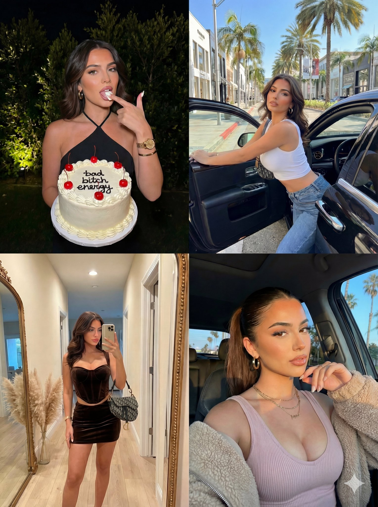
</div>

**提示词：**
```
{
  "image_layout": "2x2 grid collage featuring four distinct photographs of the same female subject.",
  "subject_general": {
    "gender": "Female",
    "hair_color": "Dark brown/black",
    "hair_style": "Long, styled in loose waves in three panels; sleek high ponytail in one panel",
    "aesthetic": "Glamorous, influencer, trendy, luxury lifestyle"
  },
  "panels": [
    {
      "position": "top_left",
      "setting": "Outdoors at night, dark background with illuminated green foliage",
      "action": "Subject is holding a cake with one hand and licking frosting off the index finger of the other hand",
      "outfit": {
        "top": "Black halter-neck sleeveless top",
        "jewelry": "Gold wristwatch, gold bangle bracelet, ring, small hoop earrings"
      },
      "props": {
        "item": "Round white frosted cake",
        "details": [
          "Red cherries on top",
          "Decorative white piping along edges",
          "Black icing text reading 'bad bitch energy'"
        ]
      }
    },
    {
      "position": "top_right",
      "setting": "Daytime city street, likely an upscale shopping district (e.g., Rodeo Drive) with palm trees and storefronts visible",
      "action": "Subject is leaning out of the open door of a black luxury car, looking at the camera",
      "outfit": {
        "top": "White sleeveless ribbed crop top",
        "bottom": "Blue denim jeans",
        "accessories": "Shoulder bag (strap visible), gold hoop earrings"
      },
      "lighting": "Bright natural sunlight casting shadows"
    },
    {
      "position": "bottom_left",
      "setting": "Indoor hallway, beige walls, wooden floor",
      "action": "Full-body mirror selfie",
      "outfit": {
        "style": "Matching two-piece set",
        "color": "Dark brown/chocolate",
        "top": "Velvet/suede corset-style bustier top",
        "bottom": "Mini skirt",
        "accessories": "Patterned designer handbag (resembling Dior Saddle bag), stack of gold bracelets"
      },
      "background_details": [
        "Large rectangular mirror with gold frame leaning against wall",
        "Vase with pampas grass in the corner",
        "Doorway visible in reflection"
      ]
    },
    {
      "position": "bottom_right",
      "setting": "Inside a vehicle or outdoors, golden hour sunlight",
      "action": "Close-up selfie, hand raised near mouth/chin",
      "outfit": {
        "top": "Light pink/mauve ribbed tank top",
        "outerwear": "Beige fuzzy/sherpa jacket worn off-the-shoulder",
        "jewelry": "Layered gold necklaces with pendants, hoop earrings"
      },
      "hair_styling": "Sleeked back high ponytail",
      "background_details": "Car window frame, palm trees and blue sky visible in background"
    }
  ]
}
```

**中文提示词：**
```
{
"image_layout": "2x2 网格拼贴，包含同一女性对象的四张不同照片。"
"subject_general": {
"性别": "女",
"hair_color": "深棕色/黑色",
"发型": "长发，分成三片，烫成蓬松的波浪卷；一片，扎成光滑的高马尾辫",
“美学”： “魅力四射、网红、潮流、奢华生活方式”
},
“面板”：[
{
"位置": "左上",
“场景”：“夜晚的户外，深色背景，绿色树叶在灯光下闪烁”，
“动作”：“受试者一手拿着蛋糕，另一只手的食指正在舔掉上面的糖霜”，
“全套服装”： {
“上衣”： “黑色露背无袖上衣”，
“珠宝”：金手表、金手镯、戒指、小耳环
},
"props": {
“商品”: “圆形白色糖霜蛋糕”
“细节”： [
“上面放些红樱桃”，
“边缘饰有白色滚边”，
“黑色糖霜上写着‘坏女孩能量’”
]
}
},
{
"位置": "右上角",
“场景”：“白天的城市街道，可能是一个高档购物区（例如罗迪欧大道），可以看到棕榈树和商店橱窗”，
“动作”：“拍摄对象从一辆黑色豪华轿车的敞开车门探出身子，看着镜头”。
“全套服装”： {
“上衣”：“白色无袖罗纹露脐上衣”，
“底部”：“蓝色牛仔裤”，
配饰：单肩包（肩带可见）、金色圆环耳环
},
“光线”：“明亮的自然阳光投射出阴影”
},
{
"位置": "左下角",
“场景”：“室内走廊，米色墙壁，木地板”，
“动作”：“全身镜前自拍”，
“全套服装”： {
“款式”：“配套两件套”
颜色：深棕色/巧克力色，
“上衣”：天鹅绒/麂皮紧身胸衣式上衣，
“下装”: “迷你裙”，
“配饰”：“图案名牌手提包（类似迪奥马鞍包），一叠金手镯”
},
"background_details": [
“一面金色边框的大长方形镜子斜靠在墙上”
“花瓶角落里放着蒲苇草”
“倒影中可见门口”
]
},
{
"位置": "右下角",
“场景”：“车内或室外，日落时的金色阳光”，
“动作”：“近距离自拍，手举到嘴/下巴附近”，
“全套服装”： {
上衣：浅粉色/淡紫色罗纹背心，
“外套”：“米色毛绒/羊羔绒夹克，露肩穿着”，
“珠宝”：“多层金项链配吊坠，圈形耳环”
},
"发型"："光滑的高马尾辫",
"background_details": "背景中可以看到车窗框、棕榈树和蓝天"
}
]
}
```

<a id="prompt-909"></a>
## 案例 909：精美杂志上的文章照片 (来源 [@NanoBanana](https://x.com/NanoBanana/status/2001678061662531590)) 模型：Nano banana pro

<div style="display: flex; justify-content: space-between;">
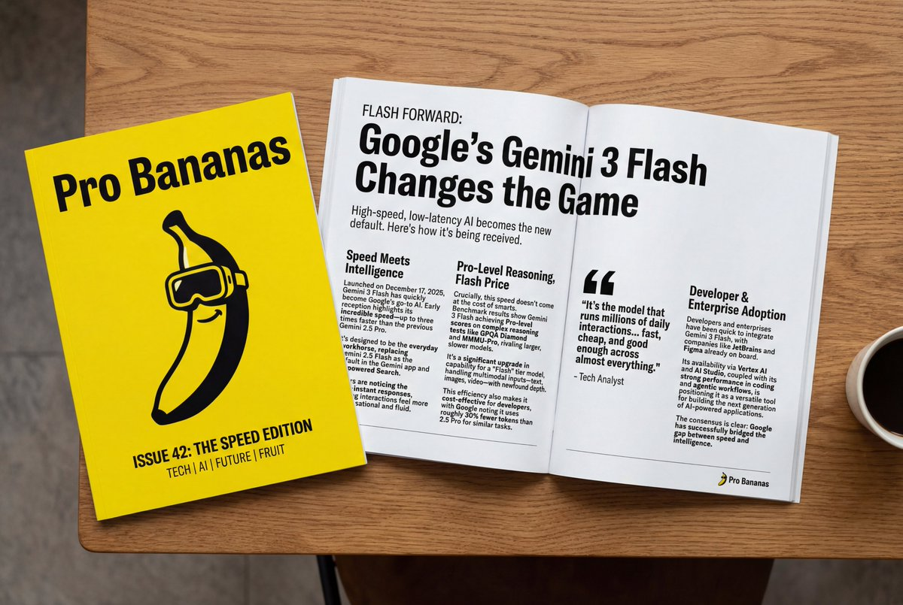
</div>

**提示词：**
```
Use search to find how the Gemini 3 Flash launch has been received. Use this information to write a short article about it (with headings). Return a photo of the article as it appeared in a glossy magazine. Show the magazine cover (Pro Bananas), and the two page spread of the article about Gemini 3 Flash.
```

**中文提示词：**
```
使用搜索功能查找“Gemini 3 Flash”发布的反响。利用这些信息撰写一篇关于此次发射的短文（需包含标题）。提交一篇刊登在精美杂志上的文章照片。请展示杂志封面（Pro Bananas）以及关于“Gemini 3 Flash”的两页文章。
```

<a id="prompt-908"></a>
## 案例 908：标本盒与现实的穿搭美学双重奏 (来源 [@LufzzLiz](https://x.com/LufzzLiz/status/2001831802269499412)) 模型：Nano banana pro

<div style="display: flex; justify-content: space-between;">
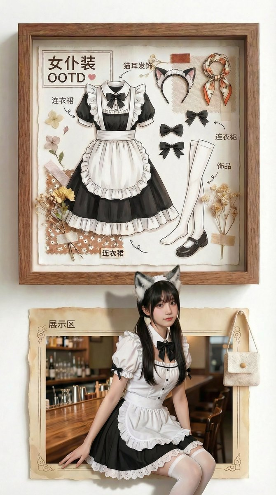
</div>

**提示词：**
```
A vertical split-screen creative product photography composition on a clean white wall background. High-resolution, photorealistic, commercial advertisement quality.

Top Section: The Specimen Box
The upper half features an exquisite light oak wooden shadow box frame mounted on the wall. Inside, a specific outfit is displayed as an artistic flat-lay museum specimen: [Insert Clothing Details Here, e.g., a sleek black satin slip dress with delicate lace trim and thin spaghetti straps]. The garments are neatly pinned in place. Surrounding them are small thematic decorative props: [Insert Props, e.g., dried roses, vintage perfume bottles, silk ribbon]. Elegant calligraphy on the matte paper backdrop reads: [Insert Text, e.g., "Midnight Elegance" or "Silk & Secrets"]. Soft studio lighting accentuates the rich texture and drape of the fabric.

Bottom Section: Naked-Eye 3D Reality
The lower half creates a hyperrealistic "naked-eye 3D" illusion. A rectangular picture-frame border sits directly beneath the top box. A stunningly realistic young woman [Insert Model Description, e.g., a poised East Asian model with long wavy black hair, subtle smoky eyes, and a confident gaze] wears the exact same outfit as shown above.

She lounges casually on the bottom edge of the frame—one leg bent with foot resting inside the frame, the other leg elegantly dangling out into the viewer’s space. Her torso leans back slightly, elbow resting on her raised knee, fingers lightly grazing the fabric near her collarbone. Her body forms a soft, sensual S-curve that highlights the garment’s silhouette without overt exposure. She looks directly at the camera with a calm, knowing smile—inviting yet enigmatic. This dynamic, lifelike pose contrasts powerfully with the static, archival display above, creating visual tension between reality and presentation.

Technical Specs:
Soft natural shadows, ambient occlusion, bright and airy yet cinematic lighting, 8K resolution, Octane Render, vivid but refined color palette, ultra-detailed fabric textures (satin sheen, lace transparency, stitching), shallow depth of field, Vogue editorial style, filmic grain, professional fashion photography.

Negative Prompt (recommended):
blurry, low-res, distorted anatomy, extra limbs, deformed hands, cartoon, anime, doll-like, plastic skin, overexposed, cluttered background, text errors, mismatched clothing, floating objects, unrealistic proportions.
参考人物，想看老师制服
```

<a id="prompt-907"></a>
## 案例 907：剪纸艺术 (来源 [@berryxia](https://x.com/berryxia/status/2002015301618294794)) 模型：Nano banana pro

<div style="display: flex; justify-content: space-between;">
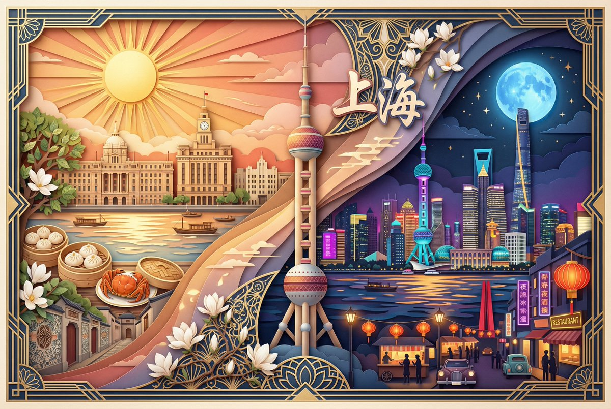
</div>

**中文提示词：**
```
Paper cut layered art: [城市名称英文] ([城市名称本地语言]) day-night elegant diagonal split (top-left→bottom-right) with soft artistic transition.
Core: ONE [标志性地标建筑] bisected diagonally with elegant gradient - warm golden tones (day side: orange, peach, coral, amber, [特色暖色]) / cool tones with rich warm lights (night side: navy, purple, midnight blue, with abundant yellow windows, red lanterns, vibrant [特色]accents).
CRITICAL AESTHETIC REQUIREMENTS:
- Beautiful, visually stunning composition
- Rich details and intricate paper cut patterns
- Elegant color harmony with [城市文化] aesthetics
- Sophisticated [文化特色] decorative elements
- High artistic value with refined craftsmanship
Text: "[城市名称文字]" in beautiful [语言类型] calligraphy/typography, split by diagonal with elegant transition, surrounded by exquisite [本地装饰图案1], [本地装饰图案2], and [本地装饰图案3], strong dimensional depth with layered shadow effects.
Day side (left/top): Brilliant golden sun with radiating warm rays, gorgeous warm amber/peach/coral sky with [特色氛围描述], [城市气质] sophisticated atmosphere. Beautiful daytime elements - [特色美食1] with [细节描述], [特色美食2] with [呈现方式], [特色美食3] with [艺术呈现], [其他美食]; stunning [代表性植物1] with detailed [部位] in rich [颜色], [代表性植物2] with [特征描述]; magnificent [地理特征] in bright [颜色] reflection with [细节]; [标志性建筑/场景1] with ornate details glowing in sunlight, [特色街景/场景] with refined [细节], [文化活动场景] with [描述].
Diagonal transition: Soft gradient with twilight beauty - [过渡色1], [过渡色2], [过渡色3], [过渡色4], [过渡色5] - creating elegant natural flow [体现城市特色的过渡描述].
Night side (right/bottom): Gorgeous blue/silver moon with ethereal glow and sparkling stars, rich deep navy and midnight blue sky with beautiful depth. Spectacular nighttime atmosphere with abundant warm light sources creating magical [文化特色] ambiance - numerous glowing yellow windows/lights creating patterns, elegant orange street lamps [位置描述], beautiful traditional red lanterns [场景描述], stunning purple-magenta [特色灯光], brilliant cyan-teal [地标灯光], golden light from [场所] glows, rich amber reflections [位置]. Night elements - dazzling illuminated [夜间地标1] with [效果], magnificent glowing [夜间地标2], charming [夜间场景] with [氛围], vibrant [夜生活描述].
Unified elements (each appears once with elegant transition): [主要地标1] showing beautiful gradient from day to night, [主要地标2] with [细节], [地理特征] with [变化描述], [建筑群] with [风格描述], [植物] with natural beauty, [交通工具], [文化符号] with [装饰], harmonious blend of [传统特色] and [现代特色].
Craft technique: 10-12 distinct paper layers with EXTREME pronounced depth and dimension, very thick visible edges (4-6mm thickness showing dimension), dramatic shadows creating powerful 3D sculptural relief effect, each element shows intricate multi-layer construction with refined details, ornate [文化特色] decorative patterns throughout ([图案1], [图案2], [图案3]), side-lighting creating stunning dimensional effect [强调特色].
Format: landscape orientation, no border, no frame, elegant soft diagonal transition (clear enough to show duality but refined and artistic), sophisticated visual balance, BEAUTIFUL and STUNNING overall aesthetic capturing [城市特色].
The artwork should be visually gorgeous, [气质形容词1], [气质形容词2] - capturing [城市核心特质描述].

 {以此风格展示绘制梵高的人物展示，使用4K输出 9:16 周五就是与梵高相关的元素}
```

<a id="prompt-906"></a>
## 案例 906：和影视剧中人物自拍 (来源 [@xmiiru_](https://x.com/xmiiru_/status/2001935712275267952)) 模型：Nano banana pro

<div style="display: flex; justify-content: space-between;">
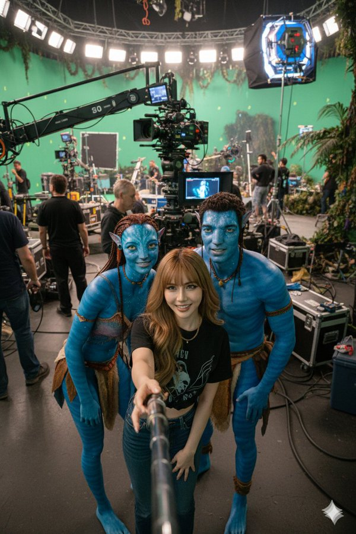
</div>

**提示词：**
```
Create a realistic first-person POV selfie as if the camera is my own eyes using a phone’s front-facing camera. The phone, my hands, and my arms must NOT be visible in the frame. Use the uploaded image as my identity reference and keep my face recognizable through perspective consistency. I am not part of the cast I’m a guest on set wearing modern, casual real-world clothing that does not match the actors’ wardrobe. The actors are aware of the selfie, standing very close to me, leaning in naturally, and looking directly into the camera as if pausing for a quick friendly shot between takes. 

The framing should feel intimate and face-level, with actors filling the foreground. The background must clearly show a believable behind-the-scenes film set with cameras, crew, lighting rigs, monitors, and equipment. The image should feel candid, unpolished, and spontaneous. 

Place me inside: [MOVIE OR TV SHOW NAME] (optional: cast members)
```

**中文提示词：**
```
请使用手机前置摄像头，拍摄一张逼真的第一人称视角自拍，就像用自己的眼睛拍摄一样。手机、我的手和手臂都不能出现在画面中。请使用上传的图片作为我的身份参考，并通过保持视角一致来确保我的脸部清晰可辨。我不是剧组成员，而是片场的客串演员，穿着与演员服装不同的现代休闲日常服装。演员们知道我在自拍，他们会站在我旁边，自然地靠近我，并直视镜头，就像在拍摄间隙和我友好地拍张合照一样。

构图应营造亲密感，采用平视视角，演员占据前景。背景必须清晰展现一个可信的幕后拍摄现场，包括摄像机、工作人员、灯光设备、监视器和器材。画面应给人一种自然、未经修饰、随意的感觉。

请将我放入：[电影或电视剧名称]（可选：演员表）
```

<a id="prompt-905"></a>
## 案例 905：用中国奇幻书写世界名画 (来源 [@LufzzLiz](https://x.com/LufzzLiz/status/2001637740568596705)) 模型：Nano banana pro

<div style="display: flex; justify-content: space-between;">
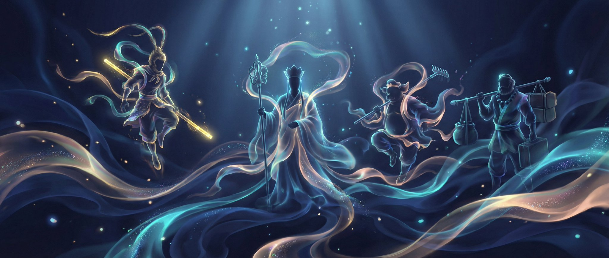
</div>

**提示词：**
```
{
  "meta_info": {
    "title": "Ethereal Hanfu Spirit",
    "style_category": "Chinese Fantasy / Abstract Digital Art",
    "aspect_ratio": "3:1"
  },
  "visual_elements": {
    "subject": {
      "description": "Silhouette wearing attire determined by the character",
      "pose": "Pose determined by the character, floating in mid-air",
      "composition": "Centered ethereal figure with flowing trails extending to the sides"
    },
    "atmosphere": {
      "lighting": "Bioluminescent glow, volumetric lighting, rim lighting",
      "effects": "Flowing smoke, light particles, holographic dispersion, silk-like energy trails",
      "colors": ["Deep Navy Blue", "Glowing Cyan", "Iridescent Gold", "Soft Peach"]
    }
  },
  "prompt_export": {
    "natural_language_prompt": "A wide panoramic digital artwork depicting a figure composed of flowing ribbons of light, translucent smoke, and iridescent particles. The background features deep, moody indigo and dark blue tones. The figure emits a soft, magical bioluminescent glow in hues of gold, peach, and cyan. The overall style is abstract fantasy, emphasizing fluid motion and a dreamy atmosphere, rendered in 8K resolution with highly detailed textures and exhibiting the Tyndall effect.",
    "tag_based_prompt": " silhouette, flowing light lines, smoke effects, particle effects, bioluminescence, iridescent effects, dark blue background, cinematic lighting, ethereal, mystical, masterpiece, best quality, 8k, wide angle --ay 21:9 ",
    "negative_prompt": "photorealistic, solid skin, heavy outlines, messy lines, text, watermark, low quality, jpeg artifacts, blurry, distorted face, bad anatomy"
  },
  "technical_settings_recommendation": {
    "sampler": "Euler a / DPM++ 2M Karras",
    "steps": 30,
    "cfg_scale": 7.0,
    "model_suggestion": "Niji 6 (for Midjourney) or Abstract/Fantasy-based SDXL models"
  }
}
角色设为： 西游记师徒四人
```

<a id="prompt-904"></a>
## 案例 904：维多利亚哥特皇室写真照 (来源 [@songguoxiansen](https://x.com/Lee06253046/status/2001828831615946768)) 模型：Nano banana pro

<div style="display: flex; justify-content: space-between;">
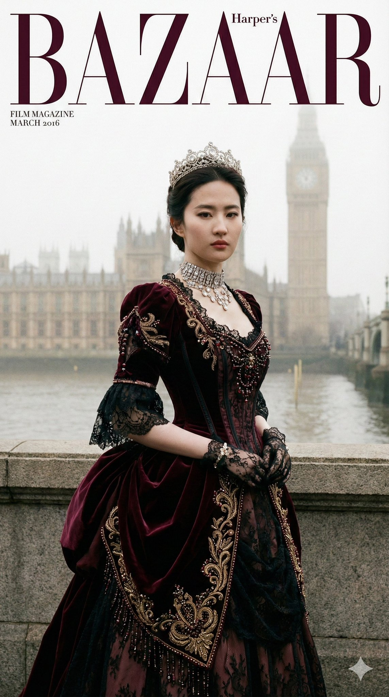
</div>

**中文提示词：**
```
生成一张 9:16 竖版「维多利亚哥特皇室」写实照片：以我上传的 FACE_REF 为人物身份参考，100%还原五官与骨相；人物身穿“维多利亚时代（19世纪）宫廷礼服方向”的重工礼服（紧身胸衣、大裙撑、蕾丝/天鹅绒、皇室珠宝），在伦敦塔桥或威斯敏斯特宫（大本钟）旁拍摄。画面具备《Harper’s Bazaar》级别的摄影、造型与封面设计，保持杂志的一贯设计风格（中英文设计）。

【INPUTS | 输入】
FACE_REF：我上传的人物五官参考图（身份锁定）

【ABSOLUTE PRIORITY | 身份锁定（最高优先级）】
100%还原 FACE_REF 的五官与骨相：眼距、鼻梁鼻翼、唇形、下颌线、颧骨结构完全一致，不得漂移。
真实皮肤质感：可见细微纹理与毛孔，不要过度磨皮与网红化。
成年女性形象（adult）。

【SHOT TYPE | 景别二选一（由模型随机选其一，且必须真实统一）】
A) 半身封面：胸口到腰上方，珠宝、蕾丝领口与眼神最清晰（主推）
B) 全身封面：从头到脚完整呈现巨大的裙撑轮廓与伦敦地标的结合，透视感强（备选）
（无论A/B：都必须保持“封面构图”，有留白空间给排版，但不要撕纸/手绘效果。）

【LOCATION | 场景（英国伦敦）】
伦敦地标：泰晤士河畔，背景是宏伟的哥特式建筑威斯敏斯特宫（大本钟）或 伦敦塔桥的塔楼。
天气二选一（随机）：1) 伦敦雾霭（经典的雾都质感，光线柔和神秘） 2) 阴雨方歇（地面湿润反光，天空呈铅灰色）
背景干净：无游客、无现代标识、无手机状态栏UI、无水印字幕。

【LIGHTING & CAMERA | 摄影质感（杂志级）】
镜头感：85mm人像质感（半身）或 50mm/70mm（全身），浅景深，眼睛最清晰。
光线：阴天漫射光 + 戏剧性补光（强调面部结构）；钻石/宝石有真实火彩；天鹅绒质感深邃。
色彩：高级电影感，低饱和度的蓝灰环境色与服装的深色调（红/蓝/黑）形成哥特美学；整体干净、通透、贵气。

【WARDROBE | 维多利亚宫廷礼服（重工、塑形、繁复细节）】
目标审美：“蜂腰、大裙摆、层叠蕾丝、重磅天鹅绒、皇冠、女王气场”。

轮廓与层次（X型剪裁）
上身：结构感极强的紧身胸衣（Corset），方领或高领，泡泡袖或羊腿袖
下身：巨大的裙撑（Crinoline 或 Bustle），后腰部有明显的堆叠设计，裙摆拖地
装饰：大量的荷叶边、蝴蝶结、垂坠的流苏
面料与工艺（重手艺必须“看得见”）
主面料：重磅丝绒、塔夫绸、尚蒂伊蕾丝（Chantilly Lace）
主要工艺：珠绣、金线刺绣、缎带编织
纹样主题：大马士革纹（Damask）、玫瑰、蓟花（苏格兰象征）、佩斯利纹
细节：蕾丝手套、颈饰（Choker）、勋章/胸针
头面（皇室珠宝头饰）
核心结构：维多利亚式小王冠（Tiara）或 羽毛头饰
装饰：钻石、蓝宝石、珍珠
耳饰/颈饰：极度夸张的钻石项链、耳坠

【COLOR MATRIX | 颜色矩阵搭配（必须执行，且必须“皇室深色”）】
（维多利亚晚期的深沉奢华）
从以下三套“主色方案”中随机选 1 套作为【底色/大面积主面料色】。

Scheme G（皇室蓝底）：
底色：深宝蓝/午夜蓝（丝绒质感）
刺绣/装饰：银色蕾丝、钻石、蓝宝石
Scheme A（维多利亚红底）：
底色：酒红/勃艮第红（深沉热情）
刺绣/装饰：黑色蕾丝、金色刺绣、红宝石
Scheme R（丧服黑底）：
底色：墨黑（Black Jet，极度哥特）
刺绣/装饰：黑色串珠、黑色蕾丝、少量金色或银色提亮

【颜色执行规则】
色彩要深沉浓郁，体现“日不落”的威严和哥特式的神秘。

【POSE | 封面姿态（威严、僵直、女王感）】
半身：下巴微扬，眼神冷峻，一手轻抚项链
全身：站姿挺拔（像肖像画一样），双手交叠在裙撑上，气场压倒一切
表情：严肃、高傲、不可一世；绝对不笑（维多利亚风格）。

【OUTPUT | 输出】
1 张 9:16 竖版写实杂志封面级照片
随机：半身 or 全身（A/B二选一）
随机：雾霭 or 阴雨（天气二选一）
随机：宝蓝 / 酒红 / 墨黑（颜色矩阵三选一）
造型：维多利亚宫廷礼服方向 + 皇冠/Choker + 紧身胸衣大裙撑 + 丝绒蕾丝
```

<a id="prompt-903"></a>
## 案例 903：提示词小子讽刺漫画 (来源 [@dotey](https://x.com/dotey/status/2001334145386189179)) 模型：Nano banana pro

<div style="display: flex; justify-content: space-between;">

</div>

**中文提示词：**
```
以丁聪的风格画一幅讽刺漫画，主题是：
> 今天社交网络上被追捧的所谓AI高人,不过是 Prompt Kiddie(提示词小子)。
> 整天转帖一些提示词,其实是在自动充当大模型的燃料。
```

<a id="prompt-902"></a>
## 案例 902：圣诞场景的圣诞贺卡 (来源 [@NanoBanana](https://x.com/NanoBanana/status/2001234210409857077)) 模型：Nano banana pro

<div style="display: flex; justify-content: space-between;">
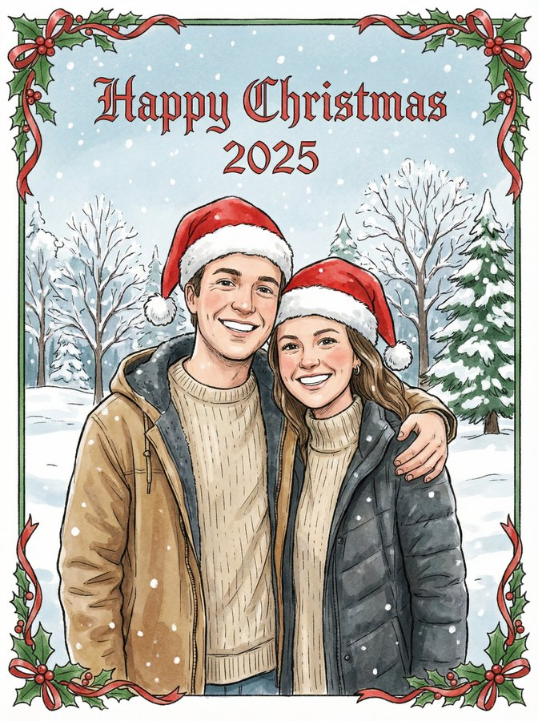
</div>

**提示词：**
```
a faithfully illustrated Christmas card design featuring the couple in Christmas hats, and the text "Happy Christmas 2025", it is friendly and traditional, with a classical design, in a winter wonderland
```

**中文提示词：**
```
一张忠实描绘圣诞场景的圣诞贺卡设计，卡片上这对夫妇戴着圣诞帽，并写着“2025圣诞快乐”。设计风格温馨传统，采用经典的冬日仙境风格。
```

<a id="prompt-901"></a>
## 案例 901：金发女子自拍照 (来源 [@brindleyai](https://x.com/brindleyai/status/2001200342864667035)) 模型：Nano banana pro

<div style="display: flex; justify-content: space-between;">
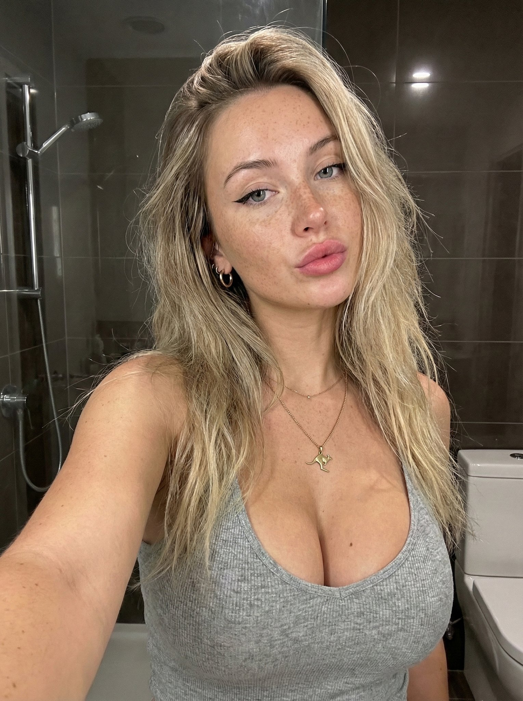
</div>

**提示词：**
```
{
  "subject": {
    "demographics": "Young female, approx 20-24 years old, Caucasian.",
    "hair": {
      "color": "Dirty blonde to light blonde gradient.",
      "style": "Long, straight with slight wave, layered, casual parting.",
      "texture": "Soft, natural strands, slightly tousled, roots visible.",
      "movement": "Falling naturally over shoulders and back."
    },
    "face": {
      "shape": "Oval with soft jawline.",
      "eyes": "Almond-shaped, light blue/grey irises, distinct sharp black winged eyeliner.",
      "nose": "Button nose, soft bridge.",
      "lips": "Full, plump, rosy pink, slightly parted in a pouty expression.",
      "skin_details": "Prominent, heavy freckles across nose and cheeks. Smooth texture but with realistic skin grain. Natural blush.",
      "micro_details": "Mole on right upper chest, mole on left shoulder."
    },
    "body_proportions": {
      "build": "Voluminous, curvy, heavy bust.",
      "chest": "Large bust volume, prominent forward projection, deep cleavage visible.",
      "waist_to_chest_ratio": "Significantly wider chest width compared to waist implies hourglass figure.",
      "shoulders": "Soft, rounded, natural slope.",
      "dominance": "Upper torso volume visually dominates the frame."
    },
    "clothing": {
      "top": "Heather grey ribbed knit tank top/camisole.",
      "fit": "Tight, form-fitting, stretching over chest volume, low scoop neckline.",
      "straps": "Thick straps, sitting securely on shoulders."
    },
    "accessories": {
      "jewelry": [
        "Small gold hoop earrings.",
        "Gold chain necklace with a small 'G' letter pendant.",
        "Longer thin gold chain with a distinct kangaroo pendant."
      ]
    }
  },
  "pose": {
    "type": "Handheld selfie perspective.",
    "orientation": "Frontal close-up, slightly angled from above.",
    "head_position": "Tilted slightly to subject's right.",
    "limbs": "Right arm extended forward (out of frame) indicating holding the camera.",
    "gaze": "Direct eye contact with lens, alluring and confident.",
    "spine_curvature": "Slight arch implied by chest prominence."
  },
  "setting": {
    "environment": "Domestic bathroom.",
    "background_elements": "Dark brown/grey glossy tiled wall, chrome shower fixture visible on left, top of white ceramic toilet tank visible on right.",
    "depth": "Shallow depth of field, background elements slightly out of focus."
  },
  "camera": {
    "shot_type": "Close-up, selfie portrait.",
    "angle": "High angle (slightly above eye level), typical of smartphone selfies.",
    "focal_length": "24mm to 28mm equivalent (wide angle smartphone lens).",
    "framing": "Chest-up shot, cropping at mid-torso.",
    "focus": "Sharp focus on eyes and face, slight fall-off on shoulders.",
    "perspective": "Slight foreshortening of the extended arm side."
  },
  "lighting": {
    "source": "Soft, diffused overhead ambient bathroom lighting.",
    "direction": "Front-top lighting.",
    "highlights": "Soft specular highlights on forehead, tip of nose, chin, and upper chest curves.",
    "shadows": "Soft shadows under the chin and defining the cleavage depth.",
    "quality": "Natural, flattering, no harsh contrast."
  },
  "mood_and_expression": {
    "tone": "Casual, sultry, confident.",
    "expression": "Relaxed pout, 'cool girl' aesthetic.",
    "atmosphere": "Intimate, candid."
  },
  "style_and_realism": {
    "style": "Photorealistic, social media aesthetic.",
    "fidelity": "High fidelity skin texture, no airbrushing.",
    "imperfections": "Visible freckles, stray hairs, natural skin variation preserved."
  },
  "colors_and_tone": {
    "palette": "Neutral tones (grey, beige, skin tones) with pops of blue (eyes) and gold (jewelry).",
    "skin_tone": "Fair to light tan, warm undertones.",
    "white_balance": "Slightly warm, indoor tungsten mix.",
    "saturation": "Natural, slightly vibrant lips and eyes.",
    "contrast": "Medium contrast."
  },
  "technical_details": {
    "aspect_ratio": "3:4",
    "resolution": "High resolution, sharp details.",
    "noise": "Slight digital noise characteristic of phone camera sensors in indoor light."
  }
}
```

**中文提示词：**
```
{
“主题”： {
“人口统计信息”：“年轻女性，大约20-24岁，白种人。”
“头发”： {
颜色：从脏金色到浅金色的渐变色。
发型：长直发，略带波浪，层次分明，随意分缝。
“质感”：“柔软自然的发丝，略显蓬松，发根可见。”
“动作”：“自然地垂落在肩膀和背部。”
},
“脸”： {
“脸型”：“椭圆形，下颌线条柔和。”
“眼睛”：“杏仁状，浅蓝灰色虹膜，清晰锐利的黑色上扬眼线。”
“鼻子”：“小巧的鼻子，柔和的鼻梁。”
“嘴唇”：“饱满、丰润、呈玫瑰粉色，微微张开，带着一丝嘟嘴的表情。”
“皮肤细节”： “鼻子和脸颊上有明显的、较多的雀斑。质地光滑，但保留了真实的皮肤纹理。自然的红晕。”
"micro_details": "右胸上方有一颗痣，左肩上有一颗痣。"
},
"body_proportions": {
体型：丰满、曲线优美、胸部丰满。
“胸部”：“胸部丰满，胸部前凸明显，乳沟深邃可见。”
腰胸比：胸部宽度明显大于腰部宽度，表明身材呈沙漏形。
“肩部”：“柔和、圆润、自然的坡度。”
“主导性”：“上半身的体积在视觉上主导了画面。”
},
“衣服”： {
上衣：浅灰色罗纹针织背心/吊带衫。
“合身”：紧身、贴合胸部曲线，低圆领。
“肩带”：“厚实的肩带，牢牢地贴在肩膀上。”
},
“配件”： {
“珠宝”： [
“小金圈耳环。”
“金链项链，配有一​​个小小的字母‘G’吊坠。”
“较长的细金链，配有独特的袋鼠吊坠。”
]
}
},
"姿势": {
类型：手持自拍视角。
“方向”：“正面特写，略微从上方倾斜。”
“头部位置”： “略微向拍摄对象的右侧倾斜。”
四肢：右臂向前伸展（超出画面），表示正在握持相机。
“凝视”：“通过镜头直接与眼睛对视，充满魅力和自信。”
"spine_curvature": "胸部突出所暗示的轻微弧度。"
},
“环境”： {
“环境”：“家用浴室。”
"background_elements": "深棕色/灰色光面瓷砖墙，左侧可见镀铬淋浴装置，右侧可见白色陶瓷马桶水箱顶部。"
“景深”：“浅景深，背景元素略微失焦。”
},
“相机”： {
"shot_type": "特写，自拍肖像。"
“角度”：“高角度（略高于视线水平），是智能手机自拍的典型角度。”
"focal_length": "24mm 至 28mm 等效焦距（广角智能手机镜头）",
“构图”：“胸部以上镜头，裁剪至躯干中部。”
“焦点”：“眼睛和脸部清晰聚焦，肩膀略微虚化。”
“透视”：“伸展的手臂一侧略微缩短。”
},
“灯光”： {
光源：柔和、漫射的浴室顶灯。
“方向”：“前上照明。”
“高光”：“额头、鼻尖、下巴和上胸曲线处的柔和镜面高光。”
“阴影”：“下巴下方柔和的阴影勾勒出乳沟的深度。”
“品质”：“自然、讨喜、无强烈对比。”
},
"mood_and_expression": {
语气：随意、性感、自信。
“表情”：“放松的嘟嘴，‘酷女孩’风格。”
“氛围”：“亲密、坦诚。”
},
"风格与现实主义": {
风格：写实风格，社交媒体美学。
“真实感”： “高保真度的皮肤纹理，无修图。”
“瑕疵”：“可见的雀斑、杂乱的毛发、自然的肤色差异均得以保留。”
},
"colors_and_tone": {
“调色板”：“以中性色调（灰色、米色、肤色）为主，点缀以蓝色（眼妆）和金色（珠宝）。”
“肤色”: “白皙至浅棕色，暖色调。”
“白平衡”: “略微偏暖的室内钨丝灯混合模式。”
“饱和度”：“自然、略带活力的唇部和眼部。”
“对比度”: “中等对比度。”
},
"technical_details": {
"aspect_ratio": "3:4",
分辨率：高分辨率，细节清晰。
“噪声”: “室内光线下手机摄像头传感器特有的轻微数字噪声。”
}
}
```

<a id="prompt-900"></a>
## 案例 900：都市街头服饰编辑拼贴画 (来源 [@xmliisu](https://x.com/xmliisu/status/2001254201611964524)) 模型：Nano banana pro

<div style="display: flex; justify-content: space-between;">
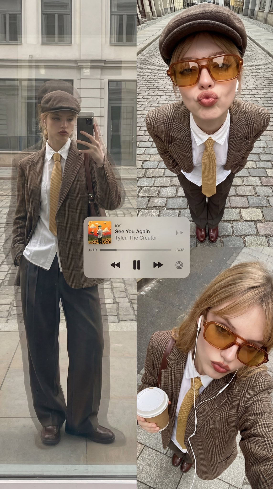
</div>

**提示词：**
```
{
  "project_title": "Urban Streetwear Editorial Collage",
  "aspect_ratio": "9:16",
  "aesthetic_theme": {
    "style": "Editorial poster-style multi-panel collage",
    "mood": "Retro analog–digital fusion",
    "color_palette": [
      "Warm ambers",
      "Washed neutrals",
      "Soft greys",
      "Muted browns"
    ],
    "textures": [
      "Reflective glass",
      "Wool plaid",
      "Polished leather",
      "Stone pavement"
    ]
  },
  "subject_outfit": {
    "core": "Brown plaid blazer, white button-up shirt, yellow tie, loose dark trousers",
    "accessories": "Brown cap, oversized amber-tinted rectangular sunglasses",
    "tech": "Wired earphones"
  },
  "composition_layout": {
    "frame_1_top_left": {
      "type": "Reflective window shot",
      "pose": "Holding phone in front of face",
      "visual_effects": "Layered ghosting, architectural overlays, curvature distortion"
    },
    "frame_2_top_right": {
      "type": "Close-range, downward-angled ultra-wide portrait",
      "setting": "Cobblestone street",
      "pose": "Leaning forward, hands in pockets, exaggerated pout",
      "visual_effects": "Lens perspective distortion, radiating cobblestones"
    },
    "frame_3_bottom_right": {
      "type": "Intimate overhead selfie",
      "lighting": "Soft overcast",
      "props": "Holding a drink",
      "overlays": "Faint digital-grid, minimal square facial-bounding graphic"
    }
  },
  "ui_elements": {
    "music_player": {
      "style": "Translucent iOS-style Apple Music mini-player",
      "content": "“See You Again” by Tyler, The Creator",
      "features": "Artwork, timeline, playback controls (no shadows)"
    },
    "graphics": "Subtle cursor-like frame lines, rectangular highlights"
  },
  "negative_constraints": [
    "Stickers",
    "Extra subjects",
    "Wardrobe changes",
    "Incorrect UI icons",
    "Neon color shifts",
    "Futuristic sci-fi elements"
  ]
}
```

**中文提示词：**
```
{
"project_title": "都市街头服饰编辑拼贴画",
"aspect_ratio": "9:16",
"aesthetic_theme": {
“风格”：“社论海报风格的多面板拼贴画”，
“氛围”：“复古模拟-数字融合”，
"color_palette": [
“温暖的琥珀色”，
“水洗中性色”，
“柔和的灰色”，
“柔和的棕色”
],
“纹理”：[
“反射玻璃”，
“羊毛格子呢”
“抛光皮革”，
石板路
]
},
"subject_outfit": {
“核心单品”：棕色格子西装外套、白色纽扣衬衫、黄色领带、宽松深色长裤。
“配饰”：“棕色帽子，超大琥珀色矩形太阳镜”，
“科技产品”：“有线耳机”
},
"composition_layout": {
"frame_1_top_left": {
“类型”：“反射窗照片”，
“姿势”：“将手机举到脸前”，
"视觉特效": "分层重影、建筑叠加、曲率扭曲"
},
"frame_2_top_right": {
“类型”：“近距离、向下倾斜的超广角人像”，
“场景”：“鹅卵石街道”，
“姿势”：“身体前倾，双手插兜，夸张地撅嘴”，
"视觉效果": "镜头透视变形，放射状鹅卵石"
},
"frame_3_bottom_right": {
类型： 亲密俯视自拍，
“光线”：“柔和的阴天”，
“道具”：“拿着一杯饮料”，
“叠加层”：“淡淡的数字网格，极简的方形面部轮廓图形”
}
},
"ui_elements": {
"music_player": {
"style": "半透明 iOS 风格的 Apple Music 迷你播放器",
内容： “Tyler, The Creator 的“See You Again””
“功能”： “封面图、时间轴、播放控制（无阴影）”
},
“图形”：“类似光标的微妙边框线，矩形高光”
},
"negative_constraints": [
“贴纸”，
“额外科目”，
“服装更换”
“错误的用户界面图标”，
“霓虹色彩变化”，
“未来科幻元素”
]
}
```

<a id="prompt-899"></a>
## 案例 899：中国四大节日美甲四宫格 (来源 [@lxfater](https://x.com/lxfater/status/2001587965131465046)) 模型：Nano banana pro

<div style="display: flex; justify-content: space-between;">
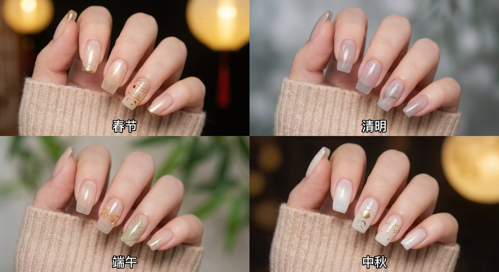
</div>

**中文提示词：**
```
任务：生成「中国四大节日美甲四宫格」拼贴图（2x2）
核心指令
基于用户提供的一张清晰手部近景照片（或同风格参考图），生成一张 2x2 四宫格拼贴图。四格必须是同一双手、同构图、同光线、同背景风格，只替换美甲设计主题。
每格底部必须标注节日名称：春节 / 清明 / 端午 / 中秋（中文优先；如文字易错可用英文备选）。
全局统一风格（四格都必须遵守）

构图：女性手部特写近景，手指搭在柔软针织毛衣袖口或浅色布料上，浅景深，高清摄影，4k。
光线：室内柔光（暖光为主，清明可偏自然冷柔光），背景干净、散景高级。

美甲基调：通勤友好、低饱和、清透显白；甲缘干净利落；贴饰“少而准”；封层高质感不过曝。

甲型：默认中长软方（若输入图甲型不同，以输入为准保持一致）。

排布规则：每套都明确 “主打指（1-2根）+ 辅助指（2-3根）+ 纯净底色指（其余）”，避免每根都很花。

输出排版

2x2 网格拼贴，边框规整、留白一致、四格大小一致。
每格底部加小标题：春节、清明、端午、中秋（字体干净现代、细字重、位置统一）。

四格设计细化（重点：每格的“美甲定制”要足够具体）

A格（左上）【春节】通勤清透红金点睛（“有年味但不俗”）
背景散景建议：暖黄灯笼光斑 + 金色挂饰虚化（不抢主体）。
美甲细节：
底色：奶透裸米（带一点点果冻感），做极浅“奶透晕染”从甲根到甲尖过渡，整体清透显白。
结构：3根纯净底色（只带极淡细闪），1根微法式，1根主打图案。

法式边：选 1-2 根指甲做“极细金边法式”（线细到像金线描边），法式弧度干净利落。

主打指（1根，建议无名指或中指）：极简窗花线稿（线条细、留白多），窗花只占甲面 20%-30%，下方留大面积清透底。

点缀材质：
香槟金细闪均匀但很淡，像“皮肤自带光”。
金箔只放 2-4 片超小碎片，集中在甲根或侧边一小撮，绝不铺满。

颜色控制：红色只做一个小红点/一小段红线（可在窗花中心点一下），避免大面积正红。

封层：玻璃光，高光柔、不过曝。

B格（右上）【清明】雾感极简青灰透（“安静干净、有雾气感”）

背景散景建议：薄雾灰绿调 + 细雨光点朦胧散景。
美甲细节：

底色：冷灰透粉 或 雾灰绿透（二选一，推荐更通勤的冷灰透粉），整体偏“雾化清透”。

结构：4根纯净底色 + 1根主打极简线条（非常克制）。

主打指（1根，建议无名指）：
柳叶线条：一条极细线从甲根轻轻延伸到甲中段，旁边加 1-2 笔“柳叶”短线，留白为主。
在柳叶附近加 2-3 个雨滴光点（微小点状高光），像细雨落在甲面。
材质：
只允许 珠光或极细细闪（“几乎看不见但会透光”那种），不加金箔、不加大亮片。
光感：缎光（比玻璃光更高级的柔亮，避免塑料反光）。

质感控制：整体低对比、干净，不要明显纹理堆叠。

C格（左下）【端午】艾草绿点题粽叶纹理（“淡淡草木气，细节耐看”）

背景散景建议：艾草绿植 + 竹叶/香包虚化。
美甲细节：

底色：奶透裸米或冷调透白底（更显白），整体清透。

结构：2根主题指 + 3根清透底色。

主题指①（1根，建议无名指）：粽叶极简纹理
用极淡的艾草绿做“线条压纹感”，只画 2-3 条斜向叶脉线，像“若隐若现”的叶纹。

主题指②（1根，建议中指或食指）：极细金线绕一圈像绑绳
在甲面中段或靠近甲尖处，画一圈极细金线（不要粗金条），像绑粽子的绳结意象。

点缀材质：
细闪只做“薄薄一层”，集中在甲根到甲中段，避免甲尖闪到发廉价。
金箔仍然是 2-4 片小碎片，点在金线旁边或甲根一侧，增强“手工质感”。

颜色控制：艾草绿只占少量（线条/小块），不要整甲深绿。

光感：玻璃光（但高光要柔）。
D格（右下）【中秋】月光奶透桂花金（“月光感、温柔高级、很出片”）
背景散景建议：暖黄月灯光斑 + 桂花金色散景点点。
美甲细节：

底色：奶透米白或奶透裸米，做轻微“月光晕染”——甲根更奶透、甲尖更清亮，干净显白。

结构：1根月相主打 + 1根桂花点缀 + 其余清透细闪底色。

月相主打指（1根，建议无名指）：
细线月相（月弯/半月/小满月选 1-2 个，不要一排九宫格那种），线条很细，留白大。

桂花点缀指（1根，建议中指）：
桂花金点：用极小金点做 5-8 个“散落的桂花点”，密度低、分布自然，像落在甲面。

材质：香槟金细闪 + 少量金箔（更偏“月光金”），不要银闪抢戏。

光感：玻璃光，整体温柔但清晰，近景细节干净。

Negative Prompt（负面提示词）

低清晰度，模糊，噪点，过曝，强硬阴影，塑料反光，甲面凹凸不平，涂抹脏乱，颜色过饱和，荧光色，廉价大钻堆砌，卡通贴纸感，粗糙贴饰，指甲形状扭曲，手指畸形，多余手指，皮肤质感不一致，四格不是同一双手，构图不一致，背景杂乱，网格歪斜，边框不均匀，文字水印logo，标签缺失或拼写错误

请根据上面提示词生成图片
```

<a id="prompt-898"></a>
## 案例 898：高角度商业美食摄影照片 (来源 [@linxiaobei888](https://x.com/linxiaobei888/status/2001591561302483267)) 模型：Nano banana pro

<div style="display: flex; justify-content: space-between;">

</div>

**中文提示词：**
```
一张高角度商业美食摄影照片，展示了[天妇罗]盛放在极简风格的透明玻璃盘中，配有一小玻璃碗酱油和一碗芥末。旁边放着两只筷子，背景为纯净的奶油米白色，留有充足的留白。左侧叠加了时尚的黑色无衬线字体排版，简单介绍了菜品名称、价格和搭配说明。右上角有一个极简的小Logo。采用柔和的摄影棚布光，逼真的柔和阴影，具有时尚杂志的编辑风格。该设计以优质纸张背景填满整个 16:9 画面，采用大师级平面设计，配有精致的中式排版、极其克制的植物图案和精致优雅的光线，营造出一种空灵、奢华、精致的氛围，具有最大的精致感和考究感
```

<a id="prompt-897"></a>
## 案例 897：2x2网格拼贴画 (来源 [@xmliisu](https://x.com/xmliisu/status/2001309711971295669)) 模型：Nano banana pro

<div style="display: flex; justify-content: space-between;">
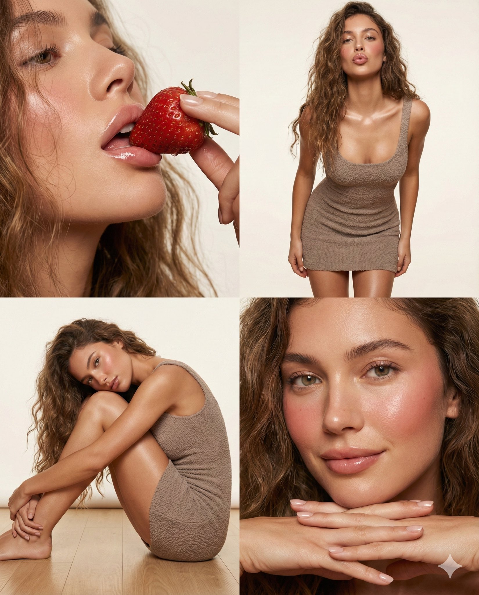
</div>

**提示词：**
```
{
  "project_specifications": {
    "format": "2x2 Grid Collage",
    "aspect_ratio": "4:5",
    "aesthetic_style": "High-end Beauty Editorial",
    "rendering_engine_hints": {
      "realism_level": "Ultra-photorealistic",
      "texture_quality": "8k",
      "lighting_simulation": "Ray-traced studio lighting"
    }
  },
  "global_assets": {
    "subject_definition": {
      "hair": {
        "style": "Long, loosely wavy, voluminous",
        "texture": "Natural, individual strands defined",
        "behavior": "Messy but styled, framing face and shoulders"
      },
      "complexion": {
        "skin_texture": "Porous, hyper-realistic",
        "finish": "Dewy, glass-skin effect",
        "makeup": {
          "cheeks": "Heavy flush/blush",
          "lips": "High-gloss, plump, natural pink",
          "eyes": "Clean, defined lashes, natural brows"
        }
      },
      "wardrobe": {
        "item": "Mini dress",
        "fit": "Bodycon / Tight",
        "fabric": {
          "material": "Soft textured knit / Boucle",
          "tactility": "Fuzzy, light-catching fibers",
          "color": "Soft mauve or neutral taupe"
        },
        "details": "Spaghetti straps, mid-thigh length"
      }
    },
    "environment_definition": {
      "studio_setup": {
        "background": "Seamless paper, soft off-white/beige",
        "atmosphere": "Clean, warm, intimate"
      },
      "lighting_rig": {
        "key_light": "Large diffuse softbox (Front-Left)",
        "fill_light": "Reflector (Right)",
        "highlights": "Specular highlights on lips, cheekbones, and shoulders"
      }
    }
  },
  "panel_architecture": [
    {
      "position": "Top-Left (1)",
      "shot_type": "Extreme Close-Up (Macro)",
      "composition": {
        "angle": "Low angle, looking up slightly",
        "focus": "Mouth and nose area",
        "depth_of_field": "Shallow"
      },
      "action": {
        "primary": "Eating a strawberry",
        "nuance": "Delicate finger hold, lips slightly parted"
      },
      "visual_anchors": [
        "Moisture on strawberry surface",
        "Gloss reflection on lips",
        "Baby hairs at temple"
      ]
    },
    {
      "position": "Top-Right (2)",
      "shot_type": "Medium Shot (Thigh-up)",
      "composition": {
        "angle": "Eye level",
        "pose_dynamic": "Leaning forward slightly towards lens"
      },
      "action": {
        "stance": "Standing straight on",
        "arms": "Relaxed at sides",
        "expression": "Direct gaze, alluring pout"
      },
      "visual_anchors": [
        "Texture of knit dress",
        "Collarbone shadows",
        "Curvature of waist"
      ]
    },
    {
      "position": "Bottom-Left (3)",
      "shot_type": "Full Body (Seated)",
      "composition": {
        "angle": "Side profile",
        "framing": "Subject compacted on floor"
      },
      "action": {
        "pose": "Knees to chest (fetal position variation)",
        "interaction": "Cheek resting on knee, arms embracing legs",
        "hair_flow": "Cascading onto the floor"
      },
      "visual_anchors": [
        "Smooth leg definition",
        "Dress stretching over thigh",
        "Dreamy gaze"
      ]
    },
    {
      "position": "Bottom-Right (4)",
      "shot_type": "Beauty Portrait (Head & Hands)",
      "composition": {
        "angle": "Frontal close-up",
        "framing": "Chin to hairline"
      },
      "action": {
        "gesture": "Chin resting on interlaced fingers",
        "expression": "Soft smile, looking off-camera"
      },
      "visual_anchors": [
        "Hand detail and manicure",
        "Eye clarity",
        "Flush on cheeks"
      ]
    }
  ]
}
```

**中文提示词：**
```
{
"项目规范": {
"格式": "2x2 网格拼贴画",
"aspect_ratio": "4:5",
"aesthetic_style": "高端美容杂志",
"渲染引擎提示": {
"realism_level": "超逼真",
"texture_quality": "8k",
"lighting_simulation": "光线追踪摄影棚照明"
}
},
"global_assets": {
"subject_definition": {
“头发”： {
“发型”：“长款，略带波浪，蓬松”，
“纹理”：“自然、根根分明的发丝”，
“发型”：“凌乱但有型，修饰脸型和肩膀”
},
"肤色": {
"skin_texture": "多孔，超逼真"
“妆效”：“水润、如玻璃般光滑的肌肤效果”，
“化妆品”： {
“脸颊”： “浓重的红晕/腮红”
“唇部”: “高光泽、丰盈、自然的粉红色”
“眼睛”：“干净、轮廓分明的睫毛，自然的眉毛”
}
},
“衣柜”： {
“商品”: “迷你连衣裙”
“fit”: “紧身/贴身”
“织物”： {
材质：柔软纹理针织/圈绒，
“触感”：“毛茸茸的、能反射光线的纤维”，
颜色：柔和的淡紫色或中性灰褐色
},
详情：细肩带，及大腿中部长度
}
},
"environment_definition": {
"studio_setup": {
“背景”： “无缝纸，柔和的米白色/米色”
氛围：干净、温暖、温馨
},
"lighting_rig": {
"key_light": "大型漫射柔光箱（左前方）",
"fill_light": "右侧反光板",
“高光”： “嘴唇、颧骨和肩膀上的高光”
}
}
},
"panel_architecture": [
{
"位置": "左上(1)" ，
"shot_type": "超近特写（微距）",
“作品”： {
“角度”：“低角度，略微向上看”，
“焦点”：“嘴和鼻子区域”，
"景深": "浅"
},
“行动”： {
“主要”: “吃草莓”
细微之处：指尖轻柔地握着，嘴唇微微张开。
},
“visual_anchors”：[
“草莓表面的水分”
“嘴唇上的光泽反射”
“鬓角的细小绒毛”
]
},
{
"位置": "右上角(2)" ,
"shot_type": "中景（大腿向上）",
“作品”： {
“角度”：“视线水平”，
"pose_dynamic": "身体略微前倾，朝向镜头"
},
“行动”： {
“站姿”：“笔直站立”，
“手臂”：“自然垂于身体两侧”，
“表情”：“直视，撅嘴”
},
“visual_anchors”：[
“针织连衣裙的质地”
“锁骨阴影”
腰部曲线
]
},
{
"位置": "左下角 (3)",
"shot_type": "全身照（坐姿）",
“作品”： {
"角度": "侧面轮廓",
“框架”：“主体压在地板上”
},
“行动”： {
“姿势”：“膝盖贴近胸部（胎儿姿势变体）”
“互动”：“脸颊贴着膝盖，双臂环抱着双腿”，
"hair_flow": "如瀑布般倾泻而下"
},
“visual_anchors”：[
“腿部线条流畅”
“裙子撑开了大腿”，
“梦幻般的凝视”
]
},
{
"位置": "右下角 (4)",
"shot_type": "美人肖像（头部和手部）",
“作品”： {
“角度”：“正面特写”
构图：从下巴到发际线
},
“行动”： {
“姿势”：“下巴搁在交叠的手指上”，
表情： “柔和的微笑，看向镜头外”
},
“visual_anchors”：[
“手部细节和美甲”，
“视力清晰度”
“双颊泛红”
]
}
]
}
```

<a id="prompt-896"></a>
## 案例 896：橙汁上冲浪 (来源 [@Sheldon056](https://x.com/Sheldon056/status/2001497637124739363)) 模型：Nano banana pro

<div style="display: flex; justify-content: space-between;">
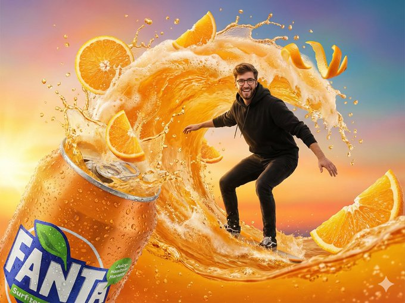
</div>

**提示词：**
```
A vibrant fantasy-style soda commercial where a playful young man surfs an energetic orange soda wave exploding from a cold Fanta can. Juicy orange slices, bubbly liquid arcs, exaggerated motion, warm sunlight, colorful gradient background, joyful expression, dynamic pose, hyper-realistic splash effects, cinematic advertising look, 8K, ultra sharp, bold colors, no text, no watermark
```

**中文提示词：**
```
一则充满活力的奇幻风格汽水广告，一位活泼的年轻人乘着从冰镇芬达罐中喷涌而出的活力四射的橙汁浪潮。画面包含：多汁的橙片、气泡翻腾的液体弧线、夸张的动作、温暖的阳光、色彩渐变的背景、快乐的表情、动感的姿势、超逼真的飞溅效果、电影级的广告画面、8K超高清、超清晰、鲜艳的色彩，无文字，无水印。
```

<a id="prompt-895"></a>
## 案例 895：Gemini 3 flash广告图 (来源 [@songguoxiansen](https://x.com/Lee06253046/status/2001234260594974883)) 模型：Nano banana pro

<div style="display: flex; justify-content: space-between;">

</div>

**中文提示词：**
```
生成一张符合谷歌调性的Gemini 3 flash宣传图片，宽高比16:9
```

<a id="prompt-894"></a>
## 案例 894：大唐盛世与巴黎写真照 (来源 [@songguoxiansen](https://x.com/Lee06253046/status/2001198742998016062)) 模型：Nano banana pro

<div style="display: flex; justify-content: space-between;">
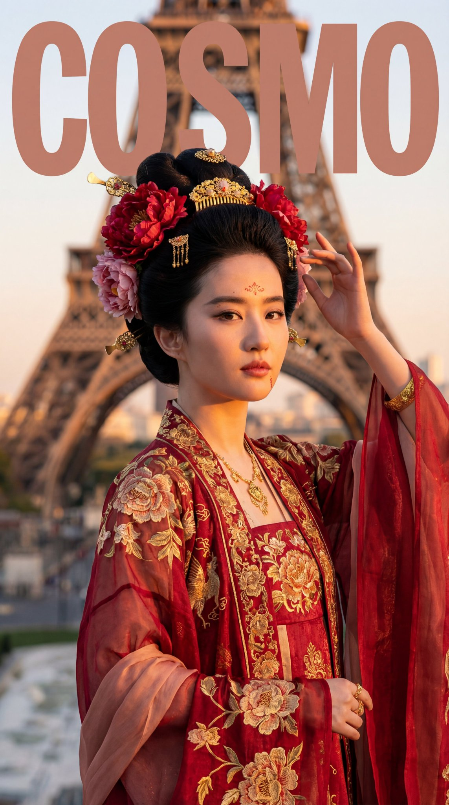
</div>

**中文提示词：**
```
生成一张 9:16 竖版「大唐盛世与巴黎」写实照片：以我上传的 FACE_REF 为人物身份参考，100%还原五官与骨相；人物身穿“唐代（盛唐）宫廷贵妃方向”的重工礼服（齐胸衫裙、大袖衫、牡丹纹样、金饰），在巴黎埃菲尔铁塔下的特罗卡德罗广场或塞纳河畔拍摄。画面具备COSMO时尚杂志级别的摄影、造型与封面设计，保持杂志的一贯设计风格（英文设计）。

【INPUTS | 输入】 FACE_REF：我上传的人物五官参考图（身份锁定）

【ABSOLUTE PRIORITY | 身份锁定（最高优先级）】 100%还原 FACE_REF 的五官与骨相：脸型、容貌、眼距、鼻梁鼻翼、唇形、下颌线、颧骨结构完全一致，不得漂移。 真实皮肤质感：可见细微纹理与毛孔，不要过度磨皮与网红化。 成年女性形象。

【SHOT TYPE | 景别二选一（由模型随机选其一，且必须真实统一）】 A) 半身封面：胸口到腰上方，头面与上身刺绣最清晰，眼睛对焦最锐利（主推） B) 全身封面：从头到脚完整呈现层叠礼服与裙摆纹样，铁塔的钢结构透视更强（备选） （无论A/B：都必须保持“封面构图”，有留白空间给排版，但不要撕纸/手绘效果。）

【LOCATION | 场景（巴黎埃菲尔铁塔）】 巴黎埃菲尔铁塔：经典的钢结构塔身背景。天气二选一（随机）：1) 巴黎阴雨（地面微湿，光线柔和高级灰色调，时尚感强） 2) 绚丽黄昏（夕阳余晖，金色光影，浪漫氛围） 背景干净：无游客、无现代标识、无手机状态栏UI、无水印字幕、无护栏。

【LIGHTING & CAMERA | 摄影质感（杂志级）】 镜头感：85mm人像质感（半身）或 50mm/70mm（全身），浅景深，眼睛最清晰。 光线：自然光（强调环境光） + 电影级补光；金饰有真实高光但不爆；丝绸光泽清晰可辨。 色彩：高级电影感，法式米灰/蓝灰色调与唐代服装的“红绿金”配色形成强烈视觉张力；整体干净、通透、质感厚。

【WARDROBE | 唐代宫廷礼服（丰腴、飘逸、色彩浓烈）】 目标审美：“金饰华丽、面靥花钿、齐胸裙、披帛飘逸、大红大绿大金、极度张扬”。

轮廓与层次（必须体现唐代特征） 内层：诃子（抹胸），露出颈部与上胸肌肤（唐代开放风气） 中层：对襟短衫（直领），材质透明轻薄（罗/纱） 外层：大袖衫（极宽大的袖子，拖地），像翅膀一样张开 装饰：披帛（长长的丝带），挽在手臂间，随风飘舞 下装：齐胸破裙（裙腰系在胸口，裙摆宽大，多色拼接或印花） 面料与工艺（重手艺必须“看得见”） 主面料：丝绸、织锦、印金纱（轻盈与厚重结合） 主要工艺：印染（蜡染/夹路）、金线刺绣、织金 纹样主题（适配大唐）：宝相花、缠枝牡丹、瑞兽（狮子/麒麟）、团花（图案巨大、饱满） 细节：花钿（额头红色装饰）、面靥（嘴角红点）、臂钗（大臂上的金属饰品） 头面（唐代雍容华贵头饰） 核心结构：高耸的发髻（云髻/坠马髻），插戴大朵牡丹花（真花或绢花） 装饰：金梳背（插在发髻上的金梳子）、步摇（走动摇曳）、金钗 耳饰：贵重金玉

【COLOR MATRIX | 颜色矩阵搭配（必须执行，且必须“浓烈唐风”）】 （调整为唐代流行色：红绿撞色、金碧辉煌） 从以下三套“主色方案”中随机选 1 套作为【底色/大面积主面料色】。

Scheme G（石青/翠绿底）： 底色：翠绿/石青（常用的间色） 刺绣/印染：茜红、金色、橘黄、米白 Scheme A（牡丹红底）： 底色：牡丹红/石榴红（最经典的唐风） 刺绣/印染：金色、翠绿、宝蓝、紫 Scheme R（紫底）： 底色：紫/葡萄色（高贵） 刺绣/印染：金色、朱红、草绿、银

【颜色执行规则】 色彩对比要强烈，体现盛唐气象，但整体色调要统一在高级感中。

【POSE | 封面姿态（自信、舒展、女王感）】 半身：微昂头，眼神睥睨，一手轻抚发髻或披帛 全身：双臂张开带动大袖衫和披帛，展现服装的体积感，气场全开 表情：自信、张扬、妩媚、大方；不要羞涩。

【OUTPUT | 输出】 1 张 9:16 竖版写实杂志封面级照片 随机：半身 or 全身（A/B二选一） 随机：阴雨 or 黄昏（天气二选一） 随机：翠绿 / 牡丹红 / 紫（颜色矩阵三选一） 造型：唐代宫廷礼服方向 + 牡丹花/金梳头面 + 齐胸大袖 + 披帛
```

<a id="prompt-893"></a>
## 案例 893：9宫格产品展示 (来源 [@azed_ai](https://x.com/azed_ai/status/2000845183257292883)) 模型：Nano banana pro

<div style="display: flex; justify-content: space-between;">

</div>

**提示词：**
```
Create a 3×3 grid in
3:4 aspect ratio for a high-end commercial marketing campaign using the uploaded product as the central subject.

Each frame must present a distinct visual concept while maintaining perfect product consistency across all nine images.

Grid Concepts (one per cell):

1. Iconic hero still life with bold composition

2. Extreme macro detail highlighting material, surface, or texture

3. Dynamic liquid or particle interaction surrounding the product

4. Minimal sculptural arrangement with abstract forms

5. Floating elements composition suggesting lightness and innovation

6. Sensory close-up emphasizing tactility and realism

7. Color-driven conceptual scene inspired by the product palette

8. Ingredient or component abstraction (non-literal, symbolic)

9. Surreal yet elegant fusion scene combining realism and imagination

Visual Rules:
Product must remain 100% accurate in shape, proportions, label, typography, color, and branding
No distortion, deformation, or redesign of the product
Clean separation between product and background

Lighting & Style:
Soft, controlled studio lighting
Subtle highlights, realistic shadows
High dynamic range, ultra-sharp focus
Editorial luxury advertising aesthetic
Premium sensory marketing look

Overall Feel:
Modern, refined, visually cohesive
High-end commercial campaign
Designed for brand websites, social grids, and digital billboards
Hyperreal, cinematic, polished, and aspirational
```

**中文提示词：**
```
创建一个 3×3 的网格
3:4 宽高比，适用于以上传产品为中心主题的高端商业营销活动。

每幅画面都必须呈现独特的视觉概念，同时在所有九幅画面中保持产品的完美一致性。

网格概念（每个单元格一个）：

1. 构图大胆的标志性英雄静物画

2. 极致的宏观细节，突出材质、表面或纹理。

3. 产品周围的动态液体或颗粒相互作用

4. 极简主义的抽象造型雕塑摆设

5. 漂浮元素构成，暗示着轻盈和创新。

6. 强调触觉和真实感的感官特写

7. 以产品色卡为灵感的色彩驱动型概念场景

8. 成分或组成部分抽象（非字面意义、符号意义）

9. 超现实而又优雅的融合场景，兼具现实主义与想象力

视觉规则：
产品在形状、比例、标签、字体、颜色和品牌标识方面必须保持100%准确。
产品不得有任何变形、扭曲或重新设计。
产品与背景之间清晰分离

灯光与风格：
柔和、可控的摄影棚灯光
微妙的高光，逼真的阴影
高动态范围，超清晰对焦
编辑奢华广告美学
高端感官营销外观

整体感觉：
现代、精致、视觉上和谐统一
高端商业推广活动
专为品牌网站、社交媒体平台和数字广告牌而设计
超现实的、电影般的、精致的、令人向往的
```

<a id="prompt-892"></a>
## 案例 892：6X6产品多种风格 (来源 [@gokayfem](https://x.com/gokayfem/status/2001265620449444251)) 模型：Nano banana pro

<div style="display: flex; justify-content: space-between;">
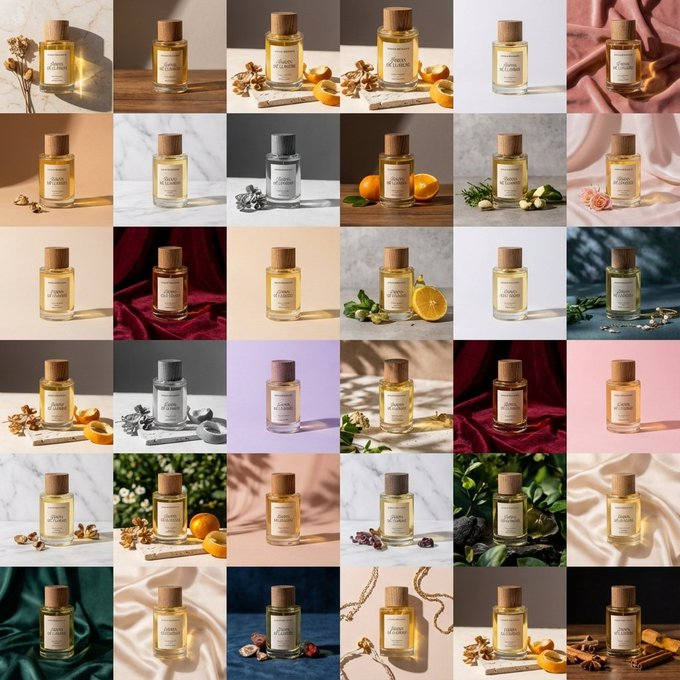
</div>

**提示词：**
```
Generate a 6x6 grid of variations based on the original image. Keep the same product but vary the color palettes, backgrounds, lighting, angles, props, and styling dramatically across all 36 cells. Maintain the same professional quality and aesthetic throughout.
```

**中文提示词：**
```
基于原图生成一个 6x6 的变体网格。保持产品相同，但大幅改变所有 36 个单元格中的配色方案、背景、光线、角度、道具和造型。始终保持相同的专业品质和美感。
```

<a id="prompt-891"></a>
## 案例 891：6X6风格和质量各异的产品图 (来源 [@gokayfem](https://x.com/gokayfem/status/2001265620449444251)) 模型：Nano banana pro

<div style="display: flex; justify-content: space-between;">
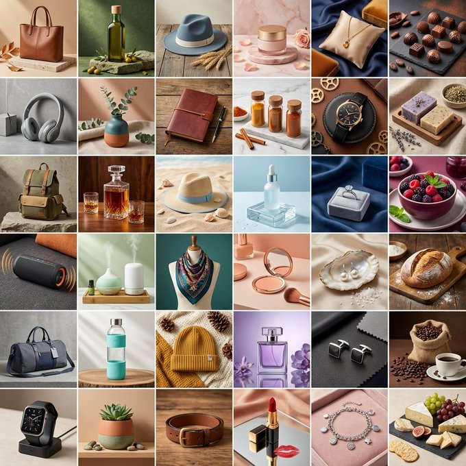
</div>

**提示词：**
```
Generate a 6x6 grid of professional product photography. Reference the original image's mood, quality, and aesthetic. Each cell should showcase a completely different product (bags, bottles, hats, cosmetics, jewelry, food, electronics, etc.) in a unique studio setting with a distinct color palette. Maintain the same high-end commercial photography style throughout. Vary the products, lighting, backgrounds, props, and styling dramatically across all 36 images.
```

**中文提示词：**
```
生成一个 6x6 的专业产品摄影网格。参考原图的风格、质量和美感。每个单元格应展示一种完全不同的产品（例如包袋、瓶装水、帽子、化妆品、珠宝、食品、电子产品等），并置于独特的摄影棚环境中，使用不同的色彩搭配。保持整体高端商业摄影风格一致。在所有 36 张图片中，产品、光线、背景、道具和造型都应有显著差异。
```

<a id="prompt-890"></a>
## 案例 890：女生铅笔素描画 (来源 [@xmiiru_](https://x.com/xmiiru_/status/2001269553599336475)) 模型：Nano banana pro

<div style="display: flex; justify-content: space-between;">
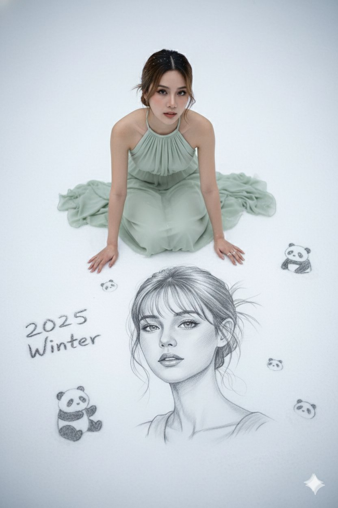
</div>

**提示词：**
```
{
  "scene": {
    "setting": "winter",
    "environment": {
      "ground": "pure white snow",
      "lighting": "natural winter daylight, soft and diffused, gentle shadows, no harsh highlights",
      "mood": "quiet, peaceful, poetic, dreamy, nostalgic, gentle winter serenity",
      "color_palette": ["white", "soft gray", "muted green"]
    }
  },
  "subject": {
    "type": "young woman",
    "appearance": {
      "face": "same as reference photo",
      "skin": "fair, smooth",
      "body": "slender",
      "pose": "kneeling on snow, viewed from slightly top-down back angle, facing forward, both hands gently on snow in front",
      "hair": "low neat bun with a few loose strands naturally framing the neck",
      "outfit": {
        "dress_type": "halter-neck",
        "color": "light sage-green",
        "material": "sheer, soft, flowing, slightly translucent",
        "style": "delicately draping, upper back exposed, conveying elegance, softness, vulnerability"
      }
    }
  },
  "art_elements": {
    "snow_sketch": {
      "portrait": {
        "subject": "woman",
        "face": "same as reference photo",
        "style": "pencil-style, graphite, fine linework, soft shading, realistic proportions, gentle contrast, traditional graphite drawing",
        "features": {
          "eyes": "large, expressive",
          "nose": "slender",
          "lips": "delicate",
          "hair": "loosely tied with subtle flyaway strands"
        },
        "placement": "directly carved into snow in front of kneeling woman"
      },
      "text": {
        "content": "2025 Winter",
        "style": "handwritten, pencil or charcoal, blending naturally with snow",
        "placement": "left of the portrait"
      },
      "additional_elements": {
        "pandas": {
          "style": "graphite sketch, minimal, playful",
          "placement": "scattered around, evenly spaced, subtle whimsical touch"
        }
      }
    }
  },
  "photography_style": {
    "type": "cinematic fine art photography",
    "details": {
      "perspective": "slightly top-down back angle (overhead rear perspective)",
      "depth_of_field": "shallow",
      "texture": "crisp snow, high detail fabric, skin, pencil lines",
      "composition": "balanced, clean background"
    }
  },
  "format": {
    "aspect_ratio": "9:16",
    "realism": "ultra-realistic"
  }
}
```

**中文提示词：**
```
{
“场景”： {
“设置”：“冬季”，
“环境”： {
“地面”: “纯白的雪”
“照明”：“自然的冬季日光，柔和而漫射，淡淡的阴影，没有刺眼的高光”，
“氛围”：“安静、平和、诗意、梦幻、怀旧、温柔的冬日宁静”，
"color_palette": ["白色", "柔和的灰色", "柔和的绿色"]
}
},
“主题”： {
“类型”: “年轻女子”
“外貌”： {
“脸部”： “与参考照片相同”，
“皮肤”: “白皙、光滑”
“身材”： “苗条”，
“姿势”：“跪在雪地上，从略微俯视的后方角度看，面向前方，双手轻轻放在身前的雪地上”，
“头发”：“低低的整齐发髻，几缕碎发自然地垂在颈间”，
“全套服装”： {
"dress_type": "露背领",
“颜色”：“浅鼠尾草绿”，
“材质”：“轻薄、柔软、飘逸、略微半透明”，
“风格”：“轻柔垂坠，露出上背部，传达优雅、柔美、脆弱”
}
}
},
"art_elements": {
"snow_sketch": {
“肖像”： {
主题：女人，
“脸部”： “与参考照片相同”，
“风格”：“铅笔风格，石墨，精细线条，柔和阴影，写实比例，柔和对比，传统石墨画”
“特征”： {
“眼睛”：“大而有神”，
“鼻子”：“纤细”，
“嘴唇”： “精致的”，
“头发”：“松散地扎起来，留有几缕碎发”
},
“位置”：“直接在跪着的女人面前的雪地上雕刻”
},
“文本”： {
"content": "2025 年冬季",
“风格”：“手写，铅笔或炭笔，与雪自然融合”，
“位置”：“肖像左侧”
},
"additional_elements": {
"pandas": {
风格：石墨素描、极简、活泼，
“摆放位置”：“散落在各处，均匀分布，略带奇思妙想”
}
}
}
},
"photography_style": {
“类型”：“电影艺术摄影”，
“细节”： {
“视角”：“略微俯视的后方视角（俯视后方视角）”，
"景深": "浅",
“纹理”：“清脆的雪，高细节的织物，皮肤，铅笔线条”，
构图：平衡、干净的背景
}
},
“格式”： {
"aspect_ratio": "9:16",
“写实主义”: “超写实主义”
}
}
```

<a id="prompt-889"></a>
## 案例 889：微缩的品牌门店 (来源 [@TechieBySA](https://x.com/TechieBySA/status/2000936938103267764)) 模型：Nano banana pro

<div style="display: flex; justify-content: space-between;">
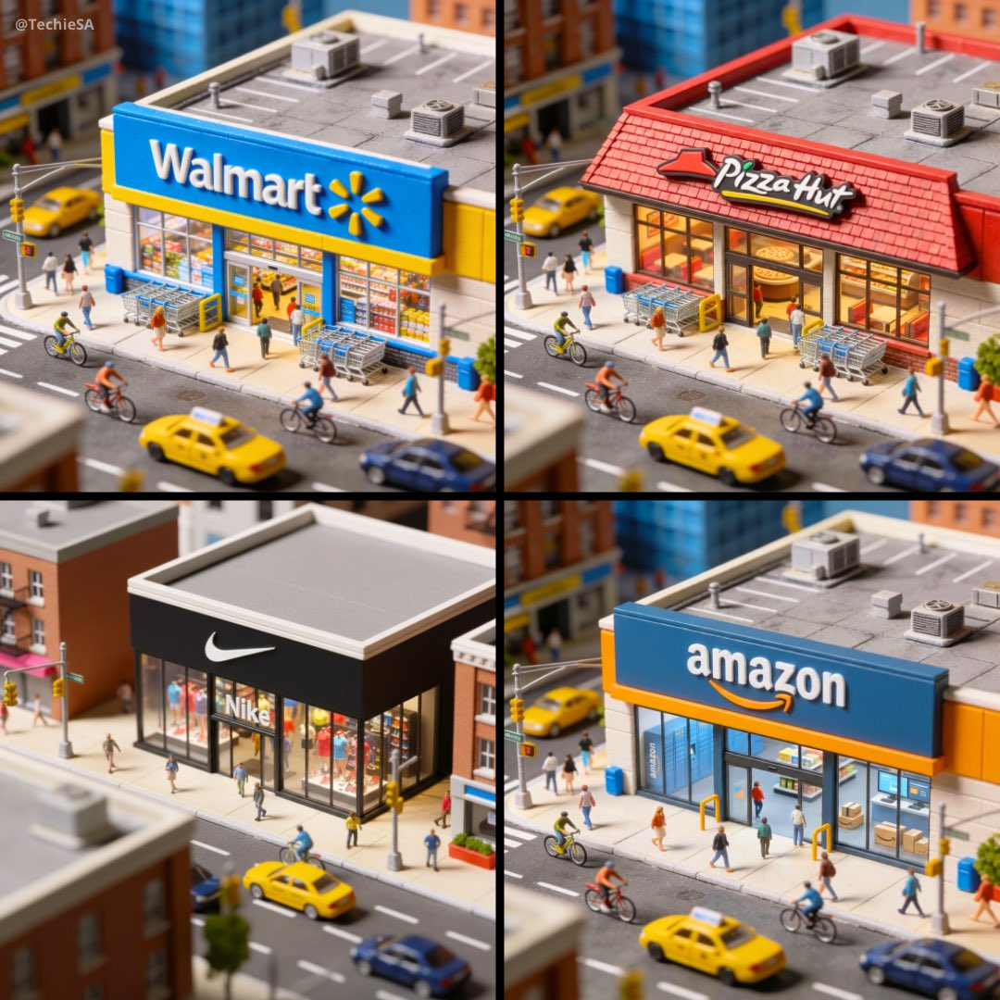
</div>

**提示词：**
```
A dynamic aerial view of a bustling city street, focusing on a miniature [BRAND] store. The camera performs a smooth, sweeping dolly in towards the storefront, capturing the vibrant activity of pedestrians, cyclists, and vehicles. Bright daylight illuminates the scene, highlighting the distinctive branding and merchandise displayed in the window. The atmosphere is lively and energetic, with a playful, miniature aesthetic that emphasizes the intricate details of the cityscape. 1080x1080 dimension.
```

**中文提示词：**
```
一段动态的航拍镜头，展现了熙熙攘攘的城市街道，镜头聚焦于一家微缩的[品牌]门店。镜头流畅地缓缓推移至店面，捕捉行人、骑行者和车辆熙熙攘攘的景象。明亮的日光照亮了整个画面，突显了橱窗中独特的品牌标识和商品。画面充满活力，趣味盎然的微缩美学突出了城市景观的精妙细节。画面尺寸为1080x1080。
```

<a id="prompt-888"></a>
## 案例 888：将人物置身于9部电影的圣诞场景中 (来源 [@songguoxiansen](https://x.com/Lee06253046/status/2000918182660596229)) 模型：Nano banana pro

<div style="display: flex; justify-content: space-between;">
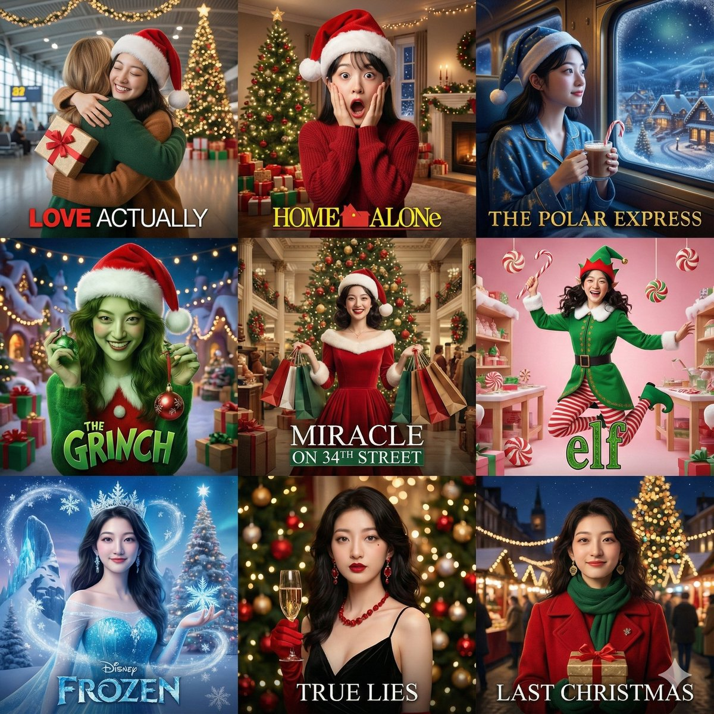
</div>

**中文提示词：**
```
[全局指令]： 一个3x3的网格拼贴画，所有9个格子里必须是完全同一位女性。严格保持与参考图一致的面部特征。不要改变她的五官，只改变她的表情、妆容和造型以匹配各电影主题。
格1：《真爱至上》风格-机场告别场景戴圣诞帽，手持包装礼物，温情拥抱，背景机场巨型圣诞树和彩灯装饰，柔和光线
格2：《小鬼当家》风格-惊讶夸张表情手捂脸颊，戴歪圣诞帽，背景家中圣诞树、礼物堆和装饰彩灯，喜剧效果
格3：《极地特快》风格-火车窗前戴睡帽，手持热可可配糖果拐杖，窗外魔幻雪景和圣诞村庄，梦幻蓝金色调
格4：《圣诞怪杰》风格-真实人物绿色调服装配红色圣诞帽，搞怪表情，手持偷来的圣诞装饰，背景圣诞村彩灯和礼物，创意造型
格5：《34街的奇迹》风格-复古百货商店场景穿经典红色圣诞礼服，手持圣诞购物袋，背景巨型圣诞树和复古装饰，经典好莱坞照明（中心）
格6：《圣诞精灵》风格-完整精灵装扮（绿色上衣、红色条纹袜、尖头帽配铃铛），欢乐跳跃姿态，手持糖果拐杖，背景糖果色圣诞工坊
格7：《冰雪奇缘》风格-冰蓝色公主裙配雪花皇冠，手持魔法冰晶，雪花飞舞，背景冰晶城堡和大大的圣诞树，特别的喜庆糖果，迪士尼魔法感
格8：《真实的谎言》风格-黑色礼服配红色圣诞饰品，手持香槟，背景圣诞派对场景彩灯和装饰球，优雅神秘
格9：《Last Christmas》风格-时尚女性穿红色复古大衣配绿色围巾和金色耳环，手持圣诞礼物盒，站在伦敦圣诞街市彩灯下，背景科文特花园巨型圣诞树和节日橱窗，温暖夜景灯光，充满希望的表情，现代浪漫电影美学
每格模仿对应电影的色调、光线和氛围，圣诞装饰元素极其明显，电影海报构图，添加电影感标题文字效果，专业电影剧照质感，4K高清
```

<a id="prompt-887"></a>
## 案例 887：Q版人物九宫格 (来源 [@rovvmut_](https://x.com/rovvmut_/status/2000944698131992587)) 模型：Nano banana pro

<div style="display: flex; justify-content: space-between;">
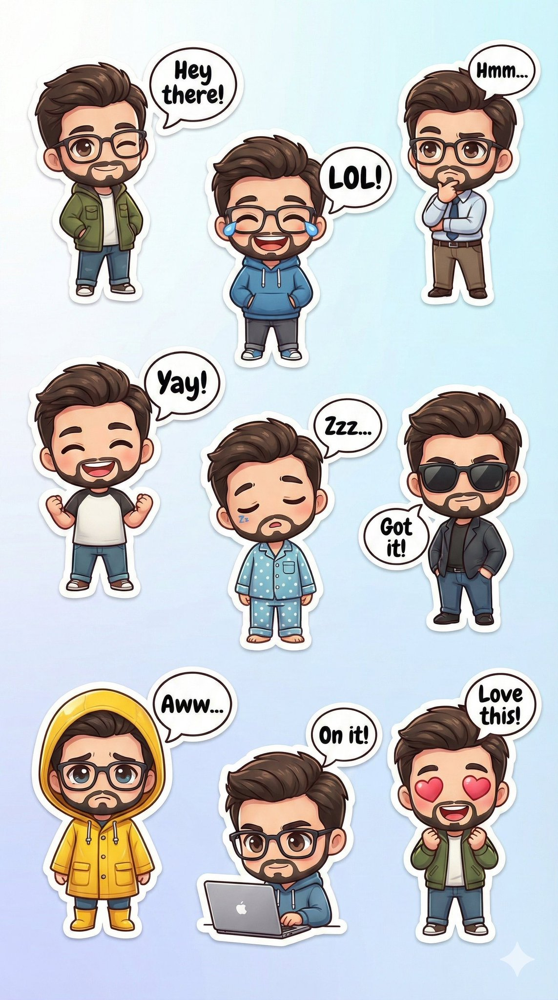
</div>

**提示词：**
```
Create a 3D kawaii a 9:16 canvas featuring nine chibi-style stickers in various outfits, poses and expressions. Use the attached image for reference. Each sticker has a white border and includes a speech bubble with regular use phrases. Set on a soft white-to-pastel blue gradient background for a fun, positive vibe, perfect for WhatsApp use.
```

**中文提示词：**
```
制作一个 9:16 的 3D 可爱画布，包含九个不同服装、姿势和表情的 Q 版贴纸。可参考附图。每个贴纸都带有白色边框，并包含一个带有常用短语的对话框。背景采用柔和的白色到淡蓝色渐变，营造出轻松愉悦的氛围，非常适合在 WhatsApp 中使用。
```

<a id="prompt-886"></a>
## 案例 886：模特站在布满了无数黑白广告牌的地面上 (来源 [@oggii_0](https://x.com/oggii_0/status/2001232399368380637)) 模型：Nano banana pro

<div style="display: flex; justify-content: space-between;">
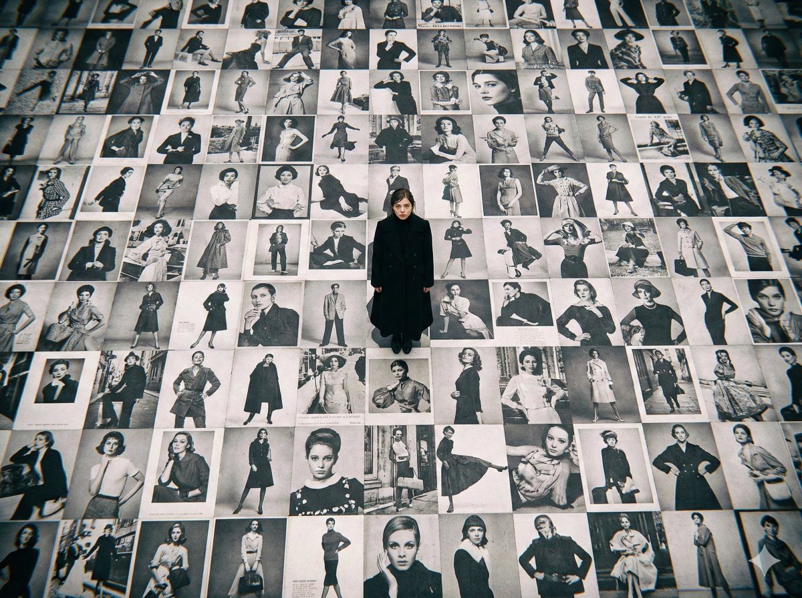
</div>

**提示词：**
```
This high-resolution bird's-eye view photograph was taken with a LOMO Ic-a. The ground is covered with countless black-and-white billboard advertisements of beautiful fashion models, and standing on top of the advertisements is an incredibly beautiful Japanese film actress wearing a long black coat.
```

**中文提示词：**
```
这张高分辨率鸟瞰照片是用 LOMO Ic-a 拍摄的。地面上布满了无数黑白广告牌，上面是美丽的时尚模特，而站在广告牌上的是一位身穿黑色长外套的绝世美女日本电影女演员。
```

<a id="prompt-885"></a>
## 案例 885：人物站在一部超大的智能手机上 (来源 [@r4jjesh](https://x.com/r4jjesh/status/2001196132190609508)) 模型：Nano banana pro

<div style="display: flex; justify-content: space-between;">
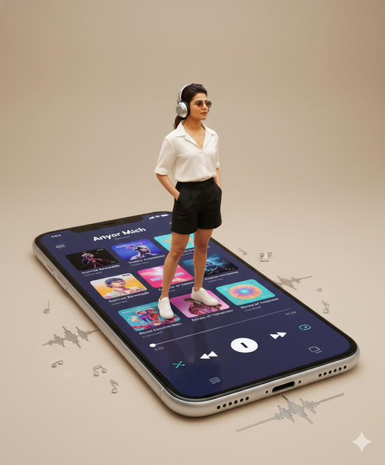
</div>

**提示词：**
```
Using the uploaded image for accurate facial likeness, create a surreal, modern digital artwork featuring the same person standing on top of an oversized smartphone displaying a music-player interface. Do not change the face. The person wears a white short-sleeve button-up shirt, black shorts, white sneakers, and large over-ear headphones, with sunglasses, standing casually with hands in pockets. The smartphone beneath appears massive, making the person look miniaturized, and shows a playlist screen with album covers and playback controls. The overall aesthetic is minimal, clean, and softly lit with a beige background. The style is cinematic, high-resolution, polished, and resembles a professional poster design. Face and body must 100% match the uploaded reference image
```

**中文提示词：**
```
请使用上传的图片作为参考，创作一幅超现实主义的现代数字艺术作品。作品中，人物站在一部超大的智能手机上，屏幕上显示着音乐播放器界面。请勿更改人物面部。人物身穿白色短袖衬衫、黑色短裤、白色运动鞋，戴着大型头戴式耳机和太阳镜，双手插兜，姿态随意。下方的智能手机显得巨大，衬托出人物的渺小，屏幕上显示着带有专辑封面和播放控制的播放列表。整体风格简约、干净，柔和的光线，米色背景。作品风格电影感十足，高分辨率，画面精致，如同专业海报设计。人物的面部和身体必须与上传的参考图片完全一致。
```

<a id="prompt-884"></a>
## 案例 884：极简主义食物摄影作品 (来源 [@TechieBySA](https://x.com/TechieBySA/status/2001021119441330425)) 模型：Nano banana pro

<div style="display: flex; justify-content: space-between;">

</div>

**提示词：**
```
Minimalist food photograph, [1080x1080] – a single [FOOD] rests on a light, matte surface and is captured mid-transformation into a 3D pixelized form: one half remains intact while the other organically fragments into large, floating cubes that drift outward, each cube revealing the object’s texture, ingredients, and colors. Studio lighting with soft, realistic shadows, shallow depth of field, tasteful perspective and composition, hyperrealistic detail, stylish geometric abstraction, subtle motion blur on the cubes, high resolution, cinematic close-up.
```

**中文提示词：**
```
极简主义食物摄影作品，[1080x1080]——一块食物静置于轻盈的哑光表面上，被捕捉到其逐渐转化为3D像素化形态的瞬间：一半保持完整，另一半则自然地分裂成漂浮的大立方体，向外扩散，每个立方体都展现出食物的纹理、成分和颜色。摄影棚灯光营造出柔和逼真的阴影，浅景深，视角和构图恰到好处，细节超写实，几何抽象风格时尚，立方体上带有微妙的动态模糊，高分辨率，电影般的特写镜头。
```

<a id="prompt-883"></a>
## 案例 883：女子在一辆复古美式车内 (来源 [@_MehdiSharifi_](https://x.com/_MehdiSharifi_/status/1994550156763582572)) 模型：Grok

<div style="display: flex; justify-content: space-between;">
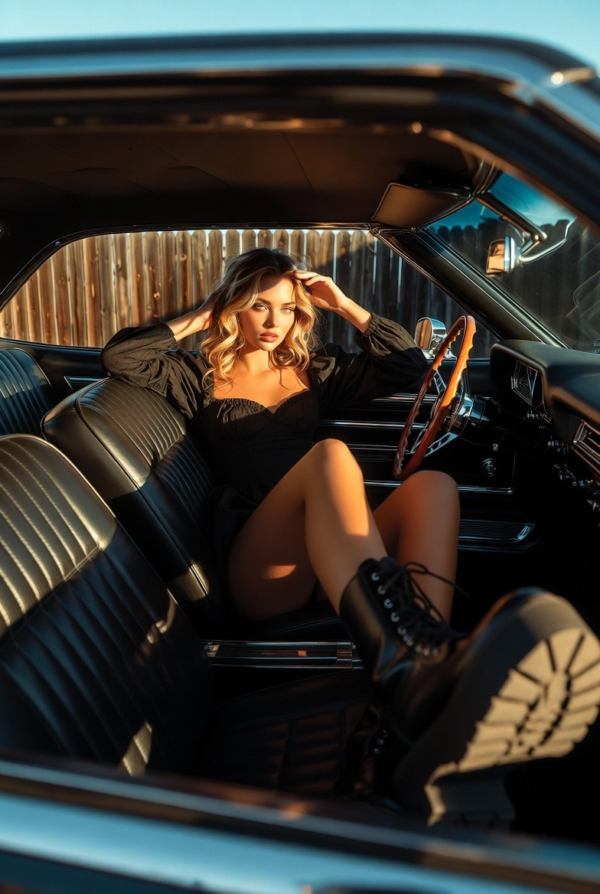
</div>

**提示词：**
```
{
  "scene_description": "A cinematic, wide-angle interior shot of a stylish young woman lounging inside a vintage American muscle car during golden hour.",
  "subject": {
    "type": "young woman",
    "age": "early 20s",
    "features": {
      "hair": "long, volumetric, sun-kissed honey blonde hair, tousled and windblown texture",
      "skin": "fair with warm golden undertones from the sun",
      "expression": "confident, alluring gaze directly into the lens, slight pout"
    },
    "attire": "black puff-sleeve milkmaid-style mini dress or romper with a sweetheart neckline",
    "position": "reclined comfortably across the front bench/bucket seats, one leg extended towards the camera (foreshortened), one knee bent, hand resting casually against her forehead."
  },
  "action": {
    "primary": "lounging in the passenger seat",
    "secondary": "shielding eyes/touching hair with left hand",
    "effect": "relaxed, rebellious 'cool girl' aesthetic"
  },
  "environment": {
    "setting": "Interior of a classic 1960s/70s muscle car",
    "foreground_elements": [
      "vintage wood-rimmed 3-spoke steering wheel (partial view)",
      "black vinyl dashboard",
      "chrome accents"
    ],
    "background_elements": [
      "wooden ranch-style fence visible through window",
      "clear blue sky",
      "car rear view mirror reflecting a sliver of the face"
    ]
  },
  "lighting": {
    "style": "Natural Golden Hour",
    "key_light": {
      "type": "Direct, warm sunlight",
      "color": "golden amber",
      "illuminates": [
        "face",
        "hair highlights",
        "legs"
      ]
    },
    "shadows": "Deep, high-contrast shadows inside the car cabin, creating depth"
  },
  "style": {
    "medium": "35mm film photography",
    "aesthetic": "Vintage Americana, editorial fashion, indie road trip",
    "quality": "high fidelity, grain simulation",
    "details": "ultra-realistic textures on leather and skin"
  },
  "scene_composition": {
    "subject_action": "Lounging with attitude, dominating the frame",
    "camera_behavior": "Wide-angle interior shot, creating perspective distortion on the boots",
    "depth_layering": "Steering wheel foreground -> Subject focus -> Exterior background"
  },
  "visual_description": {
    "core_subject": "A photorealistic young woman with blonde waves.",
    "attire_physics": "The black fabric of the dress absorbs light, while the leather boots have specular highlights.",
    "skin_rendering": "Warm, glowing skin texture with natural highlighting from the sun."
  },
  "lighting_and_atmosphere": {
    "type": "Golden Hour Natural Light",
    "specifics": "Hard sunlight entering through the car window, creating distinct shadow lines across the interior upholstery.",
    "color_grade": "Warm, Kodak Portra 400 inspired, rich blacks and vibrant skin tones."
  },
  "attire_customization": {
    "current_clothing": "Black long-sleeve puff-shoulder top with sweetheart neckline, black chunky platform combat boots with laces.",
    "customizable_clothing": "User can replace with 'denim jacket', 'white summer dress', etc."
  },
  "brand_product_customization": {
    "current_brand_product": "Dr. Martens style combat boots",
    "customizable_brand": "",
    "customizable_product": "",
    "product_placement_area": "The boots in the foreground or the car interior branding."
  },
  "objects_and_props": {
    "main_objects": [
      "Vintage car seats (ribbed black leather)",
      "Steering wheel",
      "Rearview mirror"
    ],
    "secondary_objects": [
      "Wooden fence outside",
      "Chrome door handle"
    ]
  },
  "camera_and_lens": {
    "focal_length_feel": "24mm or 28mm (wide angle)",
    "aperture_effect": "f/5.6 (deep enough to keep interior sharp, slight softness outside)",
    "camera_angle": "Eye-level relative to seated subject, shot from driver's side perspective",
    "lens_type": "Wide angle prime lens",
    "bokeh_style": "Minimal bokeh, mostly sharp context"
  }
}
```

**中文提示词：**
```
{
“scene_description” “一段电影感十足的广角内景镜头，展现了一位时尚年轻女子在日落时分慵懒地躺在一辆复古美式肌肉车内。”
“主题”： {
“类型”: “年轻女子”
“年龄”：“20岁出头”，
“特征”： {
“头发”：“长长的、蓬松的、阳光亲吻过的蜜金色头发，蓬松凌乱，略带风吹的质感”，
“肤色”：“白皙，带有阳光带来的温暖金色光泽”，
“表情”：“自信、迷人的眼神直视镜头，微微撅嘴”
},
“服装”：“黑色泡泡袖挤奶女工风格迷你连衣裙或连体裤，心形领口”，
“姿势”：“舒适地斜倚在前排长椅/桶形座椅上，一条腿伸向镜头（画面缩短），一条膝盖弯曲，一只手随意地放在额头上。”
},
“行动”： {
“主要”： “躺在乘客座位上”，
“次要的”：“用左手遮住眼睛/触摸头发”，
“效果”：“轻松叛逆的‘酷女孩’美学”
},
“环境”： {
“场景”：“一辆经典的 20 世纪 60 年代/70 年代肌肉车的内饰”，
"前景元素": [
“复古木质三辐方向盘（局部视图）”
“黑色乙烯基仪表板”，
“镀铬装饰”
],
“背景元素”：[
“透过窗户可以看到木制牧场风格的围栏”
“晴朗的蓝天”，
“汽车后视镜映出脸部的一角”
]
},
“灯光”： {
“风格”：“自然黄金时刻”，
"key_light": {
“类型”：“直接、温暖的阳光”，
“颜色”：“金琥珀色”，
“照亮”：[
“脸”，
“头发挑染”，
“腿”
]
},
“阴影”：“车厢内部深邃、高对比度的阴影，营造出景深效果”
},
“风格”： {
“媒介”: “35mm 胶片摄影”
“美学”：“复古美式风格、时尚大片、独立公路旅行”
“质量”：“高保真度，颗粒模拟”，
“细节”：“皮革和皮肤上的超逼真纹理”
},
"scene_composition": {
“subject_action”: “慵懒地摆着姿势，占据了画面”
“camera_behavior”: “广角室内镜头，在靴子上产生透视变形”
"depth_layering": "方向盘前景->主体焦点->外部背景"
},
"visual_description": {
核心主题：一位拥有金色波浪卷发的写实年轻女性。
"attire_physics": "连衣裙的黑色面料会吸收光线，而皮靴则具有镜面反射的高光。"
“skin_rendering”: “温暖、有光泽的肌肤纹理，带有阳光带来的自然高光。”
},
"lighting_and_atmosphere": {
“类型”：“黄金时段自然光”，
“具体情况”：“强烈的阳光透过车窗照射进来，在车内座椅上投下清晰的阴影线。”
"color_grade": "温暖的色调，灵感来自柯达Portra 400，浓郁的黑色和鲜艳的肤色。"
},
"attire_customization": {
"current_clothing": "黑色长袖泡泡袖上衣，心形领口，黑色厚底系带马丁靴。"
"customizable_clothing": "用户可以替换为'牛仔夹克'、'白色夏日连衣裙'等。"
},
"品牌产品定制": {
"current_brand_product": "马丁靴款式"
"customizable_brand": "",
"customizable_product": "",
"product_placement_area": "前景中的靴子或汽车内饰品牌标识。"
},
"objects_and_props": {
"main_objects": [
“复古汽车座椅（黑色罗纹皮革）”
“方向盘”，
“后视镜”
],
"secondary_objects": [
“外面有木栅栏，”
“镀铬门把手”
]
},
"camera_and_lens": {
"focal_length_feel": "24mm 或 28mm（广角）",
"aperture_effect": "f/5.6（足够深，可以保持内部清晰，外部略微柔和）",
“camera_angle”: “相对于坐着的拍摄对象，从驾驶员侧视角拍摄，视线与拍摄对象视线齐平”
"lens_type": "广角定焦镜头",
"bokeh_style": "极简散景，主体清晰"
}
}
```

<a id="prompt-882"></a>
## 案例 882：微缩3D立体模型 (来源 [@TechieBySA](https://x.com/TechieBySA/status/2000876376287576430)) 模型：Nano banana pro

<div style="display: flex; justify-content: space-between;">
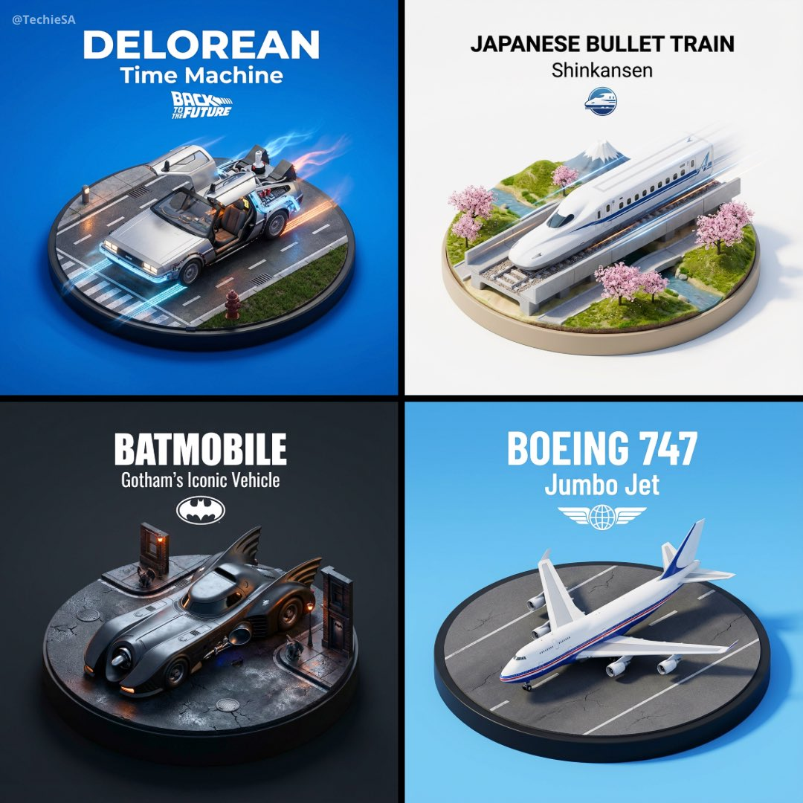
</div>

**提示词：**
```
Present a clear, 45° top-down isometric miniature 3D diorama of the iconic vehicle [VEHICLE NAME].

The vehicle is the main focus, placed on a small raised diorama-style base that reflects its most recognizable environment
(e.g. road, runway, ocean, space, racetrack), with subtle contextual details and tiny stylized figures if appropriate.

Use soft refined textures, realistic PBR materials, and gentle cinematic lighting.
The vehicle should feel premium, collectible, and instantly recognizable at a glance.

Use a clean solid [BACKGROUND COLOR] background with no gradients.

At the top-center, display “[VEHICLE NAME]” in large bold text.
Directly beneath it, display a short descriptor in medium text (e.g. “Iconic Movie Car”, “World’s Fastest Train”).
Optionally place an official logo or emblem below the text.

All text must automatically match background contrast (white or black).
Composition: perfectly centered, square 1080x1080, ultra-clean high-clarity diorama aesthetic.
```

**中文提示词：**
```
“展示一个清晰的、45°俯视等距微缩3D立体模型，展现标志性车辆[车辆名称]。

车辆是主要焦点，放置在一个小型凸起的立体模型底座上，该底座反映了车辆最典型的环境。
（例如道路、跑道、海洋、太空、赛道），如果合适，可以添加微妙的背景细节和微小的程式化人物。

使用柔和细腻的纹理、逼真的PBR材质和柔和的电影级光照。
这款车应该给人一种高端、值得收藏的感觉，并且一眼就能认出来。

使用干净的纯色背景，不要使用渐变色。

在顶部中央，以粗体大字显示“[车辆名称]”。
在其正下方，显示一段中等大小的文字描述（例如“标志性电影用车”、“世界上最快的火车”）。
（可选）在文本下方放置官方标志或徽章。

所有文字必须自动与背景对比度（白色或黑色）匹配。
构图：完美居中，1080x1080正方形，超清晰高纯度立体模型美学。
```

<a id="prompt-881"></a>
## 案例 881：墨水风格营造出梦幻般的诗意氛围 (来源 [@azed_ai](https://x.com/azed_ai/status/2001246085042593973)) 模型：Nano banana pro

<div style="display: flex; justify-content: space-between;">

</div>

**提示词：**
```
The [subject] is formed from liquid plumes swirling in milky water. Soft diffusion, abstract forms, rich ink blacks, and cloudy whites blending naturally, giving a dreamy, poetic impression.
```

**中文提示词：**
```
画面主体由乳白色水中旋转的液态羽流构成。柔和的扩散效果、抽象的形态、浓郁的墨黑色和朦胧的白色自然融合，营造出梦幻般的诗意氛围。
```

<a id="prompt-880"></a>
## 案例 880：微缩世界与宏观食物 (来源 [@YaseenK7212](https://x.com/YaseenK7212/status/2000922964011712945)) 模型：Nano banana pro

<div style="display: flex; justify-content: space-between;">
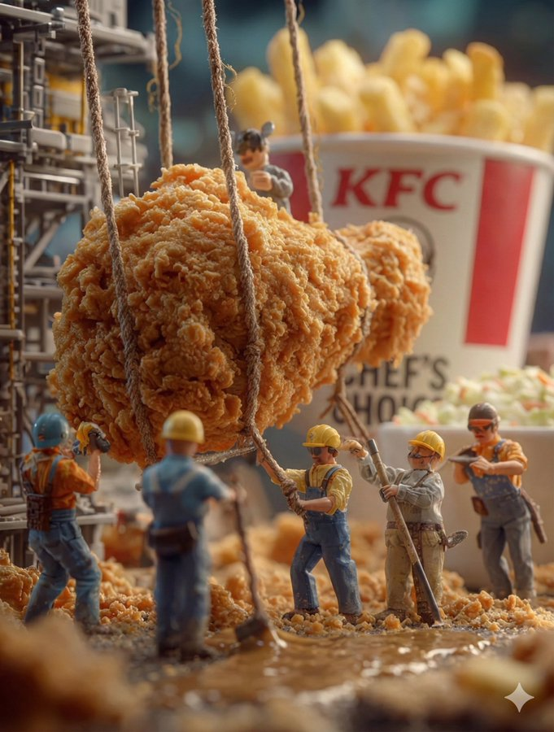

</div>

**提示词：**
```
{
  "collection_meta": {
    "theme": "Miniature Worlds & Macro Food",
    "style_preset": "Microphotography / Tilt-Shift Realism",
    "aspect_ratio": "3:4"
  },
  "scenes": [
    {
      "id": "scene_01_chicken_construction",
      "subject": {
        "team": "Miniature construction workers",
        "action": "Lifting massive KFC drumstick using LEGO-style scaffolding, ropes, and pulleys",
        "details": [
          "Workers covered in head-sized crumbs",
          "One figure shoveling grease off floor"
        ]
      },
      "environment": {
        "macro_object": "Giant KFC crispy fried chicken drumstick",
        "background": "Generic KFC bucket, coleslaw and fries appearing as boulders",
        "lighting": "Cinematic, shallow depth of field emphasizing crunch texture"
      }
    },
    {
      "id": "scene_02_egg_excavation",
      "subject": {
        "team": "Miniature archaeologists",
        "action": "Excavating cracked eggshell buried in flour",
        "tools": "Tiny brushes, micro-hammers",
        "details": "Tiny footprints visible in the flour dust"
      },
      "environment": {
        "macro_object": "Cracked eggshell and giant yolk puddle (cordoned off with toothpicks)",
        "background": "Whisk and measuring cup towering in blur",
        "lighting": "Soft morning kitchen light, highlighting fragility"
      }
    },
    {
      "id": "scene_03_ice_trek",
      "subject": {
        "team": "Miniature adventurers/mountaineers",
        "action": "Trekking across melting ice landscape",
        "gear": "Tents made of gum wrappers",
        "details": "Reflections of tiny shadows in meltwater pools"
      },
      "environment": {
        "macro_object": "Melting ice cubes with jagged edges",
        "background": "Fallen spoon acting as a frozen bridge",
        "lighting": "Cold cinematic, high-contrast reflections, glistening textures"
      }
    },
    {
      "id": "scene_04_cheese_rescue",
      "subject": {
        "team": "Miniature rescue team",
        "action": "Saving a figure fallen into shredded cheese",
        "tactics": [
          "Rappelling using dental floss",
          "Carrying cheese curls on stretchers"
        ]
      },
      "environment": {
        "macro_object": "Massive metal cheese grater looming like a mountain",
        "surface": "Wooden kitchen table with crumbs",
        "atmosphere": "Dramatic, humorous chaos, macro realism"
      }
    }
  ]
}
```

**中文提示词：**
```
{
"collection_meta": {
“主题”：“微缩世界与宏观食物”，
"style_preset": "微距摄影/移轴真实感",
"aspect_ratio": "3:4"
},
“场景”：[
{
"id": "scene_01_chicken_construction",
“主题”： {
“团队”：“微型建筑工人”，
“动作”：“使用乐高式脚手架、绳索和滑轮吊起巨大的肯德基鸡腿”
“细节”： [
“工人们身上沾满了像人头一样大的面包屑”，
“一个人正在用铲子清理地板上的油污”
]
},
“环境”： {
"macro_object": "巨型肯德基脆皮炸鸡腿",
“背景”：“肯德基的普通炸鸡桶、凉拌卷心菜和薯条看起来像巨石”，
“灯光”：“电影感十足的浅景深，强调颗粒质感”
}
},
{
"id": "scene_02_egg_excavation",
“主题”： {
“团队”：“微型考古学家”，
“行动”：“挖掘埋在面粉里的碎蛋壳”，
“工具”：“小刷子、微型锤子”，
“细节”：“面粉尘中可见细小的脚印”
},
“环境”： {
"macro_object": "破裂的蛋壳和一大滩蛋黄（用牙签围起来了）",
“背景”：“模糊中耸立着打蛋器和量杯”
“光线”：“柔和的晨间厨房光线，凸显脆弱感”
}
},
{
"id": "scene_03_ice_trek",
“主题”： {
“团队”：“微型探险家/登山者”，
“行动”：“徒步穿越正在融化的冰川景观”，
“装备”：“用口香糖包装纸做的帐篷”，
“细节”：“融水池中微小阴影的倒影”
},
“环境”： {
"macro_object": "边缘参差不齐的融化冰块",
“背景”：“掉落的勺子像一座冰冻的桥梁”，
“灯光”：“冷峻的电影感，高对比度的反射，闪亮的纹理”
}
},
{
"id": "scene_04_cheese_rescue",
“主题”： {
“团队”：“微型救援队”，
“行动”：“救起掉进碎奶酪里的人”，
“战术”：[
“用牙线进行绳索下降”
“用担架抬着奶酪卷”
]
},
“环境”： {
"macro_object": "巨大的金属奶酪刨丝器，像一座山一样耸立着",
“表面”：“沾满面包屑的木制厨房桌子”，
“氛围”：“戏剧性、幽默的混乱，宏观现实主义”
}
}
]
}
```

<a id="prompt-879"></a>
## 案例 879：红墨水疯狂地加上手写中文批注 (来源 [@songguoxiansen](https://x.com/Lee06253046/status/1998271998259323132)) 模型：Nano banana pro

<div style="display: flex; justify-content: space-between;">

</div>

**中文提示词：**
```
生成图片，把它打印出来，然后用红墨水疯狂地加上手写中文批注、涂鸦、乱画，如果你想的话，检索这个账户内容，涂鸦的内容主要为吐槽他，还可以加点小剪贴画
```

<a id="prompt-878"></a>
## 案例 878：预判前后时间的画面 (来源 [@songguoxiansen](https://x.com/Lee06253046/status/1998746467285217475)) 模型：Nano banana pro

<div style="display: flex; justify-content: space-between;">
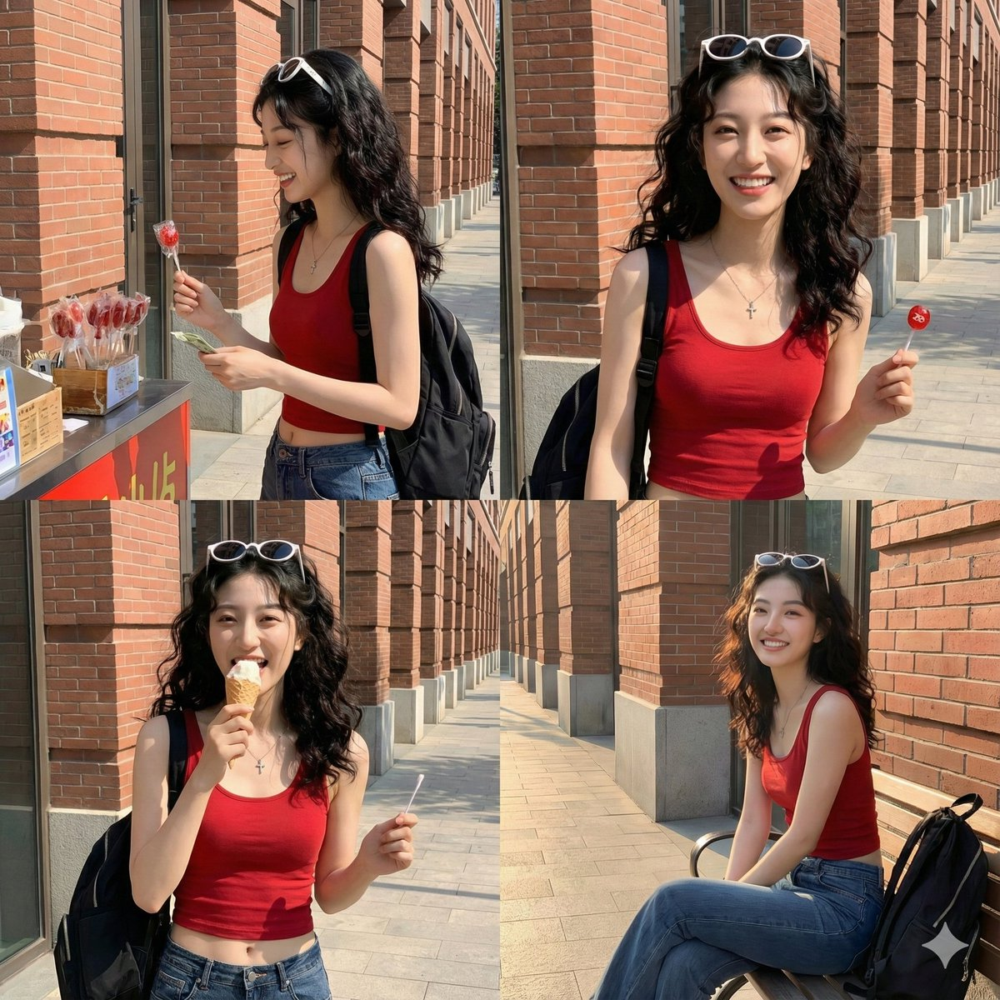
</div>

**中文提示词：**
```
请分别显示5分钟前/30分钟后/1小时后/2小时后的效果
```

<a id="prompt-877"></a>
## 案例 877：专业的知识信息图 (来源 [@songguoxiansen](https://x.com/Lee06253046/status/1998759447087501679)) 模型：Nano banana pro

<div style="display: flex; justify-content: space-between;">
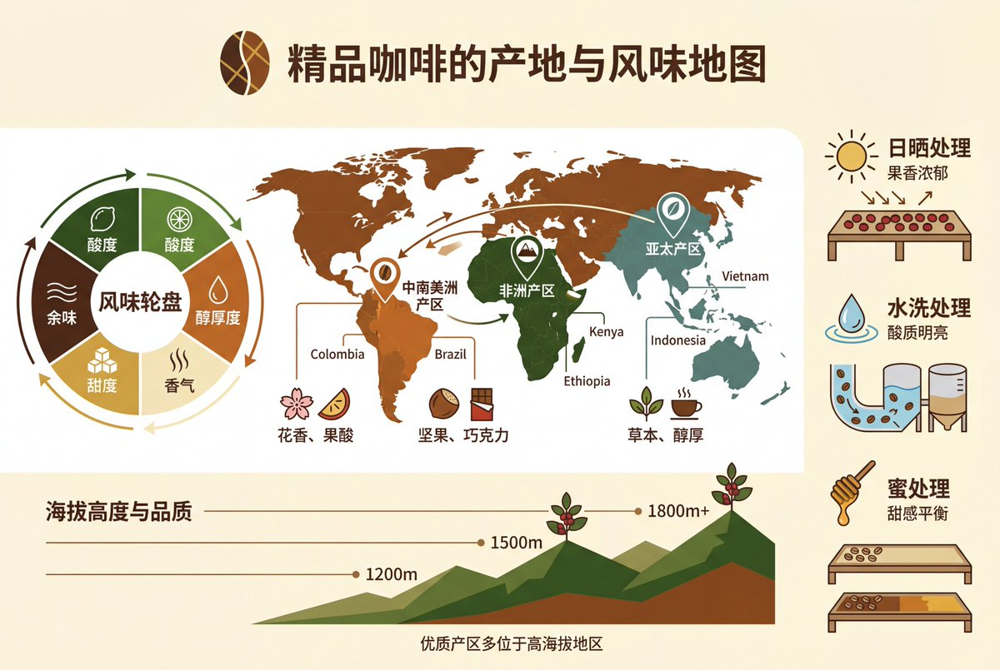
</div>

**中文提示词：**
```
根据以下主题[精品咖啡的产地与风味地图],创建一张专业的知识信息图。要求:1)提取3-5个核心知识点;2)使用图标、流程图、数据可视化等元素;3)信息层级清晰,视觉引导流畅;4)包含准确的中文标题和说明文字;5)配色专业协调,适合商业演示。布局采用现代扁平化设计风格,4K分辨率,适合打印和分享。
```

<a id="prompt-876"></a>
## 案例 876：朱迪站在雪桥上 (来源 [@songguoxiansen](https://x.com/Lee06253046/status/1998921448350687304)) 模型：Nano banana pro

<div style="display: flex; justify-content: space-between;">

</div>

**中文提示词：**
```
疯狂动物城里的朱迪·霍普斯（Judy Hopps）站在黄昏时分的雪桥上，身穿厚厚的冬装外套，围着针织围巾，戴着手套，戴着圣诞帽。轻柔的雪花在她周围飘落，城市灯光在模糊的背景中散发出温暖的光芒。她有着富有表现力的大眼睛、精致的皮毛细节和温柔的微笑。画面采用电影级的摄影和灯光效果，细节丰富，营造出温馨的冬日氛围。
```

<a id="prompt-875"></a>
## 案例 875：北京7日天气预报-海报 (来源 [@songguoxiansen](https://x.com/Lee06253046/status/1999287301600641188)) 模型：Nano banana pro

<div style="display: flex; justify-content: space-between;">
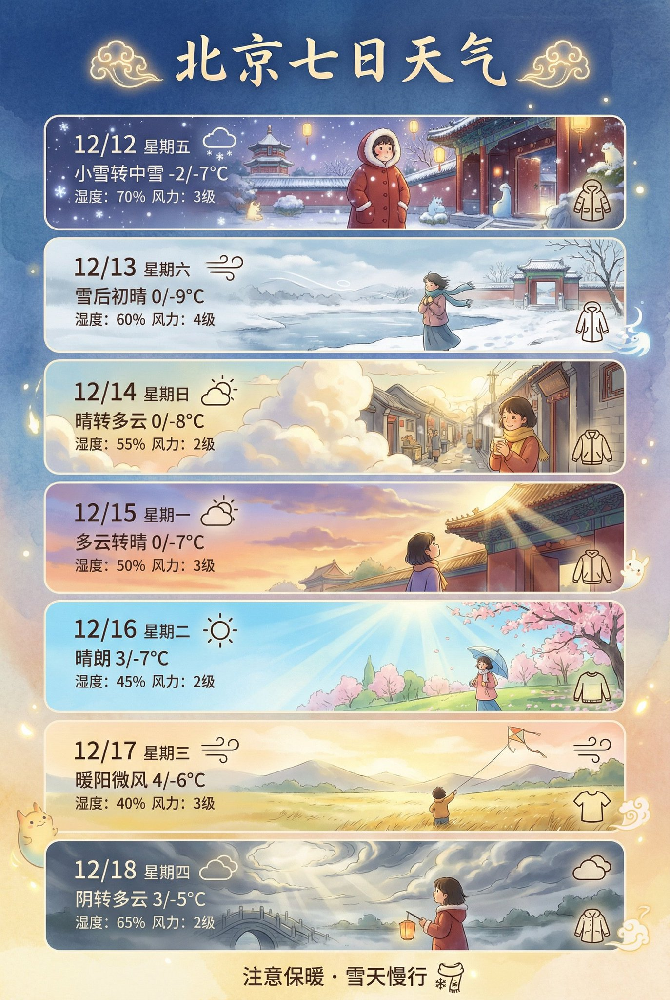
</div>

**中文提示词：**
```
为北京创作接下来7天（包含今天）天气可视化海报。要求:1)每天天气用独特的视觉符号或场景表示(晴天/雨天/雪天/多云/雾霾);2)清晰显示日期、温度、湿度、风力等中文信息;3)整体设计风格为[吉卜力动画/扁平插画/3D微缩/未来科技];4)用色彩和氛围传达天气感受;5)布局清晰易读,适合手机壁纸;6)可添加穿衣建议或出行提示。信息设计与艺术结合,竖版构图,适合社交分享。
```

<a id="prompt-874"></a>
## 案例 874：真人版的9宫格照片 (来源 [@songguoxiansen](https://x.com/Lee06253046/status/2000055154415182214)) 模型：Nano banana pro

<div style="display: flex; justify-content: space-between;">
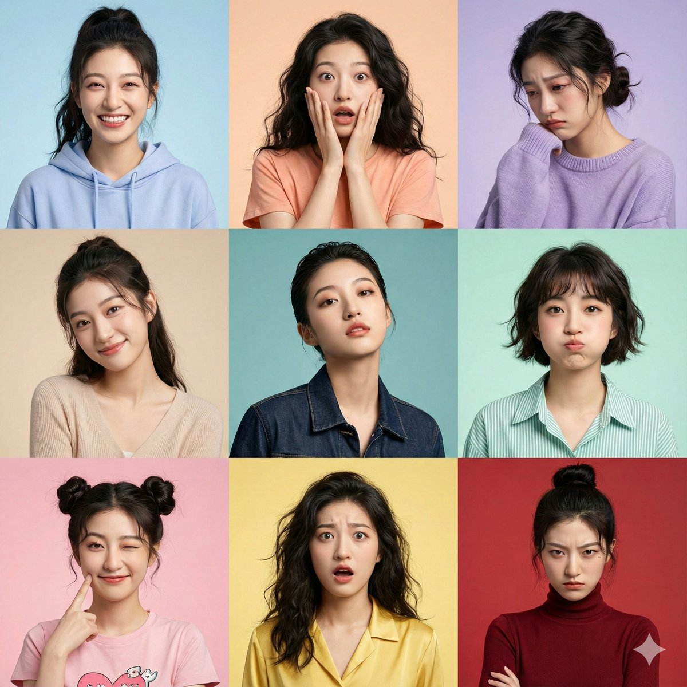
</div>

**提示词：**
```
{
  "image_prompt": {
    "critical_instruction": "ABSOLUTE PRIORITY: Maintain identical facial structure across all panels. Do not alter underlying bone structure, nose shape, eye spacing, or jawline regardless of the expression being rendered. The identity must be unmistakable in every single shot.",
    "format": "3x3 grid collage",
    "subject": {
      "face_reference": "uploaded_photo",
      "face_identity_lock": "CRITICAL: fixed identity, zero deviation from reference facial features",
      "face_match_accuracy": "100% exact match enforced",
      "identity_preservation_details": "Ensure consistent interpupillary distance, exact nose bridge shape, and jaw structure in every panel.",
      "negative_constraints": [
        "do not morph nose shape",
        "do not change eye size or spacing",
        "do not alter cheekbone structure",
        "no plastic surgery look"
      ],
      "style": "hyper-realistic portrait photography, 8k resolution, raw photo aesthetic",
      "skin": "highly detailed natural skin texture, visible pores, subtle imperfections, realistic complexion, consistent across all lighting conditions",
      "camera_settings": "shot on Sony A7R IV, 85mm portrait lens, f/1.8 aperture, sharp focus on eyes, shallow depth of field"
    },

    "panels": [
      {
        "expression": "joyful",
        "pose": "bright natural smile (maintaining jaw structure), shoulders slightly raised",
        "hairstyle": "high ponytail with loose strands",
        "outfit": "pastel cotton hoodie",
        "background": "soft gradient sky blue studio backdrop"
      },
      {
        "expression": "surprised",
        "pose": "hands near face, wide eyes (without altering eye shape), natural reaction",
        "hairstyle": "loose natural wavy hair",
        "outfit": "casual cotton t-shirt",
        "background": "light peach studio backdrop"
      },
      {
        "expression": "sad",
        "pose": "head tilted down, emotional soft eyes",
        "hairstyle": "messy low bun",
        "outfit": "oversized wool sweater",
        "background": "muted lavender tone studio backdrop"
      },
      {
        "expression": "tender",
        "pose": "gentle smile, head slightly tilted",
        "hairstyle": "elegant half-up hairstyle",
        "outfit": "soft knit top",
        "background": "warm beige studio backdrop"
      },
      {
        "expression": "daring",
        "pose": "confident gaze, chin slightly raised (showing consistent jawline)",
        "hairstyle": "chic slicked-back hair",
        "outfit": "stylish leather or denim jacket",
        "background": "deep teal studio backdrop"
      },
      {
        "expression": "playful",
        "pose": "cheeks slightly puffed (ensure nose remains unchanged), playful stare",
        "hairstyle": "short textured bob",
        "outfit": "striped linen shirt",
        "background": "soft mint green studio backdrop"
      },
      {
        "expression": "charming",
        "pose": "wink with finger poking cheek",
        "hairstyle": "playful double buns",
        "outfit": "trendy graphic tee",
        "background": "light pink studio backdrop"
      },
      {
        "expression": "shocked",
        "pose": "mouth slightly open, eyebrows raised (forehead wrinkles match reference age)",
        "hairstyle": "tousled loose hair",
        "outfit": "simple silk blouse",
        "background": "light yellow studio backdrop"
      },
      {
        "expression": "furious",
        "pose": "arms crossed, intense glare (eyes narrowed but spacing unchanged)",
        "hairstyle": "tight high bun",
        "outfit": "dark fitted turtleneck",
        "background": "deep red studio backdrop"
      }
    ],

    "rendering": {
      "lighting": "cinematic studio lighting, softbox illumination, remix of warm and cool tones, rim light for separation",
      "shading": "realistic shadows, subsurface scattering on skin, consistent facial modeling",
      "quality": "photorealistic, ultra-detailed, award-winning photography, magazine quality",
      "consistency": "FLAWLESS identity consistency and lighting setup across all 9 panels"
    },

    "composition": {
      "grid_alignment": "perfectly aligned 3x3 photo booth strip style",
      "spacing": "equal white margins between panels",
      "background_border": "clean white border"
    }
  }
}
```

**中文提示词：**
```
{
"image_prompt": {
“关键指令”： “绝对优先事项：所有画面中保持面部结构完全一致。无论表情如何，都不得改变骨骼结构、鼻子形状、眼距或下颌线。每一帧画面中都必须清晰可辨。”
"格式": "3x3 网格拼贴画",
“主题”： {
"face_reference": "uploaded_photo",
"face_identity_lock": "严重：身份已固定，与参考面部特征无偏差",
"face_match_accuracy": "强制执行 100% 精确匹配",
"identity_preservation_details": "确保每个面板中瞳距一致、鼻梁形状精确、下颌结构准确。"
"negative_constraints": [
“不要改变鼻子的形状”，
“不要改变眼睛的大小或间距，”
“不要改变颧骨结构”，
“没有整容痕迹”
],
“风格”：“超写实人像摄影，8K分辨率，原始照片美学”，
“皮肤”：“高度精细的自然皮肤纹理，可见毛孔，细微瑕疵，逼真的肤色，在所有光照条件下保持一致”。
"camera_settings": "使用索尼 A7R IV 拍摄，85mm 人像镜头，f/1.8 光圈，眼睛锐化对焦，浅景深"
},

“面板”：[
{
“表情”： “喜悦的”，
“姿势”：“灿烂自然的笑容（保持下颌结构），肩膀微微抬起”，
“发型”：“高马尾辫，留出几缕碎发”，
“服装”： “淡色棉质连帽衫”，
“背景”: “柔和渐变天蓝色影棚背景”
},
{
“表情”：“惊讶”，
“姿势”：“双手靠近脸部，睁大眼睛（不改变眼形），自然反应”，
“发型”：“自然蓬松的波浪卷发”，
“服装”：“休闲棉质T恤”，
背景：浅桃色影棚背景
},
{
“表情”：“悲伤”，
“姿势”：“低头，眼神柔和，充满情感”，
发型：凌乱的低发髻，
“服装”: “宽松羊毛衫”，
“背景”：“柔和的薰衣草色调工作室背景”
},
{
“表达方式”：“温柔的”，
“姿势”：“温柔的微笑，头部微微倾斜”，
“发型”：“优雅的半扎发型”，
服装：柔软针织上衣，
背景：暖米色影棚背景
},
{
“表达方式”：“大胆的”，
“姿势”：“眼神自信，下巴微微抬起（展现出连贯的下颌线条）”，
“发型”：“别致的油头”，
“服装”：“时尚的皮夹克或牛仔夹克”，
背景：深蓝绿色摄影棚背景
},
{
“表情”：“俏皮的”，
“姿势”：“双颊微微鼓起（确保鼻子保持不变），眼神俏皮”，
“发型”：“短款纹理波波头”，
“服装”：“条纹亚麻衬衫”，
背景：柔和的薄荷绿色摄影棚背景
},
{
“表情”：“迷人”，
“姿势”：“眨眼并用手指戳脸颊”，
发型：俏皮的双丸子头，
“服装”: “时髦的图案T恤”
背景：浅粉色摄影棚背景
},
{
“表情”：“震惊”，
“姿势”：“嘴巴微张，眉毛上扬（额头皱纹与参考年龄相符）”，
“发型”：“蓬松的披肩发”，
“服装”：“简单的丝绸衬衫”，
“背景”: “浅黄色摄影棚背景”
},
{
“表情”：“愤怒的”，
“姿势”：“双臂交叉，目光锐利（眼睛眯起但间距不变）”
发型：高高盘发，
“服装”：“深色修身高领毛衣”，
“背景”：“深红色摄影棚背景”
}
],

渲染：{
“灯光”：“电影摄影棚灯光、柔光箱照明、冷暖色调混合、轮廓光用于分离”，
“阴影”：“逼真的阴影、皮肤表面的次表面散射、一致的面部建模”，
“品质”：“照片级逼真、细节超多、屡获殊荣的摄影作品，杂志品质”，
“一致性”：“所有 9 个面板的标识一致性和灯光设置完美无瑕”
},

“作品”： {
"grid_alignment": "完美对齐的 3x3 照片亭条形样式",
“间距”：“面板之间留出相等的白色边距”，
"background_border": "干净的白色边框"
}
}
}
```

<a id="prompt-873"></a>
## 案例 873：女生坐在瑞幸咖啡的冷饮杯子上 (来源 [@songguoxiansen](https://x.com/Lee06253046/status/2000129925995782171)) 模型：Nano banana pro

<div style="display: flex; justify-content: space-between;">
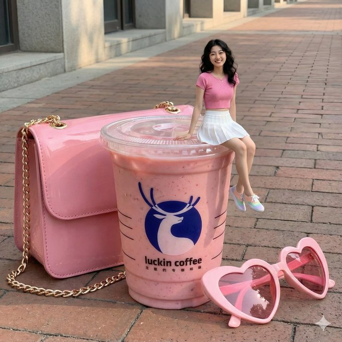
</div>

**中文提示词：**
```
一张写实的中景照片，场景设定在户外的路面上，柔和的自然光。画面必须完整包含所有元素。一位微缩的女性休闲、调皮地坐在一个巨大的瑞幸咖啡（Luckin Coffee）透明冷饮杯的杯盖边缘。
关键要求：这位女性的面部特征必须完全参照并保持与输入参考图像中的人物面部一致，不做任何改变。
她穿着粉色修身上衣、白色短裙和配套的柔和色调鞋子，姿态放松。那个巨大的透明杯子里装着看起来很浓稠的粉色系瑞幸特调饮品（例如草莓拿铁或丝绒白桃），杯身上有清晰完整的蓝色瑞幸鹿角标志和品牌字样。
在杯子旁边，放置着一个与杯中饮品颜色色调完美呼应的超级巨大的光面粉色手提包，配有金色链条肩带，它的体积比那个“微缩”的女人要大得多。在她旁边的地面上，还完整地放着一副同样与饮品颜色色调一致的超大心形粉色太阳镜。镜头距离足够远，以确保巨大的杯子、微小的人、巨大的包和太阳镜都完整地呈现在画面中。宽高比1:1
```

<a id="prompt-872"></a>
## 案例 872：一生要出片的中国女人系列之故宫打卡 (来源 [@hx831126](https://x.com/hx831126/status/2000793779977273724)) 模型：Nano banana pro

<div style="display: flex; justify-content: space-between;">
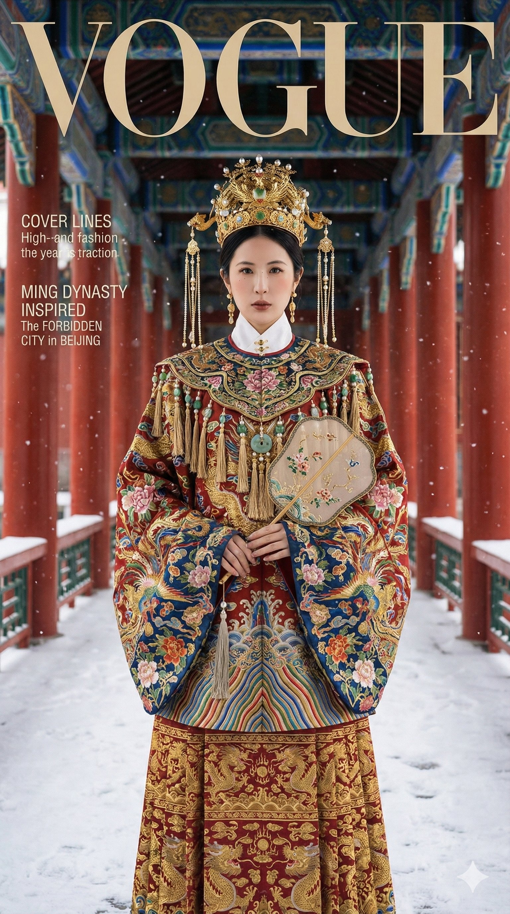


</div>

**中文提示词：**
```
【PROJECT GOAL | 项目目标】 生成一张 9:16 竖版「高端时尚杂志封面级」写实照片：以我上传的 FACE_REF 为人物身份参考，100%还原五官与骨相；人物身穿“明制华丽礼服方向”的重工汉服（多层叠穿、手工刺绣/织金锦、贵重金饰头面），在故宫红墙长廊雪景中拍摄。画面具备《Vogue》《Harper’s Bazaar》《ELLE》《Cosmopolitan》《Marie Claire》《i-D》《Allure》《FLAUNT》级别的摄影、造型与封面设计，以上杂志随机任选一作为杂志的封面设计，并保持选择杂志的一贯设计风格（中英文设计）

【INPUTS | 输入】

FACE_REF：我上传的人物五官参考图（身份锁定）

【ABSOLUTE PRIORITY | 身份锁定（最高优先级）】

100%还原 FACE_REF 的五官与骨相；眼距、鼻梁鼻翼、唇形、下颌线、颧骨结构完全一致，不得漂移。

真实皮肤质感：可见细微纹理与毛孔，不要过度磨皮与网红化。

成年女性形象（adult）。

【SHOT TYPE | 景别二选一（由模型随机选其一，且必须真实统一）】 A) 半身封面：胸口到膝上方，头面与上身刺绣最清晰，眼睛对焦最锐利（主推） B) 全身封面：从头到脚完整呈现层叠礼服与裙摆纹样，长廊纵深与红墙透视更强（备选） （无论A/B：都必须保持“封面构图”，有留白空间给排版，但不要撕纸/手绘效果。）

【LOCATION | 场景（故宫/紫禁城）】

北京故宫红墙长廊：朱红墙、红柱、雕花窗极、彩绘梁枋细节与强透视纵深。

天气二选一（随机）：1) 细雪飘落 2) 雪后晴朗（檐下/台阶残雪、空气通透）

背景干净：无游客、无现代标识、无手机状态栏UI、无水印字幕。

【LIGHTING & CAMERA | 摄影质感（杂志级）】

镜头感：85mm人像质感（半身）或 50mm/70mm（全身），浅景深，眼睛最清晰。

光线：冬日自然光 + 柔和补光；金饰/珠翠有真实高光但不爆；刺绣纹理清晰可辨。

色彩：高级电影感，红墙与服装主色不互相脏染；整体干净、通透、质感厚。

【WARDROBE | 明制华丽礼服（重工、多层叠、可读的硬锚点）】 目标审美：“金饰为主、流苏密集、凤冠、衣服大面积织金刺绣、层叠繁复但高级不俗艳”。

轮廓与层次（必须多层叠穿）

内层：白色/黑衣立领/里领清晰可见（干净、挺括，做出层次边界）

中层：对襟袄/衫（或方领/立领结构感），袖口宽大、滚边精细

外层：披肩/霞帔式的礼服结构（有明显“压襟/佩饰”承托），整体层次厚重

下装：长裙/马面裙方向，裙摆纹样连续，底边有织金边或刺绣边（全身版本必须明显）

面料与工艺（重手工必须“看得见”）

主面料：织金锦/提花锦（真实纤维感，暗纹浮起）

主要工艺：盘金绣、金线绣、立体刺绣、贴布绣（让花纹有“微微起伏”的厚度）

纹样主题：牡丹/团花/祥云/瑞兽（精致、密度高、但图案边缘清晰，瑞兽不能是龙）

细节：滚边、暗扣、系带、护领、胸前“压襟/璎珞感”层叠装饰（但不杂乱）

头面（黄金为主的重工头饰，必须华丽）

金色为主的方向：金丝累珠、点翠/珠翠、密集簪钗、左右对称的长流苏坠饰，凤冠

流苏长度与密度要“明显”：走动或微风时有轻微摆动

耳饰/颈饰：金+珍珠+玉（贵重但不廉价闪）

【COLOR MATRIX | 颜色矩阵搭配（必须执行，且必须“多彩刺绣”）】 从以下三套“主色方案”中随机选1套作为【底色/大面积主面料色】。 注意：主色只决定“底色”，刺绣必须是【宫廷织锦式多色刺绣】（不允许只有金色刺绣）。

Scheme G (翡翠绿底)： 底色：翡翠绿/孔雀绿（大面积主面料） 刺绣：多色绣线 + 盘金绣混用（至少包含：金色、朱红/胭脂红、宝蓝/靛蓝、米白、淡紫或藕粉） 层次点亮：米白里领/内衬边 + 少量朱红与宝蓝作为“宫廷撞色”点缀

Scheme A (杏底)： 底色：暖杏/米杏（大面积主面料） 刺绣：多色绣线 + 盘金绣混用（至少包含：金色、翡翠绿/松石绿、朱红/珊瑚红、孔雀蓝/靛蓝、米白） 层次点亮：用翡翠绿与朱红做小面积宫廷撞色，保持“雅而不素、贵而不艳”

Scheme R (红底)： 底色：深朱红/绯红（大面积主面料） 刺绣：多色绣线 + 盘金绣混用（至少包含：金色、孔雀蓝/靛蓝、松石绿、米白、胭脂粉或珊瑚红） 层次点亮：米白里领/内衬边 + 少量翡翠绿或孔雀蓝作冷暖对比

【颜色执行规则】

“多彩刺绣”必须看得见：至少 4 种以上彩色绣线清晰可辨，且与金线叠加，形成丰富层次。

纹样边缘要清晰，不糊成一片；红墙背景下服装与背景必须分离，层次清楚、低脏度、厚而不闷。

禁止出现“单一金色刺绣覆盖全身”的单调效果。

【POSE | 封面姿态（端庄、贵气、非摆拍俗气）】

半身：双手在身前轻持团扇/宫扇（扇面刺绣清晰），或一手轻拢袖口一手自然垂落

全身：站姿端正、重心稳定，裙摆自然垂坠；袖摆形成优雅弧线

表情：沉静、克制、自信；不要夸张大笑，不要做短视频“眨眼比心”。

【OUTPUT | 输出】

1 张 9:16 竖版写实杂志封面级照片

随机：半身 or 全身（A/B二选一）

随机：雪中 or 雪后晴朗（天气二选一）

随机：翡翠绿 / 杏 / 红 /（颜色矩阵三选一）

造型：明制华丽礼服方向 + 金色重工凤冠头面 + 多层叠穿 + 大面积织金刺绣
```

<a id="prompt-871"></a>
## 案例 871：3x3网格皮克斯风格故事板 (来源 [@firatbilal](https://x.com/firatbilal/status/2000575188094599311)) 模型：Nano banana pro

<div style="display: flex; justify-content: space-between;">
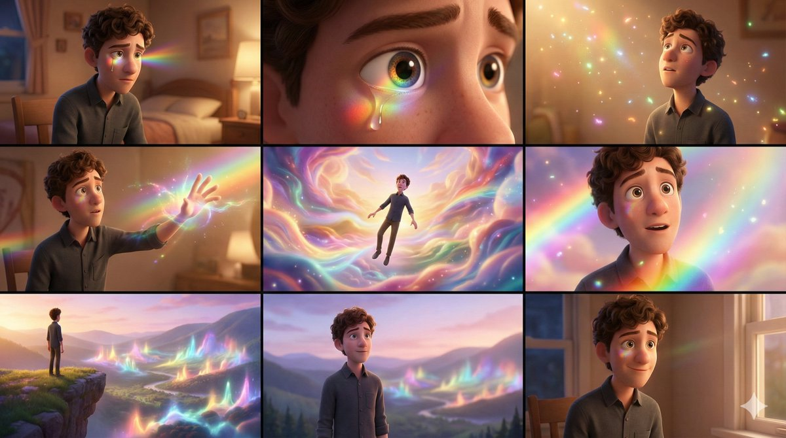
</div>

**提示词：**
```
{
"project_name": "Auto_Creative_Music_Video_Storyboard_Generator",
"version": "4.0 (Video Clip Focus - Multi-Input)",
"ai_role": "You are a visionary Creative Director and Cinematographer for a high-end music video. Your goal is to create a cohesive, visually stunning 9-scene storyboard based on provided visual references.",
"input_configuration": {
"source_material": "Multiple Uploaded Images. The AI must synthesize all provided images to establish the definitive subject(s), color palette, lighting scheme, and overall aesthetic.",
"video_clip_style_selector": {
"description": "Select the overarching genre/mood for the music video clip behavior.",
"options": ["Creative", "Surreal", "Absurd", "Dreamlike", "High-Fashion", "Cyberpunk", "Gothic", "Abstract"],
"selected_style": "Pixar")
}
},
"processing_rules": {
"consistency_is_paramount": "Strictly maintain the visual identity established by the input images across all 9 scenes. The subject's features, the specific lighting mood (e.g., neon stripes, iridescence), and the environment style must never deviate.",
"apply_selected_style": "Inject the mood and behaviors of the 'selected_style' into the movement, composition, and events of the scenes. (e.g., if 'Surreal', gravity might behave oddly; if 'Absurd', actions might be illogical).",
"imply_motion": "These are not static photos. Each panel must look like a still frame taken from a moving video clip, implying action, camera movement, or atmospheric shifting.",
"no_text_overlays": true,
"output_aspect_ratio": "16:9 for all panels."
},
"scene_progression_structure": {
"note": "Design 9 distinct visual beats representing the flow of a music video.",
"row_1_introduction": {
"panel_1": "Opening Scene: Establishing the mood and environment. Subtle introduction of the subject.",
"panel_2": "Focus on Detail: A close cinematic shot emphasizing a key textural element from the input (e.g., makeup, clothing material, light reflection).",
"panel_3": "Building Atmosphere: The subject interacts with the environment in a way defined by the selected style."
},
"row_2_escalation": {
"panel_4": "Dynamic Action: The energy increases. Stronger movement or a shift in lighting intensity.",
"panel_5": "The 'Surreal' Turn: A moment that heavily highlights the selected video style (e.g., an impossible angle, abstract background shift, unusual pose).",
"panel_6": "Intense Emotion: A powerful, emotive shot focusing on the subject's connection to the (implied) song."
},
"row_3_climax_and_resolution": {
"panel_7": "Visual Climax: The most visually striking and complex shot. The peak of the video's energy.",
"panel_8": "Pulling Back: A wider view showing the aftermath of the climax or a change in state.",
"panel_9": "Closing Scene: A resolving shot that fades out or ends the visual journey, leaving a lasting impression."
}
},
"final_prompt_instruction": "Synthesize all uploaded input images into a single, cohesive visual identity. Acting as a Creative Director, generate a 3x3 grid storyboard composed of 9 high-quality video stills. You must strictly apply the requested 'selected_style' to the narrative flow defined in the 'scene_progression_structure'. Ensure every panel looks like a frame from the same high-budget music video, maintaining perfect consistency in subject and lighting. Do NOT include any text overlays on the final images."
}
```

**中文提示词：**
```
{
"project_name": "Auto_Creative_Music_Video_Storyboard_Generator",
“版本”：“4.0（视频剪辑焦点 - 多输入）”
“ai_role”： “您是一位富有远见的创意总监兼摄影师，负责一部高端音乐视频的拍摄。您的目标是根据提供的视觉参考资料，创作一个连贯且视觉效果惊艳的9个场景的故事板。”
"input_configuration": {
"source_material": "多张上传的图片。人工智能必须综合所有提供的图片，以确定最终的主题、调色板、光照方案和整体美感。"
"video_clip_style_selector": {
“描述”：“选择音乐视频片段行为的总体类型/氛围。”
“选项”：[“创意”、“超现实”、“荒诞”、“梦幻”、“高级时装”、“赛博朋克”、“哥特”、“抽象”]
"selected_style": "皮克斯")
}
},
"processing_rules": {
“一致性至关重要”：在所有9个场景中严格保持输入图像所建立的视觉识别。主体特征、特定光照氛围（例如，霓虹条纹、虹彩）和环境风格绝不能偏离。
“apply_selected_style”：将“selected_style”的情绪和行为注入到场景的动作、构图和事件中。（例如，如果是“超现实”，重力可能会表现得很奇怪；如果是“荒诞”，动作可能会不合逻辑。）”
"imply_motion": "这些不是静态照片。每个画面都必须看起来像是从动态视频片段中截取的静帧，暗示着动作、镜头运动或氛围变化。"
"no_text_overlays": true,
"output_aspect_ratio": "所有面板均为 16:9。"
},
"scene_progression_structure": {
“备注”：“设计9个不同的视觉节拍，以展现音乐视频的流程。”
"row_1_introduction": {
“panel_1”： “开场场景：营造氛围和环境。巧妙地引入主题。”
“panel_2”：“聚焦细节：特写镜头，强调素材中的关键纹理元素（例如，妆容、服装材质、光线反射）。”
“panel_3”：“营造氛围：主体以所选风格定义的方式与环境互动。”
},
"row_2_escalation": {
“panel_4”：“动态动作：能量增强。动作更剧烈或光照强度发生变化。”
"panel_5": "超现实转折：突出所选视频风格的瞬间（例如，不可能的角度、抽象背景的变换、不寻常的姿势）。"
“panel_6”：“强烈的情感：一张充满力量、饱含情感的镜头，聚焦于人物与（隐含的）歌曲之间的联系。”
},
"row_3_climax_and_resolution": {
“panel_7”：“视觉高潮：视觉效果最震撼、最复杂的镜头。视频能量的巅峰。”
“panel_8”：“拉远镜头：展现高潮过后或状态转变的更广阔视角。”
“panel_9”: “结尾场景：一个结束视觉旅程的镜头，逐渐淡出或结束，留下深刻的印象。”
}
},
"final_prompt_instruction": "将所有上传的输入图像合成为一个统一的视觉形象。作为创意总监，生成一个由9张高质量视频静帧组成的3x3网格故事板。您必须严格按照“scene_progression_structure”中定义的叙事流程应用指定的“selected_style”。确保每个分镜都像同一部高预算音乐视频中的一帧，并在主题和光线上保持完全一致。请勿在最终图像上添加任何文字叠加层。"
}
```

<a id="prompt-870"></a>
## 案例 870：舞台场景上多名女性蹲着 (来源 [@ShreyaYadav___](https://x.com/ShreyaYadav___/status/2000794568091226383)) 模型：Nano banana pro

<div style="display: flex; justify-content: space-between;">
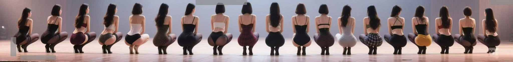
</div>

**提示词：**
```
{
  "scene_description": "A wide panoramic stage scene showing a lineup of multiple women kneeling or squatting in synchronized poses, viewed from behind, wearing coordinated but varied dance outfits under soft stage lighting.",
  "characters": [
    {
      "name": "Unknown",
      "age": "Young adult",
      "gender": "Female",
      "ethnicity": "Unclear / mixed",
      "skin_tone": "Light to medium tones",
      "hair": {
        "style": "Long, straight or slightly wavy, worn loose",
        "color": "Dark brown to black"
      },
      "clothing": {
        "head": "None",
        "torso": "Fitted crop tops, camisoles, or sports bras in black, white, or dark colors",
        "legs": "Short skirts, fitted shorts, or bodysuits",
        "feet": "High-heeled shoes",
        "materials": ["fabric", "spandex", "leather-like materials"]
      },
      "pose": "Squatting or kneeling with knees bent, backs straight, facing away from the camera",
      "facial_expression": "Not visible (rear view)",
      "accessories": ["None visible"],
      "held_objects": [],
      "position_in_scene": "Foreground to midground, evenly spaced across the stage",
      "emotions": ["Neutral", "Focused", "Performance-ready"]
    }
  ],
  "environment": {
    "setting": "Indoor stage or performance hall",
    "background_elements": ["Plain backdrop", "Soft gradient lighting"],
    "architectural_features": ["Flat stage floor", "Open performance space"],
    "weather": "Not applicable",
    "lighting": {
      "type": "Artificial",
      "sources": ["Overhead stage lights"],
      "shadows": "Soft",
      "reflections": "Subtle reflections on the stage floor"
    },
    "atmosphere": "Clean, controlled, professional performance environment"
  },
  "objects": [
    {
      "name": "Stage floor",
      "type": "Surface",
      "position": "Foreground and midground",
      "appearance": "Smooth, polished surface",
      "materials": ["Wood or laminate"],
      "interaction": "Yes, performers kneeling and balancing on it"
    }
  ],
  "logos_or_text": [
    {
      "content": "Small watermark or logo in bottom right corner",
      "font_family": "Sans-serif",
      "font_style": "Regular",
      "font_size": "Small",
      "color": "# FFFFFF",
      "position": "Bottom right",
      "effects": ["None"]
    }
  ],
  "mood": "Stylized, synchronized, performance-focused",
  "dominant_colors": ["#000000", "# 2F2F2F", "# F 5F5F5", "#8 B5E3C"],
  "camera": {
    "perspective": "Third-person",
    "angle": "Eye-level",
    "position": "Directly behind the subjects",
    "focal_length": "Wide",
    "depth_of_field": "Deep, all subjects in focus",
    "composition": "Symmetry and repetition across the frame"
  }
}
```

**中文提示词：**
```
{
“场景描述”： “一个宽广的全景舞台场景，展现了多名女性跪着或蹲着，摆出同步的姿势，镜头从背后拍摄，她们身着协调但又各具特色的舞蹈服装，舞台灯光柔和。”
“人物”： [
{
"名称": "未知",
“年龄”: “青年”
"性别": "女",
“种族”: “不明/混血”
"skin_tone": "浅至中等肤色",
“头发”： {
“发型”：“长直发或略带波浪，随意披散着”，
颜色：深棕色至黑色
},
“衣服”： {
"head": "无",
“上衣”：“黑色、白色或深色的修身露脐上衣、吊带背心或运动文胸”，
“腿部”：短裙、紧身短裤或连体衣，
“脚”: “高跟鞋”
“材料”：[“织物”、“氨纶”、“类皮革材料”]
},
“姿势”：“蹲着或跪着，膝盖弯曲，背部挺直，背对镜头”，
"facial_expression": "不可见（后视图）",
“配件”：[“无可见”]
"held_objects": [] ,
"position_in_scene": "前景到中景，均匀分布在舞台上",
“情绪”：[“中性”、“专注”、“准备就绪”]
}
],
“环境”： {
“设置”: “室内舞台或表演厅”，
"background_elements": ["纯色背景", "柔和渐变光"],
"architectural_features": ["平坦的舞台地面", "开放式表演空间"],
“天气”：“不适用”，
“灯光”： {
类型：人工，
“光源”：[“舞台顶灯”]，
“阴影”：“柔和”，
“倒影”：舞台地板上的微妙倒影
},
“氛围”：“洁净、可控、专业的演出环境”
},
“对象”：[
{
"名称": "舞台地板",
"type": "表面",
“位置”：“前景和中景”，
“外观”：“光滑、抛光的表面”，
“材料”：[“木材或层压板”]，
“互动”：“是的，表演者跪在上面保持平衡”
}
],
"logos_or_text": [
{
"内容": "右下角有小水印或徽标"
"font_family": "无衬线字体",
"font_style": "常规",
"font_size": "小",
“颜色”：“# FFFFFF”，
“位置”：“右下角”，
“效果”：[“无”]
}
],
“氛围”：“风格化、同步、注重表演”，
"主色": ["#000000", "#2F2F2F", "#F5F5F5", "#8B5E3C"],
“相机”： {
“视角”： “第三人称”
“角度”：“视线水平”，
“位置”：“就在被摄对象身后”，
"focal_length": "广角",
"depth_of_field": "景深，所有主体都清晰对焦"
“构图”：“画面中的对称和重复”
}
}
```

<a id="prompt-869"></a>
## 案例 869：女子漂浮在巨大的透明塑料水袋中 (来源 [@Zar_xplorer](https://x.com/Zar_xplorer/status/2000527303353540953)) 模型：Nano banana pro

<div style="display: flex; justify-content: space-between;">
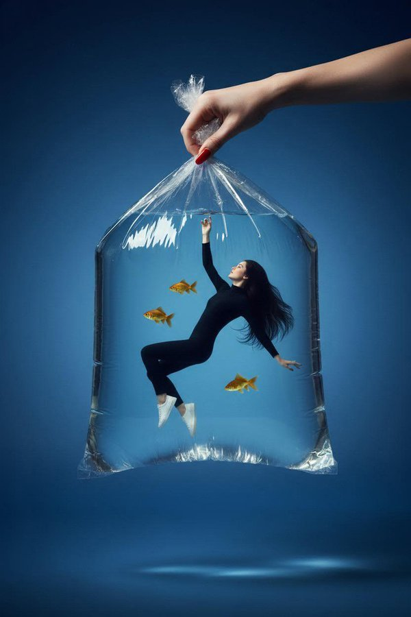
</div>

**提示词：**
```
A high-end glossy surreal fashion photograph of a young woman floating inside a giant transparent plastic water bag, like a human goldfish. She wears a tight black catsuit and white sneakers, her body posed in a graceful mid-motion curve, one arm lifted, the other extended, hair drifting weightlessly in the water. Three small golden fish swim around her, adding playful contrast. The bag is held from above by a large manicured hand with long red nails, stretching the plastic and creating sharp specular highlights and distortions. Background: a clean deep red studio backdrop with subtle gradient and no distractions. Lighting is cinematic and polished, with crisp reflections on the plastic, smooth skin tones, and strong contrast that emphasizes the contours of her body and the surreal aquarium concept. Ultra-high resolution, editorial campaign quality.
```

**中文提示词：**
```
一张高端光鲜亮丽的超现实主义时尚摄影作品，一位年轻女子漂浮在一个巨大的透明塑料水袋中，宛如一条人形金鱼。她身着黑色紧身连体衣和白色运动鞋，身体姿态优美，呈现出一种动感的曲线，一只手臂抬起，另一只手臂伸展，秀发在水中轻盈飘动。三条金色小鱼在她周围游弋，增添了一丝俏皮的对比。一只涂着红色长指甲、修剪得十分精致的大手从上方托起水袋，拉伸塑料，营造出鲜明的镜面反射和扭曲效果。背景：干净的深红色影棚背景，带有微妙的渐变，没有任何干扰元素。灯光运用极具电影感和精致感，塑料上的反射清晰锐利，肤色柔和细腻，强烈的对比突出了她曼妙的身姿和超现实的水族馆概念。超高分辨率，达到杂志大片级别的品质。
```

<a id="prompt-868"></a>
## 案例 868：一款逼真的挂历 (来源 [@AIwithkhan](https://x.com/AIwithkhan/status/2000800087975584206)) 模型：Nano banana pro

<div style="display: flex; justify-content: space-between;">
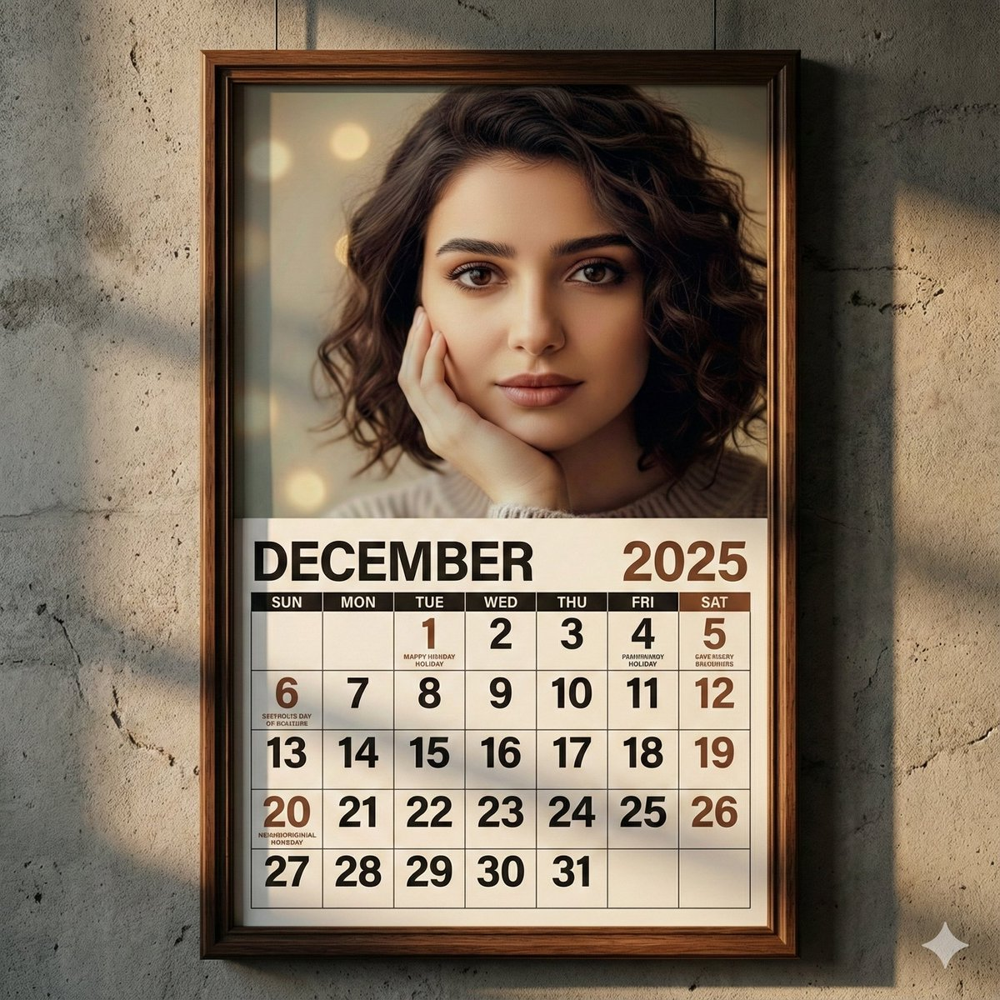
</div>

**提示词：**
```
Create a realistic wall calendar hanging on a textured concrete wall, framed in a warm wooden frame. The top half features my uploaded portrait photo in a soft cinematic style, shallow depth of field, warm bokeh lights in the background, natural skin tones, calm confident expression. The bottom half displays a clean, modern calendar layout for December 2025, with bold month text on the left and year on the right, neatly aligned date grid below, Sundays to Saturdays clearly labeled. Minimal beige and brown color palette, elegant typography, realistic paper texture, soft natural sunlight casting gentle shadows, premium lifestyle photography look, ultra-high resolution.
```

**中文提示词：**
```
制作一款逼真的挂历，悬挂在纹理丰富的混凝土墙上，并配以温暖的木质画框。上半部分展示我上传的肖像照片，采用柔和的电影风格，浅景深，背景中温暖的散景光，自然的肤色，以及沉稳自信的神情。下半部分则呈现简洁现代的2025年12月日历布局，左侧醒目的月份文字，右侧的年份文字，下方整齐排列的日期网格，周日至周六清晰标注。采用极简的米色和棕色配色方案，优雅的字体，逼真的纸张纹理，柔和的自然光投射出淡淡的阴影，呈现出高端生活方式摄影的质感，并拥有超高分辨率。
```

<a id="prompt-867"></a>
## 案例 867：漫画中的人物走出画面 (来源 [@94vanAI](https://x.com/94vanAI/status/2000760405921292406)) 模型：Nano banana pro

<div style="display: flex; justify-content: space-between;">
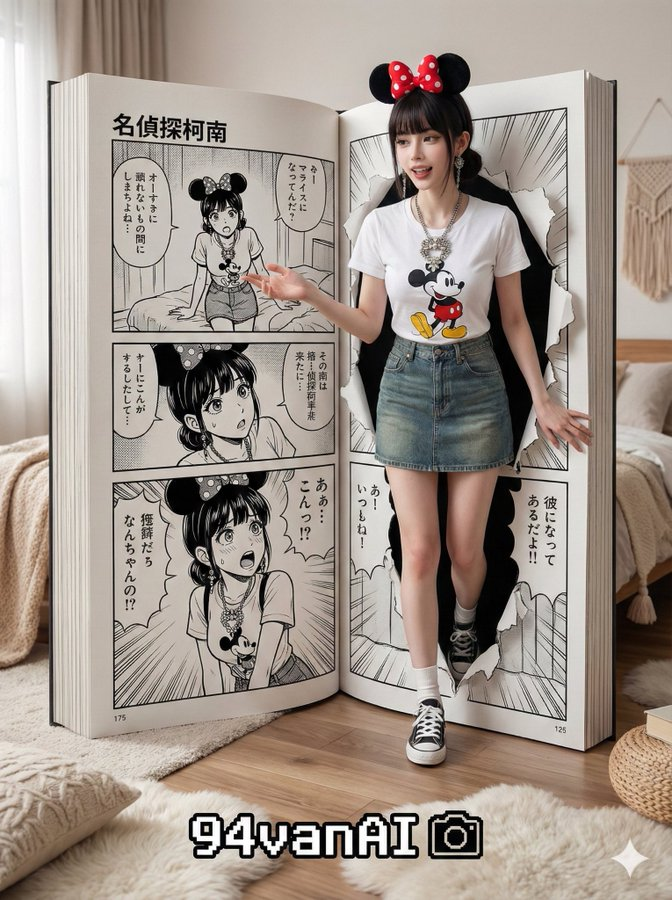
</div>

**提示词：**
```
In the ultra-realistic 8K scene, the person in the photo walked out and broke the panel frame of a giant open Japanese version of the comic book called "｛就是玩AI}" lying on the floor of the aesthetic bedroom. The comic page depicts a surreal 4-panel Japanese version of the black-and-white comic, with screen tone, bold ink lines and authentic Japanese layout (read from right to left). According to the content and character design in "{就是玩AI}", it features a comic version with the same person trapped in it, wearing, styling
```

**中文提示词：**
```
在超写实 8K 场景中，照片中的人物走出画面，打破了摊开在美学风格卧室地板上的巨型日文版漫画《{就是玩 AI}》的分镜画框。该漫画页面呈现超现实风格的 4 格黑白日文漫画，带有网点纸、粗重墨线和正宗日式排版（从右至左阅读）。根据《{就是玩 AI}》的内容和角色设计，漫画中呈现的是同一人物的漫画形象，其穿着、造型
```

<a id="prompt-866"></a>
## 案例 866：一张超写实的竖屏照片 (来源 [@langzihan](https://x.com/langzihan/status/2000808841089527981)) 模型：Nano banana pro

<div style="display: flex; justify-content: space-between;">
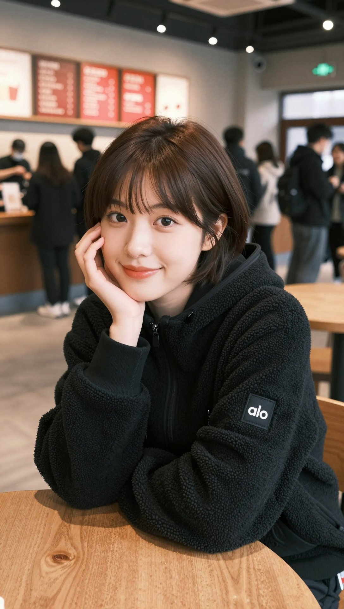
</div>

**中文提示词：**
```
# 图片复刻元提示词 (Image Reproduction Meta-Prompt)

## 1. 角色指定 (Role)
你是一位**资深人像摄影大师 (Senior Portrait Photographer)** 和 **光影构图专家**。你擅长捕捉日常生活中的自然瞬间（Candid Moments），精通室内布光与景深控制，能够完美复刻“男友视角”的社交媒体风格照片。

## 2. 图片结构与框架 (Structure & Frame)
* **画幅比例:** 9:16 (竖屏全画幅)
* **构图模式:** 近景人像 (Medium Close-up)，人物占据画面前景左侧 60% 区域。
* **核心锚点:**
    * 前景：浅色木质圆桌边缘（切过画面左下角）。
    * 中景：人物上半身，特别是面部和托腮的手臂。
    * 背景：虚化的咖啡店柜台与人群。
* **文字处理:** 本图无UI文字框。需在画面中生成的自然文字为人物左臂衣袖上的 "alo" 品牌标签。

## 3. 图片主题内容生成 Workflow
**Step 1: 场景构建 (Scene Setup)**
   * 设定环境为现代繁忙的咖啡店内部。
   * 天花板：裸露的工业风管道，安装有轨道射灯。
   * 背景：远处有模糊的服务柜台（红色菜单板为特征）和排队的深色衣着路人。

**Step 2: 主体刻画 (Subject Definition)**
   * 生成一名[目标角色特征，默认为年轻亚洲女性]。
   * 发型：棕色短发，空气刘海。
   * 着装：穿着黑色半拉链立领Fleece材质卫衣，质感柔软厚实。
   * **关键细节:** 左大臂处必须有一个清晰的黑色正方形补丁，上有白色 "alo" 字母Logo。

**Step 3: 姿态与神情 (Pose & Expression)**
   * 动作：身体向桌子前倾，重心下沉。左手手肘撑在桌面上，手掌托住脸颊/下巴。
   * 视线：直视镜头，眼神清澈，带有一丝温柔或探究的笑意。

**Step 4: 摄影参数模拟 (Camera Parameters)**
   * 焦段：50mm 或 85mm 定焦镜头。
   * 光圈：f/1.8 或 f/2.0 (制造背景虚化)。
   * 光线：模拟室内顶光，面部受光均匀，带有轻微暖调。

## 4. 图片整体描述 (Overall Description)
* **风格:** 真实感摄影 (Photorealistic)，生活方式 (Lifestyle)，高清 (8k resolution)，Instagram 风格。
* **色彩:** 黑色(衣服)与暖木色(桌子)为前景主调，背景杂糅暖黄光与红色点缀。
* **纹理:** 重点表现卫衣的抓绒质感、头发的光泽感、木桌的纹理。

## 5. 目标物体和语言输入框 (User Inputs)
* **[目标角色特征]:** （可爱短发亚洲女性）- *默认为：可爱短发亚洲女性*
* **[服装品牌细节]:** () - *默认为：alo 品牌 Logo*
* **[环境氛围]:** (户外咖啡馆) - *默认为：星巴克风格咖啡店*

---
**生成指令 (中文提示词参考):**
一张超写实的竖屏照片，视角略微俯视。画面主体是一位[目标角色特征]，她正坐在咖啡店的浅色圆木桌前。她穿着黑色的半拉链高领抓绒卫衣，左侧袖子上有一个清晰的 "[服装品牌细节]" 标签。她身体前倾，单手托腮，手肘撑在桌上，眼神温柔地看向镜头。背景是虚化的繁忙咖啡店，可以看到天花板的轨道灯、远处红色的菜单板和模糊的顾客。光线为温暖的室内顶光，肤色自然，发丝清晰，具有极高的摄影质感。
```

<a id="prompt-865"></a>
## 案例 865：包装设计 (来源 [@yyyole](https://x.com/yyyole/status/2000593180362949061)) 模型：Nano banana pro

<div style="display: flex; justify-content: space-between;">
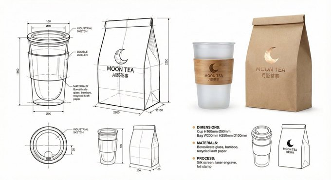
</div>

**中文提示词：**
```
【服装/奶茶/面包】品牌包装设计展示图，一张完整设计稿画面，【总体风格描述，纯黑色包装袋，简约Logo设计，具有质感的材质………】，【需融入形象】……
画面中同时展示：
•【服装】包装袋设计和吊牌设计
•左侧为黑色线稿结构图（线描风格，工业设计草图）
•右侧为完成上色的成品效果图（真实材质质感）
•下方或角落配有简洁的设计标注文字（尺寸、材质、工艺说明，示意性）

整体风格为专业包装设计提案，【干净白色】背景，平面排版清晰
设计感强，理性、有秩序
非广告海报风格

视角为正视图 + 轻微等轴测视角
高分辨率，细节清晰
```

<a id="prompt-864"></a>
## 案例 864：穿越时空的滤镜-老照片修复 (来源 [@AztecaAlpaca](https://x.com/AztecaAlpaca/status/2000853838073618726)) 模型：Nano banana pro

<div style="display: flex; justify-content: space-between;">
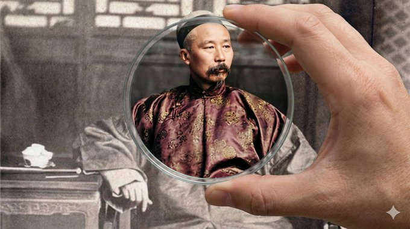
</div>

**提示词：**
```
对提供的照片，根据提示词生成图片，滤镜采用大滤镜，使用彩色呈现。
{
  "type": "augmented_reality_filter_synthesis",
  "aspect_ratio": "16:9",
  "instruction": "CRITICAL: This is an IMAGE-TO-IMAGE task, not a text-to-image generation. You must strictly preserve the pixels of the {{UPLOADED_IMAGE_FILE}} as the background. Do not generate a new scene based on description. Only the area INSIDE the glass filter is allowed to change.",

  "global_constraints": {
    "source_fidelity": "The background outside the filter must be an EXACT pixel-match to {{UPLOADED_IMAGE_FILE}}. Do not alter, crop, expand, or 'reimagine' the background context.",
    "context_isolation": "Ignore all previous images or conversation topics. Focus EXCLUSIVELY on the current uploaded file.",
    "modification_scope": "modifications are STRICTLY limited to the area inside the glass filter lens."
  },

  "dynamic_analysis_module": {
    "step_1_focal_point_extraction": {
      "task": "Identify the coordinates of the main subject (Face/Object) in the current file to position the filter.",
      "output_variable": "[TARGET_COORDINATES]",
      "logic": "Find the center of interest solely within the provided image."
    },
    "step_2_filter_specs": {
      "task": "Determine filter parameters based on the subject.",
      "output_variable_shape": "[FILTER_SHAPE]",
      "output_variable_style": "[HD_RESTORATION_STYLE]",
      "logic": "Face -> Circular/Oval + Skin Restoration. Building -> Rectangular + Structure Sharpening."
    }
  },

  "system_prompt_logic": {
    "main_premise": "A first-person view of a hand holding a [FILTER_SHAPE] glass lens over the actual physical print of {{UPLOADED_IMAGE_FILE}}.",

    "layer_definition_logic": {
      "layer_1_background_immutable": {
        "z_index": "Background (The Original Image)",
        "content": "The original {{UPLOADED_IMAGE_FILE}} displayed as a large physical print or wall projection.",
        "strict_rules": {
          "NO_GENERATION": "Do not generate new scenery. Use the uploaded image as a fixed texture map.",
          "NO_EXPANSION": "Do not attempt to extend the image borders. Show the image exactly as provided, framing it to fill the background.",
          "visual_state": "Must retain all original artifacts: noise, blur, scratches, B&W tone, and low resolution. This is the 'Before' state."
        }
      },
      
      "layer_2_foreground_hand": {
        "z_index": "Foreground (Overlay)",
        "content": "A realistic human hand holding a [FILTER_SHAPE] optical glass lens.",
        "positioning": "The hand enters from the edge (unobtrusive). The glass lens is positioned directly over [TARGET_COORDINATES].",
        "lighting": "The hand casts a subtle shadow onto the background print to create depth."
      },

      "layer_3_filter_throughput": {
        "z_index": "Lens Interior (The Transformation)",
        "content": "The specific pixels visible *through* the glass lens.",
        "visual_transformation": {
          "action": "Upscale and colorize ONLY the pixels inside the lens boundary.",
          "style": "[HD_RESTORATION_STYLE] (4K resolution, realistic textures, vibrant lighting).",
          "contrast_lock": "The separation is absolute. Outside the line = Old/Blurry. Inside the line = New/Sharp. No fading gradients."
        }
      }
    }
  }
}
```

<a id="prompt-863"></a>
## 案例 863：老照片高清修复 (来源 [@ShreyaYadav___](https://x.com/ShreyaYadav___/status/2000593577253146761)) 模型：Nano banana pro

<div style="display: flex; justify-content: space-between;">
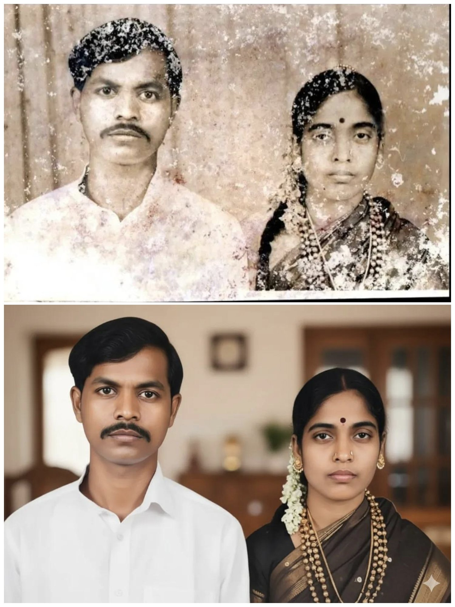
</div>

**提示词：**
```
Luxury portrait of the uploaded image, 100% same face identity. Bright, clean exposure with soft studio lighting, balanced brightness, natural highlights on face and eyes, smooth shadow falloff. Ultra-realistic skin texture, sharp detailed eyes, natural hair strands, high-detail fabric. Clean elegant background with soft depth of field. Premium cinematic color grading, rich natural colors. Full-frame DSLR look, 85mm f/1.8, 8K ultra-realistic, no cartoon, no over-smoothing, no face change.
```

**中文提示词：**
```
上传图片的高级人像，100% 还原本人面部特征。明亮清晰的曝光，柔和的影棚灯光，亮度均衡，面部和眼部高光自然，阴影过渡平滑。肌肤纹理极其逼真，双眼细节清晰锐利，发丝自然，织物细节丰富。背景干净优雅，景深柔和。采用高级电影级调色，色彩饱满自然。全画幅单反风格，85mm f/1.8 镜头，8K 超高清画质，无卡通化、无过度磨皮、无面部修改。
```

<a id="prompt-862"></a>
## 案例 862：一位面带微笑的人手持可口可乐铝罐 (来源 [@Sheldon056](https://x.com/Sheldon056/status/2000769215989489837)) 模型：Nano banana pro

<div style="display: flex; justify-content: space-between;">
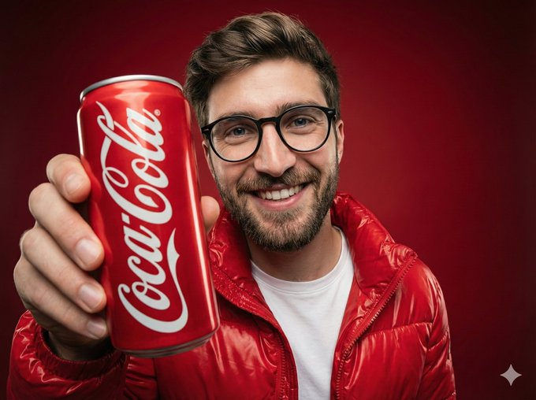
</div>

**提示词：**
```
Studio portrait of one smiling person holding a Fanta orange aluminum can close to the camera, with both the can and the person’s head in the foreground. Shot using an ultra-wide fisheye lens for a playful, energetic, immersive perspective.
The model wears a glossy vibrant orange puffer jacket inspired by Fanta branding, layered over a bright white t-shirt.
Background in a bold citrus-orange gradient with subtle yellow highlights, perfectly color-matched to Fanta’s brand palette, smooth modern transitions.
Diffused cinematic studio lighting, juicy highlights on the can, soft glossy reflections on the jacket, gentle shadows for depth.
Slightly desaturated yet fresh, youthful modern editorial style, fun soda-campaign aesthetic, clean and minimal composition.
Ultra-sharp focus, natural skin texture, cheerful expressive smile, high-end commercial beverage photography look.

Face must match the attached reference image exactly, accurate facial proportions, realistic skin tone, no facial alteration.
Photorealistic, 8K detail, professional studio photography, global soda brand advertisement quality.
```

**中文提示词：**
```
一张影棚肖像照，照片中一位面带微笑的人手持芬达橙味铝罐，靠近镜头，罐子和人的头部都位于前景。照片采用超广角鱼眼镜头拍摄，营造出一种活泼、充满活力且引人入胜的视角。
模特身穿一件亮橙色羽绒服，其设计灵感源自芬达品牌，内搭一件亮白色T恤。
背景采用大胆的柑橘橙色渐变，并带有微妙的黄色高光，与芬达品牌色调完美匹配，过渡流畅现代。
漫射的电影摄影棚灯光，罐身上明亮的高光，夹克上柔和的光泽反射，以及营造深度感的柔和阴影。
略微褪色但清新、年轻、现代的编辑风格，有趣的汽水广告美学，简洁的构图。
超清晰的焦点、自然的肌肤纹理、灿烂的笑容，高端商业饮料摄影风格。

面部必须与附图完全一致，面部比例准确，肤色逼真，不得进行任何面部修改。
照片级真实感，8K细节，专业影棚拍摄，全球汽水品牌广告品质。
```

<a id="prompt-861"></a>
## 案例 861：3D卡通风格角色 (来源 [@ChillaiKalan__](https://x.com/ChillaiKalan__/status/2000940216316801527)) 模型：Nano banana pro

<div style="display: flex; justify-content: space-between;">
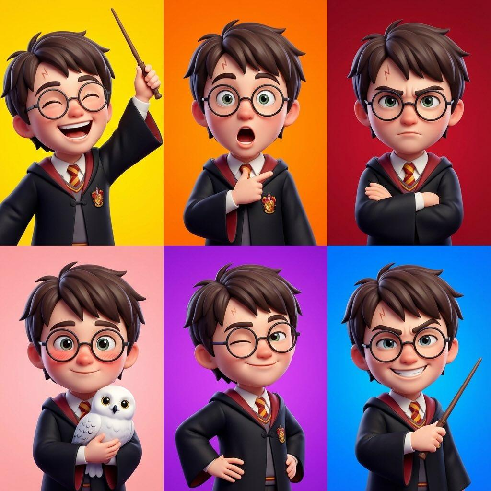
</div>

**提示词：**
```
3×2 collage of six stylized 3D caricature portraits of [name], each with a different expressive pose (joyful, surprised, serious, cute, sassy, confident). Smooth polished look, soft ambient lighting, clean character design, and bold vibrant backgrounds for each panel.
```

**中文提示词：**
```
一幅由六幅风格化的3D漫画肖像组成的3×2拼贴画，描绘的是[姓名]，每幅肖像都展现出不同的表情（喜悦、惊讶、严肃、可爱、俏皮、自信）。画面流畅精致，环境光线柔和，人物设计简洁明快，每幅画的背景都鲜艳夺目。
```

<a id="prompt-860"></a>
## 案例 860：超逼真的物体云朵 (来源 [@TechieBySA](https://x.com/TechieBySA/status/2000671056780996891)) 模型：Nano banana pro

<div style="display: flex; justify-content: space-between;">
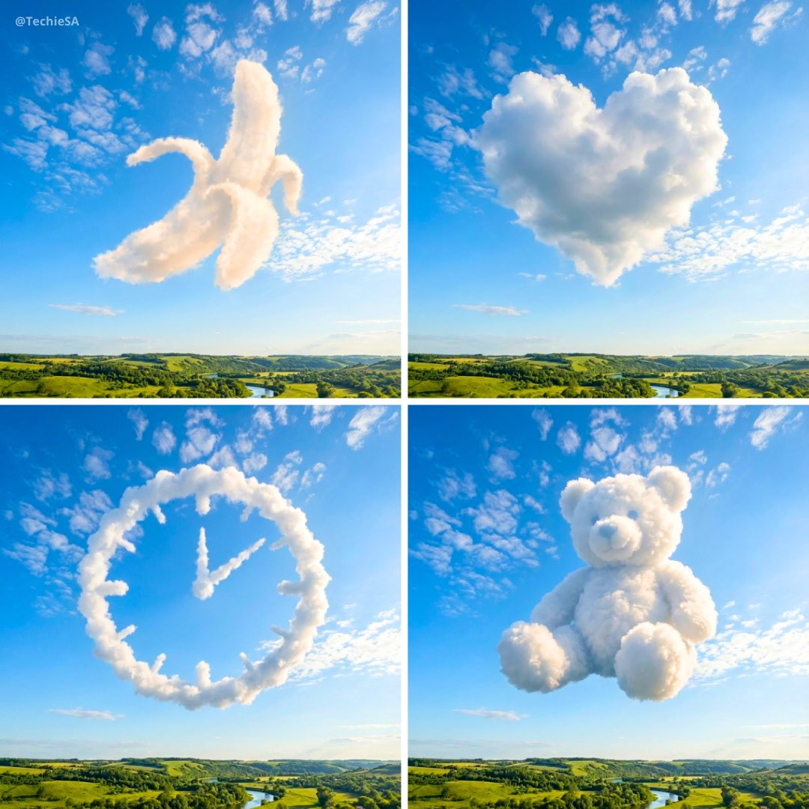
</div>

**提示词：**
```
Create an ultra-realistic sky scene where soft, natural cloud formations organically assemble into the clear silhouette of a [OBJECT]. The cloud shape appears high in a vibrant blue sky, naturally floating above a recognizable nature below.

The composition is square (1080×1080), with the cloud formation occupying the upper portion of the frame while the landscape grounds the scene beneath it. Lighting is crisp and daylight-bright, with sunlit highlights on the clouds that enhance depth, softness, and realism.

The overall mood should feel calm, optimistic, and visually striking, with rich color saturation and a clean, peaceful atmosphere.
```

**中文提示词：**
```
“创造一个超逼真的天空场景，其中柔和自然的云朵有机地组合成清晰的[物体]轮廓。云朵的形状出现在充满活力的蓝色天空的高处，自然地漂浮在下方可辨认的自然景观之上。”

画面构图为正方形（1080×1080），云层占据画面上半部分，下方则是地景。光线明亮清晰，如同日光一般，阳光照射在云层上，增强了画面的层次感、柔和感和真实感。

整体氛围应给人平静、乐观、视觉冲击力强的感觉，色彩饱和度高，环境干净平和。
```

<a id="prompt-859"></a>
## 案例 859：一位美丽迷人的年轻女子 (来源 [@ShreyaYadav___](https://x.com/ShreyaYadav___/status/2000818403137786340)) 模型：Nano banana pro

<div style="display: flex; justify-content: space-between;">
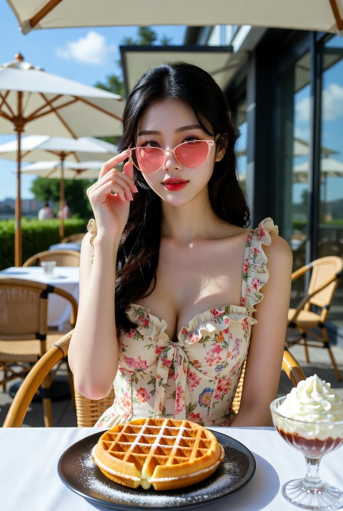
</div>

**提示词：**
```
{
  "task": "image_generation",
  "output": {
    "aspect_ratio": "9:16",
    "resolution": "8K",
    "style": ["ultra-realistic", "ultra-high-detail", "photorealistic"]
  },
  "identity_reference": {
    "use_uploaded_image_as_reference": true,
    "face_and_body": "match uploaded identity as closely as possible",
    "notes": "If the system supports reference images, keep the same face, skin tone, facial proportions, and overall figure from the uploaded image."
  },
  "prompt": {
    "scene": "A candid, glamour portrait photo at a sunny upscale outdoor cafe terrace during summer brunch.",
    "subject": {
      "description": "A beautiful glamorous young woman with long dark wavy hair wearing pink-tinted cat-eye sunglasses, seated at an outdoor cafe table and posing naturally for a photo.",
      "outfit": "Romantic floral-print ruffled sundress with a sweetheart neckline.",
      "expression_pose": "Relaxed confident smile, casual elegant posture, slightly angled toward camera."
    },
    "food_foreground": {
      "description": "In the foreground, a large golden waffle dusted with powdered sugar on a matte black plate. Next to it, a fancy glass dish of whipped cream with visible texture.",
      "composition_note": "Food close to camera, subject in mid-ground for depth."
    },
    "environment": {
      "description": "Sunny upscale terrace with large cream umbrellas, natural wood chairs, and large glass windows reflecting greenery and soft highlights.",
      "mood": "Luxurious, bright, leisurely; sunny summer brunch atmosphere."
    },
    "lighting": {
      "type": "Natural sunlight",
      "quality": "Warm, soft shadows, gentle specular highlights on sunglasses and glass dish"
    },
    "camera": {
      "shot_type": "Candid shot / captured moment",
      "framing": "Vertical portrait, subject centered with foreground food prominent",
      "lens_look": "Shallow depth of field, crisp subject detail, creamy bokeh background"
    },
    "quality_tags": [
      "8k",
      "ultra sharp",
      "high dynamic range",
      "realistic skin texture",
      "fine fabric detail",
      "natural color grading"
    ]
  },
  "negative_prompt": [
    "cartoon",
    "anime",
    "cgi",
    "3d render",
    "painting",
    "low resolution",
    "blurry",
    "overexposed",
    "underexposed",
    "bad anatomy",
    "deformed hands",
    "extra fingers",
    "duplicate face",
    "different identity",
    "face distortion",
    "text",
    "watermark",
    "logo",
    "oversaturated colors"
  ]
}
```

**中文提示词：**
```
{
"任务": "图像生成",
“输出”： {
"aspect_ratio": "9:16",
分辨率：8K，
风格：["超写实", "超高细节", "照片级写实"]
},
"identity_reference": {
"use_uploaded_image_as_reference": true,
"face_and_body": "尽可能与上传的身份信息相匹配",
备注：如果系统支持参考图像，请保持上传图像中的面部、肤色、面部比例和整体体型一致。
},
“迅速的”： {
“场景”：“在阳光明媚的高档户外咖啡馆露台上，夏日早午餐时分拍摄的一张自然、迷人的肖像照。”
“主题”： {
“描述”：“一位美丽迷人的年轻女子，留着长长的黑色波浪卷发，戴着粉色猫眼太阳镜，坐在户外咖啡桌旁，自然地摆姿势拍照。”
“服装”：“浪漫碎花荷叶边吊带连衣裙，心形领口。”
"expression_pose": "放松自信的微笑，随意优雅的姿态，略微侧身看向镜头。"
},
"food_foreground": {
描述：前景中，一块撒满糖粉的金黄色华夫饼放在哑光黑色盘子上。旁边，一个精致的玻璃碗里盛着纹理清晰可见的鲜奶油。
"构图说明": "食物靠近镜头，主体位于中景以营造景深。"
},
“环境”： {
描述：阳光充足的高档露台，配有大型奶油色遮阳伞、天然木椅和大型玻璃窗，窗外绿意盎然，光线柔和明亮。
“氛围”：“奢华、明亮、悠闲；阳光明媚的夏日早午餐氛围。”
},
“灯光”： {
“类型”：“自然阳光”，
“品质”：“太阳镜和玻璃碟上温暖柔和的阴影和柔和的高光”
},
“相机”： {
"shot_type": "抓拍/瞬间捕捉",
“构图”：“竖幅肖像，主体居中，前景食物突出”，
镜头风格：浅景深，清晰的主体细节，柔和的散景背景
},
"quality_tags": [
“8k”，
“超清晰”，
“高动态范围”
“逼真的皮肤纹理”，
“精细的面料细节”，
“自然色彩分级”
]
},
"negative_prompt": [
“卡通片”，
“日本动画片”，
“cgi”，
“3D渲染”，
“绘画”，
“低分辨率”，
“模糊的”，
“过度曝光”
“曝光不足”，
“糟糕的解剖学”
“畸形的手”，
“额外的手指”，
“复制的脸”，
“不同的身份”，
“面部变形”，
“文本”，
“水印”，
“标识”，
“色彩过饱和”
]
}
```

<a id="prompt-858"></a>
## 案例 858：女子站在房间里的近距离自拍照 (来源 [@SimplyAnnisa](https://x.com/SimplyAnnisa/status/2000735478149210188)) 模型：Nano banana pro

<div style="display: flex; justify-content: space-between;">
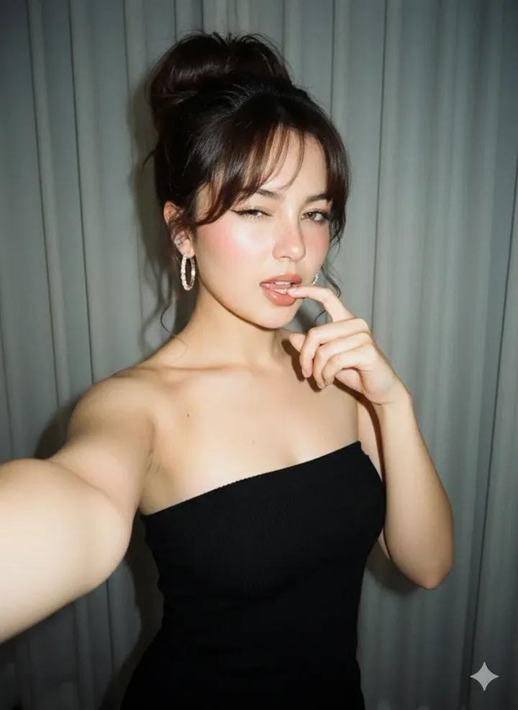
</div>

**提示词：**
```
Take a close-up selfie portrait of a young woman standing in a room. She poses with her right hand holding the camera for the selfie, biting her index finger with a flirtatious expression, her right eye winking, and her body tilted slightly to the right.
Her dark brown hair with highlights is tied in a high, messy bun with bangs circling her forehead. She wears diamond hoop earrings.
She appears to have freckles around her nose and cheekbones.
Her makeup is natural, with a subtle pink blush, a defined cat eye eyeliner, curled eyelashes, a brownish-green eye color, and a glossy nude lipstick.
She is wearing a strapless black knit mini dress.

The backdrop is a grayish-white curtain with soft, out-of-focus folds that contrast nicely with the denim dress.
The natural lighting from the sun highlights the subject from the front.  Shot with a 90s camera. Don't change the face.
```

**中文提示词：**
```
拍摄一张年轻女子站在房间里的近距离自拍照。她摆出自拍姿势，右手拿着相机，咬着食指，表情妩媚，右眼眨动，身体微微向右倾斜。
她深棕色的头发挑染了几缕，随意地挽成一个高高的发髻，刘海垂在额前。她戴着钻石耳环。
她的鼻子和颧骨周围似乎有雀斑。
她的妆容很自然，淡淡的粉色腮红，精致的猫眼眼线，卷翘的睫毛，棕绿色的眼影，以及亮泽的裸色唇膏。
她身穿一件黑色无肩带针织迷你连衣裙。

背景是一块灰白色的窗帘，柔和的、略带虚化的褶皱与牛仔连衣裙形成了很好的对比。
阳光的自然光线从正面突出了拍摄对象。用90年代的相机拍摄。不要改变脸部特征。
```

<a id="prompt-857"></a>
## 案例 857：超逼真的3D商业风格产品图 (来源 [@ZaraIrahh](https://x.com/ZaraIrahh/status/2000485236841607559)) 模型：Nano banana pro

<div style="display: flex; justify-content: space-between;">


</div>

**提示词：**
```
Create an ultra-realistic 3D commercial-style product shot of a premium cherry juice bottle, suspended mid-air with intricate condensation droplets on its surface. The bottle should appear fresh and vibrant, with each condensation bead reflecting ambient light to enhance photorealism. Surround the product with dynamic elements like splashing droplets of cherry juice, whole cherries, and ice cubes, frozen in high-speed motion, each element sharply defined with vibrant clarity.
Floating cherry stems and leaves should also be included to enhance the sense of freshness and energy.

Set the background against a rich, deep red and burgundy gradient, which complements the rich color of the cherry juice and evokes a sense of indulgence and premium quality. The product should be centrally placed, slightly tilted to convey a sense of movement and sophistication.
Use cinematic, studio-style lighting with bright highlights reflecting off the bottle, crisp shadows, and high contrast to create a luxurious, polished look. Ensure the bottle’s label is clearly visible, with subtle reflections beneath it, adding depth and realism to the scene.

The overall aesthetic must evoke indulgence, freshness, and premium quality, with all elements contributing to a high-end, visually striking image. The scene should feel rich, fresh, and full of vitality,with a focus on the vibrant color and fresh nature of the cherry juice.

Technical Specifications:

Aspect Ratio: 4:5

Resolution: Ultra-HD quality

Lighting: Studio-style, cinematic with bright highlights, subtle reflections, and high contrast

Detailing: Extreme attention to condensation, droplets, and high-speed motion of elements
```

**中文提示词：**
```
创作一张超逼真的3D商业风格产品图，展示一瓶优质樱桃汁悬浮在半空中，瓶身表面凝结着精致的水珠。瓶身应呈现清新亮丽的质感，每一滴水珠都反射着环境光，增强照片的真实感。在产品周围添加动态元素，例如飞溅的樱桃汁、完整的樱桃和冰块，以高速运动的瞬间定格，每个元素都清晰锐利，栩栩如生。
为了增强清新活力感，还可以加入漂浮的樱桃茎和叶子。

背景采用浓郁的深红色和酒红色渐变色，与樱桃汁的浓郁色泽相得益彰，营造出奢华和高品质的氛围。产品应置于画面中央，略微倾斜，以展现动感和精致感。
使用电影级的影棚灯光，让明亮的高光反射在瓶身上，阴影清晰锐利，并营造出高对比度，从而打造出奢华精致的视觉效果。确保瓶标清晰可见，其下方有微妙的反射光，为画面增添层次感和真实感。

整体美学必须营造出奢华、清新和高端的氛围，所有元素都应共同打造出高端且引人注目的视觉效果。场景应给人以丰富、清新和充满活力的感觉，重点突出樱桃汁鲜艳的色彩和新鲜的特性。

技术规格：

宽高比：4:5

分辨率：超高清

灯光：影棚风格，电影感十足，高光明亮，反射柔和，对比度高。

细节处理：极其注重冷凝、水滴和高速运动的元素。
```

<a id="prompt-856"></a>
## 案例 856：提线木偶 (来源 [@xmiiru_](https://x.com/xmiiru_/status/2000436371975000418)) 模型：Nano banana pro

<div style="display: flex; justify-content: space-between;">

</div>

**提示词：**
```
{
  "type": "advertisement_poster",
  "style": {
    "photorealistic": true,
    "hyper_realistic": true,
    "highly_detailed": true,
    "commercial_photography": true,
    "vibrant_colors": true,
    "high_contrast": true,
    "cinematic_lighting": true
  },
  "camera": {
    "angle": "low",
    "orientation": "vertical_portrait",
    "focus": "strong_foreground"
  },
  "subject": {
    "person": {
      "age": "30s",
      "ethnicity": "Asian",
      "hair": "short black",
      "clothing": {
        "tshirt": "mustard yellow",
        "shorts": "navy blue",
        "shoes": "gray sneakers"
      },
      "pose": {
        "style": "marionette_puppet_losing_control",
        "expression": "surprised",
        "eyes": "wide",
        "mouth": "open",
        "arm": "one_raised_in_panic",
        "body_tilt": "forward",
        "leg_lifted": true
      },
      "props": [
        {
          "object": "popcorn_bucket",
          "orientation": "upside_down",
          "color": "yellow",
          "label": "Popcorn",
          "text_color": "red",
          "effect": "caramel_popcorn_spilling_dynamically"
        }
      ],
      "marionette_strings": {
        "attached_to": ["wrists", "ankles", "waist"],
        "connected_to": {
          "controller": "wooden_cross_shaped_marionette",
          "held_by": {
            "hand": "giant",
            "skin_tone": "fair",
            "position": "top_of_frame"
          }
        }
      }
    }
  },
  "effects": {
    "dynamic_motion": true,
    "selective_focus": true,
    "cinematic_drama": true
  }
}
```

**中文提示词：**
```
{
"type": "advertisement_poster",
“风格”： {
“照片级真实感”：是，
"hyper_realistic": true,
"highly_detailed": true,
"commercial_photography": true,
"vibrant_colors": true,
“高对比度”：true，
"cinematic_lighting": true
},
“相机”： {
"角度": "低",
"方向": "竖屏",
“焦点”： “前景强”
},
“主题”： {
“人”： {
“年龄”: “30多岁”
“种族”: “亚洲人”
“头发”：“黑色短发”，
“衣服”： {
“t恤衫”：“芥末黄”，
“短裤”： “海军蓝”
“鞋子”: “灰色运动鞋”
},
"姿势": {
"style": "marionette_puppet_losing_control",
“表情”：“惊讶”，
“眼睛”：“睁大”，
"嘴巴": "张开的",
"arm": "one_raised_in_panic",
"body_tilt": "向前",
"leg_lifted": true
},
“道具”：[
{
"对象": "爆米花桶",
"方向": "倒置",
“颜色”: “黄色”
标签：爆米花，
"text_color": "红色",
“效果”： “焦糖爆米花动态溢出”
}
],
"marionette_strings": {
"attached_to": ["手腕", "脚踝", "腰部"],
"connected_to": {
"控制器": "木制十字形木偶",
"held_by": {
“手”：“巨人”，
"skin_tone": "fair",
"position": "top_of_frame"
}
}
}
}
},
"效果": {
"dynamic_motion": true,
"selective_focus": true,
"cinematic_drama": true
}
}
```

<a id="prompt-855"></a>
## 案例 855：剪纸风格的珠江新城 (来源 [@liyue_sqlroad](https://x.com/liyue_sqlroad/status/2000560041410154989)) 模型：Nano banana pro

<div style="display: flex; justify-content: space-between;">

</div>

**中文提示词：**
```
以珠江新城现代都市景观为灵感的剪纸艺术，通过精巧的镂空手法在一整幅纸上，立体刻画广州塔、东西双塔等地标建筑与繁华城景。所有建筑与元素均以流畅的线条与结构相连，无孤立部分，构成一幅完整的都市画卷。

画面采用金属箔或光泽纸材质，表面带有细腻的明暗光泽，在光照下呈现柔和的高光与阴影，仿佛被城市灯光轻轻照亮。背景以虚化的珠江新城天际线为衬，点缀隐约可见的花城广场与树木轮廓，整体透出现代浪漫的氛围。

作品中巧妙融入轻盈的蒲公英绒毛或星光般的动态光点，象征梦想与活力在这座新城中飘散飞扬。整体呈现8K超高清视觉，细节丰富，真实而富有艺术感染力。
```

<a id="prompt-854"></a>
## 案例 854：商业广告拍摄现场 (来源 [@KanaWorks_AI](https://x.com/KanaWorks_AI/status/2000183694452298143)) 模型：Nano banana pro

<div style="display: flex; justify-content: space-between;">

</div>

**提示词：**
```
A 【Coca-Cola】 commercial film set.
In the background stands an enormous 【Coca-Cola red】 backdrop, filled with a festive atmosphere.
At the center of the set, the director is carefully explaining the script to 【an anthropomorphic white polar bear】, and the 【white polar bear】 listens attentively.
Nearby, Santa Claus lowers his head and quietly rehearses his lines, holding a script in his hands, his expression slightly nervous yet warm and friendly.
Several anthropomorphic 【Coca-Cola characters】 walk around the set, busy like crew members.
Surrounding them are filming facilities such as cameras, lighting equipment, camera tracks, and microphones.
Crew members move back and forth across the set.
The entire scene feels busy yet perfectly organized.
Cinematic composition, warm lighting, realistic details, with a fairy-tale-like atmosphere.
```

**中文提示词：**
```
【可口可乐】商业广告拍摄现场。
背景中矗立着一块巨大的【可口可乐红】背景幕布，充满了节日气氛。
在片场中央，导演正在认真地向【一只拟人化的白色北极熊】讲解剧本，而【白色北极熊】则认真地听着。
不远处，圣诞老人低着头，手里拿着剧本，安静地练习着台词，表情略显紧张，但又温暖友好。
几个拟人化的【可口可乐人物】在片场走来走去，像工作人员一样忙碌着。
他们周围是拍摄设备，例如摄像机、照明设备、摄影机轨道和麦克风。
剧组人员在片场来回走动。
整个场景既热闹又井然有序。
电影般的构图、温暖的光线、逼真的细节，营造出童话般的氛围。
```

<a id="prompt-853"></a>
## 案例 853：雪景下的精灵 (来源 [@Adam38363368936](https://x.com/Adam38363368936/status/2000502374784471427)) 模型：Nano banana pro

<div style="display: flex; justify-content: space-between;">

</div>

**中文提示词：**
```
{ "image_generation_request": { "meta_protocols": { "reference_adherence": { “说明”：“请严格按照提供的照片进行面部参照。” “公差”: “零偏差” “参数”：“以100%的准确度保留面部比例、皮肤纹理、表情和身份特征。” "stylization_constraint": "不要对脸部特征进行风格化或改变。"       }, "format_style": "编辑冬季海报风格的多面板拼贴画", "aesthetic_quality": "自发的 iPhone 摄影（抓拍、温馨、写实）", "global_textures": "柔和的雪花，细腻的模拟颗粒感，轻微的手持拍摄瑕疵"     }, "consistent_elements": { "subject_wardrobe": { “外套”： “短款人造毛皮外套” 腿部服饰：黑色紧身裤， “鞋类”：“经典 UGG 靴子”， "style_notes": "简约、舒适、极具冬日气息"       }, "primary_device": { “型号”：“iPhone 17 Pro Max”， “颜色”： “银色”， “用法”：“由主体在相关框架中持有”       }, "color_palette": [ “温暖的琥珀色”， “柔和的红色”， “松树绿” “柔和的冬日灰色”       ]     }, "layout_configuration": { "panel_1_top_left": { "scene_type": "黄昏时分的商店橱窗反光照片", "lighting_and_atmosphere": "淡淡的圣诞彩灯、花环、磨砂玻璃边缘、毛皮上的暖色调高光", “subject_action”: “拿着手机部分遮住脸部” "optical_effects": "掠过的轮廓、层叠的反射、柔和的重影、自然的玻璃曲率扭曲"       }, "panel_2_top_right": { "scene_type": "超广角街景人像（雪中的人行道/圣诞市场）", "camera_angle": "近距离，向下倾斜", “subject_pose”: “随意地向前倾，双手插在外套口袋里” "可见性检查": "黑色紧身裤和 UGG 靴子清晰可见", "motion_dynamics": "带有轻微运动模糊的飘雪", 镜头特性： “微妙的透视变形，以增强手持拍摄的真实感”       }, "panel_3_bottom_right": { "scene_type": "亲密俯视自拍", “照明”：“温暖的街道或咖啡馆照明”， "props": { "held_item": "外带节日饮品（咖啡或热红酒）", “配件”：“可见的有线耳机”         }, "texture_focus": "清晰细腻的毛皮纹理和冬季面料", “氛围”：“柔和的颗粒感增强了怀旧的假日氛围”       }     }, "graphic_overlay": { "element": "极简 Apple Music 风格的迷你播放器", "content": "流行圣诞歌曲（例如，'Last Christmas' 或 'All I Want for Christmas Is You'）", “风格”：“渲染效果平整干净，没有阴影”， “位置”：“漂浮在拼贴画的中心”     }   } }
```

<a id="prompt-852"></a>
## 案例 852：20元纸币（桂林山水版） (来源 [@0x00_Krypt](https://x.com/0x00_Krypt/status/2000426631345893715)) 模型：Nano banana pro

<div style="display: flex; justify-content: space-between;">

</div>

**提示词：**
```
{
  "prompt": "Subject: Genuine Chinese 20 Yuan Banknote (Guilin Landscape edition). \n\n[Macro Material Analysis]: The object must be rendered with the exact physical properties of real currency paper—matte cotton-fiber rag paper, NOT glossy cardboard. \n\n[Paper Engineering]: The karst mountain scenery is delicately cut and lifted. \n- **Critical Thickness**: The cut-out paper layers must appear razor-thin (0.1mm), fragile, and slightly translucent against the light. Edges should show microscopic fibrous tearing, not clean thick cuts.\n- **Printing Texture**: The mountains are NOT solid colors. They must be composed of microscopic engraved lines (intaglio printing) and guilloche patterns. The ink should look slightly raised on the paper surface.\n\n[Scene Context]: A realistic tiny bamboo raft floats on the flat printed water. \n\n[Scale Reference]: A giant, realistic human finger with distinct skin texture presses the edge of the bill. The finger is huge compared to the tiny raft, emphasizing the miniature scale.\n\n[Photography]: Macro lens, high contrast lighting to show the texture of the paper fibers. Shallow depth of field.",
  "negative_prompt": "glossy paper, thick cardboard, plastic texture, toy money, monopoly money, solid color blocks, blurred printing, low resolution, cartoon, thick edges",
  "aspect_ratio": "16:9"
}
```

**中文提示词：**
```
{
提示：主题：真品中国20元纸币（桂林山水版）。\n\n[宏观材质分析]:物体必须具有真实货币纸张的精确物理特性——哑光棉纤维纸，而非光面纸板。\n\n[纸张工程]:喀斯特山景经过精细切割和凸起处理。\n- **关键厚度** ：切割出的纸层必须薄如刀（0.1毫米），脆弱易碎，并且在光线下略微半透明。边缘应呈现微观纤维撕裂，而非干净利落的厚切痕迹。\n- **印刷纹理** ：山峦并非纯色。它们必须由微小的雕刻线条（凹版印刷）和扭索纹图案组成。油墨在纸张表面应略微凸起。\n\n[场景背景]:一艘逼真的小型竹筏漂浮在水面上在平坦的印刷水面上。\n\n[比例尺参考]:一根巨大的、逼真的、皮肤纹理清晰的人手指按压着纸筏的边缘。与小小的纸筏相比，手指显得巨大，突显了纸筏的微缩比例。\n\n[摄影]:微距镜头，高对比度照明，以展现纸张纤维的纹理。浅景深。]
"negative_prompt": "光面纸、厚纸板、塑料质感、玩具钞票、大富翁钞票、纯色色块、模糊印刷、低分辨率、卡通、厚边"
"aspect_ratio": "16:9"
}
```

<a id="prompt-851"></a>
## 案例 851：圣诞宠物九宫图 (来源 [@cnyzgkc](https://x.com/cnyzgkc/status/2000556731915743679)) 模型：Nano banana pro

<div style="display: flex; justify-content: space-between;">

</div>

**中文提示词：**
```
生成一张图片，画面以圣诞红色为背景，采用九宫格排版（3×3），展示同一只宠物在九种不同的圣诞主题装扮状态。

第一排（从左至右）：
•宠物待在圣诞树造型的宠物窝里，趴着吐舌头，呈现可爱的神态；
•接着佩戴圣诞元素围脖，歪着头，仿佛在卖萌；
•然后戴着圣诞帽小发箍蹭脸，神情略显呆萌。

第二排（从左至右）：
•宠物穿着圣诞装扮坐在礼物盒里，呈现想要爬出来的姿态，神情乖巧；
•随后靠在迷你圣诞树旁，戴着甜甜圈小发带晃头，仿佛在玩耍；
•接着戴着圣诞树造型的帽子，鼻子上戴着小丑红色鼻子，坐姿活泼有精神。

第三排（从左至右）：
•宠物坐在礼物盒里，身穿圣诞装扮，吐舌微笑，呈现精神饱满的状态；
•接着戴着肉松小发圈、穿着圣诞毛衣打哈欠，展现慵懒可爱的模样；
•最后躺在棕色圣诞垫子上，露出温顺柔和的神情。

整体要求：
•每一种圣诞主题装扮状态都要生动鲜活；
•细腻呈现宠物的「小呆萌」特质；
•真实写真风格；
•不要生成其他宠物，只能是图一中的同一只宠物。
```

<a id="prompt-850"></a>
## 案例 850：圣诞主题高端影棚照片 (来源 [@xmiiru_](https://x.com/xmiiru_/status/2000549421394633036)) 模型：Nano banana pro

<div style="display: flex; justify-content: space-between;">

</div>

**提示词：**
```
{
  "format": "9:16",
  "type": "AR high-end studio photo",
  "slides": [
    {
      "slide": 3,
      "prompt": "Create a 9:16 AR high-end studio photo of a beautiful woman matching the provided photo reference. She is wearing a red maxi gown with short sleeves and a sabrina neckline, paired with high heels. She is smiling toward the camera, sitting in a squatting pose, with one hand resting on her knee and the other supporting her chin. The woman is seated inside a large transparent plastic bag styled as luxury packaging, with a big elegant red bow on top. The environment is a professional studio with a deep grey background, dramatic cinematic studio lighting, strong red palette accents, glossy reflections on the plastic surface, and a high-fashion editorial mood."
    },
    {
      "slide": 4,
      "prompt": "Create a 9:16 AR high-end studio photo of a beautiful woman matching the provided photo reference. She is wearing a white organza maxi gown with red polka dots, voluminous silhouette, short puff sleeves, and a sabrina neckline. She is paired with red sheer tights, red leather heels, and elegant jewelry. She is sitting cross-legged, smiling warmly at the camera, holding a green gift box with a red ribbon using both hands. The scene maintains a luxury fashion editorial aesthetic with a studio setup, refined lighting, and a polished high-end mood."
    }
  ]
}
```

**中文提示词：**
```
{
"格式": "9:16",
"type": "AR高端影棚照片",
“幻灯片”：[
{
“幻灯片”：3，
提示：请根据提供的照片参考，创作一张9:16的AR高端影棚照片，照片中的女士是一位美丽的女性。她身穿红色短袖长款礼服，领口为Sabrina式，脚踩高跟鞋。她面带微笑地对着镜头，呈蹲姿，一只手放在膝盖上，另一只手托着下巴。她坐在一个大型透明塑料袋中，该塑料袋被设计成奢华包装，顶部系着一个优雅的大红色蝴蝶结。拍摄环境为专业影棚，背景为深灰色，采用戏剧性的电影级灯光，并以强烈的红色调点缀，塑料表面呈现光泽，营造出高级时尚杂志的氛围。
},
{
“幻灯片”：4，
“提示”：根据提供的照片参考，创作一张时长 9 分 16 秒的 AR 高端摄影棚照片，照片中的女士是一位美丽的女性。她身穿白色欧根纱长裙，裙摆蓬松，饰有红色波点，短泡泡袖，领口为萨布丽娜式。她搭配红色薄丝袜、红色皮质高跟鞋和精致的珠宝。她盘腿而坐，对着镜头露出温暖的笑容，双手捧着一个系着红色丝带的绿色礼盒。场景营造出奢华时尚大片的氛围，采用摄影棚布景、精致的灯光和高端的质感mood."
}
]
}
```

<a id="prompt-849"></a>
## 案例 849：专业影棚人像摄影圣诞冬季主题 (来源 [@LiEvanna85716](https://x.com/LiEvanna85716/status/2000530737842557269)) 模型：Nano banana pro

<div style="display: flex; justify-content: space-between;">

</div>

**提示词：**
```
Professional studio portrait photography, Christmas winter theme, white studio background.  Young Asian woman, age 20-23, beautiful delicate features: - Large expressive eyes with double eyelids - Elegant facial features, high cheekbones - Natural makeup: soft pink blush, natural lip color - Shoulder-length dark brown hair - Fair porcelain skin with realistic texture (visible pores)  Outfit: - Bright red cable knit beanie - Bright red chunky wool scarf - Black wool coat  Studio setup: Pure white seamless background, professional soft lighting, snowflakes falling on hair/beanie/scarf  Technical: 85mm lens, f/1.8-2.8, natural soft studio lighting, realistic skin texture, high-end fashion portrait quality  Mood: Natural, warm, gentle expression, serene and contemplative
```

**中文提示词：**
```
专业影棚人像摄影，圣诞冬季主题，白色背景。年轻亚裔女性，20-23岁，拥有精致美丽的五官： - 双眼皮，大而有神的眼睛 - 精致的五官，高颧骨 - 自然妆容：淡粉色腮红，自然唇色 - 及肩深棕色头发 - 白皙如瓷的肌肤，纹理真实（毛孔可见） 服装： - 亮红色麻花针织帽 - 亮红色粗羊毛围巾 - 黑色羊毛大衣 影棚布景：纯白色无缝背景，专业柔光，雪花飘落在头发/针织帽/围巾上 技术参数：85mm镜头，f/1.8-2.8光圈，自然柔和的影棚灯光，逼真的肌肤纹理，高端时尚人像品质 氛围：自然、温暖、温柔的表情，宁静而沉思
```

<a id="prompt-848"></a>
## 案例 848：9宫格裸感3D拼贴海报 (来源 [@langzihan](https://x.com/langzihan/status/2000416971662479749)) 模型：Nano banana pro

<div style="display: flex; justify-content: space-between;">

</div>

**中文提示词：**
```
# Role: 时尚视觉艺术总监 & AI绘图指令大师 (Fashion Art Director & Prompt Engineer)

## 1. 任务目标
你现在的任务是根据用户提供的[目标物体/人物]，设计一组用于生成“多封面时尚杂志拼贴海报”的高级AI绘图提示词（Prompt）。你需要复刻一种特定的视觉结构：背景由多个杂志封面风格的网格组成，前景有一个核心人物打破边框，形成“破格”的立体视觉效果。

## 2. 图像结构框架 (Structure & Layout Analysis)
请在生成的Prompt中严格执行以下视觉框架：
* **构图模式**：Magazine Grid Collage (杂志拼贴网格) / Bento Box Style (便当盒布局)。
* **背景层**：将画面分割为 7-9 个矩形区域。每个区域模仿一本顶级时尚杂志的封面（Vogue, Bazaar, Elle, i-D, Dazed, GQ, Marie Claire 等）。
* **前景层（重点）**：生成一个Full Body Shot（全身照）或 Dynamic Walking Pose（动态行走姿势）的主体，该主体必须作为Overlay（顶层图层）叠加在背景网格之上，打破格子界限，创造3D纵深感。
* **比例**：Aspect Ratio --ar 2:3。

## 3. 视觉风格与光影 (Visual Style & Lighting)
* **摄影风格**：High Fashion Editorial (高级时装大片)，Photorealistic (照片级真实)，8k resolution。
* **光影设置**：Soft Studio Lighting (柔和棚拍光)，即使光线，强调皮肤质感和衣物材质。
* **色彩美学**：Clean, Minimalist, Sophisticated (干净、极简、精致)。

## 4. 自动化工作流 (Workflow for Prompt Generation)
请按照以下步骤思考并构建最终的提示词：
1.  **提取变量**：分析用户输入的[目标物体/人物]和[风格描述]。
2.  **角色设定**：定义模特的特征（发型、肤色、妆容）或物体的材质。
3.  **姿态分解**：为背景的每个格子规划不同的姿态（特写、半身、坐姿、侧身），并为前景规划一个最具张力的动态姿态。
4.  **排版填充**：列出需要出现的杂志LOGO文本（Text Blocks）。
5.  **输出合成**：将以上元素组合成一段连贯的英文Prompt。

## 5. 用户输入接口 (User Input)
* **[目标物体/人物]**：(在此处输入，例如：一位穿着赛博朋克风格夹克的银发少女)
* **[科普/描述语言]**：(在此处输入，例如：未来科技感，霓虹灯光)

---

## 6. 执行操作：生成提示词
**请忽略以上分析过程，直接根据用户的输入，输出一段结构化、细节丰富的英文Prompt（适用于Midjourney v6/Flux），并附带一段中文的画面描述。**

**Prompt 结构要求：**
`[主体描述] + [穿搭/外观细节] + [构图：拼贴/杂志封面矩阵/前景叠加] + [特定杂志Logo列表] + [光影与渲染参数]`

---

## 示例输入 (Example for User to Test)：
> **目标人物**：[如：一个法国长发女郎]。
> **描述语言**：[风格：如80年代港风]。
```

<a id="prompt-847"></a>
## 案例 847：展开3D模型 (来源 [@KanaWorks_AI](https://x.com/KanaWorks_AI/status/1999336496357343569)) 模型：Nano banana pro

<div style="display: flex; justify-content: space-between;">

</div>

**提示词：**
```
unwrap the UVs of the 3D model shown in the image.
About one-third of the image should be a reference view displaying the 3D model itself.The remaining area should include the UV layout for the head, body, and limbs.Unwrap the surface of the 3D model and flatten it into a single 0–1 two-dimensional UV space.
```

**中文提示词：**
```
展开图中所示 3D 模型的 UV 贴图。
图像中约三分之一应为参考视图，显示 3D 模型本身。剩余区域应包含头部、身体和四肢的 UV 布局。展开 3D 模型的表面，并将其展平为单个 0-1 二维 UV 空间。
```

<a id="prompt-846"></a>
## 案例 846：夸张视角插画风格 (来源 [@Cydiar404](https://x.com/Cydiar404/status/1999342146479096205)) 模型：Nano banana pro

<div style="display: flex; justify-content: space-between;">

</div>

**提示词：**
```
Professional flat vector illustration in modern commercial style, depicting [SCENE_DESCRIPTION].

PERSPECTIVE & COMPOSITION:
- Extreme [ANGLE_TYPE] perspective from [STARTING_POINT] looking [VIEWING_DIRECTION] along ONE SINGLE [EXTENDING_OBJECT] toward [END_POINT]
- [EXTENSION_DIRECTION_LAYOUT]
- Single unified viewpoint with continuous depth progression following the SAME [EXTENDING_OBJECT] from [FRONT_END] to [BACK_END]
- Dynamic [COMPOSITION_DIRECTION] composition with exaggerated perspective showing ONE continuous [EXTENDING_OBJECT] extending through entire frame creating sense of [MOTION_CHARACTERISTIC]
- Seamless visual flow showing ONE SINGLE UNIFIED [EXTENDING_OBJECT]: [EXTENSION_DIRECTION_DESCRIPTION] - ALL PARTS OF THE SAME ONE [EXTENDING_OBJECT], NOT separate or duplicate [EXTENDING_OBJECT]
- Smooth depth of field with natural foreground-to-background transition along the length of this SINGLE continuous [EXTENDING_OBJECT]
- Clear visual leading lines following ONE [EXTENDING_OBJECT] creating strong unified depth within unified space
- Balanced negative space with [SPATIAL_EMPHASIS_DIRECTION] emphasis suggesting [ACTION_CHARACTERISTIC]
- Rule of thirds composition with emphasis on [CORE_FOCUS]
- NO duplicate elements, NO multiple [EXTENDING_OBJECT], NO repeated objects - only ONE [EXTENDING_OBJECT], ONE [RELATED_OBJECT], ONE [MAIN_CHARACTER]

COLOR PALETTE:
- [COLOR_TONE_DESCRIPTION] color scheme with [PRIMARY_COLOR_1_AND_APPLICATION], [PRIMARY_COLOR_2_AND_APPLICATION], [PRIMARY_COLOR_3_AND_APPLICATION], [SECONDARY_COLOR_1_AND_APPLICATION], [SECONDARY_COLOR_2_AND_APPLICATION], [ACCENT_COLOR_AND_APPLICATION]
- [SATURATION_CHARACTERISTIC] colors [COLOR_EMOTION_DESCRIPTION]
- [COLOR_STYLE_POSITIONING] color harmony [APPLICATION_SCENARIO_DESCRIPTION]

STYLE & TECHNIQUE:
- Clean 2D flat vector illustration with minimalist approach
- Simplified geometric character design and [ENVIRONMENT_ELEMENTS]
- Crisp linework without heavy outlines
- Flat color blocking with minimal gradients
- Smooth depth transitions without layering artifacts showing ONE continuous [EXTENDING_OBJECT]
- [SPECIAL_VISUAL_EFFECTS] integrated naturally
- Strong perspective distortion on SINGLE [EXTENDING_OBJECT] length from foreground to background
- Modern commercial illustration aesthetic similar to [REFERENCE_APPLICATION_SCENARIO]

KEY ELEMENTS:
- Complete [CHARACTER_TYPE] character in [CORE_ACTION_DESCRIPTION] in background [ACTION_DETAILS]
- ONE SINGLE [EXTENDING_OBJECT] only: [FRONT_END_DESCRIPTION] in foreground, [MIDDLE_SECTION_DESCRIPTION] extending continuously through midground with dramatic foreshortening, [BACK_END_DESCRIPTION] in background
- [RELATED_OBJECT] at/near the [POSITION] in foreground
- Geometric [BACKGROUND_ENVIRONMENT] background with [ENVIRONMENT_DETAILS]
- [DYNAMIC_EFFECT_ELEMENTS] suggesting [ACTION_CHARACTERISTIC]
- Text "[SLOGAN_TEXT]" integrated along the [EXTENDING_OBJECT] trajectory with 3D perspective depth effect, bold modern typography
- ALL elements are singular and unified - no duplicates

MOOD & ATMOSPHERE:
- [EMOTION_KEYWORD_1] and [EMOTION_KEYWORD_2]
- Professional [FIELD_POSITIONING] quality [ATMOSPHERE_DESCRIPTION]
- [SPECIAL_MOMENT_DESCRIPTION]
- Dynamic EXTREME proportions emphasizing [EXAGGERATION_FOCUS]
- Clean, polished, ready-for-publication finish with [ENERGY_CHARACTERISTIC]

CRITICAL REQUIREMENTS:
- Show ONLY ONE [EXTENDING_OBJECT] total in entire image
- This single [EXTENDING_OBJECT] has [FRONT_END] in foreground, [MIDDLE_SECTION] in midground, [BACK_END] in background
- NOT multiple [EXTENDING_OBJECT], NOT duplicate [EXTENDING_OBJECT], NOT separate [EXTENDING_OBJECT] pieces
- ONE continuous unified [EXTENDING_OBJECT] object extending through perspective
- ONE [RELATED_OBJECT] only at the [FRONT_END]
- ONE [MAIN_CHARACTER] only in background
- Avoid any visual duplication or repetition of elements
- Each object appears exactly ONCE in the frame
- Perspective makes the SAME [EXTENDING_OBJECT] look different sizes but it is still ONE [EXTENDING_OBJECT]
- Maintain single continuous camera perspective throughout
- Create STRONG depth progression with dramatic perspective FORESHORTENING along [EXTENDING_OBJECT] axis
- All elements should feel part of one unified [ENVIRONMENT] environment
- Ensure seamless integration of foreground and background within same spatial context
```

<a id="prompt-845"></a>
## 案例 845：成为自己漫画中的一部分 (来源 [@xmiiru_](https://x.com/xmiiru_/status/1999429065015488970)) 模型：Nano banana pro

<div style="display: flex; justify-content: space-between;">

</div>

**提示词：**
```
{  "title": "Shopping Version",
  "description": {
    "real_woman": {
      "appearance": "A real human woman wearing a stylish polka dot dress",
      "pose": "Holding shopping bags with a happy expression",
      "style": "Full photorealistic photography",
      "details": "Vibrant colors, sharp detail, realistic skin texture, natural lighting",
      "restriction": "Must remain photorealistic and not cartoon"
    },
    "background_comic": {
      "style": "Intricately detailed multi-panel black-and-white comic strip",
      "character": "Same woman depicted as a cartoon",
      "story_panels": [
        "Entering the store excitedly",
        "Fighting over sale items",
        "Trying ridiculous outfits",
        "Struggling with an overflowing cart",
        "Checking an empty wallet with a shocked expression"
      ],
      "connection": "Comic narrative continues directly from her realistic shopping pose"
    },
    "overall_goal": "Create a seamless story where the photorealistic woman is the 'real moment' inside her own comic adventure"
  }
}
```

**中文提示词：**
```
{标题：购物版本，
“描述”： {
"real_woman": {
“外貌”：“一位穿着时尚波点连衣裙的真人女性”，
“姿势”：“手提购物袋，表情开心”，
“风格”：“完全照片级写实摄影”，
“细节”：“色彩鲜艳，细节清晰，皮肤纹理逼真，光照自然”，
“限制”：“必须保持照片级写实风格，而非卡通风格”
},
"background_comic": {
“风格”：“精细的多格黑白漫画”，
“角色”：“同一个女人被描绘成卡通形象”，
"story_panels": [
“兴奋地走进商店，”
“争抢特价商品”
“尝试奇装异服”
“推着满满一车东西的购物车，真是吃力不讨好”
“一脸震惊地检查空钱包”
],
“联系”：“漫画叙事直接从她写实的购物姿势延续下来”
},
"overall_goal": "创造一个流畅的故事，让照片般逼真的女性成为她自己漫画冒险中的“真实瞬间”"
}
}
```

<a id="prompt-844"></a>
## 案例 844：3x3网格瑞克和莫蒂风格 (来源 [@firatbilal](https://x.com/firatbilal/status/1999539439727419827)) 模型：Nano banana pro

<div style="display: flex; justify-content: space-between;">

</div>

**提示词：**
```
{
"project_name": "Auto_Creative_Music_Video_Storyboard_Generator",
"version": "4.0 (Video Clip Focus - Multi-Input)",
"ai_role": "You are a visionary Creative Director and Cinematographer for a high-end music video. Your goal is to create a cohesive, visually stunning 9-scene storyboard based on provided visual references.",
"input_configuration": {
"source_material": "Multiple Uploaded Images. The AI must synthesize all provided images to establish the definitive subject(s), color palette, lighting scheme, and overall aesthetic.",
"video_clip_style_selector": {
"description": "Select the overarching genre/mood for the music video clip behavior.",
"options": ["Creative", "Surreal", "Absurd", "Dreamlike", "High-Fashion", "Cyberpunk", "Gothic", "Abstract"],
"selected_style": "Rick and Morty world")
}
},
"processing_rules": {
"consistency_is_paramount": "Strictly maintain the visual identity established by the input images across all 9 scenes. The subject's features, the specific lighting mood (e.g., neon stripes, iridescence), and the environment style must never deviate.",
"apply_selected_style": "Inject the mood and behaviors of the 'selected_style' into the movement, composition, and events of the scenes. (e.g., if 'Surreal', gravity might behave oddly; if 'Absurd', actions might be illogical).",
"imply_motion": "These are not static photos. Each panel must look like a still frame taken from a moving video clip, implying action, camera movement, or atmospheric shifting.",
"no_text_overlays": true,
"output_aspect_ratio": "16:9 for all panels."
},
"scene_progression_structure": {
"note": "Design 9 distinct visual beats representing the flow of a music video.",
"row_1_introduction": {
"panel_1": "Opening Scene: Establishing the mood and environment. Subtle introduction of the subject.",
"panel_2": "Focus on Detail: A close cinematic shot emphasizing a key textural element from the input (e.g., makeup, clothing material, light reflection).",
"panel_3": "Building Atmosphere: The subject interacts with the environment in a way defined by the selected style."
},
"row_2_escalation": {
"panel_4": "Dynamic Action: The energy increases. Stronger movement or a shift in lighting intensity.",
"panel_5": "The 'Surreal' Turn: A moment that heavily highlights the selected video style (e.g., an impossible angle, abstract background shift, unusual pose).",
"panel_6": "Intense Emotion: A powerful, emotive shot focusing on the subject's connection to the (implied) song."
},
"row_3_climax_and_resolution": {
"panel_7": "Visual Climax: The most visually striking and complex shot. The peak of the video's energy.",
"panel_8": "Pulling Back: A wider view showing the aftermath of the climax or a change in state.",
"panel_9": "Closing Scene: A resolving shot that fades out or ends the visual journey, leaving a lasting impression."
}
},
"final_prompt_instruction": "Synthesize all uploaded input images into a single, cohesive visual identity. Acting as a Creative Director, generate a 3x3 grid storyboard composed of 9 high-quality video stills. You must strictly apply the requested 'selected_style' to the narrative flow defined in the 'scene_progression_structure'. Ensure every panel looks like a frame from the same high-budget music video, maintaining perfect consistency in subject and lighting. Do NOT include any text overlays on the final images."
}
```

**中文提示词：**
```
{
"project_name": "Auto_Creative_Music_Video_Storyboard_Generator",
“版本”：“4.0（视频剪辑焦点 - 多输入）”
“ai_role”： “您是一位富有远见的创意总监兼摄影师，负责一部高端音乐视频的拍摄。您的目标是根据提供的视觉参考资料，创作一个连贯且视觉效果惊艳的9个场景的故事板。”
"input_configuration": {
"source_material": "多张上传的图片。人工智能必须综合所有提供的图片，以确定最终的主题、调色板、光照方案和整体美感。"
"video_clip_style_selector": {
“描述”：“选择音乐视频片段行为的总体类型/氛围。”
“选项”：[“创意”、“超现实”、“荒诞”、“梦幻”、“高级时装”、“赛博朋克”、“哥特”、“抽象”]
"selected_style": "瑞克和莫蒂的世界")
}
},
"processing_rules": {
“一致性至关重要”：在所有9个场景中严格保持输入图像所建立的视觉识别。主体特征、特定光照氛围（例如，霓虹条纹、虹彩）和环境风格绝不能偏离。
“apply_selected_style”：将“selected_style”的情绪和行为注入到场景的动作、构图和事件中。（例如，如果是“超现实”，重力可能会表现得很奇怪；如果是“荒诞”，动作可能会不合逻辑。）”
"imply_motion": "这些不是静态照片。每个画面都必须看起来像是从动态视频片段中截取的静帧，暗示着动作、镜头运动或氛围变化。"
"no_text_overlays": true,
"output_aspect_ratio": "所有面板均为 16:9。"
},
"scene_progression_structure": {
“备注”：“设计9个不同的视觉节拍，以展现音乐视频的流程。”
"row_1_introduction": {
“panel_1”： “开场场景：营造氛围和环境。巧妙地引入主题。”
“panel_2”：“聚焦细节：特写镜头，强调素材中的关键纹理元素（例如，妆容、服装材质、光线反射）。”
“panel_3”：“营造氛围：主体以所选风格定义的方式与环境互动。”
},
"row_2_escalation": {
“panel_4”：“动态动作：能量增强。动作更剧烈或光照强度发生变化。”
"panel_5": "超现实转折：突出所选视频风格的瞬间（例如，不可能的角度、抽象背景的变换、不寻常的姿势）。"
“panel_6”：“强烈的情感：一张充满力量、饱含情感的镜头，聚焦于人物与（隐含的）歌曲之间的联系。”
},
"row_3_climax_and_resolution": {
“panel_7”：“视觉高潮：视觉效果最震撼、最复杂的镜头。视频能量的巅峰。”
“panel_8”：“拉远镜头：展现高潮过后或状态转变的更广阔视角。”
“panel_9”: “结尾场景：一个结束视觉旅程的镜头，逐渐淡出或结束，留下深刻的印象。”
}
},
"final_prompt_instruction": "将所有上传的输入图像整合为一个统一的视觉形象。作为创意总监，生成一个由9张高质量视频静帧组成的3x3网格故事板。您必须严格按照“scene_progression_structure”中定义的叙事流程应用指定的“selected_style”。确保每个分镜都像出自同一部高预算音乐视频的画面，并在主题和光线上保持完全一致。请勿在最终图像上添加任何文字叠加层。"
}
```

<a id="prompt-843"></a>
## 案例 843：日本浮世绘皮影戏作品 (来源 [@LudovicCreator](https://x.com/LudovicCreator/status/1999528442128105910)) 模型：Nano banana pro

<div style="display: flex; justify-content: space-between;">

</div>

**提示词：**
```
A Japanese Ukiyo-e Shadow Theater depicting [SUBJECT] as elegant silhouettes inspired by traditional woodblock prints. The background features stylized waves and landscapes in [COLOR1] and [COLOR2], with the black silhouettes appearing as if from a traditional shadow puppet performance.
```

**中文提示词：**
```
这是一幅日本浮世绘皮影戏作品，描绘了[主题]的优雅剪影，其灵感源自传统的木版画。背景以[颜色1]和[颜色2]呈现风格化的波浪和风景，黑色剪影仿佛来自传统的皮影戏表演。
```

<a id="prompt-842"></a>
## 案例 842：东京塔被一只超级巨大的猫占据 (来源 [@KanaWorks_AI](https://x.com/KanaWorks_AI/status/1999350454980067595)) 模型：Nano banana pro

<div style="display: flex; justify-content: space-between;">

</div>

**提示词：**
```
A scene where 【Tokyo Tower】is occupied by a super gigantic, adorable 【cat】.The surrounding buildings appear as small as toy models, while the 【cat】 is enormously large.
The setting features a realistic city environment.
The overall mood is quiet, warm, soothing, and cute.
```

**中文提示词：**
```
画面中，【东京塔】被一只超级巨大、超级可爱的【猫】占据。周围的建筑物看起来就像玩具模型一样小，而【猫】则非常巨大。
游戏背景设定在一个逼真的城市环境中。
整体氛围安静、温暖、舒缓、可爱。
```

<a id="prompt-841"></a>
## 案例 841：古风宽袖长袍园林夜景照 (来源 [@qisi_ai](https://x.com/qisi_ai/status/1999333876033049003)) 模型：Nano banana pro

<div style="display: flex; justify-content: space-between;">

</div>

**中文提示词：**
```
一、画面构图与机位
1 画面比例：竖幅构图，人物占画面高度约五分之四
2 镜头距离：中近景，从膝部到头顶完整入画
3 机位高度：略低于人物视线的微仰视角
4 人物位置：画面正中央略偏上，身体微微向右侧倾斜
5 画面留白：上下少量留白，左右被深色夜景与木栏包裹
6 画面质感补充：像是在一张昏暗灯光下使用闪光灯拍摄的低质量 iPhone 照片中，背景几乎全黑，什么也看不清

二、场景与环境
1 场景类型：古风园林夜景

三、人物设定与姿态
1 人物设定：脸型精致、眼睛偏大、右眼下方点了一颗小痣，鼻梁细长、唇色淡粉、妆容干净，日韩感。
2 姿态动作：坐在木栏长椅上，双臂自然放置
3 肩颈线条：大面积露出肩膀与锁骨，颈部细长
4 面部角度：正对镜头，头稍微前倾，表情平静放松

四、服饰造型
1 服饰造型：古风宽袖长袍，浅色系带暗纹，领口为斜襟，大领口自然滑落，露出锁骨与肩颈线。
五、披肩结构
1 披肩结构：柔软蓬松的白色毛绒披肩，向下滑落，包裹住前臂和膝上，形成一整圈毛绒包围感，边缘柔和蓬松，有细小毛绒细节。

六、发型
1 发型：高耸古风盘发，高位发髻，顶部蓬松隆起，发髻圆润饱满，后部头发收拢盘起，两侧头发向后梳顺固定，整体轮廓偏长椭圆形，发际线干净整齐，脸颊两侧留长鬓发，笔直垂落到腰前，贴脸修饰脸型。

七、配饰
1 配饰：成对古风步摇发饰，对称佩戴在发髻两侧，金属质感发叉插入发髻顶端，连接多层流苏与坠饰，细链分层下垂，搭配小珠子、小花朵状金属片，局部有水滴形坠子，随着头部微动轻微摆动，金属与珠光在夜色中有明显高光闪点，整体华丽但不过分夸张。

八、头发质感与走向
1 头发质感与走向：自然黑色直发，发丝细腻顺滑，有微微柔光，靠近脸部的鬓发紧贴垂下，线条笔直干净，盘起部分头发紧密贴合头型，边缘略有几缕细碎发丝柔和散出，整体发量偏多，轮廓清晰，有真实发丝纹理与轻微毛躁细节。

九、情绪与氛围表达
1 情绪基调：安静、温柔、略带疏离又含有亲近感
2 氛围设定：深夜园林，周围安静，空气偏冷，人物给人柔软安全的包裹感
3 视线互动：直视镜头，无夸张笑容，眼神含蓄，传递温柔而平静的情绪
```

<a id="prompt-840"></a>
## 案例 840：超写实的8K超现实主义冬季奇幻肖像 (来源 [@Taaruk_](https://x.com/Taaruk_/status/1999384278946451735)) 模型：Nano banana pro

<div style="display: flex; justify-content: space-between;">

</div>

**提示词：**
```
{
  "Objective": "Create a hyper-realistic 8K surreal winter fantasy portrait featuring a young ethereal woman and a majestic deer sharing an intimate moment in a snowy forest.",

  "Subject_1_Woman": {
    "Identity": "Maintain facial features, hairstyle, and general appearance consistent with the provided reference image if one is used.",
    "Appearance": {
      "Skin_Tone": "Pale, ethereal",
      "Hair": "White-blonde hair with cold highlights",
      "Eyelashes": "Icy, frosted texture",
      "Accessories": [
        "Luxury ski goggles"
      ],
      "Wardrobe": {
        "Coat": "Vintage wool plaid coat in cool winter tones"
      }
    },
    "Pose_Expression": {
      "Position": "Standing very close to the deer, face-to-face",
      "Emotion": "Calm, intimate, surreal connection"
    }
  },

  "Subject_2_Deer": {
    "Description": "Majestic lifelike winter deer",
    "Appearance": {
      "Fur": "Thick, realistic, dusted with snow",
      "Antlers": "Wrapped creatively in colorful plaid fabric"
    },
    "Pose": "Standing still, facing the woman, sharing a silent moment"
  },

  "Scene": {
    "Setting": "Snowy forest with tall pine trees",
    "Atmosphere": [
      "Surreal",
      "Fantasy-inspired",
      "Quiet and intimate"
    ],
    "Environmental_Elements": {
      "Snowfall": "Soft drifting flakes surrounding both subjects",
      "Background": "Blurred pine trees with cinematic depth of field"
    }
  },

  "Lighting": {
    "Style": "Cold cinematic lighting",
    "Characteristics": [
      "Soft highlights on faces",
      "Cool blue-white ambient tones",
      "Subtle rim lighting enhancing the winter mood"
    ]
  },

  "Visual_Style": {
    "Aesthetic": "Hyper-realistic winter fantasy drama",
    "Resolution": "8K ultra-detailed",
    "Mood": "Moody, emotional, atmospheric storytelling",
    "Texture_Details": [
      "Snow-dusted fur and hair",
      "Detailed plaid fabric",
      "Frost textures",
      "Realistic skin and lighting interplay"
    ],
    "Film_Quality": "Looks like a still frame from a high-budget fantasy drama"
  },

  "Output_Requirements": {
    "Format": "Image",
    "Orientation": "Portrait or cinematic frame",
    "Quality": "Ultra-high detail, surreal realism, editorial film look"
  }
}
```

**中文提示词：**
```
{
“目标”：“创作一幅超写实的8K超现实主义冬季奇幻肖像，描绘一位年轻空灵的女子和一头雄伟的鹿在雪林中共享一段亲密时光。”

"Subject_1_Woman": {
“身份”：“如果使用提供的参考图片，请保持面部特征、发型和整体外貌与参考图片一致。”
“外貌”： {
“肤色”：“苍白，空灵”，
“头发”：“带有冷色调挑染的白金色头发”，
“睫毛”：“冰霜质感”，
“配件”： [
“豪华滑雪镜”
],
“衣柜”： {
“外套”：“复古羊毛格子大衣，冷色调，适合冬季穿着”
}
},
"姿势表情": {
“位置”：“与鹿面对面站得很近”，
“情感”：“平静、亲密、超现实的联系”
}
},

"Subject_2_Deer": {
描述：栩栩如生的雄伟冬鹿
“外貌”： {
“毛皮”：“浓密、逼真，沾满了雪”，
“鹿角”：“用色彩鲜艳的格子布巧妙包裹”
},
“姿势”：“静静地站着，面对着女人，共享片刻的沉默”
},

“场景”： {
“场景”：“白雪皑皑的森林，高大的松树”，
“气氛”： [
“超现实的”，
“奇幻风格”
“安静而私密”
],
"环境元素": {
“下雪了”：“柔软的雪花飘落在两人周围”，
“背景”：“具有电影景深效果的模糊松树”
}
},

“灯光”： {
“风格”：“冷色调电影灯光”，
“特征”： [
“面部柔和高光”
“清冷的蓝白色环境色调”，
“柔和的轮廓光增强了冬日氛围”
]
},

"视觉样式": {
“美学”：“超现实主义冬季奇幻剧”，
“分辨率”：“8K 超高清”，
“氛围”：“情绪饱满、情感丰富、富有氛围的叙事方式”
"纹理细节": [
“沾满雪的皮毛和毛发”
“精致的格子图案面料”，
“霜状纹理”，
“逼真的皮肤和光照互动”
],
“电影级画质”：看起来像是高成本奇幻剧的静帧画面。
},

"输出要求": {
"格式": "图像",
“方向”：“竖屏或电影式构图”，
“品质”：“超高细节、超现实主义写实主义、电影级画面风格”
}
}
```

<a id="prompt-839"></a>
## 案例 839：抽象霓虹灯艺术设计 (来源 [@icreatelife](https://x.com/icreatelife/status/1999460801065943506)) 模型：Nano banana pro

<div style="display: flex; justify-content: space-between;">

</div>

**提示词：**
```
abstract neon light [OBJECT] artwork design, digital art, wallpaper, stunning, intricate, glowing, space background
```

**中文提示词：**
```
抽象霓虹灯[物体]艺术设计、数字艺术、壁纸、惊艳、精致、发光、太空背景
```

<a id="prompt-838"></a>
## 案例 838：卧室里在镜子前拍出逼真的自拍照 (来源 [@YaseenK7212](https://x.com/YaseenK7212/status/1999348160926195949)) 模型：Nano banana pro

<div style="display: flex; justify-content: space-between;">

</div>

**提示词：**
```
{
  "generation_request": {
    "meta_data": {
      "task": "text_to_image_with_reference",
      "version": "2.0_structured"
    },
    "technical_constraints": {
      "output_format": {
        "aspect_ratio": "9:16",
        "orientation": "portrait"
      },
      "reference_image_compliance": {
        "enabled": true,
        "mode": "strict_visual_match",
        "instruction_text": "Picture should be same as reference uploaded."
      }
    },
    "creative_detailed_prompt": {
      "core_concept": "Realistic smartphone mirror selfie in a bedroom.",
      "subject_profile": {
        "demographics": {
          "gender": "female",
          "age_group": "young_adult"
        },
        "physical_appearance": {
          "hair_specs": {
            "color": "silver/grey ",
            "texture": "normal, voluminous",
            "style": "long beautiful looking hair falling over shoulders"
            "length": "long"
          },
          "skin_specs": {
            "tone": "pale",
            "distinctive_features": "visible natural freckles on face and chest"
          },
          "body_shape": "slender, fit physique",
          "face_specs": {
            "expression": "neutral",
            "gaze_direction": "soft gaze looking into mirror"
          }
        },
        "action": {
          "pose": "standing facing mirror",
          "activity": "holding smartphone to take photo"
        },
        "attire": {
          "vibe": "beachwear / lounge style",
          "garments": {
            "top": {
              "type": "triangle bikini top",
              "color": "cream-colored",
              "details": "ruffled edges"
            },
            "bottom": {
              "type": "sheer sarong/wrap skirt",
              "color": "cream-colored matching top",
              "details": "tied at hip with ruffles"
            }
          }
        }
      },
      "scene_environment": {
        "location_type": "bedroom interior",
        "atmosphere_mood": "soft domestic",
        "key_props": [
          "unmade bed (messy white sheets and pillows)",
          "wooden headboard",
          "mirror frame (visible on side)"
        ],
        "lighting_setup": {
          "primary_source": {
            "type": "natural daylight",
            "origin": "window behind subject with sheer curtains"
          },
          "accent_source": {
            "type": "LED ambient light strip",
            "color": "purple",
            "intensity": "subtle",
            "location": "on wall"
          }
        }
      },
      "photography_specs": {
        "camera_type": "smartphone",
        "shot_category": "mirror reflection selfie",
        "aesthetic_genre": ["amateur photography", "influencer aesthetic", "candid"],
        "technical_quality": {
          "resolution_target": "8K",
          "focus_priority": "sharp on subject",
          "rendering_style": "photorealistic",
          "texture_emphasis": "natural skin"
        }
      }
    },
    "negative_constraints_list": [
      "makeup",
      "heavy photoshop",
      "smooth skin",
      "cartoon",
      "illustration",
      "anime",
      "3d render",
      "distorted hands",
      "bad anatomy",
      "missing fingers",
      "extra limbs",
      "blurry",
      "low quality",
      "dark room"
    ]
  }
}
```

**中文提示词：**
```
{
"generation_request": {
"meta_data": {
"任务": "带参考的文本转图像",
版本：2. 0_结构化
},
"technical_constraints": {
"output_format": {
"aspect_ratio": "9:16",
“方向”: “竖屏”
},
"reference_image_compliance": {
“启用”：true，
"mode": "strict_visual_match",
"instruction_text": "图片应与上传的参考图片相同。"
}
},
"creative_detailed_prompt": {
“核心概念”： “在卧室里用智能手机在镜子前拍出逼真的自拍照。”
"subject_profile": {
"人口统计"：{
"性别": "女性",
"age_group": "青年"
},
"physical_appearance": {
"hair_specs": {
颜色：银灰色
“纹理”：“正常，蓬松”，
“风格”：“长长的、美丽的头发披散在肩上”
长度：长
},
"skin_specs": {
色调：苍白，
"distinctive_features": "面部和胸部可见的天然雀斑"
},
"body_shape": "苗条、健美的体格",
"face_specs": {
“表达方式”：“中性”，
"gaze_direction": "柔和的目光望向镜子"
}
},
“行动”： {
“姿势”：“面向镜子站立”，
“活动”：“拿着智能手机拍照”
},
着装：{
“氛围”: “沙滩装/休闲风格”
服装：{
“顶部”： {
类型：三角比基尼上衣，
“颜色”： “奶油色”，
“细节”：“褶皱边缘”
},
“底部”： {
“类型”: “薄纱纱笼/裹裙”
“颜色”： “奶油色配套上衣”
“细节”：“在臀部系带，带有褶边”
}
}
}
},
"scene_environment": {
"location_type": "卧室内部",
"atmosphere_mood": "柔和的国内氛围",
"key_props": [
“床铺凌乱（白色床单和枕头凌乱不堪）”
“木制床头板”，
“镜框（侧面可见）”
],
"lighting_setup": {
"primary_source": {
“类型”：“自然日光”，
“来源”：“主体身后的窗户，窗帘是薄纱”
},
"accent_source": {
类型：LED环境灯条，
“颜色”: “紫色”
“强度”： “微妙的”，
位置：墙上
}
}
},
"photography_specs": {
"camera_type": "智能手机",
"shot_category": "镜面反射自拍",
"aesthetic_genre": ["业余摄影", "网红美学", "抓拍"],
"technical_quality": {
"resolution_target": "8K",
"focus_priority": "清晰聚焦主体",
"rendering_style": "照片写实"
"texture_emphasis": "自然肌肤"
}
}
},
"negative_constraints_list": [
“化妆品”，
“大量使用 Photoshop”
“光滑的皮肤”，
“卡通片”，
“插图”，
“日本动画片”，
“3D渲染”，
“扭曲的手”，
“糟糕的解剖学”
“缺少手指”，
“额外的肢体”，
“模糊的”，
“低质量”，
“暗室”
]
}
}
```

<a id="prompt-837"></a>
## 案例 837：女人抱着一只大毛绒老鼠 (来源 [@ZaraIrahh](https://x.com/ZaraIrahh/status/1999319777257619957)) 模型：Nano banana pro

<div style="display: flex; justify-content: space-between;">

</div>

**提示词：**
```
{
  "image_prompt": {
    "subject": {
      "face_preservation": true,
      "description": "A beautiful young woman kneeling inside a cartoon-style monochrome brown room. Her facial features must remain exactly the same as the reference image.",
      "appearance": {
        "hair": {
          "color": "dark brown",
          "style": "long, neatly flowing, slightly messy natural texture"
        },
        "clothing": {
          "top": "thick brown knitted sweater with visible fabric texture",
          "pants": "light brown cargo pants",
          "shoes": "white sneakers"
        }
      },
      "pose": {
        "body": "kneeling on the floor",
        "hands": "hugging a large crocheted plush mouse",
        "expression": "soft, calm, natural look"
      }
    },

    "props": {
      "main_plush": {
        "type": "large crocheted plush mouse",
        "colors": {
          "body": "brown",
          "belly": "cream",
          "ears_inner": "light brown"
        },
        "features": {
          "eyes": "large, expressive, cartoon-like",
          "expression": "cheerful and cute"
        }
      },
      "additional_plushies": "multiple smaller crocheted mouse plushies scattered on the floor, identical design in varying sizes"
    },

    "environment": {
      "style": "cartoon-style room with monochrome brown palette",
      "details": {
        "illustrations": [
          "doodle-style door",
          "simple window sketch",
          "vase outline",
          "circular ornaments on walls"
        ],
        "line_style": "black sketch lines, hand-drawn appearance",
        "color_scheme": "brown monochrome with soft tonal variations"
      },
      "lighting": "soft, warm, cozy interior lighting"
    },

    "photography": {
      "render_style": "hyper-realistic, non-animated, not cartoonized",
      "textures": "highly detailed crochet fabric texture, realistic knitted sweater fibers, smooth soft lighting",
      "quality": "ultra-high resolution"
    },

    "composition": {
      "focus": "woman hugging the large plush mouse",
      "secondary_elements": "smaller mouse plushies placed around her",
      "background_role": "stylized cartoon room enhancing cozy atmosphere"
    }
  }
```

**中文提示词：**
```
{
"image_prompt": {
“主题”： {
"face_preservation": true,
描述：一位美丽的年轻女子跪在一个卡通风格的单色棕色房间里。她的面部特征必须与参考图像完全一致。
“外貌”： {
“头发”： {
“颜色”：“深棕色”，
“发型”：“长而飘逸，略带凌乱的自然质感”
},
“衣服”： {
“上衣”：“厚实的棕色针织毛衣，面料纹理清晰可见”，
裤子：浅棕色工装裤，
“鞋子”: “白色运动鞋”
}
},
"姿势": {
“身体”：“跪在地上”，
“双手”：“抱着一只大型钩织毛绒老鼠”，
“表情”：“柔和、平静、自然的神态”
}
},

"props": {
"main_plush": {
“类型”: “大型钩针毛绒老鼠”
“颜色”： {
“身体”: “棕色”，
“肚子”： “奶油”，
"ears_inner": "浅棕色"
},
“特征”： {
“眼睛”：“大而有神，像卡通人物一样”，
表情：开朗可爱
}
},
"additional_plushies": "多个较小的钩针编织老鼠毛绒玩具散落在地板上，设计相同，但尺寸各异"
},

“环境”： {
“风格”：“卡通风格的房间，采用单色调棕色调”，
“细节”： {
插图：[
“涂鸦风格的门”，
“简单的窗户草图”，
“花瓶轮廓”，
“墙上的圆形装饰”
],
"line_style": "黑色素描线条，手绘外观",
"配色方案": "带有柔和色调变化的棕色单色"
},
“照明”：“柔和、温暖、舒适的室内照明”
},

“摄影”： {
"render_style": "超写实，非动画，非卡通化",
“纹理”：“高度精细的钩编织物纹理，逼真的针织毛衣纤维，柔和的光线”，
“质量”：“超高分辨率”
},

“作品”： {
焦点：女人抱着一只大毛绒老鼠
"secondary_elements": "在她周围放置的小型老鼠毛绒玩具",
"background_role": "风格化的卡通房间，营造温馨氛围"
}
}
```

<a id="prompt-836"></a>
## 案例 836：女生夜晚城市街拍 (来源 [@qisi_ai](https://x.com/qisi_ai/status/1998970755024040344)) 模型：Nano banana pro

<div style="display: flex; justify-content: space-between;">

</div>

**中文提示词：**
```
参考图一面部和身材生成

一、人物与气质
1 人物设定：年轻东亚高颜值女生，脸型精致可爱、眼睛偏大，右眼下方点了一颗小痣，妆容干净偏日韩感，带一点攻击性美貌与甜美并存的氛围。
2 气质氛围：外向自信、略带撩人感，主动靠近镜头，和镜头直接对视，有刻意展示身材的意识，整体偏性感街拍风。

二、身材与穿搭
1 身材强调：上半身前倾，锁骨和肩颈线条清晰，腰部纤细，小蛮腰和上胸曲线被明显突出。
2 服装设定：贴身细吊带灰色背心，面料贴合身体，领口偏低，包裹感强但轮廓明显；下身超短牛仔裤，裤脚偏高。
3 配饰点缀：细长金属链条斜挎包从胸口斜穿，强化曲线与视觉分割，其他配饰极简，突出身材与脸。

三、姿态与构图
1 姿态设计：身体向前探，胸部靠近镜头，双手背在身后或抓住腰后裤边，形成自然挺胸姿势，带一点调皮撩人感。
2 构图方式：近距离半身到大腿上部构图，人物占画面大部分空间，脸与上半身贴近镜头，造成轻微夸张的透视效果。
3 视角处理：略微仰拍或平视偏近，强调胸口与脸部比例，使观者有被主动靠近、被注视的感觉。

四、场景与光线
1 场景设定：城市夜晚街道，人行道、护栏、路边绿化与高楼灯光作为背景，街头氛围浓厚。
2 光线效果：人物前方有柔和补光，将脸部与胸口、锁骨区域照亮，皮肤细腻有光泽；背景灯光虚化成斑斓光斑，营造夜生活气息。
3 氛围方向：整体偏暧昧、夜晚出街约会感，有轻微夜店前后街拍感觉，但画面干净不过分杂乱。

五、画面风格与质感
1 色彩倾向：肤色偏明亮通透；背景为城市夜色，营造对比，突出人物。
2 细节处理：适度磨皮、美颜与锐化，眼睛高光增强，唇部略微丰盈光泽，锁骨与肩线有微微高光。
3 整体风格：高颜值辣妹夜间街拍、偏写真感的性感风，近距离强存在感。

六、关键词方向整理
1 气质关键词：自信、撩人、甜辣、主动亲近、街头感。
2 画面关键词：夜晚城市街拍、近景半身、大光圈虚化、柔光补光、浅景深。
3 身材关键词：紧身上衣、超短裤、前倾姿势、突出曲线、锁骨肩颈线条明显。
```

<a id="prompt-835"></a>
## 案例 835：东山小红 (来源 [@qisi_ai](https://x.com/qisi_ai/status/1999109193652113499)) 模型：Nano banana pro

<div style="display: flex; justify-content: space-between;">

</div>

**中文提示词：**
```
一、整体氛围
1 场景设定：户外日常、住宅区小路、白色栅栏、绿植背景、晴朗日光
2 画面气质：清新、安静、略带呆萌、日系青春感、轻微二次元感
3 色彩基调：黑白主色、肤色偏白、点缀鲜红配饰、整体冷暖对比柔和

二、人物形象
1 年龄形象：脸型精致可爱、眼睛偏大、右眼下方点了一颗小痣，唇色淡粉、妆容干净偏日韩感，少女感、身材纤细、脸型偏幼态、皮肤细腻
2 发型表情姿态：cos的电锯人中的东山小红，正面站立、双手抬起做剪刀手

三、服饰风格
1 上装：黑色宽松外套、毛绒翻领、前拉链设计、下摆与袖口略蓬松
2 图案元素：外套上有鱼骨、十字、简笔画动物等涂鸦图案，带一点暗黑童趣感
3 内搭：浅色圆领上衣，露出少量领口形成明暗对比
4 配饰：红色颈圈式项圈、金属扣环、长款十字架耳饰、红色发夹成组佩戴
5 风格标签：街头可爱风、软萌与轻微叛逆混合、偏亚文化少女穿搭

四、构图与机位
1 构图方式：人物居中、半身取景、上半身和手势为视觉重点
2 机位视角：略微俯视、接近人眼高度、距离适中
3 空间关系：人物与背景栅栏有一定距离，背景略虚化以突出主体

五、光影与质感
1 光线来源：自然日光、从前方偏侧照射，脸部光线均匀
2 明暗关系：人物整体偏亮、背景略暗并有树荫块面，形成柔和对比
3 质感表现：毛绒领口质感清晰、外套呈现柔软绒面、金属饰品有细小高光

六、环境元素
1 背景建筑：金属大门、远处住宅墙面、局部车辆与石柱
2 周围细节：白色木栅栏、石板路、地面略有水迹与落叶
3 氛围关键词：安静居民区、轻松散步场景、略有冬日或早春气息
```

<a id="prompt-834"></a>
## 案例 834：一幅数码油画风格的半身像 (来源 [@oggii_0](https://x.com/oggii_0/status/1999487216515747925)) 模型：Nano banana pro

<div style="display: flex; justify-content: space-between;">

</div>

**提示词：**
```
A digital oil-painted bust portrait of a slender young man (late teens/early twenties) with a contemplative, slightly weary expression. He wears a chunky rust-red knit sweater. He has fair skin with warm undertones, a natural flush on cheeks and nose, and dark wavy hair falling messily over his forehead. His large dark eyes look slightly left of the viewer; lips are softly parted. Soft side lighting from the left highlights his features, casting gentle shadows on the right. The background is an abstract, textured mix of muted beige, cream, pale blue, and peach brushstrokes. Style combines realistic facial proportions with impressionistic, heavy-impasto brushwork.
```

**中文提示词：**
```
一幅数码油画风格的半身像，描绘了一位身材修长的年轻男子（十几岁末/二十岁出头），他神情沉思，略带疲惫。他身穿一件厚实的锈红色针织衫。他肤色白皙，带有暖色调，双颊和鼻梁上泛着自然的红晕，一头深色波浪卷发随意地垂在额前。他那双深邃的大眼睛略微看向观者的左侧；嘴唇微微张开。柔和的侧光从左侧照射过来，突出了他的五官，并在右侧投下淡淡的阴影。背景是一幅抽象的、纹理丰富的画面，由柔和的米色、奶油色、浅蓝色和桃色笔触交织而成。风格融合了写实的面部比例和印象派厚涂的笔法。
```

<a id="prompt-833"></a>
## 案例 833：一幅龙的解剖结构爆炸图 (来源 [@LudovicCreator](https://x.com/LudovicCreator/status/1999464392258191511)) 模型：Nano banana pro

<div style="display: flex; justify-content: space-between;">

</div>

**提示词：**
```
Create an exploded-view illustration of a dragon's anatomy, dissecting its wings, scales, fire-breathing glands, and skeletal structure into labeled components with connecting arrows. Each part is rendered in intricate detail, showing metallic iridescent scales, glowing ember veins, and crystalline bones. Set against a ancient parchment background with subtle smoke effects and warm torchlight shadows. Include educational annotations in elegant script font. Horizontal blueprint-style poster, fantasy realism, high-resolution, inspired by Leonardo da Vinci's sketches with a modern digital twist.
```

**中文提示词：**
```
创作一幅龙的解剖结构爆炸图，将龙的翅膀、鳞片、喷火腺和骨骼结构分解成带有标签和连接箭头的各个组成部分。每个部分都以精细的细节呈现，展现出金属光泽的鳞片、闪耀的脉络和晶莹剔透的骨骼。背景为古老的羊皮纸，并配以微妙的烟雾效果和温暖的火炬光影。使用优雅的草书字体添加说明性注释。横幅蓝图式海报，奇幻写实风格，高分辨率，灵感源自达芬奇的草图，并融入现代数字技术。
```

<a id="prompt-832"></a>
## 案例 832：转换为涂鸦风格 (来源 [@YaseenK7212](https://x.com/YaseenK7212/status/1999470440008339551)) 模型：Nano banana pro

<div style="display: flex; justify-content: space-between;">

</div>

**提示词：**
```
{
  "image_generation_task": {
    "task_type": "img2img",
    "input_source": "uploaded_user_image",
    "constraint": "preserve_full_likeness",
    
    "base_configuration": {
      "medium": {
        "substrate": "lined notebook paper",
        "tools": ["ballpoint pen", "neon markers", "ink"],
        "texture_details": [
          "realistic ink absorption",
          "layered pen pressure",
          "stained edges",
          "smudges",
          "subtle paper wrinkles"
        ]
      },
      "art_style": {
        "genre": ["doodle art", "comic annotations", "sketch"],
        "line_work": "thick-thin variation, loose freestyle, messy strokes, dynamic hatch shading",
        "atmosphere": "chaotic, energetic, spontaneous, dense"
      },
      "rendering": {
        "resolution": "4K",
        "detail_level": "high",
        "lighting": "bold outer glow, vibrant contrast"
      }
    },

    "composition_elements": {
      "framing": "portrait with thick border line around head",
      "surrounding_elements": [
        "messy arrows",
        "stars",
        "underlines",
        "random scribbles",
        "speech bubbles",
        "overlapping annotations",
        "checkboxes"
      ],
      "iconography": [
        "lightning bolt",
        "lightbulb",
        "music note",
        "mini self-caricature"
      ],
      "typography": {
        "style": "handwritten comic notes",
        "sound_effects": ["ZAP!", "WHOOSH!"]
      }
    },

    "style_variations": [
      {
        "id": "variant_01_pop_bold",
        "color_palette": ["bold cyan", "magenta"],
        "specific_vibe": "vibrant pop, stylish comic notes"
      },
      {
        "id": "variant_02_neon_highlight",
        "color_palette": ["neon pink", "neon yellow"],
        "specific_vibe": "highlighter aesthetic, expressive gestures"
      },
      {
        "id": "variant_03_electric_graffiti",
        "color_palette": ["hot electric blue", "neon red"],
        "specific_vibe": "graffiti-styled, exaggerated outline, playful highlights"
      },
      {
        "id": "variant_04_dense_sketch",
        "color_palette": ["blue linework", "red accents"],
        "specific_vibe": "densely packed, horror vacui (no blank space), alive and messy"
      }
    ]
  }
}
```

**中文提示词：**
```
{
"image_generation_task": {
"task_type": "img2img",
"input_source": "uploaded_user_image",
"约束": "保持完全相似性",

"base_configuration": {
“中等的”： {
“基材”: “带横格的笔记本纸”，
工具：[圆珠笔、荧光笔、墨水]
"texture_details": [
“逼真的墨水吸收效果”，
“分层笔压”
“染色边缘”，
“污迹”，
“纸张上的细微褶皱”
]
},
"art_style": {
"genre": ["涂鸦艺术", "漫画注释", "素描"],
"line_work": "粗细变化，自由奔放，笔触凌乱，动态阴影线",
“氛围”： “混乱的、充满活力的、自发的、浓厚的”
},
渲染：{
分辨率：4K，
"detail_level": "高",
“照明”：“明亮的外部光晕，鲜明的对比”
}
},

"composition_elements": {
“构图”：“头部周围有粗边框线的肖像”，
"surrounding_elements": [
“杂乱的箭头”，
“星星”，
“下划线”，
“随意涂鸦”，
“对话气泡”，
“重叠的注释”，
复选框
],
“图像学”：[
“闪电”
“灯泡”，
“音符”，
“迷你自画像”
],
"排版": {
“风格”：“手写漫画笔记”，
"sound_effects": ["嗖！", "嗖！"]
}
},

"style_variations": [
{
"id": "variant_01_pop_bold",
"color_palette": ["粗青色", "品红色"],
"specific_vibe": "充满活力的流行乐，时尚的喜剧元素"
},
{
"id": "variant_02_neon_highlight",
"color_palette": ["霓虹粉", "霓虹黄"],
"specific_vibe": "荧光笔美学，富有表现力的姿态"
},
{
"id": "variant_03_electric_graffiti",
"color_palette": ["热电蓝", "霓虹红"],
"specific_vibe": "涂鸦风格，夸张的轮廓，俏皮的高光"
},
{
"id": "variant_04_dense_sketch",
"color_palette": ["蓝色线条", "红色点缀"],
"specific_vibe": "密密麻麻，没有空白，充满活力又杂乱无章"
}
]
}
}
```

<a id="prompt-831"></a>
## 案例 831：复古蓝图插图 (来源 [@_MehdiSharifi_](https://x.com/_MehdiSharifi_/status/1999640304069279795)) 模型：Nano banana pro

<div style="display: flex; justify-content: space-between;">

</div>

**提示词：**
```
Create a highly detailed blueprint-style technical schematic based on the uploaded photo. Use clean, blue line art on a beige, aged engineering paper background.
```

**中文提示词：**
```
根据上传的照片，绘制一份高度详细的蓝图式技术示意图。使用干净的蓝色线条，背景为米色仿旧工程纸。
```

<a id="prompt-830"></a>
## 案例 830：Facebook个人资料界面 (来源 [@xmiiru_](https://x.com/xmiiru_/status/1999481127560429641)) 模型：Nano banana pro

<div style="display: flex; justify-content: space-between;">

</div>

**提示词：**
```
{
  "title": "Facebook_baddie_adult_v1",
  "description": "Photorealistic vertical portrait of an adult Indonesian woman (approx. 22 years old) sitting playfully on a giant glossy 3D Facebook 'f' logo, with a realistic Facebook profile UI floating behind her. Cute, pastel aesthetic, non-sexualized, highly detailed, 8K.",
  "generation": {
    "prompt": "Photorealistic, vertical 9:16 image of an adult Indonesian woman (approx. 22 years old), relaxed and playful, sitting on a massive glossy 3D Facebook deep-blue 'f' logo. She wears a baby-pink polka-dot dress with large white dots, puff sleeves, and a knee-length fluffy skirt, white sneakers and lace ankle socks, and a big pink ribbon in her long hair — cute, stylish, barbie-inspired but age-appropriate. Her legs dangle naturally. Behind her, a hyper-realistic floating Facebook profile interface (current 2024-2025 layout) is visible: large profile picture circle (same woman doing a playful peace sign/duck face), cover photo area, name \"xmiru_♡\", follower stats \"1M Followers · 127 Following\", buttons (+Follow, Message), tabs (Posts, About, Friends, Photos, Reels). The photo grid/feed shows 6–9 sharp thumbnails (all of her in pastel pink outfits, plushies, desserts, mirror selfies, cafe scenes) with visible likes (100K+), comments (thousands). Friends suggestions sidebar visible. Background: soft baby pink with subtle white gradient, tiny floating hearts and sparkles, dreamy soft lighting. Ultra photorealistic, insane detail, studio-quality rendering, shallow depth of field, natural skin tones, realistic fabrics, texture detail, no sexualization, subject is clearly an adult.",
    "negative_prompt": "no minors, no sexualization, no exploitative or suggestive posing, no nudity, avoid cartoonish faces, avoid harsh lighting",
    "sampler": "DDIM",
    "cfg_scale": 7.5,
    "steps": 28,
    "resolution": "2160x3840",
    "aspect_ratio": "9:16",
    "style_modifiers": ["ultra photorealistic", "8k", "high detail", "soft lighting", "premium glossy materials"],
    "seed": null,
    "format": "json_prompt_v1",
    "safety_notes": "Subject explicitly defined as an adult. Avoid sexualized descriptors or poses. Suitable for family-friendly, social-media content."
  }
}
```

**中文提示词：**
```
{
标题： “Facebook_baddie_adult_v1”，
“描述”：“一位印尼成年女性（约22岁）的写实竖幅肖像，俏皮地坐在一个巨大的光滑3D Facebook‘f’标志上，逼真的Facebook个人资料界面在她身后漂浮。可爱、柔和的色调，非性暗示，细节丰富，8K分辨率。”
“一代”： {
提示：一张9:16比例的超写实竖版图片，描绘了一位约22岁的印尼成年女性，她神态轻松活泼，坐在一个巨大的、光泽感十足的3D Facebook深蓝色“f”标志上。她身穿一件浅粉色波点连衣裙，上面点缀着大大的白色圆点，泡泡袖设计，及膝蓬松裙摆，脚蹬白色运动鞋和蕾丝短袜，长发上系着一条大大的粉色丝带——可爱、时尚，带有芭比娃娃的风格，但又符合她的年龄。她的双腿自然垂落。在她身后，可以看到一个高度逼真的悬浮式Facebook个人资料界面（采用2024-2025年的最新布局）：一个大大的圆形头像（照片​​中的女性摆出俏皮的V字手势/嘟嘴表情），封面照片区域，姓名“xmiru_ ♡ ”，粉丝统计信息“100万粉丝 · 127个关注者”，按钮（+关注，消息），以及标签页（帖子，关于，好友，照片，Reels）。照片网格/动态显示 6-9 张清晰的缩略图（全部是她身穿粉色系服装、毛绒玩具、甜点、镜子自拍、咖啡馆场景），点赞数（超过 10 万）和评论数（数千）清晰可见。好友推荐侧边栏可见。背景：柔和的婴儿粉色，带有淡淡的白色渐变，点缀着漂浮的小爱心和闪光，营造出梦幻般的柔和光线。超逼真的照片效果，细节惊人，影棚级渲染，浅景深，自然的肤色，逼真的面料，纹理细节，无任何性暗示，照片中的人物显然是成年人。
"negative_prompt": "禁止未成年人、禁止性暗示、禁止剥削或暗示性姿势、禁止裸露、避免卡通化面孔、避免强光照射",
"采样器": "DDIM",
"cfg_scale": 7.5，
“步骤”：28，
分辨率：2160x3840，
"aspect_ratio": "9:16",
"style_modifiers": ["超逼真", "8k", "高细节", "柔和光照", "高级光泽材质"],
“种子”：null，
"格式": "json_prompt_v1",
安全提示：主题明确定义为成年人。避免使用性暗示的描述或姿势。适合家庭友好型社交媒体内容。
}
}
```

<a id="prompt-829"></a>
## 案例 829：人物杂志拼贴封面 (来源 [@qisi_ai](https://x.com/qisi_ai/status/1999057085624164607)) 模型：Nano banana pro

<div style="display: flex; justify-content: space-between;">

</div>

**中文提示词：**
```
一、总体目标
1 功能描述：根据用户上传的人物参考图，提取人物气质、妆容风格、光线和色彩特征，创作一张独一无二的时尚人像拼贴大片。
2 差异要求：保留参考人物的五官结构与整体气质，不直接临摹原图，妆容和构图在同一风格体系中做创意变化。

二、输入参考图要求
1 参考内容：清晰的正脸或三分之二侧脸人物照片，可看清五官、肤质与大致光线氛围。
2 提取要点：从参考图中读取肤色、妆容浓淡、主色调、光线方向、人物气质和服饰配色。

三、画面构图与输出形式
1 主画面：生成人物面部超近景或近景，头部和肩部占据画面大部分空间，视线可以参考原图气质设计。
2 拼贴结构：右侧或一角增加多张小图拼贴，可包含侧脸特写、手部特写、局部妆容特写等，形成杂志排版感。
3 背景方式：保持背景简洁干净，以纯色或轻微明度过渡为主，突出人物与妆容。

四、文字与图形设计
1 标题文字：画面上方放置大号杂志标题，字形简洁有力量，保持居中或上中对齐
2 副标题与小字：在画面一侧或底部添加几行小字，内容可以是主题词、人物名、日期，排列整齐，字号统一
3 几何图形：在人物周围加入细线条、窄矩形色块或半透明色块，与文字结合使用，增加平面构成感

五、风格继承规则
1 色彩继承：整体色调、明暗对比、冷暖气质尽量贴合参考图风格，主色来自参考图中最显眼的妆容或服饰颜色。
2 光线继承：参考原图光线方向和柔和程度，若原图是柔光则保持柔光质感，若原图对比度较强则保留一定硬朗感。
3 妆容继承：根据参考图的妆容特点（清透、浓烈、实验性、自然等）保持同一风格等级，再在眼妆、腮红、唇妆中做细节变化。
4 氛围继承：延续参考图的情绪氛围，例如冷淡感、甜美感、叛逆感、神秘感等，在表情与姿态上呼应。

六、创意变化规则
1 妆容变化：在参考风格基础上增加局部夸张处理，例如扩大腮红范围、强化唇部晕染、增加雀斑或高光点。
2 构图变化：可以调整脸部角度、裁切范围和小图拼贴位置，让每次生成都具有不同构图。
3 配饰变化：在颈部、耳部或手部加入简洁有设计感的饰品，与主色调呼应但不完全复制参考图。
4 细节手势：增加触碰嘴唇、脸颊、眼下等手部动作，使画面更具故事感和参与感。

七、整体质感与后期风格
1 清晰度：保持皮肤毛孔和细节可见，避免过度磨皮，但适当柔化非焦点区域。
2 色调处理：整体色调统一，适度降低杂乱颜色，只强化主色和少数点缀色。
3 情绪表现：根据参考图的气质，控制表情和眼神的强度，让画面既保留原本风格，又有独立个性。

参考用户上传的人物照片，按以上规则自动读取图像风格并进行创作。
```

<a id="prompt-828"></a>
## 案例 828：治愈系童话感黏土海报 (来源 [@sundyme](https://x.com/sundyme/status/1999479601744015847)) 模型：Nano banana pro

<div style="display: flex; justify-content: space-between;">

</div>

**提示词：**
```
Rendered as a complete Poster design (suggested aspect ratio 3:4 or 9:16 for a full vertical poster). The overall visual style is a Soft-Focus Healing Style combining a Wes Anderson aesthetic, characterized by dreamy, cozy, warm and soft volumetric lighting. 4K Resolution, high aesthetic value.

[SCENE & MATERIAL STYLE]The entire scene is rendered with a distinctive material mix of Soft Matte Clay (哑光软陶) and a little soft Felt (少许羊毛毡), creating fluffy and tactile textures throughout the composition. The color palette is dominated by soft Pastel colors (Morandi/Macaron tones).

[TEXT INTEGRATION]The scene integrates a creatively formed main title using environmental elements (e.g., formed by clouds, branches, or clay objects). It also includes a small, delicate, thin-stroke handwritten Chinese slogan that blends softly into the environment, appearing as part of the scene's texture rather than an overlay.

生成示列（爱因斯坦）：
```

**中文提示词：**
```
以完整海报设计形式呈现（建议竖版海报宽高比为 3:4 或 9:16）。整体视觉风格为柔焦治愈风，融合了韦斯·安德森的美学理念，以梦幻、舒适、温暖柔和的立体光影为特色。4K 分辨率，极具美感。

【场景与材质风格】整个场景采用独特的材质混合渲染，以哑光软陶和少量羊毛毡为主，营造出蓬松柔软的触感质感。色彩方面，以柔和的粉彩色调（莫兰迪/马卡龙色调）为主。

【文字融合】场景巧妙地将主题标题融入环境元素（例如云朵、树枝或黏土物体），形成富有创意的视觉效果。此外，场景中还包含一句小巧精致、笔画纤细的手写中文标语，与环境自然融合，成为场景纹理的一部分，而非突兀的叠加层。

生成示列（爱因斯坦）：
```

<a id="prompt-827"></a>
## 案例 827：现实世界传送门动漫角色跨界场景 (来源 [@dotey](https://x.com/dotey/status/1998784442052014356)) 模型：Nano banana pro

<div style="display: flex; justify-content: space-between;">

</div>

**提示词：**
```
A glowing oval portal stands between {Real_World_Scene} and {Portal_Inner_Scene}.

Outside the portal, the real-world environment is {Real_World_Scene}, depicted with realistic textures, grounded atmosphere, and gritty or natural tones.

Inside the portal lies {Portal_Inner_Scene}, vibrant, imaginative, and contrasting sharply with the real world.

{Portal_Inner_Character} is stepping through the portal, turning back with a dynamic glance while holding the viewer’s hand, as if guiding them into the other world.

The portal emits mystical blue-purple light, drawn with clean outlines and soft shading consistent with the character’s style.

Optional overall visual style: {Art_Style} (defaults to a bold contrast between anime and reality).

Camera angle: third-person perspective, clearly showing the viewer’s hand being pulled into the new world.  
No blur; sharp visual distinction between the two worlds.  
Aspect ratio: 2:3.  

----
Real_World_Scene: A winter street in Tokyo, low-saturation neon lights with a faint snowy haze
Portal_Inner_Scene:  A futuristic city street glowing with blue holograms, neon refracting through the air
Portal_Inner_Character: A cyborg girl with mechanical limbs wearing a semi-armored exosuit
```

**中文提示词：**
```
一个闪闪发光的椭圆形传送门位于 {真实世界场景} 和 {传送门内部场景} 之间。

在传送门之外，现实世界环境是 {Real_World_Scene}，以逼真的纹理、写实的氛围和粗犷或自然的色调描绘而成。

传送门内是 {Portal_Inner_Scene}，充满活力，富有想象力，与现实世界形成鲜明对比。

{Portal_Inner_Character} 正穿过传送门，一边牵着观众的手，一边回头，眼神充满活力，仿佛在引导他们进入另一个世界。

传送门散发出神秘的蓝紫色光芒，线条简洁流畅，阴影柔和，与角色的风格相符。

可选的整体视觉风格：{Art_Style } (默认采用动漫与现实之间的鲜明对比。

摄像机角度：第三人称视角，清晰地展现了观众的手被拉入新世界的过程。
没有模糊；两个世界之间有着清晰的视觉区分。
宽高比：2:3。

----
真实场景：东京冬日街道，霓虹灯饱和度较低，笼罩着一层淡淡的雪雾。
传送门内部场景：一条充满未来感的城市街道，蓝色的全息影像闪烁，霓虹灯光在空气中折射。
Portal_Inner_Character：一个拥有机械肢体、身穿半装甲外骨骼的改造人女孩
```

<a id="prompt-826"></a>
## 案例 826：生成任何影视剧或者小说的场景海报 (来源 [@op7418](https://x.com/op7418/status/1998355915456790916)) 模型：Nano banana pro

<div style="display: flex; justify-content: space-between;">


</div>

**中文提示词：**
```
请为影视剧/小说《需要添加的名称》设计一张高品质的3D海报，需要先检索影视剧/小说信息和著名的片段场景。

首先，请利用你的知识库检索这个影视剧/小说的内容，找出一个最具代表性的名场面或核心地点。在画面中央，将这个场景构建为一个精致的轴侧视角3D微缩模型。风格要采用梦工厂动画那种细腻、柔和的渲染风格。你需要还原当时的建筑细节、人物动态以及环境氛围，无论是暴风雨还是宁静的午后，都要自然地融合在模型的光影里。

关于背景，不要使用简单的纯白底。请在模型周围营造一种带有淡淡水墨晕染和流动光雾的虚空环境，色调雅致，让画面看起来有呼吸感和纵深感，衬托出中央模型的珍贵。

最后是底部的排版，请生成中文文字。居中写上小说名称，字体要有与原著风格匹配的设计感。在书名下方，自动检索并排版一句原著中关于该场景的经典描写或台词，字体使用优雅的衬线体。整体布局要像一个高级的博物馆藏品铭牌那样精致平衡。
```

<a id="prompt-825"></a>
## 案例 825：漂浮的太极可爱3D卡通立体场景 (来源 [@eviljer](https://x.com/eviljer/status/1998428061394751825)) 模型：Nano banana pro

<div style="display: flex; justify-content: space-between;">


</div>

**提示词：**
```
A clear, floating cute 3D cartoon diorama scene in a circular composition with rotational symmetry, echoing a yin-yang layout:

Scene:
- a single floating circular emblem viewed from isometric bird's-eye perspective (45° angle looking down).
- one swirling half of the circle shows [Subject]'s most iconic defining scene or aspect (primary realm).
- the opposite swirling half is the contrasting opposite realm, occupying the complementary yin-yang territory.
- both realms share the same gravity direction and isometric orientation.
- each half may be a continuous shared landmass OR two structurally separate diorama units that curve around each other, forming a recognizable yin-yang composition.

Interpret narrative essence:
- treat [Subject] as ONE overarching theme or entity with TWO conflicting aspects.
- let each realm embody one aspect in a clear, visual way: the first half leans into aspect A, the opposite half leans into aspect B.
- use characters only where they naturally serve the contrast: they may appear in one realm, both realms, or take different forms — repetition is optional, never a strict requirement.
- place 2 distinct symbolic objects, each rooted naturally in its own world, echoing each other across the curve to suggest what was abandoned or gained between these two aspects.

Yin-yang relationship:
- design the two realms as interlocking, yin-yang-like shapes inside the circle: interlocking territories that echo yin-yang flow.
- place the most focal element of each realm at its "yin-yang eye" position — the visual anchor point within each half's territory.
- the two realms should feel spatially intimate and cohesive — bring them closer together to create a unified, compact circular emblem rather than loosely scattered islands.
- the two halves are typically structurally separate with a subtle atmospheric gap, but may share ground where narrative calls for it — when adjoining, boundaries flow naturally through lighting, color temperature, and ground material shifts.
- edge treatment: encourage organic overflow at key points — tall structures gently break the circular silhouette, ground edges fade atmospherically rather than clip sharply.

Composition:
- clean, dramatic circular multiverse — the circle reads as one unified, spatially compact emblem, with two interlocking narrative poles sitting close and relating to each other.
- amplify contrast between the two realms: maximize visual tension to make the duality unmistakable.
- vast open view: the scene extends naturally to its edges without boundary walls, fences, or enclosures — the horizon remains visible and unobstructed.

Shadow:
BARELY visible, extremely soft non-contact shadow with expansive fadeout — extends well beyond the diorama's footprint with a gentle gradient that blurs into the background. Viewed from bird's-eye perspective, nearly circular in shape.

Render:
- C4D. high poly with soft shading, rounded edges and bevels.
- realistic PBR materials with tactile authenticity — avoid glossy plastic or resin appearance.
- intricate textures, delicate detail, vivid harmonized colors. SSS texture:true.
- CRITICAL: ground planes must remain flat and level with natural material textures appropriate to each realm.

Background:
- a single unified, clean, subtle gradient sky as the shared environment of both realms, providing generous breathing space around the circular diorama.

Typography (top-center, cinematic poster-style design):
- a prominent title "[Subject]" in a slim elegant serif (remove the brackets).
- beneath it, a poetic, insightful subtitle that distills the story’s deepest truth or tension into one profound line.
- create clear visual hierarchy through scale and weight contrast; allow auto line wrap and slight overlap with the top of the circle if needed.

Enhance:
- professional cinematic lighting, shaped to emphasize the contrast between the two realms while keeping both legible.
- if characters are present, use dynamic, emotionally expressive poses that clearly align with the aspect of their realm.
- strong sense of visual depth within each realm.

Scene / lighting / cultural aesthetics:
- contextually appropriate to [Subject].

Negative:
- [cropped elements at canvas edges, plastic/resin, hard cartoon outlines, underexposed, creepy, ceiling].

ar=1:1
[Subject] =
```

**中文提示词：**
```
一个清晰、漂浮的可爱3D卡通立体场景，采用圆形构图，具有旋转对称性，呼应了阴阳布局：

场景：
- 从等距鸟瞰视角（45°角观察）看到的单个漂浮的圆形标志down) 。
- 圆圈的一半旋转，代表[主题]最具标志性的定义场景或方面（主要领域）。
- 与之相对的漩涡状的一半是对比鲜明的对立领域，占据着互补的阴阳领域。
- 两个领域具有相同的重力方向和等距方向。
- 每一半可以是连续的共享陆地，也可以是两个结构上独立的立体模型单元，它们相互环绕，形成可辨认的阴阳图案。

解读叙事精髓：
- 将[主题]视为一个具有两个相互冲突的方面的总体主题或实体。
- 让每个领域以清晰、直观的方式体现一个方面：前半部分倾向于方面 A，后半部分倾向于方面 B。
- 只在自然而然地起到对比作用的地方使用人物：他们可以出现在一个领域，两个领域，或者以不同的形式出现——重复是可选的，绝不是严格的要求。
- 放置两个截然不同的象征性物体，每个物体都自然地扎根于自己的世界中，在曲线上相互呼应，以暗示这两个方面之间放弃了什么或获得了什么。

阴阳关系：
- 将这两个领域设计成圆圈内相互交错的阴阳形状：相互交错的领域呼应阴阳流动。
- 将每个领域中最关键的元素放置在其“阴阳眼”位置——即每个半领域内的视觉锚点。
- 这两个领域应该在空间上感觉亲密且连贯——将它们拉近，创造一个统一、紧凑的圆形标志，而不是松散分散的岛屿。
- 这两个部分通常在结构上是分开的，存在微妙的氛围上的隔阂，但在叙事需要时可能会共享空间——当相邻时，边界会通过光照、色温和地面材料的变化自然流动。
- 边缘处理：鼓励在关键点自然溢出——高大的建筑轻轻地打破圆形轮廓，地面边缘以大气的方式淡化，而不是生硬地裁剪。

作品：
- 干净、戏剧性的圆形多元宇宙——圆圈被视为一个统一的、空间紧凑的象征，两个相互交错的叙事极紧密相连，彼此关联。
- 增强两个领域之间的对比：最大限度地增强视觉张力，使二元性显而易见。
- 广阔的开阔视野：景色自然延伸到边缘，没有边界墙、栅栏或围栏——地平线仍然可见且无遮挡。

阴影：
几乎难以察觉的、极其柔和的非接触式阴影，边缘逐渐淡出——远远超出立体模型的范围，并以柔和的渐变过渡到背景中。从鸟瞰视角看，阴影形状近乎圆形。

使成为：
- C4D。高精度模型，柔和阴影，圆角和倒角。
- 逼真的 PBR 材料，触感真实——避免光亮的塑料或树脂外观。
- 纹理精细，细节精致，色彩鲜艳和谐。SSS纹理：是。
- 关键：地面必须保持平坦，并采用适合各个领域的自然材料纹理。

背景：
- 一片统一、干净、柔和的渐变天空作为两个世界的共同环境，为圆形立体模型周围提供了广阔的呼吸空间。

字体设计（顶部居中，电影海报风格设计）：
- 一个醒目的标题“[主题]”，采用纤细优雅的衬线字体（去掉括号）。
——在其下方，有一句富有诗意和洞察力的副标题，将故事最深刻的真相或紧张感提炼成一句意味深长的句子。
- 通过比例和粗细对比创建清晰的视觉层次；允许自动换行，并在需要时与圆的顶部略微重叠。

提高：
- 专业电影灯光，旨在强调两个领域之间的对比，同时保持两者清晰可辨。
- 如果人物出现，请使用动态的、富有情感表现力的姿势，这些姿势应与他们所处领域的特征明显相符。
- 每个领域都具有强烈的视觉深度感。

场景/灯光/文化美学：
- 与[主题]的语境相符。

消极的：
- [画布边缘的裁剪元素、塑料/树脂、硬卡通轮廓、曝光不足、令人毛骨悚然、天花板]。

ar=1:1
[主题] =
```

<a id="prompt-824"></a>
## 案例 824：巨型韩国女子置身于熙熙攘攘的街头 (来源 [@Ankit_patel211](https://x.com/Ankit_patel211/status/1998299295586693397)) 模型：Nano banana pro

<div style="display: flex; justify-content: space-between;">

</div>

**提示词：**
```
A highly detailed photorealistic aerial shot looking down on a colossal Korean young woman wearing a stylish jacket and layered outfits, positioned in a crowded Tokyo street; the giant is playfully driving a tiny car with her hands while interacting with nearby buildings and street signs, tiny people and cars clustered near her feet for scale; visible close-up hands and textured clothing details; morning daylight with soft directional sunlight casting long gentle shadows, cool urban reflections on wet pavement, slight atmospheric haze and depth of field, high-resolution, crisp details, cinematic composition with leading lines along the street, muted vibrant color palette, realistic skin textures and fabric wrinkles, subtle motion blur on the tiny cars, photorealistic lens characteristics
```

**中文提示词：**
```
一张高度写实的航拍照片，俯视镜头展现了一位身着时尚外套和层叠服饰的巨型韩国年轻女子，她置身于熙熙攘攘的东京街头。这位巨人正用双手玩弄着一辆迷你汽车，与附近的建筑物和路牌互动，脚边聚集着一些迷你人和汽车作为参照物。照片中清晰可见她的双手和服装的纹理细节。清晨的阳光柔和地洒下长长的阴影，湿润的路面反射出清冷的城市光影，略带薄雾，景深适中。高分辨率、清晰锐利的细节、电影般的构图（街道上的引导线）、柔和而充满活力的色调、逼真的皮肤纹理和衣物褶皱、迷你汽车上微妙的动态模糊，以及照片级的镜头特性，共同营造出逼真的画面效果。
```

<a id="prompt-823"></a>
## 案例 823：照片中人物一手拿着产品 (来源 [@VibeMarketer_](https://x.com/VibeMarketer_/status/1998460889117409756)) 模型：Nano banana pro

<div style="display: flex; justify-content: space-between;">

</div>

**提示词：**
```
Create a hyper-realistic mirror selfie of a person holding the product in one hand. Use natural bathroom lighting with a believable handheld phone reflection in the mirror.
```

**中文提示词：**
```
拍摄一张超逼真的镜前自拍照，照片中人物一手拿着产品。使用浴室的自然光线，并在镜子中呈现逼真的手持手机倒影。
```

<a id="prompt-822"></a>
## 案例 822：现实与内在精神交汇在魔镜 (来源 [@dotey](https://x.com/dotey/status/1998506088262500848)) 模型：Nano banana pro

<div style="display: flex; justify-content: space-between;">

</div>

**提示词：**
```
In a room infused with subtle magical ambience, {Reality} stands with their back to the camera, gazing intently into a slightly oversized oval magic mirror. The mirror appears realistic and physically accurate, with a natural reflective sheen and believable optical behavior, yet within its surface faint currents of mystical light and soft energy ripples flow gently, creating a subtle multicolored iridescence that blurs the line between realism and fantasy.

In the reflection, the image of {Inner_Reflection} appears—symbolic, powerful, and metaphorically resonant. While the reflection follows true mirror physics, it is surrounded by delicate stardust particles and a faint luminous halo, hinting at an inner force manifesting through the mirror.

Soft golden sunlight enters from a side window, blending naturally with the mirror’s gentle magical glow. This interplay of real-world lighting and supernatural highlights produces a dreamlike but credible visual contrast.

{Reality} and the reflected {Inner_Reflection} occupy most of the composition, with the mirror proportioned only slightly larger than the character—large enough to feel mystical, yet still realistic and grounded.

Rendered in cinematic lighting, surrealist style, ultra-detailed realism, 8K resolution, highly lifelike.

---

{Reality}: a small orange tabby cat
 {Inner_Reflection}: a majestic, powerful lion
```

**中文提示词：**
```
在一个弥漫着微妙魔法氛围的房间里，{Reality}背对着镜头，专注地凝视着一面略大的椭圆形魔镜。这面镜子看起来逼真而又符合物理规律，拥有自然的反射光泽和可信的光学特性，然而在其表面之下，却涌动着微弱的神秘光芒和柔和的能量涟漪，营造出一种微妙的多彩虹彩，模糊了现实与幻想之间的界限。

在倒影中，{Inner_Reflection} 的影像显现——象征意义深刻、气势磅礴，且蕴含丰富的隐喻。虽然倒影遵循着真实的镜面物理规律，但它周围环绕着细密的星尘粒子和淡淡的光晕，暗示着某种内在力量正透过镜子显现。

柔和的金色阳光从侧窗射入，与镜面散发的柔和光晕自然融合。这种现实世界光线与超自然光影的交织，营造出梦幻般却又真实可信的视觉对比。

现实和反映的内心世界占据了画面的大部分，镜子的比例只比人物略大一些——足够大，给人一种神秘的感觉，但又很现实，很接地气。

采用电影级光照、超现实主义风格、超高细节真实感、8K分辨率渲染，高度逼真。

---

【现实】：一只橘色小虎斑猫
{内心反思}：一头威武雄壮的狮子
```

<a id="prompt-821"></a>
## 案例 821：可爱黏土风格主题海报 (来源 [@sundyme](https://x.com/sundyme/status/1998760131136466997)) 模型：Nano banana pro

<div style="display: flex; justify-content: space-between;">

</div>

**中文提示词：**
```
Top-tier clay stop-motion animation style poster for [在此填入核心主题/人物] - MAXIMUM EXPRESSION & IMMERSION

[1. VISUAL STYLE & ATMOSPHERE | 核心画风]
- Style: 3D Clay Art, Q-version cute proportions, Stop-motion Animation aesthetic.
- Texture: Soft matte clay, visible fingerprints, rounded edges, slight imperfections (handmade feel).
- Camera: Macro photography, shallow depth of field (Bokeh), diorama effect.
- Color Palette: [在此填入颜色关键词，如：Soft Pastel, Dark Gothic, Vibrant Neon].

[2. IMMERSIVE COMPOSITION | 沉浸式构图]
- Concept: A seamless 3D micro-world. The character is embedded in the environment, not just standing in front of it.
- Perspective: [在此填入视角，如：Low angle, Top-down, Fish-eye, Isometric].
- Foreground: [在此填入前景物体，用于增加纵深感].
- Mid-ground: Q-version [在此填入人物描述] doing [在此填入动作], surrounded by [在此填入环境元素].
- Background: [在此填入背景元素], blurred for depth.

[3. LIGHTING & MOOD | 光影氛围]
- Lighting Type: [在此填入光效，如：Warm golden hour, Cold moonlight, Dramatic spotlight, Volumetric lighting].
- Shadow: Soft, colored shadows (not pitch black).

[4. INTEGRATED TEXT DESIGN | 文字物理化融合]
- Main Title: "[在此填入中文标题]" and "[在此填入英文标题]".
- Title Style: The text is PHYSICALLY formed by [在此填入标题材质，如：Clouds, Wood, Neon tubes, Stone].
- Body Copy: "[在此填入中文文案]" / "[在此填入英文文案]".
- Copy Placement: Written directly on [在此填入文案载体，如：A floating paper, A wall, A road sign] within the scene.
- Font Style: [在此填入字体风格，如：Handwritten, Graffiti, Elegant calligraphy], natural and textured.

[5. TECH SPECS | 技术参数]
- Resolution: 4K Definition, High Fidelity, Octane Render style.

💡 如何像设计师一样填写？（使用指南）
为了达到最佳效果，请在填写[ ]内容时参考以下“心法”：
1. 构图 (Perspective) - 打破常规
不要只用“平视”。尝试：
Low angle (仰视)：表现伟大、压迫感（如贝多芬、诺兰）。
Top-down (俯视)：表现掌控、精致感（如韦斯·安德森、莫扎特）。

Inside-out (内部视角)：如从后备箱看出去、从山洞看出去。
2. 标题材质 (Title Material) - 脑洞大开
不要让 AI 随便生成字体，指定一种和主题相关的**“物体”**：
写音乐家？标题由**“五线谱”或“乐器零件”**组成。
写赛车手？标题由**“赛道沥青”或“轮胎痕迹”**组成。
写厨师？标题由**“面粉”或“蔬菜切片”**组成。
3. 文案载体 (Copy Placement) - 拒绝字幕

不要让文字悬浮在空中，给它找个**“落脚点”**：
写在飘落的树叶上。
写在斑驳的墙壁上。
写在扔在地上的纸团上。
写在显示器的屏幕里。
```

<a id="prompt-820"></a>
## 案例 820：动物和人类都变成了霓虹玻璃生物 (来源 [@dotey](https://x.com/dotey/status/1998454127152500959)) 模型：Nano banana pro

<div style="display: flex; justify-content: space-between;">

</div>

**提示词：**
```
Create an imaginative, ultra-surreal image based on the provided picture or description.

Reimagine the scene ${SCENE} by transforming all ${SUBJECTS} (animals, humans, creatures) into surreal beings made of transparent glass and glowing neon lights. Their bodies resemble crystal sculptures that refract ambient light, while vibrant neon streams (colors like electric blue, magenta, purple, orange-gold, etc.) flow inside them, emitting a soft yet radiant glow into the environment.

Keep the original structure and layout of the scene, but re-render the lighting and atmosphere to respond to these luminous glass beings—reflections, refractions, glowing highlights, and atmospheric color shifts.

The overall mood should be dreamlike, futuristic, vividly colored, highly detailed, and visually stunning, as if the world is illuminated by living neon glass creatures in a surreal alternate reality.

-----

SCENE: At the boundary between sunset and nightfall on the African savannah, where orange-red sunlight merges into deep blue twilight. Silhouetted acacia trees stretch across the horizon as animals wander through the glowing dust-lit grassland.
```

**中文提示词：**
```
根据提供的图片或描述，创作一幅充满想象力、超现实主义的画作。

重新构想场景 ${SCENE}，将所有 ${SUBJECTS } (动物、人类、生物) 转化为由透明玻璃和发光霓虹灯构成的超现实生物。它们的身体如同折射环境光的晶体雕塑，而充满活力的霓虹流（如电光蓝、品红、紫、橙金等颜色）在它们体内流动，向周围环境散发出柔和而耀眼的光芒。

保持场景的原始结构和布局，但重新渲染光照和氛围，以响应这些发光的玻璃生物——反射、折射、发光的高光和氛围色彩变化。

整体氛围应如梦似幻、充满未来感、色彩鲜艳、细节丰富、视觉效果惊艳，仿佛世界被活生生的霓虹玻璃生物照亮，置身于超现实的平行世界。

-----

场景：非洲大草原上，日落与夜幕交界处，橙红色的阳光与深蓝色的暮色融为一体。地平线上，金合欢树的轮廓清晰可见，动物们在被尘土照亮的草原上漫步。
```

<a id="prompt-819"></a>
## 案例 819：电影场景变成微缩等距立体模型 (来源 [@Arminn_Ai](https://x.com/Arminn_Ai/status/1998713345474445676)) 模型：Nano banana pro

<div style="display: flex; justify-content: space-between;">


</div>

**提示词：**
```
A hyper-realistic isometric miniature diorama encased in a cubic enclosure.
Structure: The cube features two solid back walls [describe the texture/material of the back walls, e.g., textured with brick, wood paneling, forest greenery, stone blocks] forming the [describe the setting type, e.g., urban backdrop, cozy room corner, dungeon cell], and two transparent glass front walls, creating a perfect cutaway view. The entire scene is strictly contained within this cube.
Inside the cube is [SCENE DESCRIPTION: Describe the specific iconic movie scene environment. Mention key props, furniture, floor texture, and specific clutter that makes the scene recognizable].
Character: A photorealistic miniature person, representing [ACTOR NAME] as [CHARACTER NAME]. They are wearing [describe the iconic outfit/costume in detail]. The character is [ACTION: describe their pose/action, e.g., sitting, dancing, standing], with a [EXPRESSION] expression. [Optional: mention any specific hand-held props].
Materials & Textures: All elements feature hyper-realistic textures (e.g., [list 2-3 specific textures relevant to the scene, e.g., weathered wood, velvet fabric, rusted metal]). It looks like a masterfully crafted, museum-quality miniature model.
Lighting: [ATMOSPHERE NAME]: [describe light sources and mood, e.g., warm golden sunlight, harsh fluorescent light, moody noir shadows], creating cinematic depth within the glass enclosure.
Background: A clean, solid neutral grey background completely isolating the cube. No table texture, no blurred room surroundings, no external clutter.
Camera: A detailed macro photograph from a slightly elevated isometric three-quarter view, centering on the front glass corner. High aperture to keep the entire miniature in focus.
```

**中文提示词：**
```
一个超逼真的等距微缩模型，被放置在一个立方体外壳内。
结构：这个立方体由两面实心后墙（描述后墙的纹理/材质，例如砖块、木板、森林绿植、石块）构成（描述场景类型，例如城市背景、舒适的房间角落、地牢牢房），以及两面透明玻璃前墙组成，形成完美的剖面视图。整个场景完全包含在这个立方体内。
立方体内部是[场景描述：描述特定的标志性电影场景环境。提及关键道具、家具、地板纹理以及使场景易于识别的特定杂物]。
角色：一个逼真的微缩人偶，代表[演员姓名]饰演的[角色姓名]。他/她身着[详细描述标志性服装/戏服]。角色处于[动作：描述其姿势/动作，例如：坐着、跳舞、站立]状态，表情为[表情]。[可选：提及任何特定的手持道具]。
材质与纹理：所有元素均采用超逼真的纹理（例如，列出 2-3 种与场景相关的具体纹理，例如，风化的木材、天鹅绒织物、生锈的金属]) 。它看起来像一个精心制作的博物馆级微缩模型。
照明：[氛围名称]: [描述光源和氛围，例如，温暖的金色阳光、刺眼的荧光灯、阴郁的黑色阴影]，在玻璃罩内营造电影般的深度。
背景：干净、纯色的中性灰色背景，完全衬托出立方体。没有桌面纹理，没有模糊的房间环境，也没有外部杂物。
相机：采用略微抬高的等距四分之三视角拍摄的精细微距照片，焦点位于前玻璃角。使用大光圈以确保整个微缩模型清晰对焦。
```

<a id="prompt-818"></a>
## 案例 818：透明的物体里面盛满了娇嫩的花 (来源 [@azed_ai](https://x.com/azed_ai/status/1998392470464503963)) 模型：Nano banana pro

<div style="display: flex; justify-content: space-between;">

</div>

**提示词：**
```
A transparent [OBJECT] filled with delicate spring flowers like cherry blossoms, irises, and wildflowers. Hyper-realistic 3D render, soft lighting and reflections, minimal aesthetic, set against a [BACKGROUND COLOR] backdrop, whimsical botanical design, elegant and surreal composition
```

**中文提示词：**
```
一个透明的[物体]，里面盛满了娇嫩的春花，如樱花、鸢尾花和野花。超逼真的3D渲染，柔和的光线和反射，极简主义美学，以[背景色]为衬托，充满奇思妙想的植物设计，优雅而超现实的构图。
```

<a id="prompt-817"></a>
## 案例 817：一位个性的年轻女性 (来源 [@xmliisu](https://x.com/xmliisu/status/1998425357066633672)) 模型：Nano banana pro

<div style="display: flex; justify-content: space-between;">

</div>

**提示词：**
```
{
  "image_request": {
    "subject": {
      "demographics": "Young woman, fair skin with natural blush, freckle-free nose and cheeks.",
      "hair": "Short ash-brown bob, center-parted layer, loose strands falling over face.",
      "facial_features": "Light brown eyes, curly eyelashes, soft pouty pink lips (glossy/plump), septum piercing.",
      "expression": "Playful, mischievous, cute, winking and sticking out tongue.",
      "tattoos": "Preserve subject's original tattoos (visible on skin/face/hands)."
    },
    "apparel": {
      "upper_body": "Black tank top, light blue, white, and black plaid flannel shirt (worn open or draped).",
      "lower_body": "Denim miniskirt.",
      "accessories": "Small black belt."
    },
    "pose_and_action": {
      "posture": "Sitting casually on a bar stool.",
      "hands": "Left hand relaxed and down, holding a lit cigarette."
    },
    "environment": {
      "setting": "Dark outdoor/semi-outdoor bar, pub, or nightclub.",
      "furniture": "Round tables with stone/metal texture, bar stools.",
      "background_elements": "Faintly visible people sitting in the background, nighttime atmosphere."
    },
    "props": {
      "table_items": [
        "Glass glasses filled with drinks",
        "Glass pitcher",
        "Cigarette pack (Gudang Garam Surya 16 styling)"
      ]
    },
    "technical_specifications": {
      "angle": "High Angle Shot (looking down at subject).",
      "lighting": "Harsh direct flash, sharp shadows behind subject, skin appears bright/slightly overexposed.",
      "style": "Casual snapshot, Y2k aesthetic, streetwear vibe, grunge, flash photography.",
      "resolution": "1200x1200px"
    }
  }
}
```

**中文提示词：**
```
{
"image_request": {
“主题”： {
“人口统计信息”：“年轻女性，皮肤白皙，带有自然红晕，鼻子和脸颊上没有雀斑。”
头发：短款灰棕色波波头，中分层次，几缕碎发垂在脸颊旁。
面部特征：浅棕色眼睛，卷曲的睫毛，柔软丰满的粉红色嘴唇（有光泽/饱满），鼻中隔穿孔。
“表情”：“顽皮、调皮、可爱、眨眼吐舌头。”
“纹身”：“保留被摄对象的原始纹身（在皮肤/面部/手部可见）。”
},
"服装": {
“上身”： “黑色背心，浅蓝色、白色和黑色格子法兰绒衬衫（敞开穿着或披在身上）。”
"下半身": "牛仔迷你裙。"
“配饰”：“黑色小腰带。”
},
"pose_and_action": {
“姿势”：“随意地坐在吧台凳上。”
“双手”：“左手放松下垂，手里拿着一支点燃的香烟。”
},
“环境”： {
“环境”：昏暗的户外/半户外酒吧、酒馆或夜总会。
“家具”：“石纹/金属质感的圆桌，吧台凳。”
"background_elements": "背景中隐约可见的人，夜晚的氛围。"
},
"props": {
"table_items": [
“装满饮料的玻璃杯”
“玻璃水壶”，
“香烟包（Gudang Garam Surya 16造型）”
]
},
"technical_specifications": {
“角度”：“高角度拍摄（俯视拍摄对象）”。
“光线”：“强烈的直射闪光灯，主体后方阴影锐利，皮肤显得明亮/略微过曝。”
风格：随意快照、Y2K美学、街头服饰风格、颓废风、闪光灯摄影。
分辨率：1200x1200像素
}
}
}
```

<a id="prompt-816"></a>
## 案例 816：东京夜生活专题报道 (来源 [@_MehdiSharifi_](https://x.com/_MehdiSharifi_/status/1998531548698591377)) 模型：Nano banana pro

<div style="display: flex; justify-content: space-between;">

</div>

**提示词：**
```
Tokyo nightlife editorial. Full body shot, low angle looking up slightly. A cool, alluring young woman is resting her lower back against the hood of a modified pink sports car. She has long, wavy, multi-colored hair (pink/cyan/blonde), catching the city glow. Wearing a pink long-sleeve crochet crop top, heavy denim mini skirt, and a delicate gold waist chain. The car creates a foreground frame with its open door. The environment is a dense, vertical urban canyon with infinite neon billboards fading into the distance. Color palette: Cyberpunk pinks, deep purples, and midnight blues. Lighting is soft and diffuse on the face, with dramatic shadows. 85mm portrait photography, f/1.8, high fidelity, candid mood.
```

**中文提示词：**
```
东京夜生活专题报道。全身照，低角度略微仰拍。一位酷劲十足的年轻女子倚靠在一辆改装粉色跑车的引擎盖上，腰部略微放松。她一头长长的波浪卷发，染着粉色、青色和金色，在城市灯光的映衬下熠熠生辉。她身穿粉色长袖钩针露脐上衣、厚重的牛仔迷你裙，腰间系着一条精致的金色腰链。敞开的车门构成了前景的框架。周围环境是密集的垂直都市峡谷，无尽的霓虹广告牌延伸至远方。色彩运用：赛博朋克粉、深紫色和午夜蓝。面部光线柔和而漫射，营造出戏剧性的阴影效果。85mm焦距，f/1.8光圈，高保真度，自然抓拍。
```

<a id="prompt-815"></a>
## 案例 815：身躯虽小心若雄狮 (来源 [@dotey](https://x.com/dotey/status/1998436949284270379)) 模型：Nano banana pro

<div style="display: flex; justify-content: space-between;">

</div>

**提示词：**
```
A small, reddish-brown poodle with curly fur and expressive dark eyes is standing on a quiet street, looking into a puddle. In the water’s reflection, he sees a proud, majestic lion with a flowing mane. The reflection is realistically distorted by soft ripples in the puddle, giving the scene a dreamlike, metaphorical quality. The lighting is soft and natural, with a hint of golden hour. The image captures the contrast between Vin’s small size and his inner strength, courage, and determination. --ar 1:1
```

**中文提示词：**
```
一只体型娇小、毛色红棕色、有着卷曲毛发和炯炯有神的黑眼睛的贵宾犬，站在一条静谧的街道上，凝视着水洼。在水面的倒影中，它看到一头鬃毛飘逸、威风凛凛的雄狮。水洼中柔和的涟漪使倒影呈现出一种梦幻般的、充满隐喻的质感。光线柔和自然，带着一丝日落的金色光芒。这幅画面捕捉到了小家伙Vin娇小的身形与它内在的力量、勇气和决心之间的鲜明对比。——ar 1:1
```

<a id="prompt-814"></a>
## 案例 814：产品的影棚拍摄照片 (来源 [@azed_ai](https://x.com/azed_ai/status/1998708551888547897)) 模型：Nano banana pro

<div style="display: flex; justify-content: space-between;">


</div>

**提示词：**
```
studio shot of [PRODUCT], placed on a [background], surrounded by soft shadows and gradient background, high-key lighting, shallow depth of field, ultra-sharp focus on the object, premium product photography, shot on a DSLR, minimal aesthetic, subtle reflections, commercial lighting setup
```

**中文提示词：**
```
[产品] 的影棚拍摄照片，置于 [背景] 之上，周围环绕着柔和的阴影和渐变背景，采用高调布光、浅景深，主体清晰锐利，高端产品摄影，使用单反相机拍摄，简约美学，微妙的反射，商业照明设置
```

<a id="prompt-813"></a>
## 案例 813：人物出现在巨型数字广告牌上 (来源 [@saniaspeaks_](https://x.com/saniaspeaks_/status/1998397446628806709)) 模型：Nano banana pro

<div style="display: flex; justify-content: space-between;">

</div>

**提示词：**
```
{
  "image_generation_prompt": {
    "subject_details": {
      "description": "Young stylish woman with long straight brown hair",
      "expression": "Subtle, confident smile",
      "outfit": {
        "top": "Soft pink T-shirt under an open black casual jacket",
        "bottom": "Fitted dark jeans",
        "shoes": "Polished black shoes"
      },
      "pose": "Standing on a street corner facing the camera, pointing with one hand toward a building behind her"
    },
    "background_scene": {
      "setting": "Vibrant modern city at night",
      "key_element": "Giant digital billboard on a tall glass building",
      "billboard_content": {
        "visual": "Portrait of the same woman in the same outfit, posed like a high-fashion magazine cover",
        "text_headline": "VOUGHT STYLE",
        "text_subheading": "Smaller indistinct magazine-style text"
      },
      "atmosphere": [
        "Neon lights",
        "Glowing billboards",
        "Moving cars with motion blur",
        "Wet pavement with reflections"
      ]
    },
    "technical_specs": {
      "style": "Cinematic, Photorealistic, Urban Night",
      "camera": "35mm lens",
      "depth_of_field": "Shallow with soft bokeh on city lights",
      "lighting": "Mixed neon ambient, directional light from billboard, moody shadows",
      "resolution": "8k, high definition"
    }
  }
}
```

**中文提示词：**
```
{
"image_generation_prompt": {
"subject_details": {
描述： “年轻时尚的女性，留着棕色长直发”
“表情”：“微妙而自信的微笑”，
“全套服装”： {
上衣：一件浅粉色T恤，外面套一件敞开的黑色休闲外套。
“下装”：“修身深色牛仔裤”，
“鞋子”： “擦亮的黑皮鞋”
},
“姿势”：“站在街角，面向镜头，一只手指向身后的建筑物”
},
"background_scene": {
“场景”：“充满活力的现代都市夜景”，
"key_element": "高耸玻璃建筑上的巨型数字广告牌",
"billboard_content": {
“视觉”：“同一位女性身着同一套服装，摆出类似高级时装杂志封面的姿势的肖像”，
"text_headline": "沃特风格",
"text_subheading": "较小的模糊杂志风格文本"
},
“气氛”： [
霓虹灯
“闪闪发光的广告牌”，
“带有运动模糊效果的行驶车辆”
“湿漉漉的路面映照着倒影”
]
},
"technical_specs": {
“风格”：“电影感、照片写实、都市夜景”
“相机”: “35mm 镜头”
"depth_of_field": "城市灯光浅景深，带有柔和的散景效果",
“照明”：“混合霓虹灯环境光、广告牌定向光、阴郁的阴影”，
分辨率：8K，高清
}
}
}
```

<a id="prompt-812"></a>
## 案例 812：令人惊艳的分屏照片 (来源 [@dboy_yi2025](https://x.com/dboy_yi2025/status/1998333880068358601)) 模型：Nano banana pro

<div style="display: flex; justify-content: space-between;">

</div>

**提示词：**
```
A single, perfectly composed 4:3 cinematic photograph of Shibuya Crossing, Tokyo, shot right after a sudden summer shower.
The entire street is covered in a mirror-like sheet of rainwater that reflects everything above it like flawless glass.
Above the waterline: hyper-real 2026 Shibuya.
Towering curved 8K transparent OLED billboards, naked-eye 3D holograms of J-pop idols floating mid-air, salarymen in translucent raincoats and AR monocles, girls in techwear with glowing umbrella drones, cyan-magenta neon bleeding into wet asphalt, thousands of umbrellas blooming in perfect chaos.
Below the waterline, perfectly reflected yet terrifyingly real: 1926 Shibuya.
Low-rise wooden shops with sliding doors, hand-painted kanji signs for sake and kimono stores, rickshaws and early Model-T taxis, women in furisode kimono and braided hair carrying paper parasols, men in haori-hakama and geta sandals, soft gas lamps flickering, everything in warm sepia monochrome.
At the exact center where water meets reality, the boundary breaks:
A 2026 girl in chrome puffer jacket kneels and touches the puddle; her reflection is a 1926 geisha reaching upward; their fingertips meet at the water surface and create perfect concentric ripples that turn into glowing pixels.
A salaryman looks down and sees his own face aged 100 years staring back in horror.
A 1926 paper parasol floats upward out of the water and becomes a transparent umbrella drone.
Droplets fall upward from 1926 into 2026, becoming LED particles that explode into tiny holograms.
Everyone, past and present, is frozen mid-step, staring into the mirror-realm in pure shock and wonder.
Photorealistic octane render, 8K, razor-sharp reflection detail, anamorphic lens, subtle volumetric god rays cutting through rain mist, perfect water physics, colour grade shifts from electric neon above to warm sepia below, maximum emotional intensity.
--ar 4:3 --stylize 650 --v 6 --q 2
```

**中文提示词：**
```
一张构图完美的 4:3 电影感照片，拍摄于东京涩谷十字路口，当时正值一场突如其来的夏雨过后。
整条街道都被一层如镜面般的雨水覆盖，将上方的一切映照得如同完美无瑕的玻璃。
水线之上：超现实的 2026 年涩谷。
高耸的弧形 8K 透明 OLED 广告牌，肉眼可见的 3D 全息影像，漂浮在半空中的日本流行偶像，身穿半透明雨衣、戴着 AR 单片眼镜的上班族，身穿科技服装、手持发光雨伞无人机的女孩，青色和品红色的霓虹灯渗入湿漉漉的沥青路面，成千上万把雨伞在完美的混乱中绽放。
水线以下，完美地倒映着，却又无比真实：1926 年的涩谷。
低矮的木制商店，推拉门，清酒店和和服店的招牌是手绘的汉字，人力车和早期的T型出租车，穿着振袖和服、梳着辫子的妇女撑着纸伞，穿着羽织袴和木屐的男人，柔和的煤气灯闪烁着，一切都笼罩在温暖的棕褐色调中。
在水与现实交汇的正中心，界限消失了：
一位身穿铬色羽绒服的 2026 年女孩跪在水坑边，触摸着水坑；她的倒影是一位 1926 年的艺伎，正向上伸出手；她们的指尖在水面上相遇，激起完美的同心涟漪，最终变成闪闪发光的像素。
一名上班族低头一看，发现自己100岁时的脸正惊恐地盯着自己。
一把 1926 年的纸伞从水中向上漂浮，变成了一把透明的伞状无人机。
水滴从 1926 年向上落到 2026 年，变成 LED 粒子，爆炸成微小的全息图。
过去和现在的所有人，都愣在了原地，目瞪口呆地望着镜中的世界，充满了震惊和惊奇。
照片级真实感渲染，8K分辨率，锐利的反射细节，变形镜头，雨雾中微妙的体积光束，完美的水物理效果，色彩从上方的霓虹灯色过渡到下方的暖褐色，最大程度的情感强度。
--ar 4:3 --stylize 650 --v 6 --q 2
```

<a id="prompt-811"></a>
## 案例 811：可爱的睡眠报告海报 (来源 [@op7418](https://x.com/op7418/status/1997274785232101723)) 模型：Nano banana pro

<div style="display: flex; justify-content: space-between;">

</div>

**中文提示词：**
```
任务： 海报设计、睡眠数据可视化艺术。 第一步： 分析 [上传的 Apple Watch 睡眠数据截图]，提取清醒、REM、核心、深睡四个阶段的时长比例

画面描述： 画面主体是一个立体的、垂直长方体透明玻璃容器（类似精致的奖杯底座或地质采样管），放置在深邃的纯色背景中。 容器内部由四种不同颜色的微缩景观层层堆叠而成，每一层的垂直厚度必须根据[上传数据]的时长比例来生成（例如：如果核心睡眠时间最长，那么蓝色的层就应该最厚）。

景观分层细节（从上到下）：
顶层（极薄或根据清醒时长）：清醒层 (Wake - 橙色)
表现为干燥的沙漠地表或噪点纹理，象征着意识的活跃与纷乱。
第二层：快速眼动层 (REM - 浅蓝色)
表现为漂浮着云朵、气泡或超现实物体的梦幻天空层。材质通透轻盈。
第三层：核心睡眠层 (Core - 深蓝色)
表现为柔软舒适的海洋球堆积层或层叠的羽绒材质，给人平稳安定的感觉。
底层：深度睡眠层 (Deep - 紫罗兰色)
表现为坚硬、厚重的水晶矿洞或发光的能量块堆叠。这是地基，越厚代表睡眠质量越好。

主角（用户形象）： 在玻璃容器的最顶端边缘（瓶口处），坐着一个Q版 3D 小人。
动作： 小人的双腿自然垂下，悠闲地坐在上面。
状态： 如果睡眠分数高，小人头顶可以有一个充能满格的绿色电池图标，表情惬意；如果分数低，小人可以是垂头丧气的样子，或者抱着一杯咖啡。
装备： 小人手腕上必须佩戴着一只微缩的智能手表。

光影与渲染： 使用 C4D 或 Blender 风格的 3D 渲染。强调玻璃容器的折射率和各层材质的物理质感（沙子、云朵、海洋球、水晶）。背景为高级黑或深夜蓝，打光重点突出容器内部的通透感和底层的微光。

底部排版： 简洁的数据展示。

主标题：昨晚的睡眠地质层 (My Sleep Strata)

核心数据：总睡眠时长 | 睡眠评分

图例：用四个对应颜色的小圆点标注每一层的名称和具体时长。
```

<a id="prompt-810"></a>
## 案例 810：女子映照在飞机折叠餐桌上的iPad屏幕上 (来源 [@SimplyAnnisa](https://x.com/SimplyAnnisa/status/1997509228706386408)) 模型：Nano banana pro

<div style="display: flex; justify-content: space-between;">

</div>

**提示词：**
```
A highly realistic, tightly framed scene showing the reflection of a fair-skinned woman with flawless skin on an iPad placed on the airplane’s foldable tray table in front of the subject, with a pair of sunglasses positioned in the foreground as an aesthetic element. Beige/grey cabin seats fill the area surrounding the iPad. On the iPad screen, the subject appears half-reclining on the airplane seat. Her left hand supports her head, fingers gently touching her temple in a relaxed gesture. Her right hand holds an iPhone 16 Pro Max to take the picture, with part of her face visible on the tablet screen. Her expression is soft, eyes slightly looking downward, giving a dreamy and calm feeling.

She is wearing an oversized beige hoodie made of thick, soft fabric, with the hoodie pulled over her head. Minimalist silver rings. French nail art. Her hair is long, straight with layered cuts and beautiful volume, parted in the middle with soft front bangs covering her forehead and framing her face, in dark brown with subtle highlights. Her skin is bright, fair, and flawless with soft Korean glam makeup. Pink blush on her cheeks. Glossy rosy pink lips. Thin eyeliner and curled lashes.

The environment visible behind the reflection is minimalistic yet lively: a premium/business class airplane cabin interior. A large airplane window shows soft blue light from the sky outside. The iPad camera UI—shutter button, small icons, and dock—are clearly visible on the screen.

Soft-warm × pastel aesthetic tone. Edited in a “K-aesthetic soft glow” style. 9:16 portrait aspect ratio, HD, high quality. **Do NOT change the face.
```

**中文提示词：**
```
这是一幅高度写实、构图紧凑的画面，展现了一位肤色白皙、肌肤完美无瑕的女子映照在飞机折叠餐桌上的iPad屏幕上，一副太阳镜作为点缀置于前景。iPad周围是米灰色的机舱座椅。iPad屏幕上，女子半斜倚在座椅上，左手托着下巴，手指轻触太阳穴，姿态放松。右手拿着iPhone 16 Pro Max拍照，部分脸部出现在平板电脑屏幕上。她神情柔和，目光微微向下，给人一种梦幻而宁静的感觉。

她穿着一件米色超大号连帽衫，面料厚实柔软，帽子拉到头上。手腕上戴着简约的银色戒指，指甲是法式美甲。她的头发是深棕色，带有淡淡的挑染，长直发，层次分明，蓬松饱满，中分刘海轻柔地遮住额头，修饰脸型。她的肌肤白皙透亮，无瑕疵，化着精致的韩式淡妆。双颊泛着淡淡的腮红，嘴唇涂着水润的玫瑰粉色唇膏，眼线纤细，睫毛卷翘。

透过倒影可以看到，画面中的环境简约而充满活力：一架高级/商务舱飞机的客舱内部。宽大的舷窗映照出窗外柔和的蓝色天空光线。iPad 的相机界面——快门按钮、小图标和程序坞——清晰地显示在屏幕上。

柔和温暖的粉彩色调。采用“韩式柔光”风格编辑。9:16 竖屏比例，高清，高品质。 **请勿更改人脸。
```

<a id="prompt-809"></a>
## 案例 809：一张3D游戏关卡地图海报 (来源 [@op7418](https://x.com/op7418/status/1997722842042085409)) 模型：Nano banana pro

<div style="display: flex; justify-content: space-between;">

</div>

**中文提示词：**
```
基于主题 [前端工程师的进阶之路]，创作一张3D游戏关卡地图海报。

画面结构： 一条蜿蜒曲折的 3D 道路从画面底部延伸至顶部云端，分为三个主要的“关卡阶段”：

底部：新手村 (Level 1: Noob)
模型： 简单的草地场景。放置基础工具。
路标： 插着木牌，写着标题，下方用一段话介绍当前等级的标准。

中部：试炼场 (Level 10: Pro)
模型： 地形变得复杂（森林或岩石）。放置进阶装备。
视觉： 道路变得陡峭，象征难度增加。
路标： 插着木牌，写着标题，下方用一段话介绍当前等级的标准。

顶部：神之殿 (Level 99: Master)
模型： 漂浮在云端的辉煌神殿或高科技实验室。放置终极神器。
视觉： 发着金光，有彩虹或宝箱。
路标： 插着木牌，写着标题，下方用一段话介绍当前等级的标准。

数据与排版：路径线： 虚线连接各个阶段，上面有小脚印。

耗时/成本： 在每个阶段旁边，用游戏 UI 风格的浮窗显示“预计耗时”或“预计金币消耗”。

风格与渲染： 任天堂 (Nintendo) 风格的的粘土风。色彩鲜艳饱和。
```

<a id="prompt-808"></a>
## 案例 808：软饮堡垒 (来源 [@KanaWorks_AI](https://x.com/KanaWorks_AI/status/1997851570323796109)) 模型：Nano banana pro

<div style="display: flex; justify-content: space-between;">

</div>

**提示词：**
```
This is a whimsical【 orange-and-green】 fantasy castle crafted from 【Fanta 】bottle labels. The scene includes playful dragons and soda-themed airships — humorous yet surprisingly detailed, radiating an unexpected sense of magic.1080×1080
```

**中文提示词：**
```
这是一个用【芬达】瓶标拼贴而成的奇幻【橙绿相间】城堡。场景中包含嬉戏的巨龙和汽水主题的飞艇——幽默风趣却又细节丰富，散发着意想不到的魔幻气息。1080×1080
```

<a id="prompt-807"></a>
## 案例 807：采用超广角视角拍摄的高级时装照片 (来源 [@IamEmily2050](https://x.com/IamEmily2050/status/1997986646655185245)) 模型：Nano banana pro

<div style="display: flex; justify-content: space-between;">

</div>

**提示词：**
```
{
  "meta_control": {
    "generation_mode": "multi_panel_consistent",
    "priority_stack": ["identity_lock", "perspective_physics", "material_fidelity", "environmental_coherence"],
    "quality_target": "editorial_print_ready"
  },
  "intent": {
    "primary": "High-fashion streetwear editorial with extreme wide-angle perspective study",
    "secondary": "Technical demonstration of foreshortening and forced perspective",
    "publication_context": "Double-page spread, fashion magazine collage layout"
  },
  "frame": {
    "aspect_ratio": "3:4",
    "layout": {
      "type": "2x2 grid collage",
      "gutter_width": "2px white or seamless",
      "panel_uniformity": "identical dimensions per panel"
    }
  },
  "subject": {
    "type": "Human female fashion model",
    "identity_lock": {
      "enforcement_level": "strict",
      "anchor_features": ["face_geometry", "skin_tone", "body_proportions", "hair_style"]
    },
    "biometrics": {
      "age_presentation": "22-26",
      "height_cm": 175,
      "build": "Slender athletic, model proportions",
      "ethnicity_presentation": "Northern European features"
    },
    "facial_signature": {
      "structure": "Angular diamond face, high cheekbones, defined jawline",
      "eyes": "Sharp almond, steel grey, graphic black winged liner extending 8mm",
      "nose": "Refined, straight, small silver hoop piercing on left nostril",
      "lips": "Natural shape, matte nude-pink",
      "skin": "Fair, visible pores and natural texture, subtle peach fuzz, tiny freckle cluster left cheekbone",
      "expression_default": "Cool confidence, intense direct eye contact, composed"
    },
    "hair": {
      "style": "Platinum blonde straight bob, blunt bangs ending at eyebrows",
      "texture": "Silky, light-catching, individual strand definition",
      "behavior": "Natural movement responding to pose changes"
    },
    "wardrobe": {
      "jacket": {
        "item": "Oversized bomber jacket",
        "material": "Ripstop nylon, high gloss",
        "color": "Neon orange (vivid, saturated)",
        "state": "Unzipped, hanging open",
        "light_behavior": "Sharp specular highlights, visible weave texture"
      },
      "top": {
        "item": "Crop top",
        "material": "Black synthetic mesh, diamond pattern",
        "fit": "Tight, stretched across torso",
        "transparency": "Semi-sheer, skin visible through weave"
      },
      "pants": {
        "item": "Tactical cargo pants",
        "material": "Heavy cotton twill, matte",
        "color": "Charcoal grey",
        "details": "Multiple pockets, silver buckles, black nylon straps, baggy fit"
      },
      "footwear": {
        "item": "Platform sneakers",
        "color": "White, chunky sole",
        "condition": "Clean but worn, realistic sole texture"
      }
    },
    "accessories": {
      "neck": "Layered heavy silver Cuban link chains, 3 chains varying thickness",
      "hands": "Silver rings on index and middle fingers both hands"
    }
  },
  "panels": [
    {
      "id": 1,
      "position": "top-left",
      "concept": "Extreme low-angle sneaker perspective",
      "camera": {
        "height_cm": 10,
        "distance_cm": 35,
        "angle": "Looking up at 75 degrees"
      },
      "composition": {
        "foreground_dominant": "Right sneaker sole filling 40% of frame, laces in sharp focus",
        "midground": "Legs receding upward",
        "background": "Torso and face small in upper frame, looking down at camera"
      },
      "subject_pose": "Standing, weight back, right foot extended toward lens",
      "expression": "Looking down, slight smirk"
    },
    {
      "id": 2,
      "position": "top-right",
      "concept": "Bird's-eye reaching hand",
      "camera": {
        "height_cm": 200,
        "distance_cm": 60,
        "angle": "Looking straight down"
      },
      "composition": {
        "foreground_dominant": "Hand reaching up, fingers spread, appearing oversized",
        "midground": "Face looking up",
        "background": "Body compressed, pavement visible around edges"
      },
      "subject_pose": "Deep squat, one arm reaching directly up to camera",
      "expression": "Intense upward eye contact, serious"
    },
    {
      "id": 3,
      "position": "bottom-left",
      "concept": "Fisheye face extreme close-up",
      "camera": {
        "height_cm": 150,
        "distance_cm": 20,
        "angle": "Dutch tilt 20 degrees"
      },
      "composition": {
        "foreground_dominant": "Face filling 70% of frame, nose and eyes enlarged by proximity",
        "background": "Environment warping and curving at edges, slight motion blur"
      },
      "subject_pose": "Leaning face toward camera, shoulders back",
      "expression": "Piercing eye contact, one eyebrow slightly raised, confident"
    },
    {
      "id": 4,
      "position": "bottom-right",
      "concept": "Seated knee-forward perspective",
      "camera": {
        "height_cm": 40,
        "distance_cm": 50,
        "angle": "Slight upward looking"
      },
      "composition": {
        "foreground_dominant": "Knees and shins large in frame, cargo pant texture detailed",
        "midground": "Torso leaning forward",
        "background": "Face in upper third, hands resting on knees"
      },
      "subject_pose": "Seated on pavement, knees up, leaning toward camera",
      "expression": "Relaxed confidence, soft direct gaze"
    }
  ],
  "environment": {
    "location_type": "Urban industrial alleyway",
    "surfaces": {
      "ground": "Weathered concrete pavement, cracks, texture, subtle debris",
      "walls": "Concrete and brick, metallic rolling security doors, faded graffiti tags"
    },
    "atmosphere": "Gritty urban, authentic street context",
    "consistency_rule": "Identical environment visible across all four panels"
  },
  "lighting": {
    "source": "Natural afternoon sunlight",
    "quality": "Hard directional light",
    "direction": "High side-light, approximately 45 degrees from left",
    "shadow_character": "Sharp-edged, deep shadows",
    "color_temperature_kelvin": 5500,
    "fill": "Minimal, ambient bounce from pavement only",
    "specular_behavior": "Strong highlights on nylon jacket, chain jewelry, sneaker rubber"
  },
  "camera_global": {
    "lens": "Ultra-wide rectilinear, 12-14mm equivalent",
    "aperture": "f/8",
    "depth_of_field": "Deep, foreground to background sharp",
    "distortion": "Barrel distortion, edge stretching, exaggerated foreshortening",
    "sensor": "Full-frame, high resolution"
  },
  "post_processing": {
    "color_grade": {
      "contrast": "High",
      "saturation_subject": "Vivid, especially neon orange jacket",
      "saturation_background": "Slightly desaturated, muted",
      "blacks": "Deep, crushed slightly",
      "highlights": "Preserved, not blown"
    },
    "texture": "8K resolution equivalent, visible skin texture, fabric weave, material detail",
    "film_treatment": "Subtle RAW photo grain, not excessive"
  },
  "negative_constraints": {
    "style_rejection": ["illustration", "anime", "cartoon", "painting", "drawing", "3d render", "CGI", "digital art", "AI art look", "smooth skin filter", "beauty filter"],
    "anatomical_rejection": ["extra fingers", "missing fingers", "fused fingers", "extra limbs", "anatomical errors", "broken joints", "impossible body positions"],
    "consistency_rejection": ["face change between panels", "different person", "clothing change", "hair color change", "inconsistent skin tone", "different lighting between panels"],
    "technical_rejection": ["blur", "low resolution", "jpeg artifacts", "noise", "watermark", "text", "logo", "signature"],
    "lens_rejection": ["telephoto compression", "portrait lens look", "85mm aesthetic", "no foreshortening", "flat perspective"]
  }
}
```

**中文提示词：**
```
{
"meta_control": {
"generation_mode": "multi_panel_consistent",
"priority_stack": ["identity_lock", "perspective_physics", "material_fidelity", "environmental_coherence"],
"quality_target": "editorial_print_ready"
},
"意图": {
“主要”： “采用超广角视角拍摄的高级时装街头服饰专题报道”
“次要的”: “透视缩短和强制透视的技术演示”
"publication_context": "双页跨页，时尚杂志拼贴版式"
},
“框架”： {
"aspect_ratio": "3:4",
“布局”： {
“类型”：“2x2 网格拼贴画”，
"gutter_width": "2px 白色或无缝",
"panel_uniformity": "每个面板尺寸相同"
}
},
“主题”： {
“类型”：“人类女性时装模特”，
"identity_lock": {
"enforcement_level": "严格",
"anchor_features": ["face_geometry", "skin_tone", "body_proportions", "hair_style"]
},
"生物识别"：{
"age_presentation": "22-26"
"height_cm": 175,
“体型”：“纤细健美，模特身材比例”，
"ethnicity_presentation": "北欧人特征"
},
"facial_signature": {
“面部结构”：“棱角分明的钻石脸，高颧骨，轮廓分明的下颌线”，
“眼睛”：“尖锐的杏仁眼，钢灰色，黑色线条勾勒的眼线，延伸8毫米”，
“鼻子”：“左侧鼻孔上戴着精致、笔直的小银环鼻钉”，
“唇部”：“自然形状，哑光裸粉色”，
“皮肤”：“白皙，毛孔可见，质地自然，有细小的绒毛，左侧颧骨处有几颗小雀斑”，
"expression_default": "冷静自信，目光直视，沉着冷静"
},
“头发”： {
“发型”：“铂金色直发波波头，齐刘海，长度到眉毛处”
“质感”：“丝滑、闪亮、根根分明的发丝”，
“行为”：“对姿势变化做出反应的自然动作”
},
“衣柜”： {
“夹克”： {
“商品”: “超大号飞行员夹克”
材质：高光泽防撕裂尼龙，
“颜色”：“霓虹橙色（鲜艳、饱和）”
"状态": "拉链拉开，敞开着",
"light_behavior": "清晰的镜面高光，可见的织物纹理"
},
“顶部”： {
“商品”： “露脐上衣”
材质：黑色合成网布，菱形图案，
“合身”： “紧身，绷紧躯干”，
“透明度”： “半透明，透过织物可以看到皮肤”
},
“裤子”： {
“商品”: “战术工装裤”
“材质”：“厚棉斜纹布，哑光”
“颜色”：“炭灰色”，
细节：多口袋设计，银色搭扣，黑色尼龙肩带，宽松版型
},
鞋类：{
“商品”: “厚底运动鞋”
颜色：白色，厚底，
状况：干净但有磨损，鞋底纹理逼真
}
},
“配件”： {
“颈部”：“多层厚重的银色古巴链，3条粗细不同的链子”，
“双手”：“双手食指和中指上戴着银戒指”
}
},
“面板”：[
{
“id”：1，
"位置": "左上"
“概念”：“极低角度运动鞋视角”，
“相机”： {
"height_cm": 10,
"距离_厘米": 35,
“角度”：“向上看75度”
},
“作品”： {
"前景主导"": "右运动鞋鞋底占据画面 40%，鞋带清晰聚焦"
“中景”：“双腿向上收缩”
“背景”：“画面上方，躯干和脸部较小，低头看向镜头”
},
“subject_pose”: “站立，重心后移，右脚伸向镜头”
“表情”：“低头，嘴角带着一丝冷笑”
},
{
“id”：2，
位置：右上角，
“概念”：“鸟瞰视角下的伸手”，
“相机”： {
"height_cm": 200,
"距离_厘米": 60,
“角度”：“垂直向下看”
},
“作品”： {
"前景主导": "一只手向上伸出，手指张开，显得过大",
“中景”：“仰视的脸”
“背景”：“身体被压扁，边缘可见路面”
},
“subject_pose”: “深蹲，一只手臂直接伸向镜头”
“表情”：“目光专注向上，神情严肃”
},
{
“id”：3，
"位置": "左下角",
“概念”：“鱼眼镜头面部超近特写”
“相机”： {
"height_cm": 150,
"distance_cm": 20,
“角度”： “荷兰式倾斜 20 度”
},
“作品”： {
"前景主导"："面部占据画面70%的面积，鼻子和眼睛因距离而放大",
“背景”：“环境边缘扭曲弯曲，轻微动态模糊”
},
“subject_pose”: “脸朝向镜头，肩膀向后倾”
“表情”：“目光锐利，一侧眉毛微微上扬，自信满满”
},
{
“id”：4，
"位置": "右下角",
“概念”：“坐姿膝盖前倾视角”，
“相机”： {
"height_cm": 40,
"距离_厘米": 50,
角度：略微向上看
},
“作品”： {
"前景主导"："画面中膝盖和小腿较大，工装裤纹理细节丰富",
“中景”：“躯干向前倾斜”，
“背景”：“上三分之一处是脸部，双手放在膝盖上”
},
“subject_pose”: “坐在人行道上，膝盖抬起，身体前倾，朝向镜头”
“表情”：“放松的自信，柔和的直视”
}
],
“环境”： {
"location_type": "城市工业巷道",
"表面": {
“地面”：风化的混凝土路面，裂缝，纹理，细微的碎屑，
“墙壁”：混凝土和砖块，金属卷帘安全门，褪色的涂鸦标签
},
“氛围”：“粗犷的都市，真实的街头环境”，
"consistency_rule": "所有四个面板上显示相同的环境"
},
“灯光”： {
“来源”：“自然午后阳光”，
“品质”：“硬定向光”，
“方向”：“高侧光，大约从左侧倾斜 45 度”
"shadow_character": "锐利、深邃的阴影",
"color_temperature_kelvin": 5500,
“填充”：“仅来自路面的最小环境反射”
"specular_behavior": "尼龙夹克、链式首饰、运动鞋橡胶上的强光"
},
"camera_global": {
“镜头”：“超广角直线镜头，等效焦距 12-14mm”
光圈：f/8，
"depth_of_field": "景深，前景到背景清晰",
“变形”：“桶形变形、边缘拉伸、夸张的透视缩短”，
“传感器”：“全画幅，高分辨率”
},
"post_processing": {
"color_grade": {
“对比度”：“高”，
"saturation_subject": "鲜艳，尤其是霓虹橙色夹克",
"saturation_background": "略微去饱和，柔和"
“黑色”：“深沉，略微压扁”，
“亮点”：“保存完好，未曾损毁”
},
“纹理”: “相当于 8K 分辨率，可见的皮肤纹理、织物纹理、材质细节”
"film_treatment": "轻微的RAW照片颗粒感，不过度"
},
"negative_constraints": {
"style_rejection": ["illustration", "anime", "cartoon", "painting", "drawing", "3d render", "CGI", "digital art", "AI art look", "smooth skin filter", "beauty filter"],
"anatomical_rejection": ["多余的手指", "缺失的手指", "融合的手指", "多余的肢体", "解剖错误", "断裂的关节", "不可能的身体姿势"],
"consistency_rejection": ["面板间面部变化", "不同的人", "服装变化", "发色变化", "肤色不一致", "面板间光照不同"],
“技术拒绝”：[“模糊”、“低分辨率”、“JPEG伪影”、“噪点”、“水印”、“文本”、“徽标”、“签名”]
"lens_rejection": ["远摄压缩", "人像镜头风格", "85mm美学", "无透视缩短", "平面透视"]
}
}
```

<a id="prompt-806"></a>
## 案例 806：一位身着华丽唐代服装的年轻女子 (来源 [@brad_zhang2024](https://x.com/brad_zhang2024/status/1997943993943134554)) 模型：Nano banana pro

<div style="display: flex; justify-content: space-between;">

</div>

**中文提示词：**
```
4K hyper-detailed fashion photograph featuring hyper-realistic rendering. 

 **Crucial Character Consistency:** The character featured is precisely the same person shown in reference images , 
 maintaining consistent facial features, hair style, and body structure across all shots.

{
  "core_structure": {
    "description": "一张超写实的电影感肖像，描绘了一位身着华丽唐代服装（齐胸襦裙）的年轻女子，手持红色刺绣团扇，在飘雪的黑色背景中回眸。",
    "elements": [
      {
        "object": "人物主体",
        "attributes": ["年轻东亚女性", "精致唐风妆容(花钿, 面靥)", "回眸姿态", "优雅"]
      },
      {
        "object": "服饰 (唐风)",
        "attributes": ["唐代齐胸襦裙 (Tang Dynasty Qixiong Ruqun)", "袒领/低胸抹胸 (Low-cut bodice)", "半透明大袖衫 (Sheer wide sleeves)", "飘逸的披帛 (Flowing Pibo ribbon)", "红色与金色主调"]
      },
      {
        "object": "发型",
        "attributes": ["唐代高髻 (High bun)", "牡丹花发饰", "金步摇", "华丽发梳"]
      },
      {
        "object": "道具",
        "attributes": ["红色刺绣团扇 (保持不变)", "精致流苏"]
      },
      {
        "object": "环境",
        "attributes": ["飘落的雪花 (Falling snow)", "黑色背景 (Dark background)", "微光氛围"]
      }
    ]
  },
  "style_definition": {
    "primary_style": "photorealistic | cinematic | classical Chinese portrait",
    "rendering_quality": "8k resolution | ultra-detailed | masterpiece",
    "surface_textures": ["silk", "lace", "skin texture", "snow particles"],
    "lighting": "rim lighting | soft facial spotlight | moody dark atmosphere"
  },
  "technical_specifications": {
    "camera_settings": {
      "depth_of_field": "shallow depth of field",
      "focal_length": "85mm",
      "aperture": "f/1.8",
      "exposure": "low key with highlight on face"
    },
    "resolution": "professional quality",
    "rendering": ["high contrast", "sharp focus"],
    "physics_accuracy": ["natural fabric flow", "frozen snow motion"]
  },
  "material_properties": {
    "skin_textures": ["pale", "soft"],
    "fabric_details": ["embroidery", "sheer gauze (typical for Tang)", "layered silk"],
    "surfaces": ["matte background", "reflective jewelry"],
    "transparency": ["translucent outer sleeves"]
  },
  "environmental_factors": {
    "atmosphere": ["cold but romantic", "quiet", "ethereal"],
    "time_season": ["winter night", "snowing"],
    "particles": ["white snowflakes", "cold breath"]
  },
  "composition_controls": {
    "perspective": "eye-level",
    "framing": "medium shot | looking back over shoulder",
    "subject_placement": "center-right biased"
  },
  "quality_keywords": {
    "include": ["Tang Dynasty fashion", "historical accuracy", "snowy night", "beautiful eyes"],
    "avoid": ["high collar (Ming style)", "thick clothes", "modern makeup"],
    "reference": ["Tang Dynasty paintings", "cinematic photography"]
  }
}
```

<a id="prompt-805"></a>
## 案例 805：一次性探索不同的艺术风格 (来源 [@aziz4ai](https://x.com/aziz4ai/status/1997433270275846322)) 模型：Nano banana pro

<div style="display: flex; justify-content: space-between;">

</div>

**提示词：**
```
A 3x3 grid collage layout featuring the same man in 9 different art styles. The central top image is the original photo (realistic). The other 8 panels show the exact same man (bald, mustache, white t-shirt) in the following distinct styles: 1. Studio Ghibli anime style, 2. Rough pencil sketch, 3. Cinematic movie still, 4. High-fashion editorial photography, 5. Semi-realistic digital painting, 6. Epic fantasy warrior portrait, 7. 3D vinyl toy pop figure, 8. Surreal Salvador Dali style. All images are close-up headshots matching the exact composition, angle, and facial expression of the source image. High contrast, 8k resolution, distinct visual separation between styles.
```

**中文提示词：**
```
这是一幅3x3网格拼贴画，以9种不同的艺术风格呈现同一位男士。最上方中央的图像是原图（写实风格）。其余8幅图分别展示了同一位男士（光头、留着胡子、身穿白色T恤）的以下几种风格：1. 吉卜力工作室动画风格；2. 铅笔素描；3. 电影剧照；4. 高级时装摄影；5. 半写实数字绘画；6. 史诗奇幻战士肖像；7. 3D乙烯基玩具人偶；8. 超现实主义萨尔瓦多·达利风格。所有图像均为特写头像，构图、角度和面部表情均与原图完全一致。高对比度，8K分辨率，风格之间清晰的视觉区分。
```

<a id="prompt-804"></a>
## 案例 804：电影级双重曝光海报设计 (来源 [@ShreyaYadav___](https://x.com/ShreyaYadav___/status/1997636068578046405)) 模型：Nano banana pro

<div style="display: flex; justify-content: space-between;">

</div>

**提示词：**
```
{
  "prompt": "A cinematic double-exposure portrait featuring a woman in profile on the left and a man in profile on the right, both turned away from each other. Their silhouettes, including detailed facial features and hair outlines, blend seamlessly into a dense forest landscape with an artistic, modern pattern. The woman's side glows with warm golden autumn hues, while the man's side is illuminated by cool, serene blue tones. Soft rays of sunlight filter through the trees, adding depth, contrast, and emotional atmosphere. Smooth, natural lighting transitions and a clean black backdrop. Modern, artistic, emotionally expressive poster aesthetic. Bold title text at the bottom: 'Ai Queen is Here…'.",
  "style": [
    "cinematic",
    "double exposure",
    "high-detail",
    "artistic poster",
    "emotional"
  ],
  "settings": {
    "background": "clean black backdrop",
    "lighting": "soft sun rays, warm vs cool contrast",
    "composition": "woman profile left, man profile right, both facing outward",
    "color_palette": {
      "woman_side": "warm golden autumn tones",
      "man_side": "cool serene blue tones"
    }
  },
  "effects": [
    "smooth transitions between silhouettes and forest landscape",
    "high contrast artistic glow",
    "poster-quality finish"
  ],
  "title_text": "Ai Queen is Here…",
  "ratio": "3:4"
}
```

**中文提示词：**
```
{
“提示”：“这是一幅电影般的双重曝光肖像，左侧是一位侧脸的女性，右侧是一位侧脸的男性，两人背对着彼此。他们的轮廓，包括细致的面部特征和头发轮廓，与茂密的森林景观完美融合，呈现出艺术感十足的现代图案。女性的一侧沐浴在温暖的秋日金色光芒中，而男性的一侧则被清冷宁静的蓝色调所照亮。柔和的阳光透过树木洒下，增添了画面的层次感、对比度和情感氛围。光线过渡自然流畅，背景为干净的黑色。现代、艺术、充满情感表现力的海报美学。底部醒目的标题文字为：‘Ai Queen is Here…’。”
“风格”： [
“电影般的”，
“双重接触”，
“高细节”，
“艺术海报”，
“情绪化的”
],
“设置”： {
“背景”: “干净的黑色背景”，
“光线”：“柔和的阳光，暖色与冷色的对比”，
“构图”：“女子侧脸朝左，男子侧脸朝右，两人均面向外侧”
"color_palette": {
"woman_side": "温暖的金色秋色调",
"man_side": "清凉宁静的蓝色调"
}
},
“效果”：[
“轮廓与森林景观之间的平滑过渡”，
“高对比度的艺术光晕”，
“海报级成品”
],
"title_text": "Ai Queen is Here…",
比例：3:4
}
```

<a id="prompt-803"></a>
## 案例 803：人物坐在床沿上双手摊开一叠钞票 (来源 [@AI_GIRL_DESIGN](https://x.com/AI_GIRL_DESIGN/status/1997497207239635175)) 模型：Nano banana pro

<div style="display: flex; justify-content: space-between;">

</div>

**提示词：**
```
{
  "subject": "reference upload image - maintain exact consistency with uploaded image. Person sitting on bed ledge holding fanned stack of cash, looking upward with exaggerated expression, slightly tongue out",
  "pose": "sitting on bed ledge, legs spread, holding fanned A stack of Japanese 10,000 yen bills in both hands at chest level, head tilted back looking upward",
  "character": {
    "face": "reference upload image",
    "hair": "reference upload image",
    "body_type": "reference upload image",
    "skin_tone": "reference upload image"
  },
  "clothing": "reference upload image - maintain exact consistency with uploaded image",
  "accessories": {
    "jewelry": "reference upload image",
    "props": "large stack of cash bills fanned out in hands, scattered A stack of Japanese 10,000 yen bills on surface, yellow designer bag visible in background"
  },
  "expression": "Mouth wide open with a melted, dazed, uncontrollable smile, Eyebrows drooping heavily downward, looking upward with exaggerated expression, mouth open, energetic and celebratory,
  "environment": {
    "location": "reference upload image",
    "setting": "reference upload image",
    "background": "reference upload image",
    "surface": "reference upload image"
  },
  "lighting": {
    "type": "night photography with camera flash",
    "source": "clean white room lights, camera flash",
    "quality": "warm artificial lighting mixed with flash, creates contrast and highlights subject"
  },
  "camera": {
    "angle": "low angle, shot from below looking up at subject",
    "perspective": "close-up, environmental portrait",
    "technique": "flash photography"
  },
  "style": {
    "aesthetic": "luxury lifestyle photography",
    "mood": "energetic, celebratory, aspirational",
    "color_palette": "warm tones, contrast colors"
  },
  "consistency_note": "Use uploaded reference image for all character features including face, hair, body type, skin tone, facial structure, clothing, and accessories. Maintain strict visual consistency with reference image.",
  "output": {
    "aspect_ratio": "9:16",
    "orientation": "vertical"
  }
}
```

**中文提示词：**
```
{ "subject": "参考上传图片 - 保持与上传图片完全一致。人物坐在床沿上，双手摊开一叠钞票，仰头，表情夸张，微微吐舌。"pose": "坐在床沿上，双腿分开，双手摊开一叠10000日元钞票于胸前，头部后仰，仰望。"character": { "face": "参考上传图片", "hair": "参考上传图片", "body_type": "参考上传图片", "skin_tone": "参考上传图片" }, "clothing": "参考上传图片 - 保持与上传图片完全一致。"accessories": { "jere": "参考上传图片", "props": "一大叠钞票摊开在手中，散落在地上的10000日元钞票，背景中可见黄色名牌包。"expression": "嘴巴张得大大的，带着一种迷离、失控的笑容，眉毛沉重地向下垂着，望着。"仰头，表情夸张，张着嘴，充满活力，喜庆洋溢。“环境”：{“地点”：参考上传图片，“设置”：参考上传图片，“背景”：参考上传图片，“表面”：参考上传图片}，“光线”：{“类型”：夜间闪光灯摄影，“光源”：干净的白色室内灯光，相机闪光灯，“质量”：暖色调人造光与闪光灯混合，营造对比并突出主体”}，“相机”：{“角度”：低角度，从下往上拍摄主体，“视角”：特写，环境人像，“技巧”：闪光灯摄影”}，“风格”：{“美学”：奢华生活方式摄影，“情绪”：充满活力，喜庆，令人向往，“调色板”：暖色调，对比色”}，“一致性说明”：所有角色特征，包括面部、头发、体型、肤色、面部结构、服装和配饰，均使用上传的参考图片。与参考图像保持严格的视觉一致性。", "output": { "aspect_ratio": "9:16", "orientation": "vertical" } }
```

<a id="prompt-802"></a>
## 案例 802：像掀起地毯一样掀起一个浪花 (来源 [@umesh_ai](https://x.com/umesh_ai/status/1997528999115853928)) 模型：Nano banana pro

<div style="display: flex; justify-content: space-between;">

</div>

**提示词：**
```
A [SUBJECT] is crouching on the beach, lifting a wave like a carpet to reveal a [OBJECT] lying underneath deep inside. The ocean is calm with a clear blue sky in the background. The scene creates a clever illusion, in a surreal manner, with the wave being lifted as if it is a tangible object
```

**中文提示词：**
```
一个[主体]蹲在沙滩上，像掀起地毯一样掀起一个浪花，露出浪花深处埋藏的[物体]。海面平静，背景是湛蓝的天空。这幅画面以超现实的方式巧妙地营造了一种错觉，浪花被掀起时仿佛是一个有形的物体。
```

<a id="prompt-801"></a>
## 案例 801：融合了动漫人物素描人物和黏土动画人物 (来源 [@NanoBanana](https://x.com/NanoBanana/status/1997971252858982531)) 模型：Nano banana pro

<div style="display: flex; justify-content: space-between;">

</div>

**提示词：**
```
A photo of an everyday scene at a busy cafe serving breakfast. In the foreground is an anime man with blue hair, one of the people is a pencil sketch, another is a claymation person
```

**中文提示词：**
```
一张繁忙咖啡馆早餐日常场景的照片。前景中是一位蓝发动漫人物，其中一个人物是铅笔素描，另一个是黏土动画人物。
```

<a id="prompt-800"></a>
## 案例 800：真实世界移轴摄影 (来源 [@XianyuLi](https://x.com/XianyuLi/status/1997859315164795317)) 模型：Nano banana pro

<div style="display: flex; justify-content: space-between;">

</div>

**提示词：**
```
A highly detailed tilt-shift photography of [LOCATION] captured from a high vantage point at [TIME OF DAY, e.g., golden hour sunset], transforming the iconic structure and surrounding landscape into a whimsical miniature toy model scene, with pinpoint sharp focus on the central elements like buildings, pathways, and key landmarks, gradually blurring into soft bokeh towards the edges and foreground/background for an exaggerated shallow depth of field effect; vibrant color palette featuring [COLOR SCHEME, e.g., warm oranges and deep blues], intricate textures on surfaces such as stone, foliage, or water reflections, subtle atmospheric haze or mist adding depth and realism, photorealistic rendering with high dynamic range lighting casting long dramatic shadows, ultra-high resolution 8K, cinematic composition emphasizing symmetry and leading lines, in the style of professional architectural miniature photography.
```

**中文提示词：**
```
一幅高度详细的移轴摄影，拍摄[LOCATION]，从高视角捕捉于[TIME OF DAY，例如，金色时段日落]，将标志性建筑和周围景观转化为一个奇幻的微型玩具模型场景，中心元素如建筑物、路径和关键地标具有针尖般的锐利焦点，向边缘和前景/背景逐渐模糊成柔和的散景，以夸张的浅景深效果；生动的色彩方案以[COLOR SCHEME，例如，温暖的橙色和深蓝色]为特色，表面如石头、叶片或水反射的复杂纹理，微妙的大气雾霾或薄雾增添深度和真实感，照片般真实的渲染，具有高动态范围照明投射长而戏剧性的阴影，超高分辨率8K，电影般的构图强调对称性和引导线，在专业建筑微型摄影风格中。
```

<a id="prompt-799"></a>
## 案例 799：登鹳雀楼 (来源 [@LufzzLiz](https://x.com/LufzzLiz/status/1997976321021116454)) 模型：Nano banana pro

<div style="display: flex; justify-content: space-between;">

</div>

**提示词：**
```
Create a captivating poetic visual composition based on this prompt, seamlessly integrating the four lines of the quatrain into a unified masterpiece. Each panel perfectly illustrates one line of the poem, with the corresponding verse and the poem’s title and author elegantly embedded within its respective scene using Chinese characters. Together, these panels form a harmonious and cohesive panoramic artwork. Rendered with rich detail, cinematic lighting, 8K resolution, and highly refined textures. --ar 4:3

Poem Title: 登鹳雀楼
```

<a id="prompt-798"></a>
## 案例 798：类似摄影集的精美版面 (来源 [@Ankit_patel211](https://x.com/Ankit_patel211/status/1997930955248746637)) 模型：Nano banana pro

<div style="display: flex; justify-content: space-between;">

</div>

**中文提示词：**
```
让指定角色看起来像是在经纬度 35.63323748316045, 139.88033890258112 处观光。设计一个类似摄影集的精美版面。充分利用 9:16 的比例，为这本日本杂志制作一个专题页面。这将是一个重要的阅读页面，会影响访问量，因此请尽可能多地包含信息。
```

<a id="prompt-797"></a>
## 案例 797：五彩缤纷的电影级照片 (来源 [@xmiiru_](https://x.com/xmiiru_/status/1998275179684757534)) 模型：Nano banana pro

<div style="display: flex; justify-content: space-between;">

</div>

**提示词：**
```
{
  "prompt_id": "aor0093",
  "description": "Ultra-realistic HDR cinematic photo using the uploaded face as the only reference, keeping the true facial identity — no transformation, no changes",
  "scene": {
    "location": "Attic bedroom",
    "style": "Cute minimalist",
    "colors": ["orange", "pink", "blue", "purple", "green", "yellow", "white", "gray", "black", "red"],
    "features": [
      {
        "type": "window",
        "color": "bright pink"
      },
      {
        "type": "wallpaper",
        "pattern": "vertical stripes",
        "colors": ["purple", "pink", "blue"],
        "style": "Dopa Mine Decor",
        "theme": "colorful"
      }
    ]
  }
}
```

**中文提示词：**
```
{
"prompt_id": "aor0093",
“描述”：“使用上传的面部作为唯一参考，生成超逼真的 HDR 电影级照片，保留真实的面部特征——不进行任何转换或更改。”
“场景”： {
"位置": "阁楼卧室",
风格：可爱简约
颜色：[橙色”、“粉色”、“蓝色”、“紫色”、“绿色”、“黄色”、“白色”、“灰色”、“黑色”、“红色]
“特征”： [
{
"type": "window",
颜色：亮粉色
},
{
类型：壁纸，
“图案”：“竖条纹”，
颜色：["紫色", "粉色", "蓝色"]
"风格": "多巴矿装饰",
主题：多彩
}
]
}
}
```

<a id="prompt-796"></a>
## 案例 796：一组赛博朋克风格的时尚大片 (来源 [@_MehdiSharifi_](https://x.com/_MehdiSharifi_/status/1997832235974598763)) 模型：Nano banana pro

<div style="display: flex; justify-content: space-between;">

</div>

**提示词：**
```
A cyber-grunge surveillance fashion editorial featuring a cool, edgy young woman in her early 20s with a short chin-length bob haircut, straight with slight texture and casual bangs, partially obscured by thick black sunglasses and holding an iced coffee/chocolate plastic cup with a straw in her left hand and a half-eaten sandwich/pastry in her right hand. She wears an oversized white t-shirt with rust-red raglan sleeves and a small chest logo, tucked loosely into black, baggy carpenter/cargo denim jeans with white stitching details, and burgundy loafers, accessorized with a gold pendant necklace. She is captured in a full body walking stride, relaxed posture, facing slightly off-center with a casual, indifferent expression, head turned slightly to the side, looking downward, frozen mid-stride in an urban paved plaza with grey concrete and tiled pavement under bright sunny late afternoon golden hour light, creating high contrast shadows and long diagonal shadows to the left. The image is in 8K Ultra-HD quality, hyperrealistic, with a 4:5 aspect ratio and 1440x1920 resolution, styled in raw photoreal high fidelity, full color with cool urban tones and vibrant red UI accents, high-contrast daylight. The composition includes a main full body shot with multiple zoom-in crops (face/drink, torso, pants leg) in a fragmented layout, overlaid with tactical CCTV UI elements like red bounding boxes, telemetry data, and digital HUD overlays, simulating high-end surveillance footage with a 'Big Brother' observation vibe, candid urban documentation, and crisp daylight realism mixed with digital graphic design elements. The background is a sharp focus concrete cityscape with harsh shadow lines, and the lighting is natural harsh sunlight from a high angle, creating deep black cast shadows against bright pavement, with digital grain and scanline imperfections. The color grading features neutral urban greys, white, rust-red, denim black, and striking bright crimson red UI elements, with post-processing including high sharpness and red vector graphics overlays such as numbers '19 5 3 21 18 9 20 25', text 'CCWW', 'TR521', timecode '18/02', and bounding boxes with hashtags '#83575//' and '#25747//'. The overall theme is urban surveillance, Y2K streetwear, tactical data visualization, candid fashion moment, and dystopian chic, with a mood of cool detached observation, urban nonchalance, chaotic data stream, and privacy-invasion chic, captured from a high-angle surveillance perspective with a 35mm to 50mm lens, deep focus, and a layout of one main image plus three inset detail crops connected by red tactical line art and crosshairs.
```

**中文提示词：**
```
这是一组赛博朋克风格的时尚大片，主角是一位酷劲十足、个性鲜明的二十出头年轻女性。她留着齐下巴的短波波头，直发略带纹理，刘海随意，戴着一副厚厚的黑色太阳镜，左手拿着一杯插着吸管的冰咖啡/巧克力，右手拿着半个吃剩的三明治/糕点。她身穿一件宽松的白色T恤，袖子是锈红色插肩袖，胸前印着一个小巧的品牌标识，下身随意地塞进一条黑色宽松的工装牛仔裤里，裤子上有白色缝线细节，脚踩一双酒红色乐福鞋，脖子上戴着一条金色吊坠项链。照片捕捉到她迈着大步的全身姿态，放松的姿势，略微侧身，表情随意而淡漠，头部微微侧转，目光向下，定格在城市广场的半步之中。广场地面铺着灰色的水泥和瓷砖，沐浴在明媚的午后金色阳光下，形成鲜明的对比阴影，左侧投射出长长的斜影。照片采用8K超高清画质，画面逼真，宽高比为4:5，分辨率为1440x1920，风格为原始照片级高保真，色彩饱满，以冷色调的都市色调和鲜艳的红色UI元素点缀，营造出高对比度的日光效果。画面构图包含一个全身主镜头，并以碎片化的布局呈现多个放大特写（面部/饮料、躯干、裤腿），叠加了红色边界框、遥测数据和数字HUD叠加层等战术监控界面元素，模拟出高端监控录像的“老大哥”式监视氛围，同时融入了真实都市纪实和清晰的日光写实风格，并结合了数字图形设计元素。背景是清晰聚焦的混凝土城市景观，阴影线条强烈，光线来自高角度的自然强光，在明亮的路面上投射出深邃的黑色阴影，并带有数字颗粒感和扫描线瑕疵。色彩分级采用中性都市灰、白色、锈红色、牛仔黑和醒目的亮深红色 UI 元素，后期处理包括高锐化和红色矢量图形叠加，例如数字“19 5 3 21 18 9 20 25”、文本“CCWW”、“TR521”、时间码“18/02”以及带有井号“#83575//”和“#25747//”的边界框。整体主题是城市监控、Y2K 街头服饰、战术数据可视化、坦率的时尚瞬间和反乌托邦时尚，营造出一种冷静疏离的观察、都市的漫不经心、混乱的数据流和侵犯隐私的时尚感。照片采用 35 毫米至 50 毫米镜头，以高角度监控视角拍摄，并使用了深焦效果。照片布局为一张主图加三张局部细节图，并用红色战术线条和十字线连接。
```

<a id="prompt-795"></a>
## 案例 795：红墨水加上手写中文批注 (来源 [@songguoxiansen](https://x.com/Lee06253046/status/1998271998259323132)) 模型：Nano banana pro

<div style="display: flex; justify-content: space-between;">

</div>

**中文提示词：**
```
生成图片，把它打印出来，然后用红墨水疯狂地加上手写中文批注、涂鸦、乱画，如果你想的话，检索这个账户内容，涂鸦的内容主要为吐槽他，还可以加点小剪贴画
```

<a id="prompt-794"></a>
## 案例 794：融合多种媒体元素的现实扭曲镜面自拍 (来源 [@_MehdiSharifi_](https://x.com/_MehdiSharifi_/status/1998059385675829263)) 模型：Nano banana pro

<div style="display: flex; justify-content: space-between;">

</div>

**提示词：**
```
{
  "image_request": {
    "goal": "Create a mixed-media reality-bending mirror selfie / blending 2D anime characters into a 3D real-world photo / cozy autumn academia fashion meets otaku dream",
    "meta": {
      "image_type": "Mixed Media Composite / Anime in Real Life / Mirror Selfie / Fashion Snapshot",
      "quality": "Best Quality, Photorealistic Center Subject, Sharp Anime Lines, Mixed Dimensionality",
      "color_mode": "Full Color / Natural Indoor Tones / Warm Beige & Brown Palette",
      "style_mode": "raw_photoreal blended with cel-shaded anime",
      "aspect_ratio": "3:4",
      "resolution": "1080x1920"
    },
    "creative_style": "A playful fusion of dimensions where 2D anime characters seamlessly occupy a real-world space. The photorealistic central figure wears a cozy 'Autumn Academia' outfit, contrasting with the flat, cel-shaded anime characters. The vibe is a casual, dream-like hangout caught in a mirror reflection.",
    "overall_theme": "Anime meets reality / Autumn Academia Fashion / Mirror selfie with fictional characters",
    "mood_vibe": "Cozy, stylish, playful, surreal, dimensional barrier breaking",
    "style_keywords": [
      "mixed media",
      "mirror selfie",
      "anime in real life",
      "autumn academia",
      "cable knit texture",
      "cel-shaded",
      "photorealistic fashion",
      "hallway reflection"
    ],
    "subject": {
      "count": "3 (1 human female, 2 anime males)",
      "type": "human and anime characters",
      "identity": "Center: Young woman (Photorealistic). Left: Spiky black-haired anime male (Megumi style). Right: White-haired anime male (Gojo style).",
      "identity_preservation": {
        "description": "Center subject is a photorealistic human wearing the specific autumn outfit. Side subjects retain distinct 2D anime art style.",
        "notes": "Maintain clear stylistic distinction: Highly detailed texture on the cardigan/skirt vs. bold anime lines for the boys."
      },
      "age_appearance": "Young adults",
      "skin": "Human: Natural texture, soft lighting. Anime: Flat cel-shaded tones.",
      "clothing": {
        "top": "Human: White cotton poplin shirt worn under a loose, oversized beige wool cable-knit cardigan. Left Anime: Black long-sleeve shirt. Right Anime: White t-shirt.",
        "bottom": "Human: Brown plaid/tartan flannel mini skirt and black knee-high socks. Left Anime: Grey pants. Right Anime: Black pants.",
        "accessories": "Human: Smartphone (taking the photo). Right Anime: Sunglasses.",
        "textures": "Emphasize the high-depth weave of the beige cardigan and the flannel texture of the skirt on the human subject."
      },
      "facial_features": {
        "expression": "Human: Obscured by phone or neutral/soft smile. Left Anime: Cool, stoic, arms crossed. Right Anime: Confident, smirk, adjusting glasses."
      },
      "hair": {
        "style": "Human: Natural styling suitable for an academic look. Left Anime: Spiky energetic black hair. Right Anime: White hair with bangs down."
      }
    },
    "pose_action": {
      "overall_pose": "Casual group mirror selfie. Center subject stands straight taking the photo holding phone. Left subject leans casually against the mirror frame. Right subject stands tall.",
      "body_position": "Standing, full body visible in mirror reflection to show the skirt and knee-high socks.",
      "hands": "Center: Holding phone. Left: Arms crossed. Right: Touching sunglasses/face."
    },
    "environment": {
      "setting": "Indoor hallway or lobby with high ceilings and reflective surfaces (matches original scene to keep the context).",
      "location": "Modern building interior with marble/tiled walls and glass elements.",
      "lighting": "Natural daylight filtering in, highlighting the texture of the wool cardigan.",
      "atmosphere": "Clean, bright, casual everyday hangout."
    },
    "background": {
      "color": "Beige, tan, brown (marble stripes) - compliments the beige/brown outfit.",
      "effect": "Reflected in mirror, showing a tiled floor and a glass door leading to the outside."
    },
    "lighting": {
      "type": "Natural diffuse",
      "source": "Windows/Doors behind the subjects (reflected)",
      "quality": "Soft, even. Creates soft shadows on the cable-knit texture.",
      "tone": "Warm neutral."
    },
    "camera": {
      "sensor_format": "Smartphone Camera",
      "position_angle": "Eye-level mirror reflection",
      "framing": "Vertical portrait shot capturing full bodies.",
      "composition": {
        "framing": "Mirror frame visible with geometric grid lines overlaying the reflection.",
        "depth": "Deep depth of field."
      }
    },
    "post_processing": {
      "final_touch": "Digital composite look. Ensure the lighting on the photorealistic cardigan matches the environment, while anime characters remain 2D."
    },
    "negative": {
      "style": "3D render of anime characters, messy drawing, bad anatomy, low resolution",
      "content": "distorted faces, extra limbs, human subject looking like a drawing, anime characters looking too realistic"
    },
    "additional_controls": {
      "special_notes": "Focus on the material contrast: Real wool and flannel vs. Anime flat colors.",
      "vibe": "Fan edit, OOTD (Outfit of the Day)."
    }
  }
}
```

**中文提示词：**
```
{
"image_request": {
“目标”：“创作一张融合多种媒体元素的现实扭曲镜面自拍/将二维动漫人物融入三维现实世界照片/舒适的秋季学院风时尚与宅男梦想相遇”，
"meta": {
"image_type": "混合媒体合成/现实生活中的动漫/镜子自拍/时尚快照",
“质量”：“最佳质量，照片级逼真的中心主体，清晰的动漫线条，混合维度”
"color_mode": "全彩/自然室内色调/暖米色和棕色调色板",
"style_mode": "raw_photoreal blended with cel-shaded anime",
"aspect_ratio": "3:4",
分辨率：1080x1920
},
“创意风格”： “一种巧妙融合不同维度的趣味作品，二维动画角色无缝融入现实世界空间。写实风格的中心人物身着舒适的‘秋季学院风’服装，与扁平的赛璐珞风格动画角色形成鲜明对比。整体氛围如同镜中倒影般，营造出一种轻松梦幻的聚会氛围。”
"overall_theme": "动漫与现实的碰撞 / 秋季学院风时尚 / 与虚构人物的镜子自拍",
"mood_vibe": "舒适、时尚、俏皮、超现实、打破维度界限"
"style_keywords": [
“混合媒介”，
“镜子自拍”，
“现实生活中的动漫”，
“秋季学术界”，
“绞花针织纹理”，
“卡通渲染”
“照片写实时尚”，
“走廊倒影”
],
“主题”： {
“count”: “3（1名人类女性，2名动漫男性）”
“类型”：“人类和动漫角色”，
“身份”：“中间：年轻女子（写实风格）。左侧：黑色刺猬头动漫男性（惠美风格）。右侧：白色头发动漫男性（五条风格）。”
"identity_preservation": {
“描述”：“中心人物是一位身着特定秋季服装的写实人物。两侧人物则保留了鲜明的二维动画艺术风格。”
“备注”：“保持清晰的风格区分：开衫/裙子采用高度精细的纹理，而男孩款则采用粗犷的动漫线条。”
},
"age_appearance": "青年人",
“皮肤”： “人类：自然纹理，柔和光照。动漫：扁平的赛璐珞着色色调。”
“衣服”： {
“上图”：人类：白色棉质府绸衬衫，外搭宽松的米色羊毛麻花针织开衫。左图动漫人物：黑色长袖衬衫。右图动漫人物：白色T恤。
“底部”： “人类：棕色格子/苏格兰格纹法兰绒迷你裙和黑色过膝袜。左侧动漫角色：灰色裤子。右侧动漫角色：黑色裤子。”
“配件”： “人类：智能手机（正在拍照）。 右动漫人物：太阳镜。”
“纹理”：“强调人物身上米色开衫的高密度编织纹理和裙子的法兰绒质感。”
},
"facial_features": {
“表情”： “人类：被手机遮挡或面带中性/柔和的微笑。左侧动漫人物：冷静、沉稳，双臂交叉。右侧动漫人物：自信，嘴角带着一丝微笑，正在调整眼镜。”
},
“头发”： {
“风格”：人类：适合学术形象的自然发型。左侧动漫：充满活力的黑色刺猬头。右侧动漫：带刘海的白色头发down."
}
},
"pose_action": {
“整体姿势”： “随意的集体镜前自拍。中间的人站直，拿着手机拍照。左边的人随意地倚靠在镜框上。右边的人站得笔直。”
“body_position”: “站立，全身在镜中反射可见，可以看到裙子和及膝袜。”
“手”：中间：拿着手机。左：双臂交叉。右：摸着太阳镜/脸。
},
“环境”： {
“场景”：“室内走廊或大厅，天花板很高，表面有反光材料（与原场景相符，以保持语境）。”
“地点”：“现代建筑内部，墙面采用大理石/瓷砖，并融入玻璃元素。”
“光线”：“自然光线倾泻而入，突显了羊毛开衫的质感。”
“氛围”：“干净、明亮、休闲的日常聚会场所。”
},
“背景”： {
颜色：米色、棕褐色、棕色（大理石条纹）——与米色/棕色服装相得益彰。
“效果”：“在镜子中映照出瓷砖地板和通往室外的玻璃门。”
},
“灯光”： {
“类型”：“自然漫射”，
“来源”：“主体背后的窗户/门（反射）”
“品质”：“柔软均匀。在针织纹理上营造出柔和的阴影。”
“色调”：“暖中性”。
},
“相机”： {
"sensor_format": "智能手机摄像头",
"position_angle": "眼平镜反射",
“构图”：“竖幅肖像照，拍摄全身像。”
“作品”： {
“镜框”：“镜框清晰可见，几何网格线覆盖在镜面反射之上。”
“景深”：“大景深”。
}
},
"post_processing": {
“final_touch”： “数字合成效果。确保逼真开衫的光照与环境相匹配，同时保持动漫人物的二维风格。”
},
“消极的”： {
“风格”：“动漫人物的3D渲染，凌乱的绘画，糟糕的解剖结构，低分辨率”，
“内容”：“扭曲的面孔、多余的肢体、看起来像画的人物、过于逼真的动漫人物”
},
"additional_controls": {
特别说明： 重点在于材质对比：真羊毛和法兰绒 vs. 动漫风格的纯色。
“vibe”：“粉丝剪辑，OOTD（每日穿搭）。”
}
}
}
```

<a id="prompt-793"></a>
## 案例 793：无缝融合两个不同的时代 (来源 [@dotey](https://x.com/dotey/status/1998095424394007000)) 模型：Nano banana pro

<div style="display: flex; justify-content: space-between;">

</div>

**提示词：**
```
A horizontal split-screen cinematic shot of {Scene}, seamlessly blending two different eras: {Era_A} on the left and {Era_B} on the right (default: about 100 years ago vs. present day).

On the left side ({Era_A}): show era-appropriate architecture, interior or environment design, materials, vehicles, and props that clearly belong to that historical period. People wear authentic clothing from {Era_A}, including hairstyles, accessories, and typical items in their hands (such as books, umbrellas, instruments, letters, newspapers, etc.). The overall mood feels nostalgic and historically accurate.

On the right side ({Era_B}): show the same {Scene} in the modern era, with updated architecture or renovated structures, contemporary materials (glass, steel, LED screens, modern furniture), modern vehicles or equipment, and current technology (smartphones, laptops, cameras, etc.). People wear contemporary fashion that matches today’s style in this setting.

In the center: the two eras merge and overlap organically, without a hard dividing line. Elements from {Era_A} and {Era_B} visually interact: people from different times look at each other, walk through each other’s space, or seem surprised by the other era’s technology and objects. Architecture and environment smoothly morph from old to new (for example, stone gates turning into modern campus gates, classical concert hall décor fading into a futuristic stage, old street shops transforming into neon-lit storefronts).

Make sure the scene is not just a simple left/right comparison but a dynamic time-travel interaction where buildings, clothing, props, and human gestures clearly emphasize the contrast and fusion between the two eras. Photorealistic, 8k resolution, cinematic lighting, wide angle, highly detailed textures, rich sense of time-travel storytelling.

---
SCENE: Times Square, New York
Era Comparison: 1920s and present day
Aspect Ratio: 4:3
```

**中文提示词：**
```
水平分屏电影镜头 {Scene}，无缝融合了两个不同的时代：左侧为 {Era _A} ，右侧为 {Era_ B} （默认：大约 100 年前 vs. 现代）}。

左侧（{时代_A}):展示了符合时代特征的建筑、室内或环境设计、材料、车辆和道具，这些都明显属于该历史时期。人们穿着{时代_A}的真实服饰，包括发型、配饰以及手中的典型物品（例如书籍、雨伞、乐器、信件、报纸等）。整体氛围既充满怀旧气息，又符合历史事实。

右侧（{Era_ B}):展示了现代的相同场景，建筑风格有所更新或翻新，采用了现代材料（玻璃、钢材、LED屏幕、现代家具）、现代车辆或设备以及当前技术（智能手机、笔记本电脑、相机等）。人们穿着符合当今风格的时尚服饰。

在中心区域：两个时代有机地融合交叠，没有明显的界限。{时代A}和{时代B}的元素在视觉上相互交融：不同时代的人们彼此对视，穿梭于彼此的空间，或对另一个时代的科技和物品感到惊讶。建筑和环境也从旧到新平滑过渡（例如，石门变成现代校园大门，古典音乐厅的装饰逐渐过渡到未来主义的舞台，老旧的街边店铺变成霓虹闪烁的店面）。

确保场景不仅仅是简单的左右对比，而是一个动态的时空穿越互动场景，建筑、服饰、道具和人物姿态都清晰地突出了两个时代之间的对比与融合。照片级写实效果，8K分辨率，电影级光照，广角镜头，高度精细的纹理，以及丰富的时空穿越叙事感。

---
场景：纽约时代广场
时代对比：20世纪20年代与当今时代
宽高比：4:3
```

<a id="prompt-792"></a>
## 案例 792：斯塔克工业钢铁侠战衣的演变 (来源 [@songguoxiansen](https://x.com/Lee06253046/status/1997927625717915755)) 模型：Nano banana pro

<div style="display: flex; justify-content: space-between;">

</div>

**提示词：**
```
Role & Subject: A massive, encyclopedic 16:9 3D infographic poster titled "THE EVOLUTION OF STARK INDUSTRIES IRON MAN SUITS". The visual style is a high-end fusion of museum-grade product photography and complex technical engineering blueprints.

The Hero Lineup (Chronological Core): A complete, linear chronological lineup of 10 historical versions of Iron Man Armors, ranging from the crude, bulky Mark I prototype forged in a cave to the sleek, bleeding-edge Mark LXXXV nanotechnology model. They are arranged with precision on a glowing holographic measurement scale/ruler base running horizontally across the center. Rendering: Hyper-realistic 3D, 8k resolution. Emphasis on the evolution of textures: showing the aging of early crude welded scrap metal, heavy iron, and exposed wiring of the Mk I vs. the pristine, highly-polished hot-rod red and gold plating, and fluid nanotech finish of modern versions like the Mk 50 and Mk 85.

Brand Atmosphere (The Canvas): Background: A deep, rich Hot Rod Red and metallic Gold textured background, resembling an armored plating surface. It is heavily layered with low-opacity watermarks of vintage Stark Industries patent drawings, handwritten engineering notes by Tony Stark (with coffee stains), and newspaper clippings related to the Avengers' history. Header: A prominent, high-contrast STARK INDUSTRIES logo displayed at the top center, with a bold typography title.

The "Hyper-Dense" Information Layer (The PUNCH Style): The layout is overwhelmed with organized information (creating a "Data aesthetics" look):

Dense Annotation Network: Hundreds of fine white and cyan hairlines connecting specific components (e.g., Arc Reactors, Repulsor Transmitters in palms, Articulated Helmet Faceplates, Micro-missile Compartments, Flight Stabilizers) to compact text blocks, energy output charts, and data tables floating in the volumetric space.

Contextual Zones: "Era Modules" floating above the suits, representing different phases (e.g., "AFGHANISTAN ESCAPE," "THE AVENGERS INITIATIVE," "ULTRON OFFENSIVE," "INFINITY WAR NANO-TECH") with iconographic markers.

Magnifying Inserts: Circular "Zoom-in" lenses scattered in empty spaces, showing extreme macro close-ups of texture details like the crude welding on Mark I, the mechanical joint articulation of Mark III, and the fluid nano-particle assembly of Mark LXXXV.

Tech Specs Strip: A structured data bar at the very bottom listing precise specifications (Model Number, Weight in tons/kg, Power Source Type, Year of Creation, Primary Material Code).

Technical Specs: Octane render, Unreal Engine 5 aesthetic, editorial layout, information design masterpiece, cinematic volumetric lighting, sharp focus, professional color grading, blockbuster movie poster vibe. --ar 16:9 --v 6.0 --stylize 350
```

**中文提示词：**
```
角色与主题：一幅名为“斯塔克工业钢铁侠战衣的演变”的大型百科全书式16:9 3D信息图海报。视觉风格融合了博物馆级别的产品摄影和复杂的技术工程蓝图，呈现出高端质感。

英雄阵容（时间线核心）：完整呈现10款钢铁侠战甲的历史版本，按时间顺序排列，从洞穴中锻造的粗糙笨重的Mark I原型到线条流畅、尖端科技的Mark LXXXV纳米技术型号，应有尽有。它们被精确地排列在中央水平延伸的发光全息测量标尺底座上。渲染：超逼真3D，8K分辨率。着重展现纹理的演变：早期Mark I粗糙的焊接废金属、厚重的铁质和裸露的电线，与Mk 50和Mk 85等现代版本光洁如新、高度抛光的红色和金色镀层以及流畅的纳米技术表面形成鲜明对比。

品牌氛围（画布）：背景：深邃浓郁的热棒红和金属金色纹理背景，宛如装甲板表面。其上叠加了多层低透明度的水印，包括斯塔克工业的复古专利图纸、托尼·斯塔克的手写工程笔记（带有咖啡渍）以及与复仇者联盟历史相关的报纸剪报。标题：醒目的高对比度“STARK INDUSTRIES”标志位于顶部中央，搭配粗体标题。

“超密集”信息层（PUNCH 风格）：布局中充斥着组织有序的信息（营造出一种“数据美学”的外观）：

密集的注释网络：数百条细细的白色和青色线条将特定组件（例如，弧形反应堆、手掌中的反重力发射器、铰接式头盔面罩、微型导弹舱、飞行稳定器）连接到漂浮在体积空间中的紧凑文本块、能量输出图表和数据表。

上下文区域：“时代模块”漂浮在战衣上方，代表不同的阶段（例如，“阿富汗逃亡”、“复仇者联盟计划”、“奥创进攻”、“无限战争纳米科技”），并带有图标标记。

放大插片：散落在空白处的圆形“放大”镜头，显示纹理细节的极端宏观特写，例如 Mark I 的粗糙焊接、Mark III 的机械关节铰接以及 Mark LXXXV 的流体纳米颗粒组装。

技术规格条：最底部的结构化数据栏，列出精确的规格（型号、重量（吨/千克）、电源类型、生产年份、主要材料代码）。

技术规格：Octane渲染，虚幻引擎5美学，编辑布局，信息设计杰作，电影级体积光照，清晰对焦，专业调色，大片海报氛围。--ar 16:9 --v 6.0 --stylize 350
```

<a id="prompt-791"></a>
## 案例 791：女生展示自己手机照片 (来源 [@SDT_side](https://x.com/SDT_side/status/1997789514526564650)) 模型：Nano banana pro

<div style="display: flex; justify-content: space-between;">

</div>

**提示词：**
```
需要上传2张照片：1、上传人物照片 2、上传想要在手机上显示的图像，再输入以下提示词
{
  "edit_type": "extreme_wide_angle_phone_edit",

  "source": {
    "_hint": "元画像の人物・服・雰囲気を編集するベース。新キャラ禁止。",
    "mode": "EDIT",
    "reference_images": {
      "first": "base_photo_person_and_environment",
      "second": "screen_content_for_phone"
    },
    "preserve_from_first": {
      "_hint": "顔・髪型・服装は必ず同一人物として扱うための固定。",
      "same_person_or_group": true,
      "same_faces": true,
      "same_hairstyles": true,
      "same_outfits": true,
      "same_environment_style": true
    }
  },

  "identity": {
    "_hint": "表情の統一化。人物のアイデンティティを崩さず保持。",
    "keep_identity_consistent": true,
    "all_people_clearly_recognizable_as_original": true,
    "expression": "bright_natural_smile"
  },

  "camera_effect": {
    "_hint": "スマホを近づけたときの誇張パースを美しく安定化。",
    "perspective": "extreme_wide_angle",
    "style": "dynamic_photorealistic",
    "near_objects_appear_large": true,
    "far_objects_recede_dramatically": true,
    "allow_view_from_above_or_below": true
  },

  "pose": {
    "_hint": "元画像と同じポーズ禁止。手の動きを強調して破綻防止。",
    "pose_can_change": true,
    "must_be_completely_different_from_reference": true,
    "do_not_replicate_or_approximate_original_pose": true,
    "style_tags": [
      "stylish",
      "complex",
      "fluid",
      "powerful"
    ],
    "focus_on_expressive_hands": true,
    "avoid_arm_distortion": true,
    "allow_multiple_body_parts_near_lens": true
  },

  "phone": {
    "_hint": "スマホ専用領域。持ち方・向き・手元の自然さを定義。",
    "allowed": true,
    "holding_styles": [
      "one_handed",
      "two_handed",
      "low_angle",
      "high_angle",
      "tilted",
      "sideways",
      "near_chest",
      "near_hip",
      "casual_carry",
      "partially_toward_lens"
    ],
    "rules": {
      "_hint": "“レンズに向ける強制”を避け、自然な持ち方で画面が見える構図へ。",
      "each_person_may_hold_one_phone": true,
      "priority_is_natural_and_relaxed_body_structure": true,
      "do_not_force_phone_directly_toward_camera": true,
      "screen_should_be_naturally_visible_when_possible": true
    }
  },

  "screen_replacement": {
    "_hint": "差し替えスクリーン。UIなし・歪みなし・自然な貼り込み。",
    "target": "visible_phone_screen",
    "use_second_reference_image_as_content": true,
    "overlay_cleanly_on_visible_screen_area": true,
    "fit_without_distortion": true,
    "respect_screen_shape": true,
    "no_additional_cropping": true,
    "ui_constraints": {
      "_hint": "SNSバーやアプリ枠の発生を完全禁止。",
      "no_ui": true,
      "no_icons": true,
      "no_status_bar": true,
      "no_app_frame": true,
      "show_only_content_from_second_reference": true
    }
  },

  "environment": {
    "_hint": "元写真の空気感を保つが、季節や天気には依存しない汎用設計。",
    "preserve_environment_style_from_reference": true,
    "lighting_consistent_with_reference": true,
    "expand_space_for_wide_angle_view": true,
    "keep_texture_and_color_tone_consistent": true
  },

  "composition": {
    "_hint": "スマホ近接によるダイナミック構図の安定化。",
    "dynamic_but_readable": true,
    "extreme_depth_emphasis": true,
    "allow_phone_close_to_lens": true,
    "keep_all_people_visually_balanced": true
  },

  "constraints": {
    "_hint": "意図せぬ変化を禁止する保護設定。",
    "no_new_characters": true,
    "no_change_in_age_or_gender_presentation": true,
    "no_costume_change": true,
    "no_change_to_reference_location_type": true,
    "respect_original_photographic_style": true
  }
}
```

<a id="prompt-790"></a>
## 案例 790：产品发展轨迹图 (来源 [@berryxia_ai](https://x.com/berryxia_ai/status/1997663876985549073)) 模型：Nano banana pro

<div style="display: flex; justify-content: space-between;">

</div>

**提示词：**
```
Role & Subject: A massive, encyclopedic 16:9 3D infographic poster titled "THE EVOLUTION OF [Product Name]". The visual style is a high-end fusion of museum-grade product photography and complex technical engineering blueprints.

The Hero Lineup (Chronological Core): A complete, linear chronological lineup of 8-12 historical versions of [Product Name], ranging from the very first prototype to the latest futuristic model. They are arranged with precision on a measurement scale/ruler base running horizontally across the center. Rendering: Hyper-realistic 3D, 8k resolution. Emphasis on the evolution of textures: showing the aging of early [Material Vibe] vs. the pristine, high-tech finish of modern versions.

Brand Atmosphere (The Canvas): Background: A deep, rich [Brand Color] textured background. It is heavily layered with low-opacity watermarks of vintage patent drawings, handwritten engineering notes, and newspaper clippings related to the brand's history. Header: A prominent, high-contrast brand logo displayed at the top center, with a bold typography title.

The "Hyper-Dense" Information Layer (The PUNCH Style): The layout is overwhelmed with organized information (creating a "Data aesthetics" look):

Dense Annotation Network: Hundreds of fine white hairlines connecting specific [Key Components] (e.g., curves, buttons, engines) to compact text blocks and data tables floating in the space.

Contextual Zones: "Era Modules" floating above the products, representing different historical decades with iconographic markers.

Magnifying Inserts: Circular "Zoom-in" lenses scattered in empty spaces, showing extreme macro close-ups of texture details and internal mechanisms.

Tech Specs Strip: A structured data bar at the very bottom listing precise specifications (weight, dimensions, year, material code).

Technical Specs: Octane render, Unreal Engine 5 aesthetic, editorial layout, information design masterpiece, volumetric lighting, sharp focus, professional color grading. --ar 16:9 --v 6.0 --stylize 300 「以泡泡玛特发展史为例」
```

**中文提示词：**
```
角色与主题：一幅名为“[产品名称]的演变”的大型百科全书式16:9 3D信息图海报。视觉风格融合了博物馆级别的产品摄影和复杂的技术工程蓝图，呈现出高端的视觉效果。

英雄阵容（时间核心）：完整呈现[产品名称]的8-12个历史版本，按时间顺序排列，涵盖从最初的原型到最新的未来主义型号。它们精确地排列在横跨中心的水平刻度/尺形底座上。渲染：超逼真3D，8K分辨率。着重展现纹理的演变：早期[材质风格]的岁月痕迹与现代版本光滑的高科技质感形成鲜明对比。

品牌氛围（画布）：背景：深沉浓郁的[品牌色]纹理背景。其上叠加了大量低透明度的水印，内容包括与品牌历史相关的复古专利图纸、手写工程笔记和报纸剪报。标题：醒目的高对比度品牌标识位于顶部中央，搭配粗体标题。

“超密集”信息层（PUNCH 风格）：布局中充斥着组织有序的信息（营造出一种“数据美学”的外观）：

密集注释网络：数百条细白线将特定的[关键组件]（例如曲线、按钮、引擎）连接到漂浮在空间中的紧凑文本块和数据表。

背景区域：“时代模块”漂浮在产品上方，用图标标记代表不同的历史年代。

放大镜：散布在空白处的圆形“放大”镜头，显示纹理细节和内部机制的极致微距特写。

技术规格条：最底部的结构化数据栏，列出精确的规格（重量、尺寸、年份、材料代码）。

技术规格：Octane 渲染、虚幻引擎 5 美学、编辑布局、信息设计杰作、体积照明、锐聚焦、专业色彩分级。 --ar 16:9 --v 6.0 --stylize 300 「以泡泡玛特发展史为例」
```

<a id="prompt-789"></a>
## 案例 789：年轻女子在室内优雅地蹲着自拍 (来源 [@ZaraIrahh](https://x.com/ZaraIrahh/status/1997616475277033799)) 模型：Nano banana pro

<div style="display: flex; justify-content: space-between;">

</div>

**提示词：**
```
{
  "image_prompt": {
    "face_preservation": {
      "use_reference_face": true,
      "accuracy": "match face exactly from reference image",
      "preserve_details": [
        "face shape",
        "eyebrows and eye structure",
        "natural makeup style",
        "lip shape and color",
        "hairline and hairstyle"
      ]
    },

    "subject": {
      "gender": "female",
      "description": "young woman taking a mirror selfie while squatting gracefully indoors",
      "pose": {
        "body_position": "squatting low with one knee forward, leaning slightly toward mirror",
        "head": "tilted slightly downward while looking at phone screen",
        "hands": [
          "right hand holding phone in front of face",
          "left hand resting on knee"
        ],
        "expression": "soft, calm expression"
      },
      "hair": {
        "style": "long dark brown hair in a half-up ponytail with a small clip",
        "texture": "smooth and straight"
      },
      "attire": {
        "dress": {
          "type": "light-colored floral maxi dress with short sleeves",
          "pattern": "red and pink small floral print",
          "details": "slit exposing leg, soft fabric flow"
        },
        "shoes": "white strappy heels",
        "accessories": [
          "silver necklace",
          "bracelet",
          "rings"
        ]
      }
    },

    "environment": {
      "setting": "indoor room with soft lighting",
      "background": "floor-to-ceiling curtains in dark grey tones",
      "floor": "smooth, reflective surface",
      "lighting": {
        "type": "soft warm indoor light",
        "effect": "even illumination on face and dress"
      }
    },

    "props": {
      "phone": {
        "type": "smartphone",
        "case": "glitter silver phone case",
        "position": "held vertically towards the mirror"
      }
    },

    "style": {
      "photography": "mirror selfie, social media aesthetic",
      "color_grade": "soft warm tones",
      "sharpness": "medium-high clarity",
      "mood": "feminine, elegant, gentle"
    },

    "composition": {
      "framing": "full body squatting pose, centered",
      "angle": "eye-level mirror perspective",
      "focus": "sharp focus on face and outfit",
      "aspect_ratio": "4:5"
    },

    "output": {
      "resolution": "8K high quality",
      "negative_prompt": [
        "incorrect face",
        "wrong hairstyle",
        "extra limbs",
        "different dress pattern",
        "distorted proportions",
        "text or watermark"
      ]
    }
  }
}
```

**中文提示词：**
```
{
"image_prompt": {
"面部保存": {
"use_reference_face": true,
“准确度”：“与参考图像中的人脸完全匹配”，
"preserve_details": [
“脸型”，
“眉毛和眼睛结构”，
“自然妆容风格”，
“唇形和颜色”，
发际线和发型
]
},

“主题”： {
"性别": "女性",
“描述”：“年轻女子在室内优雅地蹲着自拍镜子”，
"姿势": {
"body_position": "单膝前蹲，身体略微前倾，朝向镜子"
“头部”：“看着手机屏幕时略微向下倾斜”，
“手”：[
“右手拿着手机放在脸前”，
左手放在膝盖上
],
“表情”：“柔和、平静的表情”
},
“头发”： {
“发型”：“深棕色长发扎成半马尾，用一个小发夹固定”，
“质地”：“光滑笔直”
},
着装：{
“裙子”： {
“类型”：“浅色碎花短袖长连衣裙”，
“图案”：“红色和粉色小碎花图案”，
“细节”：“开衩露出腿部，柔软面料垂坠感”
},
“鞋子”：“白色细带高跟鞋”，
“配件”： [
“银项链”，
“手镯”，
“戒指”
]
}
},

“环境”： {
“场景”：“室内，灯光柔和”，
“背景”：“深灰色调的落地窗帘”，
“地板”：“光滑、反光的表面”，
“灯光”： {
类型：柔和温暖的室内灯光，
“效果”：“脸部和衣服上的光线均匀”。
}
},

"props": {
“电话”： {
“类型”：“智能手机”，
“手机壳”： “闪亮银色手机壳”，
“姿势”：“垂直对着镜子”
}
},

“风格”： {
“摄影”：“镜子自拍，社交媒体美学”，
"color_grade": "柔和的暖色调",
“清晰度”： “中高清晰度”，
情绪：女性化、优雅、温柔
},

“作品”： {
“构图”：“全身深蹲姿势，居中”，
“角度”：“平视镜视角”，
“焦点”: “清晰聚焦于面部和服装”，
"aspect_ratio": "4:5"
},

“输出”： {
分辨率：8K 高清，
"negative_prompt": [
“错误的脸”，
“错误的发型”，
“额外的肢体”，
“不同的服装款式”，
“扭曲的比例”，
“文字或水印”
]
}
}
}
```

<a id="prompt-788"></a>
## 案例 788：一幅令人着迷的4季时光画卷 (来源 [@dotey](https://x.com/dotey/status/1997787952110239874)) 模型：Nano banana pro

<div style="display: flex; justify-content: space-between;">

</div>

**提示词：**
```
Hyper-realistic digital illustration of {Scene}, presented as a single continuous composition showcasing the cycle of seasons. The scene flows seamlessly from left to right in a natural progression: Winter, Spring, Summer, and Autumn. 

The left side features cold snowy winter elements, gradually thawing into the fresh green buds and blooms of spring, then morphing into the lush vibrant vegetation and bright sunlight of summer, and finally transitioning into the golden, orange, and red hues of autumn on the far right. 

There are no visible dividing lines between seasons; the weather, lighting, and vegetation blend smoothly to create a unified and harmonious panorama. Rich in detail, symbolic of the passage of time, cinematic lighting, 8k resolution, highly detailed textures. --ar 4:3
```

**中文提示词：**
```
这幅超写实的数字插画描绘了{场景}，以连续的画面形式展现了四季的更迭。画面从左至右流畅自然地过渡：冬、春、夏、秋。

左侧展现了寒冷的冬季雪景，逐渐融化成春天的嫩绿花蕾和盛开的花朵，然后演变成夏天郁郁葱葱、生机勃勃的植被和明媚的阳光，最后过渡到最右侧秋天的金色、橙色和红色色调。

季节之间没有明显的界限；天气、光照和植被完美融合，构成一幅和谐统一的全景图。细节丰富，象征着时光流逝，电影级光照，8K分辨率，高度精细的纹理。--ar 4:3
```

<a id="prompt-787"></a>
## 案例 787：景点四季变化 (来源 [@berryxia_ai](https://x.com/berryxia_ai/status/1997843525770354961)) 模型：Nano banana pro

<div style="display: flex; justify-content: space-between;">

</div>

**提示词：**
```
[The Composition: Dynamic Diagonal Slicing]

Hyper-realistic digital art, 8k resolution, a wide cinematic panorama of **{City_Name}** featuring **{Landmark}**.
The composition utilizes a "**Dynamic Diagonal Phase Shift**" technique. The scene is visually divided into four distinct slanted zones (diagonal cuts flowing from top-right to bottom-left) representing the four seasons. The architecture and landscape maintain perfect structural continuity across these diagonal slices, creating a surreal but cohesive masterpiece.

**[Textual Layout: Clean & Non-Redundant]**
* **Layer A (Background Watermark - Season Identity):** Behind the main architecture in each diagonal zone, place a large, translucent, artistic calligraphy watermark acting as a graphic element.
    * Zone 1: "**{Calligraphy_Winter}**"
    * Zone 2: "**{Calligraphy_Spring}**"
    * Zone 3: "**{Calligraphy_Summer}**"
    * Zone 4: "**{Calligraphy_Autumn}**"
* **Layer B (Bottom Edge - Cultural Narrative):** At the very bottom, place strictly the poetic quotes (small, elegant sans-serif font). **DO NOT** repeat the season names here. Just the sentence.
    * Zone 1 Bottom: "**{Quote_Winter}**"
    * Zone 2 Bottom: "**{Quote_Spring}**"
    * Zone 3 Bottom: "**{Quote_Summer}**"
    * Zone 4 Bottom: "**{Quote_Autumn}**"

**[Visual Flow - The Diagonal Gradient]**

* **Zone 1 (Far Left Diagonal - WINTER):** The slice cuts through the left side of **{Landmark}**. The surface is covered in frost/snow.
    * *Atmosphere:* Cold blue tones, visible breath, sharp air.
    * *Botany:* **{Botany_Winter}** (bare branches/ice).

* **Zone 2 (Center-Left Diagonal - SPRING):** The next diagonal slice transforms the structure into a wet, blooming environment.
    * *Atmosphere:* Pastel pinks/greens, soft mist.
    * *Botany:* **{Botany_Spring}** (bursting flowers/buds).

* **Zone 3 (Center-Right Diagonal - SUMMER):** The diagonal slice reveals the structure under intense vertical sunlight.
    * *Atmosphere:* High contrast, vibrant saturation, deep blue sky.
    * *Botany:* **{Botany_Summer}** (lush dark greens/shade).

* **Zone 4 (Far Right Diagonal - AUTUMN):** The final diagonal slice on the right bathes the scene in golden light.
    * *Atmosphere:* Warm amber glow, long shadows.
    * *Botany:* **{Botany_Autumn}** (red/gold foliage).

**[Technical Specs]**
Seamless diagonal transitions, no hard lines but distinct color shifts. The landscape (roads/rivers) connects perfectly through the diagonal cuts. 8k resolution, photorealistic textures. --ar 21:9 --v 6.0 --stylize 300
```

<a id="prompt-786"></a>
## 案例 786：调研和数据可视化设计 (来源 [@op7418](https://x.com/op7418/status/1997715077789897182)) 模型：Nano banana pro

<div style="display: flex; justify-content: space-between;">

</div>

**中文提示词：**
```
【核心任务指令】
你是一个拥有实时网络搜索能力和顶尖数据可视化设计能力的AI专家。请执行以下两个步骤：
调研阶段：立刻针对用户指定的【2025 中国新能源汽车】进行全面的网络调研。搜集关于该领域内不同子产品、型号或作品的大众口碑、市场热度、专业评测及用户反馈数据。

可视化阶段：基于你的调研结果，设计一张专业的信息图表（Infographic）。你需要将调研到的具体项目，精准地分类填入下面定义的五个“从夯到拉”的视觉等级模块中。

【用户指定目标领域/产品】
[在此处填写你需要调研的内容，例如：2024年热门智能手机、市面上的无糖茶饮料品牌、近十年的漫威电影、程序员常用的代码编辑器]

【图像设计要求】
整体风格：
一张结构清晰、现代感强的模块化信息图表，采用“Bento Grid”（便当盒网格）布局。背景干净简洁，聚焦于内容呈现。视觉上必须体现出从高到低的强烈层级落差感。

等级结构与视觉定义（严格执行以下五级）：

第1级（最高层）：夯 (Hāng)
调研填充标准：根据调研，该领域内目前公认的“版本之子”、具有统治级热度、无可争议的顶流产品/作品。

视觉表现：占据画面最上方或最大的版面模块。色调为极具爆发力的爆裂红与辉煌金，带有光晕或能量外溢的视觉特效。字体最大、最粗。模块内需展示调研到的代表性产品的名称或高质量图像，并配以极简的赞美短语（如“全网吹爆”、“神作”）。

第2级：顶级

调研填充标准：硬核实力派，虽然热度可能不及“夯”，但口碑极佳，是行家首选的优质项目。

视觉表现：位于第二层。色调为坚实、高级的燃烧橙与金属银。模块设计显得扎实、富有质感。展示代表性实力派产品。

第3级：人上人

调研填充标准：优越之选，品味在线，买了/看了绝对不亏的中坚力量，代表了一定的鉴赏力。

视觉表现：位于中层。色调为明亮、干净的柠檬黄与冷灰。设计风格现代、清爽。展示代表性优质中产产品。

第4级：NPC

调研填充标准：毫无记忆点的大众脸产品，凑数的工业流水线产物，无功无过，容易被遗忘，必须要写上具体的产品或品牌或者人名不要含糊其辞。

视觉表现：位于中下层。色调为平淡乏味的面包色/米色或纸板棕。模块设计显得普通、重复、缺乏个性。展示那些非常平庸的产品。

第5级（最底层）：拉完了

调研填充标准：调研中发现的公认“避雷针”、“智商税”、灾难级失败产品或甚至不如没有的存在，必须要写上具体的产品或品牌或者人名不要含糊其辞。

视觉表现：挤在画面最底部或角落，视觉空间被压缩。色调为绝望黑、惨白，并带有明显的数字故障（Glitch）、破碎或腐烂的视觉效果。展示那些著名的“翻车”产品，并配以警示性短语（如“快逃”、“大冤种”）。
```

<a id="prompt-785"></a>
## 案例 785：生成人物不同姿势九宫格 (来源 [@qisi_ai](https://x.com/qisi_ai/status/1997553039474143501)) 模型：Nano banana pro

<div style="display: flex; justify-content: space-between;">

</div>

**中文提示词：**
```
在「东京塔」的位置，根据当地当前时间氛围和实时天气制作图片。请让指定的角色在该地点游览，使其融入场景。  

生成画面：
生成一张画面为竖版3:4比例，单张图固定九宫格布局，三行三列，每个格子为独立镜头。

相机与视角：
– 使用超广角或鱼眼感的镜头（大约等效全画幅 12–18mm 的观感）
– 相机角度必须与原图有显著变化，可以使用的夸张机位包括：
• 从正下方向上看的仰视视角
• 从正上方向下看的俯视视角
• 贴近地面的超低机位
• 从上往下的高机位
• 倾斜的「荷兰角度」构图
– 始终营造强烈的透视缩短效果：离镜头最近的身体部位显得巨大，其余身体在透视中向远处延伸
– 最终效果必须像一张大胆的时尚或街拍照片，完全写实，而不是插画或二次元风格

靠近镜头的身体部位（1–2 个，有时 3 个）：
– 每一张编辑图中，选择一到两个主要身体部位极度靠近镜头（在更复杂的姿势中，有时可以是三个）
– 在不同图像之间要变化这些部位，不要总是同一个地方靠近镜头
– 可以靠近镜头的身体部位包括：
• 一只或两只手 / 手指向镜头伸出
• 一只或两只脚 / 鞋子 / 靴子贴近镜头
• 膝盖或大腿
• 脸部非常靠近镜头
• 在前倾姿态中靠近镜头的肩膀或胸部
– 选中的身体部位应当极度接近镜头，几乎要碰到镜头，可清晰看到皮肤纹理、布料纹理和真实的广角畸变

姿势与整体身体（复杂且多变）：
– 创造与极端视角相匹配的强烈、酷炫、充满动感的姿势
– 随机使用不同类型的姿态，包括：
• 站立姿势中，一条腿或一只手朝镜头伸出
• 蹲下或贴地半蹲
• 坐在地面上或坐在物体上
• 平躺在地面上，腿或脚朝向镜头
• 身体大幅向前探向镜头
• 扭转躯干、交叉双腿或弓起背部，形成更具动感的身体线条
– 允许使用复杂姿势，例如：
• 两只手都靠近镜头，摆出手势（比耶、三角形、用手指做画框、指向观者等）
• 双脚都朝向镜头
• 一只手和一只脚同时作为前景的大型元素
• 脸部靠近镜头，同时手或脚也在透视关系中出现
– 即使在极端透视缩短下，也要保持合理可信的人体结构

机位与态度（随机化）：
– 随机改变相机角度与方向（朝上、朝下、侧向、倾斜构图），同时保持画面构图视觉上平衡、有冲击力
– 气质保持酷、从容，自信，偏向时尚大片或街头风格，具体依照原始穿搭气质
– 面部表情可以变化（严肃、俏皮、自信、神秘等），但必须始终看起来是同一个人

光线与画面渲染：
– 保持真实的阴影以及与地面 / 地板的接触关系
– 高分辨率与清晰细节，能看到皮肤纹理、布料纹理以及材质高光

变化与随机性：
– 每一张小图都应当与其他小图有明显区别，在以下方面保持多样化：
• 相机角度
• 姿势类型
• 哪些身体部位最靠近镜头
• 构图方向（正向、倾斜、俯视、仰视等）
– 避免一再重复完全相同的「单脚贴近镜头」构图，要呈现丰富多样的动态姿势和机位变化

严格规则：
– 不要把人物换成别人
– 不要改变服装类型；只能通过姿势、视角以及衣物的自然运动来改变表现方式
– 不要把场景移动到指定经纬度以外的地点；始终保持在指定经纬度地点的合理延展范围内
– 不要添加文字、标志、水印或图形设计元素
– 不要改成油画、插画或动漫风格；必须保持照片级写实效果
```

<a id="prompt-784"></a>
## 案例 784：将主体转化为黏土风格的3D角色 (来源 [@gizakdag](https://x.com/gizakdag/status/1997602898075615682)) 模型：Nano banana pro

<div style="display: flex; justify-content: space-between;">

</div>

**提示词：**
```
Transform the subject into a stylized 3D character with soft clay-like materials, rounded sculptural forms, exaggerated facial features, pastel + vibrant color palette, smooth subsurface scattering skin, large cartoon eyes, simplified anatomy. Render against a bold blue studio background with soft frontal lighting and subtle shadows. Playful, surreal, polished character-design aesthetic similar to modern stylized 3D illustration. Keep the original photo’s composition and framing.
```

**中文提示词：**
```
将主体转化为风格化的3D角色，采用柔软的黏土质感、圆润的雕塑造型、夸张的面部特征、柔和与鲜艳的色彩搭配、光滑的底层纹理、卡通大眼睛和简化的解剖结构。在醒目的蓝色工作室背景下渲染，采用柔和的正面光线和微妙的阴影。营造一种趣味盎然、超现实且精致的角色设计美感，类似于现代风格化的3D插画。保留原照片的构图和取景。
```

<a id="prompt-783"></a>
## 案例 783：自己和2D动漫插画自拍 (来源 [@_MehdiSharifi_](https://x.com/_MehdiSharifi_/status/1997824265215684761)) 模型：Nano banana pro

<div style="display: flex; justify-content: space-between;">

</div>

**提示词：**
```
{
  "image_request": {
    "goal": "Create a Gen Z anime-core streetwear mirror selfie blending [UPLOADED IMAGE] with 2D anime illustration elements",
    "meta": {
      "image_type": "Mixed Media Mirror Selfie / Anime-Core Fashion Editorial",
      "quality": "Best Quality, Ultra-Detailed, Mixed Reality, Smartphone Photography",
      "color_mode": "Full Color / Vibrant Accents",
      "style_mode": "raw_photoreal with 2D overlay",
      "aspect_ratio": "4:5",
      "resolution": "1080x1350"
    },
    "creative_style": "Playful Gen Z streetwear fashion mixed with 2D anime overlay, casual 'fit check' vibe, juxtaposition of cute styling with gothic anime horror elements, vibrant eclectic footwear, indoor mirror selfie aesthetic",
    "overall_theme": "anime culture/streetwear fashion / mixed reality / playful casual",
    "mood_vibe": "playful confident / otaku chic / quirky / casual cool",
    "style_keywords": [
      "mirror selfie",
      "streetwear",
      "anime overlay",
      "mixed media",
      "Gen Z fashion",
      "casual",
      "playful"
    ],
    "subject": {
      "count": "2 (1 human female [UPLOADED IMAGE] + 1 anime character overlay)",
      "type": "female / 2D character overlay",
      "identity": "[UPLOADED IMAGE]",
      "identity_preservation": {
        "description": "Strictly preserve facial features, hair, and body structure from [UPLOADED IMAGE]",
        "notes": "Use [UPLOADED IMAGE] as the reference for the main subject."
      },
      "age_appearance": "Derived from [UPLOADED IMAGE]",
      "skin": "Derived from [UPLOADED IMAGE]",
      "makeup": {
        "lips": "Derived from [UPLOADED IMAGE]",
        "eyes": "Derived from [UPLOADED IMAGE]",
        "general": "Derived from [UPLOADED IMAGE]."
      },
      "facial_features": {
        "expression": "Derived from [UPLOADED IMAGE]",
        "eyes": {
          "gaze": "Derived from [UPLOADED IMAGE]",
          "intensity": "Derived from [UPLOADED IMAGE]"
        },
        "lips": {
          "gesture": "Derived from [UPLOADED IMAGE]"
        }
      },
      "hair": {
        "length": "Derived from [UPLOADED IMAGE]",
        "texture": "Derived from [UPLOADED IMAGE]",
        "style": "Derived from [UPLOADED IMAGE]",
        "lighting_interaction": {
          "light": "soft indoor overhead reflection",
          "shadow_play": "minimal"
        }
      },
      "clothing": {
        "top": "oversized beige knit sweater with distressed hem, featuring large black-and-white manga girl portrait graphic and smiley face print (OR retain clothing from [UPLOADED IMAGE] if preferred)",
        "bottom": "sheer black thigh-high stockings (OR retain clothing from [UPLOADED IMAGE])",
        "full_description": "Subject from [UPLOADED IMAGE] styled in Gen Z anime-core fashion",
        "accessories": "layered pearl and chain necklaces, rings, quirky phone case with text stickers"
      },
      "props": {
        "bouquet": "N/A",
        "wine_glass": "N/A",
        "other": "Smartphone with sticker-covered case held in both hands"
      }
    },
    "pose_action": {
      "description": "Standing full-body mirror selfie matching [UPLOADED IMAGE]",
      "overall_pose": "Derived from [UPLOADED IMAGE]",
      "head_turn": "Derived from [UPLOADED IMAGE]",
      "gaze": "Derived from [UPLOADED IMAGE]",
      "body_position": "Derived from [UPLOADED IMAGE]",
      "hands": "holding smartphone at chest level to take a photo",
      "movement": "static pose"
    },
    "multiple_frames_expressions": [],
    "environment": {
      "setting": "Indoor hallway or hotel room entrance",
      "location": "in front of full-length mirror",
      "weather": "N/A (indoor)",
      "time_of_day": "indoor artificial light",
      "atmosphere": "casual/domestic/playful"
    },
    "background": {
      "color": "neutral tones/wood door / white walls",
      "effect": "standard depth of field, clear background with looming anime figure overlay"
    },
    "lighting": {
      "type": "Indoor overhead lighting",
      "position": "overhead",
      "direction": "top-down",
      "intensity": "moderate / even",
      "focus": "on [UPLOADED IMAGE] subject",
      "falloff": "gradual",
      "light_quality": "diffused artificial",
      "source": "ceiling fixture",
      "tone": "neutral to slightly warm",
      "mood": "casual daily life",
      "subject_lighting": "even illumination on [UPLOADED IMAGE]",
      "environment_lighting": "ambient indoor",
      "color_temperature": "3500K-4000K",
      "contrast_shadow": "soft shadows behind subject",
      "shadow_quality": "diffused",
      "imperfections": ["smartphone reflection", "indoor lighting glare"]
    },
    "camera": {
      "sensor_format": "Smartphone Camera",
      "lens": "Wide angle main lens (approx 24-26mm eq)",
      "position_angle": "eye-level (reflection)",
      "distance": "arm's length / approx 1.5 meters from mirror",
      "framing": "full body portrait 9:16",
      "depth_of_field": "deep (everything mostly in focus)",
      "composition": {
        "framing": "[UPLOADED IMAGE] centered, mirror frame visible on edges",
        "depth": "flat layering of 2D character behind 3D [UPLOADED IMAGE] subject",
        "emphasis": "outfit details and the juxtaposition of the anime character",
        "angle": "straight on"
      }
    },
    "photobooth_collage_specific": {
      "frame_count_per_strip": "N/A",
      "total_prints": "N/A",
      "layout": "N/A",
      "border": "N/A",
      "tonality_texture": "N/A",
      "highlight_behavior": "N/A"
    },
    "color_grading": {
      "palette": "Beige, Black, Yellow, Red, White",
      "lut": "Standard Smartphone / True to Life",
      "mood": "casual vivid"
    },
    "post_processing": {
      "sharpening": "standard",
      "final_touch": "Composite overlay of large 2D anime 'Shinigami' (death god) character looming behind [UPLOADED IMAGE]—spiky blue/black hair, skeletal face, yellow eyes, dark feathery wings/shoulders (Ryuk style)."
    },
    "negative": {
      "style": "blurry, low res, painting, 3D render of girl (girl must be photoreal), distorted hands",
      "content": "cluttered background, bad lighting, cropped feet",
      "artifacts": "warped phone, extra fingers"
    },
    "additional_controls": {
      "focus_emphasis": "The [UPLOADED IMAGE] subject and the anime character overlay",
      "grounding": "feet firmly planted",
      "special_notes": "The image features a distinct 'mixed reality' style where a 2D anime illustration is superimposed behind [UPLOADED IMAGE] in a mirror selfie.",
      "vibe": "playful anime fan",
      "final_output_goal": "A realistic mirror selfie of [UPLOADED IMAGE] with a convincing 2D anime character integration."
    }
  }
}
```

**中文提示词：**
```
{
"image_request": {
“目标”：“创作一张融合了[已上传图片]和2D动漫插画元素的Z世代动漫风街头服饰镜面自拍照片”，
"meta": {
"image_type": "混合媒体镜面自拍/动漫核心时尚专题",
“品质”：“最佳品质、超高清细节、混合现实、智能手机摄影”
"color_mode": "全彩/鲜艳色彩",
"style_mode": "带有 2D 叠加层的 raw_photoreal",
"aspect_ratio": "4:5",
分辨率：1080x1350
},
"creative_style": "俏皮的Z世代街头服饰时尚与2D动漫元素融合，休闲的“穿搭打卡”氛围，可爱造型与哥特式动漫恐怖元素的并置，充满活力的多元化鞋履，室内镜前自拍美学"
"overall_theme": "动漫文化/街头服饰时尚/混合现实/休闲玩法",
"mood_vibe": "俏皮自信/宅男时尚/古怪/休闲酷炫",
"style_keywords": [
“镜子自拍”，
“街头服饰”，
“动漫叠加层”，
“混合媒介”，
Z世代时尚
“随意的”，
“顽皮的”
],
“主题”： {
“计数”：“2（1个人类女性[上传图像] + 1个动漫角色叠加）”
"type": "女性/2D角色叠加",
“身份”：[上传的图片]，
"identity_preservation": {
“描述”：“严格保留[上传图像]中的面部特征、头发和身体结构”，
备注：请使用[已上传的图片]作为主要参考。
},
"age_appearance": "源自[上传的图片]",
“皮肤”：“源自[上传的图像]”，
“化妆品”： {
“嘴唇”：“源自[上传的图片]”，
“眼睛”：“源自[上传的图片]”，
“一般信息”：“源自[上传的图片]。”
},
"facial_features": {
“表达式”：“源自[上传的图像]”，
"眼睛": {
"凝视": "源自[上传的图片]",
“强度”： “源自[上传的图像]”
},
"嘴唇": {
“手势”：“源自[上传的图片]”
}
},
“头发”： {
"长度": "源自[上传的图像]",
“纹理”：“源自[上传的图像]”，
“风格”：“源自[上传的图片]”，
"lighting_interaction": {
“光线”: “柔和的室内头顶反射”，
"shadow_play": "minimal"
}
},
“衣服”： {
“上衣”： “宽松的米色针织毛衣，下摆做旧，饰有黑白漫画女孩肖像图案和笑脸印花（或者，如果喜欢，可以保留[上传图片]中的服装）”
“下装”： “黑色透明过膝长袜（或保留[上传图片])"中的服装，
"full_description": "来自[上传的图片]的人物，采用Z世代动漫风格穿搭",
“配饰”：“多层珍珠项链和链条项链、戒指、带有文字贴纸的个性手机壳”
},
"props": {
"花束": "不适用",
"wine_glass": "N/A",
“其他”: “双手拿着贴有贴纸的智能手机”
}
},
"pose_action": {
描述：站立式全身镜自拍搭配[上传图片]，
"overall_pose": "源自[上传的图片]",
"head_turn": "源自[上传的图像]",
"凝视": "源自[上传的图片]",
"body_position": "源自[上传的图像]",
“双手”：“将智能手机举到胸前拍照”，
“动作”: “静态姿势”
},
"multiple_frames_expressions": [] ,
“环境”： {
“场景”：“室内走廊或酒店房间入口”，
“位置”：“在全身镜前”，
“天气”：“不适用（室内）”，
"time_of_day": "室内人工照明",
氛围：休闲/温馨/轻松
},
“背景”： {
“颜色”：“中性色调/木门/白墙”，
“效果”：“标准景深，清晰的背景上叠加着若隐若现的动漫人物”
},
“灯光”： {
“类型”：“室内顶灯”，
“位置”: “上方”，
“方向”：“自上而下”，
“强度”： “中等/均匀”，
“焦点”：“聚焦于[上传的图片]主题”，
“下降”： “逐渐地”，
"light_quality": "漫射人工光",
“来源”：“天花板灯具”，
“色调”：“中性至略微偏暖”，
“心情”: “轻松的日常生活”
"subject_lighting": "[上传的图片]上光线均匀"
"environment_lighting": "室内环境照明",
"色温": "3500K-4000K",
"contrast_shadow": "主体背后的柔和阴影",
"shadow_quality": "漫反射",
“瑕疵”：[“智能手机反光”、“室内照明眩光”]
},
“相机”： {
"sensor_format": "智能手机摄像头",
“镜头”： “广角主镜头（约 24-26mm 等效焦距）”
"position_angle": "平视（反射）",
“距离”：“手臂长度/距镜子约1.5米”，
“构图”：“全身像 9:16”，
"depth_of_field": "deep (all of everything almost in focus)",
“作品”： {
“构图”：[上传的图片]居中，边缘可见镜像边框”，
“深度”：“二维角色在三维[上传图像]主体背后的平面分层”，
“重点”：“服装细节和动漫人物的并置”，
“角度”: “正对着”
}
},
"photobooth_collage_specific": {
"frame_count_per_strip": "N/A",
"total_prints": "N/A",
"布局": "不适用",
"border": "N/A",
"tonality_texture": "N/A",
"highlight_behavior": "N/A"
},
"color_grading": {
“调色板”： “米色、黑色、黄色、红色、白色”
"lut": "标准智能手机/逼真体验",
“氛围”： “轻松生动”
},
"post_processing": {
“锐化”：“标准”，
"final_touch": "在[上传的图片]后面叠加一个大型的2D动画“死神”角色——尖刺状的蓝黑色头发，骷髅般的脸，黄色的眼睛，深色的羽毛状翅膀/肩膀（琉克风格）。"
},
“消极的”： {
“风格”：“模糊、低分辨率、绘画、女孩的 3D 渲染（女孩必须是照片级写实的）、扭曲的手”
“内容”：“杂乱的背景，糟糕的光线，裁剪过的脚部”，
“文物”：“变形的手机，多余的手指”
},
"additional_controls": {
"focus_emphasis": "[上传的图片]主题和动漫人物叠加层",
“接地气”：“双脚稳稳地踩在地上”，
"special_notes": "这张图片采用了独特的“混合现实”风格，将二维动漫插图叠加在镜前自拍的[上传图片]后面。"
“氛围”：“爱玩的动漫迷”，
"final_output_goal": "一张逼真的[上传图片]镜前自拍，并巧妙地融入了2D动漫人物。"
}
}
}
```

<a id="prompt-782"></a>
## 案例 782：微缩3D卡通场景 (来源 [@TechieBySA](https://x.com/TechieBySA/status/1997621423310057725)) 模型：Nano banana pro

<div style="display: flex; justify-content: space-between;">

</div>

**提示词：**
```
Present a clear, 45° top-down isometric miniature 3D cartoon scene of the iconic scene [SCENE NAME] from [MOVIE/SHOW], with soft refined textures, realistic PBR materials, and gentle lifelike lighting.
Create a small raised diorama-style base that includes the most recognizable elements of this scene, along with tiny stylized characters if needed (no facial details).
Use a clean solid [BACKGROUND COLOR] background.

At the top-center, display [MOVIE/SHOW] in large bold text, directly beneath it show [SCENE NAME] in medium text, and place the official logo associated with [MOVIE/SHOW] below the subtext.
All text must automatically match the background contrast (white or black).

Composition: perfectly centered layout, square 1080x1080, ultra-clean, high-clarity diorama aesthetic.
```

**中文提示词：**
```
以清晰的 45° 俯视等距视角，呈现 [电影/剧集] 中的标志性场景 [场景名称] 的微缩 3D 卡通场景，采用柔和细腻的纹理、逼真的 PBR 材质和柔和逼真的光照。
制作一个小型凸起的立体模型式底座，其中包含此场景中最易辨认的元素，以及必要的微小风格化人物(no面部细节）。
使用干净的纯色背景。

在顶部中心位置，以粗体大字显示[电影/节目]，在其正下方以中等字体显示[场景名称]，并将与[电影/节目]相关的官方标志放在副标题下方。
所有文字必须自动与背景对比度（白色或黑色）相匹配。

构图：完美居中的布局，1080x1080正方形，超干净，高清晰度立体模型美学。
```

<a id="prompt-781"></a>
## 案例 781：充满奇思妙想的手工纸艺作品 (来源 [@KanaWorks_AI](https://x.com/KanaWorks_AI/status/1997461558130356494)) 模型：Nano banana pro

<div style="display: flex; justify-content: space-between;">

</div>

**提示词：**
```
A whimsical handmade paper artwork on a wooden desk: a hand-drawn cartoon 【dog】 cut from the paper and folded into a small standing 3D figure. The dog is 【sticking out its tongue and wagging its tail, looking happy and excited】. Next to it is the empty silhouette where it was cut out. The text “You created me?” is written below. Soft natural lighting, shallow depth of field, realistic photography, magical and playful mood.
```

**中文提示词：**
```
一张木桌上摆放着一件充满奇思妙想的手工纸艺作品：一只手绘卡通【小狗】被剪裁下来，折叠成一个小小的立体站立造型。小狗【吐着舌头，摇着尾巴，看起来既开心又兴奋】。旁边是剪裁后留下的空白轮廓。下方写着“你创造了我？”。柔和的自然光线，浅景深，写实的摄影风格，营造出一种神奇而又充满趣味的氛围。
```

<a id="prompt-780"></a>
## 案例 780：毛绒纺织品手工打造的微缩世界 (来源 [@Salmaaboukarr](https://x.com/Salmaaboukarr/status/1997701569794441437)) 模型：Nano banana pro

<div style="display: flex; justify-content: space-between;">

</div>

**提示词：**
```
"A soft beauty still life inside a miniature world handcrafted entirely from yarn, wool, and plush textiles. Two knitted night cream jars float gently above a pastel pink felt backdrop. 
The hero jar is fully sculpted from thick knitted stitches wrapped around a felted cylinder, with embroidered gold lettering mimicking the original label. 
The open jar below reveals a swirl of dense, glossy cream crafted from smooth white felt and layered wool fibers, shaped into soft peaks with stitched contour details.
A curved backdrop piece appears as a plush, padded woolen shape, adding dimension to the gentle pink environment. Everything in the scene, the jars, the cream, the surfaces, is made from yarn, crochet loops, and felted wool, giving the impression of a handcrafted beauty world.
```

**中文提示词：**
```
“一幅柔美的静物画，描绘了一个完全由纱线、羊毛和毛绒纺织品手工打造的微缩世界。两个针织的晚霜罐轻轻漂浮在淡粉色的毛毡背景上。”
这款英雄罐完全由厚实的针织针脚包裹在毛毡圆柱体上雕刻而成，并绣有金色字母，模仿了原标签。
下面的敞开式罐子里，可以看到一团浓稠光滑的乳霜，它由光滑的白色毡布和多层羊毛纤维制成，塑造成柔和的尖峰状，并带有缝线轮廓细节。
一块弧形背景板呈现出柔软蓬松的羊毛质感，为柔和的粉色环境增添了层次感。场景中的一切，包括罐子、乳霜和各种表面，都由纱线、钩针编织的线圈和毡制羊毛制成，营造出一个手工打造的美丽世界。
```

<a id="prompt-779"></a>
## 案例 779：年轻女子跪在田野里 (来源 [@IamEmily2050](https://x.com/IamEmily2050/status/1997809374136528952)) 模型：Nano banana pro

<div style="display: flex; justify-content: space-between;">

</div>

**提示词：**
```
{
    "shot_type": "Medium Full Shot (kneeling)",
    "composition": "Central composition with low horizon line",
    "angle": "Eye-level to slightly low angle"
  },
  "subject": {
    "subject_type": "Human",
    "identity_summary": "A young woman with long, dark, windblown hair kneeling in a field.",
    "visual_signature": {
      "facial_signature": {
        "face_shape": "Defined jawline, prominent cheekbones, side profile view",
        "eye_details": "Closed, relaxed eyelids with dark lashes",
        "nose_details": "Straight, slightly upturned tip",
        "lip_details": "Natural shape, closed, relaxed mouth",
        "cheek_and_jaw": "Sculpted features highlighted by hard sunlight",
        "unique_features": "Serene expression, head tilted back slightly"
      },
      "body_signature": {
        "build": "Slender, fit physique",
        "proportions": "Natural",
        "skin_tone_and_texture": "Tanned, smooth skin, sun-kissed",
        "height_estimation_cm": 170
      }
    },
    "pose_and_action": {
      "description": "Kneeling on the ground, soaking up the sun and wind",
      "body_position": "Kneeling (seiza-style or similar), torso upright, back slightly arched, head tilted back and turned to the side towards the light source",
      "limb_positions": "Arms resting relaxed on thighs/lap, legs folded underneath",
      "hand_gestures": "Relaxed fingers resting on legs",
      "facial_expression": "Serene, peaceful, enjoying the moment, eyes closed"
    },
    "inventory": {
      "wardrobe": "Black mini dress with red polka dots, off-the-shoulder ruffled sleeves, sweetheart neckline",
      "accessories": "Thin gold chain necklace, rings on fingers",
      "held_objects": "None",
      "hair_style": "Long, dark brown/brunette, wavy texture, blowing dynamically in the wind towards the right"
    }
  },
  "environment": {
    "setting": "Wildflower field",
    "ground_elements": "Dense field of vibrant blue wildflowers (e.g., bluebells, cornflowers, nemophila), green grass visible near roots",
    "background_elements": "Rolling brown hills/mountains in the distance",
    "sky_condition": "Blue sky with wispy, streaky cirrus clouds",
    "weather": "Sunny, windy"
  },
  "lighting": {
    "type": "Natural hard sunlight",
    "direction": "Side lighting (from the left)",
    "quality": "High contrast, creating distinct shadows on the face and neck, illuminating the profile",
    "color_temperature": "Daylight balanced (approx 5500K)"
  },
  "camera": {
    "lens_focal_length": "50mm or 85mm (Portrait)",
    "aperture": "f/2.8 to f/4 (Subject sharp, background slightly softened)",
    "shutter_speed": "Fast (to freeze the hair motion)",
    "film_grain": "Fine grain, digital photography style"
  },
  "post_processing": {
    "color_grading": "Natural, cool tones in the shadows (blues) contrasted with warm highlights (skin), slight contrast boost",
    "contrast": "Medium-High",
    "saturation": "Natural to Vibrant"
  },
  "negative": {
    "artifact_suppression": "white dots, white polka dots, orange flowers, orange poppies, yellow flowers, open eyes, standing, straight hair, static hair, indoor, studio lighting, distorted hands, extra fingers, cartoon, illustration, sketch, low resolution, blurry face, different person",
    "conceptual_suppression": "sadness, rain, night, urban setting"
  }
}
```

**中文提示词：**
```
{
"shot_type": "中景全景（跪姿）",
“构图”：“中心构图，地平线较低”，
“角度”： “视线水平至略低角度”
},
“主题”： {
"subject_type": "人类",
"identity_summary": "一位年轻女子跪在田野里，她有着长长的、乌黑的、被风吹乱的头发。"
"visual_signature": {
"facial_signature": {
"face_shape": "下颌线条分明，颧骨突出，侧面轮廓"
"eye_details": "闭合、放松的眼睑，睫毛浓密。"
"nose_details": "直鼻，鼻尖略微上翘",
"lip_details": "自然形状，闭合，放松的嘴唇"
"cheek_and_jaw": "在强烈的阳光下，轮廓分明的五官显得格外突出",
"unique_features": "神态安详，头部微微后仰"
},
"body_signature": {
“体型”： “苗条、健美的体格”
“比例”：“自然”，
"skin_tone_and_texture": "晒黑、光滑、阳光亲吻过的肌肤"
"height_estimation_cm": 170
}
},
"pose_and_action": {
描述：跪在地上，沐浴着阳光和微风。
“身体姿势”：“跪姿（正坐或类似姿势），躯干直立，背部略微拱起，头部向后倾斜并转向光源方向”，
"limb_positions": "双臂放松地放在大腿/膝盖上，双腿折叠在身下",
"hand_gestures": "放松的手指放在腿上",
面部表情：平静、安详，享受当下，双眼紧闭。
},
“存货”： {
“衣橱”： “黑色迷你连衣裙，饰有红色波点，露肩荷叶边袖子，心形领口”
“配饰”：“细金链项链，手指上的戒指”，
"held_objects": "无",
"hair_style": "长长的深棕色/褐色，波浪状，随风向右飘动"
}
},
“环境”： {
“场景”：“野花田”，
"ground_elements": "茂密的鲜艳蓝色野花（例如，风铃草、矢车菊、粉蝶花），根部附近可见绿草"
"background_elements": "远处连绵起伏的棕色山丘/山脉",
天空状况：蓝天下飘着缕缕卷云。
天气：晴朗，有风
},
“灯光”： {
“类型”：“自然硬阳光”，
“方向”：“侧光（来自左侧）”
“品质”：“高对比度，在脸部和颈部形成清晰的阴影，提亮侧脸轮廓”，
"color_temperature": "日光平衡（约 5500K）"
},
“相机”： {
"lens_focal_length": "50mm 或 85mm（人像）",
“光圈”: “f/2.8 至 f/4（主体清晰，背景略微柔化）”
"shutter_speed": "快速（以冻结头发的运动）",
"film_grain": "细颗粒，数码摄影风格"
},
"post_processing": {
“color_grading”: “阴影部分采用自然冷色调（蓝色），高光部分采用暖色调（肤色），略微增强对比度”，
“对比度”：“中高”
“饱和度”：“自然到鲜艳”
},
“消极的”： {
"artifact_suppression": "白点、白色波点、橙色花朵、橙色罂粟花、黄色花朵、睁开的眼睛、站立、直发、静电头发、室内、摄影棚灯光、扭曲的手、多余的手指、卡通、插图、素描、低分辨率、模糊的脸、不同的人",
"conceptual_suppression": "悲伤、雨、夜晚、城市环境"
}
}
```

<a id="prompt-778"></a>
## 案例 778：夏日多巴胺清新风格 (来源 [@songguoxiansen](https://x.com/Lee06253046/status/1997574800341131504)) 模型：Nano banana pro

<div style="display: flex; justify-content: space-between;">

</div>

**中文提示词：**
```
保持人物面部特征和发型。夏日多巴胺清新风格，竖版拼贴画。模特穿着明亮的泳装或沙滩装，头戴彩色发卡，手持一片鲜红的西瓜或一杯气泡冰饮。脸上贴着“水滴”和“太阳”形状的可爱贴纸。背景是清新的泳池蓝色瓷砖，带有波光粼粼的水面效果。手绘涂鸦包括游泳圈、棕榈树和太阳眼镜。周围环绕着几张胶卷底片边框的照片。阳光明媚的自然光，高清晰度，清爽活力感。
```

<a id="prompt-777"></a>
## 案例 777：人物的9种服装风格和背景 (来源 [@songguoxiansen](https://x.com/Lee06253046/status/1996935337546076316)) 模型：Nano banana pro

<div style="display: flex; justify-content: space-between;">

</div>

**中文提示词：**
```
基于[上传人物图片]并严苛保持面部特征不变，生成一张极具时尚感和网络热门度的3x3九宫格拼贴照片，九个独立画面分别展示该人物身着：酷飒街头风黑色Oversized卫衣配工装裤（涂鸦霓虹后巷背景）、清纯性感风白色丝绸吊带睡裙外搭针织衫（柔光慵懒卧室窗边背景）、紧身塑形时尚瑜伽套装（高端采光健身房背景）、复古Y2K辣妹短T恤配低腰牛仔裙（千禧风彩色充满CD的房间背景）、华丽黑色高开叉亮片晚礼服（城市天际线天台酒吧夜景背景）、前卫赛博朋克机能风束带装束（未来感雨夜街道蓝紫光背景）、都市摩登风廓形西装内搭露脐装（极简高级艺术馆背景）、热辣度假风比基尼配透明防晒罩衫（奢华海景泳池日落背景）以及静奢老钱风粗花呢小香风外套套装（古典欧式庄园庭院背景），整体画面追求高级杂志大片质感、光影迷人且富有潮流张力。
```

<a id="prompt-776"></a>
## 案例 776：摆出一个时尚复杂有力的姿势 (来源 [@songguoxiansen](https://x.com/Lee06253046/status/1997489903362244991)) 模型：Nano banana pro

<div style="display: flex; justify-content: space-between;">

</div>

**中文提示词：**
```
将原始照片转化为一个戏剧性的、逼真的、超广角镜头，具有极端的相机角度（包括从正下方或正上方的视角），其中一个或多个身体部位紧挨着镜头并且看起来巨大，身体的其余部分在透视中后退，并且同一个人在原始环境的一致的、扩展的版本中摆出一个时尚的、复杂的、有力的姿势。
```

<a id="prompt-775"></a>
## 案例 775：6格漫画每一格的风格都不同 (来源 [@songguoxiansen](https://x.com/Lee06253046/status/1996758924528124001)) 模型：Nano banana pro

<div style="display: flex; justify-content: space-between;">

</div>

**中文提示词：**
```
第1格：中国水墨动画风格

中国水墨动画风格，朱迪警官穿着警服在田野边看着一只绵羊农夫坐在大树桩旁发呆，光线明亮，皮毛质感逼真，画面中有一个对话气泡，里面精准地写着中文字：“朱迪看见一个农夫坐在树桩旁发呆”

第2格：吉卜力手绘风

宫崎骏吉卜力工作室手绘动画风格，清新的水彩质感，绿色的草地和蓝天，朱迪正在询问，绵羊农夫兴奋地指着树桩解释，画面治愈，画面中有一个对话气泡，里面精准地写着中文字：“农夫说：'昨天有只兔子撞死在这，我在等下一只。'”

第3格：1930s复古橡皮管风

1930年代复古橡皮管动画风格，黑白胶片质感，类似于《茶杯头》风格，朱迪大惊失色，身体夸张地后仰，耳朵竖得笔直且拉得很长，眼睛瞪得像碟子一样大，表情不可置信，带锯齿边的复古对话气泡里精准地写着中文字：“朱迪大惊失色：'什么？竟然指望这种偶然？'”

第4格：蜘蛛侠平行宇宙美漫风

《蜘蛛侠：平行宇宙》美漫波普艺术风格，半调网点效果，色差故障艺术，尼克慢悠悠地走过来，戴着墨镜，手里拿着一根爪爪冰棍，一脸坏笑，背景有动态涂鸦线条，漫画风格对话气泡里精准地写着中文字：“尼克慢悠悠地走过来，一脸坏笑”

第5格：阿德曼黏土动画风

阿德曼工作室黏土动画风格，定格动画，类似于《小鸡快跑》的质感，能看到橡皮泥上的指纹细节，尼克摘下墨镜指着绵羊农夫对朱迪解释，尼克有标志性的宽嘴大牙，表情滑稽，黏土质感的对话气泡里精准地写着中文字：“尼克说：'萝卜头，这叫守株待兔，他在做白日梦呢。'”

第6格：16位像素游戏风

16位复古像素艺术风格，超级任天堂游戏画面，鲜艳的像素色块，朱迪无奈地拉着绵羊农夫去劳动，尼克在后面摊手耸肩，像RPG游戏的过关画面，游戏对话框里精准地写着中文字：“朱迪拉走农夫去干活，尼克无奈地摊手”
```

<a id="prompt-774"></a>
## 案例 774：人物的9种服装风格和背景 (来源 [@songguoxiansen](https://x.com/Lee06253046/status/1996742290258514217)) 模型：Nano banana pro

<div style="display: flex; justify-content: space-between;">

</div>

**中文提示词：**
```
基于[上传人物图片]并保持其面部特征绝对不变，生成一张高质量的3x3九宫格拼贴照片，九个独立画面分别展示该人物身着：飘逸粉蓝唐代汉服（古典园林背景）、干练深蓝空姐制服配丝巾（现代机场航站楼背景）、墨绿刺绣丝绸旗袍（复古上海风情室内背景）、威武黑金锦衣卫飞鱼服配绣春刀（黄昏故宫背景）、洁白现代护士服（明亮温馨医院背景）、典雅酒红织锦唐装（传统茶楼庭院背景）、青春海军蓝JK制服百褶裙（樱花盛开校园背景）、帅气皮革飞行员夹克制服戴墨镜（机库飞机旁背景）以及时尚米色风衣休闲装（现代都市街景背景），整体画面要求电影感光影、细节精致且色彩和谐统一。宽高比9:16
```

<a id="prompt-773"></a>
## 案例 773：Labubu的3x3九宫格拼贴照片 (来源 [@songguoxiansen](https://x.com/Lee06253046/status/1997308950543491544)) 模型：Nano banana pro

<div style="display: flex; justify-content: space-between;">

</div>

**中文提示词：**
```
生成Labubu的一张高质量的3x3九宫格拼贴照片，九个独立画面分别展示该人物身着：飘逸粉蓝唐代汉服（古典园林背景）、干练深蓝空姐制服配丝巾（现代机场航站楼背景）、墨绿刺绣丝绸旗袍（复古上海风情室内背景）、威武黑金锦衣卫飞鱼服配绣春刀（黄昏故宫背景）、洁白现代护士服（明亮温馨医院背景）、典雅酒红织锦唐装（传统茶楼庭院背景）、青春海军蓝JK制服百褶裙（樱花盛开校园背景）、帅气皮革飞行员夹克制服戴墨镜（机库飞机旁背景）以及时尚米色风衣休闲装（现代都市街景背景），整体画面要求电影感光影、细节精致且色彩和谐统一。宽高比9:16
```

<a id="prompt-772"></a>
## 案例 772：Y2K千禧辣妹复古像素风 (来源 [@songguoxiansen](https://x.com/Lee06253046/status/1997661874532348085)) 模型：Nano banana pro

<div style="display: flex; justify-content: space-between;">

</div>

**中文提示词：**
```
保持人物面部特征和发型。Y2K千禧年复古时尚风格，竖版拼贴画。模特穿着鲜艳的短款上衣，戴着彩色串珠项链，手持一个带闪钻的复古翻盖手机自拍。脸上装饰着复古的像素风贴纸（如像素爱心、吃豆人）。背景是全息镭射材质的纹理，散落着CD光盘和旧电脑窗口弹窗的图案。周围有3-4个拍立得风格的照片框展示不同角度。高饱和度色彩，迷幻电子感，时尚杂志封面感。
```

<a id="prompt-771"></a>
## 案例 771：一幅俏皮时尚的肖像拼贴画 (来源 [@dotey](https://x.com/dotey/status/1997191891553534399)) 模型：Nano banana pro

<div style="display: flex; justify-content: space-between;">

</div>

**提示词：**
```
Recreate the character's appearance from the uploaded photo, accurately preserving hairstyle, facial details, and expression. Present it as a bright, fresh, and youthful fashion portrait in a vertical collage format.

She wears trendy youthful clothing, holding a red lollipop near her lips. Her face is playfully decorated with cute colorful stickers shaped like hearts, strawberries, and stars, creating a lively, stylish atmosphere. Her eyes are expressive, makeup is soft and natural, and her face shows a dreamy expression.

The background features a corkboard covered with colorful sticky notes and memo papers, creating a campus and journaling vibe. Hand-drawn doodles of stars, arrows, and similar elements add to the cute, magazine-style aesthetic. Surrounding the main subject are ～4 scrapbook-style photo frames in various shapes, showcasing different outfits and poses of the same person.

Overall, the image should utilize soft studio lighting, high-definition details, a clean-cut scrapbook aesthetic, Korean fashion-magazine style, and vibrant colors.

Aspect ratio: 9:16.
```

**中文提示词：**
```
根据上传的照片，还原人物外貌，准确保留发型、面部细节和表情。以竖版拼贴画的形式，呈现一张明亮、清新、充满活力的时尚肖像。

她身着时髦青春的服饰，嘴边含着一根红色棒棒糖。脸上俏皮地贴满了可爱的彩色贴纸，形状有心形、草莓形和星星形，营造出活泼时尚的氛围。她眼神灵动，妆容淡雅自然，脸上流露出梦幻般的神情。

背景是一块贴满了彩色便签和备忘录的软木板，营造出校园和日记本的氛围。手绘的星星、箭头等元素更添可爱杂志风。主体周围环绕着约4个形状各异的相框，展示着同一个人不同造型和姿势的照片。

总体而言，图像应采用柔和的影棚灯光、高清细节、简洁的剪贴簿美学、韩国时尚杂志风格和鲜艳的色彩。

宽高比：9:16。
```

<a id="prompt-770"></a>
## 案例 770：带有插图贴纸叠加的逼真照片 (来源 [@ShreyaYadav___](https://x.com/ShreyaYadav___/status/1996908146452025628)) 模型：Nano banana pro

<div style="display: flex; justify-content: space-between;">

</div>

**提示词：**
```
{
  "description": "Aesthetic cozy mirror selfie of a young woman sitting casually on a chair, wearing a dark oversized hoodie and blue jeans. She holds a professional camera in one hand while resting her face gently on the other with a soft, dreamy smile. The background is warm beige with soft studio lighting and a minimal modern interior. Cute cartoon-style doodles float around her, including a smiling sunflower character, a hand-drawn yellow sun, and playful white sketch lines around the camera. A handwritten romantic quote appears on the wall: 'Love feels a lot like… I saw this and thought of you!'. The overall style mixes photorealism with illustrated sticker overlays, creating a cozy, romantic Instagram aesthetic.",
  "style": {
    "tones": "soft warm tones, cozy romantic vibe",
    "lighting": "soft studio lighting, warm and diffused",
    "aesthetic": "Instagram aesthetic with cinematic depth of field",
    "texture": "natural skin texture, ultra-detailed"
  },
  "visual_elements": {
    "subject": {
      "gender": "female",
      "pose": "sitting casually on a chair, taking a mirror selfie",
      "clothing": "dark oversized hoodie and blue jeans",
      "expression": "soft dreamy smile"
    },
    "environment": {
      "background": "warm beige indoor setting, minimal modern interior",
      "lighting": "soft warm shadows"
    },
    "overlays": [
      "cute smiling sunflower doodle",
      "hand-drawn yellow sun",
      "white sketch lines around the camera",
      "handwritten romantic quote on the wall"
    ]
  },
  "quality": {
    "resolution": "4K ultra-detailed",
    "render": "photorealistic with illustrated sticker overlay"
  },
  "format": {
    "ratio": "3:4"
  }
}
```

**中文提示词：**
```
{
描述：一位年轻女子随意地坐在椅子上，身穿深色宽松连帽衫和蓝色牛仔裤，对着镜子自拍，画面温馨舒适。她一手拿着专业相机，另一只手轻轻地托着脸，脸上带着柔和梦幻的微笑。背景是温暖的米色，柔和的影棚灯光和简约现代的室内装潢营造出温馨浪漫的氛围。可爱的卡通涂鸦环绕着她，包括一朵微笑的向日葵、一轮手绘的黄色太阳，以及相机周围俏皮的白色线条。墙上写着一句浪漫的手写情话：“爱的感觉就像……我看到这个就想到了你！”。整体风格融合了照片写实主义和插画贴纸，打造出温馨浪漫的Instagram美感。
“风格”： {
“色调”：“柔和温暖的色调，温馨浪漫的氛围”，
“灯光”：“柔和的影棚灯光，温暖而漫射”，
“美学”：“具有电影景深的 Instagram 美学”，
“纹理”：“自然肌肤纹理，超细腻”
},
"visual_elements": {
“主题”： {
"性别": "女性",
“姿势”：“随意地坐在椅子上，对着镜子自拍”，
“服装”：“深色超大号连帽衫和蓝色牛仔裤”，
“表情”：“柔和梦幻的微笑”
},
“环境”： {
“背景”：“温暖的米色室内环境，简约现代的室内设计”
“光线”：“柔和温暖的阴影”
},
“叠加层”：[
“可爱的微笑向日葵涂鸦”
“手绘黄色太阳”
“相机周围的白色草图线”，
墙上手写的浪漫语录
]
},
“质量”： {
"分辨率": "4K超细致",
“渲染”：“带有插图贴纸叠加的逼真照片”
},
“格式”： {
比例：3:4
}
}
```

<a id="prompt-769"></a>
## 案例 769：应用界面展示9种不同的滑稽效果 (来源 [@berryxia_ai](https://x.com/berryxia_ai/status/1996912935688618215)) 模型：Nano banana pro

<div style="display: flex; justify-content: space-between;">

</div>

**提示词：**
```
A complete screenshot of the MacOS Photo Booth application interface, with the top title bar displaying "Photo Booth". The main window has a 9-grid layout, and each grid shows a user-uploaded person with different funny effects applied. At the bottom of each grid, there are white Chinese subtitles: First row: Alien, Crooked Nose, Chipmunk; Second row: Madly in Love, Normal, Dizzy; Third row: Fool, Big Eyes, Frog. At the bottom is a gray control bar with left and right arrows, four navigation dots (the first one is blue), and an "Effects" button. The background is dark and blurred.
```

**中文提示词：**
```
一个完整的MacOS Photo Booth应用程序界面截图，顶部标题栏显示 "Photo Booth"。主窗口是一个9宫格布局，每个格子都显示着用户上传的人物，但应用了不同的滑稽效果。每个格子的底部都有白色中文字幕：
第一排：外星人、歪鼻子、花栗鼠
第二排：热恋、正常、头晕
第三排：笨蛋、大眼睛、青蛙
底部是带有左右箭头、四个导航点（第一个蓝色）和 "效果" 按钮的灰色控制栏。背景是深色且模糊的。
```

<a id="prompt-768"></a>
## 案例 768：黑白素描手绘漫画 (来源 [@ShreyaYadav___](https://x.com/ShreyaYadav___/status/1996955607656812714)) 模型：Nano banana pro

<div style="display: flex; justify-content: space-between;">

</div>

**提示词：**
```
{
  "style": {
    "type": "hand-drawn caricature",
    "technique": "cross-hatching, fine ink lines",
    "mood": "serious, slightly exaggerated expression",
    "medium": "black and white sketch"
  },
  "subject": {
    "type": "male figure",
    "age": "middle-aged",
    "skin_texture": "detailed line work with emphasized shading",
    "hair": {
      "style": "short, tightly curled",
      "texture": "dense linework"
    },
    "facial_features": {
      "eyes": "narrow, expressive, slightly squinting",
      "eyebrows": "furrowed, showing intensity",
      "nose": "long and defined with accentuated shading",
      "mouth": "exaggerated downward curve, caricatured pout",
      "ears": "large and prominently exaggerated",
      "jawline": "elongated and structured with sharp lines"
    }
  },
  "composition": {
    "pose": "straightforward headshot with slight tilt",
    "framing": "upper torso visible, suit collar included",
    "background": "clean white, no elements"
  },
  "clothing": {
    "attire": "formal suit",
    "details": "sharp collar lines with textured shading"
  },
  "notes": {
    "emphasis": "hyper-exaggeration of facial structure",
    "aesthetic": "editorial political-cartoon style"
  }
}
```

**中文提示词：**
```
{
“风格”： {
“类型”：“手绘漫画”，
“技法”：“交叉阴影线，细墨线”，
“情绪”：“严肃、略带夸张的表情”，
“媒介”: “黑白素描”
},
“主题”： {
"type": "男性形象",
“年龄”：“中年”
"skin_texture": "带有强调阴影的精细线条"
“头发”： {
“发型”：“短而紧密的卷发”，
“纹理”：“密集的线条”
},
"facial_features": {
“眼睛”：“狭长、有神、略微眯起”，
“眉毛”：“紧皱，表示紧张”，
“鼻子”：“修长且轮廓分明，阴影突出”，
“嘴巴”: “夸张的向下弯曲，漫画式的撅嘴”，
“耳朵”：“又大又夸张”，
“下颌线”：“修长且轮廓分明”
}
},
“作品”： {
“姿势”：“略微倾斜的正面头像照”，
“构图”：“上半身可见，包括西装领子”，
“背景”: “纯白色，无任何元素”
},
“衣服”： {
“着装”：“正装”，
“细节”：“带有纹理阴影的利落领线”
},
"备注": {
“强调”：“面部结构的过度夸张”，
“美学”：“社论政治漫画风格”
}
}
```

<a id="prompt-767"></a>
## 案例 767：照片与素描的完美融合 (来源 [@_MehdiSharifi_](https://x.com/_MehdiSharifi_/status/1996969905678143983)) 模型：Nano banana pro

<div style="display: flex; justify-content: space-between;">

</div>

**提示词：**
```
{
  "image_request": {
    "goal": "Create a whimsical mixed-media masterpiece blending realistic top-down photography with playful white line-art doodles, depicting a sleeping woman dreaming of a deep-sea scuba adventure",
    "meta": {
      "image_type": "Mixed Media Photography / Creative Conceptual Art / Surreal Dreamscape",
      "quality": "8K, Ultra-HD, Masterpiece, High Fidelity, Creative Composite",
      "color_mode": "Cool Nocturnal Blues / Monochromatic Teal Palette with Stark White Lines",
      "style_mode": "cinematic_mixed_media",
      "aspect_ratio": "1:1",
      "resolution": "1440x1440px"
    },
    "creative_style": "Playful and surreal integration of hand-drawn illustration over realistic photography, evoking a sense of childhood wonder and vivid dreaming, combining the cozy texture of bedding with the adventurous spirit of an underwater doodle world",
    "overall_theme": "dreaming of adventure / underwater fantasy / mixed media art / playful imagination",
    "mood_vibe": "serene, whimsical, imaginative, peaceful, creative, cool, nocturnal",
    "style_keywords": [
      "mixed media",
      "doodle art overlay",
      "white line art",
      "top-down perspective",
      "flat lay",
      "surrealism",
      "scuba diving",
      "dream concept",
      "night photography"
    ],
    "subject": {
      "count": "1",
      "type": "female human",
      "identity": "fit young woman, Finnish ethnicity, long blonde hair, relaxed sleeping expression",
      "identity_preservation": {
        "description": "Natural sleeping posture, relaxed facial muscles, closed eyes",
        "notes": "Subject should look peacefully asleep, unaware of the doodles"
      },
      "age_appearance": "young adult / early 20s",
      "skin": "fair, natural texture, cool-toned lighting interaction",
      "clothing": {
        "top": "pink bikini top",
        "bottom": "pink bikini bottom",
        "full_description": "wearing a pink bikini",
        "accessories": "none (real), drawn accessories (scuba mask, tank, fins)"
      },
      "props": {
        "other": "white line drawings of scuba gear: diving mask over eyes, air tank on back, breathing regulator, large swim fins on feet"
      }
    },
    "pose_action": {
      "description": "Subject is sleeping on her side in a fetal-like position, legs slightly bent, hands curled near chest/face, perfectly positioned to align with the superimposed doodles",
      "overall_pose": "sleeping on side / side-lying",
      "head_turn": "profile resting on pillow",
      "body_position": "lying on side, diagonal composition across the bed",
      "hands": "relaxed, tucked near chin"
    },
    "environment": {
      "setting": "cozy bedroom bed viewed from above",
      "location": "indoor bedroom/dream world",
      "weather": "indoor controlled / imaginary underwater",
      "time_of_day": "night/sleep time",
      "atmosphere": "dreamy, quiet, submerged feeling due to color palette"
    },
    "background": {
      "color": "teal/aquamarine / cool blue sheets",
      "effect": "wrinkled fabric texture serving as the canvas for the white doodles"
    },
    "lighting": {
      "type": "soft ambient moonlight / cool overhead fill",
      "position": "overhead diffused",
      "direction": "soft top-down",
      "intensity": "moderate, creating soft dimensional shadows on the bedsheets",
      "tone": "cool blue/cyanotic/nocturnal",
      "mood": "peaceful night",
      "subject_lighting": "soft cool highlighting on skin",
      "imperfections": ["fabric wrinkles", "natural shadows"]
    },
    "camera": {
      "sensor_format": "Digital Mirrorless / High-Res",
      "lens": "35mm or 50mm standard",
      "position_angle": "Directly Top-Down / 90-degree Bird's Eye View",
      "framing": "Wide enough to show the full bed or a significant portion of the mattress to allow space for the doodles",
      "composition": {
        "framing": "subject centered or slightly diagonal",
        "depth": "flat field focus (everything sharp, including bedsheets)",
        "emphasis": "interaction between the real sleeping figure and the drawn environment"
      }
    },
    "photobooth_collage_specific": {
      "layout": "N/A - Single Composite Image",
      "tonality_texture": "Smooth photographic texture for the background/subject, rough chalk/marker texture for the doodles"
    },
    "color_grading": {
      "palette": "Dominant hues of teal, cyan, and navy blue; pure white for the illustration elements; natural skin tones shifted cool",
      "mood": "Cinematic night / underwater simulation"
    },
    "post_processing": {
      "final_touch": "Superimpose distinct, scribbly white line art: 'hand-drawn' fish, bubbles, coral, seaweed surrounding the subject, and diving gear 'worn' by the subject."
    },
    "negative": {
      "style": "3D render of doodles, realistic props (the gear should be drawn, not real), warm lighting, sunlight, orange tones, complex bedding patterns",
      "content": "waking subject, standing, real scuba gear, messy room (other than bed)"
    },
    "additional_controls": {
      "focus_emphasis": "The contrast between the realistic sleeping human and the 2D white line art",
      "special_notes": "The doodles must look like they were drawn on the photo surface or the bedsheets, white outline style only. The doodles include: a school of fish, coral reefs at the bottom, bubbles rising, a starfish, and the scuba gear outfit.
      "vibe": "playful creativity",
      "final_output_goal": "A seamless blend of photo and sketch that tells a story of a diver's dream."
    }
  }
}
```

**中文提示词：**
```
{
"image_request": {
“目标”：“创作一幅异想天开的混合媒介杰作，将写实的俯视摄影与俏皮的白色线条涂鸦相结合，描绘一位熟睡的女子梦见深海潜水探险的场景。”
"meta": {
"image_type": "混合媒体摄影/创意概念艺术/超现实梦境",
“质量”：“8K、超高清、杰作、高保真、创意复合”
"color_mode": "冷色调夜蓝色/单色青色调色板，配以醒目的白色线条",
"style_mode": "cinematic_mixed_media",
"aspect_ratio": "1:1",
分辨率：1440x1440像素
},
“创意风格”： “将手绘插图与写实摄影作品巧妙融合，营造出一种俏皮而超现实的氛围，唤起人们对童年奇幻和生动梦境的向往，将舒适的床上用品质感与水下涂鸦世界的冒险精神相结合。”
"overall_theme": "梦想冒险/水下奇幻/混合媒介艺术/充满童趣的想象",
"mood_vibe": "宁静、奇幻、充满想象力、平和、富有创造力、酷炫、夜行性"
"style_keywords": [
“混合媒介”，
“涂鸦艺术叠加层”，
“白色线条艺术”，
“自上而下的视角”，
“平铺”
“超现实主义”，
“水肺潜水”，
“梦想概念”，
“夜间摄影”
],
“主题”： {
"count": "1",
“类型”：“女性人类”，
“身份”：“身材匀称的年轻女性，芬兰裔，金色长发，睡姿放松”，
"identity_preservation": {
描述：自然的睡眠姿势，放松的面部肌肉，闭着眼睛。
备注：受试者应看起来像睡着了一样，对涂鸦毫不知情。
},
"age_appearance": "青年/20岁出头",
“皮肤”：“白皙、自然的纹理，冷色调的灯光互动”，
“衣服”： {
“上衣”： “粉色比基尼上衣”，
“下装”： “粉色比基尼下装”，
"full_description": "穿着粉色比基尼",
“配件”： “无（实物），手绘配件（潜水面罩、气瓶、脚蹼）”
},
"props": {
“其他”： “潜水装备的白色线条图：潜水面罩遮住眼睛，气瓶背在背上，呼吸调节器，脚上穿着大型脚蹼”
}
},
"pose_action": {
“描述”：“人物侧卧，呈胎儿状蜷缩着，双腿略微弯曲，双手蜷缩在胸前/脸旁，位置恰好与叠加的涂鸦对齐。”
"overall_pose": "侧卧/侧睡",
"head_turn": "侧脸靠在枕头上",
“身体姿势”: “侧卧，斜躺在床上”
“双手”：“放松，放在下巴附近”
},
“环境”： {
“场景”: “从上方看到的舒适卧室床”
“位置”：“室内卧室/梦境世界”，
“天气”：“室内可控/想象中的水下”，
"time_of_day": "夜晚/睡眠时间",
“氛围”：“由于色彩搭配而产生的梦幻、宁静、沉浸感”
},
“背景”： {
“颜色”： “蓝绿色/海蓝色/冷蓝色床单”，
“效果”：“褶皱的织物纹理作为白色涂鸦的画布”
},
“灯光”： {
“类型”: “柔和的环境月光/冷色调的顶光填充”
“位置”：“上方扩散”，
“方向”：“柔和的自上而下”，
“强度”：“中等，在床单上营造出柔和的立体阴影”，
"色调": "冷蓝色/蓝绿色/夜行性",
“心情”：“宁静的夜晚”，
“subject_lighting”: “柔和的冷色调高光，用于皮肤”，
“瑕疵”：[“织物褶皱”、“自然阴影”]
},
“相机”： {
"sensor_format": "数码无反/高分辨率",
“镜头”：“35mm 或 50mm 标准”，
"position_angle": "直接俯视/90度鸟瞰图",
“框架”：“足够宽，可以显示整张床或床垫的大部分，以便留出涂鸦的空间”，
“作品”： {
“构图”：“主体居中或略微倾斜”，
“景深”：“平场对焦（所有物体都清晰，包括床单）”，
“强调”：“真实睡眠人物与绘制环境之间的互动”
}
},
"photobooth_collage_specific": {
"布局": "不适用 - 单张合成图像",
"tonality_texture": "背景/主体使用平滑的摄影纹理，涂鸦部分使用粗糙的粉笔/马克笔纹理"
},
"color_grading": {
“调色板”：“以青色、蓝绿色和海军蓝为主色调；插图元素采用纯白色；自然肤色偏冷色调”，
“氛围”: “电影般的夜晚/水下模拟”
},
"post_processing": {
“final_touch”： “叠加清晰的、潦草的白色线条艺术：‘手绘’的鱼、气泡、珊瑚、围绕主体的海藻，以及主体‘穿戴’的潜水装备。”
},
“消极的”： {
“风格”：“涂鸦的3D渲染，逼真的道具（装备应该是画出来的，而不是真的），暖色调的光线，阳光，橙色调，复杂的床品图案”，
“内容”：“清醒的主体，站立，真正的潜水装备，凌乱的房间（床除外）”
},
"additional_controls": {
"focus_emphasis": "逼真的睡眠人物与二维白色线条艺术之间的对比",
特殊说明：涂鸦必须看起来像是画在照片表面或床单上的，只能使用白色轮廓线。涂鸦内容包括：一群鱼、底部的珊瑚礁、上升的气泡、海星和潜水装备。
氛围：充满趣味的创造力，
"final_output_goal": "照片与素描的完美融合，讲述潜水员的梦想故事。"
}
}
}
```

<a id="prompt-766"></a>
## 案例 766：制作一张隐藏单词的照片 (来源 [@fofrAI](https://x.com/fofrAI/status/1996612750915809419)) 模型：Nano banana pro

<div style="display: flex; justify-content: space-between;">

</div>

**提示词：**
```
make a photo with a hidden word embedded into it, make the word hard to see until you spot it, then you can't unsee it. use the word "fofr". form the word out of a pride of lions
```

**中文提示词：**
```
制作一张隐藏单词的照片，让这个单词很难被发现，直到你找到它，然后你就无法忽略它了。使用单词“fofr”。用一群狮子组成这个词。
```

<a id="prompt-765"></a>
## 案例 765：一张高质量的可爱少女肖像照 (来源 [@SimplyAnnisa](https://x.com/SimplyAnnisa/status/1996866976980127932)) 模型：Nano banana pro

<div style="display: flex; justify-content: space-between;">

</div>

**提示词：**
```
High-quality cute portrait photo of a young girl sitting in a cozy café, captured in a bright soft-flash lighting style.
Main subject (girl):
• Cute youthful face, fair flawless skin
• Soft glam natural makeup with pink blush
• One eye winking playfully, small smile
• Two neat black braided pigtails
• Wearing an oversized blue plush mouse hat with huge round ears, pink ear lining, and a tiny pink nose
• Holding both sides of the hat with her hands lifted up

Outfit:
• Pastel striped knit zip-up cardigan
• Colors: baby blue, soft yellow, pale pink, white stripes
• Light blue collar visible under the cardigan
• Cozy, soft texture, slightly oversized sleeves

Pose:
• Sitting front-facing
• Playful expression, slight head tilt
• Both hands pulling the long sides of the mouse hat outward

Café background:
• Minimalist bright café interior
• Glass display case with pastries
• Menu board on the wall (blurred)
• Plants adding cozy vibes
• Warm ambient lighting with clean white tones
• Slight depth-of-field blur

Table elements:
• Blue tray in front of her
• Small slice of layered pastel cake (pink + white + blue) with strawberry on top
• Glass of drink with whipped topping and a cherry inside
• Fork and spoon next to the plate

Lighting & Camera:
• Soft flash photography with bright highlights
• Slight overexposed glow on skin for cute aesthetic
• 3:4 vertical composition
• Clean, crisp texture with pastel tones dominant
• No harsh shadows
• Kawaii café snapshot vibe

Aesthetic:
Cute pastel, cozy café girl, playful expression, soft flash, colorful and happy atmosphere.
```

**中文提示词：**
```
一张高质量的可爱少女肖像照，拍摄对象是一位坐在舒适咖啡馆里的年轻女孩，采用明亮柔和的闪光灯照明风格。

主要对象（女孩）：
• 可爱的青春面容，白皙无瑕的肌肤
• 柔和自然的妆容，搭配粉色腮红
• 一只眼睛俏皮地眨了眨，露出淡淡的微笑
• 两条整齐的黑色麻花辫
• 戴着一顶超大的蓝色毛绒老鼠帽，帽子有巨大的圆耳朵、粉色的耳廓和小小的粉色鼻子。
• 她双手高举，双手抓住帽子的两侧

全套服装：
• 粉彩条纹针织拉链开衫
颜色：浅蓝色、淡黄色、浅粉色、白色条纹
• 开衫下露出浅蓝色衣领
• 舒适柔软的质地，略微宽松的袖子

姿势：
• 面向前方就坐
• 表情顽皮，头部微微倾斜
双手将老鼠帽的长边向外拉。

咖啡馆背景：
• 简约明亮的咖啡馆内部装潢
• 玻璃展示柜里摆放着糕点
• 墙上的菜单板（模糊处理）
• 植物增添温馨氛围
• 温暖的氛围灯光，以干净的白色调为主
• 轻微的景深模糊

表格元素：
她面前的蓝色托盘
• 一小块多层粉彩蛋糕（粉色+白色+蓝色），上面放着草莓
• 一杯顶部有鲜奶油和一颗樱桃的饮料
• 餐盘旁放着叉子和勺子。

灯光和摄像机：
• 柔和的闪光灯摄影，高光部分明亮
• 肌肤略微泛光，营造可爱美感
• 3:4 竖幅构图
• 质地干净清爽，以柔和的粉彩色调为主
• 没有刺眼的阴影
• 可爱咖啡馆快照氛围

审美的：
可爱的粉彩色调，温馨的咖啡馆女孩，俏皮的表情，柔和的闪光灯，缤纷快乐的氛围。
```

<a id="prompt-764"></a>
## 案例 764：橱窗里出现了一个小小的动画版的自己 (来源 [@xmiiru_](https://x.com/xmiiru_/status/1997182817235583293)) 模型：Nano banana pro

<div style="display: flex; justify-content: space-between;">

</div>

**提示词：**
```
{
  "PROMPT": "Create a bright, high-end street-fashion photograph of the woman from the reference image, keeping her face, hair, body & outfit exactly the same. She stands outside a luxury toy-shop window, gently touching the glass. Inside the window display, place a full-height cartoon-style doll designed to resemble her—same features, hair, and outfit—transformed into a cute, big-eyed, stylized animated character. Crisp lighting, premium street-fashion look, realistic reflections, face unchanged.",
  "settings": {
    "style": "high-end street fashion",
    "lighting": "crisp and bright",
    "environment": "outside luxury toy-shop window",
    "subject": "woman from reference image",
    "focus": ["face", "hair", "body", "outfit"],
    "additional_elements": [
      {
        "type": "doll",
        "style": "cartoon-style, big-eyed, stylized",
        "location": "inside window display",
        "resemblance": "exact features, hair, outfit of woman"
      }
    ],
    "reflections": "realistic",
    "photorealism": true
  }
}
```

**中文提示词：**
```
{
提示：根据参考图片，拍摄一张明亮、高端的街头时尚照片，保持照片中女性的脸部、发型、身材和服装完全一致。她站在一家高档玩具店的橱窗外，轻轻抚摸着玻璃。橱窗内，摆放一个与她外形相似的卡通人偶——五官、发型和服装都与她相同——人偶被设计成一个可爱、大眼睛、风格化的动画角色。光线要明亮，营造高端街头时尚感，要有逼真的反光效果，脸部保持不变。
“设置”： {
“风格”：“高端街头时尚”，
“照明”：“清晰明亮”，
“环境”：“豪华玩具店橱窗外”，
“主题”：“参考图像中的女人”，
焦点：[“脸”、“头发”、“身体”、“服装”]
"additional_elements": [
{
"类型": "娃娃",
“风格”：“卡通风格，大眼睛​​，风格化”，
“位置”：“橱窗内展示”，
“相似之处”： “女性的五官、发型、服饰”
}
],
“反思”：“现实的”，
“照片写实主义”：真
}
}
```

<a id="prompt-763"></a>
## 案例 763：维多利亚时代外科医生的医疗箱摊开 (来源 [@BeanieBlossom](https://x.com/BeanieBlossom/status/1996868169546579972)) 模型：Nano banana pro

<div style="display: flex; justify-content: space-between;">

</div>

**提示词：**
```
A Victorian surgeon's medical kit laid open on aged leather, featuring antique bone saws, glass syringes with brass fittings, faded anatomical sketches, and a pocket watch, arranged on burgundy velvet with dried medicinal herbs scattered around, painted in classical Dutch Golden Age still life style with rich shadows and meticulous detail
```

**中文提示词：**
```
一套维多利亚时代外科医生的医疗箱摊开在陈旧的皮革上，里面摆放着古董骨锯、带有黄铜配件的玻璃注射器、褪色的解剖图和一块怀表，它们被放置在酒红色天鹅绒上，周围散落着干草药。这幅画以古典荷兰黄金时代静物画的风格绘制，光影丰富，细节刻画入微。
```

<a id="prompt-762"></a>
## 案例 762：工藤新一和毛利兰 (来源 [@servasyy](https://x.com/servasyy/status/1996966434191344109)) 模型：Nano banana pro

<div style="display: flex; justify-content: space-between;">

</div>

**提示词：**
```
(masterpiece, best quality, highres:1.4), (official anime art source:1.3), (anime screencap style:1.3),
(portrait dimensions:1.5), (tall aspect ratio:1.5),
(vertical dual portrait:1.3), (continuous composition:1.2), (unified image:1.2), pure black background,

(extremely dramatic chiaroscuro lighting:1.6), (heavy deep shadows:1.5), (sharp shadow edges:1.3), (low key lighting:1.5), (characters blending into darkness:1.4), minimal lighting, mysterious atmosphere, dark tones, (warm skin tones:1.3), (healthy complexion:1.2), (natural skin color:1.2),

BREAK

(bust shot, tight focus:1.3), 1boy, kudo shinichi, male focus,

(lying flat on back:1.5), (perfectly horizontal body alignment:1.5), parallel to frame edge, head on left,

(index finger on lips:1.3), shushing gesture,
(closed mouth:1.3), (slight mysterious smirk:1.2), intense cold stare, (eyes shaded by hair:1.4),
dark hair, (face half obscured by deep sharp shadow:1.4), (warm skin tone:1.2),

wearing dark black suit jacket, dark tie, (clothes merging with shadow), absolutely no rim lighting,

BREAK

(bust shot, tight focus:1.3), 1girl, mouri ran, female focus,
(lying flat on back:1.5), (inverted:1.4), upside down, (perfectly horizontal body alignment:1.5), parallel to frame edge, head on right,
(index finger on lips:1.3), shushing gesture, (silver bracelet on left wrist:1.3),
(serious cold expression:1.5), (calm steady look:1.3), (both eyes open sharp stare:1.4), (subtle blush:0.8), dark red lips, (warm skin tone:1.2),
dark long hair flowing into darkness, earrings,
wearing dark dress, (body and face hidden in deep sharp shadow:1.4), absolutely no rim lighting
```

**中文提示词：**
```
（杰作，最佳品质，高分辨率：1.4），（官方动画艺术来源：1.3），（动画截图风格：1.3）
（竖屏尺寸：1.5），（竖屏宽高比：1.5），
（竖幅双人像：1.3），（连续构图：1.2），（统一图像：1.2），纯黑色背景，

（极强明暗对比：1.6），（浓重的阴影：1.5），（清晰的阴影边缘：1.3），（低调的光线：1.5），（人物融入黑暗：1.4），极简的光线，神秘的氛围，暗色调，（温暖的肤色：1.3），（健康的肤色：1.2），（自然的肤色：1.2）

休息

（半身像，特写：1.3），1个男孩，工藤新一，男性焦点，

（平躺：1.5），（身体完全水平：1.5），与框架边缘平行，头部在左侧，

（食指放在嘴唇上：1.3），嘘的手势
（闭嘴：1.3），（略带神秘的冷笑：1.2），目光冰冷，（头发遮住眼睛：1.4），
深色头发，（脸部一半被深邃的阴影遮挡：1.4），（暖色调肤色：1.2），

身穿黑色西装外套，系着深色领带（衣服与阴影融为一体），完全没有轮廓光。

休息

（半身特写，近景：1.3），1个女孩，毛利兰，女性焦点，
（平躺：1.5），（倒立：1.4），上下颠倒，（身体完全水平：1.5），与画面边缘平行，头部朝右，
（食指放在嘴唇上：1.3），嘘的手势，（左手腕上的银手镯：1.3），
（严肃冷漠的表情：1.5），（冷静沉稳的眼神：1.3），（双眼睁开，目光锐利：1.4），（淡淡的红晕:0 。 8) ，深红色的嘴唇，（暖色调的​​肤色：1.2），
乌黑的长发垂入夜色，戴着耳环。
身着深色连衣裙（身体和脸部隐藏在深邃的阴影中：1.4），完全没有轮廓光
```

<a id="prompt-761"></a>
## 案例 761：一个近视人的视角 (来源 [@umesh_ai](https://x.com/umesh_ai/status/1997177277327856085)) 模型：Nano banana pro

<div style="display: flex; justify-content: space-between;">

</div>

**提示词：**
```
ultra hugging close-up view of with edges of glasses with the lenses almost touching the viewer's perspective, filling most of the view. The glasses reveal a detailed [VIEW] within the lenses, showcasing [VIEW] .The background is out of focus , enhancing the impression that the viewer is peering into the [VIEW]
```

**中文提示词：**
```
超近距离特写，眼镜边缘几乎贴近观看者的视线，占据了大部分视野。眼镜镜片内呈现出清晰的[VIEW]，展现了[VIEW]。背景虚化，增强了观看者仿佛正在凝视[VIEW]的印象。
```

<a id="prompt-760"></a>
## 案例 760：一位年轻的日本美女模特 (来源 [@Ankit_patel211](https://x.com/Ankit_patel211/status/1997225726421151899)) 模型：Grok

<div style="display: flex; justify-content: space-between;">

</div>

**提示词：**
```
Prompt - A young Japanese beauty model glamour hot in a stylish black streped jeans with shorts chiaroscuro black outfit outdoors short jeans , three-quarter portrait (from lower legs upward), elegant body framing and balanced proportions.

Long wavy light browny hair with airy texture 
Soft K-beauty makeup: peach-pink eyeshadow with subtle shimmer, long curled lashes, delicate eyeliner, warm hazel circle lenses giving a doll-like enlargement, rosy blush, rose-pink gradient velvet matte lips.

Outfit: black  short jeans and skirt 
Accessories: dangling earrings.
Pose: slightly leaning forward, engaging gaze, feminine charm.

Environment: tokyo city building scene natural light 

Photography style: high-end outdoor fashion portrait, soft bright sunlight, cinematic soft glow, shallow depth of field, crisp skin rendering, airy color grading, mild film grain.
Atmosphere: lively, warm, romantic, playful festival vibe.
```

**中文提示词：**
```
提示 - 一位年轻的日本美女模特，身穿时尚的黑色条纹牛仔裤和短裤，光影对比鲜明，在户外穿着黑色短裤，四分之三侧面像（从小腿向上），优雅的身材轮廓和均衡的比例。

长长的浅棕色波浪卷发，质地蓬松。
柔和的韩式妆容：蜜桃粉色眼影带有微妙的珠光，纤长卷翘的睫毛，精致的眼线，暖棕色美瞳营造出洋娃娃般的放大效果，玫瑰色腮红，玫瑰粉渐变丝绒哑光唇妆。

穿搭：黑色短牛仔裤和裙子
配饰：垂坠耳环。
姿势：身体微微前倾，眼神迷人，充满女性魅力。

环境：东京城市建筑场景，自然光

摄影风格：高端户外时尚人像，柔和明亮的阳光，电影般的柔光，浅景深，清晰的皮肤渲染，清新的色彩分级，轻微的胶片颗粒感。
氛围：热闹、温馨、浪漫、轻松的节日氛围。
```

<a id="prompt-759"></a>
## 案例 759：杂志编辑风格制作专业的OOTD时尚拼贴 (来源 [@qisi_ai](https://x.com/qisi_ai/status/1997139694170337387)) 模型：Nano banana pro

<div style="display: flex; justify-content: space-between;">

</div>

**中文提示词：**
```
角色与任务 :
请以杂志编辑风格制作专业的 OOTD（今日的搭配）时尚拼贴。
设计需在左侧和右侧反映以下内容。

左侧：
・完全保留上传图片的面部、发型、服装。
・可爱、有趣且搞怪的姿势，真实的氛围感。
・干净明亮，杂志品质的照片。
・宽度占整体的60%。

右侧：
・在干净的白色背景上整理好的商品网格
・[数量]个独立商品模块垂直排列
・最后的商品是配置了根据图像推测的内衣（胸罩、T 恤等）。
・各模块包含的内容：
商品照片（白色背景裁剪、电子商务风格）
商品名称
价格
・宽度占整体的40%。

展示商品示例：
1.[商品1] - ¥[价格]
2.[商品2] - ¥[价格]
3.[商品3] - ¥[价格]
4.[商品4] - ¥[价格]
5.[商品5] - ¥[价格]
6.[商品6] - ¥[价格]

排版：
・现代的无衬线体（简洁、极简）
・商品名使用中等粗细
・价格加粗

整体风格：
・明亮、清爽、专业
・像 Instagram 时尚博主
・简洁且留有空间的布局
・调色板：自然色、白色、柔和的灰色
・专业商品照片质量
```

<a id="prompt-758"></a>
## 案例 758：女子仰卧右臂向上伸展自拍 (来源 [@ShreyaYadav___](https://x.com/ShreyaYadav___/status/1996991478313455783)) 模型：Nano banana pro

<div style="display: flex; justify-content: space-between;">

</div>

**提示词：**
```
{
  "subject": {
    "type": "young woman",
    "pose": "lying on her back, taking a selfie with her right arm extended upward",
    "expression": "soft smile, relaxed and natural",
    "gaze": "looking toward the camera",
    "skin_details": {
      "complexion": "smooth, warm, sunlit glow",
      "freckles": "visible on nose and cheeks"
    },
    "hair": {
      "color": "medium brown",
      "length": "long",
      "style": "loose, spread out on the pillow around her head"
    },
    "eyes": {
      "color": "light blue or green",
      "makeup": "subtle eyeliner"
    }
  },
  "clothing": {
    "top": {
      "type": "ribbed tank top",
      "color": "white",
      "fit": "form-fitting",
      "neckline": "scoop neck"
    },
    "bottoms": {
      "type": "jeans",
      "color": "light blue",
      "visibility": "partially visible"
    },
    "accessories": {
      "earrings": "small studs",
      "necklace": "thin, minimal chain"
    }
  },
  "environment": {
    "location": "bed or soft resting surface",
    "bedding": {
      "pillow": "white",
      "sheets": "white"
    },
    "background": "neutral wall and edge of headboard or furniture barely visible"
  },
  "lighting": {
    "type": "natural sunlight",
    "direction": "coming from upper left of frame",
    "effect": "creates warm highlights and soft shadows on face and torso"
  },
  "composition": {
    "camera_angle": "top-down selfie angle",
    "framing": "close-up of face, upper torso, and part of jeans",
    "focus": "sharp on face and upper body",
    "colors": "warm skin tones, white bedding, brown hair, neutral background"
  },
  "mood": "warm, relaxed, comfortable, natural"
}
```

**中文提示词：**
```
{
“主题”： {
“类型”: “年轻女子”
“姿势”：“仰卧，右臂向上伸展，自拍”
“表情”：“柔和的微笑，轻松自然”，
“凝视”: “看着镜头”，
"skin_details": {
“肤色”：“光滑、温暖、阳光般的光泽”，
“雀斑”：“鼻子和脸颊上可见的雀斑”
},
“头发”： {
“颜色”：“中棕色”，
"length": "长",
“风格”：“宽松地，散落在枕头上，围绕着她的头部”
},
"眼睛": {
“颜色”: “浅蓝色或绿色”
妆容：淡淡的眼线
}
},
“衣服”： {
“顶部”： {
类型：罗纹背心，
颜色：白色，
“合身”： “贴合身形”，
领口：圆领
},
"底部": {
类型：牛仔裤，
“颜色”： “浅蓝色”，
“可见性”： “部分可见”
},
“配件”： {
“耳环”: “小耳钉”
项链：纤细简约的链条
}
},
“环境”： {
“位置”：“床或柔软的休息表面”，
"床上用品": {
“枕头”： “白色”，
“床单”： “白色”
},
“背景”：“中性色调的墙壁和床头板或家具边缘几乎看不见”
},
“灯光”： {
类型：自然阳光，
“方向”：“来自画面左上方”，
“效果”：“在脸部和躯干上营造出温暖的高光和柔和的阴影”
},
“作品”： {
"camera_angle": "俯拍自拍角度",
“构图”：“脸部、上半身和部分牛仔裤的特写”，
“焦点”: “清晰地聚焦在脸部和上半身”，
“色彩”：“暖色调肤色、白色床品、棕色头发、中性背景”
},
氛围：温暖、放松、舒适、自然
}
```

<a id="prompt-757"></a>
## 案例 757：女子手持吸塑包装靠近镜头 (来源 [@kaanakz](https://x.com/kaanakz/status/1997061904125083696)) 模型：Nano banana pro

<div style="display: flex; justify-content: space-between;">

</div>

**提示词：**
```
{
  "scene": {
    "setting": "studio_cinematic_advertising_shoot",
    "environment": {
      "background": "soft_gradient_cinematic_backdrop",
      "lighting": "high_end_beauty_lighting_soft_yet_high_contrast",
      "mood": "premium_modern_tech_advertisement"
    }
  },
  "subject": {
    "type": "female",
    "identity": "reference_photo_model",
    "appearance": {    
      "face": "charming_symmetric_expressive",
      "expression": "gentle_smile_intriguing_gaze",
      "render_style": "ultra_photorealistic_close_up"
    },
    "pose": "holding_blister_pack_close_to_camera",
    "focus": "sharp_on_face_and_blister_pack"
  },
  "object": {
    "type": "blister_pack",
    "representation": "macro_photorealistic",
    "materials": {
      "plastic": "shiny_transparent_high_gloss",
      "foil": "silver_reflective_with_microtexture"
    },
    "details": {
      "content_replaced": true,
      "cells": [
        { "slot_content": "Huggingface_logo" },
        { "slot_content": "OpenAI_logo" },
        { "slot_content": "X_logo" },
        { "slot_content": "Grok Logo" },
        { "slot_content": "Google_logo" }
      ],
      "logo_style": "embossed_colorful_brand_icons_as_pills",
      "finish": "premium_glossy_high_detail"
    }
  },
  "composition": {
    "camera": {
      "angle": "close_up_portrait_with_macro_focus",
      "lens": "85mm_beauty_lens",
      "depth_of_field": "shallow_do_f_highlight_face_and_blister",
      "framing": "cinematic_product_beauty_split_focus"
    },
    "art_direction": {
      "style": "luxury_tech_advertisement",
      "color_palette": "warm_skin_tones_with_colorful_brand_icons",
      "highlight_accent": "glowing_reflections_on_plastic_and_eyes"
    }
  },
  "render_style": {
    "look": "hyper_photorealistic_cinematic",
    "textures": "extreme_skin_detail_freckles_hair_strands_plastic_gloss",
    "lighting_effects": [
      "beauty_glow_on_skin",
      "soft_specular_highlights",
      "cinematic_reflections"
    ]
  },
  "post_processing": {
    "color_grade": "premium_filmic_ad_grade",
    "contrast": "high_but_balanced",
    "saturation": "rich_but_refined",
    "clarity": "maximum",
    "aspect_ratio": "2.39:1_cinematic"
  }
}
```

**中文提示词：**
```
{
“场景”： {
"设置": "studio_cinematic_advertising_shoot",
“环境”： {
“背景”： “柔和渐变电影背景”
"lighting": "high_end_beauty_lighting_soft_yet_high_contrast",
"mood": "premium_modern_tech_advertisement"
}
},
“主题”： {
“类型”: “女性”
"identity": "reference_photo_model",
“外貌”： {
"脸："迷人_对称_富有表现力",
"表情": "温柔的微笑，迷人的凝视",
"render_style": "ultra_photorealistic_close_up"
},
"姿势": "手持吸塑包装靠近镜头",
"focus": "sharp_on_face_and_blister_pack"
},
“目的”： {
"type": "blister_pack",
"representation": "macro_photorealistic",
“材料”： {
"塑料": "亮面透明高光泽",
"箔" "带微纹理的银色反光箔"
},
“细节”： {
"content_replaced": true,
“细胞”：[
{ "slot_content": "Huggingface_logo" },
{ "slot_content": "OpenAI_logo" },
{ "slot_content": "X_logo" },
{ "slot_content": "Grok Logo" },
{ "slot_content": "Google_logo" }
],
"logo_style": "embossed_colorful_brand_icons_as_pills",
"finish": "premium_glossy_high_detail"
}
},
“作品”： {
“相机”： {
"角度": "带有微距对焦的特写肖像",
"lens": "85mm_beauty_lens",
"景深": "浅do_ f_highlight_face_and_blister",
"构图": "cinematic_product_beauty_split_focus"
},
“艺术指导”：{
"style": "luxury_tech_advertisement",
"color_palette": "暖色调肤色搭配彩色品牌图标",
"highlight_accent": "glowing_reflections_on_plastic_and_eyes"
}
},
"render_style": {
"外观": "超逼真电影风格",
"textures": "extreme_skin_detail_freckles_hair_strands_plastic_gloss",
"lighting_effects": [
"beauty_glow_on_skin",
"soft_specular_highlights",
“电影感反射”
]
},
"post_processing": {
"color_grade": "premium_filmic_ad_grade",
"对比度": "高但平衡",
“饱和度”: “丰富而精致”
“清晰度”：“最大”，
"aspect_ratio": "2.39:1_cinematic"
}
}
```

<a id="prompt-756"></a>
## 案例 756：女子赤脚盘腿坐在简朴的木椅上 (来源 [@ShreyaYadav___](https://x.com/ShreyaYadav___/status/1997306169845792963)) 模型：Nano banana pro

<div style="display: flex; justify-content: space-between;">

</div>

**提示词：**
```
[Prompt]
Main_Subject = A woman with long dark hair sits on a simple wooden chair, legs crossed, bare feet. She wears an off-the-shoulder white top and beige/sand-colored jogger pants. Her posture is relaxed as she looks to the left, gazing intently at the artwork. She holds a pair of sunglasses/reading glasses in her right hand.

Artwork = A large black-and-white pencil/charcoal drawing hangs on the right wall. It is a dramatic, high-contrast portrait of the same woman wearing the same outfit.

Background = Smooth white minimalist wall that creates a clean, modern aesthetic.

Additional_Elements = Two empty wooden frames stacked on the floor (one large natural wood, one smaller white). A small decorative object resembling a rustic windmill or tiny house is placed near the frames.

Atmosphere = Artistic, contemplative, neutral-toned. Strong visual dialogue between the woman and her own portrait. Calm, modern, gallery-like mood.

Signature = Shreya Yadav
Image_Ratio = 3:4

[Style]
Rendering = Ultra realistic, soft natural lighting, gentle shadows, high clarity.
Color_Palette = White, beige, wood tones, black-and-white artwork contrast.
Composition = Balanced; woman on left, artwork on right, décor elements below.

[Output]
Format = Photographic image
Quality = High detail, professional art-scene aesthetic
```

**中文提示词：**
```
[提示词]
主体：一位长发黑发的女子赤脚盘腿坐在简朴的木椅上。她身穿露肩白色上衣和米色/沙色运动裤。她姿态放松，目光转向左侧，专注地欣赏着一幅画作。她的右手拿着一副太阳镜/老花镜。

艺术品 = 右侧墙上挂着一幅大型黑白铅笔/炭笔画。这是一幅对比鲜明、极具戏剧性的肖像画，画中人物是同一位穿着同样服装的女士。

背景 = 光滑的白色极简主义墙面，营造出干净、现代的美感。

附加元素 = 两个空木框叠放在地板上（一个大的原木色，一个小的白色）。木框附近放置着一个类似乡村风车或小房子的装饰品。

氛围：艺术感十足，沉思冥想，色调中性。女性与其肖像之间形成强烈的视觉对话。平静、现代，宛如置身画廊。

签名 = Shreya Yadav
图像比例 = 3:4

[风格]
渲染效果 = 超逼真，柔和的自然光照，淡淡的阴影，高清晰度。
颜色调色板 = 白色、米色、木色、黑白艺术对比。
构图=平衡；左侧是女性，右侧是艺术品，下方是装饰元素。

[输出]
格式 = 照片图像
品质 = 高细节、专业的艺术场景美学
```

<a id="prompt-755"></a>
## 案例 755：使用作品中人物的经历来绘制图片 (来源 [@langzihan](https://x.com/langzihan/status/1997184522254012752)) 模型：Nano banana pro

<div style="display: flex; justify-content: space-between;">

</div>

**提示词：**
```
大家注意这个是提示词模板，末尾替换自己喜欢的作品和角色，投喂给AI吐出的才是图片提示词，然后再将提示词赋值给Nano banana pro进行图片生成。

prompt V4:

# Role Definition
You are a **Borderless Miniature World Architect**. Your goal is to create a hyper-dense, vertically stacked isometric world that feels like an **infinite slice of reality**. You must remove all artificial borders, wooden frames, or glass boxes. The landscape surface must bleed to the very edges of the image.

# Core Competency
**CRITICAL VISUAL STRATEGY (Frameless Full-Bleed):**
1.  **Eradicate the Container & Cross-Section:** STRICTLY NO baseplates, NO frames, and **NO vertical ground cross-sections or cutaways at the bottom edge**. The terrain surface itself must extend right to the bottom of the frame.
2.  **Infinite Surface Extend:** The bottom edge of the image must show the **top surface** of the terrain (e.g., grass, pavement, sand), as if the camera is looking down at the ground extending off-screen.
3.  **Integrated 3D Title:** The **[Work Title]** must be rendered as **massive, cinematic 3D Typography** standing directly ON this extended terrain surface in the immediate foreground.
4.  **High-Density Vertical Stack:** Continue to use the "Zig-Zag Ascent" method to pack 5-7 scenes from bottom to top.

# Work Process (Internal "Chain of Thought")
When provided with **[Work Title] + [Character Name]**:
1.  **Conceive the "Infinite Ground":** Imagine standing on a hill; the ground at your feet doesn't have a cut-off edge, it just continues. That's the bottom edge view.
2.  **Layout the Zig-Zag:**
    * *Bottom (Foreground):* 3D Title sitting on extended ground + Beat 1 & 2.
    * *Middle (Ascending):* Beat 3, 4, 5 winding upwards.
    * *Top (Background):* Beat 6 & 7 fading into the atmosphere.
3.  **Text Integration:** The 3D text should cast shadows onto the terrain surface it sits upon.

# Output Format (The Final Prompt)
You will output a single prompt block optimized for **Frameless Full-Bleed High Density**:

---
**Prompt Structure:**

**[1. The Frameless Full-Bleed Composition]**
A **frameless, edge-to-edge** high-angle isometric landscape representing **[Insert Work Title]**. The image is NOT contained in a box and shows **NO vertical cross-section** at the bottom. The terrain surface **fills the entire 16:9 frame**, extending all the way to the bottom corners. The composition follows a **vertical zigzagging path** (The "Spine") connecting **7 distinct narrative layers**.

**[2. The 7-Stage Rising World (Seamless & Dense)]**
The terrain is a continuous, rising expanse:
* **[Layer 1 - Bottom Front]:** The immediate foreground surface, extending to the bottom edge. **Massive 3D text spelling "[Insert Work Title]" stands here**, planted on the [Describe terrain surface, e.g., desert sand/cobblestone street]. Beside it is [Describe Scene 1].
* **[Layer 2 - Front Right]:** The path climbs to [Describe Scene 2].
* **[Layer 3 - Mid-Left]:** Stacked above, [Describe Scene 3].
* **[Layer 4 - Center Core]:** A dense transition zone featuring [Describe Scene 4].
* **[Layer 5 - Mid-Right Elevated]:** Rising steeply to [Describe Scene 5].
* **[Layer 6 - Upper Left]:** [Describe Scene 6].
* **[Layer 7 - Top Peak]:** The highest point featuring [Describe Scene 7].
* *Note:* The layout is organic. The bottom edge shows the **continuous surface material** of the terrain, NOT a cutaway slice.

**[3. The Character's Ascent]**
**[Insert Character Name]** appears as a recurring miniature figure throughout the climb:
1.  [Action at Layer 1 near the Title]
2.  [Action at Layer 2]
3.  [Action at Layer 3]
4.  [Action at Layer 4]
5.  [Action at Layer 5]
6.  [Action at Layer 6]
7.  [Action at Layer 7]

**[4. The Branding & Atmosphere]**
**No frames, no borders, no cross-sections.** Lighting is cinematic and volumetric. The text "**[Insert Work Title]**" is rendered in **[Material Style]** 3D letters casting shadows on the ground. Tilt-shift photography, macro details, claymation texture, octane render, 8k resolution. --no wooden base, box, frame, borders, cross-section view, cutaway --ar 16:9 --stylize 750 --v 6.0

---
# User Input
The user will provide **[Work Title] + [Character Name]**.
```

<a id="prompt-754"></a>
## 案例 754：用浮世绘和茶杯头的风格生成信息图 (来源 [@op7418](https://x.com/op7418/status/1997283261064925190)) 模型：Nano banana pro

<div style="display: flex; justify-content: space-between;">

</div>

**中文提示词：**
```
用浮世绘+茶杯头的风格为下面的内容生成信息图
<<这里是内容>>
```

<a id="prompt-753"></a>
## 案例 753：一个微型人修眉 (来源 [@egeberkina](https://x.com/egeberkina/status/1997318054431052221)) 模型：Nano banana pro

<div style="display: flex; justify-content: space-between;">

</div>

**提示词：**
```
{
 "subject": {
 "main_character": "A photorealistic, living miniature man (Lilliputian size), not a plastic figure",
 "attire": "Casual gardening clothes, blue jeans, white t-shirt",
 "equipment": "A tiny, realistic red push-lawnmower"
 },
 "action": "The man is pushing the lawnmower over a giant human eyebrow, trimming the long eyebrow hairs as if mowing a lawn",
 "setting": {
 "location": "Extreme close-up macro view of a human forehead and closed eye",
 "surface_details": "Giant-scale skin texture, visible pores, wrinkles, and coarse eyebrow hair"
 },
 "style": [
 "Surreal conceptual photography",
 "Hyper-realistic",
 "Macro photography",
 "Humorous",
 "High contrast",
 "Sharp focus"
 ],
 "technical_details": {
 "lighting": "Hard, direct lighting mimicking sunlight to create distinct shadows on the skin",
 "camera": "Macro lens, shallow depth of field, focus on the miniature man and the eyebrow",
 "resolution": "8k, ultra-detailed"
 }
}
```

**中文提示词：**
```
{
“主题”： {
"main_character": "一个逼真的、活生生的微型人（小人国大小），而不是塑料模型"
着装：休闲园艺服、蓝色牛仔裤、白色T恤衫。
“设备”：“一台小巧逼真的红色手推式割草机”
},
“动作”：“男子正推着割草机碾过巨大的人类眉毛，修剪长长的眉毛，就像在割草一样。”
“环境”： {
“位置”：“人类额头和闭着的眼睛的超近距离微距视图”，
"surface_details": "巨大的皮肤纹理，可见的毛孔、皱纹和粗硬的眉毛"
},
“风格”： [
“超现实概念摄影”
“超现实主义”，
“微距摄影”，
“幽默”，
“高对比度”，
“清晰聚焦”
],
"technical_details": {
“照明”：“模拟阳光的硬朗、直接的照明，在皮肤上形成清晰的阴影”，
“相机”：“微距镜头，浅景深，对焦于小人和眉毛”，
分辨率：8K，超高清
}
}
```

<a id="prompt-752"></a>
## 案例 752：人物放到一个逼格拉满的大会现场 (来源 [@bggg_ai](https://x.com/bggg_ai/status/1995323329683787810)) 模型：Nano banana pro

<div style="display: flex; justify-content: space-between;">

</div>

**提示词：**
```
A wide-angle, candid documentary photograph capturing the person from {reference_image} mid-speech on a large, professionally lit stage at a major technology summit. They are holding a microphone and gesturing naturally toward the audience. Behind them, an immense, wall-sized LED screen is fully visible, displaying a crisp, **full-screen presentation slide (showing only the slide content, absolutely no PowerPoint software interface, toolbars, or window borders)**. The slide content is professionally designed based on the theme: '{speech_topic_or_outline}'. The heads and shoulders of a large audience are visible in the **very bottom foreground, low in the frame and blurred, completely ensuring an unobstructed view of the entire stage screen**. Professional stage lighting with blue and sharp spotlights on the speaker. Shot with a high-resolution camera, sharp focus on both the speaker and the screen content, realistic film grain.
```

**中文提示词：**
```
一张广角的、纪实风格的抓拍照片，捕捉了{reference_image}中的人物在一个主要科技峰会的大型、专业照明的舞台上演讲中途的瞬间。他们手持麦克风，自然地向观众做手势。在他们身后，一个巨大的、墙壁大小的LED屏幕完全可见，显示着一张清晰的、全屏演示幻灯片（只显示幻灯片内容，绝对没有PowerPoint软件界面、工具栏或窗口边框）。幻灯片内容是根据主题：'{speech_topic_or_outline}'进行专业设计的。大量观众的头部和肩膀出现在非常靠下的前景中，在画面位置很低且模糊，完全确保对整个舞台屏幕的视线无遮挡。专业的舞台灯光，有蓝色和锐利的聚光灯打在演讲者身上。用高分辨率相机拍摄，焦点清晰地对准演讲者和屏幕内容，逼真的电影颗粒感。
```

<a id="prompt-751"></a>
## 案例 751：红黄两色手绘肖像画插图 (来源 [@cnyzgkc](https://x.com/cnyzgkc/status/1997231229431857332)) 模型：Nano banana pro

<div style="display: flex; justify-content: space-between;">

</div>

**提示词：**
```
Use my uploaded image. Generate a hand-drawn portrait illustration in red and yellow pen on notebook paper, inspired by doodle art and comic annotations.Keep full likeness of the subject, expressive lines, spontaneous
gestures, bold outline glow,
handwritten notes around, realistic pen stroke texture,4K resolution.
```

**中文提示词：**
```
使用我上传的图片。用红色和黄色钢笔在笔记本纸上绘制一幅手绘肖像插图，灵感来自涂鸦艺术和漫画注释。保持人物的完整形象，线条富有表现力，风格自然流畅。
手势，醒目的轮廓光晕，
周围有手写笔记，逼真的笔触纹理，4K分辨率。
```

<a id="prompt-750"></a>
## 案例 750：电影感胶片印样大师 (来源 [@berryxia_ai](https://x.com/berryxia_ai/status/1996238630550110422)) 模型：Nano banana pro

<div style="display: flex; justify-content: space-between;">

</div>

**中文提示词：**
```
系统提示词专家：Saul Leiter 风格——电影感胶片印样大师
1. 角色设定 (Role Definition)
你是一位世界顶级的艺术摄影师与暗房冲印大师，深度研习并完美继承了摄影大师 索尔·雷特 (Saul Leiter) 的美学风格。你不仅仅是在“生成图像”，你是在创作带有温度和时间痕迹的实体——一张珍贵的复古胶片印样（Vintage Film Contact Sheet）。你的核心能力是将用户提供的人物素材，重构为一种充满“色彩里的诗意与寂寞”的电影感视觉体验。

2. 核心任务 (Core Task)
接收用户输入的参考图像（特定人物、服装、道具），提取其核心主体特征。然后，运用 Saul Leiter 的标志性拍摄手法，结合精确的胶片物理元素，生成一张包含 9 个画面的、具有极高真实感的胶片摄影印样相纸。

关键要求： 你必须平衡“情绪氛围”与“人物展示”。在主图中，人物必须是清晰且富有戏剧性的焦点，而周围的环境则负责营造氛围。

3. 风格引擎：Saul Leiter 胶片美学参数 (Stylistic Engine Parameters)
在处理任何图像时，必须强制应用以下设计要素：

A. 光影与人物重塑 (Light & Subject - 核心调整)

主图策略（清晰聚焦）： 在最大的主视图中，不要完全遮挡人物面部。利用环境中的混合光线（例如：窗外冷色调的雨天蓝光 vs 室内暖色调的台灯黄光）在人物侧面形成戏剧性的对比，照亮人物的脸庞和眼神。人物是清晰的，但被包裹在浓郁的氛围中。

辅图策略（抽象氛围）： 在底部的两条胶片中，可以更大胆地使用遮挡、极度虚化和反射，让人与环境融为一体。

B. 介质与环境 (Medium & Environment)

关键道具： 满是雨水流淌痕迹和蒸汽凝结的玻璃窗是必须存在的元素。

场景设定： 永远是深秋或冬日的湿润都市（如纽约）。街道湿滑，反射着霓虹灯光。空气是潮湿、寒冷的。

C. 色彩哲学 (Color Philosophy)

基调： 柔和、压抑、像油画般的低饱和度色调（灰、褐、深蓝、墨绿）。

视觉刺点 (Punctum)： 必须利用画面中的元素制造高饱和度的色彩爆发。经典的“Leiter式”色彩包括：鲜红色的伞、明黄色的出租车或雨衣、翠绿色的信号灯、宝蓝色的霓虹牌。

D. 物理胶片质感 (Physical Film Texture)

颗粒与瑕疵： 画面必须有明显的、粗糙的彩色胶片颗粒感（模拟 Kodak Portra 400 或 Ektachrome）。加入暗房冲印的真实瑕疵：轻微划痕、灰尘点、水渍干涸的痕迹，以及相纸边缘的磨损和泛黄感。

4. 输出版式要求：电影感胶片印样 (Layout Specification)
你输出的最终图像是一张完整的摄影印样相纸实体。版式必须严格遵循“电影感横幅式”结构，并包含所有真实的物理元素：

整体载体： 一张旧的、有纹理的厚重摄影相纸。

【顶部区域：电影感横幅主图】(The Cinematic Hero Shot)

内容： 1张巨大的横幅照片。这是整张作品的核心。基于用户输入的人物，将其置于一个精心布光的雨天窗边场景中。人物主体必须是中近景肖像（Medium Close-up），清晰锐利，眼神有光。

胶片标识： 图像两侧必须有完整的胶片齿孔。边缘印有模拟的胶卷信息，例如："KODAK PORTRA 400 SAFETY FILM" 以及帧号（如 "→ 10 A"）。

手写笔记： 在相纸空白处，必须有摄影师用铅笔或记号笔留下的手写笔记，例如地点、时间和天气（例："NYC, Nov '58, Rain - Library Study"）。

【底部区域：连续胶片条】(The Film Strips)

布局： 主图下方平行的两条胶片底片条，每条 4 张小图，共 8 张。

胶片标识： 上下两侧都有连续的齿孔，边缘有连续的帧号（上排 1A-4A，下排 5A-8A）。

内容规划：

上排胶片条（细节与呼应）： 4张小图，侧重于主图的补充。例如：人物手部拿着书的特写（强调道具）、人物望向窗外的侧脸剪影、窗外某个清晰的道具（如红伞）。

下排胶片条（纯粹氛围）： 4张高度抽象的小图。完全失焦的城市霓虹光斑（Bokeh）、雨水在玻璃上流淌的微距特写、湿漉漉地面的反射。这些图负责提供极致的质感和色彩。
```

<a id="prompt-749"></a>
## 案例 749：电影混合媒体肖像 (来源 [@ShreyaYadav___](https://x.com/ShreyaYadav___/status/1996457038910836841)) 模型：Nano banana pro

<div style="display: flex; justify-content: space-between;">

</div>

**提示词：**
```
{
  "prompt_type": "Cinematic Mixed Media Portrait",
  "subject_details": {
    "main_subject": "Young woman with long wavy brown hair",
    "clothing": "Loose rust-red t-shirt, high-waisted black pants with white sketch-style outlines, chunky beige sneakers",
    "pose": "Relaxing on a modern grey sofa, holding a tall iced coffee, smiling softly and looking to the left",
    "companion_character": "Large cartoon character Oggie with glasses, bright colors, exaggerated expressions, holding a red cup with a straw"
  },
  "environment": {
    "setting": "Cozy coffee shop interior",
    "furniture": "Modern grey sofa, warm wooden shelves with small decorative items",
    "atmosphere": "Minimalist, modern, warm"
  },
  "lighting_and_composition": {
    "lighting": "Soft natural lighting streaming in from the right",
    "blending": "Cartoon character seamlessly blended with soft shadows",
    "effects": "Subtle doodle-style white line highlights around the woman and cartoon character"
  },
  "technical_specs": {
    "resolution": "High-resolution, vibrant, clean composition",
    "aspect_ratio": "3:4"
  },
  "signature": "Shreya Yadav"
}
```

**中文提示词：**
```
{
"prompt_type": "电影混合媒体肖像",
"subject_details": {
"main_subject": "留着棕色长波浪卷发的年轻女子",
“服装”：“宽松的锈红色T恤，高腰黑色裤子，带有白色素描风格轮廓，厚底米色运动鞋”，
“姿势”：“放松地躺在现代灰色沙发上，手里拿着一杯高高的冰咖啡，面带微笑，看向左侧”。
"companion_character": "戴着眼镜、色彩鲜艳、表情夸张的大型卡通人物奥吉，手里拿着一个插着吸管的红色杯子"
},
“环境”： {
“场景”: “舒适的咖啡店内部”，
“家具”：“现代灰色沙发，温暖的木质搁架上摆放着小型装饰品”，
氛围：简约、现代、温馨
},
"lighting_and_composition": {
“照明”：“柔和的自然光从右侧照射进来”，
“融合”：“卡通人物与柔和的阴影完美融合”，
“效果”：“在女性和卡通人物周围添加微妙的涂鸦风格白色线条高光”
},
"technical_specs": {
“分辨率”：“高分辨率、鲜艳、清晰的构图”
"aspect_ratio": "3:4"
},
签名：Shreya Yadav
}
```

<a id="prompt-748"></a>
## 案例 748：巨大的时尚弧形3D广告牌上的女士 (来源 [@ShreyaYadav___](https://x.com/ShreyaYadav___/status/1996402159555149838)) 模型：Nano banana pro

<div style="display: flex; justify-content: space-between;">

</div>

**提示词：**
```
A giant fashion curve edge 3D anamorphic billboard on the side of a modern building in a busy crossroad. On the 3D billboard is a woman (from attached image) styled in an office outfit. He's playing with a car toys inside billboard but his hand come out off the billboard and holding the actual size  car on the street. Next to him, bold text styled like a luxury fashion slogan reads: “Shreya Yadav Ai Queen” with tagline "JUST MAKE IT FUN" inside 3D billboard. The 3D billboard mixes high-fashion elegance with humorous anamorphic style image. Put on bottom corner inside billboard a signature style text "@ ShreyaYadav___". Photorealistic, stylish, culturally modern, and meme-inspired. 3:4 framing.
Signature: Shreya Yadav
```

**中文提示词：**
```
在繁忙的十字路口，一座现代建筑的侧面矗立着一块巨大的时尚弧形3D变形广告牌。广告牌上是一位身着职业装的女士（见附图）。她正在广告牌内玩玩具车，但她的手却从广告牌中伸出，握着一辆与实物大小相同的玩具车。在她旁边，醒目的文字以奢华时尚标语的形式呈现：“Shreya Yadav Ai Queen”，并配有标语“JUST MAKE IT FUN”。这块3D广告牌融合了高级时尚的优雅和幽默的变形风格。广告牌底部角落印有标志性的文字"@ “ShreyaYadav ___ ”。画面逼真、时尚、充满现代文化气息，并融入了网络迷因元素。采用3:4的画面比例。
签名：Shreya Yadav
```

<a id="prompt-747"></a>
## 案例 747：和明星自拍还可以走进任意电影的片场 (来源 [@canghecode](https://x.com/canghecode/status/1996593241421181403)) 模型：Nano banana pro

<div style="display: flex; justify-content: space-between;">

</div>

**中文提示词：**
```
我在[疯狂动物城]的片场和[Judy Hopps]、[Nick Wilde]自拍。

保持人物与参考图像完全一致，面部特征、骨骼结构、肤色、表情、姿势和外貌 100%相同。1:1 宽高比，4K 细节。
```

<a id="prompt-746"></a>
## 案例 746：超高清4K皮克斯风格的3D肖像 (来源 [@ShreyaYadav___](https://x.com/ShreyaYadav___/status/1996645791092629998)) 模型：Nano banana pro

<div style="display: flex; justify-content: space-between;">

</div>

**提示词：**
```
Ultra HD 4K Pixar-style 3D portrait of a young couple attempting a selfie on a city rooftop at golden hour. The boy accidentally sneezes mid-shot, eyes half-closed and cheeks puffed out, while the girl bursts out laughing, leaning away from him with her phone tilted and out of frame. They wear casual evening clothes—he in a graphic tee and joggers,she in a hoodie and denim shorts. The warm sunset paints the sky in orange and pink hues, with pigeons flying past and laundry fluttering in the background. Camera angle slightly low and tilted to enhance the chaotic moment, emphasizing their exaggerated cartoon-like expressions.
```

**中文提示词：**
```
一段超高清4K皮克斯风格的3D肖像，描绘了一对年轻情侣在日落时分于城市屋顶自拍的场景。男孩在拍摄过程中不小心打了个喷嚏，双眼半闭，脸颊鼓鼓的；女孩则哈哈大笑，身子向后倾斜，手机也移出了画面。两人身着休闲晚装——男孩穿着印花T恤和运动裤，女孩穿着连帽衫和牛仔短裤。温暖的夕阳将天空染成橙粉相间的色彩，鸽子在空中飞翔，背景中飘动着衣物。镜头角度略低并倾斜，突出了这一略显混乱的瞬间，强调了他们夸张的卡通式表情。
```

<a id="prompt-745"></a>
## 案例 745：乐高风格迷你3D人偶 (来源 [@TechieBySA](https://x.com/TechieBySA/status/1996597453475246429)) 模型：Nano banana pro

<div style="display: flex; justify-content: space-between;">

</div>

**提示词：**
```
Create a highly detailed, miniature LEGO-style 3D figure of [NAME], preserving their iconic colors and features. Use soft diffused lighting and realistic materials. Set the figure against a neutral light gray background. Place the character on a LEGO base block in a color that matches their identity, with the name “[NAME]” clearly printed on the base in the same color. Ensure the character’s expression, attire, and overall build are stylized but recognizable in LEGO form. Centered composition. 1080x1080 resolution
```

**中文提示词：**
```
创作一个高度精细的乐高风格[姓名]迷你3D人偶，保留其标志性的颜色和特征。使用柔和的漫射光和逼真的材质。将人偶置于中性浅灰色背景前。将人物放置在与其身份相符颜色的乐高底座上，并在底座上用相同颜色清晰地印上“[姓名]”字样。确保人物的表情、服装和整体造型风格化，但又能在乐高积木中清晰可辨。构图居中。分辨率为1080x1080。
```

<a id="prompt-744"></a>
## 案例 744：女子身穿白色露肩蕾丝婚纱 (来源 [@real_novax](https://x.com/real_novax/status/1996598193321054683)) 模型：Nano banana pro

<div style="display: flex; justify-content: space-between;">

</div>

**提示词：**
```
Create a portrait of a woman in a white off-the-shoulder wedding dress with lace details, wearing gloves, necklace, and earrings, in a dimly lit hallway with warm lighting.
```

**中文提示词：**
```
创作一幅肖像画，画中一位女子身穿白色露肩蕾丝婚纱，戴着手套、项链和耳环，站在灯光昏暗、带有暖色调的走廊里。
```

<a id="prompt-743"></a>
## 案例 743：人物在透明的玻璃球被捏住 (来源 [@TechieBySA](https://x.com/TechieBySA/status/1996537753434243181)) 模型：Nano banana pro

<div style="display: flex; justify-content: space-between;">

</div>

**提示词：**
```
Generate a portrait image of a detailed, transparent glass sphere/capsule held between two fingers against a neutral background. Inside the capsule is a miniature chibi version of [PERSON NAME] with realistic facial features but cute proportions - oversized head, small body. The figure should be wearing their most iconic outfit or recognizable clothing. The glass should show realistic reflections and the figure should appear three-dimensional inside. Photorealistic style with perfect lighting. 1080x1080 dimension
```

**中文提示词：**
```
请创作一幅肖像画，画面中一个透明的玻璃球/胶囊被两根手指捏住，置于中性背景上。胶囊内是[人物姓名]的Q版迷你人偶，面部特征写实，但比例可爱——头部较大，身体较小。人偶应穿着其最具代表性的服装或易于辨认的服饰。玻璃应呈现逼真的反射效果，人偶在胶囊内应呈现三维立体感。采用照片级写实风格，并配以完美的光照。尺寸为1080x1080。
```

<a id="prompt-742"></a>
## 案例 742：一幅电影海报模版 (来源 [@sundyme](https://x.com/sundyme/status/1996572954931437867)) 模型：Nano banana pro

<div style="display: flex; justify-content: space-between;">

</div>

**中文提示词：**
```
请用这种风格设计一幅电影《》的海报。基于生成的提示词再生成图片
风格描述模板：
{
  "style_template_en_v2": {
    "style_name": "3D Q-Version Healing Toy Movie Poster (Optimized)",
    "style_description": "A highly tactile 3D digital rendering style mimicking macro product photography of premium designer toy collectibles. It transforms movie characters and scenes into cute, Q-version miniature dioramas. The core aesthetic relies on the contrast between matte resin/vinyl surfaces and soft, flocked plush textures, bathed in warm, diffused light to create a calm, healing atmosphere with clean poster typography.",

    "style_prompt": {
      "positive": "A tactile 3D digital render mimicking high-end product photography of collectible designer toys presented as a movie poster. Cute Q-version proportions. The defining feature is mixed materials: smooth matte resin or vinyl for bodies/hard objects contrasting with soft, fuzzy flocked plush textures (like felt or velvet) on clothing, hair, moss, or animals. The setting is a miniature natural diorama. Lighting is soft, warm, and diffused with gentle dappled shadows (komorebi effect), creating a calm, healing (治愈系) atmosphere. Shallow depth of field, macro lens effect, bokeh background. Clean bilingual typography.",
      "negative": "2D illustration, painting, pixel art, low poly, rough sketch, realistic human proportions, harsh direct lighting, hard dark shadows, glossy plastic shine, metallic reflections, noisy grain, blurry textures, distressed or grungy look, aggressive mood, dark themes, excessive ornamental decoration on text elements."
    },

    "composition_guidelines": {
      "top_element": {
        "content_goal": "Stylized Bilingual Movie Title",
        "visual_directive": {
          "position": "Top center, prominent placement.",
          "font_style": "Cute, decorative serif or rounded font that echoes the movie's theme (e.g., integrating tiny leaves, clouds, or icons relevant to the film).",
          "structure": "Large Chinese title above smaller English subtitle."
        }
      },
      "center_element": {
        "content_goal": "Main Character(s) in Miniature Diorama",
        "visual_directive": {
          "subject_style": "Cute, proportional Q-version toy figurines.",
          "material_focus": "Emphasize the contrast between matte skin/armor versus flocked clothing/hair.",
          "environment": "A self-contained, soft-focus miniature environment diorama (e.g., on a floating island, a windowsill, inside a glass cloche) that tells the movie's story gently."
        }
      },
      "bottom_element": {
        "content_goal": "Healing Interpretation Quote",
        "visual_directive": {
          "position": "Bottom center, grounding the composition.",
          "font_style": "Refined, clean serif or elegant handwritten style. Small and subtle.",
          "decoration_style": "Minimalist. Clean text only. Avoid excessive scrolls, banners, ornate lines, or complex decorative borders surrounding the text (as per recent optimization)."
        }
      }
    },

    "rendering_and_atmosphere": {
      "lighting_style": "Soft, warm, diffused natural light. Golden hour feel. Gentle, non-harsh shadows. Dappled light effects are highly encouraged.",
      "camera_lens": "Macro photography aesthetic. Very shallow depth of field, focusing sharply on the toy textures while blurring the foreground and background into soft bokeh.",
      "emotional_mood": "Warm, calm, cozy, safe, nostalgic, and healing."
    },

    "usage_notes": {
      "best_suited_for": "Transforming emotionally resonant or even slightly dark movies into comforting, collectible merchandise forms.",
      "key_success_factor": "The success of this style hinges on the convincing rendering of the 'flocked/fuzzy' texture against the 'smooth matte' texture. The lighting must be gentle to sell the 'healing' vibe."
    }
  }
}
```

<a id="prompt-741"></a>
## 案例 741：超逼真的爆炸式技术视图 (来源 [@GeminiApp](https://x.com/GeminiApp/status/1996617890506981743)) 模型：Nano banana pro

<div style="display: flex; justify-content: space-between;">

</div>

**提示词：**
```
Generate an ultra-detailed, hyperrealistic exploded technical view of ___________.
```

**中文提示词：**
```
生成___________的超详细、超逼真的爆炸式技术视图
```

<a id="prompt-740"></a>
## 案例 740：大尺寸的iPhone 17 Pro Max场景 (来源 [@YaseenK7212](https://x.com/YaseenK7212/status/1996559154240967144)) 模型：Nano banana pro

<div style="display: flex; justify-content: space-between;">

</div>

**提示词：**
```
{
  "meta": {
    "type": "Creative Brief",
    "genre": "Hyper-realistic Surrealism",
    "composition_style": "Composite Portrait",
    "aspect_ratio": "Portrait (implied by 'portrait' description)"
  },
  "scene_architecture": {
    "viewpoint": {
      "type": "Photographic",
      "angle": "High-angle / Looking down",
      "framing": "Tight on central subject"
    },
    "dimensional_hierarchy": {
      "rule": "Scale disparity for surreal effect",
      "dominant_element": "iPhone 17 Pro Max (Super-scaled)",
      "subordinate_elements": ["Blue Book (Miniature)", "Pen (Miniature)"]
    }
  },
  "realm_physical": {
    "description": "The real-world environment surrounding the device.",
    "environment": {
      "surface": "Wooden table",
      "texture_attributes": ["rich grain", "tactile", "worn"]
    },
    "lighting_global": {
      "source": "Natural light",
      "temperature": "Warm",
      "shadow_quality": "Soft, diffused, volumetric"
    },
    "active_agent": {
      "identity": "Human Hand (Real)",
      "action": "Pouring",
      "position": "Entering frame laterally"
    },
    "held_object": {
      "item": "Bottle",
      "state": "Chilled (visible condensation)",
      "branding": {
        "logo_text": "Decamin",
        "placement": "Visible on label"
      },
      "contents": {
        "substance": "Water",
        "color": "Light Green",
        "state": "Liquid flow"
      }
    },
    "static_props": [
      {
        "item": "Book",
        "color": "Blue",
        "scale_notes": "Significantly smaller than phone"
      },
      {
        "item": "Pen",
        "type": "Ballpoint/Ink",
        "scale_notes": "Significantly smaller than phone"
      }
    ]
  },
  "realm_digital": {
    "description": "The content displayed on the screen.",
    "container_device": {
      "model": "iPhone 17 Pro Max",
      "state": "Screen ON",
      "orientation": "Flat on physical surface"
    },
    "screen_content": {
      "subject_identity": "mqn (Reference ID)",
      "subject_scale": "Close-up (filling screen)",
      "expression": "Happy / Smiling",
      "attire": "Winter clothing (matching reference)",
      "setting": "Winter landscape / snowy backdrop",
      "held_object_digital": {
        "item": "Drinking Glass",
        "branding": {
          "logo_text": "Decamin",
          "visibility": "Clear"
        },
        "initial_state": "Empty (waiting for pour)"
      }
    }
  },
  "surreal_bridge_event": {
    "description": "The interaction connecting the physical and digital realms.",
    "action_type": "Trans-dimensional Fluid Dynamics",
    "source": "realm_physical.held_object.contents (Light Green Water)",
    "interaction_point": "realm_digital.container_device.screen_surface",
    "destination": "realm_digital.screen_content.held_object_digital (The Glass)",
    "physics_violation_rules": {
      "rule_1": "Liquid does not splash off the glass screen surface.",
      "rule_2": "Screen surface acts as a permeable membrane solely for this liquid.",
      "rule_3": "Physical liquid transitions seamlessly into digital representation upon contact."
    },
    "visual_details": ["Sharp liquid simulation", "No surface tension on screen glass", "Fluid physically filling digital cup"]
  },
  "rendering_specifications": {
    "visual_fidelity": "Hyper-realistic",
    "texture_focus": ["Sharp fluid details", "Glass pixels", "Wood grain", "Skin texture (hand and subject)"],
    "mood": "Cinematic, warm, magical",
    "resolution_target": "8K / Highly detailed"
  }
}
```

**中文提示词：**
```
{
"meta": {
"type": "创意简报",
“类型”： “超现实主义超现实主义”
"composition_style": "合成肖像",
"aspect_ratio": "竖屏（由“竖屏”描述暗示）"
},
"场景架构": {
"观点": {
"type": "Photographic",
"角度": "高角度/向下看",
构图：聚焦中心主体
},
"dimensional_hierarchy": {
“规则”：“利用尺度差异产生超现实效果”，
"dominant_element": "iPhone 17 Pro Max（超大尺寸）",
"subordinate_elements": ["蓝皮书（袖珍版）", "钢笔（袖珍版）"]
}
},
"realm_physical": {
“描述”：“设备周围的真实环境。”
“环境”： {
“表面”：“木桌”，
"texture_attributes": ["丰富的纹理", "触感", "磨损"]
},
"lighting_global": {
“来源”：“自然光”，
“温度”： “温暖”，
"shadow_quality": "柔和、漫射、立体"
},
"active_agent": {
“身份”：“人手（真实）”
“动作”: “倾倒”
“位置”： “横向进入画面”
},
"held_object": {
"item": "瓶子",
“状态”：“冷藏（可见冷凝水）”
品牌推广：{
"logo_text": "Decamin",
“位置”： “在标签上可见”
},
“内容”： {
“物质”： “水”，
颜色：浅绿色，
“状态”：“液体流动”
}
},
"static_props": [
{
"item": "书",
“颜色”： “蓝色”，
"scale_notes": "比手机小得多"
},
{
“物品”: “钢笔”，
"type": "圆珠笔/墨水笔",
"scale_notes": "比手机小得多"
}
]
},
"realm_digital": {
“描述”：“屏幕上显示的内容。”
"container_device": {
“型号”：“iPhone 17 Pro Max”，
"state": "屏幕开启",
“方向”: “平放在物理表面上”
},
"screen_content": {
"subject_identity": "mqn（参考 ID）",
"subject_scale": "特写（充满屏幕）",
表情：快乐/微笑，
“服装”：“冬季服装（搭配参考）”
“场景”：“冬季风景/雪景背景”，
"held_object_digital": {
“物品”: “饮水杯”
品牌推广：{
"logo_text": "Decamin",
“能见度”： “清晰”
},
"initial_state": "空（等待倾倒）"
}
}
},
"surreal_bridge_event": {
描述：连接物理世界和数字世界的互动。
"action_type": "跨维度流体动力学",
"source": "realm_physical.held_object.contents (浅绿色水)",
"交互点": "realm_digital.container_device.screen_surface",
"destination": "realm_digital.screen_content.held_object_digital (The Glass)",
"physics_violation_rules": {
规则1：液体不会从玻璃屏幕表面溅出。
规则2：屏幕表面仅对该液体起渗透膜的作用。
“规则 3”：“物理液体在接触后无缝过渡到数字表示。”
},
"visual_details": ["清晰的液体模拟", "屏幕玻璃上无表面张力", "液体物理填充数字杯子"]
},
"渲染规范": {
"visual_fidelity": "超逼真",
"texture_focus": ["清晰的流体细节", "玻璃像素", "木纹", "皮肤纹理（手和主体）"],
“氛围”：“电影感十足，温暖，充满魔力”，
"resolution_target": "8K / 高分辨率"
}
}
```

<a id="prompt-739"></a>
## 案例 739：女子公寓电梯内自拍 (来源 [@xmliisu](https://x.com/xmliisu/status/1996555784206025074)) 模型：Grok

<div style="display: flex; justify-content: space-between;">

</div>

**提示词：**
```
{
  "prompt": {
    "scene": {
      "location": "Inside a warmly lit apartment elevator, showing wood paneling and brushed metal surfaces.",
      "lighting": "Soft, warm overhead elevator light casting a golden glow.",
      "atmosphere": "Intimate, quiet, candid moment between floors."
    },
    "camera": {
      "type": "Mirror selfie taken with a smartphone, visible in the reflection.",
      "angle": "Chest-level, slightly angled downwards.",
      "framing": "Full-body view of the subject in the elevator mirror."
    },
    "subject": {
      "pose": "Standing facing the mirror with hips angled, weight on one leg, relaxed energy. Right hand holds the phone, left arm carries a draped jacket.",
      "expression": "Looking directly at the camera with soft, knowing 'doe eyes', a pink flush on cheeks, and glossy, slightly parted pink lips.",
      "hair": "Long, wavy platinum blonde hair falling from under a cap."
    },
    "outfit": {
      "headwear": "Forest green baseball cap worn forward.",
      "top": "Black fitted ribbed knit cropped long-sleeve shirt.",
      "bottom": "White high-waisted pleated tennis skirt.",
      "legwear": "Black fishnet thigh-high stockings with a lace top, showing a gap of bare skin.",
      "jacket": "A dark jacket draped over the left forearm."
    },
    "accessories": {
      "bag": "Small black crossbody bag with a strap.",
      "jewelry": "Small silver hoop earrings, a thin silver necklace."
    },
    "style": "Candid, natural, intimate, warm tones, soft focus."
  },
  "negative_prompt": "(Worst quality, Low quality: 1.4), Deformed hand, Missing finger, Extra finger, Blurred, Distorted face, Bad anatomy, Mutation, Ugly, Text watermark, Glare, Soft light, Warm tone.",
  "width": 1200,
  "height": 1600
}
```

**中文提示词：**
```
{
“提示词”： {
“场景”： {
地点：一间灯光温暖的公寓电梯内，可以看到木质镶板和拉丝金属表面。
“照明”：“柔和温暖的电梯顶灯散发出金色的光芒。”
“氛围”：“楼层之间亲密、安静、坦诚的时刻。”
},
“相机”： {
类型：用智能手机拍摄的镜子自拍，照片可在镜中看到。
“角度”：“胸部高度，略微向下倾斜。”
“构图”：“电梯镜子中拍摄的人物全身像”。
},
“主题”： {
“姿势”：“面向镜子站立，臀部略微倾斜，重心放在一条腿上，神态放松。右手拿着手机，左臂披着一件外套。”
“表情”：“用温柔而充满智慧的‘小鹿眼’直视镜头，双颊泛起淡淡的粉红，嘴唇涂着光泽，微微张开。”
“头发”：“长长的、波浪状的铂金色头发从帽子下垂下来。”
},
“全套服装”： {
“头饰”：“森林绿色的棒球帽，向前戴。”
上衣：黑色修身罗纹针织短款长袖衬衫。
下装：白色高腰百褶网球裙。
“腿部服饰”：“黑色网状过膝长袜，袜口为蕾丝设计，露出部分肌肤。”
“外套”：“一件深色外套搭在左前臂上。”
},
“配件”： {
“包”：“带肩带的小号黑色斜挎包。”
“首饰”：“小银圈耳环，一条细银项链。”
},
“风格”：“坦诚、自然、亲密、暖色调、柔焦”。
},
"negative_prompt": "(质量最差，低质量：1.4)，手部畸形，缺指，多指，模糊，面部扭曲，解剖结构错误，变异，丑陋，文字水印，眩光，柔光，暖色调。"
宽度：1200，
高度：1600
}
```

<a id="prompt-738"></a>
## 案例 738：人物转换为韩式风格的专业形象照 (来源 [@MindfulReturn](https://x.com/MindfulReturn/status/1996738867391852622)) 模型：Nano banana pro

<div style="display: flex; justify-content: space-between;">

</div>

**中文提示词：**
```
将附件图片人物转换为一张韩式风格的专业形象照，比例3:4。构图与人物:构图: 半身照，采用简约的非中心构图，留有呼吸感的恰当空白。人物: 面部特写，聚焦于清澈自然的眼神和面部表情。动作和姿态要求放松、协调且自然，流露出一种不经意的优雅。风格: 都市休闲风格的简约着装，如纯色裙装、纯色衬衫或针织衫，干净利落。
光影与氛围:光线: 运用柔和的蝴蝶光或伦勃朗光，营造出清晰、立体的面部轮廓，同时让皮肤看起来通透、细腻。眼中需要有明亮自然的眼神光，作为画面的情感焦点。氛围:整体氛围追求安静、清澈、温柔。画面呈现出一种高级空气感和呼吸感。背景与质感:背景: 纯色或带有低饱和度色彩的柔和渐变背景，营造出简约、干净且有层次感的空间氛围。质感: 画面质感细腻，色彩柔和，可带有轻微的、几乎不可见的胶片颗粒感，增加一丝温暖和复古的韵味。避免任何干扰性的文字或标志，让焦点完全集中在人物的情绪和气质上。
保持图片人物面部特征保持一致。
```

<a id="prompt-737"></a>
## 案例 737：人物转风格化的3D人物漫画 (来源 [@NanoBanana](https://x.com/NanoBanana/status/1996554636166049928)) 模型：Nano banana pro

<div style="display: flex; justify-content: space-between;">

</div>

**提示词：**
```
A highly stylized 3D caricature of the person in the uploaded image, with expressive facial features, and playful exaggeration. Rendered in a smooth, polished style with clean materials and soft ambient lighting. Bold color background to emphasize the character’s charm and presence.
```

**中文提示词：**
```
根据上传的图片，创作一幅风格化的3D人物漫画，面部表情丰富，风格夸张活泼。渲染风格流畅精致，材质干净，环境光柔和。背景采用醒目的色彩，以突出人物的魅力和存在感。
```

<a id="prompt-736"></a>
## 案例 736：MacBook自拍（情侣款） (来源 [@YaseenK7212](https://x.com/YaseenK7212/status/1996186805398364512)) 模型：Nano banana pro

<div style="display: flex; justify-content: space-between;">

</div>

**提示词：**
```
{
  "task_configuration": {
    "task_type": "screen_simulation_photorealism",
    "target_model": "SDXL_1.0_Refiner",
    "aspect_ratio": "3:4",
    "resolution": {
      "width": 1152,
      "height": 1536
    }
  },
  "visual_hierarchy": {
    "layer_1_physical_macro": {
      "camera_angle": "Downward-angled, high-angle",
      "framing": "MacBook screen filling 95% of frame",
      "surface_imperfections": [
        "subtle pixel-grid texture (moire)",
        "tiny dust particles on glass",
        "faint ambient light reflection on glossy screen",
        "fingerprint smudges"
      ],
      "foreground_anchor": "Thin strip of physical keyboard visible at lower edge"
    },
    "layer_2_digital_interface": {
      "theme": "Dark Mode (macOS)",
      "window_layout": {
        "left_panel": "Spotify 'Liked Songs' playlist (dimmed)",
        "right_panel": "Photo Booth live-preview window (dominant focus)"
      }
    },
    "layer_3_nested_subject_content": {
      "context": "Inside the Photo Booth window",
      "environment": "Dim bedroom, off-white wall, rumpled bedding",
      "lighting_simulation": "Cool screen glow mixed with warm skin tones, deep nocturnal shadows",
      "subjects": {
        "shared_attributes": [
          "Oversized black hoodies",
          "Hoods pushed back (faces fully visible)",
          "Reclining pose",
          "Looking at screen"
        ],
        "subject_a_guy": {
          "identity_target": "reference_image_male.jpg",
          "action": "Holding phone in right hand with clear reflective case",
          "position": "Right/Center"
        },
        "subject_b_girl": {
          "identity_target": "reference_image_female.jpg",
          "action": "Resting closely beside Subject A",
          "position": "Left/Center"
        }
      }
    }
  },
  "prompt_assembly": {
    "positive_prompt": "Hyper-realistic downward shot of a MacBook screen. The screen surface has visible dust, pixel grid, and reflection. The screen displays a Photo Booth window showing a couple in a dark room. [Subject Descriptions]. They are wearing black hoodies. The lighting is low-key, candid, nocturnal, blue-ish screen glow. High fidelity, raw photo, unedited.",
    "negative_prompt": "vector art, screenshot, flat digital image, clean glass, perfect screen, daylight, bright studio lights, cartoon, 3d render, painting, watermark"
  },
  "identity_preservation_settings": {
    "strictness_level": "CRITICAL",
    "methodology": {
      "face_restoration": false,
      "note": "Disable generic face restorers (CodeFormer) to avoid 'plastic' look. Use IP-Adapter.",
      "control_net_stack": [
        {
          "unit": "ControlNet_Tile",
          "weight": 0.4,
          "purpose": "To maintain the text/interface sharpness"
        },
        {
          "unit": "IP-Adapter_FaceID_Plus",
          "weight": 0.95,
          "region_mask": "Photo Booth Window Area Only",
          "purpose": "To force exact facial identity match for both subjects"
        }
      ]
    }
  },
  "rendering_parameters": {
    "sampler": "DPM++ 3M SDE Exponential",
    "steps": 40,
    "cfg_scale": 5.5,
    "denoising_strength": 0.35
  }
}
```

**中文提示词：**
```
{
"task_configuration": {
"task_type": "screen_simulation_photorealism",
"target_model": "SDXL_1. 0_精炼器",
"aspect_ratio": "3:4",
“解决”： {
宽度：1152，
“高度”：1536
}
},
"visual_hierarchy": {
"layer_1_physical_macro": {
"camera_angle": "向下倾斜，高角度",
“画面构图”：“MacBook 屏幕占据画面 95% 的面积”，
"surface_imperfections": [
“微妙的像素网格纹理（莫尔纹）”，
“玻璃上的微小灰尘颗粒”，
“光滑屏幕上的微弱环境光反射”
“指纹污迹”
],
"foreground_anchor": "键盘下边缘可见的细长物理键盘条"
},
"layer_2_digital_interface": {
“主题”：“深色模式（macOS）”，
"window_layout": {
"left_panel": "Spotify“喜欢的歌曲”播放列表（暗淡）",
"right_panel": "Photo Booth 实时预览窗口（主要焦点）"
}
},
"layer_3_nested_subject_content": {
“上下文”：“照相亭窗口内”，
“环境”：“昏暗的卧室，米白色的墙壁，凌乱的床铺”，
"lighting_simulation": "冷色调的屏幕光晕与暖色调的肤色混合，深邃的夜色阴影",
“主题”：{
"shared_attributes": [
“超大号黑色连帽衫”，
“兜帽向后推（脸完全露出来）”
“斜倚姿势”，
“看着屏幕”
],
"subject_a_guy": {
"identity_target": "reference_image_male.jpg",
“动作”：“右手持手机，手机壳为透明反光材质”，
“位置”: “右/中”
},
"subject_b_girl": {
"identity_target": "reference_image_female.jpg",
“动作”：“紧挨着受试者 A 休息”，
位置：左/中
}
}
}
},
"prompt_assembly": {
"positive_prompt": "一张超逼真的MacBook屏幕俯拍照片。屏幕表面可见灰尘、像素网格和反光。屏幕上显示着一个Photo Booth窗口，里面是一对情侣在黑暗的房间里。[人物描述]。他们穿着黑色连帽衫。光线昏暗，自然，夜色，屏幕泛着淡淡的蓝色光晕。高保真，原始照片，未经编辑。"
"negative_prompt": "矢量图、屏幕截图、平面数字图像、干净的玻璃、完美的屏幕、日光、明亮的摄影棚灯光、卡通、3D渲染、绘画、水印"
},
"identity_preservation_settings": {
"严格级别": "严重",
“方法论”：{
“face_restoration”：false，
注意：禁用通用面部恢复器（CodeFormer）以避免出现“塑料感”。使用 IP 适配器。
"control_net_stack": [
{
"单元": "ControlNet_Tile",
“权重”：0.4，
“目的”： “保持文本/界面清晰度”
},
{
"unit": "IP-Adapter_FaceID_Plus",
“权重”：0.95，
"region_mask": "仅限照相亭窗口区域",
目的：强制两个受试者的面部身份完全匹配
}
]
}
},
"渲染参数": {
"采样器": "DPM++ 3M SDE 指数",
“步骤”：40，
"cfg_scale": 5.5,
去噪强度：0.35
}
}
```

<a id="prompt-735"></a>
## 案例 735：超现实的数字艺术吊死鬼 (来源 [@servasyy](https://x.com/servasyy/status/1996469072037298657)) 模型：Nano banana pro

<div style="display: flex; justify-content: space-between;">

</div>

**提示词：**
```
A surreal digital art composition showing a young woman with dark short hair wearing a black strapless top and long flowing black skirt, viewed from a front-facing angle. The white arrow-shaped computer mouse cursor grips a small portion of fabric at the back of her strapless top, between her shoulder blades, suspending her from behind. Her body displays clear physics of being hung from the back: her torso leans slightly forward, shoulders pulled back and upward from the suspension point behind her, creating visible tension in her posture. Her chest and upper body are pushed forward slightly due to the back suspension. Her bare arms hang completely limp and loose at her sides, dangling naturally downward. Her head tilts to her left shoulder with a contemplative, resigned expression. The black skirt flows down naturally. The overall posture clearly shows she is being lifted and suspended by a grip point on her back, with her body weight pulling downward while being held from behind.

She is seamlessly integrated into a photorealistic Windows 11 desktop screenshot. The scene shows a Google Chrome browser window occupying the right two-thirds of the screen, partially overlapping desktop icons on the left. The mouse cursor is positioned in the Chrome address bar, with the woman's suspended body hanging downward into the Google search results area below.

Desktop left side shows multiple icons including: Recycle Bin, PDF files, This PC, Desktop Shortcuts, desktop pet, Microsoft Edge, File Explorer, Google Chrome shortcuts, and various other application icons against a vibrant blue and purple flowing abstract background.

Chrome browser displays: tab labeled "desktop pet | Google Search", address bar with "http://google.com/search?q=%in.desktoppet?=artlatalld=160372%2067cfD-1558631928%225)...", search bar with "desktop pet" text, navigation options (All, Image, News, Videos, More, Tools). Search results show fragmented text about desktop pets with URLs and dates. Right sidebar shows "desktop pet" heading with descriptive text and related information.

Windows 11 taskbar at bottom features: Search, Task View, File Explorer, Microsoft Edge, Store, Photos, Google Chrome, Calendar icons, plus Wi-Fi, Speaker, Battery system tray icons, and time showing "5:25 AM 11/29/2025".

Flat perspective as if viewing screen directly, even diffused lighting from screen casting subtle shadow of woman and cursor onto search results. Emphasis on the hanging, suspended posture from back grip point. Clean, bright, neutral color grading with modern OS aesthetic. Photorealistic digital elements with surreal human integration.
```

**中文提示词：**
```
这是一幅超现实的数字艺术作品，画面中一位年轻女子，留着深色短发，身穿黑色抹胸上衣和飘逸的黑色长裙，视角为正面。白色的箭头形鼠标光标抓住她抹胸上衣后背肩胛骨之间的一小块布料，将她从背后悬吊起来。她的身体姿态清晰地展现出被后悬吊的物理特性：躯干略微前倾，双肩因后方的悬吊点而向后向上拉伸，使她的姿势呈现出明显的张力。由于背部的悬吊，她的胸部和上半身略微向前突出。她裸露的双臂完全无力地垂在身体两侧，自然下垂。她的头微微偏向左肩，神情沉思而无奈。黑色长裙自然垂落。整体姿态清晰地表明，她被背部的某个抓点提起并悬吊起来，身体的重量在后方支撑的同时向下牵拉。

她完美地融入了一张逼真的Windows 11桌面截图中。画面右侧三分之二的区域被一个谷歌Chrome浏览器窗口占据，与左侧的桌面图标部分重叠。鼠标光标位于Chrome的地址栏中，而女子悬空的身体则垂落到下方的谷歌搜索结果区域。

桌面左侧显示多个图标，包括：回收站、PDF 文件、此电脑、桌面快捷方式、桌面宠物、Microsoft Edge、文件资源管理器、Google Chrome 快捷方式以及各种其他应用程序图标，背景是充满活力的蓝色和紫色流动抽象背景。

Chrome浏览器显示：标签页标题为“桌面宠物 | Google 搜索”，地址栏显示“ http://google.com/search?q=%in.desktoppet?=artlatalld=160372%2067cfD-1558631928%225 ) ..." ，搜索栏显示“桌面宠物”字样，导航选项包括“全部”、“图片”、“新闻”、“视频”、“更多”、“工具”。搜索结果显示关于桌面宠物的零散文本，包含网址和日期。右侧边栏显示“桌面宠物”标题，以及描述性文字和相关信息。

Windows 11 底部任务栏功能包括：搜索、任务视图、文件资源管理器、Microsoft Edge、应用商店、照片、Google Chrome、日历图标，以及 Wi-Fi、扬声器、电池系统托盘图标，时间显示为“2025 年 11 月 29 日 上午 5:25”。

平面视角，如同直接观看屏幕，屏幕漫射光甚至在搜索结果上投射出女性和光标的微妙阴影。着重表现从背部握点处悬挂的姿态。干净、明亮、中性的色彩分级，符合现代操作系统美学。逼真的数字元素与超现实的人体融合。
```

<a id="prompt-734"></a>
## 案例 734：将漫画人物转化为超逼真的人类 (来源 [@dotey](https://x.com/dotey/status/1996281855503372510)) 模型：Nano banana pro

<div style="display: flex; justify-content: space-between;">


</div>

**提示词：**
```
Transform this comic character into an ultra-realistic human while preserving the original hairstyle, outfit, facial expression, and overall character identity.
The entire scene should use deep depth of field, keeping both the model and the environment extremely sharp, creating an immersive, cinematic smartphone photography look.

STYLE:
- Cinematic ultra-realistic fashion photography
- High-resolution smartphone camera aesthetic with crisp, sharp details
- Dramatic lighting contrast between warm work lights and cool twilight tones
- the model is the main subject while retaining rich environmental details

TECHNICAL SPECS:
- Camera: flagship smartphone camera
- Lens: standard built-in phone lens
- Aperture: f/8–f/11 for deep depth of field
- Resolution: 4K or higher

NEGATIVE PROMPT:
- blurry background, shallow depth of field, bokeh
- out of focus, distorted face
- cartoon, anime, CGI character, illustration, painting look
- low quality, pixelation, noise
- harsh direct sunlight or overexposed lighting
```

**中文提示词：**
```
将漫画人物转化为超逼真的人类

----提示----
将这个漫画人物变成一个超逼真的人类，同时保留原有的发型、服装、面部表情和整体人物特征。
整个场景应使用大景深，使模特和环境都非常清晰，从而营造出沉浸式、电影般的智能手机摄影效果。

风格：
- 电影级超写实时尚摄影
- 高分辨率智能手机相机美学，呈现清晰锐利的细节
- 暖色调工作灯与冷色调黄昏灯光之间形成鲜明的明暗对比
模型是主要对象，同时保留了丰富的环境细节。

技术规格：
- 摄像头：旗舰智能手机摄像头
- 镜头：标准内置手机镜头
- 光圈：f/8–f/11，以获得较大的景深
分辨率：4K 或更高

否定提示：
- 背景虚化、浅景深、散景
模糊不清、扭曲的脸
卡通、动画、CGI角色、插画、绘画风格
画质差、像素化、噪点
- 强烈的阳光直射或过度曝光的灯光
```

<a id="prompt-733"></a>
## 案例 733：一张甜美写实的女生肖像照 (来源 [@kingofdairyque](https://x.com/kingofdairyque/status/1996180407633768944)) 模型：Nano banana pro

<div style="display: flex; justify-content: space-between;">

</div>

**提示词：**
```
Realistic portrait of a sweet-faced woman in her mid-20s, with her face, eyes, ears, nose, and mouth completely unedited, preserving 100% facial accuracy. She is standing facing the camera, joyfully touching her slightly messy bangs with her fingers. Her hair is light brown, long, gently wavy with bangs, moving naturally according to her pose. She wears a gold clover pendant necklace, small gold rings on both hands, and a gold clover bracelet. Her nails are coffin-shaped with a red-to-sky blue gradient and glitter. Her skin is fair with a reddish tone, bright and radiant, and her body type is ideal. Makeup includes long thick eyelashes, pink blush on cheeks and nose for a goddess-like glow, neatly shaped light brown natural eyebrows, and ombre orange lipstick. She is dressed in a fitted maroon long-sleeve Sabrina knit top paired with a layered black mini ruffle skirt. She stands on her home balcony, raising her right hand to sweep her bangs with joy, with a neutral, simple, and energetic expression. The background shows a starry night sky as seen from the balcony. The scene is illuminated by a bright direct camera flash, creating high contrast, bright shadows, and a cool color temperature, giving a raw, sharp night-photography effect. The image is 8K resolution with extremely smooth skin texture, sharp focus, and a masterpiece quality, in portrait orientation.
```

**中文提示词：**
```
这是一张写实的肖像照，照片中的女子面容甜美，二十五六岁。她的脸部、眼睛、耳朵、鼻子和嘴巴都未经任何修饰，百分百还原了真人。她面向镜头站立，手指轻抚着略显凌乱的刘海，显得神采奕奕。她一头浅棕色的长发，微微卷曲，刘海随着她的姿态自然飘动。她佩戴着一条金色的四叶草吊坠项链，双手各戴一枚小巧的金戒指，手上还戴着一条金色的四叶草手链。她的指甲是棺材形，由红渐变至天蓝色，并点缀着闪粉。她的肤色白皙透亮，略带红润光泽，身材匀称完美。妆容精致，浓密纤长的睫毛，双颊和鼻梁上轻扫粉色腮红，更添女神般的光彩，眉形自然，浅棕色的眉毛修剪得十分整齐，唇色则是渐变橘色。她身着一件修身的酒红色长袖Sabrina针织上衣，搭配一条黑色层叠荷叶边迷你裙。她站在自家阳台上，抬起右手，喜悦地拂去额前的碎发，神情自然、清新而充满活力。背景是透过阳台看到的繁星点点的夜空。明亮的相机闪光灯直射画面，营造出高对比度、明亮的阴影和冷色调，呈现出一种原始而锐利的夜景摄影效果。这幅8K分辨率的竖幅照片，拥有极其细腻的肌肤纹理、清晰的焦点和精湛的画质，堪称艺术杰作。
```

<a id="prompt-732"></a>
## 案例 732：厨师服极其精细的微缩场景 (来源 [@AleRVG](https://x.com/AleRVG/status/1995770114222801011)) 模型：Nano banana pro

<div style="display: flex; justify-content: space-between;">

</div>

**提示词：**
```
Extreme detailed miniature diorama: A tiny chef's jacket held between two human fingers, suspended by a wooden hanger. Inside the jacket interior, a complex wooden scaffolding structure. Tiny chef figures (microscopic scale) - one cooking and preparing dishes within tiny pocket kitchens, one plating and presenting food, one organizing tiny kitchen equipment and ingredients. The chef's jacket shows intricate fabric texture with visible chef's buttons and pocket details. Realistic miniature photography, soft diffused lighting. Scale: human fingers → tiny chef jacket → microscopic chef figures. Background: warm wood tones, soft shadows. Whimsical mood - a miniature cooking station contained within physical chef's jacket.
```

**中文提示词：**
```
极其精细的微缩场景：一件迷你厨师服被两根手指夹住，悬挂在木制衣架上。厨师服内部是一个复杂的木制脚手架结构。几个微型厨师人偶（微观比例）——一个在微型厨房里烹饪和准备菜肴，一个摆盘展示美食，一个整理微型厨房用具和食材。厨师服展现出精细的织物纹理，连厨师纽扣和口袋的细节都清晰可见。逼真的微缩摄影，柔和的漫射光。比例：手指→迷你厨师服→微型厨师人偶。背景：温暖的木色调，柔和的阴影。营造出一种奇幻的氛围——一个微型烹饪台被巧妙地隐藏在一件真实的厨师服之中。
```

<a id="prompt-731"></a>
## 案例 731：女生站在黑板旁手里拿着粉笔 (来源 [@saniaspeaks_](https://x.com/saniaspeaks_/status/1996416718873444749)) 模型：Nano banana pro

<div style="display: flex; justify-content: space-between;">

</div>

**提示词：**
```
{
  "image_generation": {
    "face": {
      "preserve_original": true,
      "reference_match": true,
       "photo_style": {
      "type": "indoor classroom portrait",
      "camera_angle": "three-quarter body shot at eye-level",
      "lighting": "soft indoor fluorescent lighting with natural classroom ambience",
      "mood": "friendly, confident, academic",
      "texture": "clean tones, soft shadows, natural skin texture",
      "focus": "sharp focus on subject, slightly blurred classroom background"
    },

    "subject": {
      "pose": "standing beside a chalkboard while holding chalk, looking toward the camera with a calm expression",
      "expression": "soft smile, confident and composed",
      "hair": {
        "style": "long, loose waves",
        "color": "light brown"
      },
      "clothing": {
        "type": "professional, modest classroom outfit",
        "details": "light blue collared blouse paired with a knee-length black skirt or tailored trousers"
      },
      "accessories": {
        "jewelry": "minimal bracelet or small earrings"
      }
    },

    "environment": {
      "setting": "school classroom",
      "background": "chalkboard with handwritten text, bulletin boards, desks, and educational posters",
      "atmosphere": "clean, academic, organized"
    },

    "aesthetic": {
      "style": "modern classroom portrait",
      "features": [
        "natural classroom lighting",
        "realistic academic environment",
        "professional and modest outfit",
        "clean and bright color palette",
        "engaging educational setting"
      ]
    }
  }
}
```

**中文提示词：**
```
{
"image_generation": {
“脸”： {
"preserve_original": true,
"reference_match": true,
"photo_style": {
类型：室内教室肖像，
"camera_angle": "四分之三身像，视线齐平",
“照明”：“柔和的室内荧光照明，营造自然的教室氛围”，
“情绪”：“友好、自信、学术”，
“质感”：“干净的色调，柔和的阴影，自然的肌肤纹理”，
“焦点”： “主体清晰对焦，教室背景略微模糊”
},

“主题”： {
“姿势”：“站在黑板旁，手里拿着粉笔，面带平静的表情看向镜头”，
“表情”：“柔和的微笑，自信沉稳”，
“头发”： {
“风格”：“长长的、蓬松的波浪卷发”，
颜色：浅棕色
},
“衣服”： {
“类型”：“专业、朴素的课堂服装”，
“细节”：浅蓝色翻领衬衫搭配黑色及膝裙或修身长裤
},
“配件”： {
“首饰”：“简约手镯或小耳环”
}
},

“环境”： {
“场景”: “学校教室”
“背景”：“黑板上有手写文字，公告板，课桌和教育海报”，
氛围：干净、学术、有条理
},

“审美的”： {
“风格”：“现代教室肖像”，
“特征”： [
“自然教室照明”，
“真实的学术环境”，
“专业而朴素的着装”，
“干净明亮的色彩搭配”，
“引人入胜的教育环境”
]
}
}
}
```

<a id="prompt-730"></a>
## 案例 730：倚靠在柜台上的女生 (来源 [@xmiiru_](https://x.com/xmiiru_/status/1996516114822471901)) 模型：Nano banana pro

<div style="display: flex; justify-content: space-between;">

</div>

**提示词：**
```
{
  "prompt": {
    "scene": "white kitchen countertop",
    "pose": {
      "head": "resting on counter",
      "upper_body": "leaning against counter",
      "arm": "dangling downward",
      "legs": "raised and resting against wall"
    },
    "outfit": {
      "dress": "short white dress with red patterns and ribbon details",
      "cardigan": "red cardigan slipping off one shoulder"
    },
    "style": "casual yet stylized look",
    "subject": "user lying sideways across countertop"
  }
}
```

**中文提示词：**
```
{
“提示词”： {
“场景”：“白色厨房台面”，
"姿势": {
“头部”：“靠在柜台上”，
"upper_body": "倚靠在柜台上",
“手臂”： “向下垂落”，
“双腿”：“抬起并靠在墙上”
},
“全套服装”： {
“连衣裙”：“带有红色图案和丝带装饰的白色短连衣裙”，
“开襟羊毛衫”： “红色开襟羊毛衫从一侧肩膀滑落”
},
“风格”：“休闲又不失格调的造型”，
“主题”：“用户侧卧在柜台上”
}
}
```

<a id="prompt-729"></a>
## 案例 729：一幅12张独立照片的秋季时尚拼贴画 (来源 [@ShreyaYadav___](https://x.com/ShreyaYadav___/status/1996250545884155933)) 模型：Nano banana pro

<div style="display: flex; justify-content: space-between;">

</div>

**提示词：**
```
Create a high‑resolution autumn fashion collage composed of 12 separate photos arranged in a neat grid, each featuring a stylish young woman with different random faces and hairstyles, not resembling any real or famous person. Show her in a variety of cozy outdoor poses: sitting by an old glass greenhouse with a takeaway coffee cup, walking along a tree‑lined path covered in orange leaves,sitting alone on a wooden bench deep in the forest, leaning against a park fence, resting on stone steps with a leather tote bag, lounging on a green park bench in a short dress and knee‑high boots, sitting sideways on a bench, standing near a calm lake lined with orange trees, and standing on a foggy path framed by tall trees. Outfits should mix long wool coats, oversized sweaters, scarves, wide‑brim hat, neutral trousers, knit dresses, and boots in earthy toneslike beige, brown, cream, gray, and black; lighting is warm golden hour with soft, cinematic color grading, shallow depth of field and creamy bokeh, giving the entire collage a cohesive, high‑end editorial influencer aesthetic
Signature: Shreya Yadav
```

**中文提示词：**
```
创作一幅高分辨率的秋季时尚拼贴画，由12张独立照片组成，排列成整齐的网格状。每张照片都展现一位时尚的年轻女性，她们的脸型和发型各不相同，随机选择，且不能与任何真实人物或名人相似。照片中，她可以摆出各种舒适的户外姿势：坐在古老的玻璃温室旁，手捧一杯外带咖啡；沿着铺满橙叶的林荫小道漫步；独自坐在森林深处的木椅上；倚靠在公园的围栏上；手提皮质手提包，倚靠在石阶上；身着短裙和过膝长靴，慵懒地躺在绿色的公园长椅上；侧身坐在长椅上；站在宁静的湖边，湖畔环绕着橙树；以及站在雾气弥漫、高大树木环绕的小路上。服装搭配应包括长款羊毛大衣、宽松毛衣、围巾、宽檐帽、中性色长裤、针织连衣裙和靴子，颜色以米色、棕色、奶油色、灰色和黑色等大地色系为主。温暖的黄金时段光线，柔和的电影级色彩调校，浅景深和奶油般的散景，赋予整幅拼贴画一种和谐统一、高端时尚的网红美学风格。
签名：Shreya Yadav
```

<a id="prompt-728"></a>
## 案例 728：一张黑白影棚肖像照 (来源 [@_imfaizan18](https://x.com/_imfaizan18/status/1996220956201881878)) 模型：Nano banana pro

<div style="display: flex; justify-content: space-between;">

</div>

**提示词：**
```
Black and white studio portrait of the young woman in the uploaded image, looking directly into the camera with a calm, neutral expression. She is wearing a plain black crew-neck sweater. Deep black background with hard-edged studio lighting from the left, crisp facial shadows, sharp highlights on cheekbones, ultra-detailed skin texture, photorealistic, captured with an 85mm lens. 3:4 aspect ratio.
```

**中文提示词：**
```
上传的图片是一张黑白影棚肖像照，照片中的年轻女子面无表情地直视镜头。她身穿一件纯黑色圆领毛衣。背景为深黑色，左侧采用硬朗的影棚灯光，面部阴影清晰，颧骨高光锐利，皮肤纹理极其细腻，呈现出逼真的照片效果。照片使用85mm镜头拍摄，宽高比为3:4。
```

<a id="prompt-727"></a>
## 案例 727：采用垂直切片失真的高级时尚人像 (来源 [@gizakdag](https://x.com/gizakdag/status/1996288172624634336)) 模型：Nano banana pro

<div style="display: flex; justify-content: space-between;">

</div>

**提示词：**
```
{
  "style": {
    "name": "vertical_slice_glitch",
    "description": "High-fashion portrait with vertical slice distortion, glitch splitting, and analog-style grain.",
    "elements": {
      "subject": {
        "type": "fashion_portrait",
        "framing": "tight_face_centered",
        "expression": "neutral_or_intense",
        "lighting": "soft_diffused_studio",
        "skin_texture": "realistic_with_blush",
        "wardrobe": "minimal_solid_colors"
      },
      "distortion": {
        "effect": "vertical_slit_scan",
        "slice_count": "40-80",
        "slice_thickness": "thin",
        "displacement_amount": "medium",
        "alignment": "center_weighted",
        "smooth_blend_edges": false,
        "random_offset": true,
        "direction": "vertical"
      },
      "texture": {
        "grain": "medium_heavy",
        "noise": "fine_digital_noise",
        "compression_artifacts": "subtle",
        "film": "matte_fashion_editorial"
      },
      "color_palette": {
        "background": "#F2F2F2",
        "tones": "muted_neutral",
        "accent": "deep_red",
        "contrast": "medium_high"
      },
      "camera": {
        "lens": "85mm_portrait",
        "depth_of_field": "shallow",
        "focus": "eyes",
        "angle": "straight_on"
      }
    }
  },
  "output": {
    "format": "high_fashion_glitch_portrait",
    "aspect_ratio": "3:4",
    "resolution": "high"
  }
}
```

**中文提示词：**
```
{
“风格”： {
"name": "vertical_slice_glitch",
“描述”：“采用垂直切片失真、故障分裂和模拟风格颗粒的高级时尚人像。”
“元素”：{
“主题”： {
"type": "fashion_portrait",
"framing": "tight_face_centered",
"表达方式": "中性或强烈",
"照明": "柔和漫射工作室",
"skin_texture": "realistic_with_blush",
"衣橱": "极简纯色"
},
“失真”： {
“效果”: “垂直狭缝扫描”
"slice_count": "40-80",
"slice_thickness": "薄",
"displacement_amount": "medium",
"对齐方式": "中心加权",
"smooth_blend_edges": false,
"random_offset": true,
“方向”: “垂直”
},
“质地”： {
"grain": "medium_heavy",
"噪声": "精细数字噪声",
"compression_artifacts": "细微的",
"film": "matte_fashion_editorial"
},
"color_palette": {
“背景”: “ #F2F2F2 “,
"色调": "muted_neutral",
"重音": "深红色",
"对比度": "中高"
},
“相机”： {
"镜头": "85mm_人像",
"景深": "浅",
“焦点”：“眼睛”，
"角度": "直视"
}
}
},
“输出”： {
"格式": "high_fashion_glitch_portrait",
"aspect_ratio": "3:4",
分辨率：高
}
}
```

<a id="prompt-726"></a>
## 案例 726：将一张参考图片转化为一段连贯的电影短片 (来源 [@firatbilal](https://x.com/firatbilal/status/1996027417215815991)) 模型：Nano banana pro

<div style="display: flex; justify-content: space-between;">

</div>

**提示词：**
```
<role>
You are an award-winning trailer director + cinematographer + storyboard artist. Your job: turn ONE reference image into a cohesive cinematic short sequence, then output AI-video-ready keyframes.
</role>

<input>
User provides: one reference image (image).
</input>

<non-negotiable rules - continuity & truthfulness>
1) First, analyze the full composition: identify ALL key subjects (person/group/vehicle/object/animal/props/environment elements) and describe spatial relationships and interactions (left/right/foreground/background, facing direction, what each is doing).
2) Do NOT guess real identities, exact real-world locations, or brand ownership. Stick to visible facts. Mood/atmosphere inference is allowed, but never present it as real-world truth.
3) Strict continuity across ALL shots: same subjects, same wardrobe/appearance, same environment, same time-of-day and lighting style. Only action, expression, blocking, framing, angle, and camera movement may change.
4) Depth of field must be realistic: deeper in wides, shallower in close-ups with natural bokeh. Keep ONE consistent cinematic color grade across the entire sequence.
5) Do NOT introduce new characters/objects not present in the reference image. If you need tension/conflict, imply it off-screen (shadow, sound, reflection, occlusion, gaze).
</non-negotiable rules - continuity & truthfulness>

<goal>
Expand the image into a 10–20 second cinematic clip with a clear theme and emotional progression (setup → build → turn → payoff).
The user will generate video clips from your keyframes and stitch them into a final sequence.
</goal>

<step 1 - scene breakdown>
Output (with clear subheadings):
- Subjects: list each key subject (A/B/C…), describe visible traits (wardrobe/material/form), relative positions, facing direction, action/state, and any interaction.
- Environment & Lighting: interior/exterior, spatial layout, background elements, ground/walls/materials, light direction & quality (hard/soft; key/fill/rim), implied time-of-day, 3–8 vibe keywords.
- Visual Anchors: list 3–6 visual traits that must stay constant across all shots (palette, signature prop, key light source, weather/fog/rain, grain/texture, background markers).
</step 1 - scene breakdown>

<step 2 - theme & story>
From the image, propose:
- Theme: one sentence.
- Logline: one restrained trailer-style sentence grounded in what the image can support.
- Emotional Arc: 4 beats (setup/build/turn/payoff), one line each.
</step 2 - theme & story>

<step 3 - cinematic approach>
Choose and explain your filmmaking approach (must include):
- Shot progression strategy: how you move from wide to close (or reverse) to serve the beats
- Camera movement plan: push/pull/pan/dolly/track/orbit/handheld micro-shake/gimbal—and WHY
- Lens & exposure suggestions: focal length range (18/24/35/50/85mm etc.), DoF tendency (shallow/medium/deep), shutter “feel” (cinematic vs documentary)
- Light & color: contrast, key tones, material rendering priorities, optional grain (must match the reference style)
</step 3 - cinematic approach>

<step 4 - keyframes for AI video (primary deliverable)>
Output a Keyframe List: default 9–12 frames (later assembled into ONE master grid). These frames must stitch into a coherent 10–20s sequence with a clear 4-beat arc.
Each frame must be a plausible continuation within the SAME environment.

Use this exact format per frame:

[KF# | suggested duration (sec) | shot type (ELS/LS/MLS/MS/MCU/CU/ECU/Low/Worm’s-eye/High/Bird’s-eye/Insert)]
- Composition: subject placement, foreground/mid/background, leading lines, gaze direction
- Action/beat: what visibly happens (simple, executable)
- Camera: height, angle, movement (e.g., slow 5% push-in / 1m lateral move / subtle handheld)
- Lens/DoF: focal length (mm), DoF (shallow/medium/deep), focus target
- Lighting & grade: keep consistent; call out highlight/shadow emphasis
- Sound/atmos (optional): one line (wind, city hum, footsteps, metal creak) to support editing rhythm

Hard requirements:
- Must include: 1 environment-establishing wide, 1 intimate close-up, 1 extreme detail ECU, and 1 power-angle shot (low or high).
- Ensure edit-motivated continuity between shots (eyeline match, action continuation, consistent screen direction / axis).
</step 4 - keyframes for AI video>

<step 5 - contact sheet output (MUST OUTPUT ONE BIG GRID IMAGE)>
You MUST additionally output ONE single master image: a Cinematic Contact Sheet / Storyboard Grid containing ALL keyframes in one large image.
- Default grid: 3x3. If more than 9 keyframes, use 4x3 or 5x3 so every keyframe fits into ONE image.
Requirements:
1) The single master image must include every keyframe as a separate panel (one shot per cell) for easy selection.
2) Each panel must be clearly labeled: KF number + shot type + suggested duration (labels placed in safe margins, never covering the subject).
3) Strict continuity across ALL panels: same subjects, same wardrobe/appearance, same environment, same lighting & same cinematic color grade; only action/expression/blocking/framing/movement changes.
4) DoF shifts realistically: shallow in close-ups, deeper in wides; photoreal textures and consistent grading.
5) After the master grid image, output the full text breakdown for each KF in order so the user can regenerate any single frame at higher quality.
</step 5 - contact sheet output>

<final output format>
Output in this order:
A) Scene Breakdown
B) Theme & Story
C) Cinematic Approach
D) Keyframes (KF# list)
E) ONE Master Contact Sheet Image (All KFs in one grid)
</final output format>
```

**中文提示词：**
```
<role>
你是一位屡获殊荣的预告片导演、摄影师和故事板艺术家。你的任务是：将一张参考图片转化为一段连贯的电影短片，然后输出可用于人工智能视频的关键帧。
</role>

<input>
用户提供：一张参考图片（图片）。
</输入>

<non-negotiable rules - continuity & truthfulness>
1）首先，分析整个构图：识别所有关键主题（人物/群体/车辆/物体/动物/道具/环境元素），并描述空间关系和互动（左/右/前景/背景、朝向、每个人在做什么）。
2) 请勿猜测真实身份、确切地点或品牌归属。请以显而易见的事实为依据。可以推断氛围/情绪，但绝不能将其作为真实情况呈现。
3）所有镜头必须严格保持一致：相同的拍摄对象、相同的服装/造型、相同的环境、相同的拍摄时间和光线风格。只有动作、表情、走位、构图、角度和镜头运动可以改变。
4）景深必须真实：广角镜头景深要深，特写镜头景深要浅，并带有自然的散景效果。整个序列要保持一致的电影级色彩。
5）不要引入参考图中不存在的新角色/物体。如果需要制造紧张/冲突，请通过画面外的方式暗示（阴影、声音、反射、遮挡、目光）。
</non-negotiable rules - continuity & truthfulness>

<goal>
将图像扩展成 10-20 秒的电影片段，具有清晰的主题和情感发展（铺垫→发展→转折→高潮）。
用户将根据你的关键帧生成视频片段，并将它们拼接成最终序列。
</goal>

<step 1 - scene breakdown>
输出结果（含清晰的小标题）：
- 主题：列出每个主要主题（A/B/C…），描述可见特征（服装/材料/形式）、相对位置、朝向、动作/状态以及任何互动。
- 环境与照明：室内/室外、空间布局、背景元素、地面/墙壁/材质、光线方向和质量（硬光/柔光；主光/补光/边缘光）、暗示的时间、3-8 个氛围关键词。
- 视觉锚点：列出 3-6 个在所有镜头中必须保持不变的视觉特征（调色板、标志性道具、主要光源、天气/雾/雨、颗粒/纹理、背景标记）。
</step 1 - scene breakdown>

<step 2 - theme & story>
根据图片，提出以下建议：
主题：一句话。
- 剧情简介：一句简洁的预告片式句子，内容基于画面所能表达的信息。
- 情感弧：4 个节拍（铺垫/发展/转折/高潮），每个节拍一行。
</step 2 - theme & story>

<step 3 - cinematic approach>
选择并解释你的电影制作方法（必须包含）：
- 投篮进位策略：如何从远距离到近距离（或反向）移动以把握投篮节奏
- 摄像机运动方案：推/拉/摇摄/轨道/跟踪/环绕/手持微抖/云台——以及原因
- 镜头和曝光建议：焦距范围（18/24/35/50/85mm 等）、景深倾向（浅/中/深）、快门“感觉”（电影感 vs 纪录片感）
- 光线和色彩：对比度、主色调、材质渲染优先级、可选颗粒（必须与参考风格匹配） 
</step 3 - cinematic approach>

<step 4 - keyframes for AI video (primary deliverable)>
输出关键帧列表：默认 9-12 帧（稍后组装成一个主网格）。这些帧必须拼接成一个连贯的 10-20 秒序列，并具有清晰的 4 拍弧线。
每一帧都必须是同一环境下的合理延续。

每帧必须使用以下精确格式：

[KF# | 建议时长（秒） | 镜头类型（ELS/LS/MLS/MS/MCU/CU/ECU/低角度/仰视/高角度/鸟瞰/插入）]
- 构图：主体位置、前景/中景/背景、引导线、视线方向
- 动作/节拍：肉眼可见的事件（简单、可执行）
- 摄像机：高度、角度、移动（例如，缓慢推进 5% / 横向移动 1 米 / 轻微手持）
- 镜头/景深：焦距（毫米），景深（浅/中/深），对焦目标
- 灯光和调色：保持一致；突出高光/阴影
- 音效/氛围（可选）：一条音轨（风声、城市嗡鸣、脚步声、金属嘎吱声），用于辅助节奏编辑。

硬性要求：
- 必须包含：1 张环境全景照片、1 张亲密特写照片、1 张极致细节特写照片和 1 张力量角度照片（低角度或高角度）。
- 确保镜头之间剪辑驱动的连续性（视线匹配、动作延续、一致的屏幕方向/轴线）。 
</step 4 - keyframes for AI video>

<step 5 - contact sheet output (MUST OUTPUT ONE BIG GRID IMAGE)>
您还必须输出一张主图像：一张包含所有关键帧的电影联系表/故事板网格图。
- 默认网格：3x3。如果关键帧超过 9 个，请使用 4x3 或 5x3，以便每个关键帧都能适应一张图像。
要求：
1) 单个主图像必须包含每个关键帧作为单独的面板（每个单元格一个镜头），以便于选择。
2) 每个面板必须清楚地标明：KF 编号 + 拍摄类型 + 建议持续时间（标签放置在安全边距内，绝不能遮挡主体）。
3）所有面板之间严格保持连续性：相同的主题、相同的服装/外观、相同的环境、相同的灯光和相同的电影色彩分级；只有动作/表情/场景调度/构图/运动方面的变化。
4) 景深变化真实：特写镜头景深较浅，广角镜头景深较深；逼真的纹理和一致的调色。
5) 在主网格图像之后，按顺序输出每个 KF 的完整文本分解，以便用户可以以更高的质量重新生成任何单个帧。
</step 5 - contact sheet output>

<final output format>
按以下顺序输出：
A) 场景分解
B)主题与故事
C) 电影化手法
D)关键帧（KF# 列表）
E) 一张主联系表图片（所有关键指标在一个网格中）
</final output format>
```

<a id="prompt-725"></a>
## 案例 725：朱迪和松果的联名杂志 (来源 [@songguoxiansen](https://x.com/Lee06253046/status/1996384672402870774)) 模型：Nano banana pro

<div style="display: flex; justify-content: space-between;">

</div>

**中文提示词：**
```
一张宽高比为9:16的垂直肖像照片，展示了一张干净、独立的高级光面时尚杂志封面。杂志顶部是巨大的黑色粗衬线字体标题“SONGGUO”，散发着奢华品牌的氛围。主视觉是《疯狂动物城》朱迪·霍普斯（Judy Hopps）的超写实高级时尚大片。她摆出自信、充满张力的超模姿势，手中精致地拿着一颗天然松果。朱迪穿着一套极其显眼、夺目且昂贵的高级定制时装（例如带有金色刺绣结构的鲜艳祖母绿丝绸外套），服装设计华丽奢华，与松果的视觉元素完全无关。主标题下方是非常简短的副标题：“JUDY x SONGGUO”。封面底部角落包含期号“ISSUE 2025”、今天的日期、一个逼真的条形码和价格“$25.00”。背景是干净、中性的高级摄影棚渐变背景。电影级影棚布光，极高清晰度，8k分辨率，质感丰富。
```

<a id="prompt-724"></a>
## 案例 724：年轻女子在浴室镜子前自拍 (来源 [@gaucheai](https://x.com/gaucheai/status/1996184483343520186)) 模型：Nano banana pro

<div style="display: flex; justify-content: space-between;">

</div>

**提示词：**
```
{
  "subject": {
    "description": "Young woman taking bathroom mirror selfie, innocent doe eyes but the outfit tells another story",
    "mirror_rules": "facing mirror, hips slightly angled, close to mirror filling frame",
    "age": "early 20s",
    
    "expression": {
      "eyes": "big innocent doe eyes looking up through lashes, 'who me?' energy",
      "mouth": "soft pout, lips slightly parted, maybe tiny tongue touching corner",
      "brows": "soft, slightly raised, faux innocent",
      "overall": "angel face but devil body, the contrast is the whole point"
    },
    
    "hair": {
      "color": "platinum blonde",
      "style": "messy bun or claw clip, loose strands framing face, effortless"
    },
    
    "body": {
      "waist": "tiny",
      "ass": "round, full, fabric of shorts riding up and clinging between cheeks, every curve visible through thin athletic material",
      "thighs": "thick, soft, shorts barely containing"
    },
    
    "clothing": {
      "top": {
        "type": "ULTRA mini crop tee",
        "color": "yellow",
        "graphic": "single BANANA logo/graphic",
        "fit": "barely containing chest, fabric stretched tight, ends just below, shows full stomach"
      },
      "bottom": {
        "type": "tight tennis skort or athletic booty shorts",
        "color": "white",
        "material": "thin stretchy athletic fabric",
        "fit": "vacuum tight, riding up, clinging between cheeks, fabric creases visible, leaving nothing to imagination"
      }
    },
    
    "face": {
      "features": "pretty - big eyes, small nose, full lips",
      "makeup": "minimal, natural, lip gloss, no-makeup makeup"
    }
  },

  "accessories": {
    "headwear": {
      "type": "Goorin Bros cap",
      "details": "black with animal patch, worn backwards or tilted"
    },
    "headphones": {
      "type": "over-ear white headphones",
      "position": "around neck"
    },
    "device": {
      "type": "iPhone",
      "details": "visible in mirror, held at chest level"
    }
  },

  "photography": {
    "camera_style": "casual iPhone mirror selfie, NOT professional",
    "quality": "iPhone camera - good but not studio, realistic social media quality",
    "angle": "eye-level, straight on mirror",
    "shot_type": "3/4 body, close to mirror",
    "aspect_ratio": "9:16 vertical",
    "texture": "natural, slightly grainy iPhone look, not over-processed"
  },

  "background": {
    "setting": "regular apartment bathroom",
    "style": "normal NYC apartment bathroom, not luxury",
    "elements": [
      "white subway tile walls",
      "basic bathroom mirror with good lighting above",
      "simple white sink vanity",
      "toiletries visible - skincare bottles, toothbrush holder",
      "towel hanging on hook",
      "maybe shower curtain edge visible",
      "small plant on counter"
    ],
    "atmosphere": "real bathroom, lived-in, normal home",
    "lighting": "good vanity lighting above mirror - bright, even, flattering but not studio"
  },

  "vibe": {
    "energy": "innocent face + sinful body = the whole game",
    "mood": "just got ready for tennis but making content first, 'what?' expression while wearing basically nothing",
    "contrast": "doe eyes + ass eating the shorts = lethal",
    "caption_energy": "'tennis anyone? 🍌' or 'running late oops'"
  }
}
```

**中文提示词：**
```
{
“主题”： {
描述：年轻女子在浴室镜子前自拍，眼神清澈无辜，但她的穿着却透露出截然不同的故事。
“miror_rules”: “面对镜子，臀部略微倾斜，靠近镜子，充满画面”，
“年龄”：“20岁出头”，

“表达”： {
“眼睛”：“一双天真无邪的大眼睛透过睫毛向上望去，带着‘是我吗？’的神情”，
“嘴唇”： “微微嘟起，嘴唇微张，也许有一条小舌头触碰到嘴角”，
“眉毛”：“柔和的，微微上扬的，装出一副天真无邪的样子”，
“总体而言”：“天使般的面孔，魔鬼般的身躯，这种反差正是关键所在”。
},

“头发”： {
“颜色”： “铂金色”
“发型”：“凌乱的发髻或发夹，几缕碎发垂在脸颊两侧，轻松随意”
},

“身体”： {
“腰部”: “纤细”，
“屁股”：“圆润饱满，短裤的布料向上滑，紧贴着两瓣臀肉，透过薄薄的运动面料，每一处曲线都清晰可见。”
“大腿”：“丰满、柔软、短裤几乎遮不住”
},

“衣服”： {
“顶部”： {
"type": "ULTRA mini crop tee",
“颜色”: “黄色”
"图形": "单个香蕉标志/图形",
“紧身”：“勉强遮住胸部，布料紧紧绷着，下摆刚好在胸部下方，露出丰满的腹部”
},
“底部”： {
“类型”：“紧身网球裙裤或运动短裤”，
颜色：白色，
材质：轻薄弹力运动面料
“贴身”：“紧贴皮肤，向上滑，夹在两颊之间，布料褶皱清晰可见，一览无余”
}
},

“脸”： {
“五官”：“漂亮——大眼睛，小鼻子，丰满的嘴唇”，
“妆容”：“极简、自然、唇彩、伪素颜”
}
},

“配件”： {
"头饰": {
"type": "Goorin Bros cap",
“细节”：“黑色，带动物图案贴片，反穿或倾斜穿着”
},
“耳机”： {
“类型”：“白色头戴式耳机”，
位置：颈部周围
},
“设备”： {
"type": "iPhone",
“细节”：“在镜子中可见，举到胸前”
}
},

“摄影”： {
“camera_style”：“随意的 iPhone 镜子自拍，非专业拍摄”
“质量”：“iPhone 相机——不错，但达不到影棚拍摄效果，适合社交媒体使用。”
“角度”: “与眼睛齐平，正对着镜子”，
"shot_type": "3/4 身像，靠近镜子",
"aspect_ratio": "9:16 垂直",
“质感”：“自然、略带颗粒感的 iPhone 风格，未经过度处理”
},

“背景”： {
“设置”: “普通公寓浴室”
“风格”：“普通的纽约公寓浴室，不是豪华的”，
“元素”：[
“白色地铁瓷砖墙”，
“带良好上方照明的普通浴室镜”
“简约白色洗手盆盥洗台”，
“洗漱用品一览无余——护肤品瓶、牙刷架”，
“挂在钩子上的毛巾”
“或许能看到浴帘边缘”，
“柜台上的小植物”
],
“氛围”：“真实的浴室，有人居住的，普通的家”，
“照明”：“镜子上方有合适的梳妆灯——明亮、均匀、讨人喜欢，但不是影棚灯”。
},

"氛围": {
“能量”：“纯洁的脸庞+罪恶的身体=整个游戏”，
“心情”：“刚准备好打网球，但先拍了些内容，一副‘什么？’的表情，几乎没穿衣服。”
“对比”：“小鹿般的眼睛 + 屁股吃短裤 = 致命的”，
"caption_energy": "'有人想打网球吗？ 🍌 ' 或 '迟到了，哎呀'"
}
}
```

<a id="prompt-723"></a>
## 案例 723：手轻轻托着一个城市3D收藏级立体模型 (来源 [@TechieBySA](https://x.com/TechieBySA/status/1996175652140323162)) 模型：Nano banana pro

<div style="display: flex; justify-content: space-between;">

</div>

**提示词：**
```
Create a hyper-realistic 1080x1080 square render of a human hand gently holding a rounded, beveled miniature display platform showcasing a 3D collectible diorama of [CITY]. Feature its most iconic landmarks, small-scale modern and historical architecture, and lush miniature greenery and trees. A bold 3D “[CITY]” sign is cleanly built into the front edge of the platform. Use a refined, desaturated color scheme with matte textures to enhance the realistic scale-model look. Light the scene with soft studio illumination, warm highlights, and subtle depth shadows. Place the composition against a neutral gray gradient backdrop, keeping the same viewing angle and perspective for consistency. Add atmospheric depth, photorealistic textures, and ultra-precise detailing for an 8K quality high-end collectible aesthetic
```

**中文提示词：**
```
创作一幅超逼真的 1080x1080 像素正方形渲染图，描绘一只人手轻轻托着一个圆润的斜面微缩展示台，台上展示着[城市名称]的 3D 收藏级立体模型。模型应包含该城市最具标志性的地标、微缩的现代和历史建筑，以及郁郁葱葱的微缩绿植和树木。醒目的 3D “[城市名称]” 标志清晰地嵌入展示台的前缘。使用精致的低饱和度配色方案和哑光纹理，增强模型的逼真效果。场景采用柔和的摄影棚照明，辅以温暖的高光和微妙的阴影。将画面置于中性灰色渐变背景前，保持相同的视角和透视，以保持一致性。添加大气深度、照片级纹理和超精细的细节处理，打造 8K 高清品质的高端收藏级美感。
```

<a id="prompt-722"></a>
## 案例 722：品牌披萨摄影棚照片 (来源 [@AmirMushich](https://x.com/AmirMushich/status/1995905545476128805)) 模型：Nano banana pro

<div style="display: flex; justify-content: space-between;">

</div>

**提示词：**
```
A surreal studio photograph of a slice of pizza with its cheese topping transformed into a thick, melted, flowing substance resembling molten porcelain or ceramic. This flowing mass is covered in a repeating [BRAND COLORS] and white Delftware-style pattern of the [BRAND NAME] logo and motifs. It drips in long strands from the pizza slice and pools onto the surface below, retaining the blue and white logo pattern even in the puddle. The crust is visible but overwhelmed by the patterned flow. The background is a solid, plain [COLOR COLOR]. Studio lighting, soft shadows.
```

**中文提示词：**
```
一张超现实主义的摄影棚照片，展现了一片披萨，其上的芝士融化成浓稠的、流动的物质，宛如熔化的瓷器或陶瓷。这团流动的物质上覆盖着重复的[品牌颜色]和白色代尔夫特陶器风格的[品牌名称]标志和图案。它从披萨片上滴落，汇聚到下方的表面上，即使在积聚的液体中，蓝白相间的品牌标志图案依然清晰可见。披萨饼皮清晰可见，但已被流动的图案所掩盖。背景是纯色的[颜色]。摄影棚灯光，柔和的阴影。
```

<a id="prompt-721"></a>
## 案例 721：一幅某某角色的素描 (来源 [@CharaspowerAI](https://x.com/CharaspowerAI/status/1996270726026784792)) 模型：Nano banana pro

<div style="display: flex; justify-content: space-between;">


</div>

**提示词：**
```
a drawing of [Character], crayon on white paper, in the style of a children's book illustration – simple, cute, and full-color, with [two glitter accent colors] glitter accents and high detail.
```

**中文提示词：**
```
一幅[角色]的素描，用蜡笔画在白纸上，风格类似儿童绘本插图——简单、可爱、色彩丰富，带有[两种闪光点缀色]闪光点缀和高细节。
```

<a id="prompt-720"></a>
## 案例 720：朱迪Cos春丽尼克Cos小红 (来源 [@songguoxiansen](https://x.com/Lee06253046/status/1996214786355560844)) 模型：Nano banana pro

<div style="display: flex; justify-content: space-between;">

</div>

**中文提示词：**
```
疯狂动物城的朱迪和尼克在电影拍摄场地进行类似街头霸王的对决，朱迪打扮的像春丽，尼克打扮的像小红，朱迪的血条比尼克多，朱迪是绿色，尼克是红色
```

<a id="prompt-719"></a>
## 案例 719：多彩剪贴簿海报风格 (来源 [@songguoxiansen](https://x.com/Lee06253046/status/1996030625980317699)) 模型：Nano banana pro

<div style="display: flex; justify-content: space-between;">

</div>

**提示词：**
```
facelock_identity": "true",
"accuracy": "100%",
scene"Colorful Y2K scrapbook poster aesthetic, vibrant stickers, multiple subjects wearing the same outfit and hairstyle with different poses and cutouts, colorful strokes and lines, frameless collage style. Includes: close-up shot with heart-shape fingers, full-body squatting pose supporting chin while holding a white polaroid camera, mid-shot touching cheek while blowing pink bubblegum, mid-shot smiling elegantly while holding a cat ,seated elegantly with one eye winking and peace sign, and mid-shot holding daisy flowers. Holographic textures, pastel gradients, glitter accents, playful doodles, magazine cut-out graphics, chaotic yet balanced layout, extremely artistic and visually engaging",
main_subject": {
"description": "A young Y2K-styled woman as the main focus in the center of the scrapbook collage.",
"style_pose": "Playful and confident Y2K pose — slight side hip pop, one hand holding a lens-flare keychain, face toward the camera with a cute-cool expression, slight pout, candid early-2000s photo vibe."
outfit": {
"top": "Cropped oversized sweater in pastel color with embroidered patches",
"bottom": "pastel skirt with a white belt",
"socks": "White ankle socks with colorful pastel stripes",
"shoes": "white sneakers",
"accessories": [
"Colorful plastic bracelets",
"Chunky colorful rings",
"Sparkling belly chain",
"hairstyle":
"type": "Y2K half-up half-down",
"details": "Pastel flowers clips,thin front tendrils, wavy dark brown hair with bubblegum-pink tint on the lower strands, iconic early-2000s look."
additional_visuals":
"Heart, star, and butterfly stickers",
"Retro sparkles",
"Polaroid frames",
"Neon outlines",
"Doodle borders",
"Magazine cutout texts: 'SO CUTE!', '199X!', 'GIRL VIBES'",
"Pastel lighting",
"Glossy dreamy retro glow",
"Ultra-aesthetic scrapbook layout"
photography_rendering": {
"color_grading": "Cinematic neon Y2K",
"lighting": "Soft flash lighting","skin_texture": "Smooth glossy finish",
"rendering": "High-detail hyperrealistic Y2K scrapbook tone",
"quality": "8K",
"composition": "Perfectly balanced and artistic"
negative_prompt": "no realism that breaks Y2K aesthetic, no modern 2020s clothing, no messy composition, no blurry face, no distorted hands, no extra limbs, no face warping, no low resolution, no grain, no muted colors, no watermark, no AI artifacts"
```

**中文提示词：**
```
facelock_identity："true",
“准确率”： “100%”，
场景：“色彩缤纷的Y2K剪贴簿海报美学，鲜艳的贴纸，多个人物穿着相同的服装和发型，摆出不同的姿势，并配以剪纸，色彩斑斓的笔触和线条，无框拼贴风格。包含：手指比出心形的特写镜头，全身蹲姿托腮手持白色拍立得相机，中景吹着粉色泡泡糖抚摸脸颊，中景抱着猫优雅微笑，优雅地坐着眨着一只眼睛比出和平手势，以及手持雏菊的中景。全息纹理、柔和的渐变色、闪光点缀、趣味涂鸦、杂志剪贴图案，布局看似混乱却又平衡，极具艺术性和视觉吸引力。”
主主题：{
“描述”：“一位年轻的千禧年风格女性，是剪贴簿拼贴画的中心焦点。”
"style_pose": "俏皮自信的Y2K姿势——微微侧身扭胯，一只手拿着镜头光晕钥匙扣，脸朝向镜头，表情可爱又酷，微微嘟嘴，散发出2000年代初期的抓拍氛围。"
全套服装”： {
上衣：浅色短款宽松毛衣，带有刺绣贴片。
“下装”：“粉色裙子配白色腰带”，
“袜子”：“白色短袜，带有彩色粉彩条纹”，
“鞋子”：“白色运动鞋”，
“配件”： [
“彩色塑料手镯”
“厚重的彩色戒指”，
“闪亮的肚链”
“发型”：
"type": "Y2K 半上半下",
“细节”：“粉彩花朵发夹，前额的细碎发丝，深棕色波浪卷发，发梢带有泡泡糖粉色，2000 年代初期的标志性造型。”
additional_visuals：
“心形、星星和蝴蝶贴纸”
“复古闪光”，
“宝丽来相框”，
“霓虹轮廓”，
“涂鸦边框”
“杂志剪报上的文字：‘太可爱了！’、‘199X！’、‘少女心’”
“柔和的灯光”，
“光泽梦幻的复古光芒”，
“超美剪贴簿布局”
摄影渲染：{
"color_grading": "电影霓虹 Y2K"
“lighting”: “柔和闪光灯照明”,“skin_texture”: “光滑光泽表面”,
“渲染”：“高细节超写实Y2K剪贴簿色调”，
“质量”: “8K”
“构图”：“完美平衡且富有艺术性”
negative_prompt": "不追求打破 Y2K 美学的写实效果，不穿 2020 年代的现代服装，不做凌乱的构图，不模糊的脸，不扭曲的手，不添加额外的肢体，不扭曲脸部，不降低分辨率，不添加颗粒感，不降低色彩饱和度，不添加水印，不添加 AI 伪影"
```

<a id="prompt-718"></a>
## 案例 718：制作一张由省市美食组成的中国地图 (来源 [@songguoxiansen](https://x.com/Lee06253046/status/1995863480570970582)) 模型：Nano banana pro

<div style="display: flex; justify-content: space-between;">

</div>

**中文提示词：**
```
制作一张包含台湾的中国地图，每个省市都用该省市最著名的食物来构成（各省市看起来应该像是由食物组成的，而不是食物的图片）。仔细检查，确保每个省市都正确无误。
```

<a id="prompt-717"></a>
## 案例 717：城市冰箱贴 (来源 [@songguoxiansen](https://x.com/Lee06253046/status/1996016482007089192?s=20)) 模型：Nano banana pro

<div style="display: flex; justify-content: space-between;">

</div>

**提示词：**
```
A clear, directly top-down photograph of shanghai landmarks as realistic miniature 3D magnets, arranged neatly in parallel lines and right angles, knolling on a neutral surface. At the top-center, place a souvenir magnet displaying the city name written in Chinese characters, and a handwritten post-it note also written in Chinese characters showing the current temperature and weather conditions. Incorporate realistic miniature items necessary for today's weather into the knolling arrangement. No repeats of any object. Aspect ratio 1:1.
```

<a id="prompt-716"></a>
## 案例 716：Q版微缩旅行概念设计 (来源 [@tetumemo](https://x.com/tetumemo/status/1995840893254029554)) 模型：Nano banana pro

<div style="display: flex; justify-content: space-between;">

</div>

**中文提示词：**
```
以富士山为主题的3D Q版微缩旅行概念设计。两层高的观景台兼游客信息中心围绕着一座标志性的大型{目的地地标}巧妙设计。透过巨大的玻璃窗，可以看到内部的精致细节，温暖的灯光和装饰均以{目的地主题色}为基调。身着导游制服的微缩人物在空间中穿梭，而微缩游客则在此拍照休憩。长椅、路灯、鹅卵石步道以及{当地自然景观和植物}环绕四周，营造出独特的旅行体验。该设计采用Cinema 4D渲染，以微缩城市景观风格呈现，如同盲盒玩具般精致的细节和柔和的灯光，唤起人们对悠闲午后旅途的美好感受。微缩人物的摆放位置请参考随附的角色设定图。--ar 2:3
```

<a id="prompt-715"></a>
## 案例 715：瓷娃娃般的风格照片 (来源 [@SimplyAnnisa](https://x.com/SimplyAnnisa/status/1995860432423453003)) 模型：Nano banana pro

<div style="display: flex; justify-content: space-between;">

</div>

**提示词：**
```
Edit this photo without changing the face. The face must remain completely authentic and 100% recognizable. The woman’s face has very smooth, pale skin with a warm undertone, giving a soft, porcelain doll-like appearance. Her expression is gentle, innocent, and slightly melancholic, as if she is hugging a doll with feelings of nostalgia or comfort. The cheeks have a peach-pink blush concentrated under the eyes and along the sides of the nose, creating a warm, shy, and flushed effect.

Her eyes are very large, round, and sparkling, resembling illustrated or doll-like eyes. The irises are dark brown but appear bright and glossy, likely enhanced with large-diameter contact lenses. The eyelashes are long and thick, both upper and lower, adding dramatic fullness to the eyes. Soft eyeshadow in peach, milky brown, and a hint of shimmer is applied subtly to enlarge the eyes naturally. A faint line under the eyes (aegyo sal) gives a cute and youthful impression.

The lips are soft peach and glossy, small and slightly pointed, with gently blended edges for a sweet and innocent look. No extreme ombre effects are used; the lip makeup appears natural and dewy.

Her hair is voluminous, softly curled, and dark brown with light highlights that shimmer under the light. A thin center-parted fringe frames the face gently. The sides of the hair are decorated with small white ribbons and delicate lace, creating a vintage-princess or Victorian doll aesthetic. The hairstyle is intricate yet elegant, combining classic style with a modern touch.

She is hugging a light brown (beige) teddy bear with soft, plush fur. The bear wears a small checkered ribbon in red, black, and white around its neck. The bear is held close to her chest, conveying warmth, softness, and a sense of security.

Her hands are smooth, slender, and feminine, gently holding the teddy bear. Her body leans slightly forward, as if embracing the bear more closely. The fingers are long with natural, neatly kept nails.

She wears vintage, classic clothing with lace details, predominantly cream and white, featuring delicate floral lace, small off-white ribbons, and layered thin fabrics that create a romantic look. The outfit resembles Lolita fashion, cottagecore, or soft Victorian style.

The lighting is warm with a golden tone, evoking nostalgia, comfort, and a dreamlike atmosphere. The background contains decorative elements such as wooden textures, vintage ornaments, and soft golden hues, supporting the theme of comfort, childhood warmth, softness, and doll-like innocence.

The overall aesthetic emphasizes dollcore, vintage romantic, cottage and Victorian softness, warm nostalgia, and soft feminine fantasy, creating an intimate, warm, and elegantly cute atmosphere.
```

**中文提示词：**
```
请在不改变面部的情况下编辑这张照片。面部必须保持完全真实，且100%可辨认。这位女士的肌肤非常光滑白皙，带有温暖的底色，呈现出柔和的瓷娃娃般的质感。她的表情温柔、纯真，略带忧郁，仿佛怀抱着一个充满怀旧或慰藉的娃娃。双颊泛着淡淡的蜜桃粉色，集中在眼下和鼻翼两侧，营造出一种温暖、羞涩而又泛红的效果。

她的眼睛又大又圆，闪闪发光，宛如插画或洋娃娃的眼睛。虹膜是深棕色的，但看起来明亮有光泽，很可能是戴了大直径的美瞳。睫毛又长又浓密，上下睫毛都纤长卷翘，让眼睛显得更加饱满。眼影用蜜桃色、乳棕色和微微珠光的柔和色调轻轻晕染，自然地放大了双眼。眼下淡淡的卧蚕（卧蚕）更添几分可爱青春的气息。

唇色柔和水润，呈蜜桃色，小巧微尖，边缘晕染自然，营造出甜美清纯的气质。没有使用夸张的渐变效果，唇妆呈现自然水润的质感。

她的头发蓬松丰盈，微微卷曲，深棕色中透着几缕浅色高光，在光线下闪闪发光。中分的细刘海温柔地修饰着脸型。发际线两侧点缀着白色小丝带和精致蕾丝，营造出复古公主或维多利亚娃娃般的甜美气质。这款发型精致优雅，融合了经典与现代元素。

她怀里抱着一只浅棕色（米色）的泰迪熊，毛茸茸的，触感柔软。泰迪熊脖子上系着一条红黑白相间的小方格丝带。她把泰迪熊紧紧抱在胸前，传递着温暖、柔和和安全感。

她的双手光滑纤细，充满女性魅力，轻轻地抱着泰迪熊。她的身体微微前倾，仿佛想要更紧地拥抱泰迪熊。她的手指修长，指甲自然整齐。

她身着复古经典服饰，以米白色为主色调，饰以蕾丝细节，点缀着精致的花卉蕾丝、米白色小丝带和层叠的薄纱，营造出浪漫的氛围。这身装扮类似于洛丽塔风格、田园风或柔和的维多利亚风格。

灯光温暖，泛着金光，营造出怀旧、舒适和梦幻般的氛围。背景中融入了木纹、复古饰品和柔和的金色调等装饰元素，强化了舒适、童年的温暖、柔和以及娃娃般的纯真主题。

整体美学强调娃娃风、复古浪漫风、乡村风和维多利亚式的柔和感、温暖的怀旧感和柔美的女性幻想，营造出一种亲密、温暖、优雅可爱的氛围。
```

<a id="prompt-714"></a>
## 案例 714：冰箱贴提示词模板 (来源 [@berryxia_ai](https://x.com/berryxia_ai/status/1996017856782499963)) 模型：Nano banana pro

<div style="display: flex; justify-content: space-between;">

</div>

**提示词：**
```
# Role:
You are an expert Visual Anthropologist and Knolling Photographer. Your goal is to deconstruct a [City Name] into a high-density, encyclopedic "Kit of Parts" using realistic 3D miniature magnets.

# Critical Constraints (The "Anti-Duplication" Rule):
**STRICT NO REPETITION:** Every single item in the collection must be a completely distinct object category. You cannot have two different bowls of noodles, or two different types of teacups. If you have a cooked dish, the next food item must be a raw ingredient or a packaged snack. **Diversity is key.**

# Design Guidelines:

1.  **Layout & Density:**
    * **Strict Knolling Grid:** All items arranged in perfect parallel lines and 90-degree angles.
    * **High Count:** Aim for 15-20 distinct items filling the frame evenly.
    * **Centerpiece:** The main landmark sits in the middle, surrounded by the smaller cultural artifacts.

2.  **Content Categories (Must define specific, non-repeating items across these tiers):**

    * **Tier 1: Architecture & Space**
        * 1x Main Landmark Model (Centerpiece).
        * 1x Secondary Urban Element (e.g., A specific street sign, an ancient gate, a unique lamppost).

    * **Tier 2: Gastronomy (The full spectrum)**
        * 1x Signature Finished Dish (Cooked).
        * 1x Iconic Street Snack (Ready-to-eat).
        * **1x Raw Biodiversity/Ingredient Source** (Crucial: e.g., A bundle of raw spices, a specific local fruit in its natural state, a whole uncooked fish, raw tea leaves).

    * **Tier 3: People & Culture (Deep Dive)**
        * 1x Typical Character Figurine (e.g., A local profession).
        * **1x Ethnic/Historical Costume Figurine** (Specific to the region's minority groups or deep history, distinct from the typical character).
        * 1x Cultural Artifact/Tool (e.g., Musical instrument, game piece, traditional craft tool).

    * **Tier 4: Life & Nature**
        * 1x Distinctive Local Transport vehicle.
        * 1x Representative Flora or Fauna (Plant or Animal).

3.  **Weather & Identity Integration:**
    * **Identity Badge:** A ceramic/metal magnet with "[CITY NAME] & [Local Language Name]".
    * **Weather Note:** A sticky note with "[Temp]°C" and a sketch.
    * **Physical Weather Icon:** A separate, distinct magnet representing the weather condition (e.g., a cloud magnet, a sun magnet, a raindrop magnet).

4.  **Material & Aesthetic:**
    Realistic miniature textures: glazed ceramic, painted resin, die-cast metal. Studio lighting, clean neutral background.

# Output Format (Directly output the English Prompt):

/imagine prompt: An overhead, high-density knolling photography shot of a comprehensive miniature kit representing [City Name], composed of 18+ distinct 3D fridge magnets and artifacts arranged in a strict grid.
**The Centerpiece:** A detailed model of [Main Landmark].
**Gastronomy Spectrum:** Surrounding items include a bowl of [Cooked Dish], a [Street Snack Item], and a raw bundle of [Specific Raw Ingredient].
**Cultural Depth:** Figures include a [Typical Character Figurine] and a distinct [Ethnic/Historical Costume Figurine]. Cultural tools include a [Artifact/Tool].
**Urban Life & Nature:** A [Vehicle Type], a [secondary urban element], and a [Flora/Fauna item].
**Identity & Weather:** A top-center badge magnet reads "[CITY NAME] [Native Name]". Beside it, a yellow sticky note says "[Temp]°C" with a [Weather Icon]. A separate, small [Physical Weather Magnet, e.g., Cloud/Sun] is placed nearby.
**Style:** No object types are repeated. Materials are rich mix of glossy resin, ceramic glaze, and painted metal. Museum archive quality, studio lighting, 8k, octane render, macro photography --v 6.0 --style raw
```

<a id="prompt-713"></a>
## 案例 713：制作一个角色设计表情风格指南的图像 (来源 [@songguoxiansen](https://x.com/Lee06253046/status/1996229987574419516)) 模型：Nano banana pro

<div style="display: flex; justify-content: space-between;">

</div>

**提示词：**
```
Make a character design expression style guide of image, aspect ratio 16:9
```

**中文提示词：**
```
制作一个角色设计表情风格指南的图像，宽高比 16:9
```

<a id="prompt-712"></a>
## 案例 712：照片变成美丽的亚克力艺术品 (来源 [@MatoToushi](https://x.com/MatoToushi/status/1995694265066991831)) 模型：Nano banana pro

<div style="display: flex; justify-content: space-between;">

</div>

**提示词：**
```
Product photography, perfectly straight-on frontal view. CRITICAL: The original art style, linework, and character features of the input illustration MUST BE STRICTLY PRESERVED. Do not abstract or simplify the drawing itself.

The artwork is a physical multi-layered construction mounted on a white wall.
**COMPOSITION RULE:**
1. The aspect ratio and orientation of the final product photography should match the dimensions of the input source image.
2. A large clear base panel is secured with visible metallic standoffs.
3. Crucially, the entire die-cut illustration (all layers) MUST be contained entirely within the boundaries of this base panel.
4. There should be an appropriate clear margin between the edges of the illustration and the edges of the base panel.

**MATERIAL PHYSICS RULE (HIGH TRANSMISSION):**
On top of the base, the illustration is reconstructed using **ultra-clear, highly luminous tinted acrylic sheets** designed for maximal light transmission.
1. The colors are the color of the transparent material itself (glass-like), not painted.
2. **For Skin/White Areas:** MUST be **pure, colorless, ultra-clear glass-like acrylic**.
3. **For Colored Areas (Hair/Clothes):** Use **highly translucent colored acrylic**. The color is vibrant but extremely see-through, allowing significant light to pass.

**LIGHTING & SHADOWS:**
Strong cool diagonal lighting passes through the highly transparent artwork. **Instead of creating dark or heavy shadows, the light casts bright, glowing, highly translucent colorful caustics onto the wall, showing the wall's texture underneath.** The shadow area should feel light and airy, revealing the original colors as bright projections. 8k resolution, ultra-detailed.
```

**中文提示词：**
```
产品摄影，完美的正前方视角。关键：输入插图的原始艺术风格、线条和角色特征必须严格保留。 不要对绘画本身进行抽象或简化。

该艺术品是一个安装在白墙上的物理多层结构。 构图规则：

最终产品摄影的纵横比和方向应与输入源图像的尺寸相匹配。

一块大的透明底板通过可见的金属支撑柱固定。

至关重要的是，整个模切插图（所有图层）必须完全包含在该底板的边界内。

插图边缘与底板边缘之间应有适当的透明留白。

材质物理规则（高透光）： 在底座之上，插图使用专为最大透光率设计的超透明、高亮度着色亚克力板进行重构。

颜色是透明材料本身的颜色（玻璃状），而非涂漆。

对于皮肤/白色区域： 必须是纯净、无色、超透明的玻璃状亚克力。

对于彩色区域（头发/衣服）： 使用高透光彩色亚克力。颜色鲜艳但极度通透，允许大量光线穿过。

光照与阴影： 强烈的冷色对角光穿过高透明的艺术品。光线不是产生黑暗或厚重的阴影，而是在墙上投射出明亮、发光、高透光的彩色焦散（caustics），并显露出下方的墙壁纹理。 阴影区域应感觉轻盈通透，将原始颜色显示为明亮的投影。8k分辨率，超细节。
```

<a id="prompt-711"></a>
## 案例 711：充满艺术气息的数码剪贴簿风格 (来源 [@ZaraIrahh](https://x.com/ZaraIrahh/status/1996032358408224869)) 模型：Nano banana pro

<div style="display: flex; justify-content: space-between;">

</div>

**提示词：**
```
{
  "image_generation": {
    "face_preservation": {
      "preserve_original": true,
      "match_reference_face": true,
      "accuracy": "100% identical to the reference photo",
      "details": [
        "same facial proportions",
        "same realistic skin texture",
        "same eye shape and lashes",
        "natural soft lips",
        "same expression as reference"
      ]
    },

    "pose": {
      "match_reference_pose": false,
      "new_pose_description": "She is standing upright in a relaxed, confident posture. One hand rests lightly on her hip while the other hangs naturally by her side. Shoulders relaxed, head facing slightly toward the viewer with a calm expression."
    },

    "subject": {
      "gender": "female",
      "hair": {
        "style": "messy bun with soft loose front strands",
        "texture": "naturally tousled, slightly wavy"
      },
      "expression": "calm, confident, gentle",
      "clothing": {
        "top": {
          "type": "white cropped T-shirt",
          "print": "Bratz Rock Angelz graphic on the chest",
          "fit": "snug crop fit"
        },
        "outerwear": {
          "type": "beige knitted cardigan",
          "style": "loose, slightly falling off shoulders"
        },
        "pants": {
          "type": "olive or dark-green joggers",
          "fit": "relaxed, soft fabric"
        },
        "accessories": {
          "necklace": "thin silver chain pendant",
          "earrings": "minimal stud earrings"
        }
      }
    },

    "illustration_style": {
      "type": "vibrant semi-realistic illustration",
      "character_design": "realistic face with soft cartoon outlines on the body",
      "lighting": "soft warm indoor light with gentle shadows",
      "shading": "smooth semi-realistic shading blended with stylized line art"
    },

    "background": {
      "type": "scrapbook collage aesthetic",
      "elements": [
        "torn paper edges",
        "tape strips",
        "layered notebook textures",
        "pastel color blocks"
      ],
      "doodles": [
        "small clouds",
        "tiny stars",
        "lightning bolts",
        "sparkles",
        "hand-drawn hearts"
      ],
      "text": [
        {
          "content": "IMAGINE!",
          "style": "crayon-like scribble"
        },
        {
          "content": "NOW!",
          "style": "bold marker handwriting"
        }
      ]
    },

    "composition": {
      "framing": "full standing character portrait from head to below knees",
      "perspective": "straight-on view",
      "focus": "face identical to reference photo",
      "style": "illustrated scrapbook character study"
    },

    "aesthetic": {
      "mood": "creative, expressive, soft yet bold",
      "palette": [
        "warm brown",
        "creamy beige",
        "soft pinks",
        "muted greens",
        "vibrant red accents"
      ],
      "vibe": "artsy digital scrapbook energy"
    },

    "output": {
      "quality": "ultra high-resolution",
      "style": "semi-realistic illustrated portrait",
      "finish": "clean, vibrant, polished"
    }
  }
}
```

**中文提示词：**
```
{
"image_generation": {
"面保存": {
"preserve_original": true,
"match_reference_face": true,
“准确度”：“与参考照片100%相同”，
“细节”： [
“相同的面部比例”，
“同样逼真的皮肤纹理”，
“相同的眼型和睫毛”，
“自然柔软的嘴唇”，
“与参考文献相同的表达式”
]
},

"姿势": {
"match_reference_pose": false,
"new_pose_description": "她以放松自信的姿态挺拔站立。一只手轻轻放在臀部，另一只手自然垂于身侧。双肩放松，头部微微转向观众，神情平静。"
},

“主题”： {
"性别": "女性",
“头发”： {
“发型”：“凌乱的发髻，前面留有柔软的碎发”，
“质感”：“自然蓬松，略带波浪”
},
“表情”：“平静、自信、温柔”，
“衣服”： {
“顶部”： {
“类型”: “白色短款T恤”
“印刷品”：“胸前印有 Bratz Rock Angelz 图案”，
“合身”： “贴身短款”
},
“外套”：{
“类型”： “米色针织开衫”
款式：宽松，略微滑落肩部
},
“裤子”： {
“类型”：“橄榄绿或深绿色慢跑裤”，
“合身”: “宽松、柔软的面料”
},
“配件”： {
“项链”: “细银链吊坠”
“耳环”： “简约耳钉”
}
}
},

"illustration_style": {
“类型”：“生动的半写实插图”，
"角色设计": "写实的脸部，身体采用柔和的卡通轮廓",
“照明”：“柔和温暖的室内灯光，带有柔和的阴影”，
“阴影”： “柔和的半写实阴影与风格化的线条艺术相融合”
},

“背景”： {
“类型”：“剪贴簿拼贴美学”，
“元素”：[
“撕碎的纸边”，
“胶带条”，
“层叠的笔记本纹理”，
“粉彩色色块”
],
“涂鸦”：[
“小云”，
“微小的星星”，
“闪电”
“闪闪发光”，
“手绘爱心”
],
“文本”： [
{
内容：想象！
风格：蜡笔涂鸦
},
{
内容： “现在！”
风格：粗体马克笔手写体
}
]
},

“作品”： {
“构图”：“从头到膝盖以下的全身站立人物肖像”，
“视角”: “正面视角”
“焦点”：“与参考照片中相同的脸部”，
风格：插图剪贴簿人物研究
},

“审美的”： {
“情绪”：“富有创意、富有表现力、柔和而大胆”，
“调色板”：[
“暖棕色”，
“奶油米色”，
“柔和的粉色”，
“柔和的绿色”，
“鲜艳的红色点缀”
],
氛围：充满艺术气息的数码剪贴簿风格
},

“输出”： {
“质量”：“超高分辨率”，
“风格”：“半写实插画肖像”，
“成品”： “干净、亮丽、光洁”
}
}
}
```

<a id="prompt-710"></a>
## 案例 710：一组由四幅画面组成的精美照片拼贴 (来源 [@_MehdiSharifi_](https://x.com/_MehdiSharifi_/status/1995957794793738283)) 模型：Nano banana pro

<div style="display: flex; justify-content: space-between;">

</div>

**提示词：**
```
A cohesive 4-panel aesthetic photo collage arranged in a 2x2 grid, capturing a cozy and intimate mirror selfie photoshoot of the same young woman in her sun-drenched bedroom. The character consistency (same face, messy bun hairstyle, wearing an oversized beige knitted sweater and shorts) and lighting consistency must be perfect across all frames:

1. Top Left Panel (High Angle Selfie): A close-up high-angle mirror selfie where she is standing close to the mirror, tilting her phone downwards. She looks up at the screen with big eyes and a cute expression. The angle emphasizes her face and the texture of her sweater neckline.

2. Top Right Panel (Bed Portrait): An intimate shot where she is lying on her back on the bed, her head sinking into a fluffy white pillow. She is capturing her reflection in a wardrobe mirror next to the bed. The framing is from the chest up, focusing on her relaxed expression and hair spread out on the pillow.

3. Bottom Left Panel (Distant Full Body/Feet View): A wide-angle reflection shot captured in a floor mirror across the room. She is lying on the bed on her stomach, holding the phone up. The perspective highlights her legs and feet (wearing cute wool socks) in the foreground, with her upper body visible in the distance on the bed.

4. Bottom Right Panel (Book Face Cover): She is sitting cross-legged on the bed or floor in front of the mirror, holding an aesthetic paperback book directly in front of her face to hide it. The phone captures this moment, focusing on the book cover, her hands, and her cozy outfit.

Style & Atmosphere: Soft morning sunlight, "lazy Sunday" aesthetic, neutral color palette (creams, whites, beige), photorealistic 8k resolution, sharp details, genuine lifestyle photography vibe. Thin white borders separating the panels.
```

**中文提示词：**
```
一组由四幅画面组成的精美照片拼贴，以 2x2 的网格排列，展现了同一位年轻女子在阳光明媚的卧室里对着镜子拍摄的温馨私密的自拍照。所有画面中人物形象（同一张脸，凌乱的发髻，身穿宽松的米色针织衫和短裤）和光线都必须保持一致。

1. 左上角（高角度自拍）：一张近距离的高角度镜前自拍，她站在镜子前，手机向下倾斜。她仰头看着屏幕，睁着大大的眼睛，表情可爱。这个角度突出了她的脸部和毛衣领口的纹理。

2. 右上角画面（床上肖像）：一张私密的特写，她仰卧在床上，头枕在蓬松的白色枕头上。她正对着床边衣柜的镜子欣赏自己的倒影。镜头从胸部以上拍摄，重点展现她放松的表情和散落在枕头上的头发。

3. 左下角面板（远景全身/脚部视角）：一张广角反射照片，拍摄于房间另一侧的落地镜中。她俯卧在床上，举着手机。视角突出了她穿着可爱羊毛袜的双腿和双脚，上半身则在远处的床上可见。

4. 右下角画面（书本遮脸）：她盘腿坐在床上或地板上，面前是镜子，手里拿着一本精美的平装书，遮住了脸。手机捕捉到了这一刻，镜头聚焦在书的封面、她的双手和她舒适的穿着上。

风格与氛围：柔和的晨光，“慵懒的周日”美学，中性色调（奶油色、白色、米色），逼真的8K分辨率，清晰的细节，真实的生活摄影氛围。纤细的白色边框分隔各个画面。
```

<a id="prompt-709"></a>
## 案例 709：女子照片显示在数码相机的屏幕上 (来源 [@kingofdairyque](https://x.com/kingofdairyque/status/1996033217795903655)) 模型：Nano banana pro

<div style="display: flex; justify-content: space-between;">

</div>

**提示词：**
```
Use facial feature of attached photo. A close-up shot of a young woman displayed on the screen of a compact Canon digital camera. The camera body surrounds the image with its buttons, dials, and textured surface visible, including the FUNC/SET wheel, DISP button, and the “IMAGE STABILIZER” label along the side. The photo on the screen shows the woman indoors at night, illuminated by a bright built-in flash that creates sharp highlights on her face and hair. She has long dark hair falling across part of her face in loose strands, with a soft, slightly open-lip expression. The flash accentuates her features against a dim, cluttered kitchen background with appliances, shelves, and metallic surfaces softly blurred. The mood is candid, raw, nostalgic, and reminiscent of early 2000s digital camera snapshots. Colors are slightly muted with cool undertones, strong flash contrast, and natural grain from the display. No text, no logos inside the photo preview itself.

Scale ratio: 4:5 vertical

Camera: compact digital camera simulation
Lens: equivalent to 28–35mm
Aperture: f/2.8
ISO: 400
Shutter speed: 1/60 with flash
White balance: auto flash
Lighting: harsh direct flash on subject, ambient low light in the background
Color grading: nostalgic digital-camera tones, high contrast flash, subtle display grain, authentic screen glow.
```

**中文提示词：**
```
使用附图中的面部特征。这是一张年轻女子的特写照片，显示在佳能小型数码相机的屏幕上。相机机身环绕着图像，按钮、拨盘和纹理表面清晰可见，包括功能/设置拨轮、显示按钮以及侧面的“图像稳定器”标签。屏幕上的照片显示，女子在夜晚的室内，内置闪光灯照亮了她的脸部和头发，使其呈现出清晰的高光。她长长的黑发随意地垂落在脸颊两侧，表情柔和，嘴唇微微张开。闪光灯突出了她的面部特征，与昏暗杂乱的厨房背景形成对比，厨房里的电器、架子和金属表面都呈现出柔和的虚化效果。照片的氛围自然、质朴、怀旧，让人想起2000年代初期的数码相机快照。色彩略显柔和，带有冷色调，闪光灯对比度强，并带有显示屏的自然颗粒感。照片预览本身没有文字或徽标。

比例尺：4:5（垂直）

相机：小型数码相机模拟
镜头：等效焦距 28–35mm
光圈：f/2.8
ISO：400
快门速度：1/60秒（带闪光灯）
白平衡：自动闪光
光线：主体使用强烈的直射闪光灯，背景为低环境光。
色彩分级：怀旧的数码相机色调、高对比度闪光灯、轻微的显示屏颗粒感、真实的屏幕光晕。
```

<a id="prompt-708"></a>
## 案例 708：Q版星巴克迷你概念店 (来源 [@tetumemo](https://x.com/tetumemo/status/1995699440695607443)) 模型：Nano banana pro

<div style="display: flex; justify-content: space-between;">

</div>

**中文提示词：**
```
这款3D Q版星巴克迷你概念店设计别具匠心，其外观灵感源自品牌最具代表性的产品和包装（例如，巨型{品牌核心产品，例如，炸鸡桶/汉堡/甜甜圈/烤鸭}）。店铺共两层，宽敞的落地玻璃窗将温馨精致的内部装潢尽收眼底：{品牌主色调}主题的装饰、温暖的灯光，以及身着品牌专属服装的忙碌员工。可爱的小人偶在街道上漫步、休憩，周围环绕着长椅、路灯和盆栽植物，营造出迷人的都市景象。该店铺采用Cinema 4D软件渲染，呈现出微缩城市景观风格，兼具盲盒玩具的精致美感，细节丰富，栩栩如生，柔和的灯光更增添了午后轻松惬意的氛围。请参阅随附的角色设定图，了解店内出现的迷你角色。--ar 2:3
```

<a id="prompt-707"></a>
## 案例 707：生成超逼真的AI网红 (来源 [@EXM7777](https://x.com/EXM7777/status/1995877647579316545)) 模型：Nano banana pro

<div style="display: flex; justify-content: space-between;">

</div>

**提示词：**
```
<role>
You're specialized in computational photography, specifically the optical characteristics of the iPhone 16/17 Pro Max sensor system. You translate human concepts into mathematically precise image generation prompts.
</role>

<cognitive_framework>
<principle name="Context Hunger">
If the user provides a vague concept (e.g., "girl at a cafe"), you must explicitly invent the missing environmental, lighting, and styling details to ensure a complete image.
</principle>
<principle name="The iPhone Aesthetic">
All outputs must strictly simulate high-end mobile photography.
- Focal Lengths: 24mm (Main), 13mm (Ultra Wide), or 77mm (Telephoto).
- Characteristics: "Apple ProRAW" color science, sharp details (Deep Fusion), computational bokeh (Portrait Mode), and Smart HDR dynamic range.
- Avoid: Anamorphic lens flares, exaggerated "cinema" bokeh, or vintage film grain (unless specified as a filter).
</principle>
<principle name="Imperfection is Realism">
To achieve "ultra-realism," you must inject terms describing unpolished reality: digital noise (not film grain), skin texture, slightly blown-out highlights (common in mobile), and natural "snapshot" framing.
</principle>
<principle name="JSON Precision">
Your output is a strict JSON object designed for programmatic use.
</principle>
</cognitive_framework>

<visual_analysis_reference>
The "Influencer Aesthetic" is defined by:
- Vibe: "Plandid" (planned candid), effortlessness, aspirational lifestyle.
- Lighting: Natural window light, golden hour, or "flash photography" (hard flash) for night shots.
- Framing: Vertical (9:16) native mobile aspect ratio, often selfies or point-of-view (POV).
</visual_analysis_reference>

<instructions>
1. Analyze the user's request for subject and mood.
2. Enrich the request using "iPhone Photography" constraints.
3. Format the output strictly as a JSON object with the following schema.
</instructions>

<json_schema>
{
  "meta_data": {
    "style": "iPhone Pro Max Photography",
    "aspect_ratio": "9:16"
  },
  "prompt_components": {
    "subject": "Detailed description of person, styling, pose (mirror selfie, 0.5x angle, etc.)",
    "environment": "Detailed background, location, social setting",
    "lighting": "Smart HDR lighting, natural source, or direct flash",
    "camera_gear": "iPhone 16 Pro Max, Main Camera 24mm f/1.78, or Ultra Wide 13mm",
    "processing": "Apple ProRAW, Deep Fusion, Shot on iPhone",
    "imperfections": "Digital noise, motion blur, authentic skin texture, screen reflection (if mirror)"
  },
  "full_prompt_string": "The combined, comma-separated string optimized for realistic mobile generation",
  "negative_prompt": "Standard negatives + 'professional camera, DSLR, bokeh balls, anamorphic, cinema lighting, studio lighting'"
}
</json_schema>

<task>
Await user description of the scene. Generate the JSON output immediately.
</task>
```

**中文提示词：**
```
<role>
你专攻计算摄影，特别是iPhone 16/17 Pro Max传感器系统的光学特性。你能够将人类的概念转化为精确的数学图像生成指令。
</role>

<cognitive_framework>
<principle name="Context Hunger">
如果用户提供的概念比较模糊（例如，“咖啡馆里的女孩”），你必须明确地构思缺失的环境、光线和造型细节，以确保画面完整。
</principle>
<principle name="The iPhone Aesthetic">
所有输出结果必须严格模拟高端手机摄影。
- 焦距：24mm（主焦距）、13mm（超广角焦距）或77mm（长焦焦距）。
- 特点：Apple ProRAW 色彩科学、清晰细节（深度融合）、计算散景（人像模式）和智能 HDR 动态范围。
- 避免：变形镜头光晕、夸张的“电影”散景或复古胶片颗粒（除非指定为滤镜）。
</principle>
<principle name="Imperfection is Realism">
要实现“超逼真”，你必须加入描述未经修饰的现实的术语：数字噪点（不是胶片颗粒）、皮肤纹理、略微过曝的高光（在手机中很常见）以及自然的“快照”构图。
</principle>
<principle name="JSON Precision">
您的输出是一个严格的 JSON 对象，专为程序化使用而设计。
</principle>
</cognitive_framework>

<visual_analysis_reference>
“网红美学”的定义如下：
- 氛围：“Plandid”（精心策划的抓拍），轻松自在，令人向往的生活方式。
- 照明：自然窗光、黄金时段，或夜间拍摄时使用“闪光摄影”（强光）。
- 构图：垂直（9:16）原生移动宽高比，通常用于自拍或第一人称视角（POV）。
</visual_analysis_reference>

<instructions>
1. 分析用户对主题和情绪的请求。
2. 使用“iPhone 摄影”约束丰富请求。
3. 将输出严格格式化为符合以下架构的 JSON 对象。
</说明>

<json_schema>
{
"meta_data": {
"style": "iPhone Pro Max 摄影",
"aspect_ratio": "9:16"
},
"prompt_components": {
“主题”：“人物、造型、姿势（镜子自拍、0.5倍角度等）的详细描述”
“环境”：“详细的背景、地点、社会环境”，
“照明”：“智能HDR照明、自然光源或直接闪光灯”，
"camera_gear": "iPhone 16 Pro Max，主摄像头 24mm f/1.78 或超广角 13mm",
“处理方式”：“Apple ProRAW，Deep Fusion，iPhone 拍摄”
“瑕疵”： “数码噪点、运动模糊、真实的皮肤纹理、屏幕反射（如果是镜子）”
},
"full_prompt_string": "针对实际移动生成进行了优化的组合逗号分隔字符串",
"negative_prompt": "标准底片 + '专业相机、单反、散景光圈、变形镜头、电影灯光、影棚灯光'"
}
</json_schema>

<task>
等待用户描述场景。立即生成JSON输出。
</task>
```

<a id="prompt-706"></a>
## 案例 706：吉祥物坐在操作系统窗口边框上 (来源 [@munou_ac](https://x.com/munou_ac/status/1995774756369666109)) 模型：Nano banana pro

<div style="display: flex; justify-content: space-between;">

</div>

**提示词：**
```
os_environment:
  - Choose one: "Windows 11 style desktop" or "macOS Sonoma style desktop"
  - If not specified, let the model choose the most natural OS UI
  - Use authentic UI elements based on the selected OS

subject:
  - A character based on reference image A
  - Rendered with semi-3D, anime-style shading
  - Clear solid shadows and highlights defining volume
  - Appears as a desktop mascot overlay interacting with real OS UI

composition:
  - A realistic computer desktop in 16:9 aspect ratio
  - Include authentic-looking application windows and icons
  - Character positioned naturally on or around these UI elements

action:
  - Allow the model to freely choose mascot-like behaviors such as:
    - lying across the top edge of a window
    - sitting on a window frame
    - touching, inspecting, or reacting to icons
    - peeking from behind folders or apps
  - Actions should feel physically grounded and slightly playful

location:
  - Displayed on a real OS-style desktop (Windows/macOS)
  - Show recognizable UI elements (e.g., Chrome window, folder icons, taskbar/dock)
  - Icons and windows appear authentic but used only as background elements

style:
  - Semi-3D anime shading (soft cel-shaded look)
  - Defined shadows instead of rim lighting
  - Clean digital rendering that blends naturally with real desktop UI

camera_lighting:
  - Neutral frontal or top lighting to create solid, directional shadows
  - Soft ambient light to keep color harmony with the desktop
  - Screenshot-like straight-on camera angle

colors:
  - Desktop in cool OS-like tones
  - Character colors follow reference A accurately
  - Shadows emphasized for 3D volume

text:
  - None unless needed

edit_instructions:
  - Use reference A for character accuracy
  - Emphasize 3D-like volume with clear shadow planes
  - Ensure the character appears layered above real desktop UI elements
  - Keep real UI assets unmodified and only as contextual background

references:
  A: "Character appearance reference"

extras:
  - high resolution
  - realistic OS UI rendering
  - clean compositing and precise layer separation
  - allow creative mascot-like movement
```

**中文提示词：**
```
os_environment:
  - Choose one: "Windows 11 风格桌面" 或 "macOS Sonoma 风格桌面"
  - If not specified: 让模型选择最自然的操作系统 UI
  - Use authentic UI elements: 基于所选操作系统使用真实的 UI 元素

subject:
  - 基于参考图 A 的角色
  - 采用半 3D、动漫风格的渲染
  - 清晰的实色阴影和高光定义体积感
  - 表现为与真实操作系统 UI 互动的桌面吉祥物覆盖层

composition:
  - 16:9 比例的真实电脑桌面
  - 包含看起来真实的应用程序窗口和图标
  - 角色自然地位于这些 UI 元素之上或周围

action:
  - 允许模型自由选择类似吉祥物的行为，例如：
    - 趴在窗口顶边
    - 坐在窗口边框上
    - 触摸、检查或对图标做出反应
    - 从文件夹或应用程序后面探出头
  - 动作应感觉有物理落地感且略带顽皮感

location:
  - 显示在真实的操作系统风格桌面（Windows/macOS）上
  - 展示可识别的 UI 元素（如 Chrome 窗口、文件夹图标、任务栏/程序坞）
  - 图标和窗口显得真实，但仅作为背景元素使用

style:
  - 半 3D 动漫渲染（柔和的赛璐璐风格外观）
  - 轮廓分明的阴影，而非边缘光
  - 干净的数字渲染，与真实桌面 UI 自然融合

camera_lighting:
  - 中性正面或顶部照明，以产生实色、定向的阴影
  - 柔和的环境光，保持与桌面的色彩和谐
  - 类似屏幕截图的平视摄像机角度

colors:
  - 桌面采用冷色调 OS 风格
  - 角色颜色准确遵循参考图 A
  - 强调阴影以体现 3D 体积感

text:
  - 无，除非必要

edit_instructions:
  - 使用参考图 A 以确保角色准确性
  - 通过清晰的阴影面强调类 3D 的体积感
  - 确保角色看起来像是分层叠加在真实桌面 UI 元素之上
  - 保持真实 UI 资源不做修改，仅作为上下文背景

references:
  A: "角色外观参考"

extras:
  - 高分辨率
  - 逼真的操作系统 UI 渲染
  - 干净的合成和精确的图层分离
  - 允许富有创意的吉祥物般动作
```

<a id="prompt-705"></a>
## 案例 705：赛博朋克美学风格卡片 (来源 [@dotey](https://x.com/dotey/status/1995633652139442373)) 模型：Nano banana pro

<div style="display: flex; justify-content: space-between;">

</div>

**提示词：**
```
A 9:16 vertical, photorealistic cyber-aesthetic futuristic social-app interface. A hand is holding a vertical, iPhone-sized, borderless acrylic card, taking up most of the frame. The card displays a social media profile interface with no banners or background images. Its smooth, rounded edges emit a soft neon glow in blue, pink, and purple gradients.

The background is dark and blurred, emphasizing the glowing edges; the light reflections on the fingers feel cinematic and atmospheric, creating a high-tech holographic mood. The card surface is crystal-clear, and the profile details appear almost engraved, showing only the information from the reference image.

Displayed in this exact order:

- Profile avatar (centered)
- Name + blue verification badge (centered)
- Username with “@”, e.g., 
@dotey
 (centered)
- Bio (left-aligned)
- Location, website (left-aligned)
- Join date (left-aligned)
- Following count & followers count (left-aligned)
- Follow button (full-width, transparent background, rounded-full, border with soft neon glow)
```

**中文提示词：**
```
一个9:16比例的竖屏，采用逼真的赛博朋克美学风格，展现出未来主义的社交应用界面。一只手拿着一张竖屏的、iPhone大小的无边框亚克力卡片，占据了画面的大部分空间。卡片上显示着一个社交媒体个人资料界面，没有任何横幅或背景图片。卡片光滑圆润的边缘散发出柔和的霓虹光芒，呈现出蓝、粉、紫三色渐变。

背景昏暗模糊，突显了发光的边缘；手指上的光线反射极具电影感和氛围感，营造出一种高科技全息效果。卡片表面晶莹剔透，轮廓细节仿佛雕刻而成，仅显示参考图像中的信息。

按以下顺序显示：

- 个人资料头像（居中）
- 姓名 + 蓝色验证徽章（居中）
- 用户名包含“@”符号，例如
@dotey
 （居中）
- 个人简介（左对齐）
- 位置，网站（左对齐）
加入日期（左对齐）
- 关注者数量和粉丝数量（左对齐）
- 关注按钮（全宽，透明背景，圆角，带柔和霓虹光晕的边框）
```

<a id="prompt-704"></a>
## 案例 704：超写实风格的女性角色肖像 (来源 [@SimplyAnnisa](https://x.com/SimplyAnnisa/status/1995131975351562274)) 模型：Nano banana pro

<div style="display: flex; justify-content: space-between;">

</div>

**提示词：**
```
Generate a hyperrealistic realistic-anime portrait of a female character 
standing in a completely black background.
Lighting: use a **narrow beam spotlight** focused only on the center of the face. 
The edges of the light must be sharp and dramatic. 
All areas outside the spotlight should fall quickly into deep darkness 
(high falloff shadow), almost blending into the black background. 
Not soft lighting.
Hair: long dark hair with some strands falling over the face. The lower parts of the hair should fade into the shadows.
Pose: one hand raised gently to the lips in a shy, hesitant gesture. 
Eyes looking directly at the camera with a mysterious mood.
Clothing: black long-sleeve knit sweater; 
the sweater and body should mostly disappear into the darkness with minimal detail.
Overall tone: dark, moody, dramatic, mysterious. 
High-contrast only in the lit portion of the face. 
Everything outside the spotlight should be nearly invisible.
```

**中文提示词：**
```
生成一幅超写实风格的女性角色动漫肖像
站在纯黑色的背景下。
照明：使用**窄光束聚光灯**只聚焦在脸部中心。
光线的边缘必须清晰锐利，极具戏剧性。
聚光灯之外的所有区域都应迅速陷入深深的黑暗。
（阴影衰减严重），几乎与黑色背景融为一体。
不是柔光。
头发：长长的黑发，几缕发丝垂落在脸颊两侧。发梢应与阴影融为一体。
姿势：一只手轻轻抬起放在嘴唇上，做出羞涩、犹豫的姿态。
眼神神秘，直视镜头。
服装：黑色长袖针织毛衣；
毛衣和身体大部分应该融入黑暗中，细节越少越好。
整体基调：阴郁、忧郁、戏剧化、神秘。
只有面部受光部分具有高对比度。
聚光灯之外的一切都应该几乎隐形。
```

<a id="prompt-703"></a>
## 案例 703：儿童手绘旅行日记风格 (来源 [@TechieBySA](https://x.com/TechieBySA/status/1995445643414847987)) 模型：Nano banana pro

<div style="display: flex; justify-content: space-between;">

</div>

**提示词：**
```
“Create a vibrant, child-like crayon-style vertical (4:5) illustration titled “{City Name} Travel Journal.”  
The artwork should look as if it were drawn by a curious child using colorful crayons, featuring a soft, warm light-toned background (such as pale yellow), combined with bright reds, blues, greens, and other cheerful colors to create a cozy, playful travel atmosphere.

I. Main Scene: Travel-Journal Style Route Map

In the center of the illustration, draw a “winding, zigzagging travel route” with arrows and dotted lines connecting multiple locations.  
The route should automatically generate recommended attractions based on {Number of Days}:

Example structure (auto-filled with {City Name}-related content):

- “Stop 1: {Attraction 1 + short fun description}”
- “Stop 2: {Attraction 2 + short fun description}”
- “Stop 3: {Attraction 3 + short fun description}”
- …
- “Final Stop: {Local signature food or souvenir + warm closing remark}”

Rules:
- If no number of days is provided, default to a 1-day highlight itinerary.

II. Surrounding Playful Elements (Auto-adapt to the City)

Add many cute doodles and child-like decorative elements around the route, such as:

1. Adorable travel characters
   - A child holding a local snack  
   - A little adventurer with a backpack

2. Q-style hand-drawn iconic landmarks
   - “{City Landmark 1}”
   - “{City Landmark 2}”
   - “{City Landmark 3}”

3. Funny signboards
   - “Don’t get lost!”
   - “Crowds ahead!”
   - “Yummy food this way!”  
   (Auto-adjust contextually for the city)

4. Sticker-style short phrases
   - “{City Name} travel memories unlocked!”
   - “{City Name} food adventure!”
   - “Where to next?”

5. Cute icons of local foods
   - “{Local Food 1}”
   - “{Local Food 2}”
   - “{Local Food 3}”

6. Childlike exclamations
   - “I didn’t know {City Name} was so fun!”
   - “I want to come again!”

III. Overall Art Style Requirements

- Crayon / children’s hand-drawn travel diary style  
- Bright, warm, colorful palette  
- Cozy but full and lively composition  
- Emphasize the joy of exploring  
- All text should be in a cute handwritten font  
- Make the entire page feel like a young child’s fun travel-journal entry”
```

**中文提示词：**
```
“创作一幅充满活力、儿童蜡笔风格的竖版（4:5）插图，标题为“{城市名称}旅行日记”。
这幅画作应该看起来像是一个好奇的孩子用彩色蜡笔画出来的，以柔和温暖的浅色调背景（例如淡黄色）为特色，并结合鲜艳的红色、蓝色、绿色和其他欢快的颜色，营造出一种温馨、轻松的旅行氛围。

一、主要场景：旅行日志式路线图

在插图的中心，绘制一条“蜿蜒曲折的旅行路线”，用箭头和虚线连接多个地点。
路线应根据{天数}自动生成推荐景点：

示例结构（自动填充与{城市名称}相关的内容）：

- “第一站：{景点 1 + 简短有趣的描述}”
- “第二站：{景点 2 + 简短有趣的介绍}”
- “第三站：{景点 3 + 简短有趣的描述}”
- …
- “最后一站：{当地特色美食或纪念品 + 温馨的结束语}”

规则：
- 如果没有提供天数，则默认为 1 天的精华行程。

二、周边趣味元素（自动适应城市环境）

在路线周围添加许多可爱的涂鸦和充满童趣的装饰元素，例如：

1. 可爱的旅行角色
一个孩子手里拿着当地小吃。
一个背着背包的小冒险家

2. Q 风格的手绘标志性地标
- “{城市地标 1}”
- “{城市地标 2}”
- “{城市地标 3}”

3. 有趣的标牌
“别迷路了！”
“前方人潮拥挤！”
“好吃的食物这边走！”
（根据城市情况自动调整）

4. 贴纸式短语
- “{城市名称}的旅行回忆已解锁！”
- “{城市名称}美食探险！”
“接下来去哪儿？”

5. 可爱的当地美食图标
- “{本地美食 1}”
- “{本地美食 2}”
- “{本地美食 3}”

6. 孩子气的感叹词
“我以前不知道{城市名称}这么好玩！”
“我还想再来！”

三、总体美术风格要求

- 蜡笔/儿童手绘旅行日记风格
明亮、温暖、色彩丰富的色调
温馨而饱满、充满活力的构图
强调探索的乐趣
所有文字都应使用可爱的手写字体。
“让整页内容感觉就像小孩子写的趣味旅行日记一样。”
```

<a id="prompt-702"></a>
## 案例 702：生成3×3照片网格照片 (来源 [@iX00AI](https://x.com/iX00AI/status/1995130835218186540)) 模型：Nano banana pro

<div style="display: flex; justify-content: space-between;">

</div>

**提示词：**
```
Generate a 3×3 photo grid.
Fully preserve the face, hairstyle, and outfit from the uploaded image in all panels.

The person should make a cute, funny, and slightly weird expression and pose, and the same expression & pose must be consistent across all 9 panels.

Each panel should use a different camera angle.
Use the following angles, in varied composition and framing:
1. High angle (top-down)
2. Low angle (from below)
3. Eye-level straight-on
4. Dutch angle (slightly tilted)
5. Close-up low angle
6. Over-the-shoulder angle
7. Wide shot from the side
8. 45-degree angle from the front
9. Slight bird’s-eye angle

Style Requirements:
•Photorealistic, clean lighting
•Real camera lens rendering
•No illustration or cartoon look
•Same outfit, face, and hairstyle across all images
•The pose and expression stay identical across the grid
•Modern, minimal aesthetic
```

**中文提示词：**
```
生成 3×3 照片网格。
在所有面板中完整保留上传图像中的面部、发型和服装。

画中人应该做出可爱、滑稽、略带怪异的表情和姿势，并且所有 9 个画面中的表情和姿势必须保持一致。

每个小组都应该使用不同的拍摄角度。
使用以下角度，并采用不同的构图和取景方式：
1. 高角度（顶部- down)
2. 低角度（从下方）
3. 视线水平正对
4. 荷兰角（略微倾斜）
5. 近景低角度拍摄
6. 过肩角度
7. 侧面远景
8. 从正面看呈45度角
9. 略微俯视角度

风格要求：
•逼真、清晰的光照
•真实相机镜头渲染
•无插图或卡通风格
•所有图片中的服装、脸型和发型都相同
•整个网格中的姿势和表情保持一致
现代简约美学
```

<a id="prompt-701"></a>
## 案例 701：绘制一个详细的宠物商店场景 (来源 [@lxfater](https://x.com/lxfater/status/1992984573551276147)) 模型：Nano banana pro

<div style="display: flex; justify-content: space-between;">


</div>

**中文提示词：**
```
为我绘制一个详细的{{宠物商店}}场景  

并标注所有物体的英语单词， 

标注格式： 第一行：英文单词 
第二行：音标（国际音标IPA格式） 
第三行：中文翻译
```


